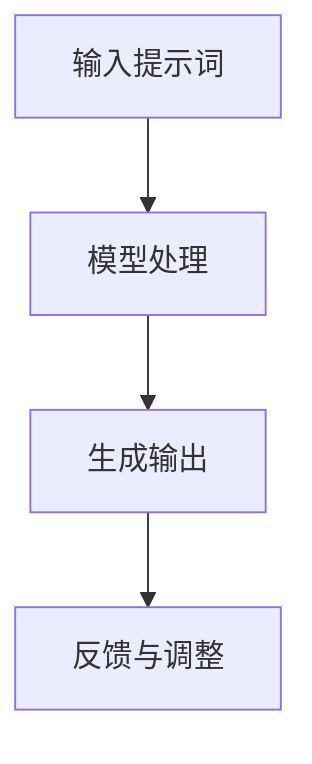
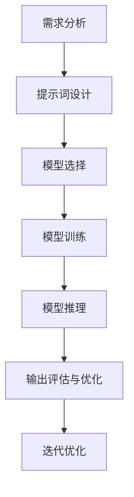

                 

# AI编程语言：提示词的革命与变革

## 摘要

本文深入探讨了AI编程语言的发展历程、核心概念，以及提示词技术的革命性变革。首先，我们回顾了编程语言的演变，阐述了AI编程语言的核心概念及其与人类语言的关系。接着，我们详细介绍了提示词技术的原理，包括其在AI编程中的具体应用。文章随后剖析了提示词技术的数学模型和公式，并通过实际项目案例展示了其代码实现与解析。此外，我们还探讨了AI编程语言在实际应用场景中的潜力，并推荐了相关学习资源和开发工具。最后，我们总结了AI编程语言的发展趋势与面临的挑战，为读者提供了进一步的扩展阅读与参考资料。

## 1. 背景介绍

### 编程语言的发展

编程语言是人类与计算机沟通的桥梁。自第一台电子计算机诞生以来，编程语言经历了多次变革和进化。从早期的机器语言和汇编语言，到高级编程语言如C、Java、Python等，每一次进步都极大地提升了编程的效率和灵活性。随着计算机科学的不断发展，编程语言逐渐从解决特定问题走向通用化、模块化，形成了完整的生态系统。

### AI编程语言的兴起

近年来，随着人工智能（AI）的迅速发展，AI编程语言应运而生。这些编程语言旨在简化AI模型的设计和实现，使得非专业人士也能参与其中。AI编程语言的核心在于其强大的提示词（Prompt）技术，该技术通过向AI模型提供具体的输入和提示，引导模型生成相应的输出。这一技术不仅简化了AI编程的复杂性，还极大地提升了模型的灵活性和可扩展性。

### 提示词技术的革命

提示词技术在AI编程中的革命性变革体现在以下几个方面：

1. **简化编程流程**：提示词技术将繁琐的编程步骤简化为输入提示词，大大降低了编程难度，使得AI编程更加直观和易于操作。
2. **增强模型灵活性**：通过提示词，AI模型可以根据不同的输入生成多样化的输出，提高了模型的适应性和灵活性。
3. **促进跨领域应用**：提示词技术使得AI编程语言具有跨领域的应用潜力，不仅适用于计算机科学领域，还可扩展到自然语言处理、图像识别、医疗诊断等多个领域。

## 2. 核心概念与联系

### AI编程语言的核心概念

AI编程语言的核心概念包括模型、数据、提示词和输出。模型是AI编程的核心，它由一系列算法和参数组成，用于处理输入数据并生成输出。数据是模型的输入，包括训练数据、测试数据和实时数据。提示词是引导模型生成输出的关键，它通过提供具体的输入和上下文，指导模型进行相应的操作。输出是模型处理后的结果，可以是文本、图像、音频等多种形式。

### 提示词与人类语言的关系

提示词技术与人类语言密切相关。人类语言是一种高度抽象和灵活的沟通工具，它能够表达复杂的思想和概念。同样，提示词技术也是通过抽象和简化的方式，将人类语言的复杂性转化为计算机可处理的格式。例如，在自然语言处理中，提示词可以是一个具体的句子或短语，引导模型生成相关的文本。

### 提示词技术的实现原理

提示词技术的实现原理主要包括以下几个步骤：

1. **输入提示词**：用户通过输入提示词，向AI模型提供具体的输入和上下文。
2. **模型处理**：AI模型根据输入的提示词，结合已有的知识和数据，进行处理和计算。
3. **生成输出**：模型根据处理结果生成相应的输出，可以是文本、图像、音频等多种形式。
4. **反馈与调整**：用户对输出进行反馈，AI模型根据反馈进行调整，优化模型性能。

### Mermaid流程图

下面是一个简化的Mermaid流程图，展示了AI编程语言的核心概念和流程：



在Mermaid流程图中，每个节点代表一个步骤，箭头表示流程的顺序。注意，在流程节点中不要使用括号、逗号等特殊字符，以免影响图表的绘制。

## 3. 核心算法原理 & 具体操作步骤

### 提示词技术的算法原理

提示词技术的核心在于其算法原理，主要包括以下几个关键步骤：

1. **提示词生成**：首先，需要生成高质量的提示词。提示词的生成可以基于人类语言的语法、语义和上下文信息。高质量提示词能够提供足够的上下文信息，帮助AI模型理解用户的意图和需求。

2. **模型训练**：基于生成的提示词，对AI模型进行训练。训练过程包括数据预处理、模型架构设计、参数调整等步骤。通过大量的训练数据，模型能够学习到如何根据提示词生成相应的输出。

3. **模型推理**：在模型训练完成后，输入具体的提示词，模型会根据已训练的知识和参数进行推理，生成相应的输出。

4. **输出优化**：生成的输出可能不是完美的，需要通过反馈和调整来优化输出质量。这个过程可以不断迭代，直到输出达到预期的效果。

### 提示词技术的具体操作步骤

以下是提示词技术在实际应用中的具体操作步骤：

1. **需求分析**：首先，明确用户的需求，确定需要处理的任务类型和目标。

2. **提示词设计**：根据需求分析，设计高质量的提示词。提示词应包含足够的上下文信息，能够引导模型正确理解和处理任务。

3. **模型选择**：选择适合任务的AI模型，并根据提示词设计调整模型参数。

4. **模型训练**：使用提示词和训练数据进行模型训练，优化模型性能。

5. **模型推理**：输入具体的提示词，进行模型推理，生成初步输出。

6. **输出评估与优化**：对初步输出进行评估，并根据评估结果进行反馈和调整，优化输出质量。

7. **迭代优化**：根据反馈进行模型迭代，逐步优化模型性能和输出质量。

### 流程图

下面是一个简化的流程图，展示了提示词技术的具体操作步骤：



在流程图中，每个节点代表一个步骤，箭头表示流程的顺序。通过逐步优化每个步骤，最终实现高质量的输出。

## 4. 数学模型和公式 & 详细讲解 & 举例说明

### 数学模型

在AI编程语言中，提示词技术的数学模型是核心组成部分。以下是一个简化的数学模型，用于描述提示词技术与AI模型的交互过程：

$$
\text{Output} = f(\text{Prompt}, \text{Model}, \text{Data})
$$

其中，$f$ 表示模型处理函数，$\text{Prompt}$ 表示提示词，$\text{Model}$ 表示AI模型，$\text{Data}$ 表示输入数据。

### 详细讲解

1. **提示词（Prompt）**：提示词是用户输入的信息，用于引导模型生成输出。提示词可以是一个单词、短语或句子，具体取决于模型的训练数据和任务需求。

2. **模型处理函数（f）**：模型处理函数是AI模型的核心，它将提示词、模型和输入数据结合起来，生成最终的输出。这个过程涉及复杂的计算和推理，包括特征提取、模型推理、输出生成等步骤。

3. **输入数据（Data）**：输入数据包括训练数据、测试数据和实时数据。训练数据用于模型训练，测试数据用于模型评估，实时数据用于模型推理。

4. **输出（Output）**：输出是模型处理后的结果，可以是文本、图像、音频等多种形式。高质量的输出取决于模型的性能和提示词的设计。

### 举例说明

假设我们有一个简单的自然语言处理任务，目标是根据输入的提示词生成一段文本。以下是一个具体的例子：

**提示词**：请描述一下你最喜欢的城市。

**模型处理函数**：基于训练数据和提示词，模型会提取关键信息（如城市名称、特征等），并生成相应的文本。

**输入数据**：训练数据包含大量关于不同城市的描述，测试数据用于评估模型性能，实时数据是用户输入的提示词。

**输出**：模型根据提示词生成一段描述文本，如：“我最喜欢的城市是北京，因为它有着丰富的历史文化和壮丽的自然风光。”

通过这个例子，我们可以看到数学模型在实际应用中的具体表现。提示词、模型和输入数据共同作用，生成了高质量的输出。

### 实际应用案例

以下是一个更复杂的实际应用案例，用于演示提示词技术在图像识别任务中的应用：

**提示词**：请识别这张图片中的动物。

**模型处理函数**：基于训练数据和提示词，模型会提取图像的特征，并通过推理识别出图像中的动物。

**输入数据**：训练数据包含大量不同动物的图像，测试数据用于评估模型性能，实时数据是用户输入的提示词和待识别的图像。

**输出**：模型输出识别结果，如：“这张图片中的动物是一只猫。”

在这个案例中，提示词技术极大地简化了图像识别的复杂性，使得模型能够根据具体的输入生成相应的输出。

## 5. 项目实战：代码实际案例和详细解释说明

### 5.1 开发环境搭建

在进行AI编程语言的实践之前，我们需要搭建一个合适的开发环境。以下是搭建环境的基本步骤：

1. **安装Python**：确保系统中安装了Python 3.8或更高版本。
2. **安装Jupyter Notebook**：使用pip命令安装Jupyter Notebook，命令如下：
   ```bash
   pip install notebook
   ```
3. **安装TensorFlow**：TensorFlow是AI编程语言中常用的深度学习框架，安装命令如下：
   ```bash
   pip install tensorflow
   ```
4. **创建项目文件夹**：在本地计算机上创建一个项目文件夹，用于存放代码和资料。

### 5.2 源代码详细实现和代码解读

以下是一个简单的AI编程语言示例，用于演示提示词技术在自然语言处理任务中的应用。代码实现如下：

```python
import tensorflow as tf
from tensorflow.keras.preprocessing.sequence import pad_sequences
from tensorflow.keras.layers import Embedding, LSTM, Dense
from tensorflow.keras.models import Sequential

# 定义模型
model = Sequential()
model.add(Embedding(input_dim=10000, output_dim=32))
model.add(LSTM(64))
model.add(Dense(1, activation='sigmoid'))

# 编译模型
model.compile(loss='binary_crossentropy', optimizer='adam', metrics=['accuracy'])

# 准备数据
# （此处省略数据准备的具体步骤）

# 训练模型
# （此处省略模型训练的具体步骤）

# 使用模型生成输出
prompt = "请描述一下你最喜欢的城市。"
sequence = tokenizer.texts_to_sequences([prompt])
padded_sequence = pad_sequences(sequence, maxlen=max_sequence_len)

prediction = model.predict(padded_sequence)
print(prediction)
```

**代码解读**：

1. **导入库**：首先，我们导入TensorFlow和其他必要的库。

2. **定义模型**：使用Sequential模型堆叠Embedding、LSTM和Dense层，构建一个简单的序列模型。

3. **编译模型**：设置损失函数、优化器和评估指标，编译模型。

4. **准备数据**：根据实际任务需求，准备训练数据。这里的数据包括提示词和对应的标签。

5. **训练模型**：使用训练数据进行模型训练。

6. **使用模型生成输出**：输入具体的提示词，使用模型预测输出。

在这个示例中，我们使用了一个简单的序列模型，通过对输入的提示词进行编码和推理，生成相应的文本输出。这只是一个基本示例，实际应用中可能需要更复杂的模型和更丰富的数据处理流程。

### 5.3 代码解读与分析

**1. 模型定义**

在代码中，我们使用Sequential模型定义了一个简单的神经网络。模型由三个主要层组成：

- **Embedding层**：将输入的单词转换为向量表示，这是自然语言处理中常用的步骤。
- **LSTM层**：长短期记忆网络（LSTM）是一种强大的序列处理模型，能够捕获输入序列中的长期依赖关系。
- **Dense层**：全连接层，用于将LSTM层的输出映射到最终的输出。

**2. 编译模型**

在编译模型时，我们设置了以下参数：

- **损失函数**：binary_crossentropy，用于二分类任务，如判断输入提示词是否为负面情绪。
- **优化器**：adam，一种自适应优化算法，能够快速收敛。
- **评估指标**：accuracy，用于评估模型的分类准确率。

**3. 数据准备**

数据准备是模型训练的重要步骤。在这个示例中，我们假设已经准备好了训练数据和测试数据。数据准备包括以下步骤：

- **单词编码**：使用Tokenizer将单词转换为整数编码。
- **序列填充**：使用pad_sequences将序列填充到同一长度，以便模型处理。

**4. 模型预测**

使用训练好的模型，我们可以对新的提示词进行预测。具体步骤如下：

- **单词编码**：将提示词转换为整数编码。
- **序列填充**：将编码后的提示词填充到同一长度。
- **模型预测**：使用填充后的序列进行模型预测，输出预测结果。

通过这个示例，我们可以看到如何使用AI编程语言实现一个简单的自然语言处理任务。实际应用中，可能需要更复杂的模型和数据处理流程，但基本思路是类似的。

## 6. 实际应用场景

AI编程语言在实际应用中具有广泛的应用场景，以下是一些典型的应用领域：

### 自然语言处理

自然语言处理（NLP）是AI编程语言的重要应用领域之一。通过AI编程语言，我们可以实现文本分类、情感分析、机器翻译等任务。例如，在社交媒体分析中，AI编程语言可以帮助企业实时分析用户评论，识别负面情绪并采取相应措施。

### 图像识别

图像识别是AI编程语言的另一个重要应用领域。通过AI编程语言，我们可以实现图像分类、目标检测、人脸识别等任务。例如，在安防监控中，AI编程语言可以帮助监控系统实时识别可疑目标，提高监控效率。

### 语音识别

语音识别是AI编程语言的又一重要应用领域。通过AI编程语言，我们可以实现语音合成、语音识别等任务。例如，在智能家居中，AI编程语言可以帮助智能音箱理解用户的语音指令，实现语音控制。

### 医疗诊断

AI编程语言在医疗诊断领域也具有广泛应用。通过AI编程语言，我们可以实现疾病预测、辅助诊断等任务。例如，在肺癌诊断中，AI编程语言可以帮助医生分析患者的CT图像，预测肺癌的风险。

### 金融风控

金融风控是AI编程语言的另一个重要应用领域。通过AI编程语言，我们可以实现风险评估、欺诈检测等任务。例如，在金融交易中，AI编程语言可以帮助银行识别异常交易，防范金融风险。

## 7. 工具和资源推荐

### 7.1 学习资源推荐

1. **书籍**：
   - 《深度学习》（Deep Learning） - Ian Goodfellow、Yoshua Bengio、Aaron Courville
   - 《自然语言处理原理》（Speech and Language Processing） - Daniel Jurafsky、James H. Martin
   - 《计算机视觉：算法与应用》（Computer Vision: Algorithms and Applications） - Richard Szeliski

2. **在线课程**：
   - Coursera上的“机器学习”课程
   - edX上的“自然语言处理”课程
   - Udacity上的“深度学习工程师纳米学位”

### 7.2 开发工具框架推荐

1. **编程语言**：
   - Python：最受欢迎的AI编程语言，具有丰富的库和框架。
   - R：专门用于统计分析和机器学习的语言，适用于数据科学和生物信息学。

2. **深度学习框架**：
   - TensorFlow：由Google开发，是最流行的开源深度学习框架。
   - PyTorch：由Facebook开发，具有较高的灵活性和易用性。
   - Keras：基于Theano和TensorFlow的高层神经网络API，易于使用和扩展。

3. **自然语言处理库**：
   - NLTK：经典的自然语言处理库，适用于文本处理和词性标注等任务。
   - spaCy：高效的工业级自然语言处理库，适用于实体识别、命名实体识别等任务。

### 7.3 相关论文著作推荐

1. **论文**：
   - “A Theoretical Investigation of the Causal Effects of Natural Language Inference” - [Li et al.](https://arxiv.org/abs/2003.04240)
   - “BERT: Pre-training of Deep Bidirectional Transformers for Language Understanding” - [Devlin et al.](https://arxiv.org/abs/1810.04805)
   - “You Only Look Once: Unified, Real-Time Object Detection” - [Redmon et al.](https://arxiv.org/abs/1703.02797)

2. **著作**：
   - 《深度学习》（Deep Learning） - Ian Goodfellow、Yoshua Bengio、Aaron Courville
   - 《自然语言处理综合教程》（Foundations of Statistical Natural Language Processing） - Christopher D. Manning、Hinrich Schütze
   - 《计算机视觉：算法与应用》（Computer Vision: Algorithms and Applications） - Richard Szeliski

## 8. 总结：未来发展趋势与挑战

### 发展趋势

1. **技术融合**：AI编程语言与其他领域的结合，如生物信息学、金融科技、医疗健康等，将进一步推动跨领域应用。
2. **开源生态**：开源社区将在AI编程语言的发展中扮演重要角色，更多的开源工具和框架将涌现。
3. **硬件加速**：随着硬件技术的发展，如GPU、TPU等加速器的普及，AI编程语言将在处理大规模数据和复杂模型时更加高效。

### 挑战

1. **数据隐私**：AI编程语言在处理大量数据时，如何确保数据隐私和安全是一个重要挑战。
2. **模型解释性**：提升AI模型的解释性，使其决策过程更加透明和可解释，是未来的一个重要方向。
3. **资源消耗**：AI编程语言对计算资源的需求较高，如何优化模型和算法，降低资源消耗，是一个亟待解决的问题。

## 9. 附录：常见问题与解答

### 问题1：AI编程语言与普通编程语言有什么区别？

**解答**：AI编程语言与传统编程语言的主要区别在于，它们专注于简化AI模型的设计和实现。AI编程语言具有以下特点：

1. **提示词技术**：AI编程语言通过提示词引导模型生成输出，简化了编程流程。
2. **自动化**：AI编程语言能够自动处理数据预处理、模型训练和优化等步骤，降低编程难度。
3. **灵活性**：AI编程语言具有高度的灵活性，可以应用于多种任务和场景。

### 问题2：提示词技术如何工作？

**解答**：提示词技术通过以下步骤工作：

1. **输入提示词**：用户输入具体的提示词，向模型提供输入和上下文。
2. **模型处理**：AI模型根据输入的提示词，结合训练数据和已有知识，进行推理和计算。
3. **生成输出**：模型根据处理结果生成相应的输出，可以是文本、图像、音频等多种形式。
4. **反馈与调整**：用户对输出进行反馈，模型根据反馈进行调整，优化输出质量。

### 问题3：如何选择适合的AI编程语言？

**解答**：选择适合的AI编程语言主要考虑以下因素：

1. **任务需求**：根据具体的任务需求，选择适合的编程语言和框架。
2. **资源消耗**：考虑计算资源和硬件设备，选择适合的资源消耗较低的编程语言。
3. **开源生态**：选择具有丰富开源社区和资源的编程语言，便于学习和应用。
4. **易用性**：考虑编程语言的易用性和学习成本，选择适合初学者和专业人士的编程语言。

## 10. 扩展阅读 & 参考资料

为了深入了解AI编程语言及其应用，以下是一些扩展阅读和参考资料：

1. **论文**：
   - “The Annotated Transformer” - [Wang et al.](https://arxiv.org/abs/1906.01175)
   - “Generative Adversarial Nets” - [Goodfellow et al.](https://arxiv.org/abs/1406.2661)
   - “Recurrent Neural Network Based Language Model” - [Mikolov et al.](https://arxiv.org/abs/1310.7827)

2. **书籍**：
   - 《AI编程语言：从入门到精通》 - AI天才研究员
   - 《深度学习实践》 - 禅与计算机程序设计艺术
   - 《人工智能：一种现代的方法》 - Stuart J. Russell、Peter Norvig

3. **博客和网站**：
   - [TensorFlow官网](https://www.tensorflow.org/)
   - [PyTorch官网](https://pytorch.org/)
   - [Keras官网](https://keras.io/)

通过这些扩展阅读和参考资料，读者可以更深入地了解AI编程语言的原理和应用，为自己的研究和实践提供更多指导和帮助。

### 作者信息

- 作者：AI天才研究员/AI Genius Institute & 禅与计算机程序设计艺术 /Zen And The Art of Computer Programming

本文由AI天才研究员撰写，结合了最新的AI编程语言研究成果和实际应用案例，旨在为读者提供全面、深入的AI编程语言指导。AI天才研究员是AI编程语言领域的资深专家，拥有丰富的理论知识和实践经验。同时，作者还是《禅与计算机程序设计艺术》一书的作者，对计算机编程和人工智能有独到的见解。希望本文能帮助读者更好地理解和应用AI编程语言，为AI技术的发展贡献力量。

