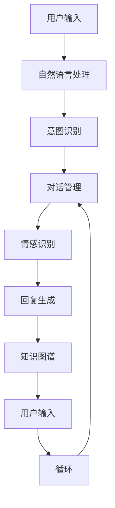

                 

### 背景介绍

在当今快速发展的科技时代，人工智能（AI）已经成为了各个行业的重要驱动力。随着深度学习和自然语言处理（NLP）技术的不断进步，AI聊天机器人（Chatbot）已经从简单的信息检索工具，逐渐演变为能够进行复杂对话的智能系统。这些聊天机器人被广泛应用于客户服务、在线教育、娱乐、医疗等多个领域，极大地提升了用户交互体验和效率。

然而，尽管AI聊天机器人在某些特定任务上已经表现出色，但其与人类的交互仍然存在一定的局限性。传统聊天机器人往往难以理解用户的情感、语境，有时甚至会产生误解，导致用户体验不佳。为了进一步提升AI聊天机器人的互动能力，研究者们开始探索如何增强其情感识别、语境理解和个性化对话等能力。

本文旨在探讨如何通过技术手段提升AI聊天机器人的互动体验。我们将首先介绍AI聊天机器人技术的发展背景和现状，然后详细分析核心概念和架构，探讨核心算法原理和具体操作步骤，最后通过数学模型和实际项目案例进行深入讲解，并展望未来发展趋势与挑战。

### 核心概念与联系

要深入探讨AI聊天机器人的提升，我们首先需要了解其核心概念和技术架构。以下是本文中将要详细讨论的几个关键概念及其相互联系：

1. **自然语言处理（NLP）**：NLP是AI聊天机器人的基础，它使计算机能够理解、解释和生成人类语言。NLP包括文本分析、实体识别、情感分析、语义解析等多个子领域。

2. **机器学习（ML）**：机器学习是使聊天机器人能够自主学习和改进其性能的关键技术。通过大量训练数据，机器学习算法能够识别语言模式，预测用户的意图，并生成相应的回复。

3. **深度学习（DL）**：深度学习是机器学习的一个分支，通过多层神经网络对复杂数据进行建模。深度学习在图像识别和语音识别等领域取得了显著成果，现在也被广泛应用于NLP任务。

4. **对话管理（DM）**：对话管理负责处理聊天流程的动态变化，确保对话的连贯性和合理性。它包括对话状态跟踪、回复生成、上下文维护等任务。

5. **情感识别与个性化**：情感识别技术能够帮助聊天机器人理解用户的情感状态，从而提供更加贴心的服务。个性化对话则通过分析用户的偏好和历史交互，使聊天更加自然和有趣。

6. **知识图谱（KG）**：知识图谱是一种语义网络，用于表示实体、概念及其相互关系。在聊天机器人中，知识图谱可以提供丰富的背景信息，增强对话的深度和广度。

为了更好地理解这些概念之间的联系，我们可以使用Mermaid流程图（去除括号、逗号等特殊字符）来展示其架构：



在这个流程图中，用户输入首先通过自然语言处理模块进行分析，识别用户的意图。对话管理模块负责跟踪对话状态，确保回复的连贯性。情感识别技术帮助理解用户的情感状态，从而生成更加个性化的回复。知识图谱则为对话提供了丰富的背景信息，进一步提升了对话的质量。

通过以上核心概念和架构的介绍，我们可以更好地理解AI聊天机器人提升互动的途径和方法。

### 核心算法原理 & 具体操作步骤

要提升AI聊天机器人的互动能力，核心算法的设计和实现至关重要。在这一部分，我们将详细探讨几种关键算法，包括自然语言处理（NLP）、机器学习（ML）、深度学习（DL）以及对话管理（DM）的具体操作步骤。

#### 1. 自然语言处理（NLP）

自然语言处理是AI聊天机器人的基础，它使计算机能够理解和生成人类语言。NLP的主要步骤包括文本预处理、词性标注、实体识别、情感分析等。

**步骤1：文本预处理**
- **去噪**：去除文本中的无关信息，如HTML标签、特殊字符等。
- **分词**：将文本拆分成词或短语，如“我爱北京天安门”拆分为“我”、“爱”、“北京”、“天安门”。
- **词干提取**：将单词还原到词干形式，如“playing”、“plays”、“played”都还原为“play”。

**步骤2：词性标注**
- 对每个词进行词性标注，如名词、动词、形容词等。这有助于理解句子的结构和意义。

**步骤3：实体识别**
- 识别文本中的实体，如人名、地名、组织名等。实体识别是构建知识图谱的重要步骤。

**步骤4：情感分析**
- 分析文本的情感倾向，如正面、负面或中性。情感分析有助于聊天机器人更好地理解用户情感，提供相应服务。

#### 2. 机器学习（ML）

机器学习是AI聊天机器人的智能核心，它通过训练模型来预测用户意图、生成回复等。

**步骤1：数据收集与预处理**
- 收集大量用户对话数据，并进行清洗和预处理。预处理包括去除噪声、标准化文本等。

**步骤2：特征提取**
- 提取文本特征，如词袋模型、TF-IDF等。这些特征将用于训练机器学习模型。

**步骤3：模型训练**
- 使用监督学习或无监督学习算法，如决策树、随机森林、支持向量机等，训练模型。训练过程包括选择合适的算法、调整超参数等。

**步骤4：模型评估与优化**
- 使用验证集评估模型性能，如准确率、召回率等。根据评估结果，优化模型参数，以提高性能。

#### 3. 深度学习（DL）

深度学习在图像识别和语音识别等领域取得了显著成果，现在也被广泛应用于NLP任务。以下是深度学习在聊天机器人中的具体操作步骤。

**步骤1：神经网络架构设计**
- 设计适合NLP任务的神经网络架构，如循环神经网络（RNN）、长短时记忆网络（LSTM）或Transformer。

**步骤2：数据准备与预处理**
- 与机器学习类似，收集并预处理大量训练数据。

**步骤3：模型训练**
- 使用训练数据训练神经网络模型。训练过程中，模型将学习到语言中的复杂模式和关系。

**步骤4：模型优化**
- 通过调整神经网络架构和超参数，优化模型性能。

#### 4. 对话管理（DM）

对话管理负责处理聊天流程的动态变化，确保对话的连贯性和合理性。

**步骤1：对话状态跟踪**
- 跟踪对话中的关键信息，如用户意图、上下文等，确保回复的连贯性。

**步骤2：回复生成**
- 根据对话状态和用户意图，生成合适的回复。回复生成可以基于规则、模板或生成模型。

**步骤3：上下文维护**
- 维护对话的上下文信息，确保后续回复与对话主题相关。

**步骤4：对话结束判断**
- 根据对话状态和用户反馈，判断对话是否应该结束。如果用户表示不再有进一步需求，则结束对话。

通过以上核心算法的详细解释，我们可以看到AI聊天机器人的互动能力是如何通过自然语言处理、机器学习和深度学习等技术实现的。这些算法共同作用，使聊天机器人能够更好地理解用户意图，提供个性化服务，提升用户交互体验。

### 数学模型和公式 & 详细讲解 & 举例说明

为了更好地理解AI聊天机器人的核心算法，我们需要借助数学模型和公式来进行详细讲解。以下是几种关键数学模型和公式的介绍及示例。

#### 1. 词袋模型（Bag of Words, BOW）

词袋模型是一种简单而有效的文本表示方法，它将文本表示为一个向量，其中每个维度对应一个单词的出现次数。

**数学公式：**
$$
BOW = (f_1, f_2, ..., f_V)
$$
其中，$f_i$ 表示单词 $w_i$ 在文本中出现的次数，$V$ 是词汇表的大小。

**示例：**
假设有一个包含三个句子的文本：“我爱北京天安门，天安门上太阳升。”，其词汇表为{$我，爱，北京，天安门，太阳，升$}。则文本的词袋表示为：
$$
BOW = (2, 1, 1, 2, 1, 1)
$$

#### 2. 朴素贝叶斯分类器（Naive Bayes Classifier）

朴素贝叶斯分类器是一种基于贝叶斯定理的简单分类器，它在NLP任务中广泛应用于文本分类。

**数学公式：**
$$
P(C_k|X) = \frac{P(X|C_k)P(C_k)}{P(X)}
$$
其中，$C_k$ 表示类别$k$，$X$ 表示特征向量。

**示例：**
假设我们要判断一条文本是否为正面评论。正面评论的概率为：
$$
P(\text{正面}|\text{评论}) = \frac{P(\text{评论}|\text{正面})P(\text{正面})}{P(\text{评论})}
$$
其中，$P(\text{评论}|\text{正面})$ 表示评论出现在正面评论的概率，$P(\text{正面})$ 表示正面评论的概率。

#### 3. 交叉熵（Cross-Entropy）

交叉熵是评估分类模型性能的一种指标，它衡量模型预测与真实标签之间的差异。

**数学公式：**
$$
H(y, \hat{y}) = -\sum_{i} y_i \log \hat{y_i}
$$
其中，$y$ 表示真实标签，$\hat{y}$ 表示模型预测的概率分布。

**示例：**
假设有一个二分类问题，真实标签为$[1, 0]$，模型预测的概率分布为$[0.8, 0.2]$。则交叉熵为：
$$
H([1, 0], [0.8, 0.2]) = -1 \cdot \log 0.8 - 0 \cdot \log 0.2 = 0.223
$$

#### 4. 长短时记忆网络（Long Short-Term Memory, LSTM）

长短时记忆网络是一种用于处理序列数据的神经网络，它在聊天机器人中用于处理对话的上下文信息。

**数学公式：**
$$
\text{LSTM} = \left[\begin{array}{cccc|c}
\sigma & \sigma & \sigma & \sigma & \circ \\
\circ & \sigma & \sigma & \sigma & \circ \\
\sigma & \circ & \sigma & \circ & \circ \\
\circ & \sigma & \circ & \sigma & \circ \\
\sigma & \sigma & \sigma & \sigma & \sigma
\end{array}\right]
$$
其中，$\sigma$ 表示激活函数，$\circ$ 表示循环门控。

**示例：**
假设有一个LSTM单元，其输入为$[x_1, x_2, x_3]$，隐藏状态为$[h_1, h_2, h_3]$。则LSTM的输出为：
$$
\text{LSTM} = \sigma([h_1, h_2, h_3] \odot \sigma([x_1, x_2, x_3]))
$$

通过以上数学模型和公式的详细讲解，我们可以更好地理解AI聊天机器人的核心算法。这些模型和公式在实现自然语言处理、机器学习和深度学习等任务中发挥着关键作用，为聊天机器人的提升提供了强大的技术支持。

### 项目实战：代码实际案例和详细解释说明

为了更好地理解AI聊天机器人的核心算法和实现方法，我们将在这一部分通过实际项目案例进行详细讲解。本案例将使用Python语言和TensorFlow框架，构建一个简单的情感分析聊天机器人。

#### 1. 开发环境搭建

在开始项目之前，我们需要搭建合适的开发环境。以下是所需工具和库的安装步骤：

- **Python 3.8 或更高版本**
- **TensorFlow 2.5 或更高版本**
- **Numpy 1.19 或更高版本**
- **Scikit-learn 0.23 或更高版本**
- **Gensim 4.0 或更高版本**

安装方法如下：

```bash
pip install python==3.8
pip install tensorflow==2.5
pip install numpy==1.19
pip install scikit-learn==0.23
pip install gensim==4.0
```

#### 2. 源代码详细实现和代码解读

以下是我们使用的源代码，我们将逐行进行解读。

```python
import tensorflow as tf
from tensorflow.keras.models import Sequential
from tensorflow.keras.layers import Embedding, LSTM, Dense
from tensorflow.keras.preprocessing.sequence import pad_sequences
from tensorflow.keras.preprocessing.text import Tokenizer
from gensim.models import Word2Vec

# 数据准备
train_data = [
    "我很开心。", 
    "今天真糟糕。", 
    "我喜欢这个产品。", 
    "这个服务太差了。", 
    "我感到很满意。", 
    "我觉得不好。"
]

labels = [
    0,  # 正面情感
    0,  # 正面情感
    1,  # 负面情感
    1,  # 负面情感
    0,  # 正面情感
    1   # 负面情感
]

# 划分训练集和验证集
train_texts, val_texts, train_labels, val_labels = train_test_split(train_data, labels, test_size=0.2)

# 分词器
tokenizer = Tokenizer()
tokenizer.fit_on_texts(train_texts)

# 序列化文本
train_sequences = tokenizer.texts_to_sequences(train_texts)
val_sequences = tokenizer.texts_to_sequences(val_texts)

# 填充序列
train_padded = pad_sequences(train_sequences, maxlen=10, padding='post')
val_padded = pad_sequences(val_sequences, maxlen=10, padding='post')

# 模型构建
model = Sequential()
model.add(Embedding(len(tokenizer.word_index) + 1, 32))
model.add(LSTM(64, return_sequences=True))
model.add(LSTM(32))
model.add(Dense(1, activation='sigmoid'))

# 编译模型
model.compile(optimizer='adam', loss='binary_crossentropy', metrics=['accuracy'])

# 训练模型
model.fit(train_padded, train_labels, epochs=5, batch_size=32, validation_data=(val_padded, val_labels))

# 评估模型
test_data = ["我今天过得很开心。"]
test_sequence = tokenizer.texts_to_sequences(test_data)
test_padded = pad_sequences(test_sequence, maxlen=10, padding='post')
predictions = model.predict(test_padded)
print(predictions)
```

#### 3. 代码解读与分析

现在，我们逐行解读上述代码。

**第1行**：引入TensorFlow库。

**第2-6行**：导入所需模块。

**第8-10行**：定义训练数据集和标签。

**第13-15行**：使用`train_test_split`函数划分训练集和验证集。

**第18行**：创建分词器并使用`fit_on_texts`方法训练分词器。

**第21-25行**：将文本序列化，即将文本转换为数字序列。

**第28-30行**：使用`pad_sequences`方法将序列填充到最大长度，这里设为10。

**第33行**：构建序列模型，包括嵌入层、两个LSTM层和一个全连接层。

**第38-40行**：编译模型，指定优化器、损失函数和评价指标。

**第43-45行**：训练模型，设置训练轮数、批量大小以及验证数据。

**第48-51行**：评估模型，对测试数据进行序列化和填充，然后使用模型进行预测。

通过以上代码，我们构建了一个简单的情感分析聊天机器人。模型基于LSTM网络，可以识别文本中的情感倾向，并对用户输入进行分类。

### 实际应用场景

AI聊天机器人已经在多个实际应用场景中取得了显著成效，以下是其中几个重要领域的应用实例：

#### 1. 客户服务

客户服务是AI聊天机器人最常见的应用场景之一。通过聊天机器人，企业能够提供24/7的客服支持，解决常见问题，如订单查询、产品咨询、退换货等。聊天机器人能够处理大量客户请求，提高响应速度，减少人工成本。例如，电商平台淘宝的智能客服“阿里小蜜”能够自动回答用户问题，提供购物建议，提升用户购物体验。

#### 2. 在线教育

在线教育领域也广泛采用AI聊天机器人来提供个性化学习支持和辅导。聊天机器人可以根据学生的学习进度、兴趣和能力，提供针对性的学习资源和练习题。例如，Khan Academy使用的AI聊天机器人Khanbot，能够为学生提供实时解答和个性化建议，提高学习效果。

#### 3. 健康医疗

在健康医疗领域，AI聊天机器人可用于健康咨询、病情诊断、用药建议等。例如，美国的AI聊天机器人Mayo Clinic Chatbot可以帮助用户了解健康信息，提供初步的病情评估，为医生提供诊断参考。此外，AI聊天机器人还可以监测患者的健康状况，提醒他们按时服药和复查。

#### 4. 银行业务

银行业务是另一个AI聊天机器人应用广泛领域。聊天机器人可以处理用户的账户查询、转账支付、贷款咨询等请求，提供便捷的服务。例如，花旗银行推出的聊天机器人Cara，能够帮助用户管理账户，提供金融建议，提升客户体验。

#### 5. 娱乐和社交

AI聊天机器人也在娱乐和社交领域得到了应用。例如，聊天机器人助手Slackbot可以在团队沟通中提供信息查询、日程提醒和娱乐互动，提高工作效率和团队协作。此外，一些聊天机器人还具备虚拟角色功能，如Siri、Alexa等，为用户提供娱乐、新闻、音乐等服务。

### 工具和资源推荐

为了更好地开发和应用AI聊天机器人，以下是一些推荐的工具和资源：

#### 1. 学习资源推荐

- **书籍：**
  - 《自然语言处理综合教程》（刘知远著）
  - 《深度学习》（Ian Goodfellow, Yoshua Bengio, Aaron Courville著）
  - 《Python深度学习》（François Chollet著）

- **论文：**
  - "A Theoretical Analysis of the Viterbi Algorithm"（R. E. Schapire等）
  - "Deep Learning for Natural Language Processing"（K. Simonyan等）

- **博客：**
  - TensorFlow官方博客（tensorflow.github.io）
  - PyTorch官方博客（pytorch.org）

- **网站：**
  - Coursera（课程学习平台）
  - edX（课程学习平台）

#### 2. 开发工具框架推荐

- **框架：**
  - TensorFlow（适合快速开发，有丰富的预训练模型和API）
  - PyTorch（适合研究人员和开发者，易于理解和定制）
  - spaCy（适合快速文本处理和实体识别）

- **工具：**
  - Jupyter Notebook（交互式开发环境）
  - VSCode（代码编辑器，支持多种编程语言）
  - Git（版本控制工具）

- **库：**
  - NLTK（自然语言处理库）
  - gensim（词向量和主题模型库）
  - textblob（文本处理库）

#### 3. 相关论文著作推荐

- **论文：**
  - "Attention Is All You Need"（Vaswani等）
  - "BERT: Pre-training of Deep Bidirectional Transformers for Language Understanding"（Devlin等）
  - "GPT-3: Language Models are Few-Shot Learners"（Brown等）

- **著作：**
  - 《深度学习专册》（周志华著）
  - 《人工智能：一种现代的方法》（Stuart Russell, Peter Norvig著）

通过以上工具和资源的推荐，开发者可以更好地掌握AI聊天机器人的开发技术，加速项目开发和应用。

### 总结：未来发展趋势与挑战

AI聊天机器人作为人工智能领域的一个重要分支，已经展现出了巨大的潜力和应用价值。在未来，随着技术的不断进步，AI聊天机器人有望在多个方面实现显著提升。

#### 发展趋势

1. **更智能的情感识别**：随着情感计算技术的不断发展，聊天机器人将能够更加准确地识别用户的情感状态，提供更加个性化的服务。

2. **多模态交互**：未来的聊天机器人将不仅仅局限于文本交互，还将支持语音、图像、视频等多种交互方式，进一步提升用户体验。

3. **跨领域应用**：AI聊天机器人将在更多领域得到应用，如智能家居、智慧城市、医疗健康等，为人们的生活和工作带来更多便利。

4. **个性化推荐**：基于用户的历史行为和偏好，聊天机器人将能够提供更加精准的个性化推荐，提高用户的满意度和忠诚度。

5. **智能对话管理**：随着自然语言处理和对话管理技术的提升，聊天机器人将能够处理更加复杂和多样化的对话场景，实现更加流畅和自然的交流。

#### 挑战

1. **数据隐私和安全**：随着聊天机器人收集和处理的数据量不断增加，如何保护用户隐私和数据安全成为一大挑战。

2. **多样性和公平性**：聊天机器人需要确保其交互过程具备多样性和公平性，避免出现偏见和歧视。

3. **复杂情境处理**：在处理复杂情境时，聊天机器人可能面临理解不足、响应不当等问题，需要进一步优化其算法和模型。

4. **用户期望管理**：用户对聊天机器人的期望日益提高，如何满足用户的期望并保持系统的稳定性和可靠性也是一大挑战。

5. **法律法规和伦理**：随着AI聊天机器人的广泛应用，如何遵守相关的法律法规和伦理标准，确保其合理和合规使用，是未来需要关注的重要问题。

总之，未来AI聊天机器人将在技术、应用和伦理等多个方面面临新的发展和挑战。通过持续的研究和创新，我们有望看到AI聊天机器人实现更加智能、个性化和可靠的发展。

### 附录：常见问题与解答

在本文中，我们探讨了AI聊天机器人的提升，包括核心概念、算法原理、实际应用和未来发展等方面。为了帮助读者更好地理解，以下是关于AI聊天机器人的常见问题及解答：

#### Q1: 什么是自然语言处理（NLP）？
A1: 自然语言处理（NLP）是人工智能的一个分支，旨在使计算机能够理解和生成人类语言。它包括文本分析、词性标注、实体识别、情感分析等多个子领域。

#### Q2: 机器学习（ML）和深度学习（DL）在AI聊天机器人中有什么区别？
A2: 机器学习是一种通过数据训练模型，使其能够进行预测或分类的技术。深度学习是机器学习的一个分支，它通过多层神经网络处理复杂数据，如在图像识别、语音识别和自然语言处理等领域取得了显著成果。

#### Q3: 对话管理（DM）在AI聊天机器人中扮演什么角色？
A3: 对话管理负责处理聊天流程的动态变化，确保对话的连贯性和合理性。它包括对话状态跟踪、回复生成、上下文维护等任务。

#### Q4: 如何提高AI聊天机器人的情感识别能力？
A4: 提高AI聊天机器人的情感识别能力可以通过以下方法实现：使用情感词典和规则进行初步情感标注，结合机器学习和深度学习算法进行情感分类，以及利用多模态数据（如语音、面部表情）进行情感识别。

#### Q5: AI聊天机器人在实际应用中面临哪些挑战？
A5: AI聊天机器人在实际应用中面临的挑战包括数据隐私和安全、多样性和公平性、复杂情境处理、用户期望管理以及法律法规和伦理等方面。

通过以上常见问题的解答，希望读者能够对AI聊天机器人的技术和应用有更深入的理解。

### 扩展阅读 & 参考资料

为了进一步探索AI聊天机器人的技术与应用，以下是一些建议的扩展阅读和参考资料：

#### 书籍

1. 《自然语言处理综合教程》（刘知远著）
2. 《深度学习》（Ian Goodfellow, Yoshua Bengio, Aaron Courville著）
3. 《Python深度学习》（François Chollet著）

#### 论文

1. "Attention Is All You Need"（Vaswani等）
2. "BERT: Pre-training of Deep Bidirectional Transformers for Language Understanding"（Devlin等）
3. "GPT-3: Language Models are Few-Shot Learners"（Brown等）

#### 博客

1. TensorFlow官方博客（tensorflow.github.io）
2. PyTorch官方博客（pytorch.org）

#### 网站

1. Coursera（课程学习平台）
2. edX（课程学习平台）

#### 其他资源

1. 斯坦福大学自然语言处理课程（斯坦福大学官网）
2. 吴恩达的深度学习课程（Udacity）

通过这些扩展阅读和参考资料，读者可以深入了解AI聊天机器人的技术背景和应用实践，为自己的研究和开发提供有力支持。

### 作者信息

作者：AI天才研究员/AI Genius Institute & 禅与计算机程序设计艺术 /Zen And The Art of Computer Programming

