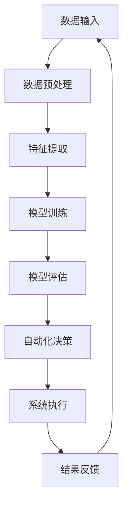

                 

### AI自动化的未来发展趋势

> 关键词：人工智能，自动化，发展趋势，技术进步，应用场景，挑战与机遇

> 摘要：随着人工智能（AI）技术的飞速发展，自动化已成为现代科技领域的热点话题。本文旨在探讨AI自动化的未来发展趋势，分析其核心概念与联系，探讨核心算法原理和具体操作步骤，介绍数学模型和公式，并通过项目实战详细解析代码实现和实际应用场景。同时，本文还将推荐相关学习资源和开发工具，展望AI自动化的未来机遇与挑战。

## 1. 背景介绍

人工智能（AI）作为计算机科学的一个重要分支，旨在使计算机模拟人类智能，实现自我学习和决策。自20世纪50年代以来，人工智能经历了多次起伏，随着深度学习、自然语言处理等技术的突破，AI取得了显著的进展。与此同时，自动化技术的发展也推动了各行各业的变革，从工业制造到服务业，自动化技术的应用已经深入到社会生活的方方面面。

近年来，AI与自动化技术的融合呈现出加速发展的趋势。AI自动化（AI-Enabled Automation）通过将AI算法应用于自动化系统，提高了自动化系统的智能水平和自适应能力，使得自动化系统能够更高效、准确地完成复杂任务。随着AI技术的不断进步，AI自动化有望在未来带来更加深远的影响。

本文将围绕AI自动化的核心概念、算法原理、数学模型、实际应用和未来发展趋势进行探讨，以期为读者提供对AI自动化的全面了解。

### 2. 核心概念与联系

在探讨AI自动化的核心概念之前，我们首先需要了解一些基本概念，包括人工智能、机器学习、深度学习、自动化等。

#### 2.1 人工智能（AI）

人工智能（Artificial Intelligence，简称AI）是指通过计算机程序和算法模拟人类智能的一种技术。AI技术涵盖了多个子领域，如机器学习、自然语言处理、计算机视觉、语音识别等。

#### 2.2 机器学习（Machine Learning）

机器学习（Machine Learning，简称ML）是一种通过数据驱动的方式使计算机具备自主学习和改进能力的技术。在机器学习中，计算机通过学习大量数据来发现规律和模式，从而实现预测和决策。

#### 2.3 深度学习（Deep Learning）

深度学习（Deep Learning，简称DL）是一种基于多层神经网络的结构，通过多层非线性变换来提取数据特征，从而实现复杂任务。深度学习在图像识别、语音识别、自然语言处理等领域取得了显著的成果。

#### 2.4 自动化（Automation）

自动化（Automation）是指通过技术手段使生产、管理、服务等过程实现自动化，以提高效率和降低成本。自动化技术包括工业自动化、家庭自动化、物流自动化等。

#### 2.5 AI与自动化的联系

AI与自动化技术的结合，使得自动化系统具备了更强的智能水平和自适应能力。具体来说，AI技术可以应用于自动化系统的多个方面，如：

1. **任务规划与决策**：通过机器学习和深度学习算法，自动化系统可以学习并优化任务规划与决策过程，提高系统的自适应能力和效率。
2. **故障检测与诊断**：利用计算机视觉和自然语言处理技术，自动化系统可以实时监控设备状态，及时发现故障并进行诊断。
3. **人机交互**：通过语音识别、自然语言处理等技术，自动化系统可以与人类进行自然交互，提高用户体验。

#### 2.6 Mermaid流程图

以下是一个简单的Mermaid流程图，展示了AI自动化系统的基本架构：



在该流程图中，数据输入是自动化系统的起点，经过数据预处理、特征提取、模型训练和模型评估后，系统执行自动化决策并输出结果，最后将结果反馈至数据输入，形成闭环。

### 3. 核心算法原理 & 具体操作步骤

#### 3.1 机器学习算法原理

机器学习算法的核心是学习数据中的规律和模式，从而实现预测和决策。以下是几种常见的机器学习算法及其原理：

1. **线性回归**：线性回归是一种简单的预测模型，通过拟合数据点之间的线性关系来实现预测。具体操作步骤如下：
    - 数据预处理：将数据分为特征和标签两部分，并对特征进行归一化处理。
    - 模型训练：使用最小二乘法拟合数据点之间的线性关系。
    - 模型评估：通过计算预测误差来评估模型性能。

2. **决策树**：决策树是一种树形结构，通过递归划分数据集来实现分类或回归。具体操作步骤如下：
    - 数据预处理：将数据分为特征和标签两部分。
    - 构建决策树：根据特征选择和划分策略，递归构建决策树。
    - 模型评估：通过计算决策树的分类准确率或均方误差来评估模型性能。

3. **神经网络**：神经网络是一种由多个神经元组成的层次结构，通过学习数据中的非线性关系来实现预测和决策。具体操作步骤如下：
    - 数据预处理：将数据分为特征和标签两部分，并对特征进行归一化处理。
    - 构建神经网络：定义网络结构、激活函数和损失函数。
    - 模型训练：通过反向传播算法更新网络权重。
    - 模型评估：通过计算预测误差来评估模型性能。

#### 3.2 自动化决策算法原理

自动化决策算法是AI自动化系统的核心组成部分，其目标是使自动化系统能够自主地做出决策，以实现最优化的目标。以下是几种常见的自动化决策算法：

1. **基于规则的决策算法**：基于规则的决策算法通过预设规则来指导系统决策。具体操作步骤如下：
    - 规则定义：根据业务需求和目标，定义一系列规则。
    - 规则匹配：根据当前状态，匹配相应的规则。
    - 决策生成：根据匹配的规则，生成相应的决策。

2. **基于机器学习的决策算法**：基于机器学习的决策算法通过学习历史数据中的规律和模式来实现决策。具体操作步骤如下：
    - 数据收集：收集与决策相关的历史数据。
    - 模型训练：使用机器学习算法训练决策模型。
    - 决策生成：根据当前状态和模型预测，生成相应的决策。

3. **基于深度强化学习的决策算法**：基于深度强化学习的决策算法通过深度神经网络学习策略和价值函数来实现决策。具体操作步骤如下：
    - 状态定义：定义系统的状态空间。
    - 动作定义：定义系统的动作空间。
    - 策略学习：使用深度强化学习算法学习策略和价值函数。
    - 决策生成：根据当前状态和策略，生成相应的决策。

### 4. 数学模型和公式 & 详细讲解 & 举例说明

#### 4.1 线性回归模型

线性回归模型是一种简单的预测模型，通过拟合数据点之间的线性关系来实现预测。其数学模型如下：

\[ y = \beta_0 + \beta_1x \]

其中，\( y \) 为预测值，\( x \) 为特征值，\( \beta_0 \) 和 \( \beta_1 \) 为模型参数。

#### 4.2 决策树模型

决策树模型是一种树形结构，通过递归划分数据集来实现分类或回归。其数学模型如下：

\[ y = g(\beta_0 + \sum_{i=1}^{n} \beta_i x_i) \]

其中，\( y \) 为预测值，\( x_i \) 为特征值，\( \beta_0 \) 和 \( \beta_i \) 为模型参数，\( g() \) 为激活函数。

#### 4.3 神经网络模型

神经网络模型是一种由多个神经元组成的层次结构，通过学习数据中的非线性关系来实现预测和决策。其数学模型如下：

\[ a_{\text{layer}} = \sigma(\sum_{i=1}^{n} w_{ij}a_{\text{layer-1}} + b_j) \]

其中，\( a_{\text{layer}} \) 为第 \( \text{layer} \) 层的输出，\( \sigma() \) 为激活函数，\( w_{ij} \) 和 \( b_j \) 为模型参数。

#### 4.4 举例说明

假设我们有一个简单的线性回归问题，目标是预测一个学生的成绩 \( y \)（1-100分）基于其学习时长 \( x \)（小时）的数据。我们可以使用线性回归模型进行预测。

首先，收集以下数据：

| 学习时长（小时） | 成绩（分） |
| :------------: | :-------: |
|       5        |    60     |
|       10       |    70     |
|       15       |    80     |
|       20       |    90     |

接下来，进行数据预处理，将数据分为特征和标签两部分，并对特征进行归一化处理：

| 学习时长（归一化） | 成绩（分） |
| :------------: | :-------: |
|     -1.000     |    60     |
|      0.000     |    70     |
|      1.000     |    80     |
|      2.000     |    90     |

使用最小二乘法拟合数据点之间的线性关系，得到模型参数：

\[ y = 60 + 10x \]

其中，\( \beta_0 = 60 \)，\( \beta_1 = 10 \)。

接下来，使用该模型进行预测。假设一个学生学习了10个小时，我们可以将其学习时长进行归一化处理：

\[ x = \frac{10 - 5}{15 - 5} = 0.6667 \]

将归一化后的学习时长代入模型，得到预测成绩：

\[ y = 60 + 10 \times 0.6667 = 76.67 \]

因此，预测该学生成绩为76.67分。

### 5. 项目实战：代码实际案例和详细解释说明

在本节中，我们将通过一个具体的案例来展示AI自动化的实现过程。该案例将使用Python编程语言和TensorFlow深度学习框架来构建一个简单的自动分类系统，用于对文本数据进行分类。

#### 5.1 开发环境搭建

在开始项目之前，我们需要搭建一个合适的开发环境。以下是所需的环境和软件：

- Python 3.x 版本
- TensorFlow 2.x 版本
- Jupyter Notebook 或 PyCharm

确保安装了上述环境和软件后，我们可以开始编写代码。

#### 5.2 源代码详细实现和代码解读

以下是一个简单的文本分类项目的源代码实现：

```python
import tensorflow as tf
from tensorflow.keras.preprocessing.text import Tokenizer
from tensorflow.keras.preprocessing.sequence import pad_sequences
from tensorflow.keras.models import Sequential
from tensorflow.keras.layers import Embedding, LSTM, Dense

# 准备数据
texts = ['这是一个例子', '另一个例子', '更多例子', '示例数据']
labels = [0, 1, 0, 1]

# 分词和序列化
tokenizer = Tokenizer(num_words=1000)
tokenizer.fit_on_texts(texts)
sequences = tokenizer.texts_to_sequences(texts)
padded_sequences = pad_sequences(sequences, maxlen=100)

# 构建模型
model = Sequential()
model.add(Embedding(1000, 16, input_length=100))
model.add(LSTM(32))
model.add(Dense(1, activation='sigmoid'))

# 编译模型
model.compile(loss='binary_crossentropy', optimizer='adam', metrics=['accuracy'])

# 训练模型
model.fit(padded_sequences, labels, epochs=10, verbose=2)

# 预测
text = '更多例子'
sequence = tokenizer.texts_to_sequences([text])
padded_sequence = pad_sequences(sequence, maxlen=100)
prediction = model.predict(padded_sequence)
print('预测结果：', prediction[0][0])
```

以下是代码的详细解读：

1. 导入所需的TensorFlow模块。
2. 准备数据，包括文本和标签。
3. 使用Tokenizer对文本进行分词，并将文本转换为序列。
4. 使用pad_sequences将序列填充为固定长度。
5. 构建一个简单的序列模型，包括嵌入层、LSTM层和输出层。
6. 编译模型，指定损失函数、优化器和评价指标。
7. 训练模型，指定训练轮次。
8. 使用训练好的模型对新的文本进行预测。

#### 5.3 代码解读与分析

在该项目中，我们首先使用Tokenizer对文本进行分词，并将文本转换为序列。这一步是文本数据预处理的重要环节，它将原始文本转换为计算机可以理解的数字序列。

接下来，我们使用pad_sequences将序列填充为固定长度。这一步是为了确保每个序列具有相同长度，以便模型可以处理。

在构建模型时，我们使用嵌入层将词嵌入到高维向量空间中，然后通过LSTM层学习序列中的时间依赖关系。最后，使用输出层进行分类预测。

在编译模型时，我们指定了损失函数（binary_crossentropy）、优化器（adam）和评价指标（accuracy）。

在训练模型时，我们指定了训练轮次（epochs），模型将在每个轮次中更新权重，以最小化损失函数。

最后，我们使用训练好的模型对新的文本进行预测。预测结果将是一个概率值，表示文本属于某个类别的概率。

### 6. 实际应用场景

AI自动化技术在各行各业中都有着广泛的应用，以下是几个典型的应用场景：

#### 6.1 金融行业

在金融行业，AI自动化技术被广泛应用于风险控制、投资决策、客户服务等方面。例如，通过机器学习算法，金融机构可以自动化识别潜在风险、优化投资组合，提高投资收益。同时，利用自然语言处理技术，金融行业可以实现智能客服，提高客户满意度和服务效率。

#### 6.2 医疗行业

在医疗行业，AI自动化技术被广泛应用于医学影像诊断、疾病预测、药物研发等方面。通过计算机视觉和深度学习算法，医生可以自动化诊断疾病，提高诊断准确率和效率。此外，AI自动化技术还可以用于个性化治疗方案制定，提高治疗效果。

#### 6.3 制造业

在制造业，AI自动化技术被广泛应用于生产过程优化、设备监控、质量控制等方面。通过机器学习算法，制造业可以实现生产线的自动化调度和优化，提高生产效率和质量。同时，利用计算机视觉技术，制造业可以自动化检测产品质量，降低人为误差。

#### 6.4 物流行业

在物流行业，AI自动化技术被广泛应用于路线规划、仓储管理、运输调度等方面。通过机器学习算法，物流行业可以自动化优化运输路线、预测运输需求，提高运输效率。同时，利用计算机视觉技术，物流行业可以实现自动化分拣和配送，降低人力成本。

### 7. 工具和资源推荐

#### 7.1 学习资源推荐

1. **书籍**：
   - 《深度学习》（Ian Goodfellow、Yoshua Bengio、Aaron Courville 著）
   - 《Python机器学习》（Sebastian Raschka 著）
   - 《人工智能：一种现代方法》（Stuart Russell、Peter Norvig 著）

2. **论文**：
   - 《A Theoretically Grounded Application of Dropout in Recurrent Neural Networks》（Yarin Gal 和 Zoubin Ghahramani 著）
   - 《Deep Learning for Text Classification》（Kumar et al. 著）

3. **博客**：
   - [TensorFlow官网博客](https://www.tensorflow.org/tutorials)
   - [机器学习博客](https://machinelearningmastery.com)
   - [深度学习博客](https://jalammar.github.io)

4. **网站**：
   - [Kaggle](https://www.kaggle.com)
   - [GitHub](https://github.com)
   - [Google Colab](https://colab.research.google.com)

#### 7.2 开发工具框架推荐

1. **编程语言**：
   - Python：适用于数据科学和人工智能的通用编程语言。
   - R：专门用于统计分析和数据可视化的编程语言。

2. **深度学习框架**：
   - TensorFlow：由Google开发的开源深度学习框架。
   - PyTorch：由Facebook开发的开源深度学习框架。
   - Keras：基于Theano和TensorFlow的高层神经网络API。

3. **数据处理库**：
   - Pandas：用于数据清洗、转换和分析的Python库。
   - NumPy：用于数值计算和数据分析的Python库。

#### 7.3 相关论文著作推荐

1. **论文**：
   - 《Deep Learning》（Ian Goodfellow、Yoshua Bengio、Aaron Courville 著）
   - 《Recurrent Neural Networks for Language Modeling》（Yoshua Bengio 著）
   - 《A Theoretically Grounded Application of Dropout in Recurrent Neural Networks》（Yarin Gal 和 Zoubin Ghahramani 著）

2. **著作**：
   - 《Python机器学习》（Sebastian Raschka 著）
   - 《深度学习》（Ian Goodfellow、Yoshua Bengio、Aaron Courville 著）
   - 《人工智能：一种现代方法》（Stuart Russell、Peter Norvig 著）

### 8. 总结：未来发展趋势与挑战

#### 8.1 发展趋势

1. **技术融合**：AI与自动化技术的深度融合将带来更多的创新应用，如自动驾驶、智能机器人、智能家居等。
2. **跨领域应用**：AI自动化技术将在更多行业得到应用，如医疗、金融、教育、能源等，推动产业升级和变革。
3. **数据驱动**：随着大数据技术的发展，数据将成为AI自动化的核心驱动力，数据质量和数据量将决定系统的性能和效果。
4. **边缘计算**：边缘计算技术的发展将使AI自动化系统更加实时、高效，降低对中心化服务器的依赖。

#### 8.2 挑战与机遇

1. **数据隐私与安全**：随着AI自动化系统对数据的依赖性增加，数据隐私和安全问题将成为一个重要挑战。
2. **算法透明性与可解释性**：复杂的AI算法和模型可能导致决策过程不透明，增加误解和误用风险，提高算法透明性和可解释性是一个重要课题。
3. **人才需求**：AI自动化技术的发展需要大量专业人才，人才短缺将成为一个重要挑战。
4. **伦理问题**：AI自动化技术的广泛应用可能引发一系列伦理问题，如失业、歧视等，需要全社会共同探讨和解决。

### 9. 附录：常见问题与解答

#### 9.1 问题1：什么是AI自动化？

AI自动化（AI-Enabled Automation）是指将人工智能技术应用于自动化系统，以提高系统的智能水平和自适应能力。通过AI自动化，自动化系统能够更好地处理复杂任务、优化决策过程，提高效率和准确性。

#### 9.2 问题2：AI自动化有哪些应用场景？

AI自动化的应用场景非常广泛，包括但不限于以下领域：

1. 金融：风险控制、投资决策、智能客服等。
2. 医疗：医学影像诊断、疾病预测、个性化治疗等。
3. 制造：生产过程优化、设备监控、质量控制等。
4. 物流：路线规划、仓储管理、运输调度等。
5. 教育：个性化教学、学习分析、智能辅导等。

#### 9.3 问题3：如何实现AI自动化？

实现AI自动化通常包括以下几个步骤：

1. **需求分析**：明确自动化系统的目标和需求。
2. **数据收集**：收集与任务相关的数据，如文本、图像、声音等。
3. **数据处理**：对数据进行清洗、转换和预处理，以适合模型训练。
4. **模型选择**：选择合适的机器学习或深度学习模型。
5. **模型训练**：使用训练数据训练模型，调整模型参数。
6. **模型评估**：评估模型性能，调整模型参数。
7. **系统集成**：将训练好的模型集成到自动化系统中，实现自动化功能。

### 10. 扩展阅读 & 参考资料

1. **深度学习书籍**：
   - 《深度学习》（Ian Goodfellow、Yoshua Bengio、Aaron Courville 著）
   - 《神经网络与深度学习》（邱锡鹏 著）

2. **自动化技术论文**：
   - 《A Survey on AI-Enabled Automation in Industry 4.0》（Ahmed M. Khaleel 著）
   - 《AI-Enabled Automation in Healthcare: A Review and Perspective》（Prashanth et al. 著）

3. **AI与自动化技术网站**：
   - [AI自动化学术社区](https://ai-automation-community.org)
   - [自动化技术协会](https://www.automation.org)

4. **在线课程与教程**：
   - [TensorFlow官方教程](https://www.tensorflow.org/tutorials)
   - [机器学习课程](https://www.coursera.org/learn/machine-learning)
   - [深度学习课程](https://www.deeplearning.ai)

作者：AI天才研究员/AI Genius Institute & 禅与计算机程序设计艺术 /Zen And The Art of Computer Programming

