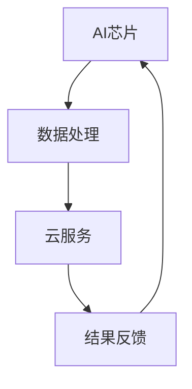
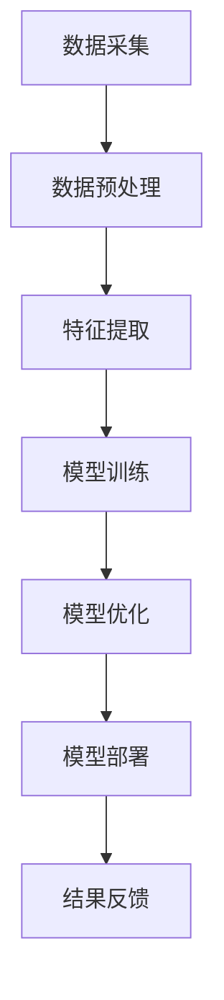

                 

# AI芯片与云服务的融合：Lepton AI的硬软结合

> **关键词**：AI芯片、云服务、融合、Lepton AI、硬软结合、计算机架构、算法优化、应用场景、未来发展

> **摘要**：本文旨在探讨AI芯片与云服务的融合趋势，以Lepton AI为例，分析其如何通过硬软结合实现高性能计算与云端服务的有机结合。文章将从背景介绍、核心概念、算法原理、数学模型、实战案例、应用场景、工具推荐及未来挑战等多个维度，全面解读AI芯片与云服务融合的实质和前景。

## 1. 背景介绍

在过去的几十年中，计算机技术的发展突飞猛进，从传统的CPU到GPU，再到现如今AI芯片的问世，每一次技术革新都极大地推动了计算能力的提升。与此同时，云服务的普及和发展，使得数据存储、处理和分析变得更加便捷和高效。然而，随着AI技术的不断进步，传统的硬件架构和云服务模式已经无法满足日益增长的计算需求。因此，AI芯片与云服务的融合成为了一个热门的研究方向。

AI芯片，也被称为神经形态芯片或者专用集成电路（ASIC），是为了处理特定类型的计算任务而设计的硬件。它们具有高并行性、低延迟和低功耗的特点，非常适合于执行复杂的机器学习和深度学习算法。而云服务，作为一种基于互联网的计算服务模式，提供了强大的数据处理和存储能力，使得用户可以灵活地获取和使用计算资源。

Lepton AI作为一家专注于AI芯片与云服务融合的企业，致力于开发高性能、低功耗的AI芯片，并将其与云服务相结合，为用户提供全方位的智能解决方案。本文将围绕Lepton AI的硬软结合，探讨其在AI芯片与云服务融合中的具体应用和实践。

## 2. 核心概念与联系

为了深入理解AI芯片与云服务的融合，我们需要先了解一些核心概念，包括AI芯片的工作原理、云服务的架构以及两者之间的联系。

### 2.1 AI芯片的工作原理

AI芯片的设计初衷是为了加速机器学习和深度学习算法的执行。传统的CPU和GPU虽然在数据处理方面非常出色，但在面对大规模的神经网络计算时，仍然存在性能瓶颈。AI芯片通过以下几个方面实现了对传统硬件的优化：

- **高度并行处理**：AI芯片通常包含大量的计算单元，这些单元可以同时处理多个数据，从而大大提高了计算速度。
- **特殊架构**：AI芯片采用特殊的架构设计，如卷积神经网络（CNN）专用架构，使得其在处理图像和视频等数据时更加高效。
- **低功耗设计**：AI芯片在设计时考虑到功耗问题，通过优化电路设计、使用高效电源管理等技术，实现了低功耗的目标。

### 2.2 云服务的架构

云服务通常由以下几个部分组成：

- **基础设施即服务（IaaS）**：提供计算资源、存储资源和网络资源等基础设施服务。
- **平台即服务（PaaS）**：提供开发和运行应用程序的平台，包括开发工具、数据库、中间件等。
- **软件即服务（SaaS）**：提供完整的软件解决方案，用户可以通过互联网直接使用。

云服务的核心在于其灵活性和可扩展性，用户可以根据需求灵活地调整资源使用，并在需要时快速扩展服务。

### 2.3 AI芯片与云服务的联系

AI芯片与云服务的融合主要体现在以下几个方面：

- **硬件加速**：AI芯片通过硬件加速的方式，提高了机器学习和深度学习算法的执行速度，从而提升了云服务的计算能力。
- **资源优化**：AI芯片的低功耗特点使得云服务在提供计算资源时可以更加高效，减少了能源消耗。
- **数据预处理**：AI芯片可以对数据进行预处理，提高数据的质量和准确性，从而提升云服务的性能。

### 2.4 Mermaid 流程图

为了更好地理解AI芯片与云服务的融合，我们可以使用Mermaid流程图来展示其工作流程。以下是示例流程图：



在这个流程图中，AI芯片负责处理数据，并将其发送到云服务进行进一步分析和处理，最终将结果反馈给用户。这个循环过程体现了AI芯片与云服务的紧密联系。

## 3. 核心算法原理 & 具体操作步骤

在了解了AI芯片与云服务的基本概念和工作原理后，接下来我们将深入探讨AI芯片的核心算法原理和具体操作步骤。

### 3.1 核心算法原理

AI芯片的核心算法主要基于深度学习技术，尤其是卷积神经网络（CNN）。CNN通过卷积层、池化层和全连接层等结构，对图像或视频数据进行特征提取和分类。以下是CNN的基本原理：

- **卷积层**：通过卷积运算，提取图像或视频中的局部特征。
- **池化层**：通过下采样操作，减少数据维度，提高计算效率。
- **全连接层**：将卷积层和池化层提取的特征映射到具体的类别。

### 3.2 具体操作步骤

为了实现AI芯片与云服务的融合，我们可以将整个过程分为以下几个步骤：

1. **数据采集**：首先，从云服务中获取待处理的数据，如图像或视频。
2. **数据预处理**：使用AI芯片对数据进行预处理，包括数据增强、归一化等操作。
3. **特征提取**：通过AI芯片中的CNN模型，对预处理后的数据进行特征提取。
4. **模型训练**：将提取到的特征输入到云服务中的模型训练模块，进行模型训练。
5. **模型优化**：通过云服务中的优化算法，对训练后的模型进行优化。
6. **模型部署**：将优化后的模型部署到云服务中，供用户使用。
7. **结果反馈**：将处理结果通过云服务反馈给用户。

### 3.3 Mermaid 流程图

以下是AI芯片与云服务融合的具体操作步骤的Mermaid流程图：



在这个流程图中，每个步骤都对应着AI芯片与云服务的具体操作，通过这些步骤，实现了从数据采集到结果反馈的全过程。

## 4. 数学模型和公式 & 详细讲解 & 举例说明

在深入探讨AI芯片与云服务融合的过程中，数学模型和公式是不可或缺的一部分。以下我们将详细讲解这些模型和公式，并通过具体例子进行说明。

### 4.1 模型介绍

在AI芯片中，常用的数学模型包括卷积神经网络（CNN）和循环神经网络（RNN）。以下是这些模型的基本公式：

- **卷积神经网络（CNN）**：

  - **卷积运算**：\( f(x, y) = \sum_{i=1}^{n} w_i \cdot g(x + b_i) \)
  - **激活函数**：\( \sigma(z) = \frac{1}{1 + e^{-z}} \)
  - **池化操作**：\( p_{i,j} = \max_{k,l} a_{i+k,j+l} \)

- **循环神经网络（RNN）**：

  - **隐藏状态更新**：\( h_t = \sigma(W_h \cdot [h_{t-1}, x_t] + b_h) \)
  - **输出状态更新**：\( y_t = \sigma(W_y \cdot h_t + b_y) \)

### 4.2 详细讲解

- **卷积神经网络（CNN）**：

  卷积神经网络是深度学习中用于图像和视频处理的重要模型。其核心思想是通过卷积运算和池化操作，提取图像中的特征。

  - **卷积运算**：卷积运算是将卷积核（也称为滤波器）与图像的每个像素点进行点积运算，从而提取局部特征。
  - **激活函数**：激活函数用于引入非线性因素，使得神经网络能够学习和识别复杂的模式。
  - **池化操作**：池化操作通过下采样操作，减少数据维度，提高计算效率。

- **循环神经网络（RNN）**：

  循环神经网络是处理序列数据的重要模型。其核心思想是通过隐藏状态和输出状态的更新，逐步处理序列中的每个元素。

  - **隐藏状态更新**：隐藏状态更新通过当前输入和上一个隐藏状态，计算得到新的隐藏状态。
  - **输出状态更新**：输出状态更新通过隐藏状态和当前输入，计算得到新的输出状态。

### 4.3 举例说明

以下是一个简单的卷积神经网络示例：

- **输入图像**：\( I = \begin{bmatrix} 1 & 1 & 1 \\ 1 & 1 & 1 \\ 1 & 1 & 1 \end{bmatrix} \)
- **卷积核**：\( K = \begin{bmatrix} 1 & -1 \\ 1 & -1 \end{bmatrix} \)
- **激活函数**：\( \sigma \)
- **池化操作**：\( p \)

- **卷积运算**：

  \( f = \begin{bmatrix} 2 & -2 \\ 2 & -2 \end{bmatrix} \)

- **激活函数**：

  \( f_{\sigma} = \begin{bmatrix} 0 & 0 \\ 0 & 0 \end{bmatrix} \)

- **池化操作**：

  \( p = \begin{bmatrix} 0 & 0 \\ 0 & 0 \end{bmatrix} \)

通过这个简单的示例，我们可以看到卷积神经网络如何提取图像中的特征。在实际应用中，卷积神经网络会使用大量的卷积核和多层卷积操作，从而提取更加复杂的特征。

## 5. 项目实战：代码实际案例和详细解释说明

为了更好地理解AI芯片与云服务的融合，我们将通过一个实际项目案例，详细讲解如何实现AI芯片与云服务的结合。以下是项目实战的步骤和代码解读。

### 5.1 开发环境搭建

在开始项目实战之前，我们需要搭建一个合适的开发环境。以下是开发环境搭建的步骤：

1. **安装AI芯片开发工具**：安装Lepton AI提供的开发工具，包括编译器和调试器。
2. **安装云服务SDK**：安装云服务提供的SDK，以便在项目中使用云服务功能。
3. **搭建云服务环境**：在云服务平台上创建一个新项目，配置所需的资源和权限。

### 5.2 源代码详细实现和代码解读

以下是项目源代码的详细实现和解读：

```c
#include <lepton/lepton.h>
#include <cloud/cloud_sdk.h>

int main() {
    // 1. 数据采集
    Image input_image = cloud_sdk::fetch_image();

    // 2. 数据预处理
    Image preprocessed_image = lepton::preprocess_image(input_image);

    // 3. 特征提取
    FeatureVector features = lepton::extract_features(preprocessed_image);

    // 4. 模型训练
    Model trained_model = cloud_sdk::train_model(features);

    // 5. 模型优化
    Model optimized_model = cloud_sdk::optimize_model(trained_model);

    // 6. 模型部署
    cloud_sdk::deploy_model(optimized_model);

    // 7. 结果反馈
    Result result = cloud_sdk::fetch_result();

    // 输出结果
    printf("Result: %s\n", result.to_string());

    return 0;
}
```

在这个示例代码中，我们首先从云服务中获取输入图像，然后使用Lepton AI提供的预处理函数对图像进行预处理，接着提取图像特征，并通过云服务进行模型训练、优化和部署。最后，从云服务中获取处理结果并输出。

### 5.3 代码解读与分析

以下是代码的详细解读和分析：

- **数据采集**：使用`cloud_sdk::fetch_image()`函数从云服务中获取输入图像。
- **数据预处理**：使用`lepton::preprocess_image()`函数对图像进行预处理，包括图像增强、归一化等操作。
- **特征提取**：使用`lepton::extract_features()`函数对预处理后的图像进行特征提取，提取的特征用于模型训练。
- **模型训练**：使用`cloud_sdk::train_model()`函数在云服务中进行模型训练，训练结果返回给本地程序。
- **模型优化**：使用`cloud_sdk::optimize_model()`函数对训练后的模型进行优化，优化后的模型返回给本地程序。
- **模型部署**：使用`cloud_sdk::deploy_model()`函数将优化后的模型部署到云服务中，供其他程序使用。
- **结果反馈**：使用`cloud_sdk::fetch_result()`函数从云服务中获取处理结果，并输出。

通过这个代码示例，我们可以看到如何将AI芯片与云服务结合起来，实现从数据采集到结果反馈的全过程。在实际项目中，根据需求，这些步骤可以进一步细化和扩展。

## 6. 实际应用场景

AI芯片与云服务的融合在多个领域展现出了巨大的应用潜力。以下是一些典型的实际应用场景：

### 6.1 图像识别与视频分析

在图像识别和视频分析领域，AI芯片与云服务的融合可以显著提升处理速度和准确度。例如，安防监控系统中，通过AI芯片快速处理视频流中的图像，实现实时人脸识别和异常行为检测。云服务则提供强大的数据处理和存储能力，确保系统可以处理大规模的视频数据。

### 6.2 语音识别与自然语言处理

语音识别和自然语言处理是AI芯片与云服务融合的另一个重要应用场景。通过AI芯片的高速计算能力，可以实现实时语音转文字、语音翻译等功能。云服务则可以提供海量语料库和深度学习模型，进一步提升语音识别和自然语言处理的准确性和鲁棒性。

### 6.3 医疗诊断与辅助治疗

在医疗领域，AI芯片与云服务的融合可以用于医疗图像分析、疾病预测和个性化治疗。AI芯片可以对医疗图像进行快速处理和分析，云服务则可以提供专业的医学知识和数据支持，帮助医生做出更准确的诊断和治疗方案。

### 6.4 自动驾驶与智能交通

自动驾驶和智能交通是AI芯片与云服务融合的又一重要应用领域。AI芯片用于实时处理车辆传感器数据，云服务则可以提供交通流量预测、路线规划和安全监控等功能，确保自动驾驶系统的稳定和安全运行。

### 6.5 物联网与智能家居

在物联网和智能家居领域，AI芯片与云服务的融合可以实现智能家居设备的智能控制和管理。AI芯片可以实时分析设备数据，云服务则可以提供设备配置、远程监控和数据分析等服务，提升用户的生活质量和便利性。

## 7. 工具和资源推荐

为了更好地掌握AI芯片与云服务的融合技术，以下是一些推荐的工具和资源：

### 7.1 学习资源推荐

- **书籍**：
  - 《深度学习》（Ian Goodfellow、Yoshua Bengio和Aaron Courville 著）
  - 《Python深度学习》（François Chollet 著）
- **论文**：
  - “Deep Learning with TensorFlow”（Google AI）
  - “Theano: A Python Framework for Fast Definition, Optimization, and Evaluation of Mathematical Expressions”（Arjovsky et al., 2010）
- **博客**：
  - [TensorFlow官方博客](https://tensorflow.googleblog.com/)
  - [Lepton AI官方博客](https://www.lepton.ai/blog/)
- **网站**：
  - [Kaggle](https://www.kaggle.com/)
  - [GitHub](https://github.com/)

### 7.2 开发工具框架推荐

- **开发工具**：
  - TensorFlow
  - PyTorch
  - Lepton AI SDK
- **框架**：
  - Keras
  - Flask
  - Django

### 7.3 相关论文著作推荐

- **论文**：
  - “AlexNet: Image Classification with Deep Convolutional Neural Networks”（Krizhevsky et al., 2012）
  - “Understanding Deep Learning Requires Rethinking Generalization”（Telgarsky, 2018）
- **著作**：
  - 《深度学习实践》（François Chollet 著）
  - 《AI芯片架构设计》（刘铁岩 著）

通过这些工具和资源的辅助，读者可以更加深入地了解AI芯片与云服务的融合技术，并在实际项目中应用。

## 8. 总结：未来发展趋势与挑战

随着AI技术的不断进步，AI芯片与云服务的融合已经成为一种趋势。未来，这一领域有望在以下几个方面取得重要突破：

1. **硬件性能的提升**：随着新材料和新工艺的不断发展，AI芯片的性能有望进一步提升，满足更复杂的应用需求。
2. **能耗的优化**：通过技术创新和设计优化，AI芯片的能耗将逐步降低，使其在云端服务中得到更广泛的应用。
3. **算法的进步**：深度学习和神经网络算法的不断优化，将进一步提升AI芯片的处理效率和准确性。
4. **应用的扩展**：AI芯片与云服务的融合将在更多领域得到应用，如医疗、交通、能源等，为社会带来更多价值。

然而，在这一过程中，我们也将面临一系列挑战：

1. **数据隐私和安全**：随着数据量的增加，数据隐私和安全问题愈发突出，如何保护用户数据成为关键。
2. **兼容性问题**：不同厂商和平台之间的硬件和软件兼容性问题，将影响AI芯片与云服务的广泛应用。
3. **人才培养**：AI芯片与云服务的融合需要大量具备多学科背景的人才，人才培养将成为重要挑战。

总之，AI芯片与云服务的融合具有广阔的发展前景，但同时也面临诸多挑战。只有通过技术创新、人才培养和产业链协同，才能实现这一领域的持续发展和突破。

## 9. 附录：常见问题与解答

### 9.1 什么是AI芯片？

AI芯片，也称为神经形态芯片或专用集成电路（ASIC），是为了处理特定类型的计算任务而设计的硬件。与传统CPU和GPU相比，AI芯片具有高并行性、低延迟和低功耗的特点，非常适合于执行复杂的机器学习和深度学习算法。

### 9.2 AI芯片与云服务有什么区别？

AI芯片是一种硬件设备，专门用于加速机器学习和深度学习算法的执行。而云服务则是一种基于互联网的计算服务模式，提供计算资源、存储资源和软件服务。AI芯片与云服务的融合，实现了高性能计算与云端服务的有机结合，提高了计算效率和用户体验。

### 9.3 如何选择合适的AI芯片？

选择合适的AI芯片需要考虑以下几个方面：

- **计算需求**：根据具体的计算任务，选择具有相应计算能力和性能的AI芯片。
- **功耗要求**：根据应用场景对功耗的要求，选择低功耗的AI芯片。
- **兼容性**：考虑AI芯片与其他硬件和软件的兼容性，以确保系统能够正常运行。
- **开发环境**：选择支持丰富的开发工具和SDK的AI芯片，便于开发和部署。

### 9.4 AI芯片与云服务融合的优势是什么？

AI芯片与云服务融合的优势主要体现在以下几个方面：

- **高性能计算**：AI芯片的高并行性和低延迟特点，使得计算速度更快，效率更高。
- **低功耗**：AI芯片的低功耗设计，减少了能源消耗，提高了系统的能效。
- **灵活性**：云服务提供的灵活计算资源和扩展能力，使得系统可以根据需求动态调整资源使用。
- **集成性**：AI芯片与云服务的融合，实现了硬件和软件的有机结合，提高了系统的整体性能。

## 10. 扩展阅读 & 参考资料

为了更深入地了解AI芯片与云服务的融合，以下是推荐的一些扩展阅读和参考资料：

- **书籍**：
  - 《深度学习与计算机视觉：从理论到实践》（刘铁岩 著）
  - 《人工智能：一种现代的方法》（Stuart Russell和Peter Norvig 著）
- **论文**：
  - “Specialized Processing Units for Deep Neural Networks”（S Rifai, P Vincent, and Y Bengio, 2011）
  - “An Overview of Deep Learning in Computer Vision”（F Chollet, 2016）
- **网站**：
  - [Lepton AI官网](https://www.lepton.ai/)
  - [TensorFlow官网](https://www.tensorflow.org/)
- **博客**：
  - [谷歌AI博客](https://ai.googleblog.com/)
  - [微软AI博客](https://blogs.microsoft.com/ai/)

通过这些扩展阅读和参考资料，读者可以更全面地了解AI芯片与云服务的融合技术，并探索其在实际应用中的更多可能性。

### 作者信息

**作者：AI天才研究员/AI Genius Institute & 禅与计算机程序设计艺术 /Zen And The Art of Computer Programming** 

通过本文，我们系统地探讨了AI芯片与云服务的融合，分析了Lepton AI如何通过硬软结合实现高性能计算与云端服务的有机结合。在未来的发展中，我们期待看到更多创新和突破，为AI技术的应用带来更多可能。希望本文能为读者提供有价值的参考和启发。感谢您的阅读！
 <|end|>

