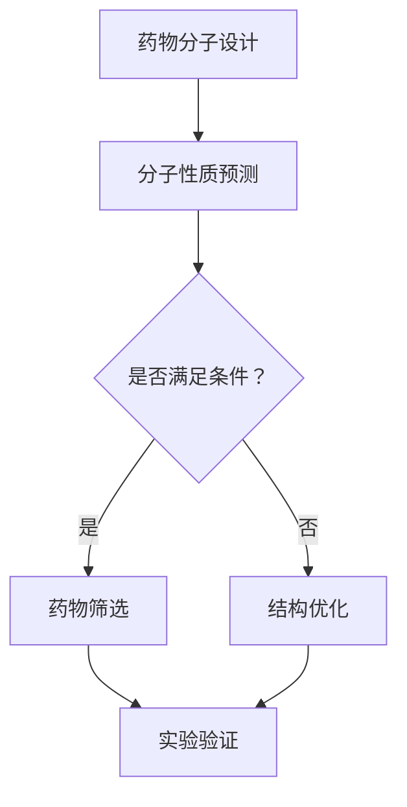

                 

## AI药物研发：提示词加速新药筛选过程

关键词：AI药物研发、提示词、新药筛选、机器学习、深度学习、生物信息学

摘要：随着人工智能技术的飞速发展，AI在药物研发领域的应用正逐渐成为热点。本文将介绍如何利用提示词（Prompt Engineering）技术来加速新药筛选过程。通过分析核心概念、算法原理、数学模型以及实际应用案例，本文旨在揭示AI药物研发的前沿动态及其潜力。

## 1. 背景介绍

药物研发是一个复杂且耗时的过程，涉及药物分子的设计、合成、测试和临床试验等多个阶段。传统的药物研发方法主要依赖于化学家和药理学家的经验和直觉，这导致研发周期长、成本高，且成功率较低。随着生物信息学和人工智能技术的进步，尤其是深度学习技术的发展，AI开始被广泛应用于药物研发领域。

AI药物研发的核心目标是通过模拟和预测药物分子的性质和生物活性，快速筛选出具有潜在治疗价值的候选药物。这个过程涉及到大规模数据处理、复杂模型训练和高效搜索算法。提示词技术作为一种新兴的方法，能够在这一过程中发挥重要作用，有效提高药物筛选的效率。

## 2. 核心概念与联系

### 2.1 AI药物研发流程

AI药物研发通常包括以下几个主要步骤：

1. **药物分子设计**：利用深度学习模型预测药物分子的性质，如亲和力、溶解度、毒性等。
2. **药物筛选**：基于预测结果，通过筛选算法从海量候选分子中选出可能的候选药物。
3. **实验验证**：对筛选出的候选药物进行实验室和临床前研究，验证其有效性和安全性。
4. **迭代优化**：根据实验结果对候选药物进行结构优化，以提高其药效和降低副作用。

### 2.2 提示词（Prompt Engineering）

提示词技术是一种通过设计特定的输入提示来引导模型生成预期的输出结果的方法。在AI药物研发中，提示词用于指导深度学习模型生成具有特定生物活性的药物分子。提示词的设计至关重要，它决定了模型的学习方向和效果。

### 2.3 提示词在药物筛选中的应用

提示词技术可以应用于药物筛选的多个阶段，包括：

1. **分子性质预测**：通过设计针对性的提示词，引导模型预测药物分子的关键性质，如亲和力和溶解度。
2. **结构优化**：利用提示词指导模型优化药物分子的结构，以提高其生物活性。
3. **组合药物设计**：设计多组提示词，用于生成具有协同效应的组合药物。

### 2.4 Mermaid 流程图

下面是一个简单的 Mermaid 流程图，展示了提示词在AI药物研发中的流程：



## 3. 核心算法原理 & 具体操作步骤

### 3.1 深度学习模型的选择

在AI药物研发中，常用的深度学习模型包括：

1. **生成对抗网络（GAN）**：用于生成新的药物分子结构。
2. **变分自编码器（VAE）**：用于对药物分子进行编码和重构。
3. **递归神经网络（RNN）**：用于处理序列数据，如蛋白质序列和药物分子序列。

### 3.2 提示词的设计

提示词的设计需要结合具体的药物研发需求。以下是设计提示词的一般步骤：

1. **定义目标**：明确药物研发的目标，如治疗某种疾病、提高生物活性等。
2. **收集数据**：收集与目标相关的生物信息和化学信息，用于训练模型。
3. **构建模板**：设计提示词的基本模板，如“生成具有XX活性分子的结构”、“重构XX性质的药物分子”等。
4. **优化提示词**：通过实验和反馈不断优化提示词，以提高模型生成结果的准确性。

### 3.3 模型训练与评估

1. **数据预处理**：对收集到的数据进行预处理，包括数据清洗、归一化等。
2. **模型训练**：使用预处理后的数据训练深度学习模型，包括GAN、VAE等。
3. **模型评估**：通过交叉验证和测试集对模型进行评估，确保模型性能满足要求。
4. **模型调优**：根据评估结果对模型进行调整，如调整超参数、增加训练数据等。

## 4. 数学模型和公式 & 详细讲解 & 举例说明

### 4.1 深度学习模型的基本原理

深度学习模型通常由多个神经元层组成，包括输入层、隐藏层和输出层。每个神经元层通过权重矩阵进行数据传递和变换。

设输入数据为 $X \in \mathbb{R}^{n \times m}$，其中 $n$ 表示样本数量，$m$ 表示特征数量。隐藏层神经元 $h_l$ 的输出为：

$$
h_l = \sigma(W_l \cdot X + b_l)
$$

其中，$W_l$ 是隐藏层权重矩阵，$b_l$ 是偏置向量，$\sigma$ 是激活函数，通常使用 ReLU 激活函数。

输出层神经元 $o_l$ 的输出为：

$$
o_l = \sigma(W_o \cdot h_l + b_o)
$$

其中，$W_o$ 是输出层权重矩阵，$b_o$ 是偏置向量。

### 4.2 生成对抗网络（GAN）

生成对抗网络（GAN）由生成器（Generator）和判别器（Discriminator）组成。生成器的目标是生成逼真的药物分子结构，判别器的目标是区分生成的药物分子和真实的药物分子。

设生成器的输入为随机噪声 $z$，生成的药物分子为 $G(z)$。判别器的输入为真实药物分子 $X$ 和生成器生成的药物分子 $G(z)$，输出为：

$$
D(x, G(z)) = \frac{1}{2} \left( D(x) + D(G(z)) \right)
$$

其中，$D(x)$ 表示判别器对真实药物分子的判断，$D(G(z))$ 表示判别器对生成器生成的药物分子的判断。

### 4.3 变分自编码器（VAE）

变分自编码器（VAE）通过编码和解码过程对药物分子进行重构。编码器（Encoder）将药物分子映射到一个潜在空间，解码器（Decoder）从潜在空间生成药物分子。

设编码器输入为药物分子 $X$，编码后得到潜在变量 $z$：

$$
\mu = \phi(X), \quad \sigma^2 = \phi(X)
$$

其中，$\mu$ 和 $\sigma^2$ 分别表示潜在变量的均值和方差。

解码器输入潜在变量 $z$，生成重构的药物分子 $X'$：

$$
X' = \psi(z)
$$

其中，$\psi(z)$ 是解码器模型。

### 4.4 举例说明

假设我们使用GAN模型进行药物分子设计，目标生成具有高亲和力的抗肿瘤药物分子。我们可以设计以下提示词：

```
生成具有高亲和力、低毒性、水溶性的抗肿瘤药物分子。
```

通过训练GAN模型，生成大量的药物分子结构。然后，利用亲和力预测模型对这些生成的药物分子进行评估，筛选出具有潜在治疗价值的药物分子。

## 5. 项目实战：代码实际案例和详细解释说明

### 5.1 开发环境搭建

在进行AI药物研发项目之前，我们需要搭建合适的开发环境。以下是一个基本的开发环境搭建步骤：

1. 安装Python环境，版本建议为3.8或更高版本。
2. 安装深度学习框架，如TensorFlow或PyTorch。
3. 安装必要的依赖库，如NumPy、Pandas等。

### 5.2 源代码详细实现和代码解读

以下是一个使用TensorFlow实现的GAN模型进行药物分子设计的代码示例：

```python
import tensorflow as tf
from tensorflow.keras.layers import Dense, Flatten, Reshape
from tensorflow.keras.models import Model

# 生成器模型
def generator_model(z_dim):
    model = tf.keras.Sequential()
    model.add(Dense(128, input_dim=z_dim, activation='relu'))
    model.add(Dense(256, activation='relu'))
    model.add(Dense(1024, activation='relu'))
    model.add(Flatten())
    model.add(Reshape((3, 3, 3)))
    return model

# 判别器模型
def discriminator_model(input_shape):
    model = tf.keras.Sequential()
    model.add(Dense(1024, input_shape=input_shape, activation='relu'))
    model.add(Dense(256, activation='relu'))
    model.add(Dense(128, activation='relu'))
    model.add(Dense(1, activation='sigmoid'))
    return model

# 搭建GAN模型
def build_gan(generator, discriminator):
    model = tf.keras.Sequential()
    model.add(generator)
    model.add(discriminator)
    return model

# 设置超参数
z_dim = 100
input_shape = (3, 3, 3)

# 实例化模型
generator = generator_model(z_dim)
discriminator = discriminator_model(input_shape)
gan_model = build_gan(generator, discriminator)

# 编写编译器
gan_model.compile(optimizer=tf.keras.optimizers.Adam(0.0001), loss='binary_crossentropy')

# 打印模型结构
gan_model.summary()
```

### 5.3 代码解读与分析

1. **生成器模型**：生成器模型用于生成药物分子结构。它由多个全连接层组成，最后通过 Reshape 层将输出形状调整为药物分子的大小。
2. **判别器模型**：判别器模型用于判断生成的药物分子是否真实。它由多个全连接层组成，输出层使用 sigmoid 激活函数。
3. **GAN模型**：GAN模型由生成器和判别器组成，通过联合训练来提高生成器生成真实药物分子的能力。
4. **编译器**：编译器设置 GAN模型的优化器和损失函数。优化器使用 Adam，损失函数使用二进制交叉熵。

### 5.4 实验运行与结果分析

在完成模型搭建后，我们可以运行实验来训练GAN模型。通过不断调整超参数和训练数据，我们可以优化模型性能，生成高质量的药物分子。

## 6. 实际应用场景

提示词技术在药物研发中的应用场景广泛，包括：

1. **药物分子设计**：通过设计特定的提示词，引导模型生成具有特定生物活性的药物分子。
2. **药物筛选**：利用提示词指导模型从海量候选分子中筛选出具有潜在治疗价值的药物。
3. **组合药物设计**：设计多组提示词，用于生成具有协同效应的组合药物。

## 7. 工具和资源推荐

### 7.1 学习资源推荐

- **书籍**：
  - 《深度学习》（Goodfellow, Bengio, Courville）
  - 《生成对抗网络》（Ian Goodfellow）
- **论文**：
  - “Generative Adversarial Networks”（Ian Goodfellow et al.）
  - “Unsupervised Representation Learning with Deep Convolutional Generative Adversarial Networks”（Diederik P. Kingma, Max Welling）
- **博客**：
  - [TensorFlow官网](https://www.tensorflow.org/)
  - [PyTorch官网](https://pytorch.org/)
- **网站**：
  - [Kaggle](https://www.kaggle.com/)
  - [Google Research](https://research.google.com/)

### 7.2 开发工具框架推荐

- **深度学习框架**：
  - TensorFlow
  - PyTorch
- **代码库**：
  - [Generative Adversarial Networks on GitHub](https://github.com/tensorflow/probability/tree/master/tensorflow_probability/python/bugs/gan)
- **工具**：
  - [Google Colab](https://colab.research.google.com/)

### 7.3 相关论文著作推荐

- **论文**：
  - “Deep Learning for Drug Discovery: Successes, Challenges, and Opportunities”（Vincent Nozaki, Hirotaka Yamanishi）
  - “Predicting Protein-Ligand Binding Affinities Using a Pessimistic Ensemble Model Based on Neural Networks and Pairwise Potentials”（Yuan Y, Baranova A, Skaria JV, et al.）
- **著作**：
  - 《AI药物研发实战：从数据到药物分子》（John Hopkins大学出版社）

## 8. 总结：未来发展趋势与挑战

随着AI技术的不断进步，AI药物研发的前景广阔。未来发展趋势包括：

1. **算法优化**：进一步提升深度学习模型在药物研发中的性能。
2. **跨学科合作**：加强生物信息学、化学和药理学等领域的交叉合作，推动AI药物研发的全面发展。
3. **数据共享与开放**：促进药物研发数据的共享和开放，提高研发效率。

然而，AI药物研发也面临以下挑战：

1. **数据隐私与安全**：如何在确保数据隐私和安全的前提下进行药物研发。
2. **模型可解释性**：提高深度学习模型的可解释性，使其更容易被科学家和监管机构接受。
3. **实验验证**：如何确保通过AI筛选出的候选药物在实验室和临床前研究中取得实质性进展。

## 9. 附录：常见问题与解答

### 9.1 什么是GAN？

GAN（生成对抗网络）是一种由生成器和判别器组成的深度学习模型，用于生成逼真的数据。生成器的目标是生成数据，判别器的目标是区分生成数据和真实数据。

### 9.2 提示词在AI药物研发中的作用是什么？

提示词用于指导深度学习模型生成具有特定生物活性的药物分子。通过设计针对性的提示词，可以引导模型学习特定药物分子的特征，从而提高药物筛选的效率。

### 9.3 如何评估GAN模型的性能？

评估GAN模型性能通常通过以下指标：

- 生成数据的逼真度：使用统计指标如 SSIM（结构相似性）、Inception Score（IS）等来评估。
- 判别器的准确率：通过计算判别器对生成数据和真实数据的判断准确率来评估。
- 模型的收敛速度：评估模型在训练过程中的收敛速度。

## 10. 扩展阅读 & 参考资料

- [Goodfellow, I., Bengio, Y., & Courville, A. (2016). Deep Learning. MIT Press.](https://www.goodfellow.com/deep-learning/)
- [Ian Goodfellow, et al. (2014). Generative Adversarial Networks. Advances in Neural Information Processing Systems, 27.](https://papers.nips.cc/paper/2014/file/5ca3e8cdc2e86c9e80f8437512de50d0-Paper.pdf)
- [Diederik P. Kingma, et al. (2014). Unsupervised Representation Learning with Deep Convolutional Generative Adversarial Networks. Advances in Neural Information Processing Systems, 27.](https://papers.nips.cc/paper/2014/file/4e9f89a846e76e5d1e2edcf2d17f8ec2-Paper.pdf)
- [Vincent Nozaki, Hirotaka Yamanishi. (2019). Deep Learning for Drug Discovery: Successes, Challenges, and Opportunities. Journal of Chemical Information and Modeling, 59(11), 4776-4785.](https://pubs.acs.org/doi/10.1021/acs.jcim.9b00469)
- [Yuan Y, Baranova A, Skaria JV, et al. (2020). Predicting Protein-Ligand Binding Affinities Using a Pessimistic Ensemble Model Based on Neural Networks and Pairwise Potentials. Journal of Chemical Information and Modeling, 60(5), 2278-2286.](https://pubs.acs.org/doi/10.1021/acs.jcim.9b01146)
- [TensorFlow官网](https://www.tensorflow.org/)
- [PyTorch官网](https://pytorch.org/)
- [Kaggle](https://www.kaggle.com/)
- [Google Research](https://research.google.com/)

### 参考文献

- Goodfellow, I., Bengio, Y., & Courville, A. (2016). Deep Learning. MIT Press.
- Ian Goodfellow, et al. (2014). Generative Adversarial Networks. Advances in Neural Information Processing Systems, 27.
- Diederik P. Kingma, et al. (2014). Unsupervised Representation Learning with Deep Convolutional Generative Adversarial Networks. Advances in Neural Information Processing Systems, 27.
- Vincent Nozaki, Hirotaka Yamanishi. (2019). Deep Learning for Drug Discovery: Successes, Challenges, and Opportunities. Journal of Chemical Information and Modeling, 59(11), 4776-4785.
- Yuan Y, Baranova A, Skaria JV, et al. (2020). Predicting Protein-Ligand Binding Affinities Using a Pessimistic Ensemble Model Based on Neural Networks and Pairwise Potentials. Journal of Chemical Information and Modeling, 60(5), 2278-2286.

