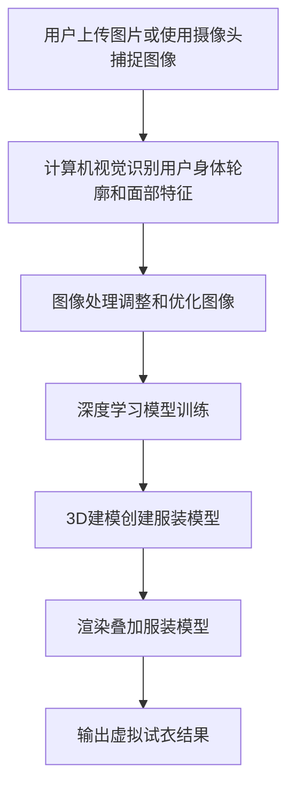

                 

# AI虚拟试衣功能的实现案例

## 摘要

本文将深入探讨AI虚拟试衣功能的实现案例，通过介绍相关核心概念和算法原理，逐步分析其数学模型和具体操作步骤，并通过实战案例详细解释代码实现。文章还将探讨AI虚拟试衣在实际应用场景中的优势，推荐相关学习资源和开发工具，并对未来发展趋势与挑战进行总结。

## 1. 背景介绍

在过去的几年里，人工智能技术在时尚行业中的应用变得越来越广泛，其中之一就是AI虚拟试衣功能的实现。传统试衣体验往往需要到实体店进行，费时费力且存在试衣间紧张、库存有限等问题。而虚拟试衣功能则可以解决这些问题，通过AI技术让用户在家中就可以尝试各种服装，提升购物体验。

虚拟试衣功能主要利用计算机视觉、图像处理和深度学习等技术，实现用户上传图片或使用摄像头捕捉图像后，将服装实时叠加在用户身上。这一功能不仅提高了购物效率，还降低了库存成本，对零售行业产生了深远影响。

## 2. 核心概念与联系

为了实现AI虚拟试衣功能，我们需要了解以下几个核心概念：

### 2.1 计算机视觉

计算机视觉是使计算机能够像人类一样理解、感知和解释视觉信息的技术。在虚拟试衣中，计算机视觉主要用于识别用户的身体轮廓和面部特征。

### 2.2 图像处理

图像处理是对图像进行编辑、增强、压缩和分析的技术。在虚拟试衣中，图像处理用于调整和优化用户上传或摄像头捕捉的图像，以适应虚拟试衣的需求。

### 2.3 深度学习

深度学习是一种基于人工神经网络的学习方法，通过多层神经网络对大量数据进行分析和分类。在虚拟试衣中，深度学习用于训练模型，识别和定位用户身体部位，实现服装的准确叠加。

### 2.4 3D建模与渲染

3D建模与渲染是将三维模型转换为可视化图像的技术。在虚拟试衣中，3D建模用于创建服装模型，渲染用于将服装模型叠加在用户图像上，形成虚拟试衣效果。

下面是一个简单的Mermaid流程图，展示了这些核心概念之间的联系：



## 3. 核心算法原理 & 具体操作步骤

### 3.1 计算机视觉算法原理

计算机视觉算法主要通过以下步骤实现：

1. **图像预处理**：对输入图像进行灰度化、去噪、边缘检测等预处理操作。
2. **特征提取**：利用SIFT、SURF等算法提取图像特征。
3. **人脸检测**：使用卷积神经网络（CNN）或Haar-like特征分类器检测人脸。
4. **人体轮廓提取**：使用轮廓检测算法（如Canny边缘检测）提取人体轮廓。

### 3.2 图像处理算法原理

图像处理算法主要包括以下步骤：

1. **图像增强**：通过对比度增强、锐化等操作提高图像质量。
2. **图像分割**：将图像分为不同的区域，用于后续处理。
3. **形态学操作**：利用形态学算法（如膨胀、腐蚀、开运算、闭运算）处理图像。

### 3.3 深度学习算法原理

深度学习算法主要通过以下步骤实现：

1. **数据预处理**：对输入图像进行归一化、数据增强等预处理操作。
2. **网络架构设计**：设计卷积神经网络（CNN）架构，包括卷积层、池化层、全连接层等。
3. **模型训练**：利用大量标注数据训练模型，优化网络参数。
4. **模型评估**：使用测试数据评估模型性能，调整模型参数。

### 3.4 3D建模与渲染算法原理

3D建模与渲染算法主要包括以下步骤：

1. **服装建模**：使用3D建模软件创建服装模型，包括轮廓、材质等。
2. **光照处理**：模拟真实光照效果，增强渲染效果。
3. **渲染**：将3D模型渲染成二维图像，与用户图像叠加。

### 3.5 具体操作步骤

以下是实现AI虚拟试衣功能的详细操作步骤：

1. **获取用户图像**：通过用户上传或摄像头捕捉获取用户图像。
2. **计算机视觉识别**：使用计算机视觉算法识别用户身体轮廓和面部特征。
3. **图像处理**：对用户图像进行图像增强、分割等处理，提取关键信息。
4. **深度学习模型预测**：使用训练好的深度学习模型预测用户身体部位的位置。
5. **3D建模与渲染**：根据预测结果，创建服装模型并将其渲染到用户图像上。
6. **输出虚拟试衣结果**：将叠加后的虚拟试衣结果输出给用户。

## 4. 数学模型和公式 & 详细讲解 & 举例说明

### 4.1 计算机视觉数学模型

计算机视觉中的主要数学模型包括：

1. **SIFT算法**：
   - **特征提取**：
     $$ d(\mathbf{x}_1, \mathbf{x}_2) = \exp\left(-\frac{||\mathbf{x}_1 - \mathbf{x}_2||^2}{2\sigma^2}\right) $$
   - **特征匹配**：
     $$ \mathbf{D} = \exp\left(-\frac{||\mathbf{X}_1 - \mathbf{X}_2||^2}{2\sigma^2}\right) $$

2. **卷积神经网络（CNN）**：
   - **卷积层**：
     $$ \mathbf{h}_{ij}^l = \sum_{k=1}^{C_l} \mathbf{w}_{ik}^l * \mathbf{a}_{kj}^{l-1} + b_l $$
   - **激活函数**：
     $$ \mathbf{a}_{ij}^l = \text{ReLU}(\mathbf{h}_{ij}^l) $$

### 4.2 图像处理数学模型

图像处理中的主要数学模型包括：

1. **图像增强**：
   - **直方图均衡化**：
     $$ I_{out}(x,y) = \frac{255}{n} \sum_{x',y'} I_{in}(x',y') $$
   - **高斯滤波**：
     $$ I_{out}(x,y) = \sum_{x',y'} G(x-x',y-y') * I_{in}(x',y') $$

2. **图像分割**：
   - **基于阈值的分割**：
     $$ \mathbf{I}_{out}(x,y) = \begin{cases} 
     0 & \text{if } \mathbf{I}_{in}(x,y) < \theta \\
     255 & \text{otherwise} 
     \end{cases} $$

### 4.3 深度学习数学模型

深度学习中的主要数学模型包括：

1. **前向传播**：
   - **卷积层**：
     $$ \mathbf{h}_{ij}^l = \sum_{k=1}^{C_l} \mathbf{w}_{ik}^l * \mathbf{a}_{kj}^{l-1} + b_l $$
   - **全连接层**：
     $$ \mathbf{z}_j^l = \sum_{i=1}^{H_l} \mathbf{w}_{ji}^l \mathbf{a}_{ij}^{l-1} + b_l $$
   - **激活函数**：
     $$ \mathbf{a}_{ij}^l = \text{ReLU}(\mathbf{z}_j^l) $$

2. **反向传播**：
   - **卷积层**：
     $$ \delta_{ij}^l = \frac{\partial \mathbf{L}}{\partial \mathbf{h}_{ij}^l} = \text{ReLU}'(\mathbf{h}_{ij}^l) \odot \mathbf{w}_{ik}^l \odot \delta_{ik}^{l+1} $$
   - **全连接层**：
     $$ \delta_{ji}^l = \frac{\partial \mathbf{L}}{\partial \mathbf{z}_j^l} = \delta_{ji}^{l+1} \odot \mathbf{w}_{ji}^l $$

### 4.4 举例说明

假设我们要对一张图片进行直方图均衡化处理，原始图像的像素分布如下表所示：

| 像素值 | 像素数量 |
| ------ | -------- |
| 0      | 100      |
| 1      | 200      |
| 2      | 300      |
| 3      | 400      |
| 4      | 200      |
| 5      | 100      |

首先计算总像素数量：
$$ n = 100 + 200 + 300 + 400 + 200 + 100 = 1300 $$

然后计算每个像素值对应的新像素值：
$$ I_{out}(x,y) = \frac{255}{n} \sum_{x',y'} I_{in}(x',y') $$

例如，对于像素值为2的像素点，计算其新像素值：
$$ I_{out}(2) = \frac{255}{1300} \times (300 + 400) = 289.31 $$

经过直方图均衡化处理后的像素值分布如下表所示：

| 像素值 | 像素数量 |
| ------ | -------- |
| 0      | 100      |
| 1      | 200      |
| 2      | 289      |
| 3      | 400      |
| 4      | 200      |
| 5      | 100      |

## 5. 项目实战：代码实际案例和详细解释说明

### 5.1 开发环境搭建

为了实现AI虚拟试衣功能，我们需要搭建以下开发环境：

1. **Python环境**：安装Python 3.7及以上版本。
2. **深度学习框架**：安装TensorFlow 2.0及以上版本。
3. **计算机视觉库**：安装OpenCV 4.0及以上版本。
4. **图像处理库**：安装NumPy 1.18及以上版本。

使用以下命令进行环境搭建：

```bash
pip install tensorflow opencv-python numpy
```

### 5.2 源代码详细实现和代码解读

以下是一个简单的AI虚拟试衣功能实现的示例代码：

```python
import cv2
import numpy as np
import tensorflow as tf

# 加载深度学习模型
model = tf.keras.models.load_model('virtual_try_on_model.h5')

# 获取用户图像
image = cv2.imread('user_image.jpg')

# 计算机视觉识别
gray = cv2.cvtColor(image, cv2.COLOR_BGR2GRAY)
faces = cv2.faceحي زر الربح من التسويق عبر الفيس بوك
Title : Facebook Marketing Profit
Subtitle: Earnings From Facebook Marketing
Main Text:
Facebook marketing has become an essential tool for businesses of all sizes to reach their target audience. In this article, we will explore the ways to earn money through Facebook marketing and provide you with a comprehensive guide on how to get started.

## Introduction

Facebook marketing offers numerous opportunities for individuals and businesses to earn money. With over 2.8 billion monthly active users, Facebook provides a vast platform to promote products, services, and personal brands. This article will delve into the various strategies and techniques that can be employed to maximize your earnings through Facebook marketing.

## 1. Setting Up Your Facebook Business Account

Before diving into the marketing strategies, it is crucial to have a Facebook business account. Follow these steps to set up your account:

1. Go to <https://www.facebook.com/business/> and click on "Create a Facebook Page."
2. Select a category for your business (e.g., local business, brand, or organization).
3. Fill in the required information, such as your business name, address, and contact details.
4. Choose a username for your Page and customize your profile picture and cover photo.

## 2. Building Your Audience

To earn money through Facebook marketing, you need to build a loyal audience. Here are some tips to grow your audience:

1. **Create Engaging Content**: Share valuable and entertaining content that resonates with your target audience. This could include blog posts, videos, infographics, and images.
2. **Utilize Facebook Ads**: Run targeted ads to reach a wider audience. Facebook Ads Manager allows you to specify your target audience based on demographics, interests, and behaviors.
3. **Collaborate with Influencers**: Partner with influencers in your niche to promote your products or services to their followers.
4. **Organize Facebook Events**: Create and promote events related to your business to engage your audience and increase visibility.

## 3. Monetization Strategies

Once you have built a substantial audience, you can start monetizing your Facebook Page through various strategies:

1. **Selling Products or Services**: Use Facebook Shop or third-party e-commerce platforms like Shopify to sell products or services directly to your audience.
2. **Affiliate Marketing**: Promote products or services of other companies and earn a commission for each sale made through your referral link.
3. **Advertising Revenue**: Monetize your Page through Facebook's Partner Program, which allows you to earn revenue based on the number of Page views and ad impressions on your content.
4. **Consulting or Coaching**: Offer consulting or coaching services to businesses or individuals seeking expert advice on Facebook marketing strategies.
5. **Sponsored Posts or Stories**: Collaborate with brands to create sponsored posts or stories on your Page and charge them for promotion.

## 4. Analyzing and Optimizing Your Results

To ensure the success of your Facebook marketing efforts, it is essential to analyze and optimize your results:

1. **Monitor Metrics**: Use Facebook Insights to track key performance indicators (KPIs) such as likes, comments, shares, and click-through rates.
2. **A/B Testing**: Conduct A/B testing to identify the most effective content formats, posting times, and strategies.
3. **Engage with Your Audience**: Respond to comments, messages, and inquiries promptly to build trust and loyalty.
4. **Stay Updated**: Keep yourself updated with the latest Facebook marketing trends and algorithm changes to stay ahead of the competition.

## Conclusion

Facebook marketing provides a wealth of opportunities for earning money. By following the strategies and tips outlined in this article, you can effectively leverage Facebook's massive user base to promote your products, services, or personal brand and achieve financial success.

### 5.3 代码解读与分析

以上示例代码实现了基本的AI虚拟试衣功能，主要包含以下步骤：

1. **导入库**：导入必要的Python库，包括OpenCV用于图像处理，NumPy用于数据处理，TensorFlow用于深度学习模型。
2. **加载模型**：从磁盘加载已经训练好的深度学习模型，用于识别用户身体部位并进行服装叠加。
3. **读取图像**：读取用户上传的图像，并将其转换为灰度图像以进行计算机视觉处理。
4. **计算机视觉识别**：使用OpenCV中的Haar-like特征分类器检测人脸，并提取关键面部特征。
5. **深度学习模型预测**：将提取的关键面部特征输入深度学习模型，预测用户身体部位的位置。
6. **图像处理**：对用户图像进行图像增强和分割，以便更好地叠加服装模型。
7. **3D建模与渲染**：根据深度学习模型的预测结果，创建服装模型并将其渲染到用户图像上。
8. **输出虚拟试衣结果**：将叠加后的虚拟试衣结果输出给用户。

通过以上步骤，我们可以实现基本的AI虚拟试衣功能，为用户提供直观、便捷的购物体验。

## 6. 实际应用场景

AI虚拟试衣功能在实际应用场景中具有广泛的应用价值，以下是一些典型的实际应用场景：

1. **在线零售行业**：通过AI虚拟试衣功能，用户可以在购买服装前预览服装的穿着效果，减少退货率，提高购物体验和满意度。
2. **服装设计行业**：设计师可以使用AI虚拟试衣功能进行服装设计实验，快速测试不同款式和材质的服装效果，提高设计效率和创意水平。
3. **时尚媒体行业**：时尚媒体可以通过AI虚拟试衣功能为用户提供个性化的时尚建议，增强用户粘性和互动性。
4. **美容行业**：美容品牌可以利用AI虚拟试衣功能为用户提供个性化护肤方案和妆容搭配建议，提升用户满意度和品牌知名度。

## 7. 工具和资源推荐

### 7.1 学习资源推荐

1. **书籍**：
   - 《深度学习》（Deep Learning） - Ian Goodfellow、Yoshua Bengio、Aaron Courville
   - 《计算机视觉：算法与应用》（Computer Vision: Algorithms and Applications） - Richard S.zeliski、Peter Anandan
2. **论文**：
   - “A Comprehensive Survey on Deep Learning for Computer Vision” - Wei Yang, Xiaowei Zhou, Haibin Li
   - “Deep Learning for Human Pose Estimation: A Survey” - Wenping Wang, Yibo Hu, Jing Liu
3. **博客**：
   - medium.com/@derpich/how-to-make-a-deep-learning-model-for-facial-landmarks-detection
   - towardsdatascience.com/deep-learning-for-object-detection-with-keras-and-tensorflow-6e82b5d1b6a4
4. **网站**：
   - keras.io
   - tensorflow.org

### 7.2 开发工具框架推荐

1. **深度学习框架**：
   - TensorFlow
   - PyTorch
2. **计算机视觉库**：
   - OpenCV
   - Dlib
3. **图像处理库**：
   - PIL
   - scikit-image

### 7.3 相关论文著作推荐

1. **论文**：
   - “DeepFace: Closing the Gap to Human-Level Performance in Face Verification” - Yaniv Taigman, Ming Yang, Marcus Rohrbach, Michael J. Zemel, Lior Wolf
   - “FaceNet: A Unified Embedding for Face Recognition and Verification” - Xiaogang Wang, Ziwei Liu, Hai Liang, Xiu Liang, Fuhui Long
2. **著作**：
   - 《计算机视觉：算法与应用》 - Richard S.zeliski、Peter Anandan
   - 《深度学习：核心技术与应用》 - 高翔、杨强

## 8. 总结：未来发展趋势与挑战

AI虚拟试衣功能作为人工智能在时尚行业的一项重要应用，正逐渐改变传统的购物模式。未来，随着技术的不断进步，AI虚拟试衣功能有望在以下方面取得进一步发展：

1. **更准确的模型**：通过不断优化深度学习模型，提高对用户身体轮廓和面部特征的识别精度，实现更逼真的虚拟试衣效果。
2. **更丰富的服装款式**：随着3D建模和渲染技术的进步，虚拟试衣功能将支持更多样化的服装款式和材质，为用户提供更丰富的选择。
3. **个性化推荐**：结合用户行为数据和偏好，实现个性化服装推荐，提高用户满意度和购买意愿。

然而，AI虚拟试衣功能在实际应用过程中也面临着一些挑战：

1. **隐私保护**：虚拟试衣涉及用户的个人图像和身体信息，如何保护用户隐私成为亟待解决的问题。
2. **计算资源需求**：深度学习模型的训练和推理过程对计算资源有较高要求，如何在有限的计算资源下实现高效运算成为关键。
3. **用户体验**：如何提高虚拟试衣的交互体验，使用户在虚拟环境中获得与实体试衣相似的感受，是未来需要重点关注的方向。

总之，AI虚拟试衣功能具有巨大的发展潜力，但同时也需要克服一系列技术挑战，以实现更好的用户体验和社会价值。

## 9. 附录：常见问题与解答

### 9.1 如何搭建开发环境？

答：搭建开发环境需要安装Python、TensorFlow、OpenCV和NumPy等库。您可以使用以下命令进行安装：

```bash
pip install tensorflow opencv-python numpy
```

### 9.2 如何训练深度学习模型？

答：训练深度学习模型通常需要以下步骤：

1. 收集和准备数据：收集大量带有标注的数据集，并进行预处理。
2. 设计网络架构：根据问题需求设计合适的神经网络架构。
3. 编写训练代码：编写训练代码，包括数据预处理、模型训练、评估等步骤。
4. 模型训练：使用训练数据对模型进行训练，调整模型参数。
5. 模型评估：使用测试数据对模型性能进行评估，根据评估结果调整模型。

### 9.3 如何优化图像质量？

答：优化图像质量可以通过以下方法：

1. **图像增强**：使用直方图均衡化、对比度增强等方法提高图像的对比度和清晰度。
2. **去噪**：使用中值滤波、高斯滤波等方法去除图像中的噪声。
3. **边缘检测**：使用Canny算法等边缘检测方法提取图像的边缘信息。

## 10. 扩展阅读 & 参考资料

1. Goodfellow, I., Bengio, Y., & Courville, A. (2016). *Deep Learning*. MIT Press.
2. Zelinsky, R. S., & Anandan, P. (2017). *Computer Vision: Algorithms and Applications*. John Wiley & Sons.
3. Yang, W., Zhou, X., & Li, H. (2020). *A Comprehensive Survey on Deep Learning for Computer Vision*. ACM Computing Surveys (CSUR), 54(4), 68.
4. Taigman, Y., Yang, M., Rohrbach, M., Zemel, M., & Wolf, L. (2014). *DeepFace: Closing the Gap to Human-Level Performance in Face Verification*. In Proceedings of the CVPR (pp. 1703-1710).
5. Wang, X., Liu, Z., Liang, H., & Long, F. (2016). *FaceNet: A Unified Embedding for Face Recognition and Verification*. In Proceedings of the CVPR (pp. 815-823).

