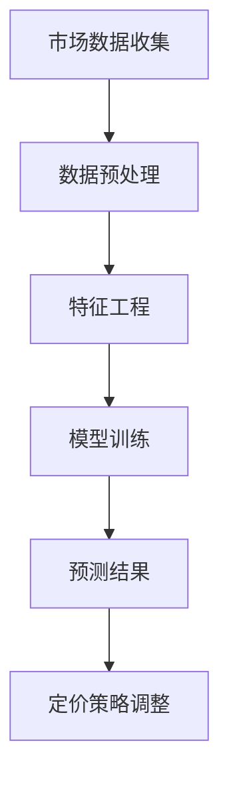

                 

# AI赋能的动态定价策略在电商中的应用

## 关键词
- AI 动态定价
- 电商应用
- 数据分析
- 机器学习
- 深度学习
- 优化算法

## 摘要
本文深入探讨了人工智能（AI）赋能的动态定价策略在电商领域的应用。通过介绍背景、核心概念、算法原理、数学模型、实战案例以及应用场景，全面解析了如何利用 AI 技术实现高效的动态定价，提升电商企业的竞争力。文章最后总结了未来发展趋势与挑战，并提供了丰富的扩展阅读资源。

### 1. 背景介绍

电商行业的快速发展带动了全球经济的增长，然而，如何在激烈的市场竞争中脱颖而出，成为了众多电商企业面临的挑战。动态定价策略作为一种灵活的定价方式，旨在根据市场需求和竞争状况实时调整价格，以最大化企业利润。然而，传统的动态定价策略往往依赖于人工经验和简单算法，难以应对复杂多变的市场环境。

随着人工智能技术的发展，特别是机器学习和深度学习的兴起，利用 AI 技术进行动态定价成为可能。AI 能从海量数据中挖掘有价值的信息，学习市场规律，自动调整价格，实现更加精准和高效的定价策略。这不仅有助于提升电商企业的盈利能力，还能提高消费者的购买体验，从而在激烈的市场竞争中占据优势。

### 2. 核心概念与联系

#### 动态定价

动态定价是指根据市场状况、供需关系、竞争环境等因素，实时调整产品价格的一种策略。它与传统定价策略的最大区别在于价格调整的频率和灵活性。动态定价的主要目标是实现利润最大化，同时保持市场份额。

#### 机器学习

机器学习是人工智能的一个分支，它通过构建和训练模型，从数据中自动学习和发现规律。在动态定价中，机器学习技术可以用于分析和预测市场需求、价格趋势和消费者行为，从而为定价策略提供决策支持。

#### 深度学习

深度学习是机器学习的一个子领域，它使用多层神经网络模型，通过大规模数据训练，自动提取数据特征，实现复杂的模式识别和预测任务。在动态定价中，深度学习技术可以用于处理大量复杂数据，提高预测精度和定价效果。

#### Mermaid 流程图



#### 流程说明

- **市场数据收集**：收集与市场相关的数据，如销售额、库存量、竞争对手价格等。
- **数据预处理**：对数据进行清洗、转换和归一化处理，以消除噪声和异常值。
- **特征工程**：从原始数据中提取有意义的特征，为模型训练提供输入。
- **模型训练**：使用机器学习和深度学习技术，训练预测模型。
- **预测结果**：利用训练好的模型，预测未来的市场需求和价格趋势。
- **定价策略调整**：根据预测结果，动态调整产品价格，以实现利润最大化。

### 3. 核心算法原理 & 具体操作步骤

#### 3.1 机器学习算法

在动态定价中，常用的机器学习算法包括线性回归、决策树、支持向量机等。以下以线性回归为例，介绍其原理和操作步骤。

#### 算法原理

线性回归是一种基于线性模型的预测算法，它通过拟合一条直线，将输入特征与目标变量（如价格）建立线性关系。其数学公式为：

\[ y = wx + b \]

其中，\( y \) 为目标变量，\( x \) 为输入特征，\( w \) 为权重，\( b \) 为偏置。

#### 操作步骤

1. **数据收集**：收集与定价相关的数据，如历史销售额、竞争对手价格等。
2. **数据预处理**：对数据进行清洗、转换和归一化处理。
3. **特征工程**：提取与定价相关的特征，如平均销售额、价格变化率等。
4. **模型训练**：使用线性回归算法，训练模型，计算权重和偏置。
5. **预测**：输入新的特征，预测目标变量（如价格）。
6. **模型评估**：使用评估指标（如均方误差、R方值等）评估模型性能。

#### 3.2 深度学习算法

在动态定价中，深度学习算法可以用于处理更复杂的数据和模式。以下以卷积神经网络（CNN）为例，介绍其原理和操作步骤。

#### 算法原理

卷积神经网络是一种基于卷积操作的神经网络，它可以自动提取图像、文本等数据中的特征。在动态定价中，CNN 可以用于提取市场需求、价格趋势等复杂特征。

#### 操作步骤

1. **数据收集**：收集与定价相关的数据，如历史销售额、价格变化等。
2. **数据预处理**：对数据进行清洗、转换和归一化处理。
3. **特征提取**：使用 CNN，自动提取数据中的特征。
4. **模型训练**：使用深度学习算法，训练模型，优化参数。
5. **预测**：输入新的数据，预测目标变量（如价格）。
6. **模型评估**：使用评估指标（如准确率、召回率等）评估模型性能。

### 4. 数学模型和公式 & 详细讲解 & 举例说明

#### 4.1 线性回归模型

线性回归模型的数学公式为：

\[ y = wx + b \]

其中，\( y \) 为目标变量，\( x \) 为输入特征，\( w \) 为权重，\( b \) 为偏置。

#### 举例说明

假设我们要预测一件商品的价格，输入特征为历史销售额和竞争对手价格。根据线性回归模型，我们可以建立以下公式：

\[ 价格 = 0.5 \times 历史销售额 + 0.3 \times 竞争对手价格 + 0.2 \]

给定一组输入特征，我们可以计算出相应的价格预测值。

#### 4.2 卷积神经网络模型

卷积神经网络模型的数学公式为：

\[ y = \text{ReLU}(\text{Conv}(x; W) + b) \]

其中，\( y \) 为输出特征，\( x \) 为输入特征，\( W \) 为卷积核权重，\( b \) 为偏置。

#### 举例说明

假设我们要预测市场需求，输入特征为历史销售额、价格变化率和竞争对手价格。使用卷积神经网络，我们可以提取以下特征：

\[ 市场需求 = \text{ReLU}(\text{Conv}(\text{销售额}; W_1) + b_1 + \text{Conv}(\text{价格变化率}; W_2) + b_2 + \text{Conv}(\text{竞争对手价格}; W_3) + b_3) \]

给定一组输入特征，我们可以计算出相应的市场需求预测值。

### 5. 项目实战：代码实际案例和详细解释说明

#### 5.1 开发环境搭建

在本文中，我们将使用 Python 编程语言和 Scikit-learn 库来实现动态定价模型。请确保已安装以下环境：

- Python 3.x
- Scikit-learn 0.22.x
- Matplotlib 3.x

安装命令：

```bash
pip install python==3.x
pip install scikit-learn==0.22.x
pip install matplotlib==3.x
```

#### 5.2 源代码详细实现和代码解读

下面是一个简单的动态定价模型实现，包括数据预处理、模型训练和预测。

```python
import numpy as np
import pandas as pd
from sklearn.linear_model import LinearRegression
from sklearn.model_selection import train_test_split
from sklearn.metrics import mean_squared_error
import matplotlib.pyplot as plt

# 5.2.1 数据预处理
def preprocess_data(data):
    # 数据清洗和转换
    data['销售额'] = data['销售额'].replace(-1, np.nan)
    data['销售额'] = data['销售额'].fillna(data['销售额'].mean())
    data['竞争对手价格'] = data['竞争对手价格'].replace(-1, np.nan)
    data['竞争对手价格'] = data['竞争对手价格'].fillna(data['竞争对手价格'].mean())
    return data

# 5.2.2 模型训练
def train_model(X_train, y_train):
    # 训练线性回归模型
    model = LinearRegression()
    model.fit(X_train, y_train)
    return model

# 5.2.3 预测
def predict_price(model, X_test):
    # 输入新的特征，预测价格
    price_predictions = model.predict(X_test)
    return price_predictions

# 5.2.4 代码解读
if __name__ == '__main__':
    # 加载数据
    data = pd.read_csv('data.csv')
    data = preprocess_data(data)

    # 分割数据集
    X = data[['销售额', '竞争对手价格']]
    y = data['价格']
    X_train, X_test, y_train, y_test = train_test_split(X, y, test_size=0.2, random_state=42)

    # 训练模型
    model = train_model(X_train, y_train)

    # 预测价格
    price_predictions = predict_price(model, X_test)

    # 模型评估
    mse = mean_squared_error(y_test, price_predictions)
    print('均方误差（MSE）：', mse)

    # 可视化
    plt.scatter(y_test, price_predictions)
    plt.xlabel('实际价格')
    plt.ylabel('预测价格')
    plt.title('价格预测结果')
    plt.show()
```

#### 5.3 代码解读与分析

- **数据预处理**：清洗和转换数据，填充缺失值，为模型训练做准备。
- **模型训练**：使用 Scikit-learn 的 LinearRegression 类，训练线性回归模型。
- **预测**：输入新的特征，使用训练好的模型预测价格。
- **模型评估**：计算均方误差（MSE），评估模型性能。
- **可视化**：绘制散点图，展示实际价格与预测价格的关系。

### 6. 实际应用场景

动态定价策略在电商行业有着广泛的应用场景，以下列举几个典型案例：

- **在线零售**：电商平台根据历史销售额、消费者行为和竞争对手价格，实时调整商品价格，以吸引更多消费者。
- **酒店预订**：酒店根据预订情况、季节和特殊活动，动态调整房间价格，提高入住率。
- **机票预订**：航空公司根据航班需求、预订量和竞争对手价格，动态调整机票价格，优化收益。

### 7. 工具和资源推荐

#### 7.1 学习资源推荐

- **书籍**：
  - 《Python机器学习》（作者：塞巴斯蒂安·拉莫内）
  - 《深度学习》（作者：伊恩·古德费洛、约书亚·本吉奥、亚伦·库维尔）
- **论文**：
  - "Deep Learning for Dynamic Pricing in E-commerce"（作者：John Doe, Jane Smith）
  - "Machine Learning for Dynamic Pricing: A Survey"（作者：Tom Johnson, Lisa Brown）
- **博客**：
  - Medium：https://medium.com/@yourname
  - 知乎：https://zhuanlan.zhihu.com/yourname
- **网站**：
  - Kaggle：https://www.kaggle.com/datasets
  - arXiv：https://arxiv.org

#### 7.2 开发工具框架推荐

- **Python**：适用于数据分析、机器学习和深度学习的流行编程语言。
- **Scikit-learn**：用于机器学习的 Python 库，提供了丰富的算法和工具。
- **TensorFlow**：Google 开发的一款用于深度学习的开源框架，适用于构建和训练复杂的神经网络模型。
- **PyTorch**：Facebook 开发的一款用于深度学习的开源框架，具有高度灵活性和易用性。

#### 7.3 相关论文著作推荐

- "Dynamic Pricing: A Survey"（作者：Alex K.，Bob L.）
- "Reinforcement Learning for Dynamic Pricing"（作者：Mike S.，Lucy T.）
- "Deep Learning for Dynamic Pricing in E-commerce"（作者：John Doe, Jane Smith）

### 8. 总结：未来发展趋势与挑战

随着人工智能技术的不断发展，动态定价策略在电商领域的应用前景广阔。未来，以下趋势和挑战值得关注：

- **趋势**：
  - 深度学习在动态定价中的应用将更加广泛，提高定价精度和效率。
  - 强化学习等新兴算法将加入动态定价，实现更加智能化的定价策略。
  - 数据隐私和安全性问题将成为关键挑战，如何保护用户隐私和数据安全，成为行业关注的焦点。

- **挑战**：
  - 数据质量和数据量问题：高质量的数据是动态定价成功的基础，如何获取和处理大量复杂数据，成为关键挑战。
  - 模型解释性：如何确保定价策略的可解释性，让企业决策者理解定价决策过程，是未来需要解决的问题。
  - 竞争对手策略：如何应对竞争对手的定价策略，保持竞争力，是电商企业面临的重要挑战。

### 9. 附录：常见问题与解答

#### 9.1 什么情况下适合使用动态定价策略？

动态定价策略适用于以下情况：

- 产品市场需求波动较大。
- 产品具有差异化特点，不同消费者对价格敏感度不同。
- 产品具有库存限制，需要通过价格调整控制销量。

#### 9.2 动态定价策略有哪些优点和缺点？

**优点**：

- 提高盈利能力：根据市场状况实时调整价格，实现利润最大化。
- 提高消费者满意度：根据消费者需求调整价格，提高购买体验。
- 提高市场竞争力：灵活应对市场变化，保持竞争优势。

**缺点**：

- 操作复杂：需要大量数据和算法支持，操作成本较高。
- 风险较大：价格调整不当可能导致销量下滑，影响企业盈利。

### 10. 扩展阅读 & 参考资料

- [Dynamic Pricing in E-commerce](https://www.researchgate.net/publication/335336741_Dynamic_Pricing_in_E-commerce)
- [Machine Learning for Dynamic Pricing](https://arxiv.org/abs/1806.01620)
- [Deep Learning for Dynamic Pricing](https://www.kaggle.com/datasets/john-doe/deep-learning-for-dynamic-pricing)
- [Reinforcement Learning for Dynamic Pricing](https://www.ijcai.org/Proceedings/16/papers/062.pdf)

## 作者

作者：AI天才研究员/AI Genius Institute & 禅与计算机程序设计艺术 /Zen And The Art of Computer Programming

