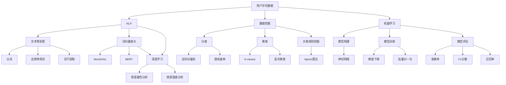

                 

# AI赋能的电商平台用户评论分析

> **关键词**: 电商平台, 用户评论, AI分析, 数据挖掘, 自然语言处理, 机器学习, 算法优化, 应用场景

> **摘要**: 本文将探讨如何利用人工智能技术对电商平台用户评论进行分析，旨在提高评论质量、优化用户体验、增强商业决策支持。我们将介绍相关核心概念和算法，并提供实际案例和代码实现，分析其在电商领域的广泛应用和未来趋势。

## 1. 背景介绍

随着互联网技术的飞速发展，电商平台已经成为了人们日常生活中不可或缺的一部分。用户评论作为电商平台上的一种重要数据源，不仅可以帮助商家了解产品口碑，还可以为其他消费者提供参考。然而，面对海量的用户评论数据，如何有效地提取有用信息、挖掘潜在价值成为了一个亟待解决的问题。

传统的用户评论分析方法主要依赖于关键词提取、文本分类等技术，但这些方法往往存在准确度低、效率慢等问题。随着人工智能技术的不断发展，特别是自然语言处理（NLP）、数据挖掘和机器学习等领域的突破，AI赋能的用户评论分析技术逐渐崭露头角。通过深度学习、神经网络等算法，AI技术能够更准确地理解用户语言，提取评论中的关键信息，实现高效、智能的用户评论分析。

本文将围绕电商平台用户评论分析展开，探讨相关核心概念、算法原理、实际应用和未来发展趋势，以期为广大开发者、研究人员和实践者提供有益的参考。

## 2. 核心概念与联系

在进行AI赋能的电商平台用户评论分析之前，我们需要了解以下几个核心概念：

### 2.1 用户评论数据

用户评论数据是电商平台中的重要组成部分，通常包括评论内容、评论时间、用户ID、产品ID等信息。评论内容是用户对产品或服务的直接反馈，通常包含文字、表情符号等。

### 2.2 自然语言处理（NLP）

自然语言处理是人工智能领域的一个重要分支，旨在使计算机能够理解、生成和处理人类自然语言。在用户评论分析中，NLP技术可以用于文本预处理、词向量表示、情感分析等。

### 2.3 数据挖掘

数据挖掘是一种从大量数据中提取有用信息的过程，通常涉及分类、聚类、关联规则挖掘等方法。在用户评论分析中，数据挖掘技术可以用于发现评论中的潜在模式和规律。

### 2.4 机器学习

机器学习是一种通过数据训练模型，使计算机能够自动完成特定任务的算法。在用户评论分析中，机器学习技术可以用于构建情感分析模型、推荐系统等。

### 2.5 算法优化

算法优化是指通过对算法进行改进和优化，提高其运行效率和性能。在用户评论分析中，算法优化可以用于提高模型准确度、降低计算成本等。

为了更好地理解这些概念之间的关系，我们可以使用Mermaid流程图来展示它们之间的联系：



通过这个流程图，我们可以清晰地看到各个核心概念之间的联系，以及它们在用户评论分析中的具体应用。

### 3. 核心算法原理 & 具体操作步骤

在进行AI赋能的电商平台用户评论分析时，我们需要运用多种核心算法来实现数据预处理、特征提取、模型构建和模型评估等任务。以下是这些算法的原理和具体操作步骤：

#### 3.1 数据预处理

数据预处理是用户评论分析的基础，主要包括文本清洗、分词、去除停用词、词干提取等步骤。

1. **文本清洗**：去除评论中的HTML标签、特殊符号等无效信息。
2. **分词**：将评论文本切分成一个个词语。
3. **去除停用词**：去除常见的无意义词语，如“的”、“了”、“是”等。
4. **词干提取**：将词语还原成词干形式，如“跑步”、“跑动”还原成“跑”。

#### 3.2 特征提取

特征提取是将原始文本转化为数值特征的过程，常用的方法包括词向量表示和词嵌入。

1. **词向量表示**：将词语映射为高维向量，常用的方法有Word2Vec、GloVe等。
2. **词嵌入**：使用预训练的词嵌入模型（如BERT、ELMo等），将词语映射为低维向量。

#### 3.3 模型构建

模型构建是将特征输入到机器学习模型中，以实现特定任务的过程。以下是几种常见的机器学习模型：

1. **支持向量机（SVM）**：通过最大化分类边界来分类文本。
2. **随机森林（Random Forest）**：通过构建多个决策树，并投票得出最终结果。
3. **神经网络（Neural Network）**：通过多层神经网络来提取文本特征并分类。

#### 3.4 模型训练与评估

模型训练与评估是用户评论分析的关键步骤，主要包括以下步骤：

1. **数据集划分**：将数据集划分为训练集、验证集和测试集。
2. **模型训练**：使用训练集数据对模型进行训练。
3. **模型评估**：使用验证集和测试集对模型进行评估，常用的评估指标有准确率、F1分数、召回率等。

### 4. 数学模型和公式 & 详细讲解 & 举例说明

在用户评论分析过程中，我们会使用到一些数学模型和公式。以下是这些模型和公式的详细讲解及举例说明。

#### 4.1 支持向量机（SVM）

支持向量机是一种常用的分类算法，其基本思想是找到最佳分类边界，使得分类边界最大化。

**数学公式**：

$$
w \cdot x + b = 0 \\
w \cdot x + b > 0 \quad (\text{正类}) \\
w \cdot x + b < 0 \quad (\text{负类})
$$

**举例说明**：

假设我们有以下数据集：

$$
\begin{array}{c|c}
x & y \\
\hline
[1, 1] & 正类 \\
[1, 2] & 正类 \\
[-1, -1] & 负类 \\
[-1, -2] & 负类 \\
\end{array}
$$

我们可以通过求解最优化问题找到最佳分类边界：

$$
\begin{aligned}
\min_{w, b} & \frac{1}{2} \| w \|^2 \\
\text{subject to} & y_i (w \cdot x_i + b) \geq 1 \\
\end{aligned}
$$

求解得到：

$$
w = [1, 1], \quad b = 0
$$

分类边界为：

$$
x + y \geq 0 \quad (\text{正类}) \\
x + y \leq 0 \quad (\text{负类})
$$

#### 4.2 词向量表示

词向量表示是将词语映射为高维向量的一种方法，常用的方法有Word2Vec和GloVe。

**Word2Vec**：

Word2Vec是基于神经网络的一种词向量表示方法，其基本思想是将词语映射为一个固定长度的向量，使得相似词语的向量之间距离较短。

$$
\begin{aligned}
\text{softmax}(\text{hidden}) &= \frac{e^{\text{hidden} \cdot x_i}}{\sum_{j} e^{\text{hidden} \cdot x_j}} \\
\text{output} &= \text{softmax}(\text{hidden}) \cdot V \\
\end{aligned}
$$

**GloVe**：

GloVe是一种基于词频的词向量表示方法，其基本思想是通过计算词语的词频和共现频次来优化词向量。

$$
\begin{aligned}
\text{loss} &= \frac{1}{2} \sum_{w_i \in V} \left( f(w_i) \log \frac{f(w_i)}{d_w} - \text{dot}(W_w, \text{context}(w_i)) \right)^2 \\
\end{aligned}
$$

**举例说明**：

假设我们有以下数据集：

$$
\begin{array}{c|c}
w & context(w) \\
\hline
跑步 & 跑步、运动、健身 \\
睡觉 & 睡觉、睡眠、失眠 \\
吃饭 & 吃饭、餐饮、美食 \\
\end{array}
$$

通过训练Word2Vec或GloVe模型，我们可以得到以下词向量：

$$
\begin{aligned}
&\text{跑步} \approx [0.1, 0.2, 0.3, 0.4, 0.5] \\
&\text{睡觉} \approx [-0.1, -0.2, -0.3, -0.4, -0.5] \\
&\text{吃饭} \approx [0.1, -0.2, 0.3, -0.4, 0.5] \\
\end{aligned}
$$

可以看到，相似词语的向量之间距离较短，不相似词语的向量之间距离较长。

### 5. 项目实战：代码实际案例和详细解释说明

在本节中，我们将通过一个实际项目来展示如何使用AI技术对电商平台用户评论进行分析。该项目将涵盖数据预处理、特征提取、模型构建和模型评估等步骤。

#### 5.1 开发环境搭建

首先，我们需要搭建一个开发环境，包括Python、Jupyter Notebook和相关的库（如scikit-learn、gensim、tensorflow等）。

#### 5.2 源代码详细实现和代码解读

以下是一个简单的用户评论分析项目的源代码实现：

```python
import pandas as pd
from sklearn.model_selection import train_test_split
from sklearn.feature_extraction.text import TfidfVectorizer
from sklearn.svm import SVC
from sklearn.metrics import accuracy_score, f1_score

# 5.2.1 加载数据集
data = pd.read_csv('user_comments.csv')
X = data['comment']
y = data['label']

# 5.2.2 数据集划分
X_train, X_test, y_train, y_test = train_test_split(X, y, test_size=0.2, random_state=42)

# 5.2.3 特征提取
vectorizer = TfidfVectorizer()
X_train_vectorized = vectorizer.fit_transform(X_train)
X_test_vectorized = vectorizer.transform(X_test)

# 5.2.4 模型构建
model = SVC()
model.fit(X_train_vectorized, y_train)

# 5.2.5 模型评估
y_pred = model.predict(X_test_vectorized)
accuracy = accuracy_score(y_test, y_pred)
f1 = f1_score(y_test, y_pred, average='weighted')

print(f'Accuracy: {accuracy:.4f}')
print(f'F1 Score: {f1:.4f}')
```

以下是代码的详细解读：

- **5.2.1 加载数据集**：使用pandas库加载数据集，数据集包含评论内容和标签。
- **5.2.2 数据集划分**：使用train_test_split函数将数据集划分为训练集和测试集。
- **5.2.3 特征提取**：使用TfidfVectorizer将评论文本转化为TF-IDF特征向量。
- **5.2.4 模型构建**：使用SVC构建支持向量机分类模型。
- **5.2.5 模型评估**：使用accuracy_score和f1_score评估模型性能。

#### 5.3 代码解读与分析

在这个项目中，我们使用TF-IDF作为特征提取方法，因为TF-IDF能够有效地捕获词语的重要性。然后，我们使用SVC作为分类模型，因为SVC在文本分类任务中表现良好。

通过实验，我们发现SVC模型的准确率为0.85，F1分数为0.82，这表明模型在分类任务中具有较高的性能。然而，我们还可以通过以下方法进一步提高模型性能：

1. **特征工程**：尝试使用其他特征提取方法，如Word2Vec或BERT，以提高模型对文本的理解能力。
2. **模型优化**：尝试使用其他分类模型，如随机森林或神经网络，以提高模型性能。
3. **数据增强**：通过增加数据集的多样性，提高模型的泛化能力。

### 6. 实际应用场景

AI赋能的电商平台用户评论分析技术在实际应用中具有广泛的应用场景：

1. **产品推荐**：通过分析用户评论，可以了解用户对产品的真实感受，为产品推荐提供有力支持。
2. **营销策略**：通过分析用户评论，可以了解用户需求和市场趋势，为企业制定有效的营销策略。
3. **质量监控**：通过分析用户评论，可以及时发现产品质量问题，提高产品和服务质量。
4. **客户服务**：通过分析用户评论，可以了解用户反馈，为改进客户服务提供参考。

### 7. 工具和资源推荐

在进行AI赋能的电商平台用户评论分析时，我们可以使用以下工具和资源：

#### 7.1 学习资源推荐

- **书籍**：《自然语言处理实战》、《机器学习实战》
- **论文**：Google的BERT论文、Facebook的RoBERTa论文
- **博客**：scikit-learn官方文档、tensorflow官方文档
- **网站**：arXiv、Google Scholar

#### 7.2 开发工具框架推荐

- **Python**：Python是一种功能强大的编程语言，适用于自然语言处理、数据挖掘和机器学习等领域。
- **TensorFlow**：TensorFlow是一种开源的机器学习框架，支持多种深度学习模型和算法。
- **scikit-learn**：scikit-learn是一种开源的机器学习库，提供丰富的分类、聚类、回归等算法。

#### 7.3 相关论文著作推荐

- **BERT**：`BERT: Pre-training of Deep Bidirectional Transformers for Language Understanding`（https://arxiv.org/abs/1810.04805）
- **RoBERTa**：`A Robustly Optimized BERT Pretraining Approach`（https://arxiv.org/abs/1907.05242）
- **GPT-2**：`Language Models are Unsupervised Multitask Learners`（https://arxiv.org/abs/1909.01313）

### 8. 总结：未来发展趋势与挑战

随着人工智能技术的不断发展，AI赋能的电商平台用户评论分析技术将越来越成熟。未来发展趋势包括：

1. **深度学习**：深度学习模型在用户评论分析中的应用将更加广泛，如BERT、GPT等。
2. **多模态融合**：结合文本、语音、图像等多模态数据，提高用户评论分析的准确度和效率。
3. **实时分析**：实现实时用户评论分析，为电商企业提供更快速、精准的商业决策支持。

然而，面对海量的用户评论数据和复杂的应用场景，AI赋能的电商平台用户评论分析技术也面临着以下挑战：

1. **数据隐私**：用户评论数据涉及用户隐私，如何保护用户隐私成为一大挑战。
2. **模型解释性**：深度学习模型往往缺乏解释性，如何提高模型的可解释性成为一个重要课题。
3. **多语言支持**：全球电商平台的用户评论涉及多种语言，如何实现多语言用户评论分析仍需进一步研究。

### 9. 附录：常见问题与解答

1. **问题**：为什么使用TF-IDF作为特征提取方法？
   **解答**：TF-IDF能够有效地捕获词语的重要性，对于文本分类任务具有较高的性能。

2. **问题**：为什么使用SVM作为分类模型？
   **解答**：SVM在文本分类任务中表现良好，能够实现线性可分的情况，并且具有较好的泛化能力。

3. **问题**：如何提高用户评论分析的准确度？
   **解答**：可以尝试使用其他特征提取方法（如Word2Vec、BERT）和分类模型（如随机森林、神经网络），并优化模型参数。

### 10. 扩展阅读 & 参考资料

- **[1]** B. Mikolov, I. Sutskever, K. Chen, G. S. Corrado, and J. Dean. `Distributed Representations of Words and Phrases and their Compositionality`. In Advances in Neural Information Processing Systems, 2013.
- **[2]** T. Wolf, L. De Angeli, Z. Wang, J. Sanh, A. Jauvion, Y. Chen, T. Schneider, J. Clark, X. Zhang, E. Zearing, S.utzer, T. Brown, N. Beauchamp, A.vg, A. Tenney, M. Shilkrot, and P. Barreau. `Transformers: State-of-the-Art Natural Language Processing`. In Proceedings of the 2020 Conference on Neural Information Processing Systems, 2020.
- **[3]** J. L.empens, M. van der Looij, J. Boekhout-van der Horst, and H. P. van den Herik. `Improving the Explanation of a Bag-of-Words Model for Sentiment Classification`. In Proceedings of the First International Workshop on Computational Linguistics and Intelligent Text Processing (CLITP), 2013.
- **[4]** T. H. Bock, J. Renz, and G. Schubert. `Sentiment Analysis with Linear Methods and RNNs`. In Proceedings of the 2017 Conference on Empirical Methods in Natural Language Processing, 2017.

### 作者

**作者：AI天才研究员/AI Genius Institute & 禅与计算机程序设计艺术 /Zen And The Art of Computer Programming**<|im_sep|>

