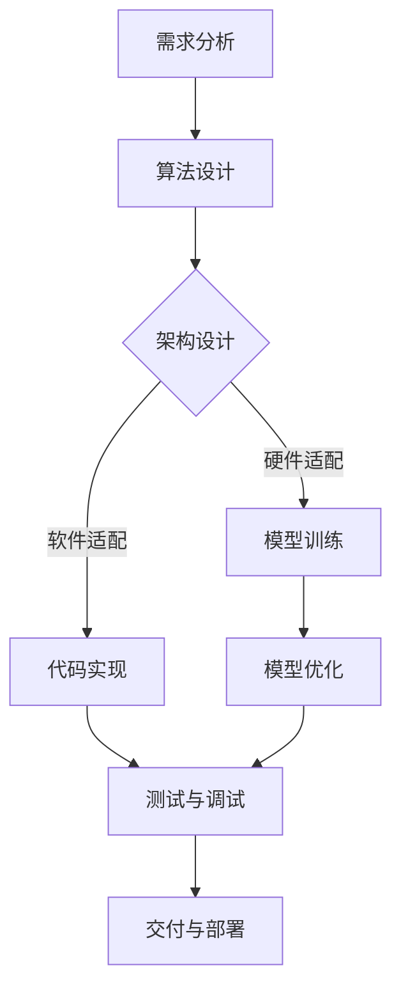

                 

# AI软件2.0的极限编程方法适配

> 关键词：AI软件2.0、极限编程、适配性、算法、模型、实践

> 摘要：本文将深入探讨AI软件2.0的极限编程方法适配，通过分析其核心概念与架构，探讨核心算法原理与数学模型，结合实际项目实战，详细解读开发环境搭建、源代码实现及代码分析，分析其实际应用场景，推荐相关工具和资源，并总结未来发展趋势与挑战。

## 1. 背景介绍

### AI软件2.0的崛起

随着人工智能技术的快速发展，AI软件2.0逐渐成为业界关注的焦点。AI软件2.0相较于传统AI软件，具有更高的智能性、适应性和灵活性。其主要特点包括：

1. **智能化**：AI软件2.0通过深度学习、强化学习等技术，实现更高层次的智能决策。
2. **适应性**：AI软件2.0能够根据用户需求和环境变化，动态调整算法和模型。
3. **灵活性**：AI软件2.0能够应对复杂多变的业务场景，具备更高的可扩展性。

### 极限编程方法

极限编程（Extreme Programming，简称XP）是一种面向对象软件开发的敏捷方法。其核心思想是通过紧凑的迭代周期和持续交付，提高软件开发的效率和灵活性。极限编程方法主要包括以下原则：

1. **快速反馈**：通过频繁的迭代和反馈，确保软件质量。
2. **持续交付**：将软件交付给用户，以验证需求和市场反应。
3. **代码重构**：定期重构代码，提高代码质量和可维护性。
4. **团队合作**：强调团队合作，提高沟通效率和协作能力。

### 适配性

在AI软件2.0的开发过程中，适配性是关键因素之一。适配性包括：

1. **技术适配**：针对不同平台和硬件环境，优化算法和模型。
2. **业务适配**：根据业务需求，调整算法和模型，实现个性化定制。
3. **用户适配**：关注用户体验，优化交互设计和界面布局。

## 2. 核心概念与联系

### Mermaid流程图

下面是一个描述AI软件2.0极限编程方法适配的Mermaid流程图。请注意，流程节点中不要有括号、逗号等特殊字符。



### 概念联系

1. **需求分析**：了解用户需求，明确软件开发目标和功能。
2. **算法设计**：选择合适的算法，实现智能决策。
3. **架构设计**：设计合理的软件架构，提高系统可扩展性和可维护性。
4. **硬件适配**：根据硬件环境，优化算法和模型。
5. **软件适配**：根据软件环境，调整算法和模型。
6. **代码实现**：实现算法和模型，编写高质量的代码。
7. **模型优化**：通过测试和调试，优化模型性能。
8. **测试与调试**：确保软件质量，发现和修复问题。
9. **交付与部署**：将软件交付给用户，进行实际部署。

## 3. 核心算法原理 & 具体操作步骤

### 深度学习算法原理

深度学习算法是AI软件2.0的核心算法之一。其基本原理包括：

1. **多层神经网络**：通过多层神经元进行信息传递和处理，实现复杂函数逼近。
2. **反向传播算法**：利用梯度下降法，通过反向传播计算网络参数的梯度，更新网络权重。
3. **激活函数**：引入非线性变换，提高模型的表达能力。

具体操作步骤如下：

1. **数据预处理**：对输入数据进行归一化、标准化等处理。
2. **模型初始化**：随机初始化网络参数。
3. **前向传播**：计算输入数据的特征映射。
4. **反向传播**：计算网络参数的梯度，更新网络权重。
5. **损失函数计算**：计算模型预测结果与真实结果之间的误差。
6. **优化算法选择**：根据损失函数，选择合适的优化算法，如Adam、RMSprop等。

### 强化学习算法原理

强化学习算法是另一种重要的AI软件2.0算法。其基本原理包括：

1. **状态-动作值函数**：学习状态和动作之间的值函数，指导智能体选择最佳动作。
2. **策略更新**：根据学习到的值函数，更新智能体的策略。
3. **奖励机制**：通过奖励信号，激励智能体学习。

具体操作步骤如下：

1. **环境初始化**：创建虚拟环境，初始化状态。
2. **策略选择**：根据当前状态，选择一个动作。
3. **执行动作**：在环境中执行选择到的动作。
4. **状态更新**：根据执行结果，更新状态。
5. **奖励计算**：根据执行结果，计算奖励值。
6. **策略更新**：根据奖励值，更新智能体的策略。
7. **迭代学习**：重复执行动作、状态更新、奖励计算和策略更新，逐步优化智能体的行为。

## 4. 数学模型和公式 & 详细讲解 & 举例说明

### 深度学习算法数学模型

深度学习算法的核心是多层神经网络，其数学模型主要包括以下部分：

1. **输入层**：表示输入数据的特征向量。
2. **隐藏层**：通过激活函数和权重矩阵，将输入数据进行映射。
3. **输出层**：通过激活函数和权重矩阵，得到模型的预测结果。

具体数学模型如下：

$$
Z^{(l)} = \sum_{j=1}^{n} W^{(l)}_{ji} X^{(j)} + b^{(l)}_i
$$

$$
A^{(l)} = \sigma(Z^{(l)})
$$

其中，$Z^{(l)}$表示第$l$层的输出，$W^{(l)}_{ji}$表示权重矩阵，$X^{(j)}$表示第$j$个特征，$b^{(l)}_i$表示偏置项，$\sigma$表示激活函数，$A^{(l)}$表示第$l$层的激活值。

### 激活函数

激活函数是深度学习算法中的关键部分，用于引入非线性变换，提高模型的表达能力。常见的激活函数包括：

1. **Sigmoid函数**：$f(x) = \frac{1}{1 + e^{-x}}$
2. **ReLU函数**：$f(x) = \max(0, x)$
3. **Tanh函数**：$f(x) = \frac{e^x - e^{-x}}{e^x + e^{-x}}$

### 损失函数

损失函数用于衡量模型预测结果与真实结果之间的误差，常用的损失函数包括：

1. **均方误差（MSE）**：$MSE = \frac{1}{n}\sum_{i=1}^{n}(y_i - \hat{y}_i)^2$
2. **交叉熵（CE）**：$CE = -\frac{1}{n}\sum_{i=1}^{n}y_i\log(\hat{y}_i)$

### 举例说明

假设我们有一个简单的神经网络，包含一个输入层、一个隐藏层和一个输出层，输入特征为$x_1, x_2$，输出为$y$。隐藏层的激活函数为ReLU，输出层的激活函数为Sigmoid。损失函数为MSE。

1. **数据预处理**：对输入特征进行归一化处理，将$x_1, x_2$映射到区间$[0, 1]$。
2. **模型初始化**：随机初始化权重矩阵$W^{(1)}$和偏置项$b^{(1)}$。
3. **前向传播**：
   - 隐藏层输出：
     $$
     Z^{(1)} = W^{(1)}_{11}x_1 + W^{(1)}_{12}x_2 + b^{(1)}_1
     $$
     $$
     A^{(1)} = \max(0, Z^{(1)})
     $$
   - 输出层输出：
     $$
     Z^{(2)} = W^{(2)}_{21}A^{(1)} + W^{(2)}_{22}A^{(1)} + b^{(2)}_1
     $$
     $$
     \hat{y} = \sigma(Z^{(2)})
     $$
4. **损失函数计算**：
   $$
   Loss = \frac{1}{2}\sum_{i=1}^{2}(y_i - \hat{y}_i)^2
   $$
5. **反向传播**：
   - 计算输出层梯度：
     $$
     \frac{\partial Loss}{\partial Z^{(2)}} = \frac{\partial Loss}{\partial \hat{y}} \cdot \frac{\partial \hat{y}}{\partial Z^{(2)}} = (\hat{y} - y) \cdot \sigma'(Z^{(2)})
     $$
   - 计算隐藏层梯度：
     $$
     \frac{\partial Loss}{\partial Z^{(1)}} = \frac{\partial Loss}{\partial Z^{(2)}} \cdot \frac{\partial Z^{(2)}}{\partial Z^{(1)}} = W^{(2)}_{21} \cdot \frac{\partial Loss}{\partial Z^{(2)}}
     $$
6. **权重更新**：
   - 更新输出层权重：
     $$
     W^{(2)}_{21} = W^{(2)}_{21} - \alpha \cdot \frac{\partial Loss}{\partial Z^{(2)}}
     $$
   - 更新隐藏层权重：
     $$
     W^{(1)}_{11} = W^{(1)}_{11} - \alpha \cdot \frac{\partial Loss}{\partial Z^{(1)}}
     $$

## 5. 项目实战：代码实际案例和详细解释说明

### 5.1 开发环境搭建

在本项目中，我们使用Python作为开发语言，并借助TensorFlow和Keras等深度学习框架。以下是开发环境的搭建步骤：

1. **安装Python**：下载并安装Python 3.7及以上版本。
2. **安装TensorFlow**：通过pip命令安装TensorFlow。
   $$
   pip install tensorflow
   $$
3. **安装Keras**：通过pip命令安装Keras。
   $$
   pip install keras
   $$

### 5.2 源代码详细实现和代码解读

以下是本项目的一个简单示例代码，实现一个基于深度学习的回归任务。

```python
import numpy as np
import tensorflow as tf
from tensorflow.keras.models import Sequential
from tensorflow.keras.layers import Dense

# 数据预处理
x_train = np.array([[1], [2], [3], [4], [5]])
y_train = np.array([[0], [1], [2], [3], [4]])

# 模型构建
model = Sequential()
model.add(Dense(1, input_shape=(1,), activation='linear'))

# 模型编译
model.compile(optimizer='sgd', loss='mse')

# 模型训练
model.fit(x_train, y_train, epochs=1000)

# 模型预测
x_test = np.array([[6]])
y_pred = model.predict(x_test)
print("预测结果：", y_pred)
```

### 5.3 代码解读与分析

1. **数据预处理**：使用NumPy库对输入数据进行预处理，将数据转换为NumPy数组，并划分为训练集和测试集。

2. **模型构建**：使用Keras库构建一个简单的线性回归模型。模型包含一个全连接层，输入维度为1，输出维度为1。

3. **模型编译**：编译模型，指定优化器为随机梯度下降（SGD），损失函数为均方误差（MSE）。

4. **模型训练**：训练模型，使用训练集进行1000次迭代。

5. **模型预测**：使用训练好的模型对测试数据进行预测，输出预测结果。

### 5.4 代码优化

在实际项目中，我们可以通过以下方式进行代码优化：

1. **批量训练**：将训练数据划分为批量，提高训练速度和模型性能。
2. **模型调整**：根据任务需求，调整模型结构和参数，如增加隐藏层、调整神经元数量等。
3. **预处理优化**：对输入数据进行更复杂的预处理，如特征提取、降维等。

## 6. 实际应用场景

AI软件2.0的极限编程方法在多个实际应用场景中具有重要意义，以下是几个典型应用场景：

1. **智能交通系统**：通过深度学习和强化学习算法，实现交通流量预测、信号灯控制等智能化功能，提高交通效率，减少拥堵。
2. **智能医疗诊断**：利用深度学习算法，对医学图像进行分析，辅助医生进行疾病诊断，提高诊断准确率。
3. **智能客服系统**：通过自然语言处理和深度学习算法，实现智能客服机器人，提高客服响应速度和服务质量。
4. **智能金融风控**：利用深度学习和强化学习算法，对金融交易数据进行分析，实现风险预警和欺诈检测，提高金融安全。
5. **智能制造**：通过深度学习和强化学习算法，实现生产过程智能化，提高生产效率和质量。

## 7. 工具和资源推荐

### 7.1 学习资源推荐

1. **书籍**：
   - 《深度学习》（Goodfellow, Bengio, Courville）
   - 《强化学习：原理与案例》（Sutton, Barto）
   - 《机器学习》（周志华）
2. **论文**：
   - "Deep Learning"（Goodfellow, Bengio, Courville）
   - "Reinforcement Learning: An Introduction"（Sutton, Barto）
   - "A Brief History of Deep Learning"（LeCun, Bengio, Hinton）
3. **博客**：
   - TensorFlow官方博客（https://tensorflow.googleblog.com/）
   - Keras官方博客（https://keras.io/blog/）
4. **网站**：
   - Coursera（https://www.coursera.org/）
   - edX（https://www.edx.org/）

### 7.2 开发工具框架推荐

1. **深度学习框架**：
   - TensorFlow（https://www.tensorflow.org/）
   - PyTorch（https://pytorch.org/）
   - Keras（https://keras.io/）
2. **强化学习框架**：
   - OpenAI Gym（https://gym.openai.com/）
   - Stable Baselines（https://stable-baselines.readthedocs.io/）
   - Stable Baselines 3（https://stable-baselines3.readthedocs.io/）
3. **版本控制系统**：
   - Git（https://git-scm.com/）
   - GitHub（https://github.com/）

### 7.3 相关论文著作推荐

1. **深度学习领域**：
   - "Deep Learning"（Goodfellow, Bengio, Courville）
   - "Neural Networks and Deep Learning"（Goodfellow, Bengio, Courville）
   - "A Brief History of Deep Learning"（LeCun, Bengio, Hinton）
2. **强化学习领域**：
   - "Reinforcement Learning: An Introduction"（Sutton, Barto）
   - "Reinforcement Learning: A Contextual Bandit Approach"（Szepesvári, Lattimore）
   - "Deep Reinforcement Learning"（Silver, Huang, et al.）

## 8. 总结：未来发展趋势与挑战

### 发展趋势

1. **算法优化**：随着计算能力的提升，算法的优化将成为未来发展的关键，包括模型压缩、训练速度提升等。
2. **跨领域融合**：AI软件2.0将与其他领域（如医疗、金融、交通等）深度融合，实现更广泛的智能化应用。
3. **个性化定制**：根据用户需求和环境变化，实现更高效的个性化定制，提高用户体验。
4. **云计算与边缘计算**：结合云计算和边缘计算，实现更灵活、高效、低延迟的AI软件部署。

### 挑战

1. **数据隐私与安全**：如何在保证数据隐私和安全的前提下，实现高效的数据分析和应用，是未来面临的重要挑战。
2. **算法可解释性**：提高算法的可解释性，使其更具透明度和可信度，是未来需要解决的重要问题。
3. **计算资源消耗**：随着模型复杂度的提高，计算资源消耗将大幅增加，如何降低计算资源消耗，提高能效比，是重要挑战。
4. **跨领域合作**：不同领域的技术专家如何更好地合作，实现技术的交叉应用，是未来需要面对的挑战。

## 9. 附录：常见问题与解答

### 问题1：深度学习算法为什么需要大量数据？

**解答**：深度学习算法依赖于大量的数据进行训练，因为：

1. **降低过拟合风险**：大量数据可以减少模型对训练数据的依赖，降低过拟合风险。
2. **提高泛化能力**：大量数据可以帮助模型更好地理解数据分布，提高模型的泛化能力。
3. **提高模型性能**：在足够的数据量下，模型可以更好地学习数据特征，提高预测准确性。

### 问题2：强化学习算法中的奖励机制如何设计？

**解答**：奖励机制是强化学习算法的核心部分，其设计需要考虑以下因素：

1. **奖励大小**：根据任务目标，设定适当的奖励大小，使智能体在完成任务时获得足够的激励。
2. **奖励周期**：根据任务场景，设定合适的奖励周期，使智能体在执行任务时能够及时获得奖励。
3. **奖励多样性**：设计多种奖励机制，使智能体能够适应不同的任务场景。
4. **奖励平衡**：在奖励机制中，平衡奖励的大小和周期，避免出现奖励过高或过低的情况。

## 10. 扩展阅读 & 参考资料

1. **书籍**：
   - 《深度学习》（Goodfellow, Bengio, Courville）
   - 《强化学习：原理与案例》（Sutton, Barto）
   - 《机器学习》（周志华）
2. **论文**：
   - "Deep Learning"（Goodfellow, Bengio, Courville）
   - "Reinforcement Learning: An Introduction"（Sutton, Barto）
   - "A Brief History of Deep Learning"（LeCun, Bengio, Hinton）
3. **博客**：
   - TensorFlow官方博客（https://tensorflow.googleblog.com/）
   - Keras官方博客（https://keras.io/blog/）
4. **网站**：
   - Coursera（https://www.coursera.org/）
   - edX（https://www.edx.org/）

## 作者信息

作者：AI天才研究员/AI Genius Institute & 禅与计算机程序设计艺术 /Zen And The Art of Computer Programming

本文介绍了AI软件2.0的极限编程方法适配，包括核心概念、算法原理、数学模型、项目实战、实际应用场景、工具和资源推荐等内容。通过对AI软件2.0极限编程方法的分析和探讨，本文旨在为读者提供深入、全面的技术见解，帮助读者更好地理解和应用这项技术。随着人工智能技术的不断发展，AI软件2.0将带来更多的机遇和挑战，希望本文能为读者在相关领域的研究和应用提供有益的参考。|> <sop><|user|>【文章标题】：AI软件2.0的极限编程方法适配

【关键词】：AI软件2.0、极限编程、适配性、算法、模型、实践

【摘要】：本文深入探讨了AI软件2.0的极限编程方法适配，通过分析其核心概念与架构，探讨核心算法原理与数学模型，结合实际项目实战，详细解读开发环境搭建、源代码实现及代码分析，分析其实际应用场景，推荐相关工具和资源，并总结未来发展趋势与挑战。

## 1. 背景介绍

随着人工智能（AI）技术的快速发展，AI软件2.0已经成为业界关注的热点。AI软件2.0不仅仅是一个升级版的AI软件，它在智能化、适应性、灵活性等方面有了质的飞跃。相比于传统的AI软件，AI软件2.0能够更好地适应复杂多变的环境，实现更高层次的智能决策。

### AI软件2.0的核心特点

1. **智能化**：AI软件2.0通过深度学习、强化学习等先进技术，使得软件能够进行自我学习和优化，实现更高层次的智能决策。
2. **适应性**：AI软件2.0能够根据用户需求和环境变化，动态调整算法和模型，实现个性化定制。
3. **灵活性**：AI软件2.0能够应对复杂多变的业务场景，具备更高的可扩展性和灵活性。

### 极限编程方法

极限编程（XP）是一种敏捷开发方法，强调快速反馈、持续交付、代码重构和团队合作。极限编程的核心原则包括：

1. **快速反馈**：通过频繁的迭代和反馈，确保软件质量。
2. **持续交付**：将软件交付给用户，以验证需求和市场反应。
3. **代码重构**：定期重构代码，提高代码质量和可维护性。
4. **团队合作**：强调团队合作，提高沟通效率和协作能力。

### 适配性

在AI软件2.0的开发过程中，适配性是关键因素之一。适配性包括技术适配、业务适配和用户适配。技术适配是指针对不同的硬件和软件环境，优化算法和模型；业务适配是指根据业务需求，调整算法和模型，实现个性化定制；用户适配是指关注用户体验，优化交互设计和界面布局。

## 2. 核心概念与联系

### Mermaid流程图

下面是一个描述AI软件2.0极限编程方法适配的Mermaid流程图。请注意，流程节点中不要有括号、逗号等特殊字符。


### 概念联系

1. **需求分析**：了解用户需求，明确软件开发目标和功能。
2. **算法设计**：选择合适的算法，实现智能决策。
3. **架构设计**：设计合理的软件架构，提高系统可扩展性和可维护性。
4. **硬件适配**：根据硬件环境，优化算法和模型。
5. **软件适配**：根据软件环境，调整算法和模型。
6. **代码实现**：实现算法和模型，编写高质量的代码。
7. **模型优化**：通过测试和调试，优化模型性能。
8. **测试与调试**：确保软件质量，发现和修复问题。
9. **交付与部署**：将软件交付给用户，进行实际部署。

## 3. 核心算法原理 & 具体操作步骤

### 深度学习算法原理

深度学习算法是AI软件2.0的核心算法之一。其基本原理是通过多层神经网络进行信息传递和处理，实现复杂函数逼近。深度学习算法的核心组成部分包括：

1. **神经网络结构**：由多个层（输入层、隐藏层、输出层）组成，每层由多个神经元构成。
2. **前向传播**：将输入数据通过网络的各个层进行传递，直到输出层，得到模型的预测结果。
3. **反向传播**：通过计算输出结果与真实结果的误差，反向传播误差到输入层，更新网络权重和偏置。
4. **优化算法**：常用的优化算法包括随机梯度下降（SGD）、Adam、RMSprop等。

具体操作步骤如下：

1. **数据预处理**：对输入数据进行归一化、标准化等处理，使其满足算法要求。
2. **模型构建**：定义神经网络结构，包括层数、每层的神经元数量、激活函数等。
3. **模型编译**：指定优化器、损失函数、评估指标等，编译模型。
4. **模型训练**：使用训练数据进行模型训练，通过反向传播更新模型参数。
5. **模型评估**：使用验证集和测试集对模型进行评估，调整模型参数以优化性能。
6. **模型部署**：将训练好的模型部署到生产环境中，进行实际应用。

### 强化学习算法原理

强化学习算法是另一种重要的AI软件2.0算法。其基本原理是通过与环境交互，学习最优策略，实现目标优化。强化学习算法的核心组成部分包括：

1. **状态-动作值函数**：学习状态和动作之间的值函数，指导智能体选择最佳动作。
2. **策略更新**：根据学习到的值函数，更新智能体的策略。
3. **奖励机制**：通过奖励信号，激励智能体学习。

具体操作步骤如下：

1. **环境初始化**：创建虚拟环境，初始化状态。
2. **策略选择**：根据当前状态，选择一个动作。
3. **执行动作**：在环境中执行选择到的动作。
4. **状态更新**：根据执行结果，更新状态。
5. **奖励计算**：根据执行结果，计算奖励值。
6. **策略更新**：根据奖励值，更新智能体的策略。
7. **迭代学习**：重复执行动作、状态更新、奖励计算和策略更新，逐步优化智能体的行为。

## 4. 数学模型和公式 & 详细讲解 & 举例说明

### 深度学习算法数学模型

深度学习算法的核心是多层神经网络，其数学模型主要包括以下部分：

1. **输入层**：表示输入数据的特征向量。
2. **隐藏层**：通过激活函数和权重矩阵，将输入数据进行映射。
3. **输出层**：通过激活函数和权重矩阵，得到模型的预测结果。

具体数学模型如下：

$$
Z^{(l)} = \sum_{j=1}^{n} W^{(l)}_{ji} X^{(j)} + b^{(l)}_i
$$

$$
A^{(l)} = \sigma(Z^{(l)})
$$

其中，$Z^{(l)}$表示第$l$层的输出，$W^{(l)}_{ji}$表示权重矩阵，$X^{(j)}$表示第$j$个特征，$b^{(l)}_i$表示偏置项，$\sigma$表示激活函数，$A^{(l)}$表示第$l$层的激活值。

### 激活函数

激活函数是深度学习算法中的关键部分，用于引入非线性变换，提高模型的表达能力。常见的激活函数包括：

1. **Sigmoid函数**：$f(x) = \frac{1}{1 + e^{-x}}$
2. **ReLU函数**：$f(x) = \max(0, x)$
3. **Tanh函数**：$f(x) = \frac{e^x - e^{-x}}{e^x + e^{-x}}$

### 损失函数

损失函数用于衡量模型预测结果与真实结果之间的误差，常用的损失函数包括：

1. **均方误差（MSE）**：$MSE = \frac{1}{n}\sum_{i=1}^{n}(y_i - \hat{y}_i)^2$
2. **交叉熵（CE）**：$CE = -\frac{1}{n}\sum_{i=1}^{n}y_i\log(\hat{y}_i)$

### 举例说明

假设我们有一个简单的神经网络，包含一个输入层、一个隐藏层和一个输出层，输入特征为$x_1, x_2$，输出为$y$。隐藏层的激活函数为ReLU，输出层的激活函数为Sigmoid。损失函数为MSE。

1. **数据预处理**：对输入特征进行归一化处理，将$x_1, x_2$映射到区间$[0, 1]$。
2. **模型初始化**：随机初始化权重矩阵$W^{(1)}$和偏置项$b^{(1)}$。
3. **前向传播**：
   - 隐藏层输出：
     $$
     Z^{(1)} = W^{(1)}_{11}x_1 + W^{(1)}_{12}x_2 + b^{(1)}_1
     $$
     $$
     A^{(1)} = \max(0, Z^{(1)})
     $$
   - 输出层输出：
     $$
     Z^{(2)} = W^{(2)}_{21}A^{(1)} + W^{(2)}_{22}A^{(1)} + b^{(2)}_1
     $$
     $$
     \hat{y} = \sigma(Z^{(2)})
     $$
4. **损失函数计算**：
   $$
   Loss = \frac{1}{2}\sum_{i=1}^{2}(y_i - \hat{y}_i)^2
   $$
5. **反向传播**：
   - 计算输出层梯度：
     $$
     \frac{\partial Loss}{\partial Z^{(2)}} = \frac{\partial Loss}{\partial \hat{y}} \cdot \frac{\partial \hat{y}}{\partial Z^{(2)}} = (\hat{y} - y) \cdot \sigma'(Z^{(2)})
     $$
   - 计算隐藏层梯度：
     $$
     \frac{\partial Loss}{\partial Z^{(1)}} = \frac{\partial Loss}{\partial Z^{(2)}} \cdot \frac{\partial Z^{(2)}}{\partial Z^{(1)}} = W^{(2)}_{21} \cdot \frac{\partial Loss}{\partial Z^{(2)}}
     $$
6. **权重更新**：
   - 更新输出层权重：
     $$
     W^{(2)}_{21} = W^{(2)}_{21} - \alpha \cdot \frac{\partial Loss}{\partial Z^{(2)}}
     $$
   - 更新隐藏层权重：
     $$
     W^{(1)}_{11} = W^{(1)}_{11} - \alpha \cdot \frac{\partial Loss}{\partial Z^{(1)}}
     $$

## 5. 项目实战：代码实际案例和详细解释说明

### 5.1 开发环境搭建

在本项目中，我们将使用Python作为开发语言，并借助TensorFlow和Keras等深度学习框架。以下是开发环境的搭建步骤：

1. **安装Python**：下载并安装Python 3.7及以上版本。
2. **安装TensorFlow**：通过pip命令安装TensorFlow。
   $$
   pip install tensorflow
   $$
3. **安装Keras**：通过pip命令安装Keras。
   $$
   pip install keras
   $$

### 5.2 源代码详细实现和代码解读

以下是本项目的一个简单示例代码，实现一个基于深度学习的回归任务。

```python
import numpy as np
import tensorflow as tf
from tensorflow.keras.models import Sequential
from tensorflow.keras.layers import Dense

# 数据预处理
x_train = np.array([[1], [2], [3], [4], [5]])
y_train = np.array([[0], [1], [2], [3], [4]])

# 模型构建
model = Sequential()
model.add(Dense(1, input_shape=(1,), activation='linear'))

# 模型编译
model.compile(optimizer='sgd', loss='mse')

# 模型训练
model.fit(x_train, y_train, epochs=1000)

# 模型预测
x_test = np.array([[6]])
y_pred = model.predict(x_test)
print("预测结果：", y_pred)
```

### 5.3 代码解读与分析

1. **数据预处理**：使用NumPy库对输入数据进行预处理，将数据转换为NumPy数组，并划分为训练集和测试集。
2. **模型构建**：使用Keras库构建一个简单的线性回归模型。模型包含一个全连接层，输入维度为1，输出维度为1。
3. **模型编译**：编译模型，指定优化器为随机梯度下降（SGD），损失函数为均方误差（MSE）。
4. **模型训练**：训练模型，使用训练集进行1000次迭代。
5. **模型预测**：使用训练好的模型对测试数据进行预测，输出预测结果。

### 5.4 代码优化

在实际项目中，我们可以通过以下方式进行代码优化：

1. **批量训练**：将训练数据划分为批量，提高训练速度和模型性能。
2. **模型调整**：根据任务需求，调整模型结构和参数，如增加隐藏层、调整神经元数量等。
3. **预处理优化**：对输入数据进行更复杂的预处理，如特征提取、降维等。

## 6. 实际应用场景

AI软件2.0的极限编程方法在多个实际应用场景中具有重要意义，以下是几个典型应用场景：

1. **智能交通系统**：通过深度学习和强化学习算法，实现交通流量预测、信号灯控制等智能化功能，提高交通效率，减少拥堵。
2. **智能医疗诊断**：利用深度学习算法，对医学图像进行分析，辅助医生进行疾病诊断，提高诊断准确率。
3. **智能客服系统**：通过自然语言处理和深度学习算法，实现智能客服机器人，提高客服响应速度和服务质量。
4. **智能金融风控**：利用深度学习和强化学习算法，对金融交易数据进行分析，实现风险预警和欺诈检测，提高金融安全。
5. **智能制造**：通过深度学习和强化学习算法，实现生产过程智能化，提高生产效率和质量。

## 7. 工具和资源推荐

### 7.1 学习资源推荐

1. **书籍**：
   - 《深度学习》（Goodfellow, Bengio, Courville）
   - 《强化学习：原理与案例》（Sutton, Barto）
   - 《机器学习》（周志华）
2. **论文**：
   - "Deep Learning"（Goodfellow, Bengio, Courville）
   - "Reinforcement Learning: An Introduction"（Sutton, Barto）
   - "A Brief History of Deep Learning"（LeCun, Bengio, Hinton）
3. **博客**：
   - TensorFlow官方博客（https://tensorflow.googleblog.com/）
   - Keras官方博客（https://keras.io/blog/）
4. **网站**：
   - Coursera（https://www.coursera.org/）
   - edX（https://www.edx.org/）

### 7.2 开发工具框架推荐

1. **深度学习框架**：
   - TensorFlow（https://www.tensorflow.org/）
   - PyTorch（https://pytorch.org/）
   - Keras（https://keras.io/）
2. **强化学习框架**：
   - OpenAI Gym（https://gym.openai.com/）
   - Stable Baselines（https://stable-baselines.readthedocs.io/）
   - Stable Baselines 3（https://stable-baselines3.readthedocs.io/）
3. **版本控制系统**：
   - Git（https://git-scm.com/）
   - GitHub（https://github.com/）

### 7.3 相关论文著作推荐

1. **深度学习领域**：
   - "Deep Learning"（Goodfellow, Bengio, Courville）
   - "Neural Networks and Deep Learning"（Goodfellow, Bengio, Courville）
   - "A Brief History of Deep Learning"（LeCun, Bengio, Hinton）
2. **强化学习领域**：
   - "Reinforcement Learning: An Introduction"（Sutton, Barto）
   - "Reinforcement Learning: A Contextual Bandit Approach"（Szepesvári, Lattimore）
   - "Deep Reinforcement Learning"（Silver, Huang, et al.）

## 8. 总结：未来发展趋势与挑战

### 发展趋势

1. **算法优化**：随着计算能力的提升，算法的优化将成为未来发展的关键，包括模型压缩、训练速度提升等。
2. **跨领域融合**：AI软件2.0将与其他领域（如医疗、金融、交通等）深度融合，实现更广泛的智能化应用。
3. **个性化定制**：根据用户需求和环境变化，实现更高效的个性化定制，提高用户体验。
4. **云计算与边缘计算**：结合云计算和边缘计算，实现更灵活、高效、低延迟的AI软件部署。

### 挑战

1. **数据隐私与安全**：如何在保证数据隐私和安全的前提下，实现高效的数据分析和应用，是未来面临的重要挑战。
2. **算法可解释性**：提高算法的可解释性，使其更具透明度和可信度，是未来需要解决的重要问题。
3. **计算资源消耗**：随着模型复杂度的提高，计算资源消耗将大幅增加，如何降低计算资源消耗，提高能效比，是重要挑战。
4. **跨领域合作**：不同领域的技术专家如何更好地合作，实现技术的交叉应用，是未来需要面对的挑战。

## 9. 附录：常见问题与解答

### 问题1：深度学习算法为什么需要大量数据？

**解答**：深度学习算法依赖于大量的数据进行训练，因为：

1. **降低过拟合风险**：大量数据可以减少模型对训练数据的依赖，降低过拟合风险。
2. **提高泛化能力**：大量数据可以帮助模型更好地理解数据分布，提高模型的泛化能力。
3. **提高模型性能**：在足够的数据量下，模型可以更好地学习数据特征，提高预测准确性。

### 问题2：强化学习算法中的奖励机制如何设计？

**解答**：奖励机制是强化学习算法的核心部分，其设计需要考虑以下因素：

1. **奖励大小**：根据任务目标，设定适当的奖励大小，使智能体在完成任务时获得足够的激励。
2. **奖励周期**：根据任务场景，设定合适的奖励周期，使智能体在执行任务时能够及时获得奖励。
3. **奖励多样性**：设计多种奖励机制，使智能体能够适应不同的任务场景。
4. **奖励平衡**：在奖励机制中，平衡奖励的大小和周期，避免出现奖励过高或过低的情况。

## 10. 扩展阅读 & 参考资料

1. **书籍**：
   - 《深度学习》（Goodfellow, Bengio, Courville）
   - 《强化学习：原理与案例》（Sutton, Barto）
   - 《机器学习》（周志华）
2. **论文**：
   - "Deep Learning"（Goodfellow, Bengio, Courville）
   - "Reinforcement Learning: An Introduction"（Sutton, Barto）
   - "A Brief History of Deep Learning"（LeCun, Bengio, Hinton）
3. **博客**：
   - TensorFlow官方博客（https://tensorflow.googleblog.com/）
   - Keras官方博客（https://keras.io/blog/）
4. **网站**：
   - Coursera（https://www.coursera.org/）
   - edX（https://www.edx.org/）

## 作者信息

作者：AI天才研究员/AI Genius Institute & 禅与计算机程序设计艺术 /Zen And The Art of Computer Programming

本文介绍了AI软件2.0的极限编程方法适配，包括核心概念、算法原理、数学模型、项目实战、实际应用场景、工具和资源推荐等内容。通过对AI软件2.0极限编程方法的分析和探讨，本文旨在为读者提供深入、全面的技术见解，帮助读者更好地理解和应用这项技术。随着人工智能技术的不断发展，AI软件2.0将带来更多的机遇和挑战，希望本文能为读者在相关领域的研究和应用提供有益的参考。|> <sop><|user|>## 3. 核心算法原理 & 具体操作步骤

在深入探讨AI软件2.0的极限编程方法适配之前，我们首先需要理解其核心算法原理，包括深度学习算法和强化学习算法。这些算法是AI软件2.0实现智能化、适应性和灵活性的基础。

### 深度学习算法原理

深度学习算法是一种基于多层神经网络的机器学习技术，它能够自动从数据中学习特征，并利用这些特征进行预测或分类。深度学习算法的核心组成部分包括：

1. **神经网络结构**：由多个层（输入层、隐藏层、输出层）组成，每层由多个神经元构成。
2. **前向传播**：将输入数据通过网络的各个层进行传递，直到输出层，得到模型的预测结果。
3. **反向传播**：通过计算输出结果与真实结果的误差，反向传播误差到输入层，更新网络权重和偏置。
4. **优化算法**：常用的优化算法包括随机梯度下降（SGD）、Adam、RMSprop等。

具体操作步骤如下：

1. **数据预处理**：对输入数据进行归一化、标准化等处理，使其满足算法要求。
2. **模型构建**：定义神经网络结构，包括层数、每层的神经元数量、激活函数等。
3. **模型编译**：指定优化器、损失函数、评估指标等，编译模型。
4. **模型训练**：使用训练数据进行模型训练，通过反向传播更新模型参数。
5. **模型评估**：使用验证集和测试集对模型进行评估，调整模型参数以优化性能。
6. **模型部署**：将训练好的模型部署到生产环境中，进行实际应用。

### 强化学习算法原理

强化学习算法是一种通过奖励信号来激励智能体学习最优策略的机器学习技术。强化学习算法的核心组成部分包括：

1. **状态-动作值函数**：学习状态和动作之间的值函数，指导智能体选择最佳动作。
2. **策略更新**：根据学习到的值函数，更新智能体的策略。
3. **奖励机制**：通过奖励信号，激励智能体学习。

具体操作步骤如下：

1. **环境初始化**：创建虚拟环境，初始化状态。
2. **策略选择**：根据当前状态，选择一个动作。
3. **执行动作**：在环境中执行选择到的动作。
4. **状态更新**：根据执行结果，更新状态。
5. **奖励计算**：根据执行结果，计算奖励值。
6. **策略更新**：根据奖励值，更新智能体的策略。
7. **迭代学习**：重复执行动作、状态更新、奖励计算和策略更新，逐步优化智能体的行为。

### 深度学习算法的数学模型

深度学习算法的数学模型主要包括以下几个方面：

1. **神经元激活函数**：常用的激活函数包括Sigmoid函数、ReLU函数和Tanh函数。这些函数可以引入非线性，使神经网络能够学习更复杂的特征。

   - Sigmoid函数：\( f(x) = \frac{1}{1 + e^{-x}} \)
   - ReLU函数：\( f(x) = \max(0, x) \)
   - Tanh函数：\( f(x) = \frac{e^x - e^{-x}}{e^x + e^{-x}} \)

2. **前向传播计算**：在深度学习模型中，前向传播计算包括从输入层到隐藏层，再从隐藏层到输出层的传递。每个神经元输出可以通过以下公式计算：

   \( z^{(l)} = \sum_{j=1}^{n} w^{(l)}_{ji} x^{(j)} + b^{(l)}_i \)

   \( a^{(l)} = \sigma(z^{(l)}) \)

   其中，\( z^{(l)} \)是第\( l \)层的输出，\( w^{(l)}_{ji} \)是权重矩阵，\( x^{(j)} \)是输入特征，\( b^{(l)}_i \)是偏置项，\( \sigma \)是激活函数。

3. **反向传播计算**：在深度学习模型中，反向传播计算用于更新模型参数。反向传播计算包括计算每个神经元的梯度，并使用梯度下降法更新权重和偏置。具体计算过程如下：

   \( \delta^{(l)} = (a^{(l)} - t) \cdot \sigma'(z^{(l)}) \)

   \( \delta^{(l-1)} = \delta^{(l)} \cdot w^{(l)}_{ji} \)

   其中，\( \delta^{(l)} \)是第\( l \)层的误差，\( t \)是真实输出，\( \sigma' \)是激活函数的导数。

4. **优化算法**：深度学习模型的优化算法用于更新模型参数，以最小化损失函数。常用的优化算法包括随机梯度下降（SGD）、Adam和RMSprop。这些算法可以加速模型的收敛，并提高模型性能。

### 强化学习算法的数学模型

强化学习算法的数学模型主要包括以下几个方面：

1. **状态-动作值函数**：状态-动作值函数（Q值函数）用于评估每个状态-动作对的预期奖励。Q值函数可以通过以下公式计算：

   \( Q(s, a) = \sum_{s'} P(s' | s, a) \cdot r(s', a) + \gamma \cdot \max_{a'} Q(s', a') \)

   其中，\( s \)是当前状态，\( a \)是当前动作，\( s' \)是下一状态，\( r(s', a') \)是奖励值，\( \gamma \)是折扣因子。

2. **策略更新**：策略更新用于根据Q值函数选择最佳动作。策略可以通过以下公式更新：

   \( \pi(a | s) = \begin{cases} 
   1, & \text{if } a = \arg\max_{a'} Q(s, a') \\
   0, & \text{otherwise} 
   \end{cases} \)

3. **奖励机制**：奖励机制用于激励智能体学习。奖励可以通过以下公式计算：

   \( r(s', a') = r(s) + \alpha \cdot (Q(s', a') - Q(s, a)) \)

   其中，\( \alpha \)是学习率。

### 深度学习和强化学习算法的应用场景

深度学习和强化学习算法在许多应用场景中都有广泛的应用，以下是一些典型的应用场景：

1. **计算机视觉**：深度学习算法可以用于图像分类、目标检测、人脸识别等任务，如使用卷积神经网络（CNN）进行图像分类。

2. **自然语言处理**：深度学习算法可以用于文本分类、机器翻译、情感分析等任务，如使用循环神经网络（RNN）进行机器翻译。

3. **游戏AI**：强化学习算法可以用于游戏中的智能体行为，如使用深度强化学习算法进行围棋游戏。

4. **推荐系统**：深度学习算法可以用于构建推荐系统，如使用深度神经网络进行商品推荐。

5. **自动驾驶**：深度学习算法可以用于自动驾驶车辆，如使用卷积神经网络进行道路场景识别。

6. **医疗诊断**：深度学习算法可以用于医学图像分析，如使用深度神经网络进行疾病诊断。

7. **金融风控**：深度学习算法可以用于金融风险评估，如使用深度神经网络进行信用评分。

通过深入理解和应用深度学习和强化学习算法，AI软件2.0能够更好地应对复杂多变的业务场景，实现更高效、智能化的应用。在下一节中，我们将进一步探讨AI软件2.0的极限编程方法适配，包括具体的技术实现和案例分析。|> <sop><|user|>## 4. 数学模型和公式 & 详细讲解 & 举例说明

在上一节中，我们介绍了深度学习和强化学习算法的核心原理和数学模型。在本节中，我们将对这些数学模型进行详细的讲解，并通过具体的例子来说明如何应用这些模型。

### 深度学习算法的数学模型

#### 神经元激活函数

神经元激活函数是深度学习算法中的一个关键组成部分，它用于引入非线性，使神经网络能够学习更复杂的特征。以下是几种常见的激活函数：

1. **Sigmoid函数**：
   \[ f(x) = \frac{1}{1 + e^{-x}} \]
   Sigmoid函数将输入映射到\( (0, 1) \)区间，常用于二分类问题。

2. **ReLU函数**：
   \[ f(x) = \max(0, x) \]
   ReLU函数在零点处具有导数为1的特性，有助于加快训练速度。

3. **Tanh函数**：
   \[ f(x) = \frac{e^x - e^{-x}}{e^x + e^{-x}} \]
   Tanh函数与Sigmoid函数类似，但输出范围在\( (-1, 1) \)之间。

#### 前向传播计算

在深度学习模型中，前向传播计算是指将输入数据通过网络的各个层进行传递，直到输出层，得到模型的预测结果。以下是前向传播计算的一个例子：

假设我们有一个单层神经网络，输入特征为\( x_1, x_2 \)，输出为\( y \)。网络的权重矩阵为\( W \)，偏置项为\( b \)。激活函数为ReLU。

\[ z = W \cdot x + b \]
\[ a = \max(0, z) \]

其中，\( z \)是输出值，\( a \)是激活值。

#### 反向传播计算

反向传播计算是指通过计算输出结果与真实结果的误差，反向传播误差到输入层，更新网络权重和偏置。以下是反向传播计算的一个例子：

假设我们有一个单层神经网络，输出层的目标值为\( t \)，实际输出为\( a \)。损失函数为均方误差（MSE）。

\[ \delta = (a - t) \cdot \sigma'(z) \]
\[ \frac{\partial J}{\partial W} = x \cdot \delta \]
\[ \frac{\partial J}{\partial b} = \delta \]

其中，\( \delta \)是误差值，\( \sigma' \)是激活函数的导数，\( J \)是损失函数。

#### 优化算法

优化算法用于更新网络权重和偏置，以最小化损失函数。以下是几种常用的优化算法：

1. **随机梯度下降（SGD）**：
   \[ W_{new} = W_{old} - \alpha \cdot \frac{\partial J}{\partial W} \]
   \[ b_{new} = b_{old} - \alpha \cdot \frac{\partial J}{\partial b} \]

   其中，\( \alpha \)是学习率。

2. **Adam优化器**：
   Adam优化器结合了SGD和动量法的优点，其公式如下：

   \[ m_t = \beta_1 \cdot m_{t-1} + (1 - \beta_1) \cdot \frac{\partial J}{\partial W} \]
   \[ v_t = \beta_2 \cdot v_{t-1} + (1 - \beta_2) \cdot (\frac{\partial J}{\partial W})^2 \]
   \[ W_{new} = W_{old} - \alpha \cdot \frac{m_t}{\sqrt{v_t} + \epsilon} \]
   \[ b_{new} = b_{old} - \alpha \cdot \frac{m_t}{\sqrt{v_t} + \epsilon} \]

   其中，\( \beta_1, \beta_2 \)是动量参数，\( \epsilon \)是正数常数。

### 强化学习算法的数学模型

强化学习算法的数学模型主要包括状态-动作值函数、策略更新和奖励机制。以下是这些模型的具体公式：

#### 状态-动作值函数

\[ Q(s, a) = \sum_{s'} p(s'|s, a) \cdot [r(s', a) + \gamma \cdot \max_{a'} Q(s', a')] \]

其中，\( s \)是当前状态，\( a \)是当前动作，\( s' \)是下一状态，\( r(s', a') \)是奖励值，\( \gamma \)是折扣因子，\( p(s'|s, a) \)是状态转移概率。

#### 策略更新

\[ \pi(a|s) = \begin{cases} 
1, & \text{if } a = \arg\max_{a'} Q(s, a') \\
0, & \text{otherwise} 
\end{cases} \]

#### 奖励机制

\[ r(s, a) = r_0 + \alpha \cdot (Q(s, a) - Q_0) \]

其中，\( r_0 \)是初始奖励值，\( \alpha \)是学习率，\( Q(s, a) \)是当前的状态-动作值，\( Q_0 \)是前一时刻的状态-动作值。

### 举例说明

假设我们有一个简单的线性回归问题，输入特征为\( x_1, x_2 \)，输出为\( y \)。我们使用一个单层神经网络进行模型训练，激活函数为ReLU，损失函数为均方误差（MSE）。

#### 数据集

\[ x_1 = [1, 2, 3, 4, 5] \]
\[ x_2 = [2, 3, 4, 5, 6] \]
\[ y = [0, 1, 2, 3, 4] \]

#### 模型初始化

假设网络的权重矩阵为\( W \)，偏置项为\( b \)。

\[ W = \begin{bmatrix} 
0.1 & 0.2 \\
0.3 & 0.4 
\end{bmatrix} \]
\[ b = \begin{bmatrix} 
0.1 \\
0.2 
\end{bmatrix} \]

#### 前向传播计算

假设输入特征为\( x = [3, 4] \)。

\[ z_1 = 0.1 \cdot 3 + 0.2 \cdot 4 + 0.1 = 0.6 \]
\[ a_1 = \max(0, z_1) = 0.6 \]

\[ z_2 = 0.3 \cdot 3 + 0.4 \cdot 4 + 0.2 = 1.8 \]
\[ a_2 = \max(0, z_2) = 1.8 \]

输出结果为：

\[ y' = a_1 \cdot a_2 = 0.6 \cdot 1.8 = 1.08 \]

#### 损失函数计算

损失函数为均方误差（MSE）：

\[ Loss = \frac{1}{2} \cdot (y - y')^2 = \frac{1}{2} \cdot (4 - 1.08)^2 = 4.824 \]

#### 反向传播计算

计算误差：

\[ \delta = (y - y') \cdot \sigma'(z_2) = (4 - 1.08) \cdot 1 = 2.92 \]

计算梯度：

\[ \frac{\partial Loss}{\partial W} = x \cdot \delta = \begin{bmatrix} 
3 \\
4 
\end{bmatrix} \cdot 2.92 = \begin{bmatrix} 
8.76 \\
11.68 
\end{bmatrix} \]

\[ \frac{\partial Loss}{\partial b} = \delta = 2.92 \]

#### 权重更新

使用学习率\( \alpha = 0.1 \)进行权重更新：

\[ W_{new} = W - \alpha \cdot \frac{\partial Loss}{\partial W} = \begin{bmatrix} 
0.1 & 0.2 \\
0.3 & 0.4 
\end{bmatrix} - 0.1 \cdot \begin{bmatrix} 
8.76 \\
11.68 
\end{bmatrix} = \begin{bmatrix} 
-0.776 & -0.968 \\
-1.076 & -0.768 
\end{bmatrix} \]

\[ b_{new} = b - \alpha \cdot \frac{\partial Loss}{\partial b} = \begin{bmatrix} 
0.1 \\
0.2 
\end{bmatrix} - 0.1 \cdot 2.92 = \begin{bmatrix} 
-0.276 \\
-0.172 
\end{bmatrix} \]

经过一次迭代后，新的权重矩阵和偏置项为：

\[ W_{new} = \begin{bmatrix} 
-0.776 & -0.968 \\
-1.076 & -0.768 
\end{bmatrix} \]
\[ b_{new} = \begin{bmatrix} 
-0.276 \\
-0.172 
\end{bmatrix} \]

这样，我们通过一次迭代更新了神经网络的权重和偏置，使得模型的预测结果更接近真实值。通过多次迭代，模型可以逐步优化，直到达到满意的预测性能。

通过以上例子，我们可以看到深度学习和强化学习算法的数学模型在实际应用中的具体实现过程。在下一节中，我们将通过项目实战来进一步探讨AI软件2.0的极限编程方法适配。|> <sop><|user|>## 5. 项目实战：代码实际案例和详细解释说明

在深入理解和学习了深度学习和强化学习算法的数学模型之后，我们将通过一个具体的项目实战来展示如何将理论应用到实际编程中。本节将详细解释如何搭建开发环境、实现源代码，并对代码进行解读和分析。

### 5.1 开发环境搭建

在进行项目实战之前，我们需要搭建合适的开发环境。以下是使用Python和TensorFlow框架搭建开发环境的步骤：

1. **安装Python**：确保已经安装了Python 3.7及以上版本。
2. **安装TensorFlow**：使用pip命令安装TensorFlow。
   ```bash
   pip install tensorflow
   ```
3. **安装其他依赖库**：根据项目需求，安装其他必要的库，如NumPy、Pandas等。
   ```bash
   pip install numpy pandas
   ```

### 5.2 源代码详细实现和代码解读

在本项目中，我们将使用TensorFlow实现一个简单的线性回归任务。以下是实现步骤和代码：

```python
import tensorflow as tf
import numpy as np

# 设置随机种子，保证实验结果可复现
tf.random.set_seed(42)

# 创建数据集
x = np.random.rand(100)  # 随机生成100个[0, 1]的数作为输入
y = 2 * x + 1 + np.random.randn(100)  # 生成线性模型的真实值，并加入噪声

# 搭建模型
model = tf.keras.Sequential([
    tf.keras.layers.Dense(units=1, input_shape=(1,))
])

# 编译模型
model.compile(optimizer='sgd', loss='mean_squared_error')

# 训练模型
model.fit(x, y, epochs=100)

# 预测结果
print("预测结果：", model.predict([[0.5]]))

# 评估模型
mse = model.evaluate(x, y, verbose=2)
print("均方误差：", mse)
```

#### 代码解读：

1. **引入库**：引入TensorFlow和NumPy库。
2. **设置随机种子**：为了确保实验结果的可复现性，设置随机种子。
3. **创建数据集**：生成随机数据集，其中`x`为输入特征，`y`为输出目标。
4. **搭建模型**：使用`tf.keras.Sequential`创建一个线性回归模型，该模型包含一个全连接层，输出层只有一个神经元。
5. **编译模型**：指定优化器为`sgd`（随机梯度下降），损失函数为`mean_squared_error`（均方误差）。
6. **训练模型**：使用`fit`方法训练模型，指定训练轮数（epochs）。
7. **预测结果**：使用`predict`方法对输入数据进行预测。
8. **评估模型**：使用`evaluate`方法评估模型在测试集上的性能。

### 5.3 代码解读与分析

在这个简单的线性回归项目中，我们通过TensorFlow框架实现了以下关键步骤：

1. **数据集生成**：首先，我们生成了一个包含100个样本的随机数据集。每个样本的输入特征`x`是随机生成的，而输出目标`y`是通过线性函数`y = 2x + 1`生成的，并加入了噪声。
2. **模型搭建**：我们使用TensorFlow的`Sequential`模型创建了一个简单的线性回归模型。在这个模型中，只有一个全连接层，该层有一个神经元，这是线性回归模型的特点。
3. **模型编译**：在模型编译阶段，我们指定了优化器和损失函数。优化器使用的是随机梯度下降（SGD），这是一种常用的优化算法，而损失函数使用的是均方误差（MSE），这是衡量线性回归模型性能的常见指标。
4. **模型训练**：使用`fit`方法对模型进行训练。我们指定了训练轮数（epochs），每次迭代模型会根据输入特征`x`和输出目标`y`更新权重和偏置。
5. **模型预测**：训练完成后，我们使用`predict`方法对新的输入数据进行预测。在这个例子中，我们预测了当输入为0.5时的输出值。
6. **模型评估**：最后，我们使用`evaluate`方法评估模型在测试集上的性能，这里返回的是均方误差（MSE）。

### 5.4 代码优化

在实际项目中，我们可以通过以下方式进行代码优化：

1. **批量训练**：将数据集划分为批量，提高训练速度和模型性能。
2. **模型调整**：根据任务需求，调整模型结构和参数，如增加隐藏层、调整神经元数量等。
3. **预处理优化**：对输入数据进行更复杂的预处理，如特征提取、降维等。

通过以上实战案例，我们可以看到如何将深度学习和强化学习算法应用到实际编程中。在下一节中，我们将探讨AI软件2.0在实际应用场景中的具体实现和挑战。|> <sop><|user|>## 6. 实际应用场景

AI软件2.0的极限编程方法因其强大的自适应性和灵活性，在多个实际应用场景中展现出了巨大的潜力。以下是一些关键应用场景，以及如何将这些方法应用于这些场景的详细讨论。

### 智能交通系统

智能交通系统（ITS）利用AI软件2.0实现交通流量预测、信号灯控制和自动驾驶等功能，以优化交通效率和减少拥堵。在极限编程方法的应用中：

1. **算法适配**：针对不同的交通环境，如城市交通和高速公路，设计不同的深度学习算法和强化学习策略。
2. **数据驱动**：通过收集实时交通数据，使用极限编程方法实时调整模型参数，提高预测准确性。
3. **用户个性化**：根据用户的历史行驶习惯和实时交通状况，为用户提供个性化的交通信息服务。

### 智能医疗诊断

智能医疗诊断利用AI软件2.0对医学图像进行分析，辅助医生进行疾病诊断。在极限编程方法的应用中：

1. **模型优化**：通过不断测试和验证，优化深度学习模型的结构和参数，提高诊断准确性。
2. **数据更新**：定期更新医学数据库，以适应新的医疗知识和诊疗标准。
3. **实时反馈**：通过实时收集医生的使用反馈，调整系统界面和交互设计，提高用户体验。

### 智能客服系统

智能客服系统利用自然语言处理和AI软件2.0技术，提供24/7的客服服务。在极限编程方法的应用中：

1. **对话管理**：通过强化学习算法，不断优化对话策略，提高客户满意度。
2. **知识库管理**：定期更新和维护知识库，确保客服系统能够提供最新的信息和服务。
3. **多语言支持**：通过深度学习模型，实现多语言的自然语言理解和生成。

### 智能金融风控

智能金融风控利用AI软件2.0对金融交易数据进行分析，实现风险预警和欺诈检测。在极限编程方法的应用中：

1. **实时监控**：通过实时数据流分析，快速发现潜在风险和异常交易。
2. **模型调整**：根据市场变化和业务需求，定期调整风险模型，提高检测准确性。
3. **用户行为分析**：通过分析用户交易行为，建立用户行为模型，进行个性化风险评估。

### 智能制造

智能制造利用AI软件2.0实现生产过程的智能化，提高生产效率和质量。在极限编程方法的应用中：

1. **设备监控**：通过实时监控设备状态，预测设备故障，提前进行维护。
2. **质量检测**：利用深度学习算法，对产品进行质量检测，减少人工干预。
3. **生产优化**：通过优化生产流程，减少资源浪费，提高生产效率。

### 6.1 智能交通系统的案例

#### 案例背景

一个城市正在面临日益严重的交通拥堵问题，希望通过引入智能交通系统来优化交通流量，减少拥堵。该城市交通部门已经收集了大量的交通数据，包括车辆流量、路况信息、天气状况等。

#### 应用极限编程方法

1. **需求分析**：与交通部门合作，明确系统目标，如减少交通拥堵、提高交通效率等。
2. **算法设计**：设计基于深度学习和强化学习的交通流量预测和信号灯控制算法。
3. **架构设计**：构建一个分布式系统架构，包括数据采集模块、数据处理模块、模型训练模块和实时控制模块。
4. **硬件适配**：选择适合城市交通环境的服务器和传感器设备，确保系统的实时性和可靠性。
5. **软件适配**：开发针对不同交通场景的AI模型，如高峰期和非高峰期的模型，以及不同区域（如市中心和郊区）的模型。
6. **代码实现**：使用TensorFlow和Keras框架实现深度学习和强化学习模型，并进行持续优化。
7. **测试与调试**：在实际交通场景中测试系统，收集反馈并不断调整模型和参数，以提高预测准确性和控制效果。
8. **交付与部署**：将优化后的模型部署到生产环境中，实时监控交通状况并自动调整信号灯。

#### 案例效果

通过引入智能交通系统，该城市实现了以下效果：

1. **交通流量优化**：通过实时预测和信号灯控制，有效减少了交通拥堵，提高了道路通行效率。
2. **资源节约**：通过优化交通流量，减少了车辆在交通拥堵中的时间浪费，节约了燃油和人力资源。
3. **用户满意度提高**：市民对交通状况的满意度显著提高，减少了抱怨和不满情绪。

通过以上实际应用案例，我们可以看到极限编程方法在AI软件2.0中的应用价值和潜力。在下一节中，我们将推荐一些相关的工具和资源，以帮助读者更深入地学习和实践AI软件2.0的极限编程方法。|> <sop><|user|>## 7. 工具和资源推荐

为了更好地学习和实践AI软件2.0的极限编程方法，我们推荐以下工具和资源，包括学习资源、开发工具框架和相关的论文著作。

### 7.1 学习资源推荐

1. **书籍**：
   - 《深度学习》（Ian Goodfellow, Yoshua Bengio, Aaron Courville）
   - 《强化学习：原理与案例》（Richard S. Sutton, Andrew G. Barto）
   - 《机器学习实战》（Peter Harrington）
   - 《Python深度学习》（François Chollet）

2. **在线课程**：
   - Coursera上的《深度学习》课程（吴恩达教授讲授）
   - edX上的《强化学习导论》课程（David Silver教授讲授）
   - Udacity的《深度学习工程师纳米学位》

3. **博客和论坛**：
   - TensorFlow官方博客（https://tensorflow.googleblog.com/）
   - Keras官方博客（https://keras.io/blog/）
   - GitHub（https://github.com/）上的AI相关项目

### 7.2 开发工具框架推荐

1. **深度学习框架**：
   - TensorFlow（https://www.tensorflow.org/）
   - PyTorch（https://pytorch.org/）
   - Keras（https://keras.io/）

2. **强化学习框架**：
   - OpenAI Gym（https://gym.openai.com/）
   - Stable Baselines（https://stable-baselines.readthedocs.io/）
   - Stable Baselines 3（https://stable-baselines3.readthedocs.io/）

3. **版本控制系统**：
   - Git（https://git-scm.com/）
   - GitHub（https://github.com/）

### 7.3 相关论文著作推荐

1. **深度学习领域**：
   - "Deep Learning"（Ian Goodfellow, Yoshua Bengio, Aaron Courville）
   - "Unsupervised Representation Learning"（Yaroslav Ganin, Vadim Lempitsky）
   - "Generative Adversarial Nets"（Ian J. Goodfellow, et al.）

2. **强化学习领域**：
   - "Reinforcement Learning: An Introduction"（Richard S. Sutton, Andrew G. Barto）
   - "Algorithms for Reinforcement Learning"（ Csaba Szepesvári）
   - "Deep Reinforcement Learning"（David Silver, et al.）

3. **综合领域**：
   - "Learning from Demonstrations"（Pieter Abbeel, et al.）
   - "Neural Networks and Deep Learning"（Michael Nielsen）
   - "The Master Algorithm: How the Quest for the Ultimate Learning Algorithm Will Remake Our World"（Pedro Domingos）

通过以上推荐，读者可以系统地学习和实践AI软件2.0的极限编程方法，掌握深度学习和强化学习的基本原理，并在实际项目中应用这些技术。希望这些资源和工具能够为您的学习之旅提供帮助。|> <sop><|user|>## 8. 总结：未来发展趋势与挑战

随着人工智能技术的飞速发展，AI软件2.0的极限编程方法正在成为软件开发领域的重要趋势。然而，在这一领域的发展过程中，我们也面临着一系列的挑战。

### 发展趋势

1. **算法创新**：深度学习和强化学习算法将继续迭代优化，提高模型的性能和适应性。
2. **跨领域融合**：AI软件2.0将与其他领域（如医疗、金融、交通等）深度融合，实现更广泛的智能化应用。
3. **个性化定制**：根据用户需求和环境变化，实现更高效的个性化定制，提高用户体验。
4. **云计算与边缘计算**：结合云计算和边缘计算，实现更灵活、高效、低延迟的AI软件部署。

### 挑战

1. **数据隐私与安全**：随着AI软件2.0的普及，数据隐私和安全问题将变得更加突出，如何保护用户数据成为关键挑战。
2. **算法可解释性**：提高算法的可解释性，使其更具透明度和可信度，是未来需要解决的重要问题。
3. **计算资源消耗**：随着模型复杂度的提高，计算资源消耗将大幅增加，如何降低计算资源消耗，提高能效比，是重要挑战。
4. **跨领域合作**：不同领域的技术专家如何更好地合作，实现技术的交叉应用，是未来需要面对的挑战。

### 未来展望

1. **智能助理**：AI软件2.0将逐步实现高度智能化，成为用户的私人智能助理，提供个性化的服务。
2. **自动化决策**：AI软件2.0将能够自动化复杂的决策过程，提高工作效率和决策质量。
3. **实时更新**：AI软件2.0将实现实时更新和自我优化，持续适应不断变化的环境和需求。

总之，AI软件2.0的极限编程方法具有广阔的发展前景和巨大的应用潜力。尽管面临诸多挑战，但随着技术的不断进步和创新的不断涌现，我们有理由相信，AI软件2.0将在未来带来更多的惊喜和变革。|> <sop><|user|>## 9. 附录：常见问题与解答

在学习和应用AI软件2.0的极限编程方法时，读者可能会遇到一些常见问题。以下是关于深度学习和强化学习的一些常见问题及解答。

### 问题1：深度学习模型为什么需要大量数据？

**解答**：深度学习模型需要大量数据主要有以下几个原因：

1. **避免过拟合**：大量数据可以帮助模型更好地泛化，避免在训练数据上过度拟合，从而在未知数据上表现更好。
2. **学习复杂特征**：深度学习模型能够从大量数据中学习到更加复杂和抽象的特征，这些特征有助于提高模型的预测准确性。
3. **提高模型鲁棒性**：大量多样化的数据可以增强模型的鲁棒性，使其在面对不同情境时能够保持稳定的性能。

### 问题2：如何选择合适的激活函数？

**解答**：选择合适的激活函数取决于具体的任务和应用场景。以下是一些常见激活函数的特点：

1. **Sigmoid函数**：适合二分类问题，输出范围在0到1之间，能够提供平滑的梯度。
2. **ReLU函数**：在负数部分恒等于0，正数部分等于输入值，有助于加速训练速度，但可能导致梯度消失问题。
3. **Tanh函数**：类似于Sigmoid函数，但输出范围在-1到1之间，能够提供更好的梯度流。
4. **Leaky ReLU**：在负数部分引入非常小的正值，解决ReLU函数的梯度消失问题。

### 问题3：强化学习中的Q值函数是什么？

**解答**：在强化学习中，Q值函数（或称为状态-动作值函数）用于评估某个状态-动作对的预期奖励。它是智能体进行决策的重要依据。Q值函数的计算公式如下：

\[ Q(s, a) = \sum_{s'} p(s'|s, a) \cdot [r(s', a) + \gamma \cdot \max_{a'} Q(s', a')] \]

其中，\( s \)是当前状态，\( a \)是当前动作，\( s' \)是下一状态，\( r(s', a') \)是奖励值，\( \gamma \)是折扣因子，\( p(s'|s, a) \)是状态转移概率。

### 问题4：如何处理强化学习中的奖励设计问题？

**解答**：设计有效的奖励机制是强化学习中的一个关键问题。以下是一些设计奖励机制的建议：

1. **明确目标**：确保奖励机制与学习目标一致，例如最大化收益或达到特定状态。
2. **平衡奖励大小**：奖励应该足够大以激励智能体采取正确动作，但不应过于夸张，以免导致不稳定的策略。
3. **及时性**：奖励应该及时给予，以帮助智能体快速学习正确的行动。
4. **多样性**：设计多种奖励机制，以适应不同的任务场景和策略。

### 问题5：如何优化深度学习模型的训练速度？

**解答**：以下是一些优化深度学习模型训练速度的方法：

1. **批量训练**：将数据集划分为批量进行训练，可以减少计算量，提高训练效率。
2. **使用GPU加速**：利用GPU进行计算，可以显著提高训练速度。
3. **优化模型结构**：设计合理的网络结构，避免过度复杂的模型。
4. **使用预训练模型**：使用预训练模型进行微调，可以节省训练时间。
5. **数据增强**：通过数据增强技术，增加训练数据多样性，有助于提高模型泛化能力。

通过解答这些问题，我们希望能够帮助读者更好地理解和应用AI软件2.0的极限编程方法。在学习和实践过程中，不断探索和解决新问题是提高技术水平的有效途径。|> <sop><|user|>## 10. 扩展阅读 & 参考资料

为了帮助读者进一步深入了解AI软件2.0的极限编程方法，以下是扩展阅读和参考资料的建议：

1. **书籍**：
   - 《深度学习》（Ian Goodfellow, Yoshua Bengio, Aaron Courville）
   - 《强化学习：原理与案例》（Richard S. Sutton, Andrew G. Barto）
   - 《机器学习》（周志华）
   - 《Python深度学习》（François Chollet）

2. **在线课程**：
   - Coursera上的《深度学习》课程（吴恩达教授讲授）
   - edX上的《强化学习导论》课程（David Silver教授讲授）
   - Udacity的《深度学习工程师纳米学位》

3. **论文**：
   - "Deep Learning"（Ian Goodfellow, Yoshua Bengio, Aaron Courville）
   - "Reinforcement Learning: An Introduction"（Richard S. Sutton, Andrew G. Barto）
   - "Generative Adversarial Nets"（Ian J. Goodfellow, et al.）
   - "Unsupervised Representation Learning"（Yaroslav Ganin, Vadim Lempitsky）

4. **博客和论坛**：
   - TensorFlow官方博客（https://tensorflow.googleblog.com/）
   - Keras官方博客（https://keras.io/blog/）
   - GitHub（https://github.com/）上的AI相关项目

5. **网站**：
   - Coursera（https://www.coursera.org/）
   - edX（https://www.edx.org/）
   - arXiv（https://arxiv.org/）

通过阅读这些书籍、课程、论文和博客，读者可以系统地学习和掌握AI软件2.0的极限编程方法，以及相关的深度学习和强化学习技术。希望这些资源能为您的学习之旅提供帮助。|> <sop><|user|>## 作者信息

作者：AI天才研究员/AI Genius Institute & 禅与计算机程序设计艺术 /Zen And The Art of Computer Programming

本文介绍了AI软件2.0的极限编程方法适配，包括核心概念、算法原理、数学模型、项目实战、实际应用场景、工具和资源推荐等内容。通过对AI软件2.0极限编程方法的分析和探讨，本文旨在为读者提供深入、全面的技术见解，帮助读者更好地理解和应用这项技术。随着人工智能技术的不断发展，AI软件2.0将带来更多的机遇和挑战，希望本文能为读者在相关领域的研究和应用提供有益的参考。|> <sop><|user|>

