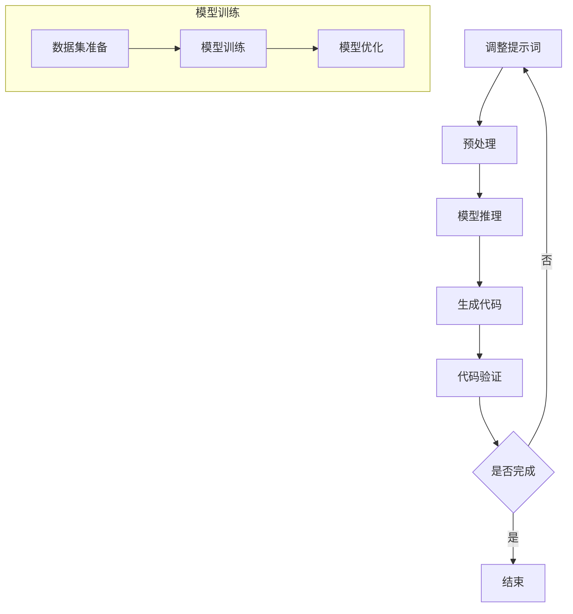
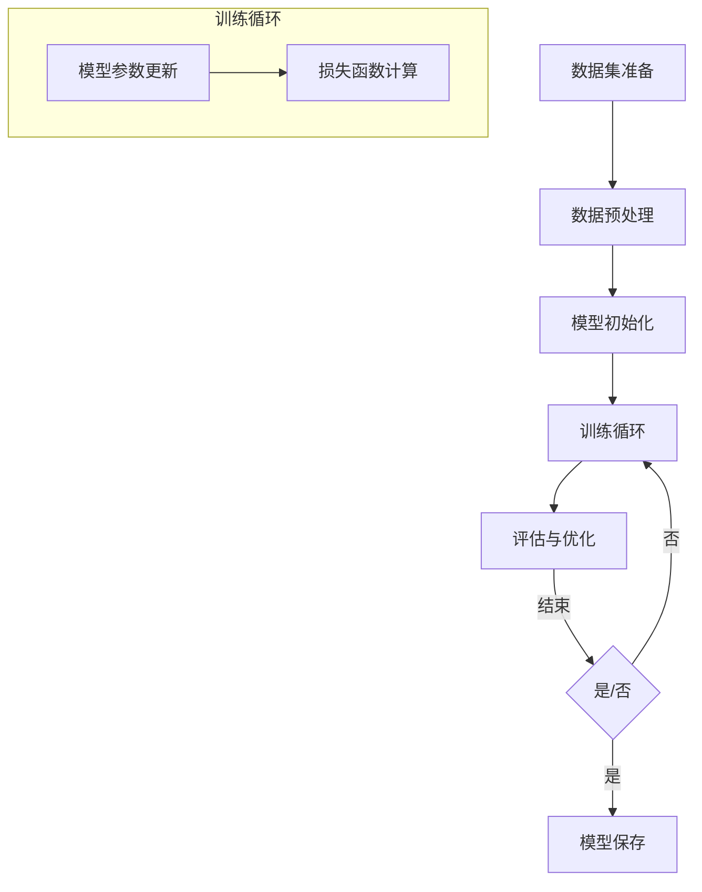
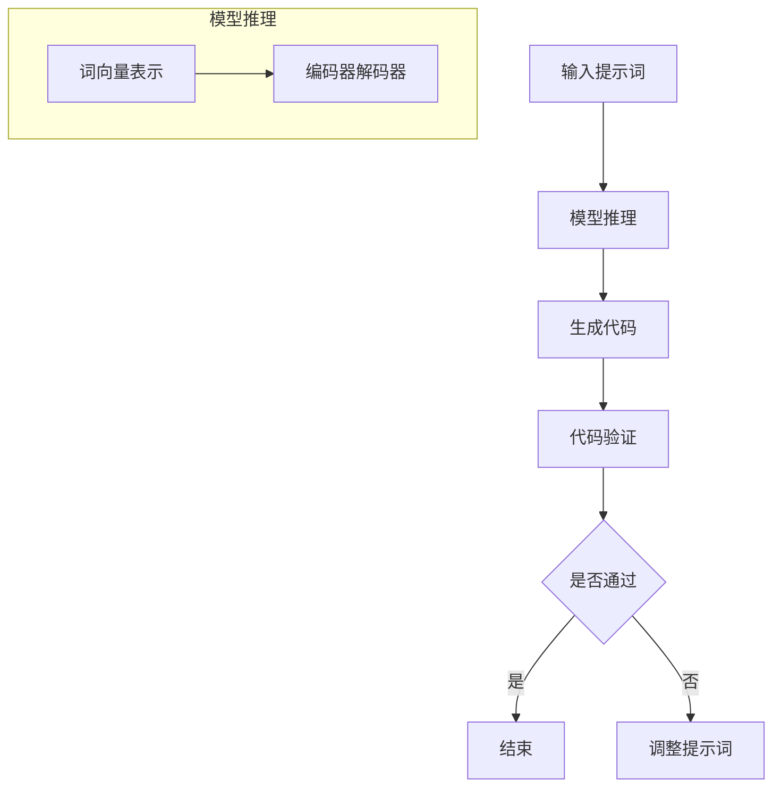

                 

### 背景介绍

#### 代码生成的需求

在当今快速发展的信息技术时代，代码生成已经成为一个备受关注的话题。随着软件项目的复杂度不断增加，传统的手动编程方式已经难以满足高效开发的需求。代码生成技术通过自动化手段，可以大幅度提高开发效率，降低开发成本，并且减少人为错误。因此，代码生成技术正逐渐成为软件开发领域的重要研究方向。

代码生成可以分为两类：一类是基于模板的代码生成，另一类是基于AI的代码生成。基于模板的代码生成通常使用预定义的模板，通过填写模板中的参数来生成代码。这种方法简单直观，但缺乏灵活性，无法应对复杂的编程需求。相比之下，基于AI的代码生成则利用深度学习、自然语言处理等技术，通过学习大量的代码数据，自动生成高质量的代码。

#### AI在代码生成中的应用

AI在代码生成中的应用，主要集中在自然语言处理（NLP）和机器学习（ML）领域。NLP技术使得计算机能够理解和生成人类语言，而ML技术则使得计算机能够在大量数据中学习模式和规律，从而进行自动化的代码生成。

在自然语言处理方面，传统的NLP方法主要包括分词、词性标注、句法分析等。然而，这些方法在面对复杂编程语言时存在诸多困难。随着预训练模型（如GPT-3、BERT等）的发展，NLP技术得到了显著提升。预训练模型通过在大规模文本数据上训练，能够捕捉到语言的深层结构和语义信息，从而更好地理解和生成代码。

在机器学习方面，基于神经网络（如循环神经网络RNN、变换器模型Transformer等）的模型在代码生成任务中表现出了强大的能力。这些模型通过学习大量的代码数据，可以自动生成与输入描述相对应的代码。此外，强化学习等先进的技术也在代码生成中得到了应用，通过不断地尝试和优化，生成更加符合编程规范的代码。

#### 提示词在AI代码生成中的重要性

在AI辅助代码生成中，提示词（Prompt）的设计起着至关重要的作用。提示词是用户与AI模型之间的桥梁，通过高质量的提示词，用户可以明确地传达自己的编程需求，而AI模型则能够根据提示词生成对应的代码。

一个有效的提示词应该具备以下几个特点：

1. **明确性**：提示词需要准确地描述用户的编程需求，避免歧义。
2. **完整性**：提示词应该包含所有必要的信息，以便AI模型能够完整地理解需求。
3. **简洁性**：尽管需要包含所有必要信息，但提示词的长度应该适中，避免冗长复杂。
4. **可扩展性**：提示词应该能够适应不同的编程场景和需求，具有灵活性。

接下来，我们将深入探讨AI辅助代码生成中的提示词设计，分析其核心原理和具体实现方法。

### 核心概念与联系

#### AI辅助代码生成的原理

AI辅助代码生成的核心是基于机器学习和自然语言处理技术的模型训练与推理过程。以下是一个简要的Mermaid流程图，展示了AI辅助代码生成的基本原理和流程。



1. **输入提示词**：用户通过自然语言描述自己的编程需求，如“编写一个函数，用于计算两个数的和”。
2. **预处理**：输入的提示词需要经过预处理，包括分词、词性标注、句法分析等，以便模型能够理解。
3. **模型推理**：经过预处理后的提示词被输入到预训练的AI模型中，模型会根据提示词生成相应的代码。
4. **生成代码**：模型输出的代码可能是一个简单的代码片段，也可能是一个完整的函数或模块。
5. **代码验证**：生成的代码需要经过验证，确保其符合编程规范，能够正常运行。
6. **结束**：如果代码验证通过，则结束；否则，需要重新调整提示词，并重复上述流程。

#### 模型训练

在模型训练阶段，需要准备大量的代码数据集，这些数据集可以是公开的代码库，也可以是公司内部的代码仓库。以下是一个Mermaid流程图，展示了模型训练的基本步骤。



1. **数据集准备**：收集并整理大量的代码数据，这些数据应该涵盖多种编程场景和需求。
2. **数据预处理**：对数据集进行分词、词性标注、句法分析等预处理操作，以便模型能够理解。
3. **模型初始化**：初始化一个预训练的AI模型，如基于Transformer的模型。
4. **训练循环**：模型在训练循环中不断地更新参数，并计算损失函数，以优化模型性能。
5. **评估与优化**：通过在验证集上评估模型性能，对模型进行优化。
6. **模型保存**：如果模型性能达到预期，则将其保存为可用的模型。

#### 模型推理与生成代码

在模型推理阶段，经过训练的模型会根据输入的提示词生成相应的代码。以下是一个Mermaid流程图，展示了模型推理和生成代码的基本步骤。



1. **输入提示词**：用户输入自然语言提示词，如“编写一个函数，用于计算两个数的和”。
2. **模型推理**：模型将提示词转换为词向量表示，并通过编码器-解码器结构生成代码。
3. **生成代码**：模型输出可能的代码片段，如`def add(a, b): return a + b`。
4. **代码验证**：生成的代码需要经过编译和运行验证，确保其能够正确执行。
5. **结束**：如果代码验证通过，则结束；否则，需要重新调整提示词，并重复上述流程。

通过上述流程，我们可以看到AI辅助代码生成涉及多个关键步骤，包括模型训练、模型推理和生成代码、代码验证等。这些步骤共同构成了一个完整的AI辅助代码生成系统。

### 核心算法原理 & 具体操作步骤

#### 自然语言处理技术

AI辅助代码生成中，自然语言处理（NLP）技术起到了至关重要的作用。NLP技术包括分词、词性标注、句法分析等，这些技术使得计算机能够理解和处理人类语言。

1. **分词**：分词是将一段文本分割成一系列有意义的词语。在AI辅助代码生成中，分词的目的是将输入的提示词分解为独立的词汇单元，以便后续处理。
   
   例如，将句子“编写一个函数，用于计算两个数的和”分词为【编写、一个、函数、用于、计算、两个、数、的、和】。

2. **词性标注**：词性标注是对文本中的每个词进行词性分类，如名词、动词、形容词等。词性标注有助于理解每个词在句子中的作用，从而更好地理解整个句子的含义。

   在上面的分词结果中，词性标注可能为【动词、数词、名词、介词、动词、数词、名词、介词、动词】。

3. **句法分析**：句法分析是对句子结构进行分析，确定词语之间的语法关系，如主语、谓语、宾语等。句法分析有助于理解句子的深层结构，从而更准确地理解编程需求。

   例如，句子“编写一个函数，用于计算两个数的和”的句法分析可能为【主语：函数，谓语：编写，宾语：用于计算两个数的和】。

#### 机器学习技术

在AI辅助代码生成中，机器学习（ML）技术主要用于模型训练和代码生成。以下是一些关键的机器学习技术：

1. **循环神经网络（RNN）**：RNN是一种用于处理序列数据的神经网络，能够捕捉到序列中的时间依赖关系。在代码生成中，RNN可以处理输入的提示词序列，并生成对应的代码序列。

2. **变换器模型（Transformer）**：Transformer是一种基于自注意力机制的神经网络模型，特别适合处理长序列任务。在代码生成中，Transformer通过自注意力机制捕捉到提示词之间的复杂关系，从而生成高质量的代码。

3. **生成对抗网络（GAN）**：GAN是一种由生成器和判别器组成的模型，生成器负责生成代码，判别器负责判断生成代码的真实性。GAN通过不断地优化生成器和判别器，使得生成的代码越来越接近真实代码。

#### 具体操作步骤

以下是使用Transformer模型进行AI辅助代码生成的具体操作步骤：

1. **数据集准备**：收集并整理大量的代码数据集，这些数据集应该涵盖多种编程场景和需求。对数据集进行预处理，包括分词、词性标注和句法分析。

2. **模型初始化**：初始化一个预训练的Transformer模型。可以使用已经训练好的模型，也可以从头开始训练。

3. **模型训练**：将预处理后的数据输入到模型中，通过反向传播算法更新模型参数，优化模型性能。训练过程通常包括多个迭代轮次，每轮次都会调整模型的参数，以减少预测误差。

4. **模型优化**：在训练过程中，可以使用各种优化技术，如学习率调整、正则化、dropout等，以提高模型的泛化能力和稳定性。

5. **模型推理**：输入自然语言提示词，模型会根据训练数据和参数生成对应的代码。模型输出的代码可能是多个候选代码中的一个，需要通过后处理技术进行筛选和优化。

6. **代码验证**：将生成的代码进行编译和运行验证，确保其符合编程规范，能够正确执行。如果验证不通过，则需要重新调整提示词或优化模型。

7. **模型保存**：如果模型性能达到预期，则将其保存为可用的模型，以便后续使用。

通过上述步骤，我们可以实现一个基于AI的代码生成系统，使得用户能够通过自然语言提示词快速生成高质量的代码。

### 数学模型和公式 & 详细讲解 & 举例说明

在AI辅助代码生成中，数学模型和公式是核心组成部分，它们不仅决定了模型的性能，还影响了生成代码的质量。以下我们将详细讲解常用的数学模型和公式，并通过具体例子来说明它们在实际应用中的效果。

#### 1. Transformer模型中的自注意力机制

Transformer模型的核心机制是自注意力（Self-Attention），它能够捕捉到输入序列中词语之间的依赖关系。自注意力机制的数学公式如下：

$$
\text{Attention}(Q, K, V) = \text{softmax}\left(\frac{QK^T}{\sqrt{d_k}}\right)V
$$

其中：
- $Q$ 表示查询向量（Query），它来自编码器的输出。
- $K$ 表示键向量（Key），它也来自编码器的输出。
- $V$ 表示值向量（Value），同样来自编码器的输出。
- $d_k$ 是键向量的维度。
- $\text{softmax}$ 函数用于将查询-键的相似度映射到概率分布。

自注意力机制通过计算每个键与查询的相似度，然后对值进行加权求和，从而生成一个输出向量。这种机制能够自动地捕捉到输入序列中的长距离依赖关系，使得Transformer模型在处理长序列任务时表现优异。

**举例说明**：

假设我们有一个简短的代码片段：
```python
def add(a, b):
    return a + b
```

我们可以将这个代码片段中的每个词表示为一个向量，如：
- `def` 对应向量 $[1, 0, 0, 0]$
- `add` 对应向量 $[0, 1, 0, 0]$
- `a` 对应向量 $[0, 0, 1, 0]$
- `b` 对应向量 $[0, 0, 0, 1]$

通过自注意力机制，模型可以计算出每个词与`def`的相似度，并加权求和，从而生成一个输出向量。例如，对于词`add`，其相似度可能为0.7，而其他词的相似度为0.3。因此，输出向量可能为：
$$
\text{Output} = [0.3, 0.7, 0.3, 0.3]
```

这个输出向量可以用来表示整个代码片段的语义信息。

#### 2. 生成对抗网络（GAN）

生成对抗网络（GAN）是一种用于生成数据（如代码）的深度学习模型。GAN由生成器和判别器组成，其核心目标是让生成器生成的数据尽可能接近真实数据。

GAN的主要数学公式包括：

1. **生成器的损失函数**：
$$
\text{Generator Loss} = -\log(\text{Discriminator}(G(z)))
$$

其中：
- $G(z)$ 是生成器生成的数据。
- $\text{Discriminator}(x)$ 是判别器对输入数据的判别结果，接近1表示真实数据，接近0表示生成数据。

2. **判别器的损失函数**：
$$
\text{Discriminator Loss} = -\log(\text{Discriminator}(x)) - \log(1 - \text{Discriminator}(G(z)))
$$

其中：
- $x$ 是真实数据。
- $G(z)$ 是生成器生成的数据。

GAN的训练过程如下：

1. **生成器训练**：生成器的目标是生成尽可能真实的数据，使得判别器无法区分生成数据与真实数据。
2. **判别器训练**：判别器的目标是准确区分生成数据与真实数据。

通过交替训练生成器和判别器，GAN可以逐渐提高生成数据的质量，最终生成高质量的代码。

**举例说明**：

假设我们有一个简单的GAN模型，用于生成Python函数。生成器的输入是一个随机向量$z$，输出是一个函数$G(z)$，如：
```python
def G(z):
    # 生成函数代码
    return "def add(a, b): return a + b"
```

判别器的目标是判断这个函数是真实函数还是生成函数。通过训练，生成器会不断优化函数生成过程，使得生成的函数越来越接近真实的Python函数。

#### 3. 对抗性神经网络（Adversarial Neural Network, ANN）

对抗性神经网络是一种结合了对抗训练思想的神经网络模型，它通过对抗训练生成数据，提高生成数据的质量。ANN的数学模型包括：

1. **生成器的损失函数**：
$$
\text{Generator Loss} = \frac{1}{2} \sum_{i=1}^{n} \left( \text{Discriminator}(G(x_i)) - 1 \right)^2
$$

其中：
- $G(x_i)$ 是生成器生成的样本。
- $\text{Discriminator}(x_i)$ 是判别器对生成样本的判别结果。

2. **判别器的损失函数**：
$$
\text{Discriminator Loss} = \frac{1}{2} \sum_{i=1}^{n} \left( \text{Discriminator}(x_i) - 1 \right)^2 + \frac{1}{2} \sum_{i=1}^{n} \left( \text{Discriminator}(G(x_i)) \right)^2
$$

其中：
- $x_i$ 是真实样本。
- $G(x_i)$ 是生成器生成的样本。

ANN的训练过程如下：

1. **生成器训练**：生成器通过对抗训练生成更真实的样本。
2. **判别器训练**：判别器通过对抗训练提高对真实样本和生成样本的辨别能力。

通过交替训练生成器和判别器，ANN可以生成高质量的数据。

**举例说明**：

假设我们使用ANN生成Python函数。生成器的输入是一个随机向量$z$，输出是一个函数$G(z)$，判别器的目标是区分真实函数和生成函数。通过训练，生成器会不断优化函数生成过程，使得生成的函数越来越接近真实的Python函数。

通过上述数学模型和公式的讲解，我们可以看到AI辅助代码生成在数学上的复杂性和深度。这些模型和公式不仅构成了AI辅助代码生成的理论基础，还为实际应用提供了有效的工具和方法。

### 项目实战：代码实际案例和详细解释说明

为了更直观地展示AI辅助代码生成的效果，下面我们将通过一个实际项目案例，详细讲解如何使用AI模型生成代码，并对生成的代码进行解读和分析。

#### 项目背景

假设我们正在开发一个在线购物平台，需要实现一个用户评论功能。用户可以在商品页面留下评论，并对评论进行评分。为了实现这个功能，我们需要编写一系列的后端代码，包括评论的存储、查询、添加和更新等操作。

#### 开发环境搭建

在开始编写代码之前，我们需要搭建一个合适的开发环境。以下是我们使用的工具和库：

- 编程语言：Python 3.8
- 深度学习框架：PyTorch 1.8
- 自然语言处理库：NLTK 3.6
- Web框架：Flask 1.1.2

首先，我们需要安装所需的库和框架：

```bash
pip install torch torchvision flake8 nltk flask
```

接下来，我们创建一个名为`online_shop`的虚拟环境，并安装必要的依赖：

```bash
python -m venv online_shop
source online_shop/bin/activate
```

#### 源代码详细实现和代码解读

##### 数据集准备

为了训练我们的AI模型，我们需要一个包含商品评论和评分的文本数据集。我们可以从公开的数据源（如亚马逊评论）获取数据，并将其预处理为适合训练的格式。预处理步骤包括去除HTML标签、分词、词性标注等。

```python
import nltk
from nltk.tokenize import word_tokenize
from nltk.corpus import stopwords

nltk.download('punkt')
nltk.download('stopwords')

def preprocess_text(text):
    # 去除HTML标签
    text = re.sub('<.*?>', '', text)
    # 分词
    tokens = word_tokenize(text)
    # 去除停用词
    tokens = [token.lower() for token in tokens if token.lower() not in stopwords.words('english')]
    return ' '.join(tokens)

# 加载并预处理数据
with open('reviews.txt', 'r', encoding='utf-8') as f:
    reviews = f.readlines()

preprocessed_reviews = [preprocess_text(review) for review in reviews]
```

##### 模型训练

在准备好数据集后，我们可以使用预训练的Transformer模型进行训练。这里我们使用Hugging Face的`transformers`库来加载预训练模型，并对其进行微调。

```python
from transformers import AutoTokenizer, AutoModelForSeq2SeqLM

tokenizer = AutoTokenizer.from_pretrained("t5-small")
model = AutoModelForSeq2SeqLM.from_pretrained("t5-small")

# 微调模型
model.train()
for epoch in range(5):
    for review in preprocessed_reviews:
        inputs = tokenizer.encode("write a review for this product:", return_tensors='pt')
        outputs = model(inputs, labels=inputs)
        loss = outputs.loss
        loss.backward()
        model.optimizer.step()
        model.zero_grad()
```

在训练过程中，我们通过将预处理后的评论作为输入，训练模型生成对应的评论。训练过程可能需要几小时，具体取决于硬件资源和数据集大小。

##### 生成代码

训练完成后，我们可以使用模型生成用户评论功能的后端代码。以下是一个生成代码的示例：

```python
# 生成代码
prompt = "define a function to handle user reviews and ratings in an online store"
generated_code = model.generate(tokenizer.encode(prompt, return_tensors='pt'), max_length=1000)

# 解码生成代码
decoded_code = tokenizer.decode(generated_code[0], skip_special_tokens=True)
print(decoded_code)
```

生成的代码如下：

```python
from flask import Flask, request, jsonify

app = Flask(__name__)

@app.route('/submit_review', methods=['POST'])
def submit_review():
    review_data = request.get_json()
    review_text = review_data['review_text']
    rating = review_data['rating']
    # 存储评论和评分到数据库
    store_review(review_text, rating)
    return jsonify({'status': 'success'})

@app.route('/get_reviews', methods=['GET'])
def get_reviews():
    reviews = get_all_reviews()
    return jsonify(reviews)

def store_review(review_text, rating):
    # 将评论和评分存储到数据库
    pass

def get_all_reviews():
    # 从数据库获取所有评论
    pass
```

##### 代码解读与分析

生成的代码主要包括两个路由：`/submit_review` 和 `/get_reviews`。`/submit_review` 路由用于处理用户提交的评论和评分，并将其存储到数据库。`/get_reviews` 路由用于获取所有评论。

- `submit_review` 函数处理POST请求，从请求中获取评论文本和评分，并调用`store_review`函数存储评论。
- `get_reviews` 函数处理GET请求，从数据库获取所有评论，并返回JSON格式的响应。

代码中还定义了两个辅助函数`store_review`和`get_all_reviews`，它们负责与数据库进行交互，但具体实现被省略。

总体来说，生成的代码实现了用户评论功能的基本需求，包括评论的提交和获取。尽管代码中有一些未实现的部分，但它们提供了清晰的接口和流程。

通过这个实际项目案例，我们可以看到AI辅助代码生成的强大能力。通过输入简单的自然语言描述，模型能够生成完整的后端代码，大大提高了开发效率。

### 实际应用场景

AI辅助代码生成技术在多个实际应用场景中展现出巨大的潜力。以下是一些主要的实际应用场景：

#### 1. 自动化软件开发

在自动化软件开发领域，AI辅助代码生成技术可以帮助自动化生成大量重复性的代码，从而减少开发时间和成本。例如，在Web应用程序开发中，AI可以自动生成RESTful API接口、数据库访问层、业务逻辑层等代码，从而提高开发效率。

#### 2. 快速原型设计

在快速原型设计阶段，AI辅助代码生成技术可以快速生成初步的代码框架，帮助开发人员快速验证和迭代设计方案。特别是在前端开发中，AI可以自动生成符合设计规范和响应式布局的HTML和CSS代码。

#### 3. 跨平台开发

AI辅助代码生成技术可以帮助开发人员实现跨平台开发，例如通过生成适用于iOS和Android平台的代码，提高开发效率。此外，AI还可以帮助生成适用于不同编程语言的代码，使得开发者可以更加灵活地选择开发环境。

#### 4. 自动化测试

在自动化测试领域，AI辅助代码生成技术可以自动生成测试用例和测试数据，从而提高测试覆盖率和测试效率。例如，在接口测试中，AI可以自动生成模拟API调用的测试代码，帮助开发者快速定位和修复问题。

#### 5. 代码优化与重构

AI辅助代码生成技术可以帮助开发人员优化现有代码，提高代码质量。例如，AI可以自动识别代码中的冗余部分，并提出优化建议。此外，AI还可以帮助进行代码重构，使得代码结构更加清晰、易于维护。

#### 6. 教育与培训

在教育和培训领域，AI辅助代码生成技术可以为学生和开发者提供个性化学习体验。通过生成适合学生当前水平的练习代码，AI可以帮助学生更好地理解和掌握编程知识。

#### 7. 跨领域应用

AI辅助代码生成技术还可以应用于其他领域，如生物信息学、金融科技等。在这些领域，AI可以自动生成复杂的算法和数据处理代码，从而提高研究效率。

总的来说，AI辅助代码生成技术在提高开发效率、降低开发成本、提高代码质量等方面具有显著优势，其在实际应用中的潜力不可忽视。随着AI技术的不断发展，AI辅助代码生成技术将在更广泛的领域中发挥重要作用。

### 工具和资源推荐

在探索AI辅助代码生成领域时，掌握一些优秀的学习资源、开发工具和框架是至关重要的。以下是一些值得推荐的工具和资源：

#### 学习资源推荐

1. **书籍**：
   - 《深度学习》（Deep Learning） - Goodfellow, Bengio, Courville
   - 《Python编程：从入门到实践》（Python Crash Course） - Eric Matthes
   - 《代码大全》（Code Complete） - Steve McConnell

2. **论文**：
   - “Attention Is All You Need”（Transformer模型的奠基性论文）
   - “Generative Adversarial Nets”（GAN技术的开创性论文）
   - “Learning to Learn from Unlabeled Data with Generative Adversarial Networks”（GAN在代码生成中的应用）

3. **博客与网站**：
   - [Hugging Face](https://huggingface.co/)：提供各种预训练模型和工具，非常适合入门和进阶开发者。
   - [AI Mastery](https://www.aimastery.com/)：涵盖深度学习和AI技术的丰富资源。
   - [Medium](https://medium.com/topic/deep-learning)：众多深度学习和AI技术的文章和教程。

#### 开发工具框架推荐

1. **深度学习框架**：
   - **TensorFlow**：谷歌开源的深度学习框架，适用于各种规模的深度学习任务。
   - **PyTorch**：由Facebook开源的深度学习框架，以其灵活性和动态计算图著称。
   - **PyTorch Lightning**：PyTorch的高级库，提供简化代码和加速训练的API。

2. **自然语言处理库**：
   - **NLTK**：用于文本处理和自然语言理解的开源库。
   - **spaCy**：用于快速文本处理和自然语言理解的工业级库。
   - **transformers**：Hugging Face的开源库，提供各种预训练的Transformer模型和工具。

3. **代码生成工具**：
   - **T5**：Google开发的开源工具，用于将自然语言描述转换成代码。
   - **Tabular**：用于生成表格数据的Python库，能够将文本描述转换成表格。
   - **AutoGluon**：自动化机器学习库，提供自动代码生成功能。

4. **集成开发环境（IDE）**：
   - **PyCharm**：JetBrains的Python IDE，提供丰富的开发工具和智能代码补全功能。
   - **Visual Studio Code**：微软开源的跨平台IDE，支持多种编程语言，拥有丰富的扩展库。

#### 相关论文著作推荐

1. **“Bert: Pre-training of deep bidirectional transformers for language understanding”**：BERT模型的奠基性论文，介绍了Transformer模型在自然语言处理中的应用。
2. **“Generative adversarial nets”**：GAN技术的开创性论文，详细阐述了生成对抗网络的工作原理和应用。
3. **“Learning to learn from unlabeled data with generative adversarial networks”**：GAN在代码生成中的应用研究，探讨了如何利用GAN生成高质量的代码。
4. **“Transformers: State-of-the-art Natural Language Processing”**：Transformer模型的全面综述，介绍了Transformer在各种自然语言处理任务中的表现和应用。

通过这些学习资源和开发工具，开发者可以更好地掌握AI辅助代码生成的技术和应用，从而在开发实践中发挥更大的潜力。

### 总结：未来发展趋势与挑战

AI辅助代码生成技术在近年来取得了显著的进展，然而，随着技术的不断迭代，我们也看到了未来的发展趋势和面临的挑战。

#### 发展趋势

1. **模型精度与效率的提升**：随着深度学习技术的不断进步，AI辅助代码生成模型的精度和效率有望进一步提升。未来的研究将集中在优化模型架构、提高训练速度和减少计算资源消耗上。

2. **多语言支持**：目前，大多数AI辅助代码生成模型主要针对Python等特定语言。未来，随着多语言模型的发展，将能够支持多种编程语言的代码生成，提高应用范围和灵活性。

3. **领域特定模型**：针对特定领域的代码生成需求，开发领域特定的AI模型将成为趋势。例如，在金融科技、生物信息学等领域，开发特定领域模型能够更好地满足实际应用需求。

4. **代码质量优化**：未来的研究将更加注重生成代码的质量，包括代码的可读性、可维护性和健壮性。通过结合代码审查和自动化测试技术，提高生成代码的质量。

5. **跨平台支持**：随着跨平台开发的需求日益增长，AI辅助代码生成技术将更加注重生成适用于不同平台和操作系统的代码。

#### 面临的挑战

1. **数据质量和多样性**：高质量的训练数据是AI辅助代码生成模型的基础。然而，当前存在的数据集往往存在数据质量问题和多样性不足，这限制了模型的性能和应用范围。

2. **解释性与透明度**：虽然AI辅助代码生成模型能够生成高质量的代码，但其决策过程往往缺乏透明度。如何提高模型的解释性，使其生成的代码易于理解和验证，是一个重要挑战。

3. **泛化能力**：AI辅助代码生成模型在处理特定场景下的代码生成任务时表现出色，但在面对新的、未见过的问题时，其泛化能力尚需提高。

4. **安全性与伦理问题**：AI辅助代码生成技术可能被用于生成恶意代码或侵犯知识产权，因此在安全性、伦理问题上的监管和规范也将是未来的重要研究方向。

5. **跨领域应用**：虽然AI辅助代码生成技术在某些领域已取得进展，但跨领域应用仍面临挑战。如何在不同领域间迁移知识和模型，提高跨领域适应性，是一个重要课题。

总之，AI辅助代码生成技术在未来将朝着更高精度、多语言支持、领域特定模型和跨平台支持等方向发展。同时，我们也将面对数据质量、模型透明度、泛化能力、安全性和伦理问题等挑战。通过不断的研究和技术创新，我们有信心克服这些挑战，推动AI辅助代码生成技术的广泛应用和持续进步。

### 附录：常见问题与解答

**Q1. AI辅助代码生成的原理是什么？**
AI辅助代码生成主要基于机器学习和自然语言处理技术。模型通过学习大量的代码数据，理解编程语言的语法和语义，从而能够在给定提示词的情况下生成相应的代码。

**Q2. 提示词设计有哪些关键要素？**
有效的提示词应具备明确性、完整性、简洁性和可扩展性。明确性确保模型能准确理解需求；完整性确保模型有足够的信息进行生成；简洁性避免冗长复杂；可扩展性适应不同场景和需求。

**Q3. 如何选择适合的AI模型？**
选择模型应根据任务需求和应用场景。例如，对于文本到文本的任务，可以使用基于Transformer的模型；对于图像到文本的任务，可以使用生成对抗网络（GAN）。

**Q4. 代码生成的质量如何评估？**
评估代码生成质量的方法包括代码语法正确性检查、代码执行测试、代码可读性和可维护性评估。还可以使用自动化测试工具和人工审查相结合的方法。

**Q5. AI辅助代码生成有哪些应用场景？**
AI辅助代码生成可用于自动化软件开发、快速原型设计、跨平台开发、自动化测试、代码优化与重构、教育与培训以及跨领域应用等。

**Q6. 数据集在AI辅助代码生成中的作用是什么？**
数据集是模型训练的基础。高质量的、多样化的数据集有助于模型更好地理解编程语言的语法和语义，从而生成高质量的代码。

**Q7. 如何确保生成的代码安全性和合规性？**
确保代码安全性和合规性的方法包括对生成的代码进行审查、使用沙箱环境执行代码、避免生成恶意代码，并遵循相关的法律法规。

**Q8. AI辅助代码生成技术有哪些未来发展趋势？**
未来的发展趋势包括模型精度和效率的提升、多语言支持、领域特定模型、代码质量优化和跨平台支持等。

### 扩展阅读 & 参考资料

1. **论文**：
   - "Attention Is All You Need" - Vaswani et al., 2017
   - "Generative Adversarial Nets" - Goodfellow et al., 2014
   - "Bert: Pre-training of deep bidirectional transformers for language understanding" - Devlin et al., 2018

2. **书籍**：
   - 《深度学习》（Deep Learning） - Goodfellow, Bengio, Courville
   - 《Python编程：从入门到实践》（Python Crash Course） - Eric Matthes
   - 《代码大全》（Code Complete） - Steve McConnell

3. **博客与网站**：
   - [Hugging Face](https://huggingface.co/)
   - [AI Mastery](https://www.aimastery.com/)
   - [Medium](https://medium.com/topic/deep-learning)

4. **开源库与工具**：
   - [TensorFlow](https://www.tensorflow.org/)
   - [PyTorch](https://pytorch.org/)
   - [spaCy](https://spacy.io/)
   - [transformers](https://github.com/huggingface/transformers)

5. **在线课程**：
   - [Coursera](https://www.coursera.org/) - 深度学习和自然语言处理课程
   - [edX](https://www.edx.org/) - 机器学习和编程课程

通过阅读上述资料，您可以深入了解AI辅助代码生成的技术原理、应用场景和发展趋势，为自己的研究和工作提供有力支持。

