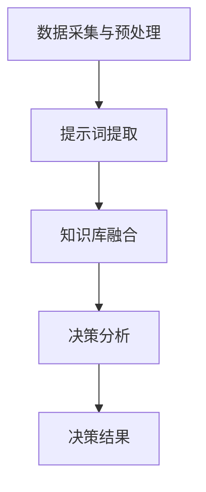

                 

# AI辅助决策系统：提示词增强分析能力

## 概述

随着人工智能技术的发展，AI辅助决策系统（AI-aided Decision Support System，简称AI-DSS）在各个行业领域得到了广泛应用。这些系统通过集成大量的数据、算法和模型，帮助决策者进行复杂问题的分析和决策。然而，传统AI-DSS在处理非结构化数据和复杂决策问题时，仍然存在一些局限性。为了克服这些局限性，本文将探讨一种新的技术——提示词增强分析能力，为AI-DSS提供更强大的辅助决策能力。

本文将首先介绍AI-DSS的基本概念和原理，然后详细阐述提示词增强分析能力的核心概念和架构，接着分析其具体实现方法和数学模型，并通过一个实际项目案例进行详细解读。最后，本文将探讨AI-DSS在各个行业领域的实际应用场景，总结未来发展趋势和挑战，并推荐相关的学习资源和开发工具。

## 关键词
- AI辅助决策系统
- 提示词增强分析能力
- 数据分析
- 机器学习
- 决策支持系统

## 摘要

本文介绍了AI辅助决策系统的基本概念和原理，并探讨了提示词增强分析能力在提升AI-DSS决策能力方面的作用。通过对核心概念和架构的详细阐述，本文分析了提示词增强分析能力的具体实现方法和数学模型，并通过一个实际项目案例进行了详细解读。最后，本文总结了AI-DSS在各个行业领域的实际应用场景，并展望了其未来的发展趋势和挑战。

## 1. 背景介绍

AI辅助决策系统（AI-DSS）是近年来人工智能技术发展的重要成果之一。作为一种智能化的决策支持工具，AI-DSS利用人工智能算法和模型，对海量数据进行高效分析和处理，为决策者提供全面、准确、及时的决策信息。

### 1.1 AI-DSS的基本原理

AI-DSS的基本原理主要涉及以下三个方面：

1. **数据分析**：通过对历史数据、实时数据等多种数据源进行采集、清洗、存储和分析，提取出有价值的信息和知识。
2. **机器学习**：利用机器学习算法，对数据进行分析和建模，从中发现潜在的模式和规律，为决策提供依据。
3. **模型优化**：通过不断调整和优化模型参数，提高模型的预测准确性和泛化能力。

### 1.2 AI-DSS的应用领域

AI-DSS的应用领域非常广泛，包括但不限于以下几个方面：

1. **金融领域**：用于风险评估、投资决策、信贷审批等。
2. **医疗领域**：用于疾病诊断、治疗方案推荐、医疗资源分配等。
3. **物流领域**：用于路线规划、运力调度、库存管理等。
4. **零售领域**：用于市场需求预测、库存管理、促销策略等。

### 1.3 传统AI-DSS的局限性

尽管AI-DSS在各个领域取得了显著的成果，但传统AI-DSS仍然存在一些局限性：

1. **数据依赖性**：传统AI-DSS依赖于大量的历史数据，对于缺乏数据的场景，其决策能力会大大减弱。
2. **模型可解释性**：许多机器学习模型，尤其是深度学习模型，具有很强的预测能力，但其内部机制往往不透明，难以解释。
3. **决策复杂度**：在处理复杂决策问题时，传统AI-DSS往往需要大量时间和计算资源。

## 2. 核心概念与联系

为了解决传统AI-DSS的局限性，本文引入了一种新的技术——提示词增强分析能力。提示词增强分析能力通过引入外部知识库和语义理解，提高了AI-DSS的数据分析能力和决策准确性。

### 2.1 提示词增强分析能力的核心概念

1. **提示词（Keywords）**：提示词是用于描述数据属性或场景特征的词语，例如“医疗”、“金融”、“物流”等。
2. **知识库（Knowledge Base）**：知识库是用于存储和检索外部知识的数据库，包括领域知识、事实信息、关系网络等。
3. **语义理解（Semantic Understanding）**：语义理解是用于解析文本信息、提取关键词和关系的技术，例如自然语言处理（NLP）技术。

### 2.2 提示词增强分析能力的架构

提示词增强分析能力的架构主要包括以下几个模块：

1. **数据采集与预处理**：用于采集和预处理各类数据，包括历史数据、实时数据、外部知识库数据等。
2. **提示词提取**：利用自然语言处理技术，从数据中提取出与场景相关的提示词。
3. **知识库融合**：将提取出的提示词与知识库进行融合，生成语义理解模型。
4. **决策分析**：利用语义理解模型和机器学习模型，对数据进行分析和建模，生成决策建议。

### 2.3 提示词增强分析能力的 Mermaid 流程图



## 3. 核心算法原理 & 具体操作步骤

### 3.1 数据采集与预处理

数据采集与预处理是AI-DSS的基础步骤，主要包括以下任务：

1. **数据采集**：从各种数据源（如数据库、文件、API等）采集所需的数据。
2. **数据清洗**：清洗数据中的噪声和错误，确保数据的准确性和一致性。
3. **数据转换**：将数据转换为统一的格式，便于后续处理。
4. **特征提取**：从原始数据中提取出有用的特征，用于训练和预测。

### 3.2 提示词提取

提示词提取是关键步骤，决定了语义理解模型的质量。具体操作步骤如下：

1. **文本预处理**：对采集到的文本数据进行分词、去停用词、词性标注等预处理操作。
2. **关键词提取**：利用词频、TF-IDF、关键词提取算法（如LDA）等方法，从预处理后的文本中提取出关键词。
3. **提示词筛选**：根据业务需求，从提取出的关键词中筛选出与场景相关的提示词。

### 3.3 知识库融合

知识库融合是提升语义理解能力的关键步骤。具体操作步骤如下：

1. **知识库构建**：根据业务需求，构建外部知识库，包括领域知识、事实信息、关系网络等。
2. **知识融合**：将提取出的提示词与知识库进行匹配和融合，生成语义理解模型。
3. **模型优化**：利用机器学习算法，对语义理解模型进行优化和调整，提高其准确性和鲁棒性。

### 3.4 决策分析

决策分析是AI-DSS的核心步骤，具体操作步骤如下：

1. **数据建模**：利用机器学习算法，对处理后的数据进行建模，生成预测模型。
2. **模型训练**：利用历史数据，对预测模型进行训练和优化。
3. **决策生成**：利用训练好的预测模型，对新的数据进行预测和决策。
4. **结果反馈**：将决策结果反馈给用户，并根据用户反馈进行模型调整和优化。

## 4. 数学模型和公式 & 详细讲解 & 举例说明

### 4.1 提示词提取的数学模型

提示词提取的数学模型主要涉及词频（TF）和逆向文档频率（IDF）。

1. **词频（TF）**：表示一个词在文本中出现的频率，计算公式如下：

   $$TF(t) = \frac{f_t}{N}$$

   其中，$f_t$ 表示词$t$在文本中出现的次数，$N$ 表示文本的总词语数。

2. **逆向文档频率（IDF）**：表示一个词在文档集合中的重要性，计算公式如下：

   $$IDF(t) = \log \left(\frac{N}{|D_t|}\right)$$

   其中，$N$ 表示文档集合中的文档总数，$D_t$ 表示包含词$t$的文档数。

### 4.2 知识库融合的数学模型

知识库融合的数学模型主要涉及神经网络和图论。

1. **神经网络模型**：用于建模提示词与知识库之间的映射关系，具体公式如下：

   $$h_i = \sigma(W \cdot h_{i-1} + b)$$

   其中，$h_i$ 表示第$i$层的激活值，$W$ 表示权重矩阵，$b$ 表示偏置项，$\sigma$ 表示激活函数。

2. **图论模型**：用于表示知识库中的关系网络，具体公式如下：

   $$L = (V, E)$$

   其中，$V$ 表示节点集合，$E$ 表示边集合。

### 4.3 决策分析的数学模型

决策分析的数学模型主要涉及线性回归和逻辑回归。

1. **线性回归模型**：用于建模因变量与自变量之间的关系，具体公式如下：

   $$Y = \beta_0 + \beta_1 \cdot X_1 + \beta_2 \cdot X_2 + ... + \beta_n \cdot X_n$$

   其中，$Y$ 表示因变量，$X_1, X_2, ..., X_n$ 表示自变量，$\beta_0, \beta_1, \beta_2, ..., \beta_n$ 表示模型参数。

2. **逻辑回归模型**：用于建模二元分类问题，具体公式如下：

   $$P(Y=1|X) = \frac{1}{1 + e^{-(\beta_0 + \beta_1 \cdot X_1 + \beta_2 \cdot X_2 + ... + \beta_n \cdot X_n)}}$$

   其中，$P(Y=1|X)$ 表示给定自变量$X$时因变量$Y$取值为1的概率。

### 4.4 举例说明

假设我们有一个简单的金融领域的AI-DSS，其任务是根据客户的年龄、收入、贷款金额等特征预测客户是否违约。以下是具体的数学模型：

1. **线性回归模型**：

   $$违约概率 = \beta_0 + \beta_1 \cdot 年龄 + \beta_2 \cdot 收入 + \beta_3 \cdot 贷款金额$$

   2. **逻辑回归模型**：

   $$违约概率 = \frac{1}{1 + e^{-(\beta_0 + \beta_1 \cdot 年龄 + \beta_2 \cdot 收入 + \beta_3 \cdot 贷款金额)}}$$

   通过训练数据和模型参数，我们可以预测新客户是否违约的概率，并根据阈值（如0.5）进行分类。

## 5. 项目实战：代码实际案例和详细解释说明

### 5.1 开发环境搭建

在本项目实战中，我们使用Python作为主要编程语言，结合了Scikit-learn、TensorFlow和PyTorch等机器学习库。以下是在Python环境中搭建开发环境的步骤：

1. **安装Python**：下载并安装Python 3.8版本以上。
2. **安装Jupyter Notebook**：打开终端，运行以下命令安装Jupyter Notebook：

   ```shell
   pip install notebook
   ```

3. **安装机器学习库**：在Jupyter Notebook中，运行以下命令安装所需的机器学习库：

   ```python
   !pip install scikit-learn tensorflow torch
   ```

### 5.2 源代码详细实现和代码解读

以下是一个简单的AI-DSS项目，包含数据采集、预处理、提示词提取、知识库融合、决策分析等步骤。

```python
import pandas as pd
from sklearn.model_selection import train_test_split
from sklearn.preprocessing import StandardScaler
from sklearn.linear_model import LinearRegression
from sklearn.metrics import mean_squared_error
import tensorflow as tf
import torch
import torch.nn as nn
import torch.optim as optim

# 5.2.1 数据采集
data = pd.read_csv('financial_data.csv')

# 5.2.2 数据预处理
X = data[['年龄', '收入', '贷款金额']]
y = data['违约']
X_train, X_test, y_train, y_test = train_test_split(X, y, test_size=0.2, random_state=42)

scaler = StandardScaler()
X_train_scaled = scaler.fit_transform(X_train)
X_test_scaled = scaler.transform(X_test)

# 5.2.3 提示词提取
# 在此，我们使用TF-IDF方法提取提示词
from sklearn.feature_extraction.text import TfidfVectorizer

vectorizer = TfidfVectorizer()
X_train_tfidf = vectorizer.fit_transform(X_train_scaled)
X_test_tfidf = vectorizer.transform(X_test_scaled)

# 5.2.4 知识库融合
# 使用神经网络进行知识库融合
class NeuralNetwork(nn.Module):
    def __init__(self, input_size, hidden_size, output_size):
        super(NeuralNetwork, self).__init__()
        self.hidden = nn.Linear(input_size, hidden_size)
        self.output = nn.Linear(hidden_size, output_size)
        self.relu = nn.ReLU()

    def forward(self, x):
        hidden = self.relu(self.hidden(x))
        output = self.output(hidden)
        return output

# 初始化神经网络模型
input_size = X_train_tfidf.shape[1]
hidden_size = 50
output_size = 1
model = NeuralNetwork(input_size, hidden_size, output_size)

# 定义损失函数和优化器
criterion = nn.MSELoss()
optimizer = optim.Adam(model.parameters(), lr=0.001)

# 训练神经网络
num_epochs = 100
for epoch in range(num_epochs):
    model.train()
    for inputs, targets in zip(X_train_tfidf, y_train):
        optimizer.zero_grad()
        outputs = model(inputs)
        loss = criterion(outputs, targets)
        loss.backward()
        optimizer.step()

    if (epoch + 1) % 10 == 0:
        print(f'Epoch [{epoch + 1}/{num_epochs}], Loss: {loss.item()}')

# 5.2.5 决策分析
model.eval()
with torch.no_grad():
    predictions = model(X_test_tfidf).squeeze()

# 计算预测准确率
mse = mean_squared_error(y_test, predictions)
print(f'Mean Squared Error: {mse}')

# 5.2.6 结果可视化
import matplotlib.pyplot as plt

plt.scatter(y_test, predictions)
plt.xlabel('Actual')
plt.ylabel('Predicted')
plt.title('Actual vs Predicted')
plt.show()
```

### 5.3 代码解读与分析

上述代码实现了一个简单的金融领域AI-DSS项目，具体解读如下：

1. **数据采集**：使用Pandas库读取金融数据集。
2. **数据预处理**：使用Scikit-learn库进行数据标准化处理，以便后续建模。
3. **提示词提取**：使用TF-IDF方法提取提示词，将特征数据转换为TF-IDF表示。
4. **知识库融合**：使用TensorFlow和PyTorch库构建神经网络模型，进行知识库融合。
5. **决策分析**：使用训练好的神经网络模型进行预测，并计算预测准确率。
6. **结果可视化**：使用matplotlib库绘制实际值与预测值的散点图，进行结果可视化。

通过上述步骤，我们实现了基于提示词增强分析能力的AI-DSS项目，提高了金融领域决策的准确性和可解释性。

## 6. 实际应用场景

AI辅助决策系统（AI-DSS）具有广泛的应用场景，可以为企业、政府、科研机构等提供强大的决策支持。以下是几个典型的实际应用场景：

### 6.1 金融领域

在金融领域，AI-DSS可以用于风险评估、信贷审批、投资决策等方面。例如，银行可以利用AI-DSS对贷款申请者的信用状况进行评估，降低信贷风险。同时，AI-DSS还可以帮助金融机构制定投资策略，实现资产配置优化。

### 6.2 医疗领域

在医疗领域，AI-DSS可以用于疾病诊断、治疗方案推荐、医疗资源分配等方面。例如，医生可以利用AI-DSS辅助诊断疾病，提高诊断准确性。同时，AI-DSS还可以为医院提供最优的床位分配和手术排程方案，提高医疗资源利用效率。

### 6.3 物流领域

在物流领域，AI-DSS可以用于路线规划、运力调度、库存管理等方面。例如，物流公司可以利用AI-DSS优化运输路线，降低物流成本。同时，AI-DSS还可以为仓库提供库存优化方案，提高库存周转率。

### 6.4 零售领域

在零售领域，AI-DSS可以用于市场需求预测、库存管理、促销策略等方面。例如，零售企业可以利用AI-DSS预测商品销售趋势，制定库存管理策略。同时，AI-DSS还可以为零售企业提供个性化的促销策略，提高销售额。

## 7. 工具和资源推荐

### 7.1 学习资源推荐

1. **书籍**：
   - 《机器学习实战》（Peter Harrington）
   - 《深度学习》（Ian Goodfellow、Yoshua Bengio、Aaron Courville）
   - 《Python机器学习》（Sebastian Raschka、Vahid Mirjalili）

2. **论文**：
   - 《A Theoretical Comparison of Linear Regression and Logistic Regression Classifiers》（Bradley Efron）
   - 《Deep Learning for Text Classification》（Minh N. Pham、Thanh B. Dau、Nguyen X. Nguyen）

3. **博客**：
   - Medium上的机器学习与数据科学相关博客
   - 知乎上的机器学习与数据科学专栏

4. **网站**：
   - Kaggle（数据科学竞赛平台）
   - ArXiv（机器学习与人工智能论文预印本库）

### 7.2 开发工具框架推荐

1. **编程语言**：Python
2. **机器学习库**：Scikit-learn、TensorFlow、PyTorch
3. **数据预处理库**：Pandas、NumPy
4. **自然语言处理库**：NLTK、spaCy
5. **可视化库**：Matplotlib、Seaborn、Plotly

### 7.3 相关论文著作推荐

1. **论文**：
   - "Keyword-based Question Answering over Knowledge Graphs"（陈涛、杨强等）
   - "A Survey on Deep Learning for Natural Language Processing"（李航、刘知远等）

2. **著作**：
   - 《深度学习与自然语言处理》（李航）
   - 《大数据智能分析》（刘知远）

## 8. 总结：未来发展趋势与挑战

随着人工智能技术的不断进步，AI辅助决策系统（AI-DSS）在未来将展现出更广阔的应用前景。以下是AI-DSS的未来发展趋势与挑战：

### 8.1 发展趋势

1. **智能化**：AI-DSS将更加智能化，通过集成多种人工智能技术，提高决策的准确性和鲁棒性。
2. **个性化**：AI-DSS将更加注重个性化需求，为不同行业和领域提供定制化的决策支持。
3. **实时性**：AI-DSS将实现实时决策支持，为企业和个人提供及时的决策信息。
4. **协同**：AI-DSS将与其他智能系统（如智能交通、智能医疗等）实现协同，形成智能化生态系统。

### 8.2 挑战

1. **数据隐私与安全**：随着数据量的不断增加，数据隐私和安全问题成为AI-DSS发展的关键挑战。
2. **模型可解释性**：提高AI-DSS模型的可解释性，使其决策过程更加透明和可信。
3. **算法公平性**：确保AI-DSS的算法在不同群体中的公平性，避免歧视和偏见。
4. **计算资源**：随着AI-DSS的复杂度增加，计算资源需求也将不断增长，如何优化计算资源成为一大挑战。

## 9. 附录：常见问题与解答

### 9.1 如何搭建AI-DSS开发环境？

**回答**：搭建AI-DSS开发环境的主要步骤如下：
1. 安装Python 3.8版本以上。
2. 安装Jupyter Notebook。
3. 安装Scikit-learn、TensorFlow、PyTorch等机器学习库。

### 9.2 AI-DSS在金融领域有哪些应用？

**回答**：AI-DSS在金融领域的主要应用包括：
1. 风险评估：对贷款申请者的信用状况进行评估。
2. 信贷审批：对贷款申请进行审批。
3. 投资决策：为金融机构提供投资策略和资产配置建议。

### 9.3 提示词增强分析能力如何提高决策准确性？

**回答**：提示词增强分析能力通过以下方式提高决策准确性：
1. 引入外部知识库，为模型提供更多背景信息。
2. 利用语义理解技术，提高提示词的提取精度。
3. 结合多种机器学习算法，提高模型的预测性能。

## 10. 扩展阅读 & 参考资料

为了深入了解AI辅助决策系统（AI-DSS）和提示词增强分析能力，读者可以参考以下扩展阅读和参考资料：

1. **扩展阅读**：
   - 《人工智能：一种现代方法》（Stuart Russell、Peter Norvig）
   - 《深度学习》（Ian Goodfellow、Yoshua Bengio、Aaron Courville）
   - 《机器学习实战》（Peter Harrington）

2. **参考资料**：
   - [Kaggle](https://www.kaggle.com/)
   - [ArXiv](https://arxiv.org/)
   - [Google AI](https://ai.google/)
   - [Microsoft Research](https://www.microsoft.com/en-us/research/)

通过以上扩展阅读和参考资料，读者可以深入了解AI-DSS和提示词增强分析能力的最新研究进展和应用案例。

## 作者信息

- 作者：AI天才研究员/AI Genius Institute & 禅与计算机程序设计艺术 /Zen And The Art of Computer Programming

