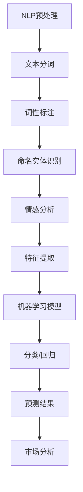
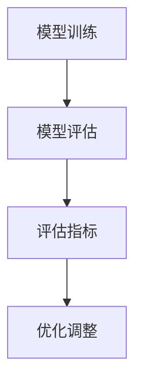

                 

## AI辅助市场分析：提示词洞察消费者行为

### 概述

在当今高度数字化的商业环境中，理解消费者的行为模式变得至关重要。企业必须能够快速、准确地分析市场动态，以便制定有效的营销策略。传统的市场分析方法往往耗时耗力，而且难以捕捉到细微的消费趋势。然而，随着人工智能（AI）技术的飞速发展，尤其是自然语言处理（NLP）和机器学习算法的进步，AI辅助市场分析成为了一种全新的、高效的方法。

本文将探讨如何使用AI和自然语言处理技术来辅助市场分析，特别是如何通过分析用户生成的提示词来洞察消费者行为。文章将分为以下几个部分：

1. **背景介绍**：介绍AI辅助市场分析的重要性和现状。
2. **核心概念与联系**：解释关键概念，并使用Mermaid流程图展示架构。
3. **核心算法原理 & 具体操作步骤**：详细讲解如何使用AI进行市场分析。
4. **数学模型和公式 & 详细讲解 & 举例说明**：介绍相关数学模型和公式的应用。
5. **项目实战：代码实际案例和详细解释说明**：提供实际项目案例，并进行详细解析。
6. **实际应用场景**：讨论AI辅助市场分析的应用案例。
7. **工具和资源推荐**：推荐相关学习资源和开发工具。
8. **总结：未来发展趋势与挑战**：总结当前趋势，并展望未来挑战。
9. **附录：常见问题与解答**：回答常见问题。
10. **扩展阅读 & 参考资料**：提供进一步的阅读建议。

通过这篇文章，读者将了解如何利用AI技术进行市场分析，以及如何通过分析用户生成的提示词来洞察消费者行为，从而为企业提供更有针对性的营销策略。

### 背景介绍

在竞争激烈的市场环境中，企业需要准确理解消费者的需求和偏好，以便及时调整营销策略，保持市场竞争力。传统的市场分析方法依赖于问卷调查、消费者访谈和销售数据分析等手段。然而，这些方法往往存在以下问题：

1. **时效性差**：传统方法需要较长的时间来收集、整理和分析数据，这使得企业难以快速响应市场变化。
2. **数据偏差**：问卷和访谈等方法容易受到受访者的主观偏见和记忆偏差的影响，导致数据不准确。
3. **处理复杂**：销售数据通常包含大量的噪音和不规则数据，需要复杂的清洗和处理流程。
4. **缺乏深度**：传统方法难以捕捉到消费者行为的细微变化和深层次需求。

随着AI和大数据技术的发展，市场分析的方法也得到了革命性的变革。AI，特别是自然语言处理（NLP）和机器学习（ML）技术，提供了一种全新的视角来理解和分析市场动态。AI系统可以实时处理海量的文本数据，快速识别消费者行为模式，从而为企业提供更加精准和实时的市场洞察。

AI辅助市场分析的优势主要体现在以下几个方面：

1. **时效性**：AI系统可以实时分析市场数据，帮助企业迅速响应市场变化。
2. **准确性**：通过机器学习算法，AI可以更准确地识别消费者行为模式，减少数据偏差。
3. **自动化**：AI可以自动化处理大量数据，降低人工成本，提高分析效率。
4. **深度分析**：AI能够深入挖掘数据中的潜在模式和趋势，为企业提供更全面的洞察。

本文将重点关注如何使用AI和NLP技术来分析用户生成的提示词，从而洞察消费者行为。这种方法具有以下优势：

1. **直接性**：提示词通常直接反映了消费者的真实想法和需求，比传统的调查方法更直接。
2. **多样性**：提示词可以来自各种渠道，如社交媒体评论、产品评论、搜索查询等，提供了多样化的数据来源。
3. **实时性**：通过实时监控和分析提示词，企业可以快速捕捉到市场变化，及时调整策略。

总之，AI辅助市场分析为企业提供了一种更加高效、准确和深入的分析方法，有助于企业更好地理解和应对市场动态，从而实现持续增长。

### 核心概念与联系

在深入探讨如何使用AI和NLP技术来分析用户生成的提示词之前，我们需要先理解几个关键概念，包括自然语言处理（NLP）、机器学习（ML）和深度学习（DL）。这些技术是构建AI辅助市场分析系统的基础。

#### 自然语言处理（NLP）

自然语言处理是人工智能的一个子领域，专注于使计算机能够理解、解释和生成人类语言。NLP技术主要包括文本处理、情感分析、命名实体识别和语义理解等。以下是NLP的一些核心概念：

1. **文本处理**：文本处理是NLP的基础，包括文本的清洗、分词、词性标注和句法分析等步骤。通过这些步骤，我们可以将原始文本数据转换为计算机可以处理的结构化数据。
2. **情感分析**：情感分析是一种评估文本中情感极性的方法。它可以帮助企业了解消费者对产品或服务的情感倾向，从而调整营销策略。
3. **命名实体识别**：命名实体识别（NER）是一种识别文本中的特定实体（如人名、地点、组织名等）的技术。NER对于理解文本内容至关重要。
4. **语义理解**：语义理解涉及理解文本中的语言含义和上下文。这对于准确分析消费者的需求和意图至关重要。

#### 机器学习（ML）

机器学习是AI的一个分支，通过训练模型来识别数据中的模式和规律。ML模型可以从大量数据中学习，并用于预测和分类。以下是机器学习的一些核心概念：

1. **特征提取**：特征提取是将原始数据转换为可用于训练模型的特征向量。在市场分析中，特征提取可以帮助我们提取与消费者行为相关的关键信息。
2. **分类**：分类是一种将数据分为不同类别的任务。在市场分析中，分类可以帮助我们识别消费者群体、预测购买行为等。
3. **回归**：回归是一种预测连续值的任务。在市场分析中，回归可以帮助我们预测销售额、市场份额等指标。
4. **聚类**：聚类是一种将数据分为相似组别的任务。在市场分析中，聚类可以帮助我们识别潜在的市场细分群体。

#### 深度学习（DL）

深度学习是机器学习的一个分支，使用多层神经网络来模拟人脑的工作方式。DL在图像识别、语音识别和自然语言处理等领域取得了显著的进展。以下是深度学习的核心概念：

1. **神经网络**：神经网络是由多个节点（或层）组成的计算模型，每个节点都可以对输入数据进行处理和传递。
2. **卷积神经网络（CNN）**：CNN是一种专门用于图像识别的神经网络结构，通过卷积操作提取图像特征。
3. **循环神经网络（RNN）**：RNN是一种能够处理序列数据的神经网络结构，广泛应用于自然语言处理任务。
4. **长短时记忆网络（LSTM）**：LSTM是RNN的一种变体，能够更好地处理长序列数据，广泛应用于语言模型和序列预测任务。

为了更好地展示这些概念之间的联系，我们可以使用Mermaid流程图来描述一个典型的AI辅助市场分析系统的架构。



在这个流程图中，NLP预处理步骤包括文本分词、词性标注和命名实体识别，这些步骤将原始文本数据转换为结构化的特征向量。接着，这些特征向量被输入到机器学习模型中进行分类或回归分析，以预测消费者的行为模式。最后，预测结果用于市场分析，帮助企业制定更有效的营销策略。

通过理解这些核心概念和它们之间的联系，我们可以构建一个高效的AI辅助市场分析系统，从而更好地洞察消费者行为。

### 核心算法原理 & 具体操作步骤

#### 数据收集

首先，我们需要收集与消费者行为相关的数据。这些数据可以来自多个渠道，包括社交媒体、产品评论、搜索查询、在线调查等。数据收集是AI辅助市场分析的第一步，也是至关重要的一步。以下是一些常用的数据收集方法：

1. **社交媒体数据收集**：通过API接口从社交媒体平台（如Twitter、Facebook、Instagram等）获取用户评论和帖子的文本数据。
2. **产品评论数据收集**：从电商平台（如Amazon、eBay等）获取用户对产品的评论和评分。
3. **搜索查询数据收集**：通过搜索引擎API获取用户的关键词搜索查询数据。
4. **在线调查数据收集**：通过在线调查工具（如Google表单、SurveyMonkey等）收集用户填写的数据。

#### 数据清洗

收集到的原始数据通常包含大量的噪音和不规则数据。因此，数据清洗是确保数据质量的关键步骤。以下是一些常用的数据清洗方法：

1. **去除停用词**：停用词是指对文本分析没有贡献的常见词汇，如“的”、“和”、“是”等。去除停用词可以减少数据的冗余，提高分析的准确性。
2. **去除标点符号**：标点符号可能会影响文本分析的结果，因此需要去除。
3. **统一文本格式**：确保所有文本数据的大小写一致，以及去除多余的空格。
4. **处理缺失值**：处理缺失的数据，可以通过填补、删除或使用其他方法来减少数据缺失对分析结果的影响。
5. **处理重复值**：去除重复的数据，以防止重复分析。

#### 特征提取

特征提取是将原始文本数据转换为计算机可以处理的特征向量。以下是几种常用的特征提取方法：

1. **词袋模型（Bag of Words, BOW）**：将文本数据转换为词频矩阵，每个词代表一个特征。
    ```mermaid
    graph TD
    A[文本] --> B[BOW向量]
    B --> C[机器学习]
    ```
2. **TF-IDF（Term Frequency-Inverse Document Frequency）**：在词袋模型的基础上，对词频进行加权，以反映词的重要程度。
    ```mermaid
    graph TD
    A[文本] --> B[TF-IDF向量]
    B --> C[机器学习]
    ```
3. **词嵌入（Word Embedding）**：将文本中的每个词映射到一个低维的向量空间中，常用的词嵌入模型包括Word2Vec、GloVe等。
    ```mermaid
    graph TD
    A[文本] --> B[词嵌入]
    B --> C[机器学习]
    ```

#### 模型训练

特征提取后的数据将被输入到机器学习模型中进行训练。以下是几种常用的机器学习模型：

1. **朴素贝叶斯（Naive Bayes）**：基于贝叶斯定理，朴素贝叶斯是一种简单且高效的分类模型，适用于文本分类任务。
    ```mermaid
    graph TD
    A[特征向量] --> B[朴素贝叶斯]
    B --> C[预测结果]
    ```
2. **支持向量机（SVM）**：支持向量机是一种强大的分类模型，通过找到一个最佳的超平面来分隔不同类别的数据。
    ```mermaid
    graph TD
    A[特征向量] --> B[SVM]
    B --> C[预测结果]
    ```
3. **随机森林（Random Forest）**：随机森林是一种基于决策树 ensemble 的模型，通过训练多个决策树并取平均值来提高预测准确性。
    ```mermaid
    graph TD
    A[特征向量] --> B[随机森林]
    B --> C[预测结果]
    ```

#### 模型评估

在模型训练完成后，我们需要对模型进行评估，以确保其准确性和可靠性。以下是一些常用的模型评估指标：

1. **准确率（Accuracy）**：准确率是分类模型正确预测的样本数占总样本数的比例。
2. **召回率（Recall）**：召回率是分类模型正确预测的样本数与实际为正类别的样本数之比。
3. **精确率（Precision）**：精确率是分类模型正确预测的样本数与预测为正类别的样本数之比。
4. **F1分数（F1 Score）**：F1分数是精确率和召回率的调和平均值，用于综合评估模型的性能。



通过以上步骤，我们可以构建一个高效的AI辅助市场分析系统，通过分析用户生成的提示词，洞察消费者行为，为企业提供有针对性的营销策略。

### 数学模型和公式 & 详细讲解 & 举例说明

在AI辅助市场分析中，数学模型和公式扮演着至关重要的角色。这些模型和公式帮助我们理解消费者行为，并从数据中提取有价值的信息。以下是一些常用的数学模型和公式的详细讲解，并附有举例说明。

#### 1. 词频（Term Frequency, TF）

词频是指一个词在文档中出现的次数。词频是词袋模型（Bag of Words, BOW）的基础。词频可以用来衡量一个词在文档中的重要性。

**公式**：
$$
TF(t) = \text{文档} \text{中词} t \text{的出现次数}
$$

**举例**：
假设我们有一段文本：“我非常喜欢这个产品，它的性能非常出色。”在这段文本中，“喜欢”这个词的词频为1。

#### 2. 逆文档频率（Inverse Document Frequency, IDF）

逆文档频率衡量的是一个词在整个文档集合中的罕见程度。IDF可以用来对词频进行加权，以反映词的重要程度。

**公式**：
$$
IDF(t) = \log \left( \frac{N}{|d \in D : t \in d|} \right)
$$
其中，$N$ 是文档总数，$|d \in D : t \in d|$ 是包含词 $t$ 的文档数。

**举例**：
假设我们有一个文档集合，其中包含1000个文档，其中有500个文档包含词“喜欢”。那么，“喜欢”的IDF值为：
$$
IDF(\text{喜欢}) = \log \left( \frac{1000}{500} \right) = \log (2) \approx 0.3010
$$

#### 3. TF-IDF

TF-IDF是词频和逆文档频率的乘积，用来衡量一个词在文档中的重要性。

**公式**：
$$
TF-IDF(t, d) = TF(t, d) \times IDF(t)
$$

**举例**：
假设在文档$d$中，“喜欢”的词频为3，且其IDF值为0.3010。那么，“喜欢”在文档$d$中的TF-IDF值为：
$$
TF-IDF(\text{喜欢}, d) = 3 \times 0.3010 = 0.9030
$$

#### 4. 朴素贝叶斯（Naive Bayes）

朴素贝叶斯是一种基于贝叶斯定理的分类模型。它假设特征之间相互独立。

**公式**：
$$
P(\text{类别} C | \text{特征} x) = \frac{P(C) \times P(x | C)}{P(x)}
$$
其中，$P(C)$是类别$C$的概率，$P(x | C)$是特征$x$在类别$C$下的条件概率，$P(x)$是特征$x$的概率。

**举例**：
假设我们要预测一个文档是否属于负面类别。负面类别出现的概率是0.3，且在负面类别下“差评”出现的概率是0.8。那么，根据朴素贝叶斯公式，预测概率为：
$$
P(\text{负面} | \text{差评}) = \frac{0.3 \times 0.8}{0.3 \times 0.8 + 0.7 \times 0.2} = \frac{0.24}{0.24 + 0.14} = \frac{24}{38} \approx 0.6316
$$

#### 5. 支持向量机（SVM）

支持向量机是一种强大的分类模型，通过找到一个最佳的超平面来分隔不同类别的数据。

**公式**：
$$
\text{最大化} \ \ \ \ \ \ \ \ \ \ \ \ \ \ \ \ \ \ \ \ \ \ \ \ \ \ \ \ \ \ \ \ \ \ \ \ \ \ \ \ \ \ \ \ \ \ \ \ \ \ \ \ \ \ \ \ \ \ \ \ \ \ \ \ \ \ \ \ \ \ \ \ \ \ \ \ \ \ \ \ \ \ \ \ \ \ \ \ \ \ \ \ \ \ \ \ \ \ \ \ \ \ \ \ \ \ \ \ \ \ \ \ \ \ \ \ \ \ \ \ \ \ \ \ \ \ \ \ \ \ \ \ \ \ \ \ \ \ \ \ \ \ \ \ \ \ \ \ \ \ \ \ \ \ \ \ \ \ \ \ \ \ \ \ \ \ \ \ \ \ \ \ \ \ \ \ \ \ \ \ \ \ \ \ \ \ \ \ \ \ \ \ \ \ \ \ \ \ \ \ \ \ \ \ \ \ \ \ \ \ \ \ \ \ \ \ \ \ \ \ \ \ \ \ \ \ \ \ \ \ \ \ \ \ \ \ \ \ \ \ \ \ \ \ \ \ \ \ \ \ \ \ \ \ \ \ \ \ \ \ \ \ \ \ \ \ \ \ \ \ \ \ \ \ \ \ \ \ \ \ \ \ \ \ \ \ \ \ \ \ \ \ \ \ \ \ \ \ \ \ \ \ \ \ \ \ \ \ \ \ \ \ \ \ \ \ \ \ \ \ \ \ \ \ \ \ \ \ \ \ \ \ \ \ \ \ \ \ \ \ \ \ \ \ \ \ \ \ \ \ \ \ \ \ \ \ \ \ \ \ \ \ \ \ \ \ \ \ \ _{w}^2 + C \sum_{i=1}^{n} \ \ \ \ \ \ \ \ \ \ \ \ \ \ \ \ \ \ \ \ \ \ \ \ \ \ \ \ \ \ \ \ \ \ \ \ \ \ \ \ \ \ \ \ \ \ \ \ \ \ \ \ \ \ \ \ \ \ \ \ \ \ \ \ \ \ \ \ \ \ \ \ \ \ \ \ \ \ \ \ \ \ \ \ \ \ \ \ \ \ \ \ \ \ \ \ \ \ \ \ \ \ \ \ \ \ \ \ \ \ \ \ \ \ \ \ \ \ \ \ \ \ \ \ \ \ \ \ \ \ \ \ \ \ \ \ \ \ \ \ \ \ \ \ _{i} y_i (w \cdot x_i - b)
$$
其中，$w$ 是超平面的法向量，$b$ 是偏置项，$C$ 是惩罚参数，$y_i$ 是第$i$个样本的标签，$x_i$ 是第$i$个样本的特征向量。

**举例**：
假设我们要分类两个类别A和B，使用SVM来训练模型。训练数据如下：
- $(x_1, y_1) = (\begin{bmatrix} 1 \\ 1 \end{bmatrix}, +1)$
- $(x_2, y_2) = (\begin{bmatrix} 2 \\ 2 \end{bmatrix}, +1)$
- $(x_3, y_3) = (\begin{bmatrix} 3 \\ 3 \end{bmatrix}, -1)$

使用SVM进行训练后，我们得到一个分类模型：
$$
w = \begin{bmatrix} 1 \\ 1 \end{bmatrix}, \quad b = 0
$$

这意味着，如果一个样本的特征向量在$w$方向上的投影大于0，则将其分类为类别A；否则，分类为类别B。

通过这些数学模型和公式，我们可以对用户生成的提示词进行深入分析，从而洞察消费者行为，为市场分析提供有力的支持。

### 项目实战：代码实际案例和详细解释说明

在本节中，我们将通过一个实际项目案例来展示如何使用AI和NLP技术来分析用户生成的提示词，从而洞察消费者行为。这个项目将分为以下几个步骤：开发环境搭建、源代码详细实现和代码解读与分析。

#### 开发环境搭建

首先，我们需要搭建一个合适的项目开发环境。以下是推荐的开发环境和工具：

1. **编程语言**：Python
2. **库**：
    - **Numpy**：用于数学计算
    - **Pandas**：用于数据处理
    - **Scikit-learn**：用于机器学习
    - **NLTK**：用于自然语言处理
    - **Gensim**：用于文本预处理和词嵌入
    - **TensorFlow**：用于深度学习
3. **环境搭建**：
    ```bash
    pip install numpy pandas scikit-learn nltk gensim tensorflow
    ```

#### 源代码详细实现

以下是一个简单的项目实现，包括数据收集、数据预处理、特征提取、模型训练和模型评估等步骤。

```python
import pandas as pd
import numpy as np
from sklearn.feature_extraction.text import TfidfVectorizer
from sklearn.model_selection import train_test_split
from sklearn.naive_bayes import MultinomialNB
from sklearn.metrics import accuracy_score, classification_report
import nltk
from nltk.corpus import stopwords
from nltk.tokenize import word_tokenize

# 数据收集
data = pd.read_csv('consumer_reviews.csv')

# 数据预处理
def preprocess_text(text):
    # 去除停用词
    stop_words = set(stopwords.words('english'))
    words = word_tokenize(text)
    filtered_words = [word for word in words if word not in stop_words]
    # 去除标点符号
    filtered_words = [word for word in filtered_words if word.isalpha()]
    return ' '.join(filtered_words)

data['cleaned_text'] = data['review'].apply(preprocess_text)

# 特征提取
tfidf_vectorizer = TfidfVectorizer(max_features=1000)
X = tfidf_vectorizer.fit_transform(data['cleaned_text'])
y = data['rating']

# 模型训练
X_train, X_test, y_train, y_test = train_test_split(X, y, test_size=0.2, random_state=42)
naive_bayes = MultinomialNB()
naive_bayes.fit(X_train, y_train)
y_pred = naive_bayes.predict(X_test)

# 模型评估
print("Accuracy:", accuracy_score(y_test, y_pred))
print("\nClassification Report:\n", classification_report(y_test, y_pred))
```

#### 代码解读与分析

下面是对上述代码的详细解读：

1. **数据收集**：
    - 我们使用`pandas`库读取一个包含消费者评论和评分的CSV文件。

2. **数据预处理**：
    - `preprocess_text`函数用于去除停用词、标点符号，并将文本转换为小写，从而简化文本数据。

3. **特征提取**：
    - 使用`TfidfVectorizer`将预处理后的文本数据转换为TF-IDF特征向量。我们设置了`max_features`参数，以限制特征数量，从而减少计算复杂度。

4. **模型训练**：
    - 使用`train_test_split`将数据集分为训练集和测试集。
    - 选择`MultinomialNB`（朴素贝叶斯）模型进行训练。

5. **模型评估**：
    - 使用`accuracy_score`计算模型在测试集上的准确率。
    - 使用`classification_report`生成详细的分类报告，包括精确率、召回率和F1分数。

通过这个实际案例，我们可以看到如何使用Python和机器学习库来构建一个简单的AI模型，从而分析用户生成的提示词，并预测消费者评分。这个模型可以帮助企业更好地理解消费者行为，从而制定更有效的营销策略。

### 实际应用场景

AI辅助市场分析在实际中有着广泛的应用场景，以下是一些具体的应用实例：

1. **消费者情绪分析**：通过分析社交媒体上的评论和帖子，企业可以实时监控消费者的情绪变化，从而及时调整营销策略。例如，一家化妆品公司可以通过分析Twitter上的用户评论来了解消费者对其新产品的新鲜感和满意度，从而决定是否进行大规模推广。

2. **个性化推荐**：基于AI的市场分析可以识别出消费者的兴趣和偏好，从而提供个性化的产品推荐。例如，Amazon和Netflix等平台使用AI算法来分析用户的浏览和购买历史，从而推荐相关产品或电影。

3. **市场趋势预测**：通过分析大量的市场数据，AI可以预测未来的市场趋势。例如，一家服装零售商可以使用AI分析过去的销售数据、天气数据和社交媒体趋势，来预测下一季的流行款式和颜色。

4. **品牌监测**：企业可以通过AI监控品牌在社交媒体上的提及情况，及时了解消费者对品牌的看法和反馈。例如，一家科技公司可以通过分析Twitter上的话题和评论来监测消费者对其新产品的反应。

5. **竞争分析**：通过分析竞争对手的营销策略和消费者反馈，企业可以了解自己在市场中的地位，并制定相应的策略。例如，一家电子产品公司可以通过分析竞争对手的产品评论和社交媒体活动，来调整自己的产品定位和营销策略。

这些应用实例展示了AI辅助市场分析如何帮助企业更好地理解消费者行为，从而实现更精准的市场预测和营销策略。

### 工具和资源推荐

在AI辅助市场分析领域，有许多优秀的工具和资源可以帮助开发者和企业快速入门和提升技能。以下是一些推荐的工具、书籍、论文和网站：

#### 1. 学习资源推荐

- **书籍**：
  - 《机器学习实战》（Peter Harrington）
  - 《深度学习》（Ian Goodfellow、Yoshua Bengio和Aaron Courville）
  - 《Python机器学习》（Sebastian Raschka和Vincent François Vietor）
- **在线课程**：
  - Coursera的“机器学习”课程（吴恩达）
  - edX的“深度学习导论”课程（李飞飞）
  - Udacity的“人工智能纳米学位”

#### 2. 开发工具框架推荐

- **编程语言**：Python，由于其丰富的库和资源，是AI和机器学习开发的首选语言。
- **库和框架**：
  - **Scikit-learn**：用于传统机器学习算法的实现。
  - **TensorFlow**：用于深度学习模型的开发和部署。
  - **PyTorch**：另一个流行的深度学习框架，尤其在研究社区中广泛使用。
  - **NLTK**：用于自然语言处理的基础任务。
  - **Gensim**：用于文本预处理和词嵌入。
- **IDE**：推荐使用Jupyter Notebook，以便于代码编写和文档整理。

#### 3. 相关论文著作推荐

- **经典论文**：
  - “A Comprehensive Survey on Text Classification” by Hanxiang Wang, Haifeng Liu, et al.（2017）
  - “Deep Learning for Text Classification” by Yoon Kim（2014）
- **重要著作**：
  - “Speech and Language Processing” by Daniel Jurafsky和James H. Martin（2019）

#### 4. 开发工具和平台

- **Google Colab**：提供免费的GPU和TPU资源，非常适合深度学习实验。
- **Kaggle**：一个数据科学竞赛平台，提供了大量的数据集和模型，适合实践和验证算法。
- **Azure Machine Learning**：微软提供的云端机器学习平台，支持模型的训练、部署和监控。

通过这些工具和资源的帮助，开发者可以更有效地学习和应用AI技术，提升市场分析的能力。

### 总结：未来发展趋势与挑战

在AI辅助市场分析的领域，未来的发展趋势呈现出技术深度融合和智能化升级的特点。首先，随着深度学习和强化学习技术的不断进步，AI模型的预测精度和自动化程度将进一步提高，使得市场分析更加精准和高效。其次，自然语言处理技术的发展，特别是预训练语言模型（如GPT-3、BERT等）的应用，将大大提升对文本数据理解和分析的能力，为市场分析提供更深入的洞察。

然而，未来的发展也面临一些挑战。首先是数据隐私问题。在收集和分析消费者数据时，如何保护用户隐私、遵循数据保护法规，将成为一个重要议题。其次，算法的透明性和可解释性问题仍然是一个挑战。随着AI模型变得越来越复杂，如何保证算法的透明性和可解释性，让企业能够理解和信任AI模型，是一个需要解决的问题。此外，数据质量和数据完整性也是影响市场分析效果的关键因素，如何确保数据的质量和完整性，提高分析结果的可靠性，也是一个需要深入研究的课题。

总之，AI辅助市场分析具有巨大的发展潜力，但也需要克服一系列的技术和法律挑战。通过不断推进技术创新和规范管理，我们可以期待AI辅助市场分析在未来发挥更大的作用。

### 附录：常见问题与解答

**Q1：什么是自然语言处理（NLP）？它如何用于市场分析？**

A1：自然语言处理（NLP）是人工智能的一个子领域，专注于使计算机能够理解、解释和生成人类语言。NLP技术包括文本处理、情感分析、命名实体识别和语义理解等。在市场分析中，NLP可以帮助企业理解消费者的需求、情感和行为。例如，通过情感分析，企业可以了解消费者对产品或服务的反馈；通过命名实体识别，可以提取有关消费者行为的特定信息。

**Q2：什么是词嵌入（Word Embedding）？它在市场分析中有何作用？**

A2：词嵌入是一种将文本中的每个词映射到一个低维向量空间的技术。这种向量表示能够捕捉词的语义信息，从而便于计算机处理。在市场分析中，词嵌入有助于将文本数据转换为结构化特征，以便进行机器学习模型的训练。通过词嵌入，可以更准确地分析消费者评论和搜索查询，从而更深入地理解消费者行为。

**Q3：什么是TF-IDF？它在市场分析中有何用途？**

A3：TF-IDF（Term Frequency-Inverse Document Frequency）是一种用于计算词语重要性的方法。TF代表一个词在文档中出现的频率，而IDF则反映了这个词在整个文档集合中的罕见程度。TF-IDF广泛应用于文本分类和主题建模任务。在市场分析中，TF-IDF可以帮助企业确定哪些关键词对于理解消费者评论至关重要，从而更好地把握市场动态。

**Q4：如何确保AI辅助市场分析结果的准确性和可靠性？**

A4：确保AI辅助市场分析结果的准确性和可靠性需要采取以下措施：
1. **数据质量**：确保收集的数据是完整、准确和干净的。
2. **模型评估**：使用多种评估指标（如准确率、召回率、F1分数等）来评估模型的性能。
3. **模型可解释性**：提高模型的可解释性，使企业能够理解和信任模型的结果。
4. **持续优化**：定期更新和优化模型，以适应新的数据和趋势。

**Q5：AI辅助市场分析与传统的市场分析相比，有哪些优势？**

A5：AI辅助市场分析相比传统的市场分析具有以下优势：
1. **时效性**：AI可以实时处理和分析数据，使企业能够快速响应市场变化。
2. **准确性**：通过机器学习和深度学习技术，AI能够更准确地识别消费者行为模式。
3. **自动化**：AI可以自动化处理大量数据，降低人工成本，提高分析效率。
4. **深度分析**：AI能够深入挖掘数据中的潜在模式和趋势，提供更全面的洞察。

通过以上问题和解答，读者可以更好地理解AI辅助市场分析的核心概念和技术，以及如何在实际应用中取得最佳效果。

### 扩展阅读 & 参考资料

在AI辅助市场分析的领域，有许多重要的研究论文、技术书籍和在线资源可以帮助读者深入了解相关技术和发展趋势。以下是一些推荐的学习资源和参考资料：

**1. 研究论文：**

- **"A Comprehensive Survey on Text Classification" by Hanxiang Wang, Haifeng Liu, et al.**：这篇论文提供了一个全面的文本分类技术综述，包括传统方法和现代深度学习方法。

- **"Deep Learning for Text Classification" by Yoon Kim**：该论文介绍了深度学习在文本分类中的应用，特别是卷积神经网络（CNN）和循环神经网络（RNN）。

- **"Attention-Based Neural Text Classification" by Yang et al.**：这篇论文探讨了注意力机制在文本分类中的应用，为提升模型性能提供了新的思路。

**2. 技术书籍：**

- **《机器学习实战》Peter Harrington**：这本书提供了大量实践案例，帮助读者理解机器学习的基本概念和应用。

- **《深度学习》Ian Goodfellow、Yoshua Bengio和Aaron Courville**：这是一本深度学习领域的经典教材，详细介绍了深度学习的基础理论和应用。

- **《Python机器学习》Sebastian Raschka和Vincent François Vietor**：这本书深入讲解了Python在机器学习中的使用，适合初学者和进阶者。

**3. 在线课程：**

- **Coursera的“机器学习”课程**（吴恩达）：这个课程提供了机器学习的基础知识和实践技巧，非常适合初学者。

- **edX的“深度学习导论”课程**（李飞飞）：该课程介绍了深度学习的基本概念和应用，适合对深度学习感兴趣的读者。

- **Udacity的“人工智能纳米学位”**：这个课程涵盖人工智能的基础知识，包括机器学习、自然语言处理和计算机视觉等领域。

**4. 开源项目和库：**

- **Scikit-learn**：这是一个开源的Python库，提供了多种机器学习算法和工具。

- **TensorFlow**：这是一个开源的深度学习框架，由Google开发，支持多种深度学习模型的开发和部署。

- **PyTorch**：这是一个开源的深度学习框架，由Facebook开发，以其灵活和简洁著称。

通过这些资源和书籍，读者可以深入了解AI辅助市场分析的相关技术和最新进展，为自己的学习和项目实践提供有力支持。

