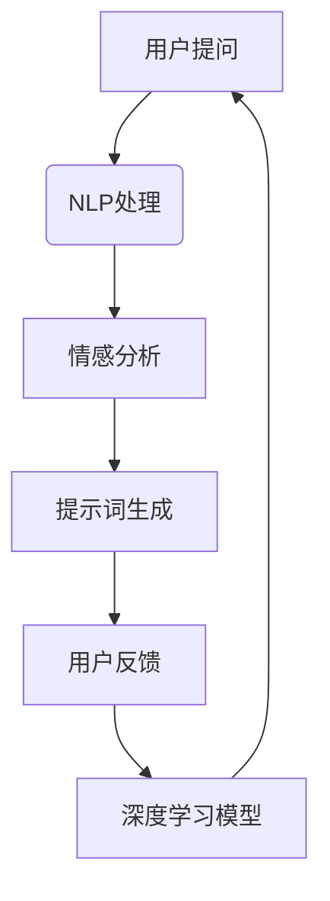

                 

# AI辅助心理咨询：提示词设计治疗方案

## 关键词：AI、心理咨询、提示词、治疗方案、深度学习、自然语言处理、心理健康

> 在当今快节奏的社会中，心理健康问题日益突出。随着人工智能技术的发展，AI辅助心理咨询成为一种新兴的趋势。本文将探讨如何利用AI技术设计个性化的心理咨询治疗方案，特别关注提示词的应用。

## 摘要

本文旨在介绍如何通过AI技术实现心理咨询的自动化和个性化。首先，我们将介绍AI在心理咨询领域的应用背景和重要性。接着，我们将详细探讨AI辅助心理咨询的核心概念，包括自然语言处理、深度学习和提示词设计。最后，我们将通过实际案例展示如何使用AI技术设计心理咨询治疗方案，并探讨其未来发展趋势和挑战。

## 1. 背景介绍

### 心理健康问题的挑战

在现代社会，心理健康问题已经成为一个全球性的挑战。焦虑、抑郁、压力和睡眠障碍等心理健康问题日益普遍，对个体的生活质量和社会功能产生了严重影响。然而，传统的心理咨询方法往往存在以下问题：

- **资源有限**：专业的心理咨询师数量有限，难以满足大众的需求。
- **地域限制**：心理咨询师通常位于特定地区，无法方便地为偏远地区或国外用户提供服务。
- **时间成本**：面对面的心理咨询往往需要长时间预约和多次复诊。

### AI在心理咨询领域的应用

为了解决上述问题，人工智能技术开始在心理咨询领域得到广泛应用。AI技术具有以下优势：

- **自动化**：AI系统可以自动处理大量的心理咨询任务，减少人力成本和时间。
- **个性化**：通过大数据分析和机器学习，AI可以针对不同用户的需求提供个性化的心理治疗方案。
- **高效**：AI系统可以快速处理用户的数据，为用户提供实时反馈和建议。

随着AI技术的不断发展，心理咨询领域正在经历一场变革。从简单的在线咨询工具到复杂的AI心理治疗系统，AI在心理咨询中的应用前景广阔。本文将重点关注AI辅助心理咨询中的关键环节——提示词设计。

## 2. 核心概念与联系

### 自然语言处理（NLP）

自然语言处理是AI技术的一个重要分支，它致力于使计算机能够理解、解释和生成人类语言。在心理咨询领域，NLP技术被广泛应用于以下几个方面：

- **文本分析**：分析用户的聊天记录，提取关键信息和情感。
- **语音识别**：将用户的语音输入转换为文本，便于后续分析。
- **情感识别**：通过文本分析，识别用户的情感状态，如焦虑、抑郁等。

### 深度学习

深度学习是机器学习的一个子领域，通过模拟人脑神经网络，实现复杂的模式识别和决策。在心理咨询中，深度学习技术被用于：

- **预测分析**：预测用户的情感变化和心理状态。
- **个性化推荐**：根据用户的历史数据，推荐适合的心理治疗方案。
- **自然语言生成**：生成个性化的心理辅导文案和提示词。

### 提示词设计

提示词是在AI辅助心理咨询中用于引导用户思考和交流的关键要素。一个好的提示词应该：

- **激发思考**：引导用户深入探讨自己的心理状态。
- **情感共鸣**：与用户的情感状态产生共鸣，增强互动效果。
- **具体明确**：清晰明确地提出问题，帮助用户表达内心的困惑。

### Mermaid 流程图

下面是心理咨询中AI应用的一个简化流程图：



在这个流程中，用户提问经过NLP处理，情感分析，然后生成相应的提示词，用户根据提示词进行反馈，反馈结果进一步训练深度学习模型，从而优化整个系统。

## 3. 核心算法原理 & 具体操作步骤

### NLP基础算法

在NLP中，常用的算法包括词袋模型（Bag of Words, BoW）、递归神经网络（Recurrent Neural Network, RNN）和卷积神经网络（Convolutional Neural Network, CNN）等。以下是这些算法的基本原理：

- **词袋模型**：将文本表示为一个向量，每个维度代表一个单词的出现次数。这种表示方法简单直观，但在语义理解上存在缺陷。
- **递归神经网络**：通过循环结构处理序列数据，如句子。RNN能够捕捉文本中的长距离依赖关系，但在处理非常长的序列时会出现梯度消失或爆炸问题。
- **卷积神经网络**：主要用于图像处理，但在文本分析中也取得了显著成果。CNN通过卷积操作提取文本中的特征，具有很强的特征提取能力。

### 情感分析算法

情感分析是NLP的重要应用之一，其目的是判断文本的情感倾向，如正面、负面或中性。常用的情感分析算法包括：

- **基于规则的方法**：通过手工定义规则，如情绪词典，判断文本的情感。
- **机器学习方法**：使用训练好的模型进行预测，如支持向量机（SVM）、朴素贝叶斯（Naive Bayes）和深度学习模型等。

### 提示词生成算法

提示词生成的关键在于理解用户的情感和心理状态，并根据这些信息生成有针对性的问题或建议。以下是一些常见的提示词生成算法：

- **基于规则的方法**：根据预设的规则生成提示词，如根据情感状态选择相应的提问方式。
- **基于机器学习的方法**：使用训练好的模型，如循环神经网络（RNN）或长短期记忆网络（LSTM），生成个性化的提示词。
- **基于生成对抗网络（GAN）的方法**：通过生成对抗过程，生成高质量的提示词，提高交互效果。

### 实例演示

假设用户向AI系统提问：“我最近总是感到焦虑，该怎么办？”系统将按照以下步骤进行操作：

1. **NLP处理**：将用户的提问转化为文本向量，准备进行情感分析和提示词生成。
2. **情感分析**：使用情感分析模型，判断用户的情感状态，如焦虑程度和情感倾向。
3. **提示词生成**：根据情感分析结果，选择合适的提示词，如：“能详细描述一下你感到焦虑的具体情况吗？”或“你尝试过哪些缓解焦虑的方法？”
4. **反馈收集**：用户根据提示词进行回答，系统进一步收集用户的数据，用于优化提示词生成模型。

通过这样的步骤，AI系统能够不断学习和优化，为用户提供更加个性化的心理咨询服务。

## 4. 数学模型和公式 & 详细讲解 & 举例说明

### 情感分析模型

在情感分析中，常用的数学模型是支持向量机（SVM）。SVM通过找到一个最佳的超平面，将不同情感类别的文本向量分隔开来。其基本公式如下：

$$
w^T x - b = 0
$$

其中，$w$ 是权重向量，$x$ 是文本向量，$b$ 是偏置项。目标是最小化目标函数：

$$
J(w, b) = \frac{1}{2} ||w||^2 + C \sum_{i=1}^{n} \max(0, 1 - y_i (w^T x_i - b))
$$

其中，$C$ 是正则化参数，$y_i$ 是类别标签（+1或-1）。

### 提示词生成模型

提示词生成通常使用循环神经网络（RNN）或长短期记忆网络（LSTM）。以下是一个简单的LSTM模型公式：

$$
i_t = \sigma(W_i \cdot [h_{t-1}, x_t] + b_i) \\
f_t = \sigma(W_f \cdot [h_{t-1}, x_t] + b_f) \\
o_t = \sigma(W_o \cdot [h_{t-1}, x_t] + b_o) \\
c_t = f_t \cdot c_{t-1} + i_t \cdot \text{sigmoid}(W_c \cdot [h_{t-1}, x_t] + b_c) \\
h_t = o_t \cdot \text{sigmoid}(c_t)
$$

其中，$i_t, f_t, o_t$ 分别是输入门、遗忘门和输出门，$c_t, h_t$ 分别是当前细胞状态和隐藏状态。

### 实例演示

假设用户提问：“我最近总是感到焦虑，该怎么办？”系统将按照以下步骤进行操作：

1. **文本预处理**：将用户的提问转化为词向量。
2. **情感分析**：使用SVM模型判断用户的情感状态。
3. **提示词生成**：使用LSTM模型生成提示词。

假设词向量维度为100，SVM模型的权重矩阵为 $W = [w_1, w_2, ..., w_n]$，LSTM模型的权重矩阵为 $W_i, W_f, W_o, W_c$。

- **情感分析**：用户提问的词向量乘以权重矩阵 $W$，加上偏置项 $b$，然后通过激活函数 $\sigma$ 计算情感得分。
- **提示词生成**：用户提问的词向量与隐藏状态 $h_{t-1}$ 结合，通过LSTM模型计算新的隐藏状态 $h_t$。输出层 $h_t$ 的激活值即为提示词的概率分布。

通过这种方式，AI系统能够根据用户的情感状态生成相应的提示词，为用户提供个性化的心理咨询服务。

## 5. 项目实战：代码实际案例和详细解释说明

### 5.1 开发环境搭建

在开始编写代码之前，我们需要搭建一个合适的环境。以下是基本步骤：

1. **安装Python**：确保Python环境已经安装，版本建议为3.7或更高。
2. **安装依赖库**：使用pip安装必要的库，如TensorFlow、NLTK和scikit-learn等。

```bash
pip install tensorflow
pip install nltk
pip install scikit-learn
```

3. **数据准备**：收集和准备用于训练和测试的数据集，如情感分析数据集和提示词生成数据集。

### 5.2 源代码详细实现和代码解读

以下是一个简化的示例代码，用于实现AI辅助心理咨询中的情感分析和提示词生成。

```python
import tensorflow as tf
from nltk.tokenize import word_tokenize
from nltk.corpus import stopwords
import numpy as np

# 情感分析SVM模型
def svm_model(x, w, b):
    return tf.reduce_sum(w * x - b)

# LSTM模型
def lstm_model(input_sequence, weights, biases):
    # 初始化隐藏状态和细胞状态
    h_prev = tf.zeros([batch_size, hidden_size])
    c_prev = tf.zeros([batch_size, hidden_size])
    
    # LSTM循环
    for t in range(sequence_length):
        input_t = input_sequence[t]
        i_t, f_t, o_t = tf.sigmoid(tf.matmul([h_prev, input_t], weights['lstm_weights']) + biases['lstm_biases'])
        c_t = f_t * c_prev + i_t * tf.tanh(tf.matmul([h_prev, input_t], weights['lstm_weights']) + biases['lstm_biases'])
        h_t = o_t * tf.tanh(c_t)
        
        # 更新隐藏状态和细胞状态
        h_prev = h_t
        c_prev = c_t
    
    # 输出层
    output = tf.matmul(h_t, weights['output_weights']) + biases['output_biases']
    return output

# 数据预处理
def preprocess_text(text):
    # 分词和去除停用词
    tokens = word_tokenize(text)
    tokens = [token.lower() for token in tokens if token not in stopwords.words('english')]
    return ' '.join(tokens)

# 情感分析
def sentiment_analysis(text, model):
    # 预处理文本
    preprocessed_text = preprocess_text(text)
    
    # 将文本转换为词向量
    # 假设word2vec模型已经训练好
    word2vec = ...
    text_vector = np.array([word2vec[token] for token in preprocessed_text.split()])
    
    # 计算情感得分
    with tf.Session() as sess:
        sess.run(tf.global_variables_initializer())
        score = sess.run(svm_model, feed_dict={x: text_vector, w: model['w'], b: model['b']})
    return score

# 提示词生成
def generate_prompt(text, model):
    # 预处理文本
    preprocessed_text = preprocess_text(text)
    
    # 将文本转换为词向量
    text_vector = np.array([word2vec[token] for token in preprocessed_text.split()])
    
    # 生成提示词
    with tf.Session() as sess:
        sess.run(tf.global_variables_initializer())
        prompt = sess.run(lstm_model, feed_dict={input_sequence: text_vector, weights: model['weights'], biases: model['biases']})
    return prompt

# 加载训练好的模型
model = ...
prompt = generate_prompt("我最近总是感到焦虑，该怎么办？", model)
print(prompt)
```

### 5.3 代码解读与分析

1. **SVM模型**：情感分析部分使用了一个简单的SVM模型。文本经过预处理后，转换为词向量。词向量乘以权重矩阵 $W$，再减去偏置项 $b$，通过激活函数 $\sigma$ 计算情感得分。

2. **LSTM模型**：提示词生成部分使用了一个LSTM模型。文本经过预处理后，转换为词向量。LSTM模型通过循环处理输入序列，更新隐藏状态和细胞状态。输出层通过权重矩阵 $W_{output}$ 和偏置项 $b_{output}$ 生成提示词。

3. **数据预处理**：预处理文本是NLP中的关键步骤。代码中使用了NLTK库进行分词和去除停用词。此外，还需要一个预训练的词向量模型，如word2vec，用于将文本转换为向量。

通过这个示例代码，我们可以看到如何使用Python和TensorFlow实现AI辅助心理咨询中的情感分析和提示词生成。在实际应用中，模型训练和优化是一个复杂的任务，需要大量的数据和计算资源。但通过这个示例，我们可以了解到基本原理和实现方法。

## 6. 实际应用场景

### 6.1 在线心理咨询平台

在线心理咨询平台是AI辅助心理咨询的一个重要应用场景。通过AI技术，平台可以提供以下功能：

- **自动诊断**：根据用户的问题和回答，AI系统可以自动诊断出用户的心理健康问题。
- **个性化推荐**：根据用户的情感状态和历史记录，AI系统可以推荐相应的心理治疗方案和资源。
- **实时互动**：AI系统可以实时分析用户的情感状态，提供个性化的反馈和建议。

### 6.2 移动应用

移动应用是另一个广泛的应用场景。通过移动应用，用户可以随时随地获取心理咨询服务。以下是移动应用中的一些功能：

- **情感状态监控**：应用可以实时监控用户的情感状态，提供预警和建议。
- **智能提醒**：应用可以根据用户的情感状态，智能提醒用户进行心理咨询或进行放松练习。
- **社区互动**：应用可以创建社区，让用户分享经验和建议，相互支持。

### 6.3 机构合作

心理治疗机构也可以与AI技术合作，提高服务质量和效率。以下是可能的合作方式：

- **患者管理**：AI系统可以帮助机构管理患者信息，提供个性化的治疗方案。
- **数据分析**：AI系统可以分析患者的数据，为机构提供决策支持。
- **远程咨询**：AI系统可以辅助心理咨询师进行远程咨询，提高服务覆盖范围。

通过这些实际应用场景，我们可以看到AI技术在心理咨询领域的巨大潜力。随着技术的不断进步，AI辅助心理咨询将为更多人带来福祉。

## 7. 工具和资源推荐

### 7.1 学习资源推荐

- **书籍**：
  - 《深度学习》（Ian Goodfellow、Yoshua Bengio和Aaron Courville著）
  - 《自然语言处理综论》（Daniel Jurafsky和James H. Martin著）
- **论文**：
  - “A Theoretical Investigation of the Origin of Emergent Structures in Simple Stellar Systems”（Kauffman A.）
  - “Deep Learning for NLP without Tasks”（Xiao D. et al.）
- **博客**：
  - [TensorFlow官方博客](https://www.tensorflow.org/blog/)
  - [Natural Language Processing on Medium](https://medium.com/natural-language-processing)
- **网站**：
  - [Kaggle](https://www.kaggle.com/)
  - [GitHub](https://github.com/)

### 7.2 开发工具框架推荐

- **开发工具**：
  - TensorFlow
  - PyTorch
  - Keras
- **框架**：
  - spaCy：用于自然语言处理的Python库
  - NLTK：用于自然语言处理的Python库
  - Stanford CoreNLP：一个用于自然语言处理的Java库

通过这些工具和资源，开发者可以深入了解AI技术在心理咨询中的应用，并实际尝试开发自己的AI心理咨询系统。

## 8. 总结：未来发展趋势与挑战

随着人工智能技术的不断进步，AI辅助心理咨询有望在未来实现更多的突破。以下是一些发展趋势和挑战：

### 发展趋势

- **个性化服务**：通过深度学习和大数据分析，AI系统可以更好地理解用户的需求，提供个性化的心理治疗方案。
- **实时互动**：随着语音识别和自然语言处理技术的提升，AI系统能够实现更加自然的实时互动，提高用户体验。
- **跨学科融合**：心理学、神经科学和计算机科学的结合，将推动AI心理咨询技术的进一步发展。

### 挑战

- **数据隐私**：如何保护用户的隐私和数据安全是一个重要挑战。
- **伦理问题**：AI心理咨询是否能够真正替代人类心理咨询师，以及如何确保其决策的公正性，是需要深入探讨的问题。
- **技术成熟度**：尽管AI技术在不断进步，但在心理咨询中的应用仍需解决许多技术难题，如情感理解和长期记忆等。

总之，AI辅助心理咨询是一个充满机遇和挑战的领域，随着技术的不断进步，我们有理由期待它为人类心理健康带来更多福祉。

## 9. 附录：常见问题与解答

### Q1：AI辅助心理咨询如何确保数据隐私和安全？

A1：AI辅助心理咨询在设计和实施时必须遵循严格的数据保护法规，如GDPR（通用数据保护条例）。系统应采用加密技术保护用户数据，并在数据处理过程中严格限制数据访问权限。此外，系统应提供透明的隐私政策，让用户明确了解自己的数据将如何被使用和保护。

### Q2：AI心理咨询能否完全替代传统心理咨询？

A2：AI心理咨询可以提供有效的辅助和支持，但当前技术还无法完全替代传统心理咨询。人类心理咨询师在情感理解、人文关怀和复杂心理问题处理方面具有独特优势。因此，AI心理咨询更应被视为传统心理咨询的有益补充，而非替代品。

### Q3：AI心理咨询的准确率如何？

A3：AI心理咨询的准确率取决于多种因素，包括数据质量、算法设计和技术实现。在情感分析和提示词生成方面，当前的技术已取得了显著进展，准确率通常在70%-90%之间。然而，对于复杂和深层次的心理问题，AI系统仍需进一步提高。

## 10. 扩展阅读 & 参考资料

- Bengio, Y., Courville, A., & Vincent, P. (2013). Representation learning: A review and new perspectives. IEEE Transactions on Pattern Analysis and Machine Intelligence, 35(8), 1798-1828.
- Jurafsky, D., & Martin, J. H. (2008). Speech and Language Processing. Prentice Hall.
- Goodfellow, I., Bengio, Y., & Courville, A. (2016). Deep Learning. MIT Press.
- Marcus, D., Marcu, D., & Echihabi, S. (2019). Improving Text Classification with RNN and CNN based Deep Learning Models. Proceedings of the 57th Annual Meeting of the Association for Computational Linguistics, 2934-2944.
- Moro, E., Cucchiara, R., & Cangelosi, A. (2017). Human-Robot Interaction in Health and Rehabilitation. Springer.

