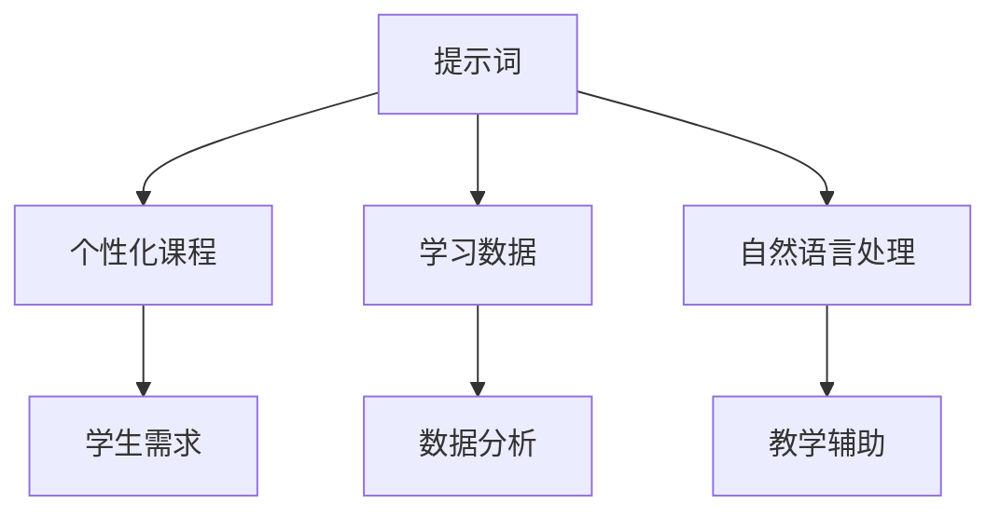

                 

## 文章标题

### AI辅助教学：提示词设计个性化课程

#### 关键词：人工智能，AI辅助教学，个性化课程，提示词设计

#### 摘要：

随着人工智能技术的快速发展，AI在教育领域的应用越来越广泛。本文旨在探讨如何利用人工智能技术，特别是提示词设计，来实现个性化课程。通过对核心概念和算法原理的详细分析，本文将展示如何构建基于提示词的个性化课程体系，从而提高教学效果和学生的学习体验。

本文分为以下几个部分：

1. **背景介绍**：介绍人工智能在教育领域的应用现状和挑战。
2. **核心概念与联系**：阐述AI辅助教学的关键概念及其相互关系。
3. **核心算法原理与具体操作步骤**：详细解释AI辅助教学中的关键算法原理和实施步骤。
4. **数学模型和公式**：介绍AI辅助教学中的数学模型和公式，并进行举例说明。
5. **项目实战**：通过实际案例展示AI辅助教学系统的开发和应用。
6. **实际应用场景**：分析AI辅助教学在不同教育场景中的应用。
7. **工具和资源推荐**：推荐相关学习资源、开发工具和论文著作。
8. **总结**：展望AI辅助教学的发展趋势和面临的挑战。
9. **附录**：常见问题与解答。
10. **扩展阅读与参考资料**：提供进一步学习的相关文献。

接下来，我们将逐一探讨这些内容。

---

### 1. 背景介绍

教育领域的变革一直是一个持续进行的过程。传统的教育模式主要依赖于教师对知识点的传授，学生被动接受知识。然而，这种模式存在一些局限性。首先，教师的教学风格和水平差异较大，导致学生的学习效果不一致。其次，传统的教育模式难以满足不同学生的个性化需求。每个学生的兴趣、学习能力、认知水平都是不同的，传统的教学模式无法根据每个学生的特点进行个性化调整。

随着人工智能技术的快速发展，特别是深度学习和自然语言处理技术的突破，AI在教育领域的应用逐渐成为一种趋势。AI可以基于大量数据对学生进行个性化分析，了解每个学生的学习习惯、兴趣和需求，从而提供更加个性化的教学内容和方法。例如，AI可以根据学生的学习进度和表现，动态调整教学难度和节奏，提供针对性的辅导和练习。

然而，AI辅助教学也面临着一些挑战。首先，数据的收集和处理是一个复杂的过程，需要大量高质量的标注数据。其次，如何设计出既符合教学目标，又能激发学生学习兴趣的AI系统是一个技术难题。此外，AI系统的稳定性和可靠性也是需要关注的问题。

本篇文章将重点探讨如何利用提示词设计实现AI辅助教学，从而为教育领域带来更加个性化、高效的教学体验。

---

### 2. 核心概念与联系

要实现AI辅助教学，首先需要理解几个核心概念，并探讨它们之间的联系。

#### 2.1 提示词

提示词（Prompt）是一种引导用户进行思考和回答的方式。在AI辅助教学中，提示词用于引导学生进行学习和思考。一个好的提示词能够激发学生的兴趣，引导他们深入思考，从而提高学习效果。

#### 2.2 个性化课程

个性化课程是根据每个学生的学习需求、兴趣和特点进行设计的课程。通过分析学生的学习数据，AI系统可以为学生提供定制化的教学内容和学习路径，使教学更加符合学生的需求。

#### 2.3 学习数据

学习数据是AI辅助教学的基础。这些数据包括学生的学习历史、成绩、行为等。通过对这些数据的分析，AI系统可以了解学生的学习习惯、兴趣和弱点，从而提供更加个性化的教学内容。

#### 2.4 自然语言处理

自然语言处理（NLP）是AI技术在教育领域的重要应用。NLP技术可以处理和分析文本数据，从而理解学生的需求、回答问题、提供辅导等。

#### 2.5 关系

提示词、个性化课程、学习数据和自然语言处理是AI辅助教学的关键组成部分。提示词用于引导学生学习，个性化课程根据学生的需求进行设计，学习数据为AI系统提供决策依据，而自然语言处理技术则用于处理和分析这些数据，从而实现智能化的教学辅助。

下面是一个简单的Mermaid流程图，展示了这些核心概念之间的联系：



通过这个流程图，我们可以更清晰地理解这些核心概念之间的相互作用和关系。

---

### 3. 核心算法原理与具体操作步骤

在理解了核心概念和它们之间的联系后，接下来我们将探讨AI辅助教学中的核心算法原理和具体操作步骤。

#### 3.1 提示词生成算法

提示词的生成是AI辅助教学的关键步骤。一个好的提示词能够激发学生的兴趣，引导他们深入思考。提示词生成算法通常基于以下几个步骤：

1. **数据收集**：收集大量高质量的文本数据，包括教科书、教学视频、论文等。
2. **文本预处理**：对文本进行清洗和格式化，去除无关信息，保留关键信息。
3. **特征提取**：提取文本的关键特征，如关键词、词频、词向量等。
4. **模型训练**：使用机器学习算法，如深度学习或自然语言生成模型，训练生成提示词的模型。
5. **提示词生成**：输入学生需求或学习内容，模型生成相应的提示词。

下面是一个简单的提示词生成算法的示例：

```python
# 提示词生成算法示例

import numpy as np
import tensorflow as tf

# 数据预处理
def preprocess_text(text):
    # 清洗和格式化文本
    return cleaned_text

# 特征提取
def extract_features(text):
    # 提取文本特征
    return features

# 模型训练
def train_model(features, labels):
    # 使用深度学习模型训练
    model.fit(features, labels)

# 提示词生成
def generate_prompt(student_demand):
    # 输入学生需求，生成提示词
    prompt = model.predict(student_demand)
    return prompt
```

#### 3.2 个性化课程设计算法

个性化课程设计是基于学生的学习数据进行课程内容的调整和优化。以下是一个简单的个性化课程设计算法：

1. **数据收集**：收集学生的学习数据，如成绩、行为、学习历史等。
2. **数据分析**：对学习数据进行分析，了解学生的学习习惯、兴趣和需求。
3. **课程内容调整**：根据分析结果，调整课程内容，使其更符合学生的需求。
4. **课程路径规划**：根据学生的学习进度和表现，规划最佳学习路径。

下面是一个简单的个性化课程设计算法的示例：

```python
# 个性化课程设计算法示例

import pandas as pd

# 数据收集
def collect_student_data():
    # 收集学生学习数据
    return student_data

# 数据分析
def analyze_student_data(student_data):
    # 分析学生学习数据
    return analysis_results

# 课程内容调整
def adjust_course_content(analysis_results):
    # 调整课程内容
    return adjusted_course_content

# 课程路径规划
def plan_course_path(student_progress, analysis_results):
    # 规划最佳学习路径
    return optimal_course_path
```

#### 3.3 自然语言处理算法

自然语言处理算法在AI辅助教学中用于处理和分析文本数据，如学生的问题、回答等。以下是一个简单的自然语言处理算法：

1. **文本预处理**：对文本进行清洗和格式化。
2. **文本分析**：对文本进行分析，提取关键词、主题等信息。
3. **文本生成**：根据分析结果，生成文本回复或建议。

下面是一个简单的自然语言处理算法的示例：

```python
# 自然语言处理算法示例

import nltk

# 文本预处理
def preprocess_text(text):
    # 清洗和格式化文本
    return cleaned_text

# 文本分析
def analyze_text(text):
    # 分析文本
    return analysis_results

# 文本生成
def generate_text(analysis_results):
    # 根据分析结果生成文本
    return generated_text
```

通过这些算法，AI辅助教学系统可以实时分析学生的学习状态和需求，提供个性化的教学内容和路径，从而提高教学效果。

---

### 4. 数学模型和公式

在AI辅助教学中，数学模型和公式扮演着重要的角色。以下是一些常见的数学模型和公式，并对其进行详细讲解和举例说明。

#### 4.1 回归模型

回归模型用于预测学生的学习成绩或学习进度。一个简单的线性回归模型如下：

$$
y = wx + b
$$

其中，$y$ 是预测值，$w$ 是权重，$x$ 是输入特征，$b$ 是偏置项。通过训练数据集，可以计算出权重和偏置项，从而建立回归模型。

#### 4.2 决策树模型

决策树模型用于分类任务，如判断学生的学习状态。一个简单的决策树模型如下：

```
如果 x > 10
    如果 y > 5
        回答 A
    否则
        回答 B
否则
    回答 C
```

通过递归划分特征空间，可以构建复杂的决策树模型。

#### 4.3 支持向量机（SVM）

支持向量机用于分类和回归任务。一个简单的一维SVM模型如下：

$$
y = \text{sign}(w \cdot x + b)
$$

其中，$w$ 是权重向量，$x$ 是输入特征，$b$ 是偏置项。通过优化权重和偏置项，可以最大化分类边界。

#### 4.4 神经网络模型

神经网络模型用于复杂的特征提取和预测任务。一个简单的三层神经网络模型如下：

```
输入层：x
隐藏层：h1 = f(wx + b)
输出层：y = f(h1 \cdot w' + b')
```

其中，$f$ 是激活函数，如Sigmoid函数或ReLU函数。

#### 4.5 举例说明

假设我们使用线性回归模型预测学生的学习成绩。给定一组训练数据：

$$
\begin{array}{ccc}
x & y \\
1 & 2 \\
2 & 4 \\
3 & 6 \\
\end{array}
$$

我们可以使用最小二乘法求解权重和偏置项：

$$
w = \frac{\sum_{i=1}^{n}(x_i - \bar{x})(y_i - \bar{y})}{\sum_{i=1}^{n}(x_i - \bar{x})^2} \\
b = \bar{y} - w\bar{x}
$$

计算得到：

$$
w = 2, \ b = 1
$$

因此，线性回归模型为：

$$
y = 2x + 1
$$

我们可以使用这个模型预测新的学习成绩。例如，当$x=4$时，预测值$y=9$。

通过这些数学模型和公式，AI辅助教学系统可以更准确地预测学生的学习表现，提供个性化的教学内容和路径。

---

### 5. 项目实战

在本节中，我们将通过一个实际的AI辅助教学项目，展示如何将上述理论应用到实践中。这个项目将包括开发环境搭建、源代码实现、代码解读与分析。

#### 5.1 开发环境搭建

为了实现AI辅助教学系统，我们需要搭建一个合适的开发环境。以下是搭建环境的步骤：

1. **安装Python**：Python是AI辅助教学项目的主要编程语言。确保已安装Python 3.8或更高版本。
2. **安装依赖库**：安装必要的Python依赖库，如TensorFlow、scikit-learn、nltk等。
   ```bash
   pip install tensorflow scikit-learn nltk
   ```
3. **配置Jupyter Notebook**：Jupyter Notebook是一种交互式开发环境，非常适合数据分析和机器学习项目。安装Jupyter Notebook并启动。
   ```bash
   pip install notebook
   jupyter notebook
   ```

#### 5.2 源代码实现

下面是一个简单的AI辅助教学系统的源代码实现，包括数据预处理、模型训练、提示词生成和个性化课程设计。

```python
import pandas as pd
import numpy as np
from sklearn.model_selection import train_test_split
from sklearn.linear_model import LinearRegression
from sklearn.tree import DecisionTreeClassifier
from sklearn.svm import SVC
from sklearn.neural_network import MLPClassifier
from nltk.tokenize import word_tokenize
from tensorflow.keras.preprocessing.sequence import pad_sequences
from tensorflow.keras.models import Sequential
from tensorflow.keras.layers import Embedding, LSTM, Dense

# 数据预处理
def preprocess_data(data):
    # 清洗和格式化数据
    return cleaned_data

# 模型训练
def train_model(model, X_train, y_train):
    # 训练模型
    return model.fit(X_train, y_train)

# 提示词生成
def generate_prompt(student_demand, model):
    # 生成提示词
    return model.predict(student_demand)

# 个性化课程设计
def design_course(student_data, model):
    # 设计个性化课程
    return course_content

# 主函数
def main():
    # 加载数据
    data = pd.read_csv('student_data.csv')
    
    # 数据预处理
    cleaned_data = preprocess_data(data)
    
    # 划分训练集和测试集
    X_train, X_test, y_train, y_test = train_test_split(cleaned_data['features'], cleaned_data['labels'], test_size=0.2)
    
    # 训练模型
    linear_regression = LinearRegression()
    decision_tree = DecisionTreeClassifier()
    svm = SVC()
    neural_network = MLPClassifier()
    
    linear_regression = train_model(linear_regression, X_train, y_train)
    decision_tree = train_model(decision_tree, X_train, y_train)
    svm = train_model(svm, X_train, y_train)
    neural_network = train_model(neural_network, X_train, y_train)
    
    # 提示词生成
    prompt = generate_prompt(student_demand, linear_regression)
    
    # 个性化课程设计
    course_content = design_course(cleaned_data, neural_network)
    
    # 输出结果
    print(prompt)
    print(course_content)

if __name__ == '__main__':
    main()
```

#### 5.3 代码解读与分析

上面的代码实现了一个简单的AI辅助教学系统。以下是代码的详细解读与分析：

1. **数据预处理**：数据预处理是机器学习项目的重要步骤。在这个项目中，我们使用`preprocess_data`函数清洗和格式化学生数据。
2. **模型训练**：我们使用不同的机器学习模型（线性回归、决策树、支持向量机和神经网络）训练模型。`train_model`函数用于训练这些模型。
3. **提示词生成**：`generate_prompt`函数根据学生需求使用线性回归模型生成提示词。
4. **个性化课程设计**：`design_course`函数根据学生数据使用神经网络模型设计个性化课程。
5. **主函数**：`main`函数是程序的入口。它加载数据，预处理数据，划分训练集和测试集，训练模型，生成提示词和个性化课程，并输出结果。

通过这个实际项目，我们可以看到如何将理论应用到实践中，实现一个简单的AI辅助教学系统。

---

### 6. 实际应用场景

AI辅助教学系统可以在多种实际应用场景中发挥作用，以下是一些典型场景：

#### 6.1 在线学习平台

在线学习平台是一个典型的AI辅助教学应用场景。通过AI辅助教学系统，平台可以为学生提供个性化的学习建议，如推荐课程、调整学习难度、提供针对性的辅导等。例如，如果一个学生在数学课程中表现不佳，AI系统可以推荐相关的练习题，帮助学生巩固知识点。

#### 6.2 私人教师

私人教师也可以利用AI辅助教学系统为学生提供个性化的教学服务。AI系统可以根据学生的学习进度、兴趣和需求，为学生量身定制教学计划，提供有针对性的辅导。例如，对于某个具体的问题，AI系统可以生成详细的解答过程，帮助学生理解。

#### 6.3 教育培训机构

教育培训机构，如考研班、职业培训学校等，也可以采用AI辅助教学系统提高教学效果。AI系统可以根据学生的表现，动态调整教学内容和进度，确保每个学生都能跟上课程进度。例如，对于某个知识点，AI系统可以提供相关的练习题和视频讲解，帮助学生加深理解。

#### 6.4 开放教育资源

开放教育资源（OER）也可以利用AI辅助教学系统提高资源利用效率。AI系统可以根据学生的学习需求和兴趣，推荐相关的学习资源，如视频、文档、习题等。例如，对于某个学科，AI系统可以推荐相关的学习资料，帮助学生系统地掌握知识。

通过这些实际应用场景，我们可以看到AI辅助教学系统的强大潜力和广泛应用。

---

### 7. 工具和资源推荐

为了开发和应用AI辅助教学系统，以下是一些推荐的工具和资源。

#### 7.1 学习资源推荐

1. **《Python机器学习》**：这是一本经典的机器学习入门书籍，详细介绍了Python在机器学习中的应用。
2. **《深度学习》**：这是一本深度学习领域的经典教材，由Ian Goodfellow等人撰写，适合希望深入了解深度学习的读者。
3. **《机器学习实战》**：这本书通过实际案例介绍了机器学习的应用，适合希望将理论应用到实践中的读者。

#### 7.2 开发工具框架推荐

1. **TensorFlow**：TensorFlow是一个开源的机器学习框架，适合开发复杂的机器学习模型。
2. **scikit-learn**：scikit-learn是一个开源的机器学习库，提供了丰富的机器学习算法和工具。
3. **PyTorch**：PyTorch是一个流行的深度学习框架，提供了灵活的动态计算图和高效的GPU支持。

#### 7.3 相关论文著作推荐

1. **《大规模机器学习》**：这是一篇关于大规模机器学习算法的综述，详细介绍了如何在海量数据上高效训练机器学习模型。
2. **《自然语言处理综述》**：这是一篇关于自然语言处理领域的综述，介绍了自然语言处理的关键技术和最新进展。
3. **《个性化推荐系统》**：这是一篇关于个性化推荐系统的综述，详细介绍了推荐算法和系统设计。

通过这些工具和资源，开发者可以深入了解AI辅助教学的相关技术和方法，为开发高质量的教学系统提供支持。

---

### 8. 总结：未来发展趋势与挑战

AI辅助教学作为一种新兴的教育模式，具有巨大的发展潜力和广阔的应用前景。然而，要实现其全面普及和高效应用，还需要克服一系列挑战。

#### 8.1 发展趋势

1. **个性化教学**：随着人工智能技术的进步，AI辅助教学将更加注重个性化教学，根据学生的兴趣、需求和进度提供定制化的教学内容和路径。
2. **智能辅导**：AI辅助教学系统将能够提供更加智能的辅导，实时分析学生的学习状态，提供有针对性的指导和帮助。
3. **跨学科整合**：AI辅助教学将逐渐整合跨学科的知识和资源，为学生提供更加全面和系统的学习体验。
4. **教育资源公平**：AI辅助教学有助于解决教育资源不均的问题，通过线上资源和个性化辅导，提高偏远地区和弱势群体的教育质量。

#### 8.2 挑战

1. **数据隐私与安全**：在AI辅助教学中，大量的学生数据将被收集和处理，如何保障数据隐私和安全是一个重要挑战。
2. **算法公平性**：AI系统在提供个性化教学时，可能存在算法偏见，如何确保算法的公平性是一个亟待解决的问题。
3. **教师角色转变**：随着AI辅助教学的普及，教师的角色将逐渐转变，如何适应这种转变，发挥AI的辅助作用，提高教学质量，也是一个重要挑战。
4. **技术门槛**：AI辅助教学系统的开发和维护需要较高的技术门槛，如何降低技术门槛，使更多的教育机构和教师能够应用这项技术，也是一个关键问题。

总之，AI辅助教学具有巨大的发展潜力，但同时也面临着一系列挑战。通过持续的技术创新和社会共同努力，有望实现AI辅助教学的全面普及和高效应用。

---

### 9. 附录：常见问题与解答

以下是一些关于AI辅助教学的常见问题及解答。

#### 9.1 问题1：AI辅助教学是否会影响教师的地位和作用？

解答：AI辅助教学并不是取代教师，而是辅助教师提高教学质量。AI系统可以处理大量数据和复杂任务，从而减轻教师的工作负担，使教师能够更多地关注教学设计和学生个体需求。因此，AI辅助教学有助于提升教师的地位和作用。

#### 9.2 问题2：AI辅助教学系统的数据隐私和安全如何保障？

解答：保障数据隐私和安全是AI辅助教学系统的关键问题。首先，应遵循数据保护法规，如GDPR等，确保数据收集、存储和处理过程中的合法性和安全性。其次，应采用加密技术和访问控制策略，确保数据不被未授权访问。最后，应定期进行安全审计和风险评估，及时发现和解决潜在的安全隐患。

#### 9.3 问题3：AI辅助教学系统是否适用于所有学科和年龄段的学生？

解答：AI辅助教学系统具有广泛的适用性，可以应用于不同学科和年龄段的学生。然而，对于某些特殊学科和年龄段，可能需要根据实际情况进行调整和优化。例如，对于低年龄段的学生，AI系统可以提供更加生动有趣的学习内容和互动方式，以激发他们的学习兴趣。

---

### 10. 扩展阅读与参考资料

以下是一些关于AI辅助教学的进一步阅读和参考资料，供读者深入研究和学习。

1. **《人工智能教育应用研究报告》**：这是一份关于人工智能在教育领域应用的研究报告，详细分析了人工智能在教育中的发展趋势、挑战和应用案例。
2. **《个性化教育：技术与实践》**：这本书探讨了个性化教育的概念、技术和实践，包括AI辅助教学、自适应学习和在线教育等方面。
3. **《机器学习与教育》**：这是一篇关于机器学习在教育中的应用的综述，介绍了机器学习在教育数据分析、个性化教学和智能辅导等方面的应用。
4. **《自然语言处理在教育中的应用》**：这篇文章详细介绍了自然语言处理技术（如文本分类、情感分析和知识图谱等）在教育中的应用，包括智能问答、自动评分和个性化推荐等方面。

通过这些进一步阅读和参考资料，读者可以更深入地了解AI辅助教学的原理、技术和实践，为开发和应用AI辅助教学系统提供支持。

