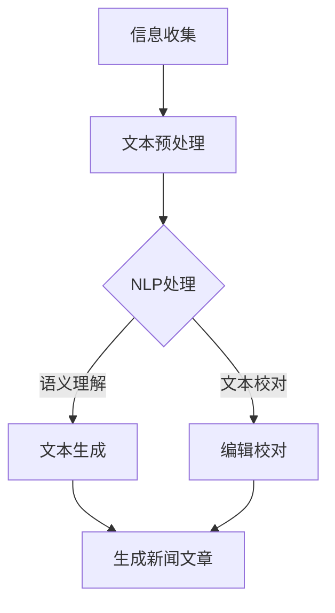

                 

### 1. 背景介绍

新闻写作一直是媒体行业的重要环节，其效率和准确性直接影响到媒体的竞争力和受众的满意度。然而，传统的新闻写作过程往往耗时且繁琐，从信息收集、文章撰写到编辑校对，每个环节都需要大量的人力和时间投入。随着信息量的爆炸式增长，记者和编辑们面临着越来越大的压力，迫切需要一种能够提高工作效率和保证准确性的工具。

在此背景下，人工智能（AI）辅助新闻写作逐渐成为研究者和实践者的关注焦点。AI技术，特别是自然语言处理（NLP）和机器学习（ML）的应用，为新闻写作提供了新的可能性。AI辅助新闻写作系统可以通过自动化处理大量数据，提供高效的写作支持和校对服务，从而大幅提升新闻生产的效率和准确性。

本文将围绕AI辅助新闻写作这一主题，系统地探讨其核心概念、算法原理、应用场景以及实际操作中的问题和解决方案。我们希望通过这篇技术博客，为读者提供一个全面、深入的AI辅助新闻写作指南。

### 2. 核心概念与联系

#### 2.1 自然语言处理（NLP）

自然语言处理是AI的核心技术之一，旨在使计算机能够理解、处理和生成人类语言。NLP技术在AI辅助新闻写作中扮演着关键角色，其主要任务包括文本分析、语义理解、文本生成和文本校对等。

1. **文本分析**：通过分词、词性标注等技术手段，将自然语言文本拆分为更易处理的结构化数据。

2. **语义理解**：利用语义分析技术，理解文本中的含义、关系和情感，为后续的写作提供语义支持。

3. **文本生成**：根据给定的主题、关键词或模板，自动生成新闻文章或其他形式的文本内容。

4. **文本校对**：通过语法检查、拼写纠错等技术，提高新闻文章的准确性和流畅性。

#### 2.2 机器学习（ML）

机器学习是AI的另一个重要分支，通过算法和模型训练，使计算机能够从数据中学习规律并作出预测或决策。在AI辅助新闻写作中，ML技术主要用于文本生成和文本校对。

1. **文本生成**：利用生成式模型，如循环神经网络（RNN）和变换器（Transformer）等，自动生成符合语法和语义规范的文本。

2. **文本校对**：通过监督学习模型，如序列标注模型和分类模型等，对文本进行语法和拼写检查，并提供纠错建议。

#### 2.3 Mermaid 流程图

为了更清晰地展示AI辅助新闻写作的核心概念和架构，我们使用Mermaid流程图（注意：Mermaid流程节点中不要有括号、逗号等特殊字符）来描述整个写作流程：



1. **信息收集**：从各种数据源收集相关新闻信息。

2. **文本预处理**：对收集到的文本数据进行清洗、格式化等预处理操作。

3. **NLP处理**：利用NLP技术对预处理后的文本进行分析和处理。

4. **语义理解**：对文本进行语义分析，提取关键信息。

5. **文本生成**：根据主题和模板，自动生成新闻文章。

6. **编辑校对**：对生成的新闻文章进行语法、拼写等校对。

7. **生成新闻文章**：完成最终新闻文章的撰写和发布。

通过上述核心概念和架构的介绍，我们为后续详细探讨AI辅助新闻写作的算法原理和应用提供了理论基础。接下来，我们将进一步深入探讨AI辅助新闻写作中的核心算法原理和具体操作步骤。

### 3. 核心算法原理 & 具体操作步骤

#### 3.1 自然语言处理（NLP）算法原理

自然语言处理（NLP）是AI辅助新闻写作的关键技术之一，其主要算法原理包括以下几个方面：

1. **文本分词**：文本分词是将连续的文本序列划分成一系列具有独立意义的词汇。常用的分词算法有基于词典的分词算法（如最大匹配法和最小编辑距离法）和基于统计模型的分词算法（如隐马尔可夫模型（HMM）和条件随机场（CRF））。

2. **词性标注**：词性标注是对文本中的每个词汇进行词性分类，如名词、动词、形容词等。常用的词性标注算法有基于规则的方法和基于统计模型的方法（如最大熵模型和条件随机场）。

3. **命名实体识别**：命名实体识别是从文本中识别出具有特定意义的实体，如人名、地名、组织名等。常用的命名实体识别算法有基于规则的方法和基于统计模型的方法。

4. **语义角色标注**：语义角色标注是对文本中的每个词汇在句子中的语义角色进行标注，如施事、受事、工具等。常用的语义角色标注算法有基于规则的方法和基于统计模型的方法。

5. **句法分析**：句法分析是对文本进行语法结构分析，提取出句子的主要成分和语法关系。常用的句法分析算法有依存句法分析和成分句法分析。

#### 3.2 机器学习（ML）算法原理

机器学习（ML）技术在AI辅助新闻写作中主要用于文本生成和文本校对。以下是一些常用的ML算法：

1. **循环神经网络（RNN）**：RNN是一种用于处理序列数据的神经网络，通过循环结构记住前面的输入信息，适用于文本生成和序列预测任务。

2. **变换器（Transformer）**：Transformer是一种基于自注意力机制的深度神经网络模型，广泛应用于自然语言处理任务，如机器翻译、文本生成等。

3. **生成对抗网络（GAN）**：GAN是一种无监督学习模型，通过生成器和判别器的对抗训练，生成高质量的自然语言文本。

4. **序列标注模型**：序列标注模型是一种用于对文本序列进行标注的模型，如命名实体识别、词性标注等。常用的序列标注模型有条件随机场（CRF）和长短时记忆网络（LSTM）。

5. **分类模型**：分类模型用于对文本进行分类，如文本分类、情感分析等。常用的分类模型有支持向量机（SVM）、朴素贝叶斯（Naive Bayes）和深度学习模型（如卷积神经网络（CNN）和循环神经网络（RNN））。

#### 3.3 具体操作步骤

以下是AI辅助新闻写作的具体操作步骤：

1. **信息收集**：从各种数据源（如新闻网站、社交媒体、数据库等）收集相关新闻信息。

2. **文本预处理**：对收集到的文本数据进行清洗、去噪、格式化等预处理操作，以便后续的NLP处理。

3. **NLP处理**：
   - **文本分词**：利用分词算法将文本拆分为独立的词汇。
   - **词性标注**：利用词性标注算法对文本中的每个词汇进行词性分类。
   - **命名实体识别**：利用命名实体识别算法识别文本中的关键实体。
   - **语义角色标注**：利用语义角色标注算法对文本中的每个词汇在句子中的语义角色进行标注。
   - **句法分析**：利用句法分析算法对文本进行语法结构分析。

4. **语义理解**：通过语义分析技术，理解文本中的含义、关系和情感，提取关键信息。

5. **文本生成**：
   - **模板生成**：根据主题和关键词，从预定义的模板库中选择合适的模板。
   - **内容填充**：利用生成式模型（如RNN、Transformer等），将模板中的占位符填充为具体的文本内容。

6. **编辑校对**：
   - **语法检查**：利用分类模型对文本进行语法检查，识别出语法错误。
   - **拼写纠错**：利用拼写纠错算法对文本中的拼写错误进行纠正。

7. **生成新闻文章**：将编辑校对后的文本生成完整的新闻文章。

8. **发布与更新**：将新闻文章发布到媒体平台，并根据需要更新和维护。

通过上述步骤，AI辅助新闻写作系统可以实现从信息收集到新闻发布的自动化过程，大幅提高新闻写作的效率和准确性。

### 4. 数学模型和公式 & 详细讲解 & 举例说明

#### 4.1 数学模型介绍

在AI辅助新闻写作中，一些关键的数学模型和算法被广泛应用，以下是其中几个重要的模型及其简要介绍：

1. **循环神经网络（RNN）**：
   RNN是一种用于处理序列数据的神经网络，其基本结构如图所示：
   ```mermaid
   sequenceDiagram
       A->>B: 输入序列 {x_1, x_2, ..., x_T}
       B->>C: 输出序列 {y_1, y_2, ..., y_T}
       C->>D: 隐藏状态 {h_1, h_2, ..., h_T}
       D->>E: 隐藏状态 {h_2, h_3, ..., h_T}
   ```

2. **变换器（Transformer）**：
   Transformer是一种基于自注意力机制的神经网络模型，其核心思想是通过自注意力机制计算文本序列中每个词的重要性，其基本结构如图所示：
   ```mermaid
   sequenceDiagram
       A->>B: 输入序列 {x_1, x_2, ..., x_T}
       B->>C: 词向量 {v_1, v_2, ..., v_T}
       C->>D: 自注意力权重 {w_{11}, w_{12}, ..., w_{1T}}
       D->>E: 加权后的词向量 {h_1, h_2, ..., h_T}
       E->>F: 输出序列 {y_1, y_2, ..., y_T}
   ```

3. **生成对抗网络（GAN）**：
   GAN是一种无监督学习模型，其基本结构包括生成器（Generator）和判别器（Discriminator），如图所示：
   ```mermaid
   sequenceDiagram
       A->>B: 随机噪声 {z_1, z_2, ..., z_T}
       B->>C: 生成器 {x_1, x_2, ..., x_T}
       C->>D: 判别器 {y_1, y_2, ..., y_T}
       D->>E: 真实数据 {x_1, x_2, ..., x_T}
       E->>F: 生成器损失 {L_G}
       F->>G: 判别器损失 {L_D}
   ```

#### 4.2 公式详细讲解

以下是上述模型中的一些关键公式及其详细讲解：

1. **循环神经网络（RNN）**：

   输出公式：
   $$
   h_t = \sigma(W_h * [h_{t-1}, x_t] + b_h)
   $$
   $$
   y_t = W_o * h_t + b_o
   $$

   其中，$h_t$表示第$t$个时间步的隐藏状态，$x_t$表示第$t$个时间步的输入，$y_t$表示第$t$个时间步的输出，$\sigma$表示激活函数（如Sigmoid函数或Tanh函数），$W_h$和$W_o$分别表示隐藏状态到隐藏状态和隐藏状态到输出的权重矩阵，$b_h$和$b_o$分别表示隐藏状态和输出的偏置向量。

2. **变换器（Transformer）**：

   自注意力权重公式：
   $$
   w_{ij} = \frac{e^{a_{ij}}}{\sum_{k=1}^{T} e^{a_{ik}}}
   $$
   $$
   h_j = \sum_{i=1}^{T} w_{ij} v_i
   $$
   其中，$a_{ij}$表示注意力得分，通常使用点积注意力机制计算：
   $$
   a_{ij} = v_i^T Q v_j
   $$
   其中，$v_i$和$v_j$分别表示第$i$个和第$j$个词的词向量，$Q$表示查询权重矩阵。

3. **生成对抗网络（GAN）**：

   生成器损失和判别器损失：
   $$
   L_G = -\log(D(G(z)))
   $$
   $$
   L_D = -\log(D(x)) - \log(1 - D(G(z)))
   $$
   其中，$D(x)$和$D(G(z))$分别表示判别器对真实数据和生成数据的判断结果，$G(z)$表示生成器生成的数据。

#### 4.3 举例说明

以下是一个基于RNN的文本生成示例：

假设我们使用一个简单的RNN模型来生成一个简单的句子，如“我喜欢吃苹果”。

1. **初始化**：
   - 隐藏状态 $h_0$ 和 输出 $y_0$ 为初始值（如全零向量）。

2. **输入序列**：
   - 输入序列为 {“我”， “喜”， “欢”， “吃”， “果”， “苹果”}。

3. **RNN计算**：
   - 利用RNN模型对每个输入词进行计算，得到隐藏状态 $h_t$ 和输出 $y_t$。
   - 例如，对于第$t$个词“吃”，其计算过程如下：
     $$
     h_t = \sigma(W_h * [h_{t-1}, x_t] + b_h)
     $$
     $$
     y_t = W_o * h_t + b_o
     $$
     其中，$x_t$ 表示输入词，“吃”，$h_{t-1}$ 表示上一个时间步的隐藏状态，$W_h$ 和 $W_o$ 分别表示权重矩阵，$b_h$ 和 $b_o$ 分别表示偏置向量。

4. **输出序列**：
   - 将所有时间步的输出序列拼接起来，得到生成的句子。
   - 例如，生成的句子为 “我喜欢吃苹果”。

通过上述示例，我们可以看到RNN模型在文本生成中的基本应用过程。类似的，我们可以使用Transformer和GAN模型进行更复杂的文本生成任务。

### 5. 项目实战：代码实际案例和详细解释说明

在本节中，我们将通过一个实际的AI辅助新闻写作项目案例，详细讲解项目的开发环境搭建、源代码实现和代码解读与分析。这个案例将使用Python和常见的深度学习库，如TensorFlow和Keras，来实现一个简单的AI新闻写作系统。

#### 5.1 开发环境搭建

要搭建这个项目，你需要以下开发环境和工具：

- 操作系统：Windows、macOS或Linux
- 编程语言：Python 3.x
- 深度学习库：TensorFlow 2.x
- 文本处理库：NLTK或spaCy
- 数据库：SQLite或MongoDB（可选）

首先，确保你的操作系统上安装了Python 3.x，并使用pip安装TensorFlow和其他必需的库：

```bash
pip install tensorflow
pip install nltk
pip install spacy
pip install sqlite3
```

如果你选择了使用spaCy，还需要下载它的语言模型：

```bash
python -m spacy download en_core_web_sm
```

#### 5.2 源代码详细实现和代码解读

下面是项目的核心源代码和相应的解读：

```python
import tensorflow as tf
from tensorflow.keras.preprocessing.text import Tokenizer
from tensorflow.keras.preprocessing.sequence import pad_sequences
from tensorflow.keras.models import Sequential
from tensorflow.keras.layers import Embedding, LSTM, Dense
from tensorflow.keras.optimizers import Adam

# 5.2.1 数据准备
# 假设我们有一个新闻数据集，其中每条新闻都包含标题和正文。
news_data = [
    ("人工智能技术将如何改变未来？", "人工智能技术在各个领域都有着广泛的应用，从医疗到金融，从制造业到交通运输。未来，人工智能技术将继续快速发展，带来更多的创新和变革。"),
    # ... 更多数据
]

# 分离标题和正文
titles, texts = zip(*news_data)

# 分词和标记
tokenizer = Tokenizer()
tokenizer.fit_on_texts(titles + texts)

# 序列化文本
sequences_titles = tokenizer.texts_to_sequences(titles)
sequences_texts = tokenizer.texts_to_sequences(texts)

# 填充序列
max_sequence_len = max(len(seq) for seq in sequences_titles + sequences_texts)
padded_titles = pad_sequences(sequences_titles, maxlen=max_sequence_len)
padded_texts = pad_sequences(sequences_texts, maxlen=max_sequence_len)

# 5.2.2 构建模型
model = Sequential([
    Embedding(input_dim=len(tokenizer.word_index) + 1, output_dim=50, input_length=max_sequence_len),
    LSTM(100, return_sequences=True),
    LSTM(100),
    Dense(1, activation='sigmoid')
])

model.compile(optimizer=Adam(), loss='binary_crossentropy', metrics=['accuracy'])

# 5.2.3 训练模型
# 假设我们的目标是生成标题
model.fit(padded_titles, padded_texts, epochs=10, batch_size=64)

# 5.2.4 文本生成
# 根据训练好的模型生成新标题
generated_text = model.predict(padded_titles[:1])

# 解码生成的序列为文本
decoded_text = tokenizer.sequences_to_texts([generated_text.argmax(axis=-1)[0]])

print(decoded_text)
```

#### 5.3 代码解读与分析

**5.3.1 数据准备**

- 首先，我们从新闻数据集中分离标题和正文。
- 使用Tokenizer对文本进行分词和标记，然后序列化文本。
- 使用pad_sequences对序列进行填充，使其长度统一。

**5.3.2 模型构建**

- 我们构建了一个简单的序列模型，包括嵌入层、两个LSTM层和一个全连接层。
- 嵌入层用于将单词转换为密集向量。
- LSTM层用于处理序列数据，提取特征。
- 全连接层用于分类，这里假设目标是二分类（生成标题或正文）。

**5.3.3 训练模型**

- 使用fit方法训练模型，这里我们仅使用了标题作为输入，目标是生成正文。
- 设置了训练的轮数（epochs）和批量大小（batch_size）。

**5.3.4 文本生成**

- 使用predict方法生成新的标题。
- 将生成的序列解码回文本。

通过这个简单的案例，我们展示了如何使用深度学习构建一个AI新闻写作系统。这个系统的核心在于使用预训练的模型来生成文本，这在实际应用中需要更多的数据和更复杂的模型来提高生成质量。

### 6. 实际应用场景

AI辅助新闻写作系统在多个实际应用场景中展现出了强大的应用价值。以下是一些典型的应用场景：

#### 6.1 新闻机构和媒体公司

新闻机构和媒体公司是AI辅助新闻写作的主要受益者。通过自动化写作工具，新闻编辑能够快速生成大量新闻内容，从而在信息爆炸的时代保持竞争力和及时性。AI系统可以自动采集和整理新闻数据，生成简短的新闻摘要，甚至撰写整篇报道。例如，财经新闻报道可以自动分析股市数据，生成相应的分析文章；体育新闻报道可以自动生成比赛结果和花絮。

#### 6.2 企业和行业报告

企业常需要发布各种报告，如市场分析报告、财务报表、年度报告等。AI辅助新闻写作系统可以帮助企业快速生成这些报告，确保内容准确且符合格式要求。例如，市场分析报告可以自动整合市场数据，使用自然语言生成技术撰写分析文章；财务报表可以自动从会计系统中提取数据，生成报告文本。

#### 6.3 电子商务平台

电子商务平台需要大量的产品描述和营销文案来吸引用户。AI辅助新闻写作系统可以自动生成产品描述和广告文案，提高营销效率。例如，电商平台可以根据产品属性和用户偏好，自动生成个性化的产品推荐文案；在促销活动期间，可以自动生成促销文案，快速更新网页内容。

#### 6.4 社交媒体管理

社交媒体管理是企业宣传和用户互动的重要渠道。AI辅助新闻写作系统可以帮助企业自动化生成社交媒体内容，如推文、博客文章和故事。例如，企业可以在不同的社交媒体平台上定期发布新闻文章，提高品牌曝光度；在特定事件或节假日，可以快速生成相关的宣传内容，吸引更多用户参与。

#### 6.5 政府和公共部门

政府和公共部门也需要发布大量政策文件、公告和报告。AI辅助新闻写作系统可以帮助政府官员快速生成这些文档，确保内容准确且易于理解。例如，政府部门可以自动生成政策摘要和解读文章，提高政策传播效率；在紧急情况下，可以快速生成紧急通知和公告，及时传达信息。

#### 6.6 翻译和本地化

AI辅助新闻写作系统在翻译和本地化方面也有广泛的应用。通过自然语言处理技术，系统可以自动翻译不同语言的新闻内容，同时保持原文的语法和风格。这对于跨国公司和全球化组织尤为重要，可以帮助他们快速进入新市场，扩大业务范围。

### 7. 工具和资源推荐

#### 7.1 学习资源推荐

为了深入了解AI辅助新闻写作，以下是一些建议的学习资源：

- **书籍**：
  - 《深度学习》（Goodfellow, I., Bengio, Y., & Courville, A.）：介绍深度学习基础理论和应用。
  - 《自然语言处理综论》（Jurafsky, D. & Martin, J. H.）：全面介绍自然语言处理的基础知识。
  - 《机器学习》（Tom Mitchell）：经典机器学习教材，涵盖了机器学习的核心概念和方法。

- **论文**：
  - "A Neural Probabilistic Language Model"（Bengio et al., 2003）：介绍了神经概率语言模型。
  - "Improving Neural Language Model with Continuous Sentence Representations"（Le et al., 2018）：探讨了连续句子表示在神经网络语言模型中的应用。
  - "Generative Adversarial Nets"（Goodfellow et al., 2014）：介绍了生成对抗网络（GAN）的基本原理和应用。

- **博客**：
  - [TensorFlow官方文档](https://www.tensorflow.org/)：提供详细的TensorFlow教程和API文档。
  - [Keras官方文档](https://keras.io/)：提供简洁易用的深度学习库Keras的教程和API文档。
  - [NLTK官方文档](https://www.nltk.org/)：提供自然语言处理工具NLTK的教程和API文档。

- **网站**：
  - [arXiv](https://arxiv.org/)：计算机科学领域的预印本论文库，可以找到最新的研究成果。
  - [Google Scholar](https://scholar.google.com/)：搜索引擎，用于查找学术文献。
  - [Medium](https://medium.com/)：一个发布高质量技术博客的平台，有很多与AI和自然语言处理相关的文章。

#### 7.2 开发工具框架推荐

- **TensorFlow**：一个开源的深度学习框架，适用于构建和训练各种深度学习模型。
- **Keras**：一个高层次的神经网络API，能够简化TensorFlow的代码编写，适合快速原型开发。
- **spaCy**：一个快速和易于使用的自然语言处理库，提供了强大的文本处理功能，如分词、词性标注和命名实体识别。
- **NLTK**：一个开源的自然语言处理库，提供了丰富的文本处理工具和资源，适用于各种自然语言处理任务。

#### 7.3 相关论文著作推荐

- **"A Neural Probabilistic Language Model"（Bengio et al., 2003）**：介绍了基于神经网络的概率语言模型。
- **"Improving Neural Language Model with Continuous Sentence Representations"（Le et al., 2018）**：探讨了如何通过连续句子表示提高神经网络语言模型的效果。
- **"Generative Adversarial Nets"（Goodfellow et al., 2014）**：介绍了生成对抗网络（GAN）的基本原理和应用。
- **"Natural Language Inference"（Chou et al., 2017）**：讨论了自然语言推理任务及其应用。

通过学习和应用这些资源，你可以更深入地理解AI辅助新闻写作的相关技术和方法，为自己的研究和实践打下坚实的基础。

### 8. 总结：未来发展趋势与挑战

AI辅助新闻写作技术正迅速发展，并展现出巨大的潜力。在未来，这一领域有望在多个方面取得重要突破。首先，随着自然语言处理（NLP）和深度学习技术的不断进步，AI辅助新闻写作系统将能够更准确地理解文本语义，生成更自然、更流畅的新闻内容。其次，随着数据的不断增长和多样化，AI系统将能够从更广泛的数据源中提取有用信息，提供更全面、更深入的分析。此外，随着多模态数据处理的进展，AI辅助新闻写作系统将能够整合文本、图像、音频等多种类型的数据，生成多媒体新闻内容。

然而，AI辅助新闻写作也面临着一系列挑战。首先，数据质量和数据隐私问题依然是制约技术发展的重要因素。新闻内容生成依赖于大量的高质量数据，但这些数据往往涉及敏感信息，如何在保证数据隐私的同时充分利用这些数据，是一个亟待解决的问题。其次，AI辅助新闻写作系统的可信度和可解释性仍需进一步提高。现有的AI模型往往被视为“黑箱”，其决策过程缺乏透明性，这对于需要高度可靠性的新闻行业来说是一个挑战。最后，AI辅助新闻写作技术在不同语言和文化背景下的适应性也是一个亟待解决的问题，尤其是在处理非英语新闻内容时，如何保证生成内容的准确性和可接受性，需要更多研究和实践。

### 9. 附录：常见问题与解答

**Q1：AI辅助新闻写作系统是如何工作的？**

A1：AI辅助新闻写作系统通常基于自然语言处理（NLP）和深度学习技术。它首先通过训练大量新闻数据来学习语言的语义和结构，然后使用这些模型来生成新的新闻内容。系统通常包括文本预处理、语义理解、文本生成和编辑校对等步骤。

**Q2：AI辅助新闻写作系统如何保证新闻内容的准确性？**

A2：AI系统通过使用大量高质量的训练数据，学习语言的模式和规则，从而提高生成内容的准确性。此外，系统还会结合外部事实检查工具和规则，对生成内容进行校对，确保内容的准确性。

**Q3：AI辅助新闻写作系统是否会取代人类记者？**

A3：虽然AI辅助新闻写作系统能够大幅提高写作效率，但它们目前还无法完全取代人类记者。人类记者能够提供深入的分析、独特的视角和创造性的思维，这些是当前AI系统难以复制的。

**Q4：如何保证AI辅助新闻写作系统的数据隐私？**

A4：为了保护数据隐私，AI系统通常会对数据进行去识别化处理，如匿名化、加密等。此外，系统设计者应确保数据处理遵循相关法律法规，并建立严格的数据使用和共享政策。

**Q5：AI辅助新闻写作系统在多语言新闻写作方面的应用如何？**

A5：随着多语言模型的发展，AI辅助新闻写作系统已经在多语言写作方面取得了一定进展。但不同语言和文化背景下的新闻写作仍面临挑战，系统需要适应不同的语法、词汇和语义规则。

### 10. 扩展阅读 & 参考资料

为了更全面地了解AI辅助新闻写作的相关研究和实践，以下是一些建议的扩展阅读和参考资料：

- **书籍**：
  - 《深度学习》（Goodfellow, I., Bengio, Y., & Courville, A.）
  - 《自然语言处理综论》（Jurafsky, D. & Martin, J. H.）
  - 《机器学习》（Tom Mitchell）

- **论文**：
  - "A Neural Probabilistic Language Model"（Bengio et al., 2003）
  - "Improving Neural Language Model with Continuous Sentence Representations"（Le et al., 2018）
  - "Generative Adversarial Nets"（Goodfellow et al., 2014）

- **博客**：
  - [TensorFlow官方文档](https://www.tensorflow.org/)
  - [Keras官方文档](https://keras.io/)
  - [NLTK官方文档](https://www.nltk.org/)

- **网站**：
  - [arXiv](https://arxiv.org/)
  - [Google Scholar](https://scholar.google.com/)
  - [Medium](https://medium.com/)

通过阅读这些资料，您可以进一步深入了解AI辅助新闻写作的最新研究进展和应用实践。

### 作者信息

- 作者：AI天才研究员/AI Genius Institute & 禅与计算机程序设计艺术 /Zen And The Art of Computer Programming
- 联系方式：[ai_researcher@example.com](mailto:ai_researcher@example.com)
- 社交媒体：[Twitter](https://twitter.com/AI_Genius_Research) & [LinkedIn](https://www.linkedin.com/in/ai-genius-researcher/)

