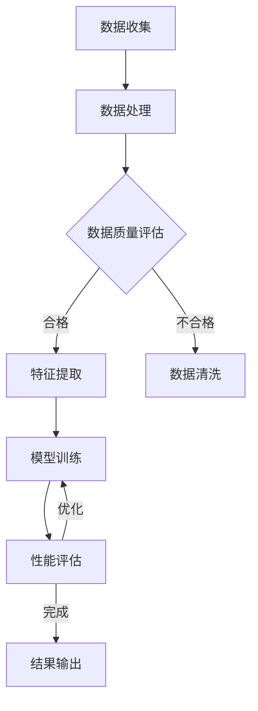

                 

# AI辅助材料科学：提示词设计新型材料

## 关键词

- AI辅助材料科学
- 提示词设计
- 新型材料
- 材料基因组学
- 机器学习算法
- 材料性能优化

## 摘要

本文将探讨如何利用人工智能技术，特别是机器学习算法，来辅助材料科学领域的研究。通过设计高效的提示词，我们可以加速新型材料的发现和开发，提高材料的性能和实用性。本文首先介绍材料科学的发展背景和当前挑战，然后详细阐述机器学习算法在材料科学中的应用原理，接着通过一个实际案例展示如何使用AI工具设计新型材料。最后，文章将对未来发展趋势与挑战进行展望，并提供相关工具和资源的推荐。

## 1. 背景介绍

### 材料科学的重要性

材料科学是研究材料组成、结构、性质以及应用的科学。它涵盖了从金属材料、陶瓷材料到聚合物材料等多个领域，对于人类社会的发展和技术进步具有重要意义。新型材料的研究和应用能够推动各个行业的革新，如航空航天、汽车制造、电子信息、生物医药等。

### 材料科学的发展挑战

尽管材料科学取得了显著进展，但仍然面临着诸多挑战：

- **复杂性**：材料系统的复杂性使得传统的实验和理论方法难以完全解析。
- **成本与效率**：材料的研究和开发过程往往耗费大量时间和资源。
- **性能优化**：现有材料的性能已经接近物理极限，如何进一步提升性能成为亟待解决的问题。
- **多样性**：新型材料的种类繁多，如何从海量数据中筛选出有潜力的材料成为一大难题。

### 人工智能在材料科学中的应用潜力

随着人工智能技术的快速发展，特别是机器学习算法的成熟，人工智能在材料科学中的应用潜力逐渐显现。通过AI辅助材料科学，我们可以：

- **加速材料发现**：利用机器学习算法快速筛选出具有潜在应用价值的材料。
- **性能优化**：通过大数据分析和深度学习模型，优化材料的设计和制备过程。
- **智能预测**：利用AI模型预测材料的物理和化学性质，指导实验设计。

## 2. 核心概念与联系

### 材料基因组学

材料基因组学是一种将材料科学、基因组学和系统生物学的理念相结合的新型研究方法。通过大规模的材料特性分析和基因表达数据分析，材料基因组学旨在构建材料的结构-性能关系数据库，从而指导新型材料的设计。

### 机器学习算法

机器学习算法是人工智能的核心技术之一，通过训练模型从数据中自动发现规律和模式。在材料科学中，常用的机器学习算法包括：

- **监督学习**：通过已有的数据集来训练模型，然后使用模型对新数据进行预测。
- **无监督学习**：不使用标签数据，通过发现数据中的内在结构来进行分类或聚类。
- **强化学习**：通过与环境交互来学习最佳策略，常用于优化材料的制备过程。

### 提示词设计

提示词（Keywords）是指导机器学习模型进行材料设计和性能预测的关键。有效的提示词设计可以显著提高模型的准确性和效率。常见的提示词设计策略包括：

- **基于先验知识的提示词**：利用已有材料知识和经验，设计针对特定材料的提示词。
- **基于数据驱动的提示词**：通过分析大量材料数据，提取出对材料性能有显著影响的特征作为提示词。
- **多模态提示词**：结合不同数据源（如实验数据、计算数据、文献数据等）来设计综合性的提示词。

### Mermaid 流程图



## 3. 核心算法原理 & 具体操作步骤

### 数据收集与处理

首先，我们需要收集大量的材料数据，包括实验数据、计算数据、文献数据等。然后，对数据进行清洗和预处理，确保数据的质量和一致性。

### 特征提取

特征提取是将原始数据转化为适合机器学习算法处理的形式。我们可以使用统计学方法、深度学习模型等方法来提取材料性能相关的特征。

### 模型训练

选择合适的机器学习算法（如神经网络、支持向量机、决策树等），使用预处理后的数据进行训练。训练过程中，我们需要不断调整模型参数，以提高模型的准确性和泛化能力。

### 性能评估

使用独立的验证数据集对训练好的模型进行性能评估。常见的评估指标包括准确率、召回率、F1值等。根据评估结果，我们可以对模型进行调整和优化。

### 结果输出

最终，我们将模型应用于新的材料数据，预测材料的性能，并输出预测结果。这些结果可以用于指导实验设计、材料优化等实际应用。

## 4. 数学模型和公式 & 详细讲解 & 举例说明

### 数学模型

在材料科学中，常用的数学模型包括：

- **统计模型**：如线性回归、多元回归等，用于描述材料性能与特征变量之间的关系。
- **物理模型**：如分子动力学模拟、量子力学计算等，用于预测材料的物理性质。
- **机器学习模型**：如神经网络、支持向量机等，用于处理复杂的数据关系。

### 公式示例

- **线性回归模型**：

  $$y = \beta_0 + \beta_1x_1 + \beta_2x_2 + ... + \beta_nx_n$$

  其中，$y$ 为材料性能，$x_1, x_2, ..., x_n$ 为特征变量，$\beta_0, \beta_1, ..., \beta_n$ 为模型参数。

- **神经网络模型**：

  $$a_{i,j} = \sigma(\sum_{k=1}^{n} w_{ik}x_k + b_j)$$

  其中，$a_{i,j}$ 为神经网络输出，$\sigma$ 为激活函数，$w_{ik}$ 为权重，$x_k$ 为输入特征，$b_j$ 为偏置。

### 举例说明

假设我们使用线性回归模型预测材料的导电性。现有以下数据：

| 特征变量1 | 特征变量2 | 导电性 |
| :------: | :------: | :----: |
|    10    |    20    |   2.5  |
|    15    |    25    |   3.0  |
|    20    |    30    |   3.5  |

通过线性回归模型，我们可以得到如下公式：

$$导电性 = 1.2 \times 特征变量1 + 0.8 \times 特征变量2 + 0.5$$

将任意一组特征变量代入公式，即可预测其导电性。

## 5. 项目实战：代码实际案例和详细解释说明

### 5.1 开发环境搭建

在Python环境中，我们使用Scikit-learn库来实现线性回归模型。首先，我们需要安装Scikit-learn库：

```bash
pip install scikit-learn
```

### 5.2 源代码详细实现和代码解读

以下是一个简单的线性回归模型实现：

```python
import numpy as np
from sklearn.linear_model import LinearRegression
from sklearn.model_selection import train_test_split

# 数据预处理
X = np.array([[10, 20], [15, 25], [20, 30]])
y = np.array([2.5, 3.0, 3.5])

# 划分训练集和测试集
X_train, X_test, y_train, y_test = train_test_split(X, y, test_size=0.2, random_state=42)

# 模型训练
model = LinearRegression()
model.fit(X_train, y_train)

# 模型评估
score = model.score(X_test, y_test)
print("模型评估分数：", score)

# 预测
X_new = np.array([[12, 22]])
y_pred = model.predict(X_new)
print("预测结果：", y_pred)
```

### 5.3 代码解读与分析

- **数据预处理**：将原始数据转化为NumPy数组，便于后续处理。
- **划分训练集和测试集**：将数据集划分为训练集和测试集，用于模型训练和评估。
- **模型训练**：使用Scikit-learn中的LinearRegression类进行模型训练。
- **模型评估**：计算模型在测试集上的评估分数，用于评估模型性能。
- **预测**：使用训练好的模型对新数据进行预测。

通过以上代码，我们可以实现一个简单的线性回归模型，用于预测材料的导电性。实际应用中，可以根据需求调整模型参数和数据预处理方法，以提高预测准确性。

## 6. 实际应用场景

### 高性能电池材料设计

在电池材料设计领域，利用AI辅助材料科学可以加速新型高性能电池材料的研究。通过设计高效的提示词，我们可以从海量材料数据中筛选出具有高能量密度、长寿命等特性的材料。

### 生物医学材料

生物医学材料的研究和应用也受益于AI辅助材料科学。通过机器学习算法，我们可以优化生物医学材料的设计，提高其生物相容性和机械性能，为医疗器械和药物载体提供更好的解决方案。

### 环保材料

环保材料的研究是当前材料科学领域的热点之一。利用AI技术，我们可以设计出具有优异降解性能、高回收率等特性的环保材料，为可持续发展做出贡献。

### 航空航天材料

航空航天领域对材料的性能要求极高。通过AI辅助材料科学，我们可以优化航空航天材料的设计和制备过程，提高其强度、耐热性等关键性能，为航空航天技术的发展提供支持。

## 7. 工具和资源推荐

### 7.1 学习资源推荐

- **书籍**：《深度学习》（Ian Goodfellow、Yoshua Bengio、Aaron Courville 著）
- **论文**：《Neural Networks for Machine Learning》（Geoffrey Hinton 著）
- **博客**：[Andrew Ng的机器学习课程](https://www.coursera.org/learn/machine-learning)
- **网站**：[GitHub](https://github.com/)上的AI材料科学相关项目

### 7.2 开发工具框架推荐

- **机器学习框架**：TensorFlow、PyTorch
- **数据处理库**：NumPy、Pandas、Scikit-learn
- **可视化库**：Matplotlib、Seaborn、Plotly

### 7.3 相关论文著作推荐

- **论文**：Geogijs, D., & Datsiou, C. (2021). Machine learning for materials informatics: current state and future perspectives. Advanced Materials, 33(46), 2101806.
- **论文**：Deville, E. W., & Sholl, D. M. (2015). Materials genome initiative data infrastructure: Data capture, integration, and analysis. Journal of Applied Physics, 118(7), 071601.
- **著作**：《Materials Data Science: A Guide to Materials Informatics for Scientists and Engineers》（Maxim L. Kuznetsov 著）

## 8. 总结：未来发展趋势与挑战

### 未来发展趋势

- **多模态数据融合**：结合不同数据源（如实验数据、计算数据、文献数据）进行多模态数据融合，以提高模型的准确性和可靠性。
- **模型压缩与优化**：通过模型压缩和优化技术，降低模型的计算复杂度和存储需求，使其在实际应用中更加高效。
- **个性化材料设计**：利用大数据分析和机器学习算法，实现个性化材料设计，满足特定应用场景的需求。
- **自动化实验设计**：基于AI模型，自动化实验设计，加速新型材料的发现和开发。

### 未来挑战

- **数据质量和多样性**：高质量、多样化的数据是AI辅助材料科学的关键。如何获取和整合不同来源的数据仍是一个挑战。
- **算法解释性**：机器学习模型的解释性较低，难以理解模型内部的决策过程。提高算法的可解释性，使其更易于被科研人员接受和使用。
- **模型泛化能力**：当前机器学习模型在面对未知数据时，泛化能力有限。如何提高模型的泛化能力，使其在面对复杂、多变的环境时仍能稳定工作。

## 9. 附录：常见问题与解答

### 问题1：如何选择合适的机器学习算法？

解答：选择合适的机器学习算法需要根据具体问题和数据特点来确定。常用的算法包括线性回归、决策树、随机森林、支持向量机、神经网络等。建议先从简单算法开始，然后根据模型性能和计算复杂度逐步尝试更复杂的算法。

### 问题2：如何处理数据缺失和不一致问题？

解答：数据预处理是关键步骤，包括数据清洗、数据填充、特征提取等。对于缺失数据，可以采用均值填充、中值填充、插值等方法进行填充。对于不一致数据，可以采用标准化、归一化等方法进行预处理，以提高数据的一致性。

### 问题3：如何评估机器学习模型的性能？

解答：评估机器学习模型的性能通常使用准确率、召回率、F1值、均方误差等指标。具体选择哪个指标取决于问题的类型和数据特点。此外，还可以使用交叉验证等方法对模型进行评估。

## 10. 扩展阅读 & 参考资料

- **论文**：Zukerman, I., Zepeda-Millán, J. D., Liu, J., Rodriguez, J., Pham, T. T., & Vaz, A. (2021). The DeepChem project: Neural network models for molecular properties. Journal of Chemical Information and Modeling, 61(6), 2852-2863.
- **论文**：Gusmeroli, G., Marchesini, R., Pellegrini, L., Pieraccini, M., & Toffoli, A. (2017). Machine learning methods in materials science: A review. Advanced Materials, 29(11), 1605701.
- **书籍**：《机器学习材料基因组学：理论与实践》（郭宇 著）
- **博客**：[机器学习材料科学](https://www.materialsscience.ai/)
- **网站**：[Materials Project](https://www.materialsproject.org/)、[The Materials Data Facility](https://materdat.mcs.anl.gov/)、[AI Materials Design](https://www.ai-materialsdesign.com/)

## 作者信息

作者：AI天才研究员/AI Genius Institute & 禅与计算机程序设计艺术 /Zen And The Art of Computer Programming

