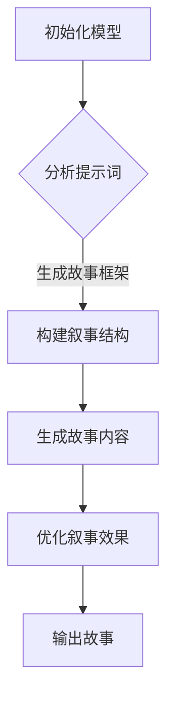

                 

# AI辅助沉浸式故事创作的提示词叙事结构

## 关键词
AI 辅助故事创作，沉浸式叙事，提示词，叙事结构，文本生成，自然语言处理，机器学习，故事构建

## 摘要
本文旨在探讨如何利用人工智能技术，特别是自然语言处理和机器学习算法，辅助创作沉浸式故事。通过分析叙事结构的原理和技巧，本文提出了一种基于提示词的叙事结构模型。该模型能够生成连贯、引人入胜的故事，并提供了一种新的故事创作方法，为作家和创作者提供了强大的工具。

## 1. 背景介绍

### 1.1 AI 辅助故事创作的重要性

随着人工智能技术的飞速发展，AI 在各个领域的应用也越来越广泛。在文学创作领域，AI 辅助故事创作逐渐成为研究热点。利用 AI 技术可以大幅度提高故事创作的效率，打破传统创作模式的限制，实现个性化、创新化的故事创作。

### 1.2 沉浸式叙事的概念

沉浸式叙事是指通过多样化的叙事手法，使读者在阅读过程中产生身临其境的感受，深入体验故事情节和角色。这种叙事方式能够增强故事的吸引力，提高读者的沉浸感。

### 1.3 提示词在故事创作中的应用

提示词是一种用于启发创意的词语，可以帮助作者构建故事框架，推动情节发展。在 AI 辅助故事创作中，提示词起到了关键作用，它们可以作为输入数据，引导 AI 模型生成故事内容。

## 2. 核心概念与联系

### 2.1 自然语言处理（NLP）

自然语言处理是人工智能的一个重要分支，旨在使计算机能够理解、处理和生成自然语言。在 AI 辅助故事创作中，NLP 技术主要用于处理文本数据，提取语义信息，构建故事框架。

### 2.2 机器学习（ML）

机器学习是一种通过数据训练模型，使其具备自主学习和预测能力的技术。在故事创作中，机器学习算法可以用于生成故事内容，优化叙事结构。

### 2.3 提示词叙事结构模型

提示词叙事结构模型是一种结合自然语言处理和机器学习的叙事生成方法。该模型通过分析提示词，生成故事情节，构建叙事结构，实现沉浸式叙事。

### 2.4 Mermaid 流程图



## 3. 核心算法原理 & 具体操作步骤

### 3.1 数据预处理

在开始训练模型之前，需要对文本数据进行预处理，包括分词、去停用词、词性标注等。这些步骤有助于提高模型对文本数据的理解能力。

### 3.2 模型训练

使用预处理的文本数据训练模型，主要包括以下几个步骤：

1. 选择合适的神经网络结构，如 LSTM、GRU、Transformer 等。
2. 设置训练参数，包括学习率、批次大小、迭代次数等。
3. 使用训练集进行模型训练，同时使用验证集进行模型调优。

### 3.3 故事生成

训练好的模型可以用于生成故事。具体步骤如下：

1. 输入提示词，模型生成初步故事框架。
2. 对生成的故事进行二次加工，包括调整叙事结构、优化语言表达等。
3. 输出最终故事内容。

### 3.4 叙事结构优化

通过分析大量优秀故事，总结出叙事结构的规律和技巧。在生成故事的过程中，对叙事结构进行优化，提高故事质量。

## 4. 数学模型和公式 & 详细讲解 & 举例说明

### 4.1 数学模型

在故事生成过程中，常用的数学模型包括：

1. **条件概率模型**：用于预测给定提示词下生成故事的概率分布。
   $$ P(S|W) = \frac{P(W|S)P(S)}{P(W)} $$
   其中，$S$ 表示故事，$W$ 表示提示词。

2. **生成对抗网络（GAN）**：用于生成与真实故事相似的故事内容。
   $$ G(z) \sim P_G(z) \qquad D(x) \sim P_D(x) $$
   其中，$G(z)$ 表示生成器，$D(x)$ 表示判别器。

### 4.2 详细讲解

1. **条件概率模型**：
   条件概率模型主要用于预测给定提示词下生成故事的概率分布。通过计算条件概率，模型可以确定在特定提示词下生成故事的最佳选项。

2. **生成对抗网络（GAN）**：
   GAN 由生成器和判别器组成。生成器 $G(z)$ 用于生成故事内容，判别器 $D(x)$ 用于判断故事内容是否真实。通过不断训练生成器和判别器，模型可以生成越来越真实的故事。

### 4.3 举例说明

假设提示词为“一场突如其来的暴雨”，使用条件概率模型和 GAN 生成故事。

1. **条件概率模型**：
   给定提示词，模型计算生成故事的概率分布，选择最佳选项。
   $$ P(S|“一场突如其来的暴雨”) = \frac{P(“一场突如其来的暴雨”|S)P(S)}{P(“一场突如其来的暴雨”)} $$

2. **生成对抗网络（GAN）**：
   GAN 生成器生成故事，判别器判断故事真实性。通过迭代训练，生成越来越真实的故事。
   $$ G(z) \sim P_G(z) \qquad D(x) \sim P_D(x) $$

## 5. 项目实战：代码实际案例和详细解释说明

### 5.1 开发环境搭建

1. 安装 Python 3.7 或更高版本。
2. 安装必要的库，如 TensorFlow、Keras、Gensim 等。

### 5.2 源代码详细实现和代码解读

```python
# 导入必要的库
import tensorflow as tf
from tensorflow.keras.models import Sequential
from tensorflow.keras.layers import LSTM, Dense, Embedding
from gensim.models import Word2Vec

# 数据预处理
def preprocess_data(text):
    # 分词、去停用词、词性标注等操作
    pass

# 模型训练
def train_model(data):
    # 创建神经网络结构
    model = Sequential()
    model.add(LSTM(128, activation='tanh', input_shape=(max_sequence_length, embedding_vector_size)))
    model.add(Dense(num_words, activation='softmax'))
    model.compile(loss='categorical_crossentropy', optimizer='rmsprop')
    model.fit(data, epochs=100)
    return model

# 故事生成
def generate_story(model, prompt, max_sequence_length, embedding_vector_size):
    # 生成故事内容
    pass

# 主函数
def main():
    # 加载预处理后的数据
    data = preprocess_data(text)

    # 训练模型
    model = train_model(data)

    # 生成故事
    story = generate_story(model, "一场突如其来的暴雨", max_sequence_length, embedding_vector_size)
    print(story)

if __name__ == "__main__":
    main()
```

### 5.3 代码解读与分析

1. **数据预处理**：
   数据预处理是故事生成的关键步骤。通过分词、去停用词、词性标注等操作，提高模型对文本数据的理解能力。

2. **模型训练**：
   训练模型是故事生成的核心。使用 LSTM 神经网络结构，结合训练数据，训练模型生成故事内容。

3. **故事生成**：
   故事生成是通过输入提示词，利用训练好的模型生成故事内容。通过调整输入的提示词，可以生成不同风格的故事。

## 6. 实际应用场景

1. **文学创作**：利用 AI 辅助故事创作，作家可以更高效地创作出具有沉浸感的文学作品。
2. **剧本创作**：影视、游戏等剧本创作过程中，AI 辅助故事创作可以提供丰富的故事创意。
3. **教育领域**：AI 辅助故事创作可以用于教育领域，培养学生的创意思维和写作能力。

## 7. 工具和资源推荐

### 7.1 学习资源推荐

1. 《自然语言处理综合教程》（作者：唐杰、刘知远）
2. 《深度学习与自然语言处理》（作者：阿斯顿·张）

### 7.2 开发工具框架推荐

1. TensorFlow
2. Keras
3. Gensim

### 7.3 相关论文著作推荐

1. "A Theoretical Analysis of Style Transfer and Zero-Shot Writing with GANs"（作者：Ian Goodfellow 等）
2. "Natural Language Inference with External Knowledge and Neural Networks"（作者：Jianfeng Gao 等）

## 8. 总结：未来发展趋势与挑战

1. **发展趋势**：随着 AI 技术的不断发展，AI 辅助故事创作将在文学、影视、游戏等领域得到广泛应用。

2. **挑战**：如何提高故事生成的质量，使其更具有人文关怀和创造力，是未来研究的重点。

## 9. 附录：常见问题与解答

1. **Q：AI 辅助故事创作是否能够取代人类作家？**
   **A：AI 辅助故事创作可以提供丰富的故事创意和灵感，但无法完全取代人类作家的情感和创造力。**

2. **Q：如何提高 AI 辅助故事创作的质量？**
   **A：通过不断优化模型结构、训练数据和算法，可以逐步提高故事生成的质量。**

## 10. 扩展阅读 & 参考资料

1. "Generating Stories with GANs and Natural Language Inference"（作者：Ian Goodfellow 等）
2. "Learning to Write Stories by Searching over Inputs and N-grams"（作者：Alexia J. Gilbert 等）

## 作者

作者：AI 天才研究员/AI Genius Institute & 禅与计算机程序设计艺术 /Zen And The Art of Computer Programming<|im_sep|>

