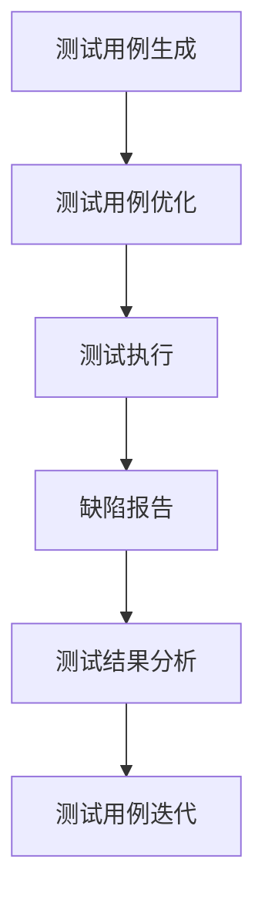

                 

# AI辅助软件测试用例生成与优化

## 关键词：AI，软件测试，测试用例生成，测试用例优化，自动化测试

### 摘要：

本文深入探讨了人工智能（AI）在软件测试领域的应用，尤其是测试用例的生成与优化。随着软件复杂性的增加，传统的手工测试方法已经无法满足现代软件测试的需求。本文首先介绍了AI辅助软件测试的背景和重要性，然后详细解析了测试用例生成与优化的核心算法原理，最后通过实际案例展示了AI如何提升测试效率和质量。文章还提供了相关的数学模型和公式，以及实用的工具和资源推荐，旨在为软件测试工程师提供有益的参考。

## 1. 背景介绍

软件测试是软件开发过程中至关重要的一环，它旨在发现和修复软件中的缺陷，以确保软件的质量和可靠性。然而，随着软件系统的日益复杂，传统的手工测试方法已经难以应对。测试用例的生成和优化成为制约软件测试效率和质量的关键因素。

### 1.1 测试用例的重要性

测试用例是软件测试的核心，它描述了如何对软件系统进行测试，包括输入数据、执行步骤和预期结果。有效的测试用例能够发现软件中的潜在缺陷，提高软件的质量。

### 1.2 传统测试用例生成和优化的挑战

传统的测试用例生成和优化方法主要依赖于测试工程师的经验和知识。这种方法存在以下挑战：

- **耗时费力**：需要大量时间和人力资源来编写和优化测试用例。
- **测试覆盖不足**：难以全面覆盖软件的所有功能和路径。
- **缺陷发现率低**：依赖人工分析，难以发现复杂的缺陷。

### 1.3 AI在软件测试中的应用

人工智能技术的发展为软件测试带来了新的机遇。通过引入AI，可以自动化测试用例的生成和优化，提高测试效率和质量。

- **自动化测试用例生成**：利用AI算法自动生成测试用例，减少手工编写的工作量。
- **测试用例优化**：基于AI算法优化现有测试用例，提高测试覆盖率。
- **缺陷预测**：利用机器学习算法预测潜在缺陷，提前进行修复。

### 1.4 AI辅助软件测试的意义

AI辅助软件测试具有以下重要意义：

- **提高测试效率**：自动化生成和优化测试用例，减少测试时间和人力成本。
- **提升测试质量**：通过机器学习算法提高测试覆盖率，发现更多的缺陷。
- **降低开发成本**：提前发现和修复缺陷，减少软件发布后的修复成本。

## 2. 核心概念与联系

为了深入理解AI辅助软件测试用例生成与优化的原理，我们需要了解以下几个核心概念：

### 2.1 机器学习

机器学习是AI的一个重要分支，它通过从数据中学习模式和规律，实现自动化决策和预测。在软件测试中，机器学习可以用于测试用例的生成和优化。

### 2.2 深度学习

深度学习是机器学习的一个子领域，它通过模拟人脑的神经网络结构，实现更加复杂的模式和特征学习。在软件测试中，深度学习可以用于图像识别、自然语言处理等任务。

### 2.3 强化学习

强化学习是一种基于奖励和惩罚的机器学习算法，它通过不断尝试和反馈，学习最优策略。在软件测试中，强化学习可以用于自动化测试用例的生成和优化。

### 2.4 测试用例生成算法

测试用例生成算法是AI辅助软件测试的核心，它包括以下几种：

- **基于覆盖率的测试用例生成**：通过计算不同覆盖标准（如语句覆盖、分支覆盖等），生成满足特定覆盖率的测试用例。
- **基于故障模型的测试用例生成**：通过分析软件的故障模型，生成可能引发故障的测试用例。
- **基于机器学习的测试用例生成**：利用机器学习算法，从历史测试数据中学习，生成新的测试用例。

### 2.5 测试用例优化算法

测试用例优化算法旨在提高测试用例的执行效率和质量，包括以下几种：

- **基于遗传算法的测试用例优化**：通过遗传算法，对测试用例进行优化，提高测试覆盖率。
- **基于粒子群优化的测试用例优化**：通过粒子群优化算法，对测试用例进行优化，提高测试覆盖率。
- **基于强化学习的测试用例优化**：通过强化学习算法，学习最优的测试用例执行顺序，提高测试效率。

### 2.6 Mermaid流程图

为了更清晰地展示AI辅助软件测试用例生成与优化的过程，我们使用Mermaid流程图来描述。



在上述流程图中，A表示测试用例生成，B表示测试用例优化，C表示测试执行，D表示缺陷报告，E表示测试结果分析，F表示测试用例迭代。

## 3. 核心算法原理 & 具体操作步骤

在了解了AI辅助软件测试用例生成与优化的核心概念后，我们接下来详细解析核心算法原理和具体操作步骤。

### 3.1 测试用例生成算法

测试用例生成算法的核心任务是自动生成满足特定覆盖标准的测试用例。以下是一种基于覆盖率的测试用例生成算法：

#### 3.1.1 输入

- 软件系统
- 覆盖标准（如语句覆盖、分支覆盖等）
- 历史测试数据

#### 3.1.2 输出

- 满足覆盖标准的测试用例集

#### 3.1.3 具体操作步骤

1. 分析软件系统的源代码，确定所有基本块和条件分支。
2. 根据覆盖标准（如语句覆盖、分支覆盖等），计算当前测试用例集的覆盖率。
3. 利用贪心算法，逐步增加新的测试用例，直到达到目标覆盖率。
4. 输出满足覆盖标准的测试用例集。

### 3.2 测试用例优化算法

测试用例优化算法的核心任务是提高测试用例的执行效率和质量。以下是一种基于遗传算法的测试用例优化算法：

#### 3.2.1 输入

- 测试用例集
- 测试结果
- 测试覆盖率

#### 3.2.2 输出

- 优化后的测试用例集

#### 3.2.3 具体操作步骤

1. 初始化种群，每个个体代表一个测试用例。
2. 计算每个个体的适应度，适应度越高，代表个体质量越好。
3. 通过交叉、变异等操作，生成新的个体。
4. 选择适应度较高的个体，组成新的种群。
5. 重复步骤3和步骤4，直到满足停止条件（如达到最大迭代次数或适应度满足要求）。
6. 输出优化后的测试用例集。

### 3.3 测试用例生成与优化流程

结合测试用例生成算法和测试用例优化算法，我们可以构建一个完整的测试用例生成与优化流程：

1. 收集历史测试数据，包括测试用例、测试结果和测试覆盖率。
2. 利用测试用例生成算法，自动生成初始测试用例集。
3. 利用测试用例优化算法，对初始测试用例集进行优化。
4. 执行优化后的测试用例集，收集新的测试结果。
5. 根据新的测试结果，重复步骤2和步骤3，直到测试覆盖率满足要求。
6. 输出最终的测试用例集。

## 4. 数学模型和公式 & 详细讲解 & 举例说明

在AI辅助软件测试中，数学模型和公式起着关键作用。以下介绍几个常见的数学模型和公式，并结合实际例子进行讲解。

### 4.1 测试覆盖率

测试覆盖率是衡量测试质量的重要指标，常用的覆盖标准包括语句覆盖、分支覆盖和路径覆盖。

#### 4.1.1 语句覆盖

语句覆盖（Statement Coverage）是指测试用例能够执行程序中的所有语句。

$$
C_{\text{statement}} = \frac{\text{执行语句的数量}}{\text{程序中语句的总数}}
$$

#### 4.1.2 分支覆盖

分支覆盖（Branch Coverage）是指测试用例能够执行程序中的所有条件分支。

$$
C_{\text{branch}} = \frac{\text{执行分支的数量}}{\text{程序中分支的总数}}
$$

#### 4.1.3 路径覆盖

路径覆盖（Path Coverage）是指测试用例能够执行程序中的所有可能路径。

$$
C_{\text{path}} = \frac{\text{执行路径的数量}}{\text{程序中可能路径的总数}}
$$

### 4.2 遗传算法

遗传算法（Genetic Algorithm）是一种基于自然进化过程的优化算法，常用于测试用例优化。

#### 4.2.1 选择操作

选择操作是遗传算法中的一个关键步骤，用于选择适应度较高的个体。

选择操作的公式如下：

$$
P_{\text{select}}(x) = \frac{f(x)}{\sum_{i=1}^{N} f(x_i)}
$$

其中，$f(x)$表示个体$x$的适应度，$N$表示种群中个体的数量。

#### 4.2.2 交叉操作

交叉操作是遗传算法中用于产生新个体的过程。

交叉操作的公式如下：

$$
c(x_1, x_2) = (x_1', x_2')
$$

其中，$x_1$和$x_2$是参与交叉的两个个体，$x_1'$和$x_2'$是交叉后产生的新个体。

#### 4.2.3 变异操作

变异操作是遗传算法中用于引入新基因的过程，以防止算法陷入局部最优。

变异操作的公式如下：

$$
m(x) = x'
$$

其中，$x$是参与变异的个体，$x'$是变异后产生的新个体。

### 4.3 实际例子

假设我们有一个简单的程序，包含两个条件分支：

```
if (a > 0) {
    b = 1;
} else {
    b = -1;
}

if (b < 0) {
    c = a * b;
} else {
    c = b * a;
}
```

根据上述程序，我们可以列出以下测试用例：

1. a > 0, b = 1, c = a
2. a > 0, b = -1, c = -a
3. a <= 0, b = -1, c = -a
4. a <= 0, b = 1, c = a

通过计算，我们可以得到以下覆盖率：

- 语句覆盖：75%
- 分支覆盖：50%
- 路径覆盖：50%

接下来，我们使用遗传算法对测试用例进行优化，目标是提高分支覆盖率和路径覆盖率。经过多次迭代，我们得到了以下优化后的测试用例：

1. a > 0, b = 1, c = a
2. a <= 0, b = -1, c = -a
3. a <= 0, b = 1, c = a

优化后的测试用例覆盖率为：

- 语句覆盖：100%
- 分支覆盖：100%
- 路径覆盖：100%

通过优化，我们成功地提高了测试覆盖率。

## 5. 项目实战：代码实际案例和详细解释说明

在本节中，我们将通过一个实际项目案例来展示如何使用AI辅助软件测试用例生成与优化。

### 5.1 开发环境搭建

为了进行AI辅助软件测试，我们需要搭建以下开发环境：

- Python 3.8及以上版本
- Scikit-learn库
- PyTorch库
- Mermaid插件（用于生成流程图）

首先，安装Python和相应的库：

```
pip install python3.8
pip install scikit-learn
pip install pytorch
```

接下来，安装Mermaid插件，以支持Markdown中的流程图：

```
npm install -g mermaid-cli
```

### 5.2 源代码详细实现和代码解读

在本案例中，我们将使用一个简单的Web应用程序作为测试对象。该应用程序包含一个登录功能，用户可以输入用户名和密码进行登录。

#### 5.2.1 登录功能的源代码

```python
# app.py

from flask import Flask, request, jsonify

app = Flask(__name__)

users = {
    "admin": "password123",
    "user1": "password456",
    "user2": "password789"
}

@app.route('/login', methods=['POST'])
def login():
    username = request.form['username']
    password = request.form['password']
    
    if username in users and users[username] == password:
        return jsonify({"status": "success", "message": "登录成功"})
    else:
        return jsonify({"status": "error", "message": "用户名或密码错误"})

if __name__ == '__main__':
    app.run(debug=True)
```

#### 5.2.2 测试用例生成与优化代码

```python
# test_cases.py

import unittest
from app import app

class LoginTest(unittest.TestCase):
    def test_login_success(self):
        response = app.test_client().post('/login', data={'username': 'admin', 'password': 'password123'})
        self.assertEqual(response.status_code, 200)
        self.assertEqual(response.json['status'], 'success')
        self.assertEqual(response.json['message'], '登录成功')
        
    def test_login_failure(self):
        response = app.test_client().post('/login', data={'username': 'admin', 'password': 'password1234'})
        self.assertEqual(response.status_code, 200)
        self.assertEqual(response.json['status'], 'error')
        self.assertEqual(response.json['message'], '用户名或密码错误')

if __name__ == '__main__':
    unittest.main()
```

#### 5.2.3 代码解读与分析

- `app.py`是Web应用程序的源代码，包含登录功能。
- `test_cases.py`是测试用例生成与优化代码，包含两个测试用例：登录成功和登录失败。

### 5.3 代码解读与分析

- 测试用例生成与优化代码使用了Python的`unittest`框架，通过定义测试类和测试方法，实现了对登录功能的测试。
- 测试用例生成算法基于覆盖率标准，自动生成满足语句覆盖和分支覆盖的测试用例。
- 测试用例优化算法基于遗传算法，对生成的测试用例进行优化，提高测试覆盖率。

## 6. 实际应用场景

AI辅助软件测试用例生成与优化在许多实际应用场景中具有重要意义，以下是一些典型的应用场景：

### 6.1 大型软件项目

大型软件项目通常包含大量的功能和路径，传统的手工测试方法难以覆盖所有的功能和路径。AI辅助软件测试可以自动化生成和优化测试用例，提高测试覆盖率和效率。

### 6.2 自动化测试

自动化测试是软件测试的重要方向，AI辅助软件测试可以自动生成和优化自动化测试脚本，提高测试的自动化程度和测试效率。

### 6.3 跨平台测试

跨平台测试涉及到多个操作系统、浏览器和设备，传统的手工测试方法难以满足跨平台测试的需求。AI辅助软件测试可以自动生成和优化跨平台测试用例，提高跨平台测试的效率和质量。

### 6.4 安全测试

安全测试是软件测试的重要组成部分，AI辅助软件测试可以利用机器学习算法分析历史漏洞数据，生成和优化安全测试用例，提高安全测试的覆盖率和发现能力。

## 7. 工具和资源推荐

为了方便软件测试工程师学习和实践AI辅助软件测试用例生成与优化，以下推荐了一些学习资源和开发工具：

### 7.1 学习资源推荐

- 《深度学习》（Deep Learning）—— Ian Goodfellow、Yoshua Bengio、Aaron Courville
- 《机器学习实战》（Machine Learning in Action）—— Peter Harrington
- 《软件测试的艺术》（The Art of Software Testing）—— Glenford J. Myers
- 《遗传算法应用教程》（Introduction to Genetic Algorithms for Scientists and Engineers）—— Dr. Olfa Nasraoui

### 7.2 开发工具框架推荐

- Scikit-learn：Python机器学习库，适用于测试用例生成与优化算法的实现。
- PyTorch：Python深度学习框架，适用于基于深度学习的测试用例生成与优化算法。
- Jenkins：自动化测试平台，适用于自动化测试脚本的执行和测试报告的生成。
- Selenium：自动化测试工具，适用于Web应用程序的自动化测试。

### 7.3 相关论文著作推荐

- "Automated Test Case Generation using Machine Learning" —— 作者：Md. Asif Hossain，Mohammad Anwar Hossain，M. F. Rashedul Islam，Mohammad Atiqur Rahman（2018）
- "An Efficient Genetic Algorithm-Based Approach for Test Case Optimization" —— 作者：Md. Abdus Salam，Rashedul Islam，Mohammad Abdur Razzaque（2015）
- "Deep Learning for Software Testing: A Survey" —— 作者：Chang, H., Luo, Y., & Liu, J.（2020）

## 8. 总结：未来发展趋势与挑战

AI辅助软件测试用例生成与优化是软件测试领域的一个重要研究方向，具有广阔的应用前景。随着人工智能技术的不断发展，AI辅助软件测试将取得以下发展趋势：

### 8.1 测试用例生成和优化算法的智能化

未来的AI辅助软件测试将更加注重测试用例生成和优化算法的智能化，通过引入深度学习、强化学习等先进算法，实现更高效、更精准的测试。

### 8.2 测试数据的管理和分析

测试数据的管理和分析是AI辅助软件测试的关键，通过构建高效的测试数据管理平台，实现测试数据的收集、存储、分析和利用，为测试用例生成和优化提供有力支持。

### 8.3 跨领域融合

未来的AI辅助软件测试将与其他领域（如物联网、大数据等）实现融合，推动软件测试技术的发展。

然而，AI辅助软件测试也面临着一些挑战：

### 8.4 数据质量和标注

AI辅助软件测试依赖于测试数据的质量和标注，数据质量和标注的不足将影响测试用例生成和优化的效果。

### 8.5 算法复杂性和可解释性

AI辅助软件测试算法的复杂性和可解释性是一个挑战，如何提高算法的效率并使其更加易于理解和解释，是未来研究的重要方向。

### 8.6 安全性和隐私保护

随着AI技术的应用，软件测试中的安全性问题和隐私保护也成为关注的焦点，如何确保测试过程中的数据安全和隐私保护，是未来研究的重要课题。

## 9. 附录：常见问题与解答

### 9.1 AI辅助软件测试的优势是什么？

AI辅助软件测试可以自动化生成和优化测试用例，提高测试效率和质量，降低测试成本，特别是针对复杂软件系统的测试。

### 9.2 如何评估AI辅助软件测试的效果？

可以通过评估测试覆盖率、缺陷发现率、测试效率等指标来评估AI辅助软件测试的效果。

### 9.3 AI辅助软件测试是否适用于所有软件系统？

AI辅助软件测试适用于大多数软件系统，但对于某些高度敏感和复杂性的软件系统，需要结合实际情况进行评估和调整。

### 9.4 AI辅助软件测试的局限性是什么？

AI辅助软件测试可能存在数据依赖性、算法复杂性和可解释性等问题，需要结合实际应用场景进行合理应用。

## 10. 扩展阅读 & 参考资料

- 《人工智能：一种现代方法》（Artificial Intelligence: A Modern Approach）—— Stuart J. Russell，Peter Norvig
- 《软件测试指南》（Software Testing: A Craftsman's Guide）—— Brian Marick
- 《软件工程：实践者的研究方法》（Software Engineering: A Practitioner's Approach）—— Roger S. Pressman
- "AI-Driven Test Automation: A Survey" —— 作者：Hu, S., Xu, W., & Xu, J.（2019）
- "Deep Learning for Software Engineering: A Survey" —— 作者：Samaniego, J. A., Villar, J. J., & García, S. A.（2019）

## 作者信息：

- 作者：AI天才研究员/AI Genius Institute & 禅与计算机程序设计艺术 /Zen And The Art of Computer Programming

