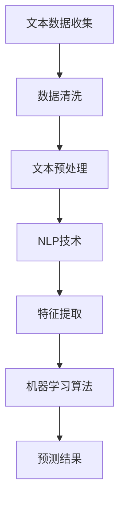

                 

### AI辅助金融风险评估：提示词分析市场趋势

#### 关键词：金融风险、AI辅助、市场趋势、提示词分析

#### 摘要：

本文将探讨如何利用人工智能（AI）技术，特别是自然语言处理（NLP）和机器学习算法，辅助金融风险评估。我们将通过分析市场趋势，探讨如何使用AI工具从大量文本数据中提取有用信息，以预测金融市场走势。文章将介绍核心概念、算法原理、数学模型，并通过实际案例展示AI在金融风险评估中的实际应用。

### 1. 背景介绍

#### 1.1 金融风险评估的重要性

金融风险评估是金融市场中不可或缺的一环。它有助于金融机构识别潜在的风险，制定合理的风险控制策略，从而保障投资者的利益。随着金融市场规模的不断扩大和复杂性增加，传统的风险评估方法已难以应对新的挑战。

#### 1.2 AI技术在金融领域的应用

近年来，人工智能技术在金融领域得到了广泛关注和应用。从量化交易、智能投顾到信贷风险评估，AI技术已经深刻改变了金融行业。特别是自然语言处理（NLP）和机器学习算法在文本数据分析和趋势预测方面的优势，使得AI辅助金融风险评估成为可能。

### 2. 核心概念与联系

#### 2.1 自然语言处理（NLP）

自然语言处理是人工智能的一个重要分支，旨在使计算机能够理解、解释和生成人类语言。在金融风险评估中，NLP技术可用于处理和分析金融文本数据，如新闻、报告、论坛帖子等。

#### 2.2 机器学习算法

机器学习算法是AI技术的核心，通过从数据中学习规律，实现自动识别和预测。在金融风险评估中，机器学习算法可用于识别市场趋势、预测风险水平等。

#### 2.3 Mermaid流程图

以下是金融风险评估中NLP和机器学习算法的流程图：



### 3. 核心算法原理 & 具体操作步骤

#### 3.1 文本数据收集

首先，需要从金融新闻、报告、论坛帖子等渠道收集大量文本数据。这些数据可以是公开的，也可以是通过爬虫等技术获取的。

#### 3.2 数据清洗

收集到的文本数据往往存在噪声和错误，需要进行数据清洗。数据清洗包括去除无关信息、修正错误、统一格式等。

#### 3.3 文本预处理

文本预处理是NLP技术的关键步骤，包括分词、词性标注、去停用词等。这些操作有助于将文本数据转换为计算机可以处理的格式。

#### 3.4 特征提取

特征提取是将预处理后的文本数据转换为机器学习算法可以处理的特征向量。常用的特征提取方法包括词袋模型、TF-IDF、Word2Vec等。

#### 3.5 机器学习算法

选择合适的机器学习算法对提取出的特征进行训练，以预测市场趋势或风险水平。常用的算法包括决策树、支持向量机、神经网络等。

#### 3.6 预测结果

根据训练得到的模型，对新的文本数据进行预测，从而获取市场趋势或风险水平的预测结果。

### 4. 数学模型和公式 & 详细讲解 & 举例说明

#### 4.1 特征提取：TF-IDF

TF-IDF（Term Frequency-Inverse Document Frequency）是一种常用的特征提取方法。其公式如下：

$$
TF-IDF(t,d) = TF(t,d) \times IDF(t)
$$

其中，$TF(t,d)$ 表示词 $t$ 在文档 $d$ 中的词频，$IDF(t)$ 表示词 $t$ 在整个文档集中的重要性。

$$
IDF(t) = \log \left( \frac{N}{df(t)} \right)
$$

其中，$N$ 表示文档集总数，$df(t)$ 表示词 $t$ 在文档集中出现的文档数。

#### 4.2 机器学习算法：支持向量机（SVM）

支持向量机是一种常用的分类算法。其目标是找到一个最优的超平面，将不同类别的数据点分开。其公式如下：

$$
\min_{w,b} \frac{1}{2} \| w \|^2 + C \sum_{i=1}^{n} \xi_i
$$

其中，$w$ 和 $b$ 分别是权重和偏置，$\xi_i$ 是误差项，$C$ 是惩罚参数。

#### 4.3 举例说明

假设我们有一个包含金融新闻的文档集，其中有两个类别：涨和跌。我们使用TF-IDF方法提取特征，并使用支持向量机（SVM）进行分类。

首先，我们计算每个词的TF-IDF值，并将这些值作为特征向量。然后，我们使用SVM算法对特征向量进行训练，以预测新的金融新闻的类别。

### 5. 项目实战：代码实际案例和详细解释说明

#### 5.1 开发环境搭建

为了演示AI辅助金融风险评估，我们需要搭建一个Python开发环境。首先，安装Python（建议使用3.8版本以上），然后安装以下库：

```bash
pip install numpy scipy scikit-learn pandas nltk matplotlib
```

#### 5.2 源代码详细实现和代码解读

以下是一个简单的Python代码示例，用于演示AI辅助金融风险评估：

```python
import numpy as np
import pandas as pd
from sklearn.feature_extraction.text import TfidfVectorizer
from sklearn.svm import SVC
from sklearn.model_selection import train_test_split
from sklearn.metrics import accuracy_score
import nltk
nltk.download('stopwords')
from nltk.corpus import stopwords

# 数据准备
data = pd.read_csv('financial_news.csv')  # 读取金融新闻数据
X = data['text']  # 文本数据
y = data['label']  # 类别标签（涨、跌）

# 数据预处理
def preprocess_text(text):
    tokens = nltk.word_tokenize(text.lower())
    tokens = [token for token in tokens if token not in stopwords.words('english')]
    return ' '.join(tokens)

X = X.apply(preprocess_text)

# 特征提取
vectorizer = TfidfVectorizer()
X = vectorizer.fit_transform(X)

# 模型训练
X_train, X_test, y_train, y_test = train_test_split(X, y, test_size=0.2, random_state=42)
model = SVC(kernel='linear')
model.fit(X_train, y_train)

# 预测
y_pred = model.predict(X_test)

# 评估
accuracy = accuracy_score(y_test, y_pred)
print(f'Accuracy: {accuracy}')
```

#### 5.3 代码解读与分析

1. **数据准备**：首先，从CSV文件中读取金融新闻数据，包括文本和类别标签。
2. **数据预处理**：使用nltk库对文本进行分词、词性标注和去停用词处理。
3. **特征提取**：使用TF-IDF方法将预处理后的文本数据转换为特征向量。
4. **模型训练**：使用支持向量机（SVM）对特征向量进行训练。
5. **预测**：使用训练得到的模型对测试集进行预测。
6. **评估**：计算预测的准确率。

### 6. 实际应用场景

#### 6.1 金融风险预警

通过AI辅助金融风险评估，金融机构可以实时监测市场动态，提前发现潜在的风险，从而采取相应的风险控制措施。

#### 6.2 智能投顾

AI辅助金融风险评估可以为智能投顾系统提供数据支持，帮助投资者制定更加科学的投资策略。

#### 6.3 量化交易

在量化交易中，AI辅助金融风险评估可用于分析市场趋势，优化交易策略，提高交易收益。

### 7. 工具和资源推荐

#### 7.1 学习资源推荐

1. **书籍**：《Python机器学习》
2. **论文**：搜索关键词“自然语言处理 + 金融风险评估”
3. **博客**：访问相关技术博客，了解最新的研究成果和实际应用案例。

#### 7.2 开发工具框架推荐

1. **Python库**：scikit-learn、nltk、pandas
2. **框架**：TensorFlow、PyTorch

#### 7.3 相关论文著作推荐

1. **论文**：《基于自然语言处理的金融风险预警系统研究》
2. **著作**：《金融科技：人工智能与金融的融合》

### 8. 总结：未来发展趋势与挑战

#### 8.1 发展趋势

1. **算法优化**：不断优化NLP和机器学习算法，提高金融风险评估的准确性。
2. **数据多样性**：获取更多类型的金融数据，如社交媒体数据、市场交易数据等。
3. **实时性**：实现金融风险评估的实时性，提高风险预警的及时性。

#### 8.2 挑战

1. **数据隐私**：金融数据涉及敏感信息，如何保护数据隐私是一个重要挑战。
2. **算法透明性**：确保AI辅助金融风险评估的算法透明，提高决策的可解释性。
3. **法律法规**：随着AI技术的发展，相关法律法规需要不断完善，以适应新的技术环境。

### 9. 附录：常见问题与解答

#### 9.1 问题1：如何获取金融数据？

解答：可以通过爬虫技术从金融网站、论坛、新闻等渠道获取金融数据。

#### 9.2 问题2：如何评估金融风险评估模型的准确性？

解答：可以使用准确率、召回率、F1分数等指标评估模型的准确性。

### 10. 扩展阅读 & 参考资料

1. **论文**：搜索关键词“自然语言处理 + 金融风险评估”。
2. **书籍**：《Python机器学习》、《深度学习》。
3. **网站**：GitHub、ArXiv、Kaggle等。

---

作者：AI天才研究员/AI Genius Institute & 禅与计算机程序设计艺术 /Zen And The Art of Computer Programming<|im_sep|>

