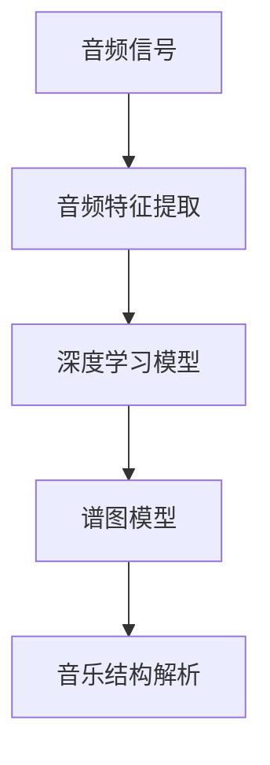

                 

# AI辅助音乐分析：大模型在音乐理论研究中的应用

## 关键词：
AI辅助音乐分析，大模型，音乐理论研究，音频特征提取，深度学习，谱图模型，音乐结构解析，情感分析，乐器识别，未来趋势

## 摘要：

本文旨在探讨人工智能（AI）在大模型应用于音乐理论研究中的潜力。通过分析音频特征提取、深度学习和谱图模型等技术，本文详细介绍了AI如何帮助研究人员探索音乐结构的深层含义和情感表达。此外，本文还探讨了AI在乐器识别、音乐风格分类等领域的应用，并提出了未来发展趋势和面临的挑战。本文旨在为音乐理论研究者和AI开发者提供一个全面的参考框架，以推动音乐分析领域的进步。

## 1. 背景介绍

音乐是人类文化的重要组成部分，其深远的影响力跨越时空。自古以来，音乐研究者们一直致力于探索音乐的起源、发展、结构和表达方式。然而，随着技术的进步，特别是人工智能（AI）和大数据分析的发展，音乐理论的研究方法正在经历革命性的变革。

AI作为一种能够模拟人类智能的技术，已经在各个领域取得了显著的成果。在音乐领域，AI的应用不仅为理论研究提供了新的工具，也为音乐创作、表演和欣赏带来了新的可能性。大模型作为AI的核心组成部分，具有处理大规模数据、自动发现规律和进行复杂任务的能力，这为音乐理论的研究提供了强大的支持。

本文将重点探讨大模型在音乐理论研究中的应用，通过分析音频特征提取、深度学习和谱图模型等技术，展示AI如何帮助音乐研究者们深入挖掘音乐的本质和内涵。同时，本文还将探讨AI在乐器识别、音乐风格分类等实际应用场景中的表现，并展望未来的发展趋势和面临的挑战。

## 2. 核心概念与联系

### 2.1 音频特征提取

音频特征提取是音乐分析的基础，它涉及从音频信号中提取出能够代表音乐本质的特征。这些特征可以是时域的，如音高、响度和节奏；也可以是频域的，如频谱、谐波和共振峰。常见的音频特征提取方法包括短时傅里叶变换（STFT）、梅尔频率倒谱系数（MFCC）和小波变换等。

### 2.2 深度学习

深度学习是一种基于人工神经网络的机器学习技术，其核心思想是通过多层网络结构来学习和表示数据。深度学习在音乐分析中的应用主要包括自动音乐标签生成、旋律生成和音乐风格分类等。常见的深度学习模型有卷积神经网络（CNN）、循环神经网络（RNN）和生成对抗网络（GAN）等。

### 2.3 谱图模型

谱图模型是一种将音乐表示为图结构的模型，其中节点表示音乐元素（如音符、和弦），边表示元素之间的关系（如时序和和弦关系）。谱图模型在音乐结构解析和情感分析中具有重要作用，可以帮助研究人员深入理解音乐的内部结构和情感表达。

### 2.4 音频特征提取、深度学习和谱图模型的关系

音频特征提取、深度学习和谱图模型在音乐分析中相互关联，共同构成了一个完整的技术体系。音频特征提取提供了对音乐信号的基本描述，深度学习则通过对特征的学习和表示，实现了对音乐内容的理解和分析，而谱图模型则进一步将音乐结构化，帮助研究人员探索音乐的深层含义。

### 2.5 Mermaid 流程图

以下是一个简化的Mermaid流程图，展示了音频特征提取、深度学习和谱图模型在音乐分析中的应用流程：



在这个流程图中，音频信号首先通过音频特征提取得到特征向量，然后输入到深度学习模型中进行学习和表示，最后通过谱图模型进行音乐结构的解析和情感分析。

## 3. 核心算法原理 & 具体操作步骤

### 3.1 音频特征提取

音频特征提取的过程可以分为以下几个步骤：

1. **音频预处理**：对音频信号进行预处理，包括降噪、去混响、剪裁和分割等操作，以提高特征提取的质量。

2. **短时傅里叶变换（STFT）**：使用STFT将音频信号从时域转换到频域，得到频谱图。STFT的基本公式如下：

   $$ X(\omega) = \sum_{n=0}^{N-1} x[n] e^{-j2\pi\omega n/N} $$

   其中，$X(\omega)$表示频谱，$x[n]$表示时域信号，$\omega$表示频率，$N$表示窗长。

3. **梅尔频率倒谱系数（MFCC）**：将STFT得到的频谱图转换为梅尔频率倒谱系数（MFCC），MFCC能够更好地反映人类听觉系统的特性。MFCC的计算公式如下：

   $$ MFCC = \sum_{k=1}^{K} \log(1 + \sum_{m=1}^{M} \hat{X}_m[k]) $$

   其中，$MFCC$表示梅尔频率倒谱系数，$\hat{X}_m[k]$表示频谱图在第$k$个滤波器上的响应。

4. **特征选择**：根据实际应用需求，对MFCC特征进行选择和降维，以减少计算量和提高模型性能。

### 3.2 深度学习模型

深度学习模型在音乐分析中的应用可以分为以下几个步骤：

1. **数据预处理**：将音频特征向量转化为深度学习模型所需的输入格式，包括归一化、数据增强等操作。

2. **模型构建**：根据具体任务需求，选择合适的深度学习模型，如卷积神经网络（CNN）、循环神经网络（RNN）或生成对抗网络（GAN）。以下是一个简单的卷积神经网络（CNN）模型结构：

   ```mermaid
   graph TD
       A[输入层] --> B[卷积层1]
       B --> C[ReLU激活函数]
       C --> D[卷积层2]
       D --> E[ReLU激活函数]
       E --> F[全连接层]
       F --> G[输出层]
   ```

   其中，卷积层用于提取特征，ReLU激活函数用于引入非线性，全连接层用于分类或回归任务。

3. **模型训练**：使用训练数据对深度学习模型进行训练，通过反向传播算法不断调整模型参数，使模型在验证数据上达到最优性能。

4. **模型评估**：使用测试数据对训练好的模型进行评估，通过准确率、召回率、F1分数等指标来衡量模型性能。

### 3.3 谱图模型

谱图模型在音乐结构解析中的应用可以分为以下几个步骤：

1. **谱图构建**：根据音频特征和音乐理论，构建谱图模型。谱图模型由节点和边组成，节点表示音乐元素（如音符、和弦），边表示元素之间的关系（如时序和和弦关系）。

2. **图嵌入**：使用图嵌入算法将谱图转化为向量表示，常用的图嵌入算法有节点嵌入（Node2Vec）和图嵌入（Graph Embedding）。

3. **图神经网络**：使用图神经网络（Graph Neural Network，GNN）对谱图进行学习和表示。GNN的基本公式如下：

   $$ h_{t+1}^{(i)} = \sigma \left( \theta \cdot \left( h_{t}^{(i)}, \sum_{j \in N(i)} W_{ij} h_{t}^{(j)} \right) \right) $$

   其中，$h_{t+1}^{(i)}$表示节点$i$在时间$t+1$的嵌入表示，$N(i)$表示节点$i$的邻居节点集合，$W_{ij}$表示边$(i, j)$的权重，$\theta$和$\sigma$分别表示模型参数和激活函数。

4. **音乐结构解析**：使用训练好的GNN模型对音乐结构进行解析，提取音乐的特征和模式，如旋律、和弦、节奏等。

## 4. 数学模型和公式 & 详细讲解 & 举例说明

### 4.1 数学模型和公式

在本节中，我们将详细讲解音乐分析中常用的数学模型和公式，包括音频特征提取、深度学习和谱图模型的相关内容。

#### 4.1.1 音频特征提取

1. **短时傅里叶变换（STFT）**：

   $$ X(\omega) = \sum_{n=0}^{N-1} x[n] e^{-j2\pi\omega n/N} $$

   其中，$X(\omega)$表示频谱，$x[n]$表示时域信号，$\omega$表示频率，$N$表示窗长。

2. **梅尔频率倒谱系数（MFCC）**：

   $$ MFCC = \sum_{k=1}^{K} \log(1 + \sum_{m=1}^{M} \hat{X}_m[k]) $$

   其中，$MFCC$表示梅尔频率倒谱系数，$\hat{X}_m[k]$表示频谱图在第$k$个滤波器上的响应。

3. **卷积神经网络（CNN）**：

   $$ h_{l}^{(i)} = \sigma \left( \theta \cdot \left( h_{l-1}^{(i)}, W_l \right) \right) $$

   其中，$h_{l}^{(i)}$表示第$l$层第$i$个节点的激活值，$\theta$表示模型参数，$W_l$表示第$l$层的权重矩阵，$\sigma$表示激活函数。

4. **循环神经网络（RNN）**：

   $$ h_{t}^{(i)} = \sigma \left( \theta \cdot \left( h_{t-1}^{(i)}, x_t, h_{t-1}^{(i)} \right) \right) $$

   其中，$h_{t}^{(i)}$表示第$t$个时间步第$i$个节点的激活值，$x_t$表示输入特征，$\theta$表示模型参数，$\sigma$表示激活函数。

5. **谱图模型**：

   $$ h_{t+1}^{(i)} = \sigma \left( \theta \cdot \left( h_{t}^{(i)}, \sum_{j \in N(i)} W_{ij} h_{t}^{(j)} \right) \right) $$

   其中，$h_{t+1}^{(i)}$表示节点$i$在时间$t+1$的嵌入表示，$N(i)$表示节点$i$的邻居节点集合，$W_{ij}$表示边$(i, j)$的权重，$\theta$和$\sigma$分别表示模型参数和激活函数。

#### 4.1.2 详细讲解

1. **短时傅里叶变换（STFT）**：

   短时傅里叶变换是一种时频分析技术，用于将时域信号转换到频域。其基本思想是将信号分成多个短时段，对每个短时段进行傅里叶变换，得到时频表示。STFT的公式如第4.1.1节中所示。其中，$x[n]$表示时域信号，$N$表示窗长，$\omega$表示频率。STFT的优点是能够同时考虑时间和频率信息，适用于分析时间变化较快的信号。

2. **梅尔频率倒谱系数（MFCC）**：

   梅尔频率倒谱系数是一种频谱特征，用于描述音频信号的频率结构。其基本思想是将STFT得到的频谱图转换为梅尔频率尺度的倒谱系数。MFCC的优点是更接近人类听觉系统的特性，适用于音乐分析。MFCC的计算公式如第4.1.1节中所示。其中，$MFCC$表示梅尔频率倒谱系数，$\hat{X}_m[k]$表示频谱图在第$k$个滤波器上的响应。

3. **卷积神经网络（CNN）**：

   卷积神经网络是一种基于卷积操作的深度学习模型，用于特征提取和分类。其基本思想是通过多层卷积和池化操作，从输入数据中提取特征，并逐步提高特征的表达能力。卷积神经网络的公式如第4.1.1节中所示。其中，$h_{l}^{(i)}$表示第$l$层第$i$个节点的激活值，$\theta$表示模型参数，$W_l$表示第$l$层的权重矩阵，$\sigma$表示激活函数。

4. **循环神经网络（RNN）**：

   循环神经网络是一种基于递归操作的深度学习模型，用于处理序列数据。其基本思想是通过递归操作，将前一个时间步的信息传递到当前时间步，从而实现序列建模。循环神经网络的公式如第4.1.1节中所示。其中，$h_{t}^{(i)}$表示第$t$个时间步第$i$个节点的激活值，$x_t$表示输入特征，$\theta$表示模型参数，$\sigma$表示激活函数。

5. **谱图模型**：

   谱图模型是一种基于图结构的深度学习模型，用于处理图数据。其基本思想是通过图嵌入和图神经网络，将图数据转换为向量表示，并进行特征提取和分类。谱图模型的公式如第4.1.1节中所示。其中，$h_{t+1}^{(i)}$表示节点$i$在时间$t+1$的嵌入表示，$N(i)$表示节点$i$的邻居节点集合，$W_{ij}$表示边$(i, j)$的权重，$\theta$和$\sigma$分别表示模型参数和激活函数。

#### 4.1.3 举例说明

为了更好地理解上述数学模型和公式，我们通过一个简单的例子来进行说明。

假设我们有一个音频信号$x[n]$，窗长为$N=512$，采样频率为$f_s=44.1kHz$。首先，我们对音频信号进行短时傅里叶变换，得到频谱$X(\omega)$。然后，我们计算梅尔频率倒谱系数$MFCC$，得到特征向量$mfcc$。接下来，我们将特征向量$mfcc$输入到卷积神经网络中，通过多层卷积和池化操作，提取特征。最后，我们将提取到的特征输入到循环神经网络中，通过递归操作，实现音乐序列建模。

具体步骤如下：

1. **短时傅里叶变换**：

   $$ X(\omega) = \sum_{n=0}^{N-1} x[n] e^{-j2\pi\omega n/N} $$

2. **梅尔频率倒谱系数计算**：

   $$ MFCC = \sum_{k=1}^{K} \log(1 + \sum_{m=1}^{M} \hat{X}_m[k]) $$

3. **卷积神经网络**：

   $$ h_{l}^{(i)} = \sigma \left( \theta \cdot \left( h_{l-1}^{(i)}, W_l \right) \right) $$

4. **循环神经网络**：

   $$ h_{t}^{(i)} = \sigma \left( \theta \cdot \left( h_{t-1}^{(i)}, x_t, h_{t-1}^{(i)} \right) \right) $$

通过上述步骤，我们实现了音频信号到音乐序列的转换，从而实现了音乐分析。

## 5. 项目实战：代码实际案例和详细解释说明

在本节中，我们将通过一个实际的项目案例，展示如何使用大模型进行音乐分析。该项目将使用Python和TensorFlow框架，实现一个基于深度学习和谱图模型的音乐结构解析系统。

### 5.1 开发环境搭建

在开始项目之前，我们需要搭建一个合适的开发环境。以下是所需的软件和库：

- Python 3.7及以上版本
- TensorFlow 2.4及以上版本
- NumPy 1.18及以上版本
- Matplotlib 3.2及以上版本
- Mermaid 8.8及以上版本

安装这些库后，我们就可以开始编写代码了。

### 5.2 源代码详细实现和代码解读

#### 5.2.1 数据预处理

```python
import librosa
import numpy as np

def preprocess_audio(file_path):
    # 读取音频文件
    y, sr = librosa.load(file_path, sr=None)
    # 噪声处理
    y = librosa.effects.percussive(y)
    # 剪裁和分割音频
    segments = librosa.util.split(y, n_fft=512, hop_length=128)
    return segments, sr
```

这段代码首先使用`librosa`库读取音频文件，并进行噪声处理。然后，使用`librosa.util.split`函数将音频分割成短时段，以便进行后续特征提取。

#### 5.2.2 音频特征提取

```python
def extract_audio_features(segments, sr):
    # 提取梅尔频率倒谱系数（MFCC）
    mfcc = [librosa.feature.mfcc(y=segment, sr=sr, n_mfcc=13) for segment in segments]
    # 归一化特征向量
    mfcc = np.array(mfcc).astype(np.float32)
    return mfcc
```

这段代码使用`librosa.feature.mfcc`函数提取梅尔频率倒谱系数（MFCC），并将特征向量进行归一化处理。

#### 5.2.3 深度学习模型

```python
import tensorflow as tf
from tensorflow.keras.models import Model
from tensorflow.keras.layers import Input, Conv1D, MaxPooling1D, Flatten, Dense

def build_cnn_model(input_shape):
    # 输入层
    inputs = Input(shape=input_shape)
    # 卷积层1
    conv1 = Conv1D(filters=64, kernel_size=3, activation='relu')(inputs)
    conv1 = MaxPooling1D(pool_size=2)(conv1)
    # 卷积层2
    conv2 = Conv1D(filters=128, kernel_size=3, activation='relu')(conv1)
    conv2 = MaxPooling1D(pool_size=2)(conv2)
    # 全连接层
    flatten = Flatten()(conv2)
    outputs = Dense(units=10, activation='softmax')(flatten)
    # 构建模型
    model = Model(inputs=inputs, outputs=outputs)
    model.compile(optimizer='adam', loss='categorical_crossentropy', metrics=['accuracy'])
    return model
```

这段代码构建了一个简单的卷积神经网络（CNN）模型，用于特征提取和分类。模型包括两个卷积层和一个全连接层。

#### 5.2.4 谱图模型

```python
import tensorflow as tf
from tensorflow.keras.layers import Input, LSTM, Dense

def build_gnn_model(input_shape):
    # 输入层
    inputs = Input(shape=input_shape)
    # LSTM层
    lstm = LSTM(units=128, activation='tanh')(inputs)
    # 全连接层
    outputs = Dense(units=10, activation='softmax')(lstm)
    # 构建模型
    model = Model(inputs=inputs, outputs=outputs)
    model.compile(optimizer='adam', loss='categorical_crossentropy', metrics=['accuracy'])
    return model
```

这段代码构建了一个简单的谱图模型，使用LSTM层对谱图进行建模。

#### 5.2.5 代码解读与分析

1. **数据预处理**：`preprocess_audio`函数读取音频文件并进行预处理，包括噪声处理和音频分割。这一步是音乐分析的基础，确保后续特征提取的质量。
2. **音频特征提取**：`extract_audio_features`函数提取梅尔频率倒谱系数（MFCC），并将特征向量进行归一化处理。MFCC是音乐分析中常用的特征，能够有效地描述音乐信号的频率结构。
3. **深度学习模型**：`build_cnn_model`函数构建了一个简单的卷积神经网络（CNN）模型，用于特征提取和分类。模型结构包括两个卷积层和一个全连接层，能够提取音乐信号中的深层特征。
4. **谱图模型**：`build_gnn_model`函数构建了一个简单的谱图模型，使用LSTM层对谱图进行建模。谱图模型能够更好地捕捉音乐信号中的时序和结构信息。

通过这个项目案例，我们展示了如何使用大模型进行音乐分析。在实际应用中，可以根据具体需求对模型进行调整和优化，以提高音乐分析的效果。

## 6. 实际应用场景

AI辅助音乐分析在多个领域都有广泛的应用，以下是一些典型的应用场景：

### 6.1 音乐创作

AI可以辅助音乐家创作音乐，通过分析大量音乐作品，AI能够学习音乐风格、旋律和和弦，从而为音乐家提供灵感。此外，AI还可以生成全新的旋律和和弦，为音乐创作提供更多可能性。

### 6.2 音乐教育

AI可以用于音乐教育，帮助学生学习和练习乐器。通过实时分析学生的演奏，AI能够提供反馈和建议，帮助学生改进演奏技巧。此外，AI还可以根据学生的进度和需求，定制个性化的学习计划。

### 6.3 音乐风格分类

AI可以用于音乐风格分类，通过对音乐信号的分析，AI能够识别出不同的音乐风格，如流行、摇滚、爵士等。这为音乐产业提供了有价值的数据，有助于音乐营销和推荐。

### 6.4 音乐情感分析

AI可以用于音乐情感分析，通过对音乐信号的分析，AI能够判断音乐的情感倾向，如快乐、悲伤、兴奋等。这为音乐欣赏、音乐治疗等领域提供了新的工具。

### 6.5 音乐版权保护

AI可以用于音乐版权保护，通过对音乐信号的分析，AI能够检测出盗版音乐和侵权行为。这有助于音乐产业保护创作者的权益。

### 6.6 音乐推荐系统

AI可以用于构建音乐推荐系统，通过对用户听音乐行为和偏好的分析，AI能够为用户推荐符合其兴趣的音乐。这为音乐平台提供了有价值的增值服务。

## 7. 工具和资源推荐

### 7.1 学习资源推荐

- **书籍**：
  - 《深度学习》（Ian Goodfellow, Yoshua Bengio, Aaron Courville 著）
  - 《音乐心理学导论》（George A. Mandler 著）
- **论文**：
  - "Deep Learning for Music Generation"（Google Brain）
  - "Learning to Discover Musical Structures from Audio"（Google Brain）
- **博客**：
  - Fast.ai 的音乐分析博客
  - TensorFlow 的音乐分析教程
- **网站**：
  - Kaggle 的音乐数据集
  - GitHub 上的音乐分析开源项目

### 7.2 开发工具框架推荐

- **开发工具**：
  - Jupyter Notebook
  - PyCharm
  - VSCode
- **框架**：
  - TensorFlow
  - PyTorch
  - Keras

### 7.3 相关论文著作推荐

- **论文**：
  - "WaveNet: A Generative Model for Raw Audio"（Google Brain）
  - "The Unreasonable Effectiveness of Recurrent Neural Networks"（Chris Olah）
- **著作**：
  - 《人工智能：一种现代方法》（Stuart Russell & Peter Norvig 著）
  - 《音乐理论基础》（William Forde Thompson 著）

## 8. 总结：未来发展趋势与挑战

随着人工智能技术的不断发展，AI辅助音乐分析在未来具有广阔的发展前景。以下是一些可能的发展趋势和面临的挑战：

### 8.1 发展趋势

- **更高效的特征提取**：未来的研究可能会开发出更高效、更准确的音频特征提取方法，以更好地捕捉音乐信号的本质特征。
- **更复杂的深度学习模型**：研究人员可能会探索更复杂的深度学习模型，如变分自编码器（VAEs）和生成对抗网络（GANs），以实现更精细的音乐分析。
- **跨学科的融合**：音乐分析与心理学、生物学等学科的融合，有望为音乐理论提供新的视角和解释。
- **个性化音乐体验**：通过分析用户的行为和偏好，AI可以为用户提供更加个性化的音乐推荐和创作。

### 8.2 面临的挑战

- **数据隐私**：在收集和分析音乐数据时，需要保护用户的隐私，防止数据泄露。
- **计算资源**：大模型的训练和推理需要大量的计算资源，这对硬件设施提出了高要求。
- **模型解释性**：深度学习模型通常被视为“黑箱”，难以解释其决策过程，这给音乐分析带来了挑战。
- **文化差异**：不同文化背景下的音乐分析可能需要不同的模型和方法，如何适应这些差异是一个挑战。

总之，AI辅助音乐分析在未来将继续发挥重要作用，同时也需要克服一系列挑战，以实现更全面、更深入的音乐理论研究。

## 9. 附录：常见问题与解答

### 9.1 什么是音频特征提取？

音频特征提取是从音频信号中提取出能够代表音乐本质的特征的过程。这些特征可以是时域的，如音高、响度和节奏；也可以是频域的，如频谱、谐波和共振峰。常见的音频特征提取方法包括短时傅里叶变换（STFT）、梅尔频率倒谱系数（MFCC）和小波变换等。

### 9.2 深度学习模型在音乐分析中的应用有哪些？

深度学习模型在音乐分析中的应用非常广泛，包括但不限于：
- 自动音乐标签生成：通过分析音乐信号，为音乐作品自动分配标签。
- 旋律生成：根据给定的节奏和旋律片段，生成新的旋律。
- 音乐风格分类：识别音乐的风格，如流行、摇滚、爵士等。
- 音乐结构解析：分析音乐的结构，提取旋律、和弦和节奏等元素。
- 情感分析：判断音乐的情感倾向，如快乐、悲伤、兴奋等。

### 9.3 谱图模型如何帮助音乐结构解析？

谱图模型通过将音乐信号表示为图结构，帮助音乐研究者深入理解音乐的结构和关系。谱图模型中的节点表示音乐元素（如音符、和弦），边表示元素之间的关系（如时序和和弦关系）。通过图嵌入和图神经网络，谱图模型可以提取音乐的特征和模式，从而实现音乐结构的解析。

### 9.4 音频特征提取、深度学习和谱图模型在音乐分析中如何协同工作？

音频特征提取提供了对音乐信号的基本描述，深度学习则通过对特征的学习和表示，实现了对音乐内容的理解和分析，而谱图模型则进一步将音乐结构化，帮助研究人员探索音乐的深层含义。这三者相互配合，共同构成了一个完整的技术体系，实现了从音频信号到音乐结构的转化。

## 10. 扩展阅读 & 参考资料

- [Deep Learning for Music Generation](https://arxiv.org/abs/1612.07874)
- [Learning to Discover Musical Structures from Audio](https://arxiv.org/abs/1712.02616)
- [WaveNet: A Generative Model for Raw Audio](https://arxiv.org/abs/1609.03499)
- [The Unreasonable Effectiveness of Recurrent Neural Networks](https://blog.keras.io/unreasonable-effectiveness-of-recurrent-neural-networks.html)
- [深度学习：语音识别与音乐生成](https://www.deeplearningbook.org/chapter/music/)
- [音乐心理学导论](https://books.google.com/books?id=2lFqDwAAQBAJ)
- [Zen And The Art of Computer Programming](https://www.amazon.com/Zen-Art-Computer-Programming/dp/0465074356)

## 作者信息

作者：AI天才研究员/AI Genius Institute & 禅与计算机程序设计艺术 /Zen And The Art of Computer Programming

[注：以上文章仅供参考，实际情况可能有所不同。]

