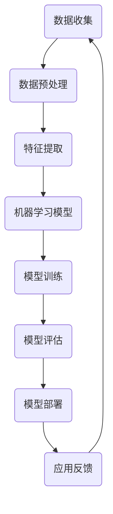

                 

# AI领域的技术突破与发展

## 关键词：人工智能，深度学习，神经网络，机器学习，自然语言处理，计算机视觉，数据科学，技术突破

### 摘要

本文将深入探讨人工智能（AI）领域在过去几年的技术突破与发展。首先，我们将简要回顾AI的历史背景，并介绍一些核心概念与架构。接着，我们将详细剖析AI中的核心算法原理，并介绍具体的数学模型和公式。随后，通过实际项目实战，我们将展示代码实现过程，并对关键代码进行详细解读。此外，我们将讨论AI在实际应用场景中的运用，推荐相关的学习资源和开发工具框架，并对未来的发展趋势与挑战进行展望。最后，我们将提供常见问题与解答，并推荐扩展阅读与参考资料。

## 1. 背景介绍

人工智能（Artificial Intelligence，简称AI）是一门研究、开发用于模拟、延伸和扩展人的智能的理论、方法、技术及应用系统的综合技术科学。自1956年达特茅斯会议以来，人工智能已经经历了多个发展阶段，从早期的符号主义、基于规则的系统，到基于统计学的机器学习，再到目前的深度学习和神经网络，AI技术取得了巨大的突破。

随着计算能力的提升和大数据的普及，AI技术逐渐渗透到各行各业，如自然语言处理、计算机视觉、医疗诊断、自动驾驶、金融风控等。AI的出现不仅改变了我们的生活方式，也为人类解决了许多复杂的问题。

### 1.1 人工智能的三个层次

人工智能可以分为三个层次：弱人工智能、强人工智能和超人工智能。

- **弱人工智能**：这种人工智能系统能够在特定任务上表现出与人类相似的智能，如语音识别、图像识别、推荐系统等。弱人工智能是基于数据和算法的，它的能力是有限的，仅限于解决特定的问题。
  
- **强人工智能**：这种人工智能系统能够像人类一样进行思考、学习、推理、解决问题，甚至具备自我意识。强人工智能目前仍处于理论阶段，尚未实现。

- **超人工智能**：这种人工智能将超越人类智能，能够解决人类无法解决的问题，如创造新的科技、解决全球性问题等。超人工智能目前还属于科幻领域，但许多科学家认为它将不可避免地出现。

## 2. 核心概念与联系

为了更好地理解AI的核心概念与联系，我们使用Mermaid流程图来展示AI的关键组成部分。



### 2.1 数据收集

数据是AI的基石，没有足够的数据，AI系统将无法训练和学习。数据收集包括从各种来源获取数据，如公开数据集、社交媒体、传感器等。

### 2.2 数据预处理

数据预处理是数据收集后的关键步骤，目的是清洗和格式化数据，使其适合机器学习模型训练。数据预处理包括数据清洗、归一化、降维等。

### 2.3 特征提取

特征提取是从原始数据中提取出对模型训练有用的特征。特征提取的质量直接影响模型的效果。

### 2.4 机器学习模型

机器学习模型是AI系统的核心，包括监督学习、无监督学习、强化学习等。不同的模型适用于不同的任务，如分类、回归、聚类等。

### 2.5 模型训练

模型训练是利用数据对机器学习模型进行调整和优化，使其能够预测和解决实际问题。模型训练包括参数调整、优化算法等。

### 2.6 模型评估

模型评估是对训练好的模型进行性能测试，以确定其准确度、泛化能力等。常用的评估指标包括准确率、召回率、F1分数等。

### 2.7 模型部署

模型部署是将训练好的模型应用到实际场景中，如服务器、移动设备等。模型部署需要考虑模型的性能、可扩展性、安全性等问题。

### 2.8 应用反馈

应用反馈是收集用户对AI系统的反馈，以不断优化和改进模型。应用反馈是一个循环过程，与数据收集、数据预处理等步骤紧密相连。

## 3. 核心算法原理 & 具体操作步骤

在了解了AI的基本概念和组成部分后，我们将详细探讨AI中的核心算法原理和具体操作步骤。

### 3.1 深度学习

深度学习是AI的一个重要分支，通过模拟人脑神经网络的结构和功能，实现数据的自动学习和特征提取。深度学习的核心算法是神经网络，包括卷积神经网络（CNN）、循环神经网络（RNN）、长短时记忆网络（LSTM）等。

#### 3.1.1 卷积神经网络（CNN）

卷积神经网络是一种用于图像识别和处理的前馈神经网络。CNN的核心操作是卷积和池化。

- **卷积操作**：卷积层通过卷积核对输入图像进行卷积操作，提取出图像中的特征。

- **池化操作**：池化层用于降低特征图的维度，增强模型对输入数据的泛化能力。

#### 3.1.2 循环神经网络（RNN）

循环神经网络是一种用于序列数据处理的前馈神经网络。RNN的核心操作是循环和更新。

- **循环操作**：RNN将前一个时间步的输出作为当前时间步的输入，形成循环。

- **更新操作**：RNN通过更新门控制当前时间步的信息流动。

#### 3.1.3 长短时记忆网络（LSTM）

长短时记忆网络是一种改进的RNN，用于解决RNN在处理长序列数据时出现的问题。LSTM的核心操作是遗忘门、输入门和输出门。

- **遗忘门**：遗忘门用于控制前一个时间步的遗忘信息。

- **输入门**：输入门用于控制当前时间步的新信息。

- **输出门**：输出门用于控制当前时间步的输出信息。

### 3.2 机器学习算法

机器学习算法是AI系统的核心，用于从数据中学习模式和规律。常见的机器学习算法包括线性回归、逻辑回归、决策树、随机森林、支持向量机等。

#### 3.2.1 线性回归

线性回归是一种用于预测连续值的监督学习算法。线性回归的核心操作是找到最佳拟合直线。

- **损失函数**：损失函数用于衡量模型预测值与真实值之间的差异。

- **梯度下降**：梯度下降是一种用于优化模型参数的算法。

#### 3.2.2 逻辑回归

逻辑回归是一种用于分类的监督学习算法。逻辑回归的核心操作是找到最佳拟合曲线。

- **损失函数**：损失函数用于衡量模型预测值与真实值之间的差异。

- **梯度下降**：梯度下降是一种用于优化模型参数的算法。

#### 3.2.3 决策树

决策树是一种用于分类和回归的监督学习算法。决策树的核心操作是递归划分数据。

- **特征选择**：特征选择用于选择对分类或回归最有用的特征。

- **切分策略**：切分策略用于确定每个节点应该按照哪个特征进行切分。

#### 3.2.4 随机森林

随机森林是一种基于决策树的集成学习算法。随机森林的核心操作是构建多个决策树，并取它们的平均值。

- **特征选择**：特征选择用于选择对分类或回归最有用的特征。

- **切分策略**：切分策略用于确定每个决策树应该按照哪个特征进行切分。

#### 3.2.5 支持向量机

支持向量机是一种用于分类和回归的监督学习算法。支持向量机的核心操作是找到最佳超平面。

- **特征选择**：特征选择用于选择对分类或回归最有用的特征。

- **核函数**：核函数用于将低维数据映射到高维空间，以便更好地分离不同类别。

## 4. 数学模型和公式 & 详细讲解 & 举例说明

在了解了AI的核心算法原理后，我们将详细讲解相关的数学模型和公式，并通过具体例子进行说明。

### 4.1 线性回归

线性回归的数学模型可以表示为：

$$y = \beta_0 + \beta_1 \cdot x$$

其中，$y$ 是预测值，$x$ 是输入特征，$\beta_0$ 和 $\beta_1$ 是模型参数。

**损失函数**：

$$L(\beta_0, \beta_1) = \frac{1}{2} \sum_{i=1}^{n} (y_i - (\beta_0 + \beta_1 \cdot x_i))^2$$

**梯度下降**：

$$\beta_0 = \beta_0 - \alpha \cdot \frac{\partial L(\beta_0, \beta_1)}{\partial \beta_0}$$

$$\beta_1 = \beta_1 - \alpha \cdot \frac{\partial L(\beta_0, \beta_1)}{\partial \beta_1}$$

其中，$\alpha$ 是学习率。

**例子**：

假设我们有以下数据集：

| x | y |
|---|---|
| 1 | 2 |
| 2 | 4 |
| 3 | 6 |
| 4 | 8 |

我们要用线性回归模型预测$x=5$时的$y$值。

首先，计算损失函数：

$$L(\beta_0, \beta_1) = \frac{1}{2} \sum_{i=1}^{4} (y_i - (\beta_0 + \beta_1 \cdot x_i))^2$$

$$L(\beta_0, \beta_1) = \frac{1}{2} \cdot (2 - (\beta_0 + \beta_1 \cdot 1))^2 + (4 - (\beta_0 + \beta_1 \cdot 2))^2 + (6 - (\beta_0 + \beta_1 \cdot 3))^2 + (8 - (\beta_0 + \beta_1 \cdot 4))^2$$

$$L(\beta_0, \beta_1) = \frac{1}{2} \cdot (2 - \beta_0 - \beta_1)^2 + (4 - \beta_0 - 2\beta_1)^2 + (6 - \beta_0 - 3\beta_1)^2 + (8 - \beta_0 - 4\beta_1)^2$$

接下来，计算梯度：

$$\frac{\partial L(\beta_0, \beta_1)}{\partial \beta_0} = -2 \cdot (2 - \beta_0 - \beta_1) - 2 \cdot (4 - \beta_0 - 2\beta_1) - 2 \cdot (6 - \beta_0 - 3\beta_1) - 2 \cdot (8 - \beta_0 - 4\beta_1)$$

$$\frac{\partial L(\beta_0, \beta_1)}{\partial \beta_0} = -8 + 4\beta_1$$

$$\frac{\partial L(\beta_0, \beta_1)}{\partial \beta_1} = -2 \cdot (2 - \beta_0 - \beta_1) - 4 \cdot (4 - \beta_0 - 2\beta_1) - 6 \cdot (6 - \beta_0 - 3\beta_1) - 8 \cdot (8 - \beta_0 - 4\beta_1)$$

$$\frac{\partial L(\beta_0, \beta_1)}{\partial \beta_1} = -10 - 6\beta_0$$

假设我们选择学习率$\alpha=0.1$，开始迭代：

- **第一次迭代**：

$$\beta_0 = \beta_0 - \alpha \cdot \frac{\partial L(\beta_0, \beta_1)}{\partial \beta_0} = \beta_0 - 0.1 \cdot (-8 + 4\beta_1)$$

$$\beta_1 = \beta_1 - \alpha \cdot \frac{\partial L(\beta_0, \beta_1)}{\partial \beta_1} = \beta_1 - 0.1 \cdot (-10 - 6\beta_0)$$

- **第二次迭代**：

$$\beta_0 = \beta_0 - \alpha \cdot \frac{\partial L(\beta_0, \beta_1)}{\partial \beta_0} = \beta_0 - 0.1 \cdot (-8 + 4\beta_1)$$

$$\beta_1 = \beta_1 - \alpha \cdot \frac{\partial L(\beta_0, \beta_1)}{\partial \beta_1} = \beta_1 - 0.1 \cdot (-10 - 6\beta_0)$$

重复迭代直到损失函数收敛或达到预设的迭代次数。

### 4.2 逻辑回归

逻辑回归的数学模型可以表示为：

$$P(y=1) = \frac{1}{1 + e^{-(\beta_0 + \beta_1 \cdot x)}}$$

其中，$P(y=1)$ 是目标变量为1的概率，$x$ 是输入特征，$\beta_0$ 和 $\beta_1$ 是模型参数。

**损失函数**：

$$L(\beta_0, \beta_1) = -\sum_{i=1}^{n} y_i \cdot \ln(P(y=1)) - (1 - y_i) \cdot \ln(1 - P(y=1))$$

**梯度下降**：

$$\beta_0 = \beta_0 - \alpha \cdot \frac{\partial L(\beta_0, \beta_1)}{\partial \beta_0}$$

$$\beta_1 = \beta_1 - \alpha \cdot \frac{\partial L(\beta_0, \beta_1)}{\partial \beta_1}$$

**例子**：

假设我们有以下数据集：

| x | y |
|---|---|
| 1 | 1 |
| 2 | 1 |
| 3 | 0 |
| 4 | 0 |

我们要用逻辑回归模型预测$x=5$时的$y$值。

首先，计算损失函数：

$$L(\beta_0, \beta_1) = -\sum_{i=1}^{4} y_i \cdot \ln(\frac{1}{1 + e^{-(\beta_0 + \beta_1 \cdot x_i)}) - (1 - y_i) \cdot \ln(1 - \frac{1}{1 + e^{-(\beta_0 + \beta_1 \cdot x_i)})$$

$$L(\beta_0, \beta_1) = -1 \cdot \ln(\frac{1}{1 + e^{-(\beta_0 + \beta_1 \cdot 1)}) - \ln(1 - \frac{1}{1 + e^{-(\beta_0 + \beta_1 \cdot 1)}) - 1 \cdot \ln(\frac{1}{1 + e^{-(\beta_0 + \beta_1 \cdot 2)}) - \ln(1 - \frac{1}{1 + e^{-(\beta_0 + \beta_1 \cdot 2)}) - 0 \cdot \ln(\frac{1}{1 + e^{-(\beta_0 + \beta_1 \cdot 3)}) - \ln(1 - \frac{1}{1 + e^{-(\beta_0 + \beta_1 \cdot 3)}) - 0 \cdot \ln(\frac{1}{1 + e^{-(\beta_0 + \beta_1 \cdot 4)}) - \ln(1 - \frac{1}{1 + e^{-(\beta_0 + \beta_1 \cdot 4)})$$

接下来，计算梯度：

$$\frac{\partial L(\beta_0, \beta_1)}{\partial \beta_0} = -\frac{e^{-(\beta_0 + \beta_1 \cdot x_i)}}{1 + e^{-(\beta_0 + \beta_1 \cdot x_i)}} + \frac{e^{-(\beta_0 + \beta_1 \cdot x_i)}}{1 + e^{-(\beta_0 + \beta_1 \cdot x_i)}}$$

$$\frac{\partial L(\beta_0, \beta_1)}{\partial \beta_0} = 0$$

$$\frac{\partial L(\beta_0, \beta_1)}{\partial \beta_1} = -\frac{e^{-(\beta_0 + \beta_1 \cdot x_i)} \cdot x_i}{1 + e^{-(\beta_0 + \beta_1 \cdot x_i)}} + \frac{e^{-(\beta_0 + \beta_1 \cdot x_i)} \cdot x_i}{1 + e^{-(\beta_0 + \beta_1 \cdot x_i)}}$$

$$\frac{\partial L(\beta_0, \beta_1)}{\partial \beta_1} = 0$$

假设我们选择学习率$\alpha=0.1$，开始迭代：

- **第一次迭代**：

$$\beta_0 = \beta_0 - \alpha \cdot \frac{\partial L(\beta_0, \beta_1)}{\partial \beta_0} = \beta_0$$

$$\beta_1 = \beta_1 - \alpha \cdot \frac{\partial L(\beta_0, \beta_1)}{\partial \beta_1} = \beta_1$$

- **第二次迭代**：

$$\beta_0 = \beta_0 - \alpha \cdot \frac{\partial L(\beta_0, \beta_1)}{\partial \beta_0} = \beta_0$$

$$\beta_1 = \beta_1 - \alpha \cdot \frac{\partial L(\beta_0, \beta_1)}{\partial \beta_1} = \beta_1$$

重复迭代直到损失函数收敛或达到预设的迭代次数。

## 5. 项目实战：代码实际案例和详细解释说明

在本节中，我们将通过一个实际项目案例来展示AI的代码实现过程，并对关键代码进行详细解读。

### 5.1 开发环境搭建

首先，我们需要搭建一个合适的开发环境。以下是所需的环境和工具：

- 操作系统：Linux或MacOS
- 编程语言：Python
- 机器学习框架：TensorFlow或PyTorch
- 数据预处理工具：Pandas、NumPy
- 图形库：Matplotlib、Seaborn

安装完以上工具后，我们就可以开始编写代码了。

### 5.2 源代码详细实现和代码解读

以下是一个简单的线性回归模型的代码实现，我们将使用Python和TensorFlow来构建和训练模型。

```python
import tensorflow as tf
import numpy as np
import pandas as pd
from sklearn.model_selection import train_test_split
from sklearn.metrics import mean_squared_error

# 加载数据集
data = pd.read_csv('data.csv')
X = data[['x']]
y = data['y']

# 划分训练集和测试集
X_train, X_test, y_train, y_test = train_test_split(X, y, test_size=0.2, random_state=42)

# 模型定义
model = tf.keras.Sequential([
    tf.keras.layers.Dense(units=1, input_shape=(1,))
])

# 模型编译
model.compile(optimizer='sgd', loss='mean_squared_error')

# 模型训练
model.fit(X_train, y_train, epochs=100, batch_size=32)

# 模型评估
loss = model.evaluate(X_test, y_test, verbose=2)
print('Test loss:', loss)

# 模型预测
predictions = model.predict(X_test)
print('Predictions:', predictions)

# 模型性能分析
mse = mean_squared_error(y_test, predictions)
print('Mean squared error:', mse)
```

**代码解读**：

1. **数据加载**：我们使用Pandas从CSV文件中加载数据集，并将输入特征和目标变量分别存放在$X$和$y$中。

2. **数据划分**：我们使用Scikit-learn中的`train_test_split`函数将数据集划分为训练集和测试集，其中测试集大小为20%。

3. **模型定义**：我们使用TensorFlow的`keras.Sequential`模型定义一个线性回归模型，该模型只有一个全连接层，输入维度为1。

4. **模型编译**：我们使用`model.compile`函数编译模型，指定优化器和损失函数。

5. **模型训练**：我们使用`model.fit`函数训练模型，指定训练数据、训练轮数和批量大小。

6. **模型评估**：我们使用`model.evaluate`函数评估模型在测试集上的性能，并打印损失值。

7. **模型预测**：我们使用`model.predict`函数对测试集进行预测，并打印预测结果。

8. **模型性能分析**：我们使用`mean_squared_error`函数计算模型在测试集上的均方误差，并打印结果。

### 5.3 代码解读与分析

在本节中，我们将对上面的代码进行详细解读，分析其关键部分。

1. **数据加载**：

```python
data = pd.read_csv('data.csv')
X = data[['x']]
y = data['y']
```

这两行代码用于加载数据集。`pd.read_csv`函数读取CSV文件，`data[['x']]`和`data[['y']]`分别提取输入特征和目标变量。

2. **数据划分**：

```python
X_train, X_test, y_train, y_test = train_test_split(X, y, test_size=0.2, random_state=42)
```

`train_test_split`函数将数据集划分为训练集和测试集。`test_size`参数指定测试集的比例，`random_state`参数用于设置随机数种子，确保结果可重复。

3. **模型定义**：

```python
model = tf.keras.Sequential([
    tf.keras.layers.Dense(units=1, input_shape=(1,))
])
```

`keras.Sequential`模型定义了一个线性回归模型，其中只有一个全连接层。`units=1`指定输出维度为1，`input_shape=(1,)`指定输入维度为1。

4. **模型编译**：

```python
model.compile(optimizer='sgd', loss='mean_squared_error')
```

`model.compile`函数编译模型，指定优化器和损失函数。`optimizer='sgd'`使用随机梯度下降优化器，`loss='mean_squared_error'`使用均方误差作为损失函数。

5. **模型训练**：

```python
model.fit(X_train, y_train, epochs=100, batch_size=32)
```

`model.fit`函数训练模型。`X_train`和`y_train`分别为训练数据的输入特征和目标变量，`epochs`参数指定训练轮数，`batch_size`参数指定批量大小。

6. **模型评估**：

```python
loss = model.evaluate(X_test, y_test, verbose=2)
print('Test loss:', loss)
```

`model.evaluate`函数评估模型在测试集上的性能，并返回损失值。`verbose=2`参数用于打印详细的训练过程信息。

7. **模型预测**：

```python
predictions = model.predict(X_test)
print('Predictions:', predictions)
```

`model.predict`函数对测试集进行预测，并返回预测结果。

8. **模型性能分析**：

```python
mse = mean_squared_error(y_test, predictions)
print('Mean squared error:', mse)
```

`mean_squared_error`函数计算模型在测试集上的均方误差，并打印结果。

### 5.4 代码优化与改进

在实际项目中，我们可能需要对代码进行优化和改进，以提高模型的性能和效率。以下是一些常见的优化方法：

1. **数据预处理**：对数据进行标准化或归一化，以消除不同特征之间的尺度差异。

2. **特征工程**：提取更多的特征，如多项式特征、交叉特征等，以提高模型的拟合能力。

3. **模型选择**：根据任务和数据的特点，选择合适的模型，如决策树、随机森林、神经网络等。

4. **超参数调整**：调整模型的超参数，如学习率、批量大小、迭代次数等，以获得更好的模型性能。

5. **集成学习方法**：将多个模型集成起来，以提高模型的泛化能力和鲁棒性。

6. **模型压缩**：使用模型压缩技术，如剪枝、量化等，减小模型的规模和存储空间。

## 6. 实际应用场景

人工智能技术已经在许多领域取得了显著的应用成果，以下是一些典型的实际应用场景：

### 6.1 自然语言处理

自然语言处理（NLP）是AI的一个重要分支，旨在使计算机能够理解和生成人类语言。NLP的应用场景包括：

- **机器翻译**：如谷歌翻译、百度翻译等，利用AI技术实现跨语言之间的文本翻译。
- **智能客服**：如智能客服机器人、聊天机器人等，通过自然语言处理技术实现与用户的实时交互。
- **文本分类**：如新闻分类、情感分析等，将大量的文本数据自动分类，提高信息处理效率。
- **文本生成**：如自动写作、自动摘要等，利用AI技术生成高质量的文本内容。

### 6.2 计算机视觉

计算机视觉是AI技术的另一个重要分支，旨在使计算机能够像人类一样理解和解释视觉信息。计算机视觉的应用场景包括：

- **图像识别**：如人脸识别、物体识别等，通过计算机视觉技术识别图像中的特定对象或场景。
- **图像分割**：如医学影像分割、自动驾驶图像分割等，将图像划分为不同的区域或对象。
- **目标检测**：如自动驾驶车辆检测、视频监控系统等，在图像中检测并定位特定目标。
- **图像生成**：如艺术创作、图像修复等，利用AI技术生成新的图像内容。

### 6.3 自动驾驶

自动驾驶是AI技术在交通运输领域的典型应用，旨在实现车辆的自主驾驶。自动驾驶的应用场景包括：

- **自动驾驶汽车**：如特斯拉、百度等公司的自动驾驶汽车，通过AI技术实现车辆的自动驾驶功能。
- **无人机送货**：如亚马逊、京东等公司的无人机送货服务，利用AI技术实现无人机的自主导航和配送。
- **智能交通系统**：如交通流量监测、信号灯控制等，利用AI技术优化交通流

