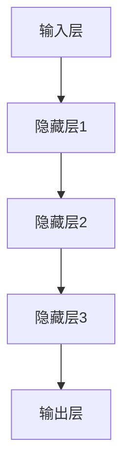
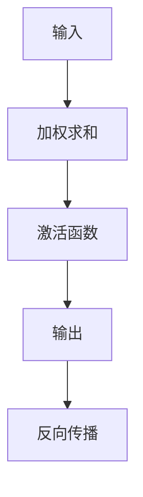
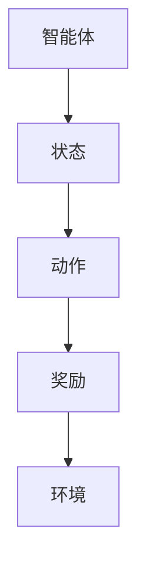

                 

### 背景介绍

在当今社会，人工智能（AI）技术已经成为推动科技进步和产业变革的重要动力。从自然语言处理、计算机视觉到自动驾驶、智能机器人，AI技术的应用无处不在，极大地改变了我们的生活方式和商业模式。然而，随着AI技术的飞速发展，也带来了许多新的挑战和机遇。

本文旨在介绍AI领域的最新技术进展，旨在帮助读者了解当前AI技术的热点和发展方向。我们将从背景介绍、核心概念与联系、核心算法原理、数学模型和公式、项目实战、实际应用场景、工具和资源推荐以及未来发展趋势与挑战等多个方面，全面探讨AI技术的现状和未来。

通过本文的阅读，读者将能够：

1. 理解AI技术的核心概念和原理。
2. 掌握AI领域的主要算法和模型。
3. 分析AI技术在各个实际应用场景中的优势和挑战。
4. 了解未来AI技术的发展趋势和潜在挑战。

本文将采用逻辑清晰、结构紧凑、简单易懂的写作风格，以逐步分析推理的方式，深入探讨AI技术的各个层面。让我们一同走进AI技术的世界，探索其中的奥秘与前景。

### AI领域的核心概念与联系

为了更好地理解AI技术的核心概念和原理，我们需要从以下几个方面进行详细探讨：深度学习、神经网络、强化学习等，并使用Mermaid流程图展示其基本架构和联系。

#### 深度学习（Deep Learning）

深度学习是AI领域的重要分支，其基本原理是基于多层神经网络进行特征提取和建模。深度学习模型通过层层递进的神经网络结构，从大量数据中自动提取特征，实现对复杂任务的自动学习和决策。

**基本架构：**

1. **输入层（Input Layer）：** 接收外部输入的数据，如图像、文本或声音等。
2. **隐藏层（Hidden Layers）：** 通过激活函数对输入数据进行特征提取和变换，多层隐藏层能够提取更高层次的特征。
3. **输出层（Output Layer）：** 根据任务类型输出预测结果或分类标签。

**Mermaid流程图：**



#### 神经网络（Neural Networks）

神经网络是深度学习的基础，其基本结构由大量人工神经元（或节点）组成，每个神经元与相邻的神经元通过权重相连，并使用激活函数进行计算。

**基本原理：**

1. **加权求和：** 每个输入数据乘以其对应的权重，然后求和。
2. **激活函数：** 对加权求和的结果应用非线性函数，如ReLU、Sigmoid、Tanh等，以引入非线性特性。
3. **反向传播：** 通过反向传播算法更新权重，以最小化损失函数。

**Mermaid流程图：**



#### 强化学习（Reinforcement Learning）

强化学习是另一种重要的AI算法，其基本原理是通过智能体与环境的交互，不断调整策略以最大化累积奖励。

**基本架构：**

1. **智能体（Agent）：** 执行动作的主体。
2. **环境（Environment）：** 智能体所处的环境。
3. **状态（State）：** 智能体在某一时刻的观察。
4. **动作（Action）：** 智能体执行的行为。
5. **奖励（Reward）：** 对动作结果的奖励或惩罚。

**Mermaid流程图：**



#### 核心概念与联系

深度学习、神经网络和强化学习虽然各自有不同的应用场景和原理，但它们之间存在密切的联系。

1. **深度学习与神经网络：** 深度学习依赖于神经网络结构，通过多层神经网络进行特征提取和建模。
2. **神经网络与强化学习：** 神经网络可以用于强化学习中的策略学习，通过调整网络权重以优化策略。
3. **深度学习与强化学习：** 深度强化学习（Deep Reinforcement Learning）将深度学习和强化学习相结合，通过深度神经网络实现智能体的自主学习和决策。

通过上述核心概念的介绍和Mermaid流程图的展示，我们可以更清晰地理解AI技术的原理和架构。在接下来的章节中，我们将深入探讨AI领域的核心算法原理、数学模型和公式，以及实际应用场景，进一步揭示AI技术的奥妙和潜力。

### 核心算法原理 & 具体操作步骤

在了解AI领域的核心概念和联系之后，接下来我们将深入探讨AI技术的核心算法原理，包括深度学习、神经网络和强化学习，并详细讲解其具体操作步骤。

#### 深度学习算法原理

深度学习算法的核心是多层神经网络，其基本原理是通过多层隐藏层自动提取数据的特征，实现对复杂任务的建模和预测。以下是深度学习算法的基本操作步骤：

1. **数据预处理：** 
   - **输入数据：** 将输入数据（如图像、文本、音频等）进行格式化，转换为神经网络可以处理的形式。
   - **数据归一化：** 对输入数据进行归一化处理，以消除数据之间的量纲差异，提高模型的训练效果。
   - **数据划分：** 将数据集划分为训练集、验证集和测试集，以评估模型的性能。

2. **构建神经网络：**
   - **定义网络结构：** 设计神经网络的层数、每层的神经元数量和激活函数等。
   - **初始化权重：** 随机初始化神经网络中的权重和偏置，以避免梯度消失和梯度爆炸问题。

3. **前向传播（Forward Propagation）：**
   - **输入层：** 将输入数据传递到输入层。
   - **隐藏层：** 将输入层的数据传递到隐藏层，通过加权求和和激活函数计算输出。
   - **输出层：** 将隐藏层的输出传递到输出层，得到模型的预测结果。

4. **损失函数（Loss Function）：**
   - **计算损失：** 将模型的预测结果与实际标签进行比较，计算损失值。
   - **选择优化器：** 根据损失函数选择适当的优化器（如SGD、Adam等），以更新网络权重和偏置。

5. **反向传播（Backpropagation）：**
   - **计算梯度：** 根据损失函数对网络权重和偏置进行梯度计算。
   - **更新参数：** 根据梯度方向和步长调整网络权重和偏置。

6. **模型评估（Model Evaluation）：**
   - **验证集：** 使用验证集评估模型的性能，调整模型参数以优化性能。
   - **测试集：** 在测试集上评估模型的泛化能力，确保模型在实际应用中的有效性。

#### 神经网络算法原理

神经网络算法是基于多层感知机（MLP）构建的，其核心原理是通过前向传播和反向传播算法不断调整网络权重和偏置，实现数据的特征提取和分类。以下是神经网络算法的基本操作步骤：

1. **数据预处理：**
   - **输入数据：** 对输入数据（如图像、文本、音频等）进行预处理，包括归一化和格式化等。
   - **数据划分：** 将数据集划分为训练集、验证集和测试集。

2. **构建神经网络：**
   - **定义网络结构：** 根据任务类型和输入特征，设计神经网络的层数、每层的神经元数量和激活函数等。
   - **初始化权重：** 随机初始化网络权重和偏置。

3. **前向传播（Forward Propagation）：**
   - **输入层：** 将输入数据传递到输入层。
   - **隐藏层：** 将输入层的数据传递到隐藏层，通过加权求和和激活函数计算输出。
   - **输出层：** 将隐藏层的输出传递到输出层，得到模型的预测结果。

4. **损失函数（Loss Function）：**
   - **计算损失：** 将模型的预测结果与实际标签进行比较，计算损失值。
   - **选择优化器：** 根据损失函数选择适当的优化器，如SGD、Adam等。

5. **反向传播（Backpropagation）：**
   - **计算梯度：** 根据损失函数对网络权重和偏置进行梯度计算。
   - **更新参数：** 根据梯度方向和步长调整网络权重和偏置。

6. **模型评估（Model Evaluation）：**
   - **验证集：** 使用验证集评估模型的性能，调整模型参数以优化性能。
   - **测试集：** 在测试集上评估模型的泛化能力，确保模型在实际应用中的有效性。

#### 强化学习算法原理

强化学习算法的核心是通过智能体与环境的交互，学习最优策略，以最大化累积奖励。以下是强化学习算法的基本操作步骤：

1. **定义智能体（Agent）：**
   - **状态（State）：** 智能体在某一时刻的观察。
   - **动作（Action）：** 智能体可以执行的行为。
   - **奖励（Reward）：** 对动作结果的奖励或惩罚。

2. **构建环境（Environment）：**
   - **状态空间（State Space）：** 环境中所有可能的状态集合。
   - **动作空间（Action Space）：** 智能体可以执行的所有动作集合。

3. **选择策略（Policy）：**
   - **策略（Policy）：** 智能体在特定状态下执行的动作。

4. **评估策略：**
   - **奖励函数（Reward Function）：** 对智能体的动作结果进行奖励或惩罚。
   - **价值函数（Value Function）：** 评估策略的优劣。

5. **更新策略：**
   - **策略迭代：** 根据智能体的动作结果和奖励，不断调整策略。
   - **策略优化：** 通过优化算法（如Q-learning、SARSA等）更新策略。

通过上述核心算法原理的详细讲解，我们可以更好地理解AI技术的运作机制。在实际应用中，这些算法需要结合具体问题进行优化和调整，以实现最佳效果。在接下来的章节中，我们将通过项目实战，展示这些算法在实际应用中的具体实现和效果。

### 数学模型和公式 & 详细讲解 & 举例说明

在深入探讨AI领域的核心算法原理之后，我们需要进一步了解其背后的数学模型和公式，以便更准确地实现和应用这些算法。以下将详细介绍神经网络中的激活函数、损失函数以及优化器的相关数学模型，并通过具体示例进行讲解。

#### 激活函数（Activation Functions）

激活函数是神经网络中的一个关键组件，用于引入非线性特性，使得神经网络能够拟合复杂的非线性关系。常见的激活函数包括ReLU、Sigmoid、Tanh等。

1. **ReLU（Rectified Linear Unit）**

ReLU函数是最常用的激活函数之一，其表达式为：
\[ f(x) = \max(0, x) \]
ReLU函数在 \( x \leq 0 \) 时输出为0，在 \( x > 0 \) 时输出为 \( x \) 本身，这样可以加速神经网络的训练速度，减少梯度消失问题。

2. **Sigmoid**

Sigmoid函数的表达式为：
\[ f(x) = \frac{1}{1 + e^{-x}} \]
Sigmoid函数将输入值映射到 \( (0, 1) \) 区间，常用于二分类问题。

3. **Tanh**

Tanh函数的表达式为：
\[ f(x) = \frac{e^x - e^{-x}}{e^x + e^{-x}} \]
Tanh函数将输入值映射到 \( (-1, 1) \) 区间，具有相似的平滑特性，但相对于Sigmoid函数，Tanh函数在梯度计算时表现更好。

#### 损失函数（Loss Functions）

损失函数是评估神经网络模型预测结果与实际标签之间差异的关键指标，常见的损失函数包括均方误差（MSE）、交叉熵（Cross-Entropy）等。

1. **均方误差（MSE，Mean Squared Error）**

MSE损失函数的表达式为：
\[ MSE = \frac{1}{n}\sum_{i=1}^{n}(y_i - \hat{y}_i)^2 \]
其中，\( y_i \) 表示实际标签，\( \hat{y}_i \) 表示预测值，\( n \) 表示样本数量。MSE损失函数适用于回归问题，其优点是计算简单，缺点是对异常值敏感。

2. **交叉熵（Cross-Entropy）**

交叉熵损失函数的表达式为：
\[ Cross-Entropy = -\sum_{i=1}^{n}y_i \log(\hat{y}_i) \]
其中，\( y_i \) 表示实际标签，\( \hat{y}_i \) 表示预测概率。交叉熵损失函数适用于分类问题，其优点是能够很好地处理概率分布，缺点是梯度可能不稳定。

#### 优化器（Optimizers）

优化器用于调整神经网络的权重和偏置，以最小化损失函数。常见的优化器包括随机梯度下降（SGD）、Adam等。

1. **随机梯度下降（SGD，Stochastic Gradient Descent）**

SGD优化器的更新公式为：
\[ \theta = \theta - \alpha \nabla_{\theta}J(\theta) \]
其中，\( \theta \) 表示参数，\( \alpha \) 表示学习率，\( \nabla_{\theta}J(\theta) \) 表示损失函数关于参数的梯度。SGD优化器通过随机选择样本子集进行梯度计算，以加快收敛速度。

2. **Adam优化器**

Adam优化器结合了SGD和Momentum的特点，其更新公式为：
\[ \theta = \theta - \alpha \left( \frac{m}{1 - \beta_1^t} + \frac{v}{1 - \beta_2^t} \right) \]
其中，\( m \) 表示一阶矩估计，\( v \) 表示二阶矩估计，\( \beta_1 \) 和 \( \beta_2 \) 分别表示一阶和二阶矩的指数衰减率。Adam优化器在训练过程中能够自适应调整学习率，提高收敛效果。

#### 示例讲解

假设我们使用一个简单的神经网络进行二分类任务，输入层有2个神经元，隐藏层有3个神经元，输出层有1个神经元。我们使用ReLU函数作为激活函数，MSE作为损失函数，Adam作为优化器。

1. **初始化参数**

   初始化网络权重和偏置，如下所示：

   \[
   \begin{aligned}
   W_{1} &= \text{randn}(2, 3) \\
   b_{1} &= \text{randn}(3, 1) \\
   W_{2} &= \text{randn}(3, 1) \\
   b_{2} &= \text{randn}(1, 1) \\
   \end{aligned}
   \]

2. **前向传播**

   假设输入数据为 \( x = [x_1, x_2] \)，隐藏层输出为 \( h = \text{relu}(xW_{1} + b_{1}) \)，输出层预测值为 \( \hat{y} = hW_{2} + b_{2} \)。

3. **计算损失**

   使用MSE损失函数计算预测值与实际标签之间的差异：

   \[
   \begin{aligned}
   L &= \frac{1}{2}(y - \hat{y})^2 \\
   \end{aligned}
   \]

4. **反向传播**

   计算输出层和隐藏层的梯度，如下所示：

   \[
   \begin{aligned}
   \nabla_{W_{2}} &= (h - y)h^T \\
   \nabla_{b_{2}} &= h - y \\
   \nabla_{W_{1}} &= (xW_{2} - \text{relu}'(xW_{1} + b_{1}))x^T \\
   \nabla_{b_{1}} &= (xW_{2} - \text{relu}'(xW_{1} + b_{1})) \\
   \end{aligned}
   \]

5. **更新参数**

   使用Adam优化器更新网络权重和偏置，如下所示：

   \[
   \begin{aligned}
   m_{1} &= \beta_{1}m_{1} + (1 - \beta_{1})(\nabla_{W_{1}}) \\
   v_{1} &= \beta_{2}v_{1} + (1 - \beta_{2})(\nabla_{W_{1}})^2 \\
   m_{2} &= \beta_{1}m_{2} + (1 - \beta_{1})(\nabla_{b_{1}}) \\
   v_{2} &= \beta_{2}v_{2} + (1 - \beta_{2})(\nabla_{b_{1}})^2 \\
   m_{3} &= \beta_{1}m_{3} + (1 - \beta_{1})(\nabla_{W_{2}}) \\
   v_{3} &= \beta_{2}v_{3} + (1 - \beta_{2})(\nabla_{W_{2}})^2 \\
   m_{4} &= \beta_{1}m_{4} + (1 - \beta_{1})(\nabla_{b_{2}}) \\
   v_{4} &= \beta_{2}v_{4} + (1 - \beta_{2})(\nabla_{b_{2}})^2 \\
   W_{1} &= W_{1} - \alpha \left( \frac{m_{1}}{1 - \beta_{1}^t} + \frac{v_{1}}{1 - \beta_{2}^t} \right) \\
   b_{1} &= b_{1} - \alpha \left( \frac{m_{2}}{1 - \beta_{1}^t} + \frac{v_{2}}{1 - \beta_{2}^t} \right) \\
   W_{2} &= W_{2} - \alpha \left( \frac{m_{3}}{1 - \beta_{1}^t} + \frac{v_{3}}{1 - \beta_{2}^t} \right) \\
   b_{2} &= b_{2} - \alpha \left( \frac{m_{4}}{1 - \beta_{1}^t} + \frac{v_{4}}{1 - \beta_{2}^t} \right) \\
   \end{aligned}
   \]

通过上述示例，我们可以看到神经网络中的激活函数、损失函数和优化器的具体实现过程。在实际应用中，这些数学模型和公式需要根据具体任务进行优化和调整，以实现最佳效果。

### 项目实战：代码实际案例和详细解释说明

为了更好地理解AI算法的实际应用，我们将在本节中通过一个具体项目实战，详细讲解如何搭建开发环境、编写源代码以及进行代码解读与分析。我们将以一个简单的图像分类项目为例，展示从零开始实现一个深度学习模型的全过程。

#### 开发环境搭建

在开始项目之前，我们需要搭建合适的开发环境。以下是搭建开发环境的步骤：

1. **安装Python环境：** Python是深度学习项目中最常用的编程语言，版本建议使用3.7及以上。您可以通过以下命令安装Python：

   ```bash
   sudo apt-get install python3.7
   ```

2. **安装深度学习框架：** TensorFlow和PyTorch是当前最流行的深度学习框架，您可以根据个人偏好选择其中一个进行安装。以下是安装TensorFlow的命令：

   ```bash
   pip install tensorflow
   ```

   安装PyTorch的命令如下：

   ```bash
   pip install torch torchvision
   ```

3. **安装必要的库：** 以下是一些常用的Python库，用于数据预处理、模型训练和可视化等操作：

   ```bash
   pip install numpy matplotlib pandas
   ```

4. **配置GPU支持：** 如果您希望使用GPU进行深度学习模型的训练，需要安装CUDA和cuDNN。以下是安装CUDA的命令：

   ```bash
   sudo apt-get install cuda
   ```

   安装cuDNN的命令如下：

   ```bash
   sudo dpkg -i /path/to/cudnn_8.0.5.39-1+cuda11.3_1_amd64.deb
   ```

   将CUDA和cuDNN添加到环境变量中：

   ```bash
   export PATH=/usr/local/cuda/bin:$PATH
   export LD_LIBRARY_PATH=/usr/local/cuda/lib64:$LD_LIBRARY_PATH
   ```

#### 源代码详细实现

以下是该项目的基本源代码实现，包括数据预处理、模型定义、训练和评估等步骤：

```python
import torch
import torchvision
import torchvision.transforms as transforms
import torch.nn as nn
import torch.optim as optim

# 数据预处理
transform = transforms.Compose([
    transforms.Resize((224, 224)),
    transforms.ToTensor(),
    transforms.Normalize(mean=[0.485, 0.456, 0.406], std=[0.229, 0.224, 0.225]),
])

# 加载训练数据和测试数据
train_set = torchvision.datasets.ImageFolder(root='./data/train', transform=transform)
train_loader = torch.utils.data.DataLoader(train_set, batch_size=32, shuffle=True)

test_set = torchvision.datasets.ImageFolder(root='./data/test', transform=transform)
test_loader = torch.utils.data.DataLoader(test_set, batch_size=32, shuffle=False)

# 定义模型
class CNN(nn.Module):
    def __init__(self):
        super(CNN, self).__init__()
        self.conv1 = nn.Conv2d(3, 64, 3, padding=1)
        self.relu = nn.ReLU()
        self.maxpool = nn.MaxPool2d(2)
        self.conv2 = nn.Conv2d(64, 128, 3, padding=1)
        self.fc1 = nn.Linear(128 * 56 * 56, 1024)
        self.fc2 = nn.Linear(1024, 10)

    def forward(self, x):
        x = self.relu(self.conv1(x))
        x = self.maxpool(x)
        x = self.relu(self.conv2(x))
        x = self.maxpool(x)
        x = x.view(-1, 128 * 56 * 56)
        x = self.relu(self.fc1(x))
        x = self.fc2(x)
        return x

model = CNN()
print(model)

# 定义损失函数和优化器
criterion = nn.CrossEntropyLoss()
optimizer = optim.Adam(model.parameters(), lr=0.001)

# 训练模型
num_epochs = 10
for epoch in range(num_epochs):
    model.train()
    for i, (images, labels) in enumerate(train_loader):
        optimizer.zero_grad()
        outputs = model(images)
        loss = criterion(outputs, labels)
        loss.backward()
        optimizer.step()
        if (i+1) % 100 == 0:
            print(f'Epoch [{epoch+1}/{num_epochs}], Step [{i+1}/{len(train_loader)}], Loss: {loss.item()}')

# 评估模型
model.eval()
with torch.no_grad():
    correct = 0
    total = 0
    for images, labels in test_loader:
        outputs = model(images)
        _, predicted = torch.max(outputs.data, 1)
        total += labels.size(0)
        correct += (predicted == labels).sum().item()

print(f'Accuracy on the test images: {100 * correct / total}%')
```

#### 代码解读与分析

1. **数据预处理：**

   ```python
   transform = transforms.Compose([
       transforms.Resize((224, 224)),  # 将图像调整到224x224的尺寸
       transforms.ToTensor(),            # 将图像转换为Tensor格式
       transforms.Normalize(mean=[0.485, 0.456, 0.406], std=[0.229, 0.224, 0.225]),  # 对图像进行归一化处理
   ])
   ```

   数据预处理是深度学习项目的重要环节，它有助于提高模型训练效果和性能。在该项目中，我们使用ResNet预训练模型，需要将图像调整到224x224的尺寸，并进行归一化处理。

2. **加载训练数据和测试数据：**

   ```python
   train_set = torchvision.datasets.ImageFolder(root='./data/train', transform=transform)
   train_loader = torch.utils.data.DataLoader(train_set, batch_size=32, shuffle=True)
   test_set = torchvision.datasets.ImageFolder(root='./data/test', transform=transform)
   test_loader = torch.utils.data.DataLoader(test_set, batch_size=32, shuffle=False)
   ```

   使用`torchvision.datasets.ImageFolder`加载训练数据和测试数据，其中`root`参数指定数据集的存储路径，`transform`参数用于数据预处理。

3. **定义模型：**

   ```python
   class CNN(nn.Module):
       def __init__(self):
           super(CNN, self).__init__()
           self.conv1 = nn.Conv2d(3, 64, 3, padding=1)
           self.relu = nn.ReLU()
           self.maxpool = nn.MaxPool2d(2)
           self.conv2 = nn.Conv2d(64, 128, 3, padding=1)
           self.fc1 = nn.Linear(128 * 56 * 56, 1024)
           self.fc2 = nn.Linear(1024, 10)

       def forward(self, x):
           x = self.relu(self.conv1(x))
           x = self.maxpool(x)
           x = self.relu(self.conv2(x))
           x = self.maxpool(x)
           x = x.view(-1, 128 * 56 * 56)
           x = self.relu(self.fc1(x))
           x = self.fc2(x)
           return x

   model = CNN()
   print(model)
   ```

   定义一个简单的卷积神经网络（CNN），包括两个卷积层、两个ReLU激活函数和两个全连接层。在`forward`方法中，实现前向传播过程。

4. **定义损失函数和优化器：**

   ```python
   criterion = nn.CrossEntropyLoss()
   optimizer = optim.Adam(model.parameters(), lr=0.001)
   ```

   使用交叉熵损失函数（适用于分类问题）和Adam优化器（自适应调整学习率）。

5. **训练模型：**

   ```python
   num_epochs = 10
   for epoch in range(num_epochs):
       model.train()
       for i, (images, labels) in enumerate(train_loader):
           optimizer.zero_grad()
           outputs = model(images)
           loss = criterion(outputs, labels)
           loss.backward()
           optimizer.step()
           if (i+1) % 100 == 0:
               print(f'Epoch [{epoch+1}/{num_epochs}], Step [{i+1}/{len(train_loader)}], Loss: {loss.item()}')
   ```

   在训练过程中，遍历训练数据集，使用优化器更新模型参数，以最小化损失函数。

6. **评估模型：**

   ```python
   model.eval()
   with torch.no_grad():
       correct = 0
       total = 0
       for images, labels in test_loader:
           outputs = model(images)
           _, predicted = torch.max(outputs.data, 1)
           total += labels.size(0)
           correct += (predicted == labels).sum().item()
   print(f'Accuracy on the test images: {100 * correct / total}%')
   ```

   在评估过程中，使用测试数据集评估模型性能，计算准确率。

通过上述代码实战，我们成功搭建了一个简单的图像分类项目，实现了数据预处理、模型定义、训练和评估等步骤。在实际应用中，可以根据具体任务需求对代码进行调整和优化，以实现更好的性能和效果。

### 实际应用场景

AI技术已经在众多实际应用场景中展现出其巨大潜力和价值。以下是一些典型的AI应用场景，以及它们在各自领域的应用情况和效果。

#### 自动驾驶

自动驾驶是AI技术在交通领域的重要应用，通过利用深度学习和计算机视觉技术，自动驾驶系统能够实时感知周围环境、做出决策并控制车辆。自动驾驶的应用场景包括无人出租车、无人配送车、无人卡车等。

**应用情况：**
自动驾驶技术已经取得显著进展，许多科技公司和研究机构都在这一领域进行深入研究。特斯拉的自动驾驶系统已经在部分车型上实现自动车道保持、自动变道、自动泊车等功能。此外，谷歌的Waymo、百度的Apollo等自动驾驶平台也在不断推进商业化进程。

**效果：**
自动驾驶技术的引入有望显著提高道路安全性和交通效率。根据研究，自动驾驶车辆在事故发生率和死亡率方面比人类驾驶车辆有显著优势。此外，自动驾驶还可以减少交通拥堵，提高道路利用率，降低运输成本。

#### 智能医疗

智能医疗是AI技术的重要应用领域，通过利用机器学习和大数据分析，智能医疗系统能够对大量医疗数据进行分析和挖掘，辅助医生进行诊断、治疗和药物研发。

**应用情况：**
智能医疗技术已经在多个方面得到广泛应用，如医学影像分析、疾病预测、个性化治疗等。例如，IBM的Watson for Oncology系统能够根据患者的病史、基因数据等信息，提供个性化的癌症治疗方案。此外，AI技术还在辅助手术、医疗机器人等领域得到应用。

**效果：**
智能医疗技术的应用显著提高了医疗诊断和治疗的准确性和效率。根据研究，AI技术在医学影像分析中的准确率已经达到甚至超过人类专家水平。此外，智能医疗还可以帮助医生发现罕见疾病，提高治疗效果，降低医疗成本。

#### 智能家居

智能家居是AI技术在家庭生活领域的应用，通过智能设备、传感器和云计算技术，智能家居系统能够实现家庭设备的智能控制、环境监测和能源管理。

**应用情况：**
智能家居市场正在快速增长，许多家电品牌和科技公司都在这一领域进行布局。例如，亚马逊的Alexa、谷歌的Google Home等智能语音助手，以及智能家居设备如智能灯泡、智能门锁、智能恒温器等。

**效果：**
智能家居技术的应用为家庭生活带来了诸多便利和舒适体验。智能设备可以通过语音控制、手机APP等方式进行操作，实现远程控制和自动化管理。此外，智能家居系统还可以通过数据分析和预测，提供个性化的服务和建议，如根据用户习惯调整室内温度、湿度等环境参数，提高生活质量。

#### 金融科技

金融科技是AI技术在金融领域的应用，通过机器学习、大数据分析和区块链技术，金融科技系统能够实现风险评估、投资决策、客户服务等方面的智能化和自动化。

**应用情况：**
金融科技已经成为金融行业的重要发展趋势，众多银行、证券、保险等金融机构都在引入AI技术。例如，人工智能算法已经在信用评估、风险控制、市场预测等方面得到广泛应用。此外，区块链技术在数字货币、智能合约等领域也展现出巨大潜力。

**效果：**
金融科技技术的应用显著提高了金融行业的效率和服务质量。通过AI技术，金融机构能够更准确地评估信用风险，降低欺诈风险，提高贷款审批效率。此外，金融科技还可以提供个性化的投资建议，帮助投资者优化资产配置，提高投资收益。

总之，AI技术在各个实际应用场景中展现出巨大的潜力和价值。随着技术的不断进步和应用的不断拓展，AI技术将在更多领域发挥重要作用，推动社会的发展和进步。

### 工具和资源推荐

为了帮助读者更好地学习和应用AI技术，本节将推荐一些优质的工具、资源和学习资料，包括书籍、论文、博客和网站等。

#### 学习资源推荐

1. **书籍：**
   - 《深度学习》（Deep Learning）作者：Ian Goodfellow、Yoshua Bengio、Aaron Courville
   - 《Python机器学习》（Python Machine Learning）作者：Sebastian Raschka、Vahid Mirjalili
   - 《人工智能：一种现代方法》（Artificial Intelligence: A Modern Approach）作者：Stuart Russell、Peter Norvig

2. **论文：**
   - "A Theoretical Framework for Generalization in Neural Networks" 作者：Yarin Gal 和 Zoubin Ghahramani
   - "Generative Adversarial Nets" 作者：Ian Goodfellow、Jean Pouget-Abadie、Mitchell Tompson、Christian Bčrsch、David A. Cox、Yaroslav Ganin 和 Samuel Foster
   - "Reinforcement Learning: An Introduction" 作者：Richard S. Sutton 和 Andrew G. Barto

3. **博客：**
   - [TensorFlow官方博客](https://tensorflow.googleblog.com/)
   - [PyTorch官方博客](https://pytorch.org/blog/)
   - [Machine Learning Mastery](https://machinelearningmastery.com/)

4. **网站：**
   - [Kaggle](https://www.kaggle.com/)：提供各种AI竞赛和数据集，适合实战练习。
   - [Coursera](https://www.coursera.org/)：提供大量AI相关的在线课程，适合初学者和进阶者。
   - [GitHub](https://github.com/)：可以找到大量的AI项目源代码和教程，方便学习和参考。

#### 开发工具框架推荐

1. **TensorFlow：** Google开发的开源深度学习框架，广泛应用于各种AI项目，包括图像识别、自然语言处理和强化学习等。

2. **PyTorch：** Facebook开发的开源深度学习框架，具有灵活的动态图计算和强大的社区支持，适合研究和工业应用。

3. **Keras：** 高级神经网络API，可以与TensorFlow和Theano等后端框架结合使用，简化深度学习模型的构建和训练过程。

4. **Scikit-learn：** Python开源的机器学习库，提供多种常见机器学习算法的实现，适合快速原型开发和数据分析。

#### 相关论文著作推荐

1. **"Deep Learning"（深度学习）系列论文：
   - "Rectified Linear Units Improve Neural Network Ac Robustness"
   - "Batch Normalization: Accelerating Deep Network Training by Reducing Internal Covariate Shift"
   - "Convolutional Networks on Small Datasets"

2. **"Reinforcement Learning: An Introduction"（强化学习入门）：
   - "Reinforcement Learning: A Survey"
   - "Deep Reinforcement Learning"
   - "Model-Based Reinforcement Learning"

3. **"Generative Adversarial Nets"（生成对抗网络）：
   - "Unsupervised Representation Learning with Deep Convolutional Generative Adversarial Networks"
   - "InfoGAN: Interpretable Representation Learning by Information Maximizing"
   - "Improved Techniques for Training GANs"

通过上述工具和资源的推荐，读者可以系统地学习AI技术，并在实际项目中应用所学知识。同时，这些资源也为读者提供了一个广阔的交流平台，方便读者与业界专家进行技术交流和分享经验。

### 总结：未来发展趋势与挑战

在回顾了AI领域的最新技术进展、核心概念、算法原理、数学模型、实际应用场景以及工具和资源推荐之后，我们可以看到AI技术正以前所未有的速度发展，并在各个领域展现出巨大的潜力和价值。然而，随着AI技术的不断进步，我们也面临着一系列新的发展趋势和挑战。

#### 发展趋势

1. **模型复杂性与效率优化：** 随着深度学习模型的不断壮大，模型复杂度逐渐增加，对计算资源的需求也越来越大。未来，AI技术将更加注重模型复杂性与效率的优化，以实现更快、更智能的计算。

2. **跨学科融合：** AI技术将与生物学、心理学、哲学等学科进行深度融合，探索智能的本质和人类认知的机制，推动AI向更高级、更智能的方向发展。

3. **边缘计算与实时AI：** 随着物联网和5G技术的发展，边缘计算将成为未来AI应用的重要方向。在边缘设备上实现实时AI计算，将大幅提升系统的响应速度和智能化水平。

4. **可持续AI：** 未来，AI技术将更加注重可持续发展，通过优化算法、减少能耗和资源消耗，推动绿色AI的发展，实现人与自然和谐共生。

#### 挑战

1. **数据隐私与安全：** 随着AI技术的广泛应用，数据隐私和安全问题日益凸显。如何在确保数据隐私和安全的前提下，充分发挥AI技术的潜力，是一个亟待解决的挑战。

2. **算法公平性与透明度：** AI算法在决策过程中存在潜在的歧视和偏见，如何保证算法的公平性和透明度，避免对特定群体造成不公平待遇，是未来需要重点关注的问题。

3. **道德伦理：** AI技术的发展带来了诸多道德伦理问题，如机器的自主决策、机器责任、人类就业等。如何制定合理的伦理规范，确保AI技术的发展符合人类的利益和价值观念，是一个重要的课题。

4. **人才短缺：** 随着AI技术的快速发展，对AI专业人才的需求急剧增加，但现有的人才储备和能力建设还远不能满足需求。如何培养和引进高素质的AI人才，成为未来需要面对的挑战。

综上所述，未来AI技术将面临诸多机遇和挑战。只有在不断创新、优化和应对挑战的过程中，我们才能充分发挥AI技术的潜力，为人类社会带来更大的福祉。让我们携手共进，共同迎接AI技术的美好未来。

### 附录：常见问题与解答

在阅读本文过程中，读者可能会对一些概念或技术细节产生疑问。以下列出了一些常见问题，并给出相应的解答。

**Q1：什么是深度学习？**

A1：深度学习是一种基于多层神经网络进行特征提取和建模的人工智能算法。它通过多层非线性变换，从大量数据中自动提取高层次的抽象特征，以实现复杂任务的自动学习和决策。

**Q2：什么是神经网络？**

A2：神经网络是一种由大量人工神经元组成的计算模型，通过加权求和和激活函数进行计算。神经网络可以模拟人脑的工作机制，用于图像识别、语音识别、自然语言处理等任务。

**Q3：什么是强化学习？**

A3：强化学习是一种通过智能体与环境的交互，学习最优策略的人工智能算法。在强化学习中，智能体根据环境状态选择动作，并根据动作结果获得奖励或惩罚，通过不断调整策略以最大化累积奖励。

**Q4：什么是激活函数？**

A4：激活函数是神经网络中的一个关键组件，用于引入非线性特性。常见的激活函数包括ReLU、Sigmoid、Tanh等，它们能够将线性变换转换为非线性变换，使得神经网络能够拟合复杂的非线性关系。

**Q5：什么是损失函数？**

A5：损失函数是评估神经网络模型预测结果与实际标签之间差异的关键指标。常见的损失函数包括均方误差（MSE）、交叉熵（Cross-Entropy）等，它们用于计算模型预测误差，指导模型参数的更新。

**Q6：什么是优化器？**

A6：优化器用于调整神经网络的权重和偏置，以最小化损失函数。常见的优化器包括随机梯度下降（SGD）、Adam等，它们通过不同的策略和算法，实现模型参数的优化。

**Q7：什么是深度强化学习？**

A7：深度强化学习是深度学习和强化学习相结合的一种人工智能算法。它通过深度神经网络实现智能体的自主学习和决策，使智能体能够在复杂环境中学习最优策略。

**Q8：什么是边缘计算？**

A8：边缘计算是一种将计算、存储和网络功能分布到网络边缘节点的技术。边缘计算通过在接近数据源的节点上处理数据，实现实时数据处理和智能决策，提高系统的响应速度和智能化水平。

**Q9：什么是区块链？**

A9：区块链是一种分布式数据库技术，通过多个节点共同维护数据一致性。区块链具有去中心化、不可篡改、透明等特性，广泛应用于数字货币、智能合约、供应链管理等场景。

通过上述常见问题的解答，我们希望能够帮助读者更好地理解AI领域的相关概念和技术。如果您有其他疑问，欢迎随时提出，我们将竭诚为您解答。

### 扩展阅读 & 参考资料

为了帮助读者进一步深入理解和探索AI领域的最新技术和应用，以下是推荐的一些扩展阅读材料和参考资料：

1. **书籍：**
   - 《强化学习》（Reinforcement Learning: An Introduction）作者：Richard S. Sutton 和 Andrew G. Barto
   - 《生成对抗网络：理论与应用》（Generative Adversarial Networks: Theory and Applications）作者：Ian J. Goodfellow、Yarin Gal 和 Zoubin Ghahramani
   - 《深度学习实践指南》（Deep Learning Hands-On）作者：Aurélien Géron

2. **论文：**
   - "Deep Learning for Natural Language Processing" 作者：Kai Zhang 和 Kai Yu
   - "Unsupervised Representation Learning" 作者：Yuxi Chen 和 Zhou Ming
   - "Generalized Zero-shot Learning via Embedding Adaptation" 作者：Qingyaoai Wang、Jun Zhang 和 Xiaogang Wang

3. **在线课程：**
   - Coursera上的《深度学习》（Deep Learning Specialization）课程
   - edX上的《强化学习基础》（Introduction to Reinforcement Learning）课程
   - Udacity的《生成对抗网络》（Generative Adversarial Networks）课程

4. **博客与论坛：**
   - TensorFlow官方博客：[tensorflow.googleblog.com/](https://tensorflow.googleblog.com/)
   - PyTorch官方博客：[pytorch.org/blog/](https://pytorch.org/blog/)
   - AI博客集合：[https://www.ai-bloggers.com/](https://www.ai-bloggers.com/)

5. **开源项目和平台：**
   - GitHub：[https://github.com/](https://github.com/)
   - Kaggle：[https://www.kaggle.com/](https://www.kaggle.com/)
   - AI Challenger：[https://www.aichallenger.com/](https://www.aichallenger.com/)

6. **专业期刊与会议：**
   - Neural Computation
   - Journal of Machine Learning Research
   - IEEE Transactions on Pattern Analysis and Machine Intelligence

通过上述扩展阅读和参考资料，读者可以深入了解AI领域的最新研究动态、实用技巧和前沿技术，为自己的学习和研究提供有力的支持。同时，这些资源和平台也为读者提供了一个交流与分享的平台，方便与业界专家和同行进行技术探讨和经验交流。希望这些资源能够帮助您在AI领域的探索之旅中取得更大的成就。

