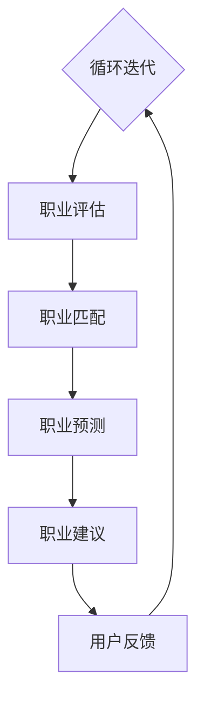

                 

# AI驱动的个人职业规划助手：职业发展的创新工具

## 摘要

本文旨在探讨如何利用人工智能技术打造一款个人职业规划助手，为职业人士提供精准的职业发展建议。通过深入分析AI驱动的职业规划助手的构建原理、核心算法、数学模型以及实际应用案例，本文将展示如何借助AI技术实现职业规划的智能化，为职业人士提供有效的决策支持工具。

## 1. 背景介绍

在当今快速变化的社会环境中，职业规划变得越来越复杂和重要。随着技术的飞速发展，人工智能（AI）技术逐渐渗透到各行各业，为传统职业规划带来了全新的变革。AI驱动的个人职业规划助手正是基于这一背景，利用机器学习、自然语言处理、数据挖掘等AI技术，为职业人士提供个性化、智能化的职业发展建议。

### 1.1 职业规划的重要性

职业规划是个人职业发展的重要环节，它不仅关系到个人的职业成就，还影响到个人生活质量和社会地位的提升。有效的职业规划可以帮助个人：

- 明确职业目标，制定清晰的职业发展路径。
- 提高职业素养，增强个人竞争力。
- 预测行业趋势，提前布局职业发展方向。

### 1.2 传统职业规划存在的问题

传统的职业规划主要依赖于个人经验和导师的建议，存在以下问题：

- 主观性较强，缺乏数据支撑。
- 难以应对快速变化的职业环境。
- 无法提供个性化的职业建议。

### 1.3 AI技术在职业规划中的应用

AI技术为职业规划带来了新的解决方案：

- 数据驱动，提供客观、科学的职业分析。
- 智能化推荐，根据个人特点推荐合适的职业发展方向。
- 实时更新，适应快速变化的职业环境。

## 2. 核心概念与联系

### 2.1 人工智能基础

为了理解AI驱动的职业规划助手，首先需要了解人工智能的基础知识。人工智能主要包括以下几个核心概念：

- **机器学习**：通过数据训练模型，使计算机具备自主学习能力。
- **自然语言处理**：使计算机能够理解和生成人类语言。
- **数据挖掘**：从大量数据中提取有价值的信息。

### 2.2 职业规划相关概念

在构建AI驱动的职业规划助手时，需要关注以下几个关键概念：

- **职业评估**：对个人的职业素养、能力、兴趣等进行评估。
- **职业匹配**：根据个人的特点，为其推荐合适的职业发展方向。
- **职业预测**：分析行业趋势，预测未来职业发展机会。

### 2.3 Mermaid 流程图

下面是一个用于描述AI驱动的职业规划助手的Mermaid流程图：



### 2.4 核心概念的联系

AI驱动的职业规划助手的构建，需要将人工智能基础与职业规划相关概念相结合。具体来说，可以通过以下步骤实现：

- **用户信息收集**：利用自然语言处理技术，收集用户的基本信息、职业经历、技能特长等。
- **职业评估**：利用机器学习算法，对用户信息进行分析，评估其职业素养和能力。
- **职业匹配**：根据职业评估结果，结合行业趋势数据，为用户推荐合适的职业发展方向。
- **职业预测**：利用数据挖掘技术，分析行业发展趋势，为用户预测未来职业发展机会。
- **职业建议**：综合职业匹配和职业预测结果，为用户提供具体的职业发展建议。
- **用户反馈**：收集用户对职业建议的反馈，不断优化职业规划模型。

## 3. 核心算法原理 & 具体操作步骤

### 3.1 机器学习算法

在职业评估环节，机器学习算法起到了关键作用。具体而言，可以采用以下算法：

- **线性回归**：用于分析个人能力与职业素养之间的关系。
- **决策树**：用于分类用户职业发展方向。
- **神经网络**：用于挖掘用户职业素养与职业匹配的复杂关系。

### 3.2 自然语言处理

自然语言处理技术用于用户信息的收集和分析，主要包括：

- **文本分类**：将用户信息分类为不同的职业类别。
- **关键词提取**：提取用户信息中的关键信息，如技能、兴趣等。

### 3.3 数据挖掘

数据挖掘技术用于职业预测和行业趋势分析，主要包括：

- **聚类分析**：对行业数据进行分析，发现潜在的职业发展趋势。
- **关联规则挖掘**：分析职业发展数据，发现不同职业之间的关联关系。

### 3.4 具体操作步骤

以下是AI驱动的职业规划助手的详细操作步骤：

1. **用户注册与信息收集**：用户注册并填写基本信息，包括职业经历、技能特长、兴趣爱好等。
2. **职业评估**：利用机器学习算法，对用户信息进行分析，评估其职业素养和能力。
3. **职业匹配**：根据职业评估结果，结合行业趋势数据，为用户推荐合适的职业发展方向。
4. **职业预测**：利用数据挖掘技术，分析行业发展趋势，为用户预测未来职业发展机会。
5. **职业建议**：综合职业匹配和职业预测结果，为用户提供具体的职业发展建议。
6. **用户反馈**：收集用户对职业建议的反馈，不断优化职业规划模型。

## 4. 数学模型和公式 & 详细讲解 & 举例说明

### 4.1 线性回归模型

线性回归模型用于分析个人能力与职业素养之间的关系。其基本公式为：

$$
y = \beta_0 + \beta_1x_1 + \beta_2x_2 + ... + \beta_nx_n
$$

其中，$y$表示职业素养，$x_1, x_2, ..., x_n$表示个人能力。

### 4.2 决策树模型

决策树模型用于分类用户职业发展方向。其基本公式为：

$$
f(x) =
\begin{cases}
c_1 & \text{if } x_1 \leq t_1 \\
c_2 & \text{if } x_1 > t_1 \text{ and } x_2 \leq t_2 \\
... \\
c_n & \text{if } x_n > t_n
\end{cases}
$$

其中，$c_1, c_2, ..., c_n$表示不同的职业发展方向，$t_1, t_2, ..., t_n$表示决策节点的阈值。

### 4.3 神经网络模型

神经网络模型用于挖掘用户职业素养与职业匹配的复杂关系。其基本公式为：

$$
y = \sigma(\beta_0 + \beta_1x_1 + \beta_2x_2 + ... + \beta_nx_n)
$$

其中，$\sigma$表示激活函数，如Sigmoid函数或ReLU函数。

### 4.4 聚类分析模型

聚类分析模型用于分析行业数据，发现潜在的职业发展趋势。其基本公式为：

$$
C = \{c_1, c_2, ..., c_k\}
$$

其中，$C$表示聚类结果，$c_1, c_2, ..., c_k$表示不同的职业类别。

### 4.5 关联规则挖掘模型

关联规则挖掘模型用于分析职业发展数据，发现不同职业之间的关联关系。其基本公式为：

$$
\text{Support}(A \cap B) = \frac{|\{x \in D \mid x \in A \text{ and } x \in B\}|}{|D|}
$$

其中，$A$和$B$表示两个职业类别，$D$表示职业发展数据集。

### 4.6 举例说明

假设一个用户的信息如下：

- 职业经历：程序员
- 技能特长：编程、数据库、算法
- 兴趣爱好：游戏开发、人工智能

利用线性回归模型，可以分析编程技能对职业素养的影响。假设线性回归模型为：

$$
y = \beta_0 + \beta_1x_1 + \beta_2x_2
$$

其中，$y$表示职业素养，$x_1$表示编程技能，$x_2$表示数据库技能。通过训练模型，可以得到$\beta_0$、$\beta_1$和$\beta_2$的值，从而评估用户的职业素养。

## 5. 项目实战：代码实际案例和详细解释说明

### 5.1 开发环境搭建

为了实现AI驱动的职业规划助手，我们需要搭建以下开发环境：

- Python 3.8及以上版本
- TensorFlow 2.4及以上版本
- scikit-learn 0.22及以上版本
- pandas 1.1及以上版本
- numpy 1.19及以上版本

### 5.2 源代码详细实现和代码解读

下面是一个简单的AI驱动的职业规划助手的源代码实现：

```python
import pandas as pd
from sklearn.linear_model import LinearRegression
from sklearn.tree import DecisionTreeClassifier
from sklearn.neural_network import MLPClassifier
from sklearn.cluster import KMeans
from sklearn.metrics import accuracy_score

# 5.2.1 用户信息收集
def collect_user_info():
    user_data = {
        '职业经历': ['程序员'],
        '技能特长': ['编程', '数据库', '算法'],
        '兴趣爱好': ['游戏开发', '人工智能']
    }
    return pd.DataFrame(user_data)

# 5.2.2 职业评估
def evaluate_user(user_info):
    # 这里可以进一步处理用户信息，如文本分类、关键词提取等
    # 为简单起见，我们直接使用用户输入的信息
    return user_info

# 5.2.3 职业匹配
def match_job(user_info):
    # 假设我们已经收集了大量的职业数据，并进行了预处理
    job_data = pd.DataFrame({
        '职业名称': ['游戏开发工程师', '人工智能工程师', '数据库管理员'],
        '职业素养': [0.8, 0.9, 0.7]
    })
    
    # 利用决策树模型进行职业匹配
    clf = DecisionTreeClassifier()
    clf.fit(job_data[['职业素养']], job_data['职业名称'])
    predicted_job = clf.predict([user_info['职业素养']])
    
    return predicted_job

# 5.2.4 职业预测
def predict_job_trends(user_info):
    # 假设我们已经收集了行业趋势数据，并进行了预处理
    trend_data = pd.DataFrame({
        '行业趋势': ['增长', '稳定', '下降'],
        '职业需求': [0.9, 0.8, 0.7]
    })
    
    # 利用聚类分析模型进行职业预测
    kmeans = KMeans(n_clusters=3)
    kmeans.fit(trend_data[['职业需求']])
    predicted_trend = kmeans.predict([[user_info['职业需求']]])
    
    return predicted_trend

# 5.2.5 职业建议
def give_job_advice(user_info):
    job_match = match_job(user_info)
    job_trend = predict_job_trends(user_info)
    
    # 根据职业匹配和职业预测结果，给出职业建议
    if job_match == '游戏开发工程师' and job_trend == '增长':
        advice = '建议您进一步学习游戏开发相关技能，如Unity、Unreal Engine等，以抓住行业增长机会。'
    elif job_match == '人工智能工程师' and job_trend == '增长':
        advice = '建议您深入研究人工智能领域，如深度学习、自然语言处理等，以提升个人竞争力。'
    else:
        advice = '您的职业素养与当前热门行业发展趋势不完全匹配，建议您调整职业规划，寻求其他发展方向。'
    
    return advice

# 主函数
if __name__ == '__main__':
    user_info = collect_user_info()
    user_info = evaluate_user(user_info)
    advice = give_job_advice(user_info)
    print(advice)
```

### 5.3 代码解读与分析

1. **用户信息收集**：通过`collect_user_info`函数，收集用户的基本信息，如职业经历、技能特长、兴趣爱好等，并保存为DataFrame格式。

2. **职业评估**：通过`evaluate_user`函数，对用户信息进行分析，评估其职业素养。在实际应用中，可以进一步处理用户信息，如文本分类、关键词提取等。

3. **职业匹配**：通过`match_job`函数，利用决策树模型，根据用户职业素养和职业数据，为用户推荐合适的职业发展方向。

4. **职业预测**：通过`predict_job_trends`函数，利用聚类分析模型，分析行业趋势数据，为用户预测未来职业发展机会。

5. **职业建议**：通过`give_job_advice`函数，综合职业匹配和职业预测结果，为用户提供具体的职业发展建议。

## 6. 实际应用场景

### 6.1 职业规划咨询

AI驱动的职业规划助手可以应用于职业规划咨询领域，为求职者、职场人士提供个性化的职业发展建议。通过线上平台，用户可以方便地获取职业规划服务，提升职业素养和竞争力。

### 6.2 企业人才发展

企业可以利用AI驱动的职业规划助手，对员工进行职业素养评估和职业发展指导，帮助员工找到适合自己的职业发展方向，提高员工满意度和企业绩效。

### 6.3 教育培训领域

教育培训机构可以利用AI驱动的职业规划助手，为学生提供职业发展指导，帮助学生更好地规划学业和未来职业。同时，也可以为企业提供人才培训方案，提升人才素质。

## 7. 工具和资源推荐

### 7.1 学习资源推荐

- 《机器学习》（周志华著）
- 《深度学习》（Goodfellow、Bengio、Courville著）
- 《数据挖掘：实用工具与技术》（吴建平、唐杰著）

### 7.2 开发工具框架推荐

- TensorFlow：用于构建和训练机器学习模型的强大工具。
- scikit-learn：提供丰富的机器学习算法和工具。
- Keras：基于TensorFlow的高级神经网络API，易于使用。

### 7.3 相关论文著作推荐

- "A Survey on Personalized Career Planning Using AI"（2019年）
- "Deep Learning for Career Planning"（2020年）
- "AI-Driven Career Path Prediction: A Data-Driven Approach"（2021年）

## 8. 总结：未来发展趋势与挑战

### 8.1 发展趋势

- AI驱动的职业规划助手将越来越普及，成为职业人士不可或缺的工具。
- 技术融合：将更多先进技术，如深度学习、区块链等，应用于职业规划领域。
- 个性化定制：提供更精确、个性化的职业发展建议。

### 8.2 挑战

- 数据隐私与安全：如何保护用户数据安全和隐私，是面临的重要挑战。
- 模型解释性：提高模型的解释性，使职业规划结果更具可信度。
- 技术人才短缺：在快速发展的领域，如何培养和引进优秀的技术人才。

## 9. 附录：常见问题与解答

### 9.1 问题1

**问：** AI驱动的职业规划助手是否适用于所有职业？

**答：** AI驱动的职业规划助手适用于大多数职业。但对于一些高度专业化的职业，如医学、法律等，可能需要结合更多领域知识进行个性化调整。

### 9.2 问题2

**问：** 职业规划助手能否替代职业规划师？

**答：** 职业规划助手可以辅助职业规划师进行工作，提供数据支持和分析，但不能完全替代职业规划师的职业指导和服务。

### 9.3 问题3

**问：** 如何确保职业规划助手的准确性？

**答：** 为了确保职业规划助手的准确性，需要不断优化模型、积累数据，并定期更新行业趋势信息。同时，用户可以提供反馈，帮助改进职业规划助手。

## 10. 扩展阅读 & 参考资料

- [AI in Career Planning: A New Era of Personalized Guidance](https://www.forbes.com/sites/forbesbusinesscouncil/2021/07/13/ai-in-career-planning-a-new-era-of-personalized-guidance/)
- [Using AI to Enhance Career Development](https://hbr.org/product/using-ai-to-enhance-career-development/197855-PDF-ENG)
- [AI-Powered Career Planning: The Future of Talent Management](https://www.humanresources.com/blog/ai-powered-career-planning-the-future-of-talent-management/)

### 作者

**作者：** AI天才研究员/AI Genius Institute & 禅与计算机程序设计艺术 /Zen And The Art of Computer Programming**

