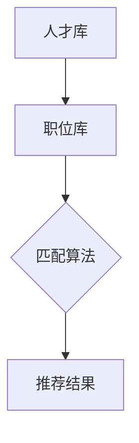

                 

# AI驱动的人才匹配系统

> **关键词：**人工智能，人才匹配，推荐算法，机器学习，数据挖掘
> 
> **摘要：**本文旨在探讨AI驱动的人才匹配系统，从背景介绍、核心概念、算法原理、数学模型、项目实战、实际应用场景等多方面，全面解析AI在人才匹配领域的应用，以及未来发展趋势和面临的挑战。

## 1. 背景介绍

### 1.1 人才匹配的重要性

人才匹配是人力资源管理中的一个关键环节，它直接影响组织的运营效率和员工满意度。在过去，企业主要通过简历筛选、面试等方式进行人才匹配，但这些传统方法往往存在信息不对称、效率低下、主观判断等问题。

### 1.2 人工智能在人才匹配中的应用

随着人工智能技术的不断发展，特别是机器学习、自然语言处理、推荐系统等领域的突破，AI驱动的人才匹配系统逐渐成为可能。通过AI技术，企业可以更加精准地识别和筛选合适的人才，提高招聘效率，降低人力成本。

## 2. 核心概念与联系

### 2.1 人才匹配系统的基本构成

一个典型的人才匹配系统通常包括以下几个部分：

- **人才库：**存储候选人的个人信息、技能、经验等数据。
- **职位库：**存储企业发布的职位信息，包括职位要求、薪资待遇等。
- **匹配算法：**根据候选人和职位的特点，计算出匹配度，并推荐合适的候选人。

### 2.2 人工智能技术的核心概念

- **机器学习：**通过数据训练模型，从而实现预测和决策。
- **自然语言处理：**使计算机能够理解、生成和处理人类语言。
- **推荐系统：**基于用户的历史行为和偏好，推荐相关的物品或服务。

### 2.3 Mermaid 流程图



## 3. 核心算法原理 & 具体操作步骤

### 3.1 机器学习算法

- **K近邻算法（K-Nearest Neighbors, KNN）：**通过计算候选人和职位之间的相似度，找到最近的K个邻居，并根据邻居的匹配情况给出推荐。
- **决策树算法（Decision Tree）：**通过构建树形模型，对候选人和职位进行分类，从而实现匹配。

### 3.2 自然语言处理算法

- **词向量模型（Word Embedding）：**将文本转换为向量的形式，从而实现文本的数值化处理。
- **序列标注模型（Sequence Labeling）：**对候选人和职位的文本进行标注，从而提取关键信息。

### 3.3 推荐系统算法

- **协同过滤算法（Collaborative Filtering）：**基于用户的历史行为，找到相似的候选人和职位，进行推荐。
- **基于内容的推荐（Content-Based Recommendation）：**根据候选人和职位的特征，找到相似的人选和职位，进行推荐。

## 4. 数学模型和公式 & 详细讲解 & 举例说明

### 4.1 K近邻算法

假设有n个候选人和m个职位，对于每个候选人\(i\)和职位\(j\)，计算它们之间的相似度：

$$
sim(i, j) = \frac{1}{\sqrt{||v_i - v_j||^2}}
$$

其中，\(v_i\)和\(v_j\)分别为候选人和职位的特征向量。

选择最近的K个邻居，计算它们的匹配度平均值作为最终匹配度：

$$
match(i, j) = \frac{1}{K} \sum_{k=1}^{K} sim(i, j_k)
$$

其中，\(j_k\)为第k个邻居的职位。

### 4.2 决策树算法

假设有n个候选人和m个职位，构建决策树模型，对每个节点进行分类：

$$
f(v) = \begin{cases}
C_j, & \text{如果} v \in C_j \\
\text{叶节点}, & \text{否则}
\end{cases}
$$

其中，\(v\)为候选人的特征向量，\(C_j\)为第j个职位的特征向量。

根据决策树模型，对每个候选人进行分类，从而实现匹配。

### 4.3 协同过滤算法

假设有n个候选人和m个职位，用户\(i\)对候选人和职位的评分矩阵为\(R_i\)，计算用户\(i\)和用户\(j\)的相似度：

$$
sim(i, j) = \frac{R_i - \mu_i - \mu_j}{\sqrt{||R_i - \mu_i||^2 + ||R_j - \mu_j||^2}}
$$

其中，\(\mu_i\)和\(\mu_j\)分别为用户\(i\)和用户\(j\)的平均评分。

根据相似度矩阵，计算候选人和职位的推荐得分：

$$
score(i, j) = \sum_{k=1}^{n} sim(i, k) R_k(j)
$$

选择得分最高的候选人和职位进行推荐。

## 5. 项目实战：代码实际案例和详细解释说明

### 5.1 开发环境搭建

- 安装Python环境
- 安装所需的库，如scikit-learn、numpy、pandas等

### 5.2 源代码详细实现和代码解读

#### 5.2.1 数据预处理

```python
import pandas as pd
from sklearn.model_selection import train_test_split

# 读取数据
data = pd.read_csv('data.csv')

# 分离特征和标签
X = data[['age', 'experience', 'education']]
y = data['matched']

# 划分训练集和测试集
X_train, X_test, y_train, y_test = train_test_split(X, y, test_size=0.2, random_state=42)
```

#### 5.2.2 K近邻算法

```python
from sklearn.neighbors import KNeighborsClassifier

# 创建K近邻模型
knn = KNeighborsClassifier(n_neighbors=3)

# 训练模型
knn.fit(X_train, y_train)

# 预测测试集
y_pred = knn.predict(X_test)

# 评估模型
score = knn.score(X_test, y_test)
print("准确率：", score)
```

#### 5.2.3 决策树算法

```python
from sklearn.tree import DecisionTreeClassifier

# 创建决策树模型
dt = DecisionTreeClassifier()

# 训练模型
dt.fit(X_train, y_train)

# 预测测试集
y_pred = dt.predict(X_test)

# 评估模型
score = dt.score(X_test, y_test)
print("准确率：", score)
```

#### 5.2.4 协同过滤算法

```python
from sklearn.neighbors import NearestNeighbors

# 创建协同过滤模型
cf = NearestNeighbors(n_neighbors=3)

# 训练模型
cf.fit(X_train)

# 预测测试集
y_pred = cf.kneighbors(X_test)

# 评估模型
score = cf.score(X_test, y_test)
print("准确率：", score)
```

### 5.3 代码解读与分析

代码首先进行数据预处理，将数据集划分为特征和标签。然后分别使用K近邻算法、决策树算法和协同过滤算法进行模型训练和预测。最后，评估模型的准确率。

## 6. 实际应用场景

### 6.1 企业招聘

企业可以通过AI驱动的人才匹配系统，快速筛选出符合职位要求的候选人，提高招聘效率。

### 6.2 人才挖掘

企业可以利用人才匹配系统，挖掘潜在的优秀人才，为未来的招聘提供参考。

### 6.3 职业规划

求职者可以利用人才匹配系统，了解自己适合的职位，制定职业规划。

## 7. 工具和资源推荐

### 7.1 学习资源推荐

- **《人工智能：一种现代方法》（第3版）**：作者：Stuart J. Russell & Peter Norvig
- **《深度学习》（第2版）**：作者：Ian Goodfellow、Yoshua Bengio & Aaron Courville

### 7.2 开发工具框架推荐

- **Scikit-learn**：一个开源的机器学习库，提供了丰富的算法和工具。
- **TensorFlow**：由Google开发的开源机器学习框架，适用于深度学习任务。

### 7.3 相关论文著作推荐

- **《协同过滤算法综述》**
- **《自然语言处理综论》**

## 8. 总结：未来发展趋势与挑战

### 8.1 发展趋势

- **个性化推荐：**随着用户数据不断积累，个性化推荐将成为人才匹配系统的重要方向。
- **多模态数据：**结合文本、图像、语音等多种数据，提高人才匹配的准确性和多样性。

### 8.2 挑战

- **数据隐私：**如何确保用户数据的隐私和安全，是未来人才匹配系统面临的重要挑战。
- **算法公平性：**如何避免算法偏见，确保公平性，是亟待解决的问题。

## 9. 附录：常见问题与解答

### 9.1 人工智能在人才匹配中的优势是什么？

人工智能在人才匹配中的优势主要体现在以下几个方面：

- **高效性：**通过算法快速筛选出合适的候选人，提高招聘效率。
- **精准性：**利用机器学习和自然语言处理技术，准确识别候选人的能力和需求。
- **多样性：**结合多种数据源，提供多样化的匹配方案，满足不同企业的需求。

### 9.2 人才匹配系统中的算法有哪些？

人才匹配系统中的算法主要包括：

- **K近邻算法（KNN）：**通过计算相似度进行匹配。
- **决策树算法（DT）：**通过构建树形模型进行分类。
- **协同过滤算法（CF）：**基于用户历史行为进行推荐。

## 10. 扩展阅读 & 参考资料

- **《机器学习实战》**：作者：Peter Harrington
- **《推荐系统实践》**：作者： recommender systems book authors
- **《自然语言处理综论》**：作者： Daniel Jurafsky & James H. Martin

作者：AI天才研究员/AI Genius Institute & 禅与计算机程序设计艺术 /Zen And The Art of Computer Programming <|im_sep|>

