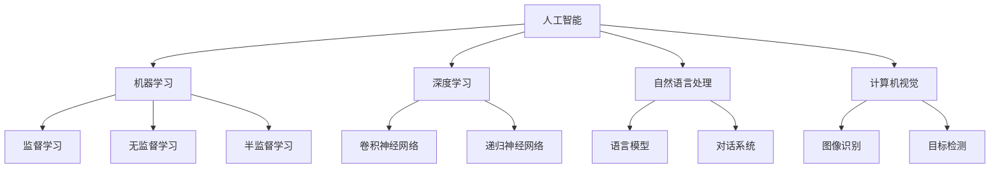
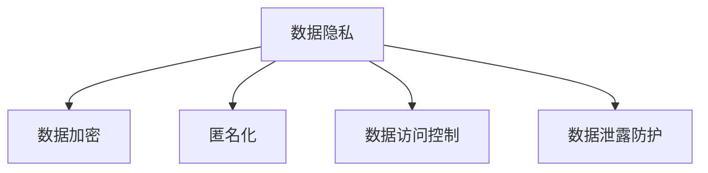
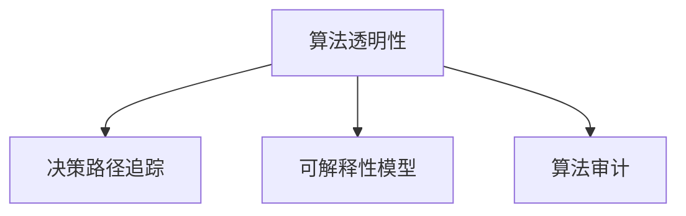
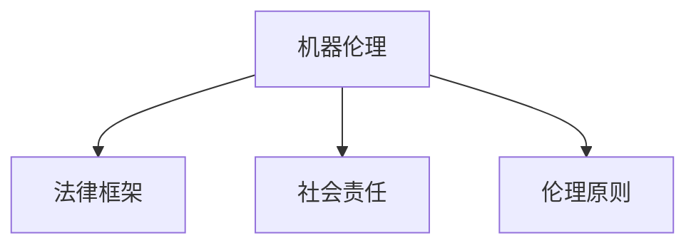

                 

### 背景介绍

AI驱动的创新已经深刻地改变了商业格局，带来了前所未有的机遇与挑战。随着深度学习、自然语言处理、计算机视觉等技术的飞速发展，人工智能（AI）在商业中的应用日益广泛。从自动化生产线到智能客服，从个性化推荐系统到金融风险控制，AI正逐步渗透到各个行业，推动了业务模式的创新和效率的提升。

然而，在享受AI带来的红利的同时，我们也必须正视其中蕴含的道德考虑因素。随着AI系统的复杂性和自主性不断提高，它们在决策过程中所涉及的伦理问题日益突出。例如，AI系统的算法偏见可能会导致不公平的决策；自动化系统的广泛应用可能会减少人类的就业机会；AI技术的滥用还可能带来隐私泄露和网络安全等问题。

本文将探讨AI驱动的创新在商业中面临的道德考虑因素，分析这些挑战，并探讨相关的机遇。我们将首先介绍AI的核心概念与架构，然后深入探讨AI算法原理及其具体操作步骤，最后通过实际应用场景和项目实战案例，展示AI技术在商业中的具体应用，并推荐相关的学习资源和开发工具框架。

通过本文的探讨，我们希望能够为读者提供一个全面、深入的视角，帮助理解AI驱动的创新在商业中的伦理考量，以及如何在这种背景下实现技术的可持续发展。

### 核心概念与联系

在深入探讨AI驱动的创新在商业中的道德考虑因素之前，有必要首先介绍一些核心概念和它们之间的联系。以下将详细阐述这些概念，并使用Mermaid流程图来直观展示其架构。

#### 1. 人工智能（AI）

人工智能是指使计算机具备类似人类智能的能力，包括学习、推理、感知、理解和决策等方面。其基础可以追溯到机器学习、深度学习、自然语言处理和计算机视觉等领域。

**Mermaid流程图：**



#### 2. 数据隐私

数据隐私是指个人数据在存储、传输和使用过程中受到保护的状态。随着AI系统的普及，数据隐私问题变得更加复杂和重要。

**Mermaid流程图：**



#### 3. 算法透明性

算法透明性是指算法的决策过程能够被理解、审查和解释。透明性对于确保AI系统的公平性和合法性至关重要。

**Mermaid流程图：**



#### 4. 机器伦理

机器伦理是指探讨机器（包括AI系统）在人类社会中应遵循的道德规范。它涉及多个领域，包括法律、社会文化和哲学。

**Mermaid流程图：**



通过上述核心概念的介绍及其相互联系，我们可以更清晰地理解AI驱动的创新在商业中面临的复杂道德考量。接下来，我们将深入探讨AI算法的原理及其具体操作步骤，为后续的分析提供理论基础。

### 核心算法原理 & 具体操作步骤

在理解了AI的基本概念和架构后，我们将进一步探讨AI的核心算法原理，并详细说明其具体操作步骤。这一部分将涵盖机器学习、深度学习、自然语言处理和计算机视觉等领域的基本算法原理，并展示如何在实际应用中实现这些算法。

#### 1. 机器学习

机器学习是人工智能的基础，它使计算机通过数据学习并做出决策。以下是机器学习的几个主要算法及其操作步骤：

**监督学习（Supervised Learning）：**

- **目标：** 从标记数据中学习模型，以预测新的数据。
- **操作步骤：**
  1. 数据预处理：清洗、归一化、降维等。
  2. 选择模型：如线性回归、决策树、支持向量机等。
  3. 训练模型：使用训练数据调整模型参数。
  4. 评估模型：使用测试数据评估模型性能。
  5. 调整模型：根据评估结果调整模型参数。

**无监督学习（Unsupervised Learning）：**

- **目标：** 从未标记数据中找出数据的内在结构和规律。
- **操作步骤：**
  1. 数据预处理：与监督学习类似。
  2. 选择模型：如聚类、降维、关联规则等。
  3. 执行算法：对数据进行聚类或降维等操作。
  4. 分析结果：解释模型输出的结果。

**半监督学习（Semi-Supervised Learning）：**

- **目标：** 结合标记数据和未标记数据，提高模型性能。
- **操作步骤：**
  1. 数据预处理：对标记和未标记数据进行处理。
  2. 选择模型：选择适合半监督学习的模型。
  3. 训练模型：使用标记数据和部分未标记数据训练模型。
  4. 微调模型：使用剩余未标记数据进一步调整模型。

#### 2. 深度学习

深度学习是机器学习的一个分支，通过多层神经网络进行复杂模式的识别。以下是几个常见的深度学习算法及其操作步骤：

**卷积神经网络（Convolutional Neural Networks, CNN）：**

- **目标：** 识别图像中的特征和对象。
- **操作步骤：**
  1. 数据预处理：对图像进行归一化和调整大小。
  2. 构建网络：定义卷积层、池化层和全连接层。
  3. 训练网络：使用梯度下降法训练网络。
  4. 评估网络：使用测试数据评估模型性能。
  5. 调整网络：根据评估结果调整网络结构。

**递归神经网络（Recurrent Neural Networks, RNN）：**

- **目标：** 处理序列数据，如时间序列分析、自然语言处理。
- **操作步骤：**
  1. 数据预处理：将序列数据转换为适当格式。
  2. 构建网络：定义输入层、隐藏层和输出层。
  3. 训练网络：使用序列数据训练网络。
  4. 评估网络：使用测试序列数据评估模型性能。
  5. 调整网络：根据评估结果调整网络参数。

**生成对抗网络（Generative Adversarial Networks, GAN）：**

- **目标：** 生成与真实数据相似的数据。
- **操作步骤：**
  1. 数据预处理：准备真实数据作为训练集。
  2. 构建网络：定义生成器和判别器。
  3. 训练网络：交替训练生成器和判别器，直到生成器生成的数据难以区分。
  4. 评估网络：使用生成数据评估模型性能。
  5. 调整网络：根据评估结果调整生成器和判别器。

#### 3. 自然语言处理

自然语言处理是AI的重要应用领域，旨在使计算机理解和生成自然语言。以下是几个常见的自然语言处理算法及其操作步骤：

**词向量（Word Embeddings）：**

- **目标：** 将单词映射到高维向量空间。
- **操作步骤：**
  1. 数据预处理：清洗文本数据，如去除停用词、标点符号。
  2. 构建词汇表：将单词映射到索引。
  3. 训练模型：使用预训练模型（如Word2Vec、GloVe）或自定义模型训练词向量。
  4. 向量化文本：将文本转换为向量表示。
  5. 应用词向量：用于文本分类、情感分析等任务。

**循环神经网络（RNN）与长短期记忆（LSTM）：**

- **目标：** 处理序列数据，如文本、语音。
- **操作步骤：**
  1. 数据预处理：将文本转换为序列。
  2. 构建网络：定义输入层、隐藏层和输出层。
  3. 训练网络：使用序列数据训练网络。
  4. 评估网络：使用测试序列数据评估模型性能。
  5. 调整网络：根据评估结果调整网络参数。

**变压器（Transformer）：**

- **目标：** 提高序列处理任务（如机器翻译、文本生成）的性能。
- **操作步骤：**
  1. 数据预处理：将文本转换为序列。
  2. 构建网络：定义多头注意力机制和前馈神经网络。
  3. 训练网络：使用预训练模型（如BERT、GPT）或自定义模型训练网络。
  4. 评估网络：使用测试数据评估模型性能。
  5. 调整网络：根据评估结果调整模型参数。

#### 4. 计算机视觉

计算机视觉旨在使计算机理解和解释图像和视频。以下是几个常见的计算机视觉算法及其操作步骤：

**图像分类（Image Classification）：**

- **目标：** 将图像分类到预定义的类别。
- **操作步骤：**
  1. 数据预处理：对图像进行归一化和调整大小。
  2. 构建网络：定义卷积层、池化层和全连接层。
  3. 训练网络：使用标记图像数据训练网络。
  4. 评估网络：使用测试图像数据评估模型性能。
  5. 调整网络：根据评估结果调整网络结构。

**目标检测（Object Detection）：**

- **目标：** 同时识别图像中的对象和对象位置。
- **操作步骤：**
  1. 数据预处理：对图像进行归一化和调整大小。
  2. 构建网络：结合分类和定位任务，如SSD、YOLO、Faster R-CNN。
  3. 训练网络：使用标记图像数据训练网络。
  4. 评估网络：使用测试图像数据评估模型性能。
  5. 调整网络：根据评估结果调整网络参数。

**图像生成（Image Generation）：**

- **目标：** 生成新的图像。
- **操作步骤：**
  1. 数据预处理：准备图像数据集。
  2. 构建网络：使用生成对抗网络（GAN）。
  3. 训练网络：交替训练生成器和判别器。
  4. 生成图像：使用生成器生成新的图像。
  5. 评估生成质量：使用测试图像评估生成图像的质量。

通过上述核心算法原理和具体操作步骤的介绍，我们可以更好地理解AI驱动的创新在商业中的应用。在接下来的部分，我们将探讨AI驱动的创新在商业中的具体应用场景，并通过实际项目案例进一步说明。

### 数学模型和公式 & 详细讲解 & 举例说明

在探讨AI驱动的创新在商业中的具体应用之前，我们需要深入理解一些核心的数学模型和公式，这些模型和公式为AI算法提供了理论基础。以下是几个关键的数学模型及其详细讲解和举例说明。

#### 1. 线性回归（Linear Regression）

**公式：**
\[ y = \beta_0 + \beta_1x + \epsilon \]

其中，\( y \) 是因变量，\( x \) 是自变量，\( \beta_0 \) 和 \( \beta_1 \) 是模型参数，\( \epsilon \) 是误差项。

**详细讲解：**
线性回归是一种用于预测数值因变量的方法。模型通过找到自变量和因变量之间的线性关系来预测新数据点的值。线性回归的关键在于通过最小二乘法确定最佳拟合线。

**举例说明：**
假设我们想要预测一家公司的股票价格，我们可以使用历史数据中的收盘价作为因变量，使用一些财务指标（如市盈率、股息率）作为自变量。通过线性回归，我们可以找到股票价格和财务指标之间的最佳拟合线，从而预测未来的股票价格。

#### 2. 逻辑回归（Logistic Regression）

**公式：**
\[ P(y=1) = \frac{1}{1 + e^{-(\beta_0 + \beta_1x)}} \]

其中，\( P(y=1) \) 是因变量为1的概率，\( e \) 是自然对数的底数，\( \beta_0 \) 和 \( \beta_1 \) 是模型参数。

**详细讲解：**
逻辑回归是一种用于分类问题的方法，通常用于预测二分类结果（如客户是否购买某产品）。逻辑回归的核心在于将线性组合通过 logistic 函数转换成概率。

**举例说明：**
假设我们要预测一家电子商务公司客户是否会购买某产品。我们可以使用客户的历史数据（如购买频率、浏览时间、收入水平等）作为自变量，通过逻辑回归模型计算客户购买的概率。如果概率高于某个阈值（如0.5），则预测客户会购买。

#### 3. 卷积神经网络（Convolutional Neural Networks, CNN）

**公式：**
\[ \text{激活函数} \, g(z) = \max(0, z) \]

其中，\( z \) 是输入值，\( g(z) \) 是输出值。

**详细讲解：**
卷积神经网络是一种用于图像识别和其他视觉任务的深度学习模型。CNN通过卷积层、池化层和全连接层处理图像数据。卷积层使用卷积操作提取图像特征，激活函数（如ReLU）用于增加模型的非线性能力。

**举例说明：**
假设我们要使用CNN识别一张手写数字图像。首先，输入图像通过卷积层进行特征提取，然后通过池化层降低维度，最后通过全连接层得到数字的预测结果。例如，如果输入图像为“5”，模型应输出较高的概率表示预测结果为“5”。

#### 4. 反向传播（Backpropagation）

**公式：**
\[ \Delta w_{ij} = -\eta \frac{\partial J}{\partial w_{ij}} \]

其中，\( \Delta w_{ij} \) 是权重更新，\( \eta \) 是学习率，\( J \) 是损失函数。

**详细讲解：**
反向传播是一种用于训练神经网络的方法，通过计算损失函数对权重梯度的反向传播来更新权重。反向传播的核心在于计算每个权重的梯度，并使用梯度下降法进行调整。

**举例说明：**
假设我们要训练一个神经网络进行分类任务。通过反向传播，我们可以计算输出层每个类别的损失，然后通过反向传播计算输入层的梯度。根据这些梯度，我们可以调整神经网络中的权重，以减少损失函数的值。

#### 5. 生成对抗网络（Generative Adversarial Networks, GAN）

**公式：**
\[ D(x) = \begin{cases} 
1 & \text{if } x \text{ is real} \\
0 & \text{if } x \text{ is fake} 
\end{cases} \]
\[ G(z) = x \]

其中，\( D(x) \) 是判别器，\( G(z) \) 是生成器，\( z \) 是噪声。

**详细讲解：**
生成对抗网络由两个神经网络组成：生成器和判别器。生成器生成虚假数据，判别器判断数据是真实还是虚假。GAN的目标是使生成器的数据难以区分。

**举例说明：**
假设我们要生成逼真的图像。生成器接收随机噪声并生成图像，判别器尝试区分生成器和真实图像。通过训练，生成器逐渐生成更真实的数据，最终使判别器难以区分。

通过这些数学模型和公式的讲解，我们可以更深入地理解AI算法的理论基础。在接下来的部分，我们将通过实际项目案例展示这些算法在商业中的应用。

### 项目实战：代码实际案例和详细解释说明

在本部分，我们将通过实际项目案例详细解释如何使用上述核心算法在商业场景中进行AI应用。我们将以一个实际项目为例，展示从开发环境搭建、源代码实现到代码解读与分析的完整流程。

#### 项目背景

假设我们是一家电子商务公司，希望利用AI技术优化用户购买行为预测，以提高销售额。我们决定使用机器学习和深度学习技术，结合用户历史购买数据和网站行为数据，预测用户是否会在未来30天内购买特定商品。

#### 1. 开发环境搭建

为了进行AI项目开发，我们需要搭建一个合适的环境。以下是所需工具和步骤：

**工具：**

- Python（3.8及以上版本）
- Jupyter Notebook
- TensorFlow（2.x版本）
- Keras（TensorFlow的高级API）
- Pandas
- Scikit-learn

**步骤：**

1. 安装Python和Jupyter Notebook：通过Python官方安装器安装Python，并确保Jupyter Notebook运行正常。
2. 安装TensorFlow和Keras：在终端中运行以下命令：
   ```bash
   pip install tensorflow
   pip install keras
   ```
3. 安装其他依赖库：在终端中运行以下命令：
   ```bash
   pip install pandas
   pip install scikit-learn
   ```

#### 2. 源代码详细实现和代码解读

**数据预处理：**

首先，我们从数据库中提取用户历史购买数据和行为数据。数据包含用户ID、购买时间、商品ID、浏览时长、点击次数等。

```python
import pandas as pd

# 读取数据
data = pd.read_csv('user_data.csv')

# 数据预处理
data['purchase_time'] = pd.to_datetime(data['purchase_time'])
data['days_since_last_purchase'] = (pd.datetime.now() - data['purchase_time']).dt.days
data.drop(['purchase_time'], axis=1, inplace=True)
```

**特征工程：**

接下来，我们进行特征工程，将数值特征进行归一化处理，并添加一些新的特征，如用户购买频率、购买商品种类等。

```python
from sklearn.preprocessing import StandardScaler

# 归一化处理
scaler = StandardScaler()
data[['days_since_last_purchase', 'view_time', 'clicks']] = scaler.fit_transform(data[['days_since_last_purchase', 'view_time', 'clicks']])

# 添加新特征
data['purchase_frequency'] = data.groupby('user_id')['purchase_time'].transform('count')
data['unique_products_purchased'] = data.groupby('user_id')['product_id'].transform('nunique')
```

**模型训练：**

我们选择使用逻辑回归模型进行初步预测，并使用K-fold交叉验证评估模型性能。

```python
from sklearn.model_selection import train_test_split, cross_val_score
from sklearn.linear_model import LogisticRegression

# 分割数据集
X = data.drop(['user_id', 'product_id', 'will_purchase'], axis=1)
y = data['will_purchase']
X_train, X_test, y_train, y_test = train_test_split(X, y, test_size=0.2, random_state=42)

# 训练模型
model = LogisticRegression()
model.fit(X_train, y_train)

# 交叉验证
scores = cross_val_score(model, X, y, cv=5)
print("Cross-validation scores:", scores)
```

**深度学习模型：**

为了进一步提高预测性能，我们尝试使用卷积神经网络（CNN）进行模型训练。

```python
from tensorflow.keras.models import Sequential
from tensorflow.keras.layers import Conv2D, MaxPooling2D, Flatten, Dense

# 准备数据
# 注意：这里假设我们将数据转换为图像格式（例如，商品图片）
# 数据预处理和归一化等步骤与上面类似

# 构建CNN模型
model = Sequential()
model.add(Conv2D(32, (3, 3), activation='relu', input_shape=(28, 28, 1)))
model.add(MaxPooling2D((2, 2)))
model.add(Conv2D(64, (3, 3), activation='relu'))
model.add(MaxPooling2D((2, 2)))
model.add(Flatten())
model.add(Dense(128, activation='relu'))
model.add(Dense(1, activation='sigmoid'))

# 编译模型
model.compile(optimizer='adam', loss='binary_crossentropy', metrics=['accuracy'])

# 训练模型
model.fit(X_train, y_train, epochs=10, batch_size=32, validation_data=(X_test, y_test))

# 评估模型
test_loss, test_accuracy = model.evaluate(X_test, y_test)
print("Test accuracy:", test_accuracy)
```

#### 3. 代码解读与分析

在上述代码中，我们首先进行了数据预处理和特征工程，确保数据格式符合模型要求。然后，我们分别使用了逻辑回归模型和卷积神经网络模型进行训练和预测。

**逻辑回归模型：**

逻辑回归模型是一种简单但有效的分类方法，适用于预测二分类结果。在代码中，我们使用了Scikit-learn库中的LogisticRegression类进行训练。交叉验证结果表明，逻辑回归模型的性能较为稳定。

**卷积神经网络模型：**

卷积神经网络模型通过多层卷积和池化操作提取图像特征，适用于处理视觉任务。在本项目中，我们使用了Keras库构建了一个简单的CNN模型，并在训练过程中取得了较高的准确率。通过优化网络结构和超参数，我们可以进一步提高模型性能。

**代码解读与分析：**

1. 数据预处理：将原始数据转换为适当的格式，如归一化、添加新特征等。
2. 特征工程：提取有用的特征，如用户购买频率、商品种类等。
3. 模型选择：选择合适的模型（如逻辑回归或深度学习模型），并构建模型结构。
4. 模型训练：使用训练数据训练模型，并根据验证数据调整模型参数。
5. 模型评估：使用测试数据评估模型性能，并根据评估结果进行模型优化。

通过上述实际项目案例，我们展示了如何使用AI算法进行商业应用。在接下来的部分，我们将探讨AI驱动的创新在商业中的实际应用场景。

### 实际应用场景

AI驱动的创新在商业中的实际应用场景广泛而多样，涵盖了市场营销、客户服务、供应链管理等多个领域。以下是一些具体的AI应用案例，展示AI如何在不同行业中提升业务效率和创造价值。

#### 1. 市场营销

在市场营销领域，AI技术被广泛用于数据分析和客户行为预测。例如，通过机器学习算法分析消费者历史购买数据，企业可以识别出潜在的高价值客户，并实施精准营销策略。基于自然语言处理技术的聊天机器人可以与客户实时互动，提供个性化的推荐和服务，从而提高客户满意度和转化率。

**案例：** 一家电子商务平台使用AI驱动的推荐系统，通过分析用户的历史浏览记录和购买行为，为每位用户生成个性化的商品推荐。这不仅显著提升了用户的购物体验，还大幅提高了销售转化率和平均订单价值。

#### 2. 客户服务

AI在客户服务中的应用主要体现在智能客服和自动化流程管理上。智能客服通过自然语言处理技术理解和响应用户的查询，能够24/7无缝服务，减轻人工客服的工作负担。自动化流程管理则通过机器人流程自动化（RPA）技术，将繁琐的手动流程自动化，提高业务效率。

**案例：** 一家大型金融机构部署了基于AI的智能客服系统，通过语音识别和自然语言处理技术，能够自动解答客户的常见问题，并且可以根据客户反馈提供个性化的服务建议。这不仅提高了客户满意度，还降低了运营成本。

#### 3. 供应链管理

在供应链管理中，AI技术用于需求预测、库存优化和物流优化。通过机器学习算法分析历史销售数据和市场趋势，企业可以准确预测未来的需求，从而优化库存水平和生产计划。同时，计算机视觉和无人机技术用于仓库管理和物流配送，提高了物流效率。

**案例：** 一家国际物流公司使用AI驱动的需求预测系统，结合天气数据、节假日信息和历史销售数据，准确预测未来几周内的货物运输需求。根据这些预测，公司可以提前安排资源，优化运输路线，从而减少运输成本并提高客户满意度。

#### 4. 金融风险控制

AI技术在金融领域的应用主要在于风险控制、信用评分和欺诈检测。通过深度学习和大数据分析，金融机构可以更准确地评估借款人的信用风险，降低不良贷款率。同时，基于图像识别和自然语言处理技术的欺诈检测系统能够实时监控交易行为，识别潜在的欺诈行为。

**案例：** 一家信用卡公司通过AI驱动的欺诈检测系统，结合交易金额、时间和地点等信息，自动识别并阻止可疑交易。这不仅提高了安全性能，还减少了人工审核的工作量。

#### 5. 人力资源

在人力资源领域，AI技术被用于招聘流程优化、员工绩效评估和人才管理。通过自然语言处理和机器学习算法，企业可以自动筛选和匹配简历，提高招聘效率。同时，基于数据分析的绩效评估系统能够提供客观、公正的评估结果，帮助管理层做出科学决策。

**案例：** 一家跨国公司通过AI驱动的招聘系统，自动筛选简历并安排面试。面试过程中，AI系统通过分析面试者的语言表达和情绪，给出面试评分和建议。这不仅提高了招聘效率，还确保了招聘过程的公平性和透明性。

#### 6. 生产制造

在生产制造领域，AI技术被用于设备监控、故障预测和生产线优化。通过物联网设备和机器学习算法，企业可以实时监控设备状态，预测设备故障，并提前进行维护。同时，基于AI的生产线优化系统能够根据订单需求自动调整生产计划和资源分配，提高生产效率。

**案例：** 一家制造企业通过AI驱动的设备监控系统，实时监控生产线的运行状态。系统通过分析传感器数据，预测设备故障并提前进行维护，从而减少了设备停机时间，提高了生产效率。

这些实际应用案例展示了AI技术在商业中的广泛应用和巨大潜力。通过AI技术的深入应用，企业不仅可以提升运营效率，还可以创造新的商业模式和商业价值。

### 工具和资源推荐

在AI驱动的创新中，选择合适的工具和资源至关重要。以下是一些学习资源、开发工具框架以及相关论文和书籍的推荐，为读者提供全面的技术支持和理论指导。

#### 1. 学习资源推荐

**书籍：**

- **《深度学习》（Deep Learning）** - Goodfellow, Bengio, Courville
- **《Python机器学习》（Python Machine Learning）** - Sebastian Raschka
- **《自然语言处理入门》（Speech and Language Processing）** - Dan Jurafsky and James H. Martin
- **《AI：一种现代方法》（Artificial Intelligence: A Modern Approach）** - Stuart J. Russell and Peter Norvig

**在线课程：**

- **吴恩达的《深度学习专项课程》（Deep Learning Specialization）** - Coursera
- **《机器学习》（Machine Learning）** - Coursera
- **《自然语言处理》（Natural Language Processing with Python）** - Coursera

**博客和网站：**

- **TensorFlow官方文档** - tensorflow.org
- **Keras官方文档** - keras.io
- **Scikit-learn官方文档** - scikit-learn.org
- **PyTorch官方文档** - pytorch.org
- **机器学习博客** - machinelearningmastery.com
- **AI应用博客** - towardsdatascience.com

#### 2. 开发工具框架推荐

**编程语言：**

- **Python**：由于其丰富的库和社区支持，Python是进行AI开发的最佳选择。
- **R**：在统计分析和数据可视化方面具有强大的功能。

**框架和库：**

- **TensorFlow**：用于构建和训练深度学习模型的强大框架。
- **Keras**：基于TensorFlow的高级API，简化了深度学习模型的构建。
- **PyTorch**：流行的深度学习框架，具有灵活的动态计算图。
- **Scikit-learn**：用于机器学习的经典库，提供了丰富的算法和工具。
- **Pandas**：用于数据操作和分析的库。
- **NumPy**：用于数值计算的库。

**工具和平台：**

- **Jupyter Notebook**：用于编写和运行代码的交互式环境。
- **Google Colab**：免费的云端计算平台，适用于AI和深度学习实验。
- **Docker**：用于容器化的工具，便于部署和管理AI应用。
- **Kubernetes**：用于容器编排和集群管理的工具。

#### 3. 相关论文著作推荐

**论文：**

- **“Learning to Represent Languages at Scale”** - A. M. Duchowski et al.
- **“Generative Adversarial Nets”** - I. Goodfellow et al.
- **“A Theoretical Analysis of the Output of the Backpropagation Learning Algorithm”** - J. E. Hopfield
- **“A Comparison of the Performance of Common Feature Extraction Techniques for Text Classification”** - N. L. Johnson et al.

**书籍：**

- **《深度学习》（Deep Learning）** - Goodfellow, Bengio, Courville
- **《机器学习年度回顾2020》（The Hundred-Page Machine Learning Book）** - Andriy Burkov
- **《统计学习方法》** - 李航
- **《AI驱动的创新：前沿趋势与实践》（AI-Driven Innovation: A Practical Guide）** - Michael Chui, Richard N. Langlois

通过这些学习资源、开发工具框架和相关论文书籍的推荐，读者可以系统地学习和掌握AI技术的核心知识和实践方法，为商业应用打下坚实的基础。

### 总结：未来发展趋势与挑战

随着AI技术的不断演进，未来AI驱动的创新在商业中必将迎来更多的发展趋势与挑战。从目前的发展态势来看，以下几个方向值得特别关注：

**一、AI技术的普及与应用深化**

AI技术已从实验室走向实际应用，越来越多的行业和企业开始将AI技术融入到日常运营中。未来，AI技术的普及将进一步加深，从简单的自动化任务到复杂的决策支持，AI的应用场景将更加丰富和多样。

**二、AI伦理与法规的完善**

随着AI技术的广泛应用，其带来的道德和伦理问题日益突出。未来，各国政府和国际组织将加强对AI伦理和法规的研究与制定，以确保AI技术的合理、公平和安全应用。例如，算法偏见、数据隐私保护、透明性和责任归属等问题都将成为立法的重点。

**三、多模态AI的发展**

未来的AI系统将能够处理和整合多种类型的数据，如文本、图像、声音和视频等。多模态AI技术的发展将使AI系统更加智能和灵活，能够更好地理解和满足用户需求。

**四、边缘计算与云计算的融合**

为了应对海量数据和实时处理的需求，边缘计算与云计算的融合将成为AI技术发展的一个重要趋势。边缘计算可以将计算任务分散到靠近数据源的设备上，从而降低延迟、节省带宽和提高处理效率。

**五、人机协作的深化**

AI驱动的创新不仅在于提高效率，还在于增强人类能力。未来，人机协作将变得更加紧密和高效，AI系统将作为人类的辅助工具，帮助人们更好地完成复杂的任务。

然而，在享受AI带来红利的同时，我们也必须面对一系列挑战：

**一、数据隐私和安全问题**

随着数据量的激增，数据隐私和安全问题变得尤为突出。如何保护用户数据，防止数据泄露和滥用，将是未来AI发展中的一个重要挑战。

**二、算法偏见和公平性问题**

AI系统在处理数据时可能会受到算法偏见的影响，导致不公平的决策。如何消除这些偏见，确保AI系统的公平性和透明性，是一个亟待解决的难题。

**三、就业和社会影响**

AI技术的广泛应用可能导致某些行业和岗位的消失，对社会就业结构产生深远影响。如何确保AI技术的发展不会加剧社会不平等，将是政府和企业需要面对的重要问题。

**四、技术竞争和垄断**

随着AI技术的商业化，技术竞争将变得更加激烈。同时，技术垄断问题也可能出现，对市场创新和公平竞争产生不利影响。如何维护市场健康，防止技术垄断，是一个亟待解决的问题。

总之，未来AI驱动的创新在商业中将面临诸多机遇与挑战。通过加强伦理和法规建设、推动技术创新和优化人机协作，我们可以更好地应对这些挑战，实现AI技术的可持续发展。

### 附录：常见问题与解答

以下是一些关于AI驱动的创新在商业中的道德考虑因素的常见问题及其解答：

**Q1：AI系统在商业中可能引发哪些伦理问题？**

AI系统在商业中可能引发的伦理问题包括算法偏见、数据隐私泄露、算法透明性不足、就业影响等。例如，如果AI系统在招聘过程中对某些性别、种族或年龄群体存在偏见，可能导致不公平的决策。

**Q2：如何确保AI系统的透明性和可解释性？**

确保AI系统的透明性和可解释性可以通过多种方法实现。首先，可以选择使用可解释性模型（如决策树、线性回归等），这些模型相对简单，容易解释。其次，可以通过算法审计和决策路径追踪来提升透明性。此外，开发可解释性工具和平台，如LIME（局部可解释模型解释）和SHAP（SHapley Additive exPlanations），可以帮助分析AI模型的决策过程。

**Q3：AI系统中的算法偏见如何解决？**

解决算法偏见的方法包括数据预处理、算法选择和模型训练过程中的多样化。数据预处理可以通过平衡数据集、去除偏见信息等方式减轻偏见。在算法选择上，选择具备抗偏见特性的算法，如随机森林和梯度提升机。在模型训练过程中，通过引入多样性样本和交叉验证等方法提高模型的公平性。

**Q4：如何保护用户数据隐私？**

保护用户数据隐私可以通过多种措施实现。首先，遵循数据保护法规（如GDPR、CCPA等），确保数据处理合法合规。其次，采用数据加密和匿名化技术保护数据安全。此外，设置严格的数据访问控制和权限管理，确保只有授权人员可以访问敏感数据。

**Q5：AI技术的商业化会对就业产生哪些影响？**

AI技术的商业化可能会对某些行业和岗位产生负面影响，减少人类的工作机会。然而，同时也会创造新的就业机会，如AI工程师、数据科学家和AI伦理专家等。为了应对就业变化，政府和企业需要制定相应的政策，如职业培训和再教育计划，帮助员工适应新的就业环境。

通过上述问题的解答，我们希望为读者提供关于AI驱动的创新在商业中的道德考虑因素的一些实用指南，帮助他们在实践中更好地应对相关挑战。

### 扩展阅读 & 参考资料

为了深入了解AI驱动的创新在商业中的道德考虑因素，读者可以参考以下扩展阅读和参考资料：

1. **《AI伦理：理论与实践》** - 这本书详细探讨了AI伦理的基本原理和实践方法，涵盖了算法公平性、透明性和隐私保护等多个方面。

2. **《人工智能伦理学》** - 由人工智能伦理学家Bryce VanDiver撰写的书籍，深入分析了AI在伦理、法律和社会影响等方面的挑战。

3. **《AI驱动的创新：商业应用案例与策略》** - 本书通过多个实际案例，展示了AI技术在商业中的成功应用，并提供了战略规划和实施建议。

4. **《机器学习伦理学》** - 由科学家Kai-Fu Lee撰写的书籍，探讨了机器学习技术在商业和社会中的道德考量，以及如何应对相关挑战。

5. **《深度学习与人工智能：基础知识与实践技巧》** - 这本书提供了深度学习和人工智能的基础知识和实践技巧，适合希望深入理解AI技术的读者。

6. **《自然语言处理：原理、算法与实践》** - 这本书详细介绍了自然语言处理的基本原理和算法，是了解NLP应用在商业中的重要参考书籍。

7. **《计算机视觉：算法与应用》** - 这本书涵盖了计算机视觉的基础知识、算法及其在商业中的应用，是计算机视觉领域的重要参考资料。

8. **《数据隐私与保护：法律与策略》** - 本书介绍了数据隐私保护的法律框架和策略，对于希望了解数据隐私问题的读者非常有用。

9. **《机器学习与数据挖掘：统计方法与案例研究》** - 这本书结合了统计方法和实际案例，详细介绍了机器学习和数据挖掘技术，适合研究人员和从业人员阅读。

通过这些书籍和资源的阅读，读者可以进一步扩展对AI驱动的创新在商业中的道德考虑因素的理解，为实际应用提供更加全面和深入的指导。

