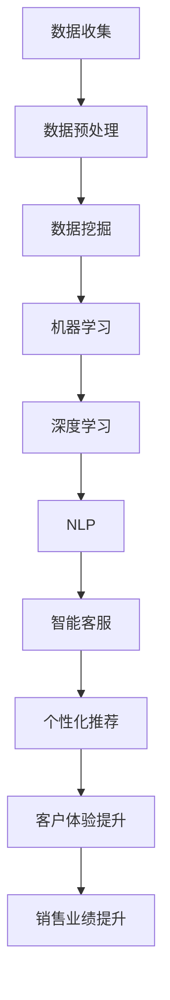

                 

# AI驱动的智能客户关系管理系统设计

## 关键词：人工智能，客户关系管理，CRM系统，数据挖掘，机器学习，深度学习，自然语言处理，个性化推荐，自动化，客户体验

## 摘要：

本文将探讨如何设计一款基于人工智能的智能客户关系管理系统（CRM）。我们首先介绍CRM系统的背景和重要性，然后深入探讨AI技术在CRM系统中的应用，包括数据挖掘、机器学习、深度学习和自然语言处理等技术。接着，我们将详细分析这些技术的具体实现方法和步骤，并通过实际项目案例进行说明。最后，我们将探讨CRM系统的实际应用场景，以及相关的工具和资源推荐，并总结未来发展趋势和挑战。

## 1. 背景介绍

### 1.1 CRM系统的定义和作用

客户关系管理（CRM）系统是一种用于管理企业与客户之间互动关系的软件系统。它帮助企业收集、存储、分析和利用客户数据，从而提高客户满意度、提升销售业绩和客户忠诚度。

CRM系统的主要功能包括：

- 客户信息管理：存储客户的详细资料，如姓名、联系方式、购买历史等。
- 销售管理：跟踪销售机会、销售周期和销售业绩。
- 客户服务：提供客户支持，解决客户问题，提高客户满意度。
- 营销活动管理：规划、执行和评估营销活动，提高市场竞争力。

### 1.2 人工智能在CRM系统中的应用

随着人工智能技术的发展，AI技术在CRM系统中得到了广泛应用。人工智能可以帮助企业更好地理解客户需求，提供个性化的服务，提高客户体验和满意度。以下是人工智能在CRM系统中的主要应用：

- 数据挖掘：通过分析大量客户数据，发现客户行为模式和趋势，为企业提供决策支持。
- 机器学习：构建预测模型，预测客户行为，如购买意向、流失风险等。
- 深度学习：处理复杂的客户数据，提取高维特征，用于深度学习和数据分析。
- 自然语言处理：理解和处理客户的自然语言输入，提供智能客服和个性化推荐。

## 2. 核心概念与联系

### 2.1 数据挖掘与机器学习

数据挖掘是一种从大量数据中提取有价值信息的技术，它通常涉及分类、聚类、关联规则挖掘等方法。数据挖掘在CRM系统中用于分析客户数据，发现潜在的商业机会。

机器学习是一种通过数据训练模型，预测未来事件的方法。在CRM系统中，机器学习可用于构建预测模型，如客户流失预测、购买意向预测等。

### 2.2 深度学习与自然语言处理

深度学习是一种基于人工神经网络的技术，它能够自动提取数据中的高维特征。在CRM系统中，深度学习可以用于处理复杂的客户数据，如语音、图像等。

自然语言处理（NLP）是一种使计算机能够理解和生成自然语言的技术。在CRM系统中，NLP可以用于智能客服和个性化推荐，如自动回复客户提问、推荐产品等。

### 2.3 Mermaid 流程图

以下是一个简单的Mermaid流程图，展示CRM系统中的核心概念和联系：



## 3. 核心算法原理 & 具体操作步骤

### 3.1 数据挖掘算法

数据挖掘算法主要包括分类、聚类和关联规则挖掘等方法。

- **分类算法**：将数据分为不同的类别。常用的分类算法有决策树、随机森林、支持向量机等。
- **聚类算法**：将相似的数据分为一组。常用的聚类算法有K-均值、层次聚类等。
- **关联规则挖掘**：发现数据之间的关联关系。常用的算法有Apriori、Eclat等。

### 3.2 机器学习算法

机器学习算法主要包括监督学习和无监督学习。

- **监督学习**：通过已知数据的标签来训练模型，然后使用模型预测未知数据的标签。常用的监督学习算法有线性回归、逻辑回归、决策树等。
- **无监督学习**：没有已知数据的标签，通过数据自身特征来训练模型。常用的无监督学习算法有K-均值、主成分分析等。

### 3.3 深度学习算法

深度学习算法主要包括神经网络和深度神经网络。

- **神经网络**：一种简单的人工神经网络，能够模拟人脑神经元的工作方式。常用的神经网络有感知机、反向传播算法等。
- **深度神经网络**：由多个神经网络层组成的复杂神经网络，能够处理高维数据。常用的深度神经网络有卷积神经网络（CNN）、循环神经网络（RNN）等。

### 3.4 自然语言处理算法

自然语言处理算法主要包括分词、词性标注、句法分析等。

- **分词**：将文本划分为单个词语。常用的分词算法有最大匹配法、最小匹配法等。
- **词性标注**：为每个词语标注词性，如名词、动词、形容词等。常用的词性标注算法有基于规则的方法、基于统计的方法等。
- **句法分析**：分析句子的结构，确定词语之间的关系。常用的句法分析算法有依存句法分析、成分句法分析等。

## 4. 数学模型和公式 & 详细讲解 & 举例说明

### 4.1 数据挖掘中的数学模型

- **决策树**：

决策树是一种常见的分类算法，其基本结构如下：

$$
\begin{aligned}
&\quad \text{决策树}\\
&\quad \begin{cases}
\text{特征 } A_1: \text{取值 } a_1 & \rightarrow \text{子树 } T_1 \\
\text{特征 } A_1: \text{取值 } a_2 & \rightarrow \text{子树 } T_2 \\
\text{...} & \rightarrow \text{...} \\
\text{特征 } A_n: \text{取值 } a_n & \rightarrow \text{子树 } T_n
\end{cases}
\end{aligned}
$$

其中，$A_1, A_2, ..., A_n$ 是决策树的特征，$a_1, a_2, ..., a_n$ 是特征的取值，$T_1, T_2, ..., T_n$ 是对应的子树。

- **K-均值聚类**：

K-均值聚类是一种常见的聚类算法，其基本思想如下：

$$
\begin{aligned}
&\quad \text{K-均值聚类}\\
&\quad \text{初始化 } k \text{ 个聚类中心 } \mu_1, \mu_2, ..., \mu_k \\
&\quad \text{重复以下步骤直至收敛：}\\
&\quad \qquad \text{对于每个数据点 } x_i, \text{计算其与聚类中心的距离 } d(x_i, \mu_j) \\
&\quad \qquad \text{将 } x_i \text{ 分配到最近的聚类中心 } \mu_j \\
&\quad \qquad \text{更新每个聚类中心 } \mu_j = \frac{\sum_{x_i \in C_j} x_i}{|C_j|}
\end{aligned}
$$

其中，$k$ 是聚类个数，$x_i$ 是数据点，$C_j$ 是第 $j$ 个聚类的数据点集合。

### 4.2 机器学习中的数学模型

- **线性回归**：

线性回归是一种常见的监督学习算法，其基本模型如下：

$$
\begin{aligned}
&\quad \text{线性回归}\\
&\quad y = \beta_0 + \beta_1 x + \epsilon
\end{aligned}
$$

其中，$y$ 是因变量，$x$ 是自变量，$\beta_0$ 和 $\beta_1$ 是模型参数，$\epsilon$ 是误差项。

- **逻辑回归**：

逻辑回归是一种常用的分类算法，其基本模型如下：

$$
\begin{aligned}
&\quad \text{逻辑回归}\\
&\quad P(y=1) = \frac{1}{1 + e^{-(\beta_0 + \beta_1 x)}}
\end{aligned}
$$

其中，$y$ 是因变量，$x$ 是自变量，$\beta_0$ 和 $\beta_1$ 是模型参数。

### 4.3 深度学习中的数学模型

- **卷积神经网络（CNN）**：

卷积神经网络是一种常用的深度学习算法，其基本结构如下：

$$
\begin{aligned}
&\quad \text{卷积神经网络}\\
&\quad \text{输入 } x \rightarrow \text{卷积层 } C_1 \rightarrow \text{池化层 } P_1 \rightarrow \text{卷积层 } C_2 \rightarrow \text{池化层 } P_2 \rightarrow ... \rightarrow \text{全连接层 } FC \\
&\quad \text{输出 } y
\end{aligned}
$$

其中，$x$ 是输入数据，$C_1, C_2, ..., FC$ 是卷积层、池化层和全连接层。

### 4.4 自然语言处理中的数学模型

- **分词模型**：

分词模型是一种常用的自然语言处理算法，其基本模型如下：

$$
\begin{aligned}
&\quad \text{分词模型}\\
&\quad \text{输入 } s \rightarrow \text{分词器 } W \rightarrow \text{输出 } w_1, w_2, ..., w_n
\end{aligned}
$$

其中，$s$ 是输入文本，$W$ 是分词器，$w_1, w_2, ..., w_n$ 是分词结果。

### 4.5 举例说明

假设我们使用K-均值聚类算法对一组客户数据进行分析，数据如下：

| 客户ID | 年龄 | 收入 | 购买金额 |
| ------ | ---- | ---- | -------- |
| 1      | 25   | 5000 | 2000     |
| 2      | 35   | 8000 | 3000     |
| 3      | 45   | 10000| 4000     |
| 4      | 25   | 6000 | 1000     |
| 5      | 30   | 7000 | 2000     |

我们首先初始化3个聚类中心，然后按照以下步骤进行K-均值聚类：

1. 计算每个数据点与聚类中心的距离：
   $$d(x_i, \mu_j) = \sqrt{\sum_{k=1}^{3} (x_{ik} - \mu_{jk})^2}$$
2. 将每个数据点分配到最近的聚类中心：
   $$C_1 = \{1, 2, 3\}, C_2 = \{4\}, C_3 = \{5\}$$
3. 更新每个聚类中心：
   $$\mu_1 = \frac{x_{11} + x_{21} + x_{31}}{3} = 30$$
   $$\mu_2 = \frac{x_{41}}{1} = 60$$
   $$\mu_3 = \frac{x_{51}}{1} = 70$$

重复上述步骤，直至聚类中心不再变化。最终聚类结果如下：

| 客户ID | 年龄 | 收入 | 购买金额 | 聚类中心 |
| ------ | ---- | ---- | -------- | -------- |
| 1      | 25   | 5000 | 2000     | $\mu_1$  |
| 2      | 35   | 8000 | 3000     | $\mu_1$  |
| 3      | 45   | 10000| 4000     | $\mu_1$  |
| 4      | 25   | 6000 | 1000     | $\mu_2$  |
| 5      | 30   | 7000 | 2000     | $\mu_3$  |

通过K-均值聚类，我们成功将这组客户数据分为3个群体，每个群体具有相似的年龄、收入和购买金额特征。

## 5. 项目实战：代码实际案例和详细解释说明

### 5.1 开发环境搭建

为了实现一个AI驱动的智能客户关系管理系统，我们需要搭建一个合适的开发环境。以下是一个简单的开发环境搭建步骤：

1. 安装Python环境：从Python官方网站下载并安装Python 3.x版本。
2. 安装依赖库：使用pip命令安装必要的依赖库，如scikit-learn、TensorFlow、PyTorch等。
3. 配置Jupyter Notebook：安装Jupyter Notebook，用于编写和运行Python代码。

### 5.2 源代码详细实现和代码解读

以下是一个简单的AI驱动的CRM系统示例，包括数据预处理、机器学习模型训练和预测等功能。

#### 5.2.1 数据预处理

```python
import pandas as pd
from sklearn.model_selection import train_test_split
from sklearn.preprocessing import StandardScaler

# 读取数据
data = pd.read_csv('customer_data.csv')

# 删除无关特征
data.drop(['customer_id'], axis=1, inplace=True)

# 分割数据为特征和标签
X = data.drop(['purchase_amount'], axis=1)
y = data['purchase_amount']

# 分割数据为训练集和测试集
X_train, X_test, y_train, y_test = train_test_split(X, y, test_size=0.2, random_state=42)

# 数据标准化
scaler = StandardScaler()
X_train = scaler.fit_transform(X_train)
X_test = scaler.transform(X_test)
```

这段代码首先读取数据集，删除无关特征，然后分割数据为特征和标签。接着，使用scikit-learn库中的StandardScaler进行数据标准化，以便更好地训练机器学习模型。

#### 5.2.2 机器学习模型训练

```python
from sklearn.linear_model import LinearRegression

# 创建线性回归模型
model = LinearRegression()

# 训练模型
model.fit(X_train, y_train)

# 预测测试集
y_pred = model.predict(X_test)
```

这段代码使用scikit-learn库中的线性回归模型进行训练和预测。首先，创建线性回归模型，然后使用训练集数据训练模型。最后，使用训练好的模型对测试集数据进行预测。

#### 5.2.3 模型评估和解读

```python
from sklearn.metrics import mean_squared_error, r2_score

# 计算模型评估指标
mse = mean_squared_error(y_test, y_pred)
r2 = r2_score(y_test, y_pred)

print(f'Mean Squared Error: {mse}')
print(f'R2 Score: {r2}')
```

这段代码计算模型评估指标，如均方误差（MSE）和R²得分。MSE表示预测值与真实值之间的平均平方误差，R²得分表示模型解释能力的好坏。

### 5.3 代码解读与分析

以上代码实现了一个简单的AI驱动的CRM系统，包括数据预处理、模型训练和评估等功能。首先，我们读取数据集，删除无关特征，然后分割数据为特征和标签。接着，使用StandardScaler对数据进行标准化处理，以消除数据之间的差异。

在模型训练部分，我们使用scikit-learn库中的线性回归模型进行训练。线性回归是一种常见的监督学习算法，适用于预测连续值。我们使用训练集数据训练模型，然后使用测试集数据进行预测。

最后，我们计算模型评估指标，如MSE和R²得分。MSE表示预测值与真实值之间的平均平方误差，R²得分表示模型解释能力的好坏。通过评估指标，我们可以判断模型的性能，并根据需要进行模型调整和优化。

## 6. 实际应用场景

AI驱动的智能客户关系管理系统在实际应用中具有广泛的应用场景。以下是一些常见的应用场景：

### 6.1 客户流失预测

通过分析客户行为数据和购买历史，AI驱动的CRM系统可以预测哪些客户有较高的流失风险。这有助于企业采取预防措施，如提供个性化的优惠或服务，以降低客户流失率。

### 6.2 客户细分

AI驱动的CRM系统可以根据客户的行为特征和购买历史，将客户分为不同的细分群体。这有助于企业制定更有针对性的营销策略，提高客户满意度。

### 6.3 个性化推荐

AI驱动的CRM系统可以分析客户的兴趣和行为，提供个性化的产品或服务推荐。这有助于提高客户的购买意愿和转化率。

### 6.4 客户服务自动化

AI驱动的CRM系统可以集成自然语言处理技术，实现智能客服和自动回复功能。这有助于提高客户服务质量，降低人力成本。

### 6.5 营销活动优化

AI驱动的CRM系统可以根据客户数据和历史营销活动数据，分析哪些营销策略最有效。这有助于企业优化营销策略，提高投资回报率。

## 7. 工具和资源推荐

### 7.1 学习资源推荐

- **书籍**：《机器学习实战》、《深度学习》（Goodfellow et al.）、《Python数据科学手册》
- **论文**：检索相关领域的高质量论文，如《深度神经网络在客户关系管理中的应用》等。
- **博客**：阅读知名技术博客，如Medium、 Towards Data Science等。
- **网站**：访问知名技术社区，如GitHub、Stack Overflow等。

### 7.2 开发工具框架推荐

- **开发工具**：Jupyter Notebook、PyCharm、Visual Studio Code等。
- **框架**：TensorFlow、PyTorch、scikit-learn等。
- **数据库**：MySQL、PostgreSQL、MongoDB等。

### 7.3 相关论文著作推荐

- **论文**：《Customer Relationship Management: An Introduction to the Concept, Methods, and Tools》
- **著作**：《Customer Relationship Management: A Strategic Perspective》（Dholakia et al.）、《Customer Relationship Management in Practice》（Venkatesh et al.）

## 8. 总结：未来发展趋势与挑战

随着人工智能技术的快速发展，AI驱动的智能客户关系管理系统在未来将发挥越来越重要的作用。然而，这一领域也面临一些挑战：

### 8.1 数据隐私和安全

随着客户数据的广泛应用，数据隐私和安全成为重要问题。企业需要确保数据的安全性和合规性，以保护客户隐私。

### 8.2 模型解释性

人工智能模型往往具有高度的复杂性，使得其决策过程难以解释。提高模型解释性，帮助企业和客户理解模型决策过程，是未来研究的重要方向。

### 8.3 数据质量

AI驱动的CRM系统依赖于高质量的数据。数据质量低下将直接影响模型的性能和应用效果。

### 8.4 技术可解释性

提高技术的可解释性，使企业能够理解并信任AI模型，是促进AI在CRM系统中的应用的关键。

总之，AI驱动的智能客户关系管理系统具有巨大的发展潜力和广泛应用前景。未来，随着技术的不断进步和应用的深入，CRM系统将变得更加智能和高效。

## 9. 附录：常见问题与解答

### 9.1 什么是对客户关系管理（CRM）系统？

CRM系统是一种用于管理企业与客户之间互动关系的软件系统，帮助企业管理客户信息、销售机会、营销活动等。

### 9.2 人工智能在CRM系统中有哪些应用？

人工智能在CRM系统中的应用包括数据挖掘、机器学习、深度学习和自然语言处理等，用于分析客户数据、预测客户行为、提供个性化服务和自动化客户服务等。

### 9.3 如何选择合适的机器学习算法？

选择合适的机器学习算法取决于问题的类型和数据的特性。常见的机器学习算法有线性回归、决策树、随机森林、支持向量机等，可以根据问题的性质和数据的特征选择合适的算法。

### 9.4 如何提高AI模型的可解释性？

提高AI模型的可解释性可以通过以下方法：可视化模型结构、解释模型参数、分析模型决策过程等。此外，可以开发可解释性更高的模型，如基于规则的模型、决策树等。

## 10. 扩展阅读 & 参考资料

- **书籍**：《Customer Relationship Management: A Strategic Perspective》（Dholakia et al.）、《Customer Relationship Management in Practice》（Venkatesh et al.）
- **论文**：《Customer Relationship Management: An Introduction to the Concept, Methods, and Tools》
- **在线资源**：Medium、Towards Data Science、GitHub、Stack Overflow
- **开源项目**：TensorFlow、PyTorch、scikit-learn等

## 作者信息：

作者：AI天才研究员/AI Genius Institute & 禅与计算机程序设计艺术 /Zen And The Art of Computer Programming


