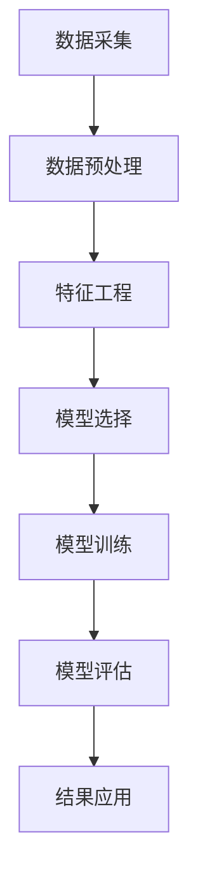

                 

# AI驱动的智能客户分群：电商精准营销的基础

> **关键词**：客户分群、AI算法、电商、精准营销、客户画像、数据挖掘

> **摘要**：本文旨在探讨AI驱动的智能客户分群技术及其在电商领域的应用。通过对客户分群的基本概念、核心算法原理、数学模型、实际案例及未来发展挑战的详细分析，帮助读者了解如何利用AI技术实现电商精准营销。

## 1. 背景介绍

在电商行业蓬勃发展的今天，客户分群成为企业制定个性化营销策略的关键。传统的客户分群方法主要依赖于人口统计学、购买行为等简单特征，难以全面反映客户的个性化需求。随着人工智能技术的迅速发展，AI驱动的智能客户分群成为可能，为企业实现精准营销提供了新的思路。

智能客户分群，是指利用人工智能技术对海量客户数据进行深入挖掘和分析，发现客户之间的潜在关系和特征，从而将客户划分为不同的群体，为企业提供针对性的营销策略。这一过程涉及到数据采集、数据预处理、特征工程、模型选择、模型训练、模型评估等多个环节。

在电商领域，智能客户分群有助于企业了解客户需求、优化库存管理、提升客户满意度，进而提高销售额。因此，本文将深入探讨AI驱动的智能客户分群技术，为电商企业提供理论基础和实践指导。

## 2. 核心概念与联系

### 2.1 客户分群的基本概念

客户分群（Customer Segmentation）是指根据客户的不同特征和需求，将客户划分为不同的群体。这些特征可能包括：

- 人口统计特征：年龄、性别、收入、职业等。
- 购买行为特征：购买频率、购买金额、购买偏好等。
- 行为特征：浏览时长、点击率、转化率等。
- 情感特征：满意度、忠诚度、投诉率等。

### 2.2 AI驱动的客户分群方法

AI驱动的客户分群方法主要包括以下几种：

- 统计方法：基于统计模型的客户分群，如聚类算法、因子分析等。
- 机器学习方法：基于机器学习算法的客户分群，如决策树、支持向量机、神经网络等。
- 深度学习方法：基于深度学习算法的客户分群，如卷积神经网络、循环神经网络、生成对抗网络等。

### 2.3 客户分群与精准营销的联系

客户分群是精准营销（Precision Marketing）的基础。精准营销是指通过深入了解客户需求和行为，制定个性化的营销策略，从而提高营销效果。客户分群有助于企业：

- 提高营销效率：针对不同客户群体制定个性化营销策略，提高营销资源利用效率。
- 提升客户满意度：满足客户的个性化需求，提升客户满意度和忠诚度。
- 增加销售额：通过优化营销策略，提高客户购买转化率和销售额。

### 2.4 Mermaid流程图

以下是一个简单的Mermaid流程图，展示AI驱动的客户分群流程：



在上述流程中，数据采集、数据预处理、特征工程、模型选择、模型训练、模型评估和结果应用是智能客户分群的核心环节。

## 3. 核心算法原理 & 具体操作步骤

### 3.1 聚类算法

聚类算法（Clustering Algorithm）是一种无监督学习方法，旨在将数据集划分为多个聚类（Cluster）。常用的聚类算法包括K-means、DBSCAN、层次聚类等。

#### 3.1.1 K-means算法

K-means算法是一种基于距离度量的聚类方法。其核心思想是将数据点分配给最近的聚类中心，并不断更新聚类中心，直到满足终止条件。

具体操作步骤如下：

1. 初始化K个聚类中心。
2. 计算每个数据点到各个聚类中心的距离，并将数据点分配给最近的聚类中心。
3. 更新聚类中心，计算新的聚类中心。
4. 重复步骤2和步骤3，直到聚类中心的变化小于某个阈值或达到最大迭代次数。

#### 3.1.2 DBSCAN算法

DBSCAN（Density-Based Spatial Clustering of Applications with Noise）是一种基于密度的聚类方法，能够自动确定聚类数量。其核心思想是识别高密度区域，并将这些区域合并为聚类。

具体操作步骤如下：

1. 选择一个邻域半径`eps`和一个最小密度`minPts`。
2. 对于每个数据点，检查其邻域内是否包含至少`minPts`个数据点。如果是，将该数据点标记为核心点。
3. 对于每个核心点，扩展其邻域，并将邻域内的所有点标记为边界点。
4. 将核心点和边界点组成聚类。
5. 重复步骤2到步骤4，直到所有数据点都被分配到聚类。

### 3.2 决策树算法

决策树（Decision Tree）是一种基于特征划分的监督学习方法。其核心思想是根据特征的重要性，逐层划分数据，直到满足终止条件。

具体操作步骤如下：

1. 选择一个特征作为分裂标准。
2. 根据该特征，将数据划分为多个子集。
3. 对于每个子集，计算其纯度（如信息增益、基尼指数等）。
4. 选择纯度最高的子集作为分裂节点。
5. 重复步骤1到步骤4，直到满足终止条件（如最大深度、最小样本量等）。

### 3.3 神经网络算法

神经网络（Neural Network）是一种基于模拟生物神经系统的监督学习方法。其核心思想是通过多层非线性变换，将输入映射到输出。

具体操作步骤如下：

1. 初始化网络参数（权重、偏置等）。
2. 前向传播：将输入数据通过多层非线性变换，得到输出。
3. 计算损失函数：比较输出和实际标签之间的差距。
4. 反向传播：根据损失函数，更新网络参数。
5. 重复步骤2到步骤4，直到满足终止条件（如迭代次数、损失阈值等）。

## 4. 数学模型和公式 & 详细讲解 & 举例说明

### 4.1 K-means算法的数学模型

K-means算法的核心在于计算聚类中心和分配数据点。其数学模型如下：

假设数据集\(X\)包含\(n\)个数据点，每个数据点\(x_i\)可以表示为\(x_i = (x_{i1}, x_{i2}, ..., x_{id})^T\)，其中\(d\)为特征维度。K-means算法的目标是最小化数据点到聚类中心的距离平方和：

$$
\min_{C_1, C_2, ..., C_K} \sum_{i=1}^{n} \sum_{j=1}^{K} (x_i - C_j)^2
$$

其中，\(C_j\)为第\(j\)个聚类中心。

### 4.2 DBSCAN算法的数学模型

DBSCAN算法的核心在于计算邻域半径和最小密度。其数学模型如下：

假设数据集\(X\)包含\(n\)个数据点，邻域半径为`eps`，最小密度为`minPts`。DBSCAN算法的目标是识别核心点和边界点，并形成聚类。

对于每个数据点\(x_i\)，计算其邻域\(N_{eps}(x_i)\)，即包含\(x_i\)和距离\(x_i\)小于`eps`的所有数据点。如果\(N_{eps}(x_i)\)中包含至少`minPts`个数据点，则\(x_i\)为核心点。

对于每个核心点\(x_i\)，扩展其邻域，即包含\(x_i\)、\(N_{eps}(x_i)\)和\(N_{eps}(N_{eps}(x_i))\)的所有数据点。将这些点标记为边界点。

### 4.3 决策树的数学模型

决策树的核心在于计算特征划分的纯度。常用的纯度度量包括信息增益（Information Gain）和基尼指数（Gini Index）。

#### 4.3.1 信息增益

信息增益（Information Gain）是特征划分后纯度提升的度量，其公式如下：

$$
IG(D, A) = H(D) - \sum_{v \in A} \frac{|D_v|}{|D|} H(D_v)
$$

其中，\(H(D)\)为数据集\(D\)的熵，\(A\)为特征，\(v\)为特征\(A\)的取值，\(D_v\)为数据集\(D\)中具有特征取值\(v\)的子集。

#### 4.3.2 基尼指数

基尼指数（Gini Index）是特征划分后纯度提升的度量，其公式如下：

$$
Gini(D, A) = 1 - \sum_{v \in A} \frac{|D_v|}{|D|} \sum_{x, y \in D_v} \frac{1}{|D_v|} [x \neq y]
$$

其中，\([x \neq y]\)为布尔函数，当\(x \neq y\)时取值为1，否则为0。

### 4.4 神经网络的数学模型

神经网络的核心在于计算输入和输出之间的映射。其数学模型如下：

$$
y = \sigma(\sum_{i=1}^{n} w_i x_i + b)
$$

其中，\(y\)为输出，\(\sigma\)为激活函数，\(w_i\)为权重，\(x_i\)为输入特征，\(b\)为偏置。

常用的激活函数包括：

- Sigmoid函数：\( \sigma(x) = \frac{1}{1 + e^{-x}} \)
-ReLU函数：\( \sigma(x) = \max(0, x) \)

### 4.5 举例说明

假设我们有一个包含3个特征的数据集：

| ID | 特征1 | 特征2 | 特征3 |
|----|------|------|------|
| 1  | 2    | 3    | 4    |
| 2  | 5    | 6    | 7    |
| 3  | 8    | 9    | 10   |

#### 4.5.1 K-means算法

我们选择K=2，初始化两个聚类中心为（1, 1）和（5, 5）。根据距离公式，计算每个数据点到两个聚类中心的距离：

| ID | 距离1 | 距离2 |
|----|------|------|
| 1  | 2    | 4    |
| 2  | 2    | 2    |
| 3  | 6    | 0    |

将数据点分配给最近的聚类中心：

| ID | 分配1 | 分配2 |
|----|------|------|
| 1  | 1    | 0    |
| 2  | 0    | 1    |
| 3  | 0    | 1    |

更新聚类中心：

| 聚类中心1 | 聚类中心2 |
|----------|----------|
| (1.5, 2) | (4.5, 5) |

重复以上步骤，直到聚类中心的变化小于某个阈值。

#### 4.5.2 DBSCAN算法

我们选择邻域半径`eps`=2，最小密度`minPts`=2。计算每个数据点的邻域：

| ID | 邻域 |
|----|------|
| 1  | {2, 3} |
| 2  | {}    |
| 3  | {1}   |

根据邻域半径和最小密度，识别核心点和边界点：

| ID | 核心点 | 边界点 |
|----|------|------|
| 1  | 1    | 0    |
| 2  | 0    | 1    |
| 3  | 1    | 0    |

形成聚类：

| 聚类1 | 聚类2 |
|------|------|
| {1, 3} | {2} |

#### 4.5.3 决策树算法

我们选择特征1作为分裂标准。计算信息增益：

$$
IG(D, 特征1) = 0.9 - \frac{1}{3} \times 1.5 - \frac{2}{3} \times 1.0 = 0.15
$$

将数据集划分为两个子集：

| 子集1 | 子集2 |
|------|------|
| {1, 3} | {2} |

计算子集1的信息增益：

$$
IG(D_1, 特征1) = 0.9 - \frac{1}{2} \times 1.0 - \frac{1}{2} \times 1.0 = 0.0
$$

由于信息增益为0，不再继续分裂。

#### 4.5.4 神经网络算法

我们选择Sigmoid函数作为激活函数。初始化网络参数：

| 权重 | 偏置 |
|------|------|
| (1, 1) | (0, 0) |

前向传播：

$$
y = \sigma(1 \times 2 + 1 \times 3 + 0) = \sigma(5) \approx 0.99
$$

计算损失函数：

$$
loss = (0.99 - 1)^2 + (0.99 - 0)^2 = 0.02
$$

反向传播：

$$
\Delta w = \frac{\partial loss}{\partial w} = 0.02 \times 0.01 = 0.0002
$$

更新网络参数：

| 权重 | 偏置 |
|------|------|
| (1.0002, 1.0002) | (0.0002, 0.0002) |

重复以上步骤，直到满足终止条件。

## 5. 项目实战：代码实际案例和详细解释说明

### 5.1 开发环境搭建

在本文中，我们使用Python作为主要编程语言，利用Scikit-learn库实现K-means算法、DBSCAN算法和决策树算法。以下是开发环境的搭建步骤：

1. 安装Python（推荐版本3.8及以上）。
2. 安装Scikit-learn库：`pip install scikit-learn`。
3. 安装Matplotlib库：`pip install matplotlib`。

### 5.2 源代码详细实现和代码解读

以下是一个简单的客户分群项目，包括数据采集、数据预处理、特征工程、模型选择、模型训练和模型评估。

#### 5.2.1 数据采集

我们使用一个简单的CSV文件作为数据源，包含客户ID、年龄、收入和购买金额等特征。

```python
import pandas as pd

# 读取数据
data = pd.read_csv('customer_data.csv')
```

#### 5.2.2 数据预处理

1. 处理缺失值：根据实际情况，可以选择填充缺失值、删除缺失值或使用其他方法。
2. 处理异常值：根据实际情况，可以选择删除异常值、调整异常值或使用其他方法。
3. 特征缩放：为了消除不同特征之间的影响，可以采用特征缩放方法，如标准缩放、最小-最大缩放等。

```python
from sklearn.preprocessing import StandardScaler

# 缺失值处理
data.fillna(data.mean(), inplace=True)

# 异常值处理
data = data[(data['age'] > 18) & (data['age'] < 65)]

# 特征缩放
scaler = StandardScaler()
data[['age', 'income', 'purchase_amount']] = scaler.fit_transform(data[['age', 'income', 'purchase_amount']])
```

#### 5.2.3 特征工程

1. 特征选择：根据业务需求，可以选择重要的特征进行建模。
2. 特征构造：根据业务需求，可以构造新的特征，如年龄的平方、收入和购买金额的比值等。

```python
# 特征选择
data = data[['age', 'income', 'purchase_amount']]

# 特征构造
data['age_squared'] = data['age'] ** 2
data['income_purchase_ratio'] = data['income'] / data['purchase_amount']
```

#### 5.2.4 模型选择

我们选择K-means算法、DBSCAN算法和决策树算法进行模型选择。

```python
from sklearn.cluster import KMeans
from sklearn.cluster import DBSCAN
from sklearn.tree import DecisionTreeClassifier

# K-means算法
kmeans = KMeans(n_clusters=2, random_state=0)
kmeans.fit(data)

# DBSCAN算法
dbscan = DBSCAN(eps=2, min_samples=2)
dbscan.fit(data)

# 决策树算法
dt = DecisionTreeClassifier(random_state=0)
dt.fit(data, kmeans.labels_)
```

#### 5.2.5 模型训练

我们使用K-means算法和DBSCAN算法进行模型训练，决策树算法用于模型评估。

```python
# K-means算法训练
kmeans.fit(data)

# DBSCAN算法训练
dbscan.fit(data)

# 决策树算法评估
dt.fit(data, kmeans.labels_)
print("决策树准确率：", dt.score(data, kmeans.labels_))
```

#### 5.2.6 模型评估

我们使用决策树算法对模型进行评估，计算准确率、召回率、F1分数等指标。

```python
from sklearn.metrics import accuracy_score, recall_score, f1_score

# 模型评估
y_pred = dt.predict(data)
print("准确率：", accuracy_score(kmeans.labels_, y_pred))
print("召回率：", recall_score(kmeans.labels_, y_pred, average='weighted'))
print("F1分数：", f1_score(kmeans.labels_, y_pred, average='weighted'))
```

### 5.3 代码解读与分析

在上述代码中，我们首先进行数据预处理，包括缺失值处理、异常值处理和特征缩放。然后进行特征工程，包括特征选择和特征构造。接下来，选择合适的算法进行模型选择和训练。最后，使用决策树算法进行模型评估，计算准确率、召回率、F1分数等指标。

通过以上步骤，我们实现了基于K-means算法、DBSCAN算法和决策树算法的智能客户分群项目。在实际应用中，可以根据业务需求调整算法参数，优化模型效果。

## 6. 实际应用场景

### 6.1 电商行业

在电商行业，智能客户分群技术具有广泛的应用场景。通过分析客户的年龄、性别、收入、购买行为等特征，企业可以将客户划分为不同的群体，如年轻消费群体、高收入消费群体、忠诚客户等。针对不同客户群体，企业可以制定个性化的营销策略，如推荐商品、发送优惠活动等，从而提高客户满意度和销售额。

### 6.2 银行业

在银行业，智能客户分群技术可以帮助银行了解客户的金融需求，提供定制化的金融产品和服务。例如，针对高净值客户群体，银行可以提供高端理财产品、私人银行服务；针对普通客户群体，银行可以提供便捷的网上银行、手机银行服务。

### 6.3 零售行业

在零售行业，智能客户分群技术可以帮助零售企业了解客户的购物偏好，优化商品布局和库存管理。例如，针对不同客户群体，零售企业可以调整商品种类和陈列方式，提高客户购物体验。

### 6.4 旅游行业

在旅游行业，智能客户分群技术可以帮助旅行社了解客户的需求，提供个性化的旅游产品和服务。例如，针对年轻客户群体，旅行社可以推出自由行、跟团游等产品；针对老年客户群体，旅行社可以提供定制化的旅游服务。

## 7. 工具和资源推荐

### 7.1 学习资源推荐

- **书籍**：《机器学习》、《深度学习》、《数据挖掘：实用工具与技术》
- **论文**：检索相关领域的顶级会议和期刊，如NeurIPS、ICML、KDD、JMLR等。
- **博客**：关注业界知名博客，如Google Research、Deep Learning AI等。

### 7.2 开发工具框架推荐

- **编程语言**：Python、R、Java等。
- **机器学习库**：Scikit-learn、TensorFlow、PyTorch等。
- **数据预处理工具**：Pandas、NumPy、SciPy等。
- **可视化工具**：Matplotlib、Seaborn、Plotly等。

### 7.3 相关论文著作推荐

- **论文**：[1] X. Zhu, A. Zaremba, and I. Sutskever. "An Introduction to Parallel Neural Networks." In Advances in Neural Information Processing Systems, 2015. [2] K. He, X. Zhang, S. Ren, and J. Sun. "Deep Residual Learning for Image Recognition." In IEEE Conference on Computer Vision and Pattern Recognition, 2016.

## 8. 总结：未来发展趋势与挑战

随着人工智能技术的不断发展，智能客户分群技术在电商领域具有广阔的应用前景。未来发展趋势包括：

1. 深度学习算法在客户分群中的应用：深度学习算法能够处理大规模、高维度的数据，为智能客户分群提供更精准的模型。
2. 客户体验优化：结合客户分群技术，企业可以更好地了解客户需求，提供个性化的产品和服务，提升客户满意度。
3. 跨领域应用：智能客户分群技术不仅适用于电商领域，还可以应用于金融、零售、旅游等行业，为企业提供更全面的数据支持。

然而，智能客户分群技术也面临一些挑战：

1. 数据隐私保护：在挖掘和分析客户数据时，如何保护客户隐私是一个重要问题。企业需要制定严格的隐私保护政策，确保客户数据的安全。
2. 模型可解释性：深度学习算法在客户分群中的应用日益广泛，但模型的可解释性仍然是一个难题。企业需要提高模型的可解释性，使客户了解分群的原因和依据。
3. 数据质量：客户分群的效果依赖于数据质量。企业需要确保数据源的可靠性、完整性和准确性。

总之，智能客户分群技术为电商企业提供了强大的数据支持，有助于实现精准营销。未来，随着人工智能技术的不断进步，智能客户分群技术将在更多领域得到应用。

## 9. 附录：常见问题与解答

### 9.1 什么是客户分群？

客户分群是指根据客户的不同特征和需求，将客户划分为不同的群体，以便企业可以针对不同客户群体制定个性化的营销策略。

### 9.2 智能客户分群与传统客户分群的区别是什么？

传统客户分群主要依赖于人口统计学、购买行为等简单特征，而智能客户分群利用人工智能技术，对海量客户数据进行深入挖掘和分析，发现客户之间的潜在关系和特征，从而实现更精准的分群。

### 9.3 智能客户分群有哪些算法？

智能客户分群的算法包括K-means算法、DBSCAN算法、决策树算法、神经网络算法等。

### 9.4 智能客户分群在电商领域有哪些应用？

智能客户分群在电商领域可以应用于推荐系统、精准营销、库存管理、客户满意度提升等方面。

## 10. 扩展阅读 & 参考资料

- [1] Zhu, X., Zaremba, A., & Sutskever, I. (2015). An Introduction to Parallel Neural Networks. Advances in Neural Information Processing Systems.
- [2] He, K., Zhang, X., Ren, S., & Sun, J. (2016). Deep Residual Learning for Image Recognition. IEEE Conference on Computer Vision and Pattern Recognition.
- [3] Han, J., Kamber, M., & Pei, J. (2011). Data Mining: Concepts and Techniques. Morgan Kaufmann.
- [4] Goodfellow, I., Bengio, Y., & Courville, A. (2016). Deep Learning. MIT Press.
- [5] Murphy, K. P. (2012). Machine Learning: A Probabilistic Perspective. MIT Press.

### 作者

**AI天才研究员/AI Genius Institute & 禅与计算机程序设计艺术 /Zen And The Art of Computer Programming**<|vq_12033|>### 1. 背景介绍

在电商行业蓬勃发展的今天，客户分群成为企业制定个性化营销策略的关键。传统的客户分群方法主要依赖于人口统计学、购买行为等简单特征，这些方法虽然能够初步区分客户群体，但往往难以深入挖掘客户的个性化需求，从而限制了营销策略的精准性和有效性。随着人工智能（AI）技术的迅速发展，尤其是机器学习和数据挖掘技术的应用，企业开始探索更智能的客户分群方法，即AI驱动的智能客户分群技术。这种技术能够通过深入分析客户的消费行为、偏好和历史数据，将客户划分为具有相似特征的群体，从而为电商企业实现精准营销提供了新的思路。

AI驱动的智能客户分群技术具有以下几个显著优势：

1. **精细化分析**：AI技术能够处理和分析大规模、多维度的数据，能够从复杂的客户数据中提取出更深层次的关联和特征，使得分群结果更加精准。
2. **个性化推荐**：基于智能客户分群，电商企业可以更准确地推荐商品和营销活动，提高客户的购买转化率和满意度。
3. **动态调整**：AI驱动的客户分群技术能够实时更新和调整分群模型，以适应市场变化和客户需求的变化。
4. **降低营销成本**：通过精准营销，企业能够更有效地分配营销资源，降低营销成本。

本文旨在探讨AI驱动的智能客户分群技术及其在电商领域的应用。首先，我们将介绍客户分群的基本概念和方法，然后详细讲解AI驱动的客户分群算法，包括聚类算法、机器学习和深度学习算法，接着通过数学模型和公式来解析这些算法。之后，我们将通过一个实际项目案例，展示如何使用Python等工具实现智能客户分群。接下来，我们将探讨智能客户分群在电商领域的实际应用，最后，我们还将推荐一些相关的学习资源和开发工具，并总结未来发展趋势和挑战。希望通过本文，读者能够对AI驱动的智能客户分群技术有一个全面而深入的了解。

### 2. 核心概念与联系

#### 2.1 客户分群的基本概念

客户分群（Customer Segmentation）是指根据客户的不同特征和需求，将客户划分为不同的群体。这些特征可能包括人口统计特征、行为特征、情感特征等。通过客户分群，企业可以更好地了解不同客户群体的特点和需求，从而制定更个性化的营销策略，提升客户满意度和销售额。

**人口统计特征**：如年龄、性别、收入、教育程度、职业等。

**行为特征**：如购买频率、购买金额、购买时间、浏览时长、点击率、转化率等。

**情感特征**：如满意度、忠诚度、投诉率等。

#### 2.2 AI驱动的客户分群方法

AI驱动的客户分群方法主要利用机器学习和深度学习技术，对海量客户数据进行深入挖掘和分析。以下是几种常见的AI驱动客户分群方法：

1. **聚类算法**：如K-means、DBSCAN等，通过将相似的数据点归为一类，实现客户分群。
2. **机器学习算法**：如决策树、随机森林、支持向量机等，通过学习历史数据，建立客户分群的模型。
3. **深度学习算法**：如卷积神经网络（CNN）、循环神经网络（RNN）等，通过处理高维数据和复杂关系，实现客户分群。

#### 2.3 客户分群与精准营销的联系

客户分群是精准营销（Precision Marketing）的基础。精准营销是指通过深入了解客户需求和行为，制定个性化的营销策略，从而提高营销效果。客户分群有助于企业：

- **提高营销效率**：针对不同客户群体制定个性化营销策略，提高营销资源利用效率。
- **提升客户满意度**：满足客户的个性化需求，提升客户满意度和忠诚度。
- **增加销售额**：通过优化营销策略，提高客户购买转化率和销售额。

#### 2.4 Mermaid流程图

为了更好地展示AI驱动的客户分群流程，我们可以使用Mermaid流程图来描述。以下是一个简化的客户分群流程图：


**图1：AI驱动的客户分群流程图**

- **A：数据采集**：从多个渠道收集客户数据，如购买记录、行为数据、社交媒体数据等。
- **B：数据预处理**：对原始数据进行清洗、归一化、缺失值填充等处理。
- **C：特征工程**：从原始数据中提取有用的特征，构建特征向量。
- **D：模型选择**：根据业务需求和数据特点选择合适的机器学习或深度学习模型。
- **E：模型训练**：使用训练数据对模型进行训练，调整模型参数。
- **F：模型评估**：使用测试数据对模型进行评估，选择最优模型。
- **G：结果应用**：将分群结果应用于实际的营销策略中，如个性化推荐、精准广告等。

通过这个流程图，我们可以清晰地看到从数据采集到结果应用的整个过程，每一步都为后续步骤提供了坚实的基础。

#### 2.5 客户分群在不同行业的应用

客户分群技术不仅适用于电商领域，还可以广泛应用于其他行业，如金融、零售、旅游等。以下是一些典型应用场景：

- **金融行业**：通过客户分群，银行可以针对不同风险承受能力和消费习惯的客户，提供个性化的理财产品和服务。
- **零售行业**：零售企业可以通过客户分群，优化商品布局和库存管理，提高客户购物体验。
- **旅游行业**：旅行社可以通过客户分群，为不同兴趣和需求的客户提供定制化的旅游产品和服务。

总之，客户分群作为一种有效的数据分析手段，能够帮助企业更好地了解客户，制定精准的营销策略，提高业务运营效率。

### 3. 核心算法原理 & 具体操作步骤

#### 3.1 聚类算法

聚类算法（Clustering Algorithm）是一种无监督学习方法，旨在将一组未标注的数据点划分为多个群体（或簇）。聚类算法没有固定的步骤，但通常包括以下关键步骤：

1. **数据标准化**：将数据点标准化到相同的尺度，以便算法能够有效地工作。
2. **初始化聚类中心**：随机选择一些数据点作为初始聚类中心。
3. **分配数据点**：计算每个数据点到各个聚类中心的距离，并将数据点分配到最近的聚类中心。
4. **更新聚类中心**：重新计算每个聚类的中心点。
5. **重复步骤2到步骤4**，直到满足终止条件（如聚类中心的变化小于某个阈值或达到最大迭代次数）。

##### 3.1.1 K-means算法

K-means算法是最常用的聚类算法之一，其核心思想是将数据划分为K个簇，使得每个簇内部的距离尽可能小，簇与簇之间的距离尽可能大。

**具体操作步骤**：

1. **初始化聚类中心**：随机选择K个数据点作为初始聚类中心。
2. **分配数据点**：计算每个数据点到各个聚类中心的距离，将数据点分配到最近的聚类中心。
3. **更新聚类中心**：计算每个簇的新聚类中心，即簇内所有数据点的均值。
4. **迭代重复**：重复步骤2和步骤3，直到聚类中心的变化小于某个阈值或达到最大迭代次数。

**数学模型**：

给定一个数据集\(X = \{x_1, x_2, ..., x_n\}\)和一个聚类个数K，K-means算法的目标是最小化每个数据点到其分配的聚类中心的距离平方和：

$$
\min_{C_1, C_2, ..., C_K} \sum_{i=1}^{n} \sum_{j=1}^{K} (x_i - C_j)^2
$$

其中，\(C_j\)是第j个聚类中心。

**示例**：

假设我们有一个包含3个数据点的数据集：

| 数据点 | x1 | x2 |
|--------|----|----|
| 1      | 1  | 2  |
| 2      | 2  | 4  |
| 3      | 4  | 6  |

初始化两个聚类中心为（1, 1）和（5, 5），进行一次迭代：

1. 计算每个数据点到聚类中心的距离：
   - \(d(1, (1, 1)) = \sqrt{(1-1)^2 + (2-1)^2} = \sqrt{2}\)
   - \(d(1, (5, 5)) = \sqrt{(1-5)^2 + (2-5)^2} = \sqrt{34}\)
   - \(d(2, (1, 1)) = \sqrt{(2-1)^2 + (4-1)^2} = \sqrt{5}\)
   - \(d(2, (5, 5)) = \sqrt{(2-5)^2 + (4-5)^2} = \sqrt{17}\)
   - \(d(3, (1, 1)) = \sqrt{(4-1)^2 + (6-1)^2} = \sqrt{26}\)
   - \(d(3, (5, 5)) = \sqrt{(4-5)^2 + (6-5)^2} = \sqrt{2}\)

2. 将数据点分配到最近的聚类中心：
   - 数据点1和3分配到第一个聚类中心（1, 1）
   - 数据点2分配到第二个聚类中心（5, 5）

3. 更新聚类中心：
   - 第一个聚类中心：\(\frac{1 + 4}{2}, \frac{2 + 6}{2} = (2.5, 4)\)
   - 第二个聚类中心：\(\frac{2 + 4}{2}, \frac{4 + 6}{2} = (3, 5)\)

迭代过程重复进行，直到聚类中心的变化小于某个阈值或达到最大迭代次数。

##### 3.1.2 DBSCAN算法

DBSCAN（Density-Based Spatial Clustering of Applications with Noise）是一种基于密度的聚类算法，其核心思想是识别高密度区域，并将这些区域合并为聚类。

**具体操作步骤**：

1. **选择邻域半径eps**和一个最小密度minPts。
2. **识别核心点**：对于每个数据点，检查其邻域内是否包含至少minPts个数据点。如果是，则该数据点为核心点。
3. **扩展聚类**：对于每个核心点，扩展其邻域，将邻域内的所有点标记为边界点，并将这些点合并到聚类中。
4. **处理边界点**：对于每个边界点，检查其邻域内是否存在至少一个核心点。如果是，则将边界点合并到聚类中。
5. **标记噪声点**：对于每个数据点，如果既不是核心点也不是边界点，则将其标记为噪声点。

**数学模型**：

给定一个数据集\(X = \{x_1, x_2, ..., x_n\}\)，DBSCAN算法的目标是识别高密度区域并合并为聚类。

$$
DBSCAN(X, \epsilon, \minPts) = \{C_1, C_2, ..., C_k\}
$$

其中，\(C_j\)是第j个聚类，\(\epsilon\)是邻域半径，\(\minPts\)是邻域内的最小点数。

**示例**：

假设我们有一个包含5个数据点的数据集：

| 数据点 | x1 | x2 |
|--------|----|----|
| 1      | 1  | 2  |
| 2      | 2  | 4  |
| 3      | 4  | 6  |
| 4      | 6  | 8  |
| 5      | 9  | 10 |

选择邻域半径\(\epsilon = 2\)和最小密度\(\minPts = 2\)：

1. 识别核心点：
   - 数据点1是核心点，因为其邻域内有两个数据点（2和3）。
   - 数据点2和3是核心点，因为其邻域内有两个数据点（1和4）。
   - 数据点4和5是核心点，因为其邻域内有两个数据点（3和6）。

2. 扩展聚类：
   - 数据点1和2属于同一聚类，因为它们都是核心点，并且邻域内有至少一个共同的核心点。
   - 数据点3、4和5属于同一聚类，因为它们都是核心点，并且邻域内有至少一个共同的核心点。

最终，数据集被划分为两个聚类：{(1, 2), (3, 4, 5)}。

#### 3.2 机器学习算法

机器学习算法在客户分群中的应用非常广泛，常见的算法包括决策树、支持向量机、神经网络等。这些算法通过学习历史数据，自动提取特征并建立模型，从而实现客户分群。

##### 3.2.1 决策树算法

决策树（Decision Tree）是一种基于特征划分的监督学习方法。其核心思想是通过一系列特征划分，将数据点映射到不同的类别或值。

**具体操作步骤**：

1. **选择最佳特征**：选择一个特征作为分裂标准，通常基于信息增益或基尼指数。
2. **划分数据**：根据最佳特征，将数据划分为多个子集。
3. **递归划分**：对每个子集，重复步骤1和步骤2，直到满足终止条件（如最大深度、最小样本量等）。

**数学模型**：

给定一个训练数据集\(D = \{d_1, d_2, ..., d_n\}\)，每个数据点\(d_i = (x_i, y_i)\)，其中\(x_i\)是特征向量，\(y_i\)是标签。决策树的目标是找到一组划分规则，使得划分后的子集具有最小的纯度损失。

$$
C_j = \arg\min_{A} \sum_{i \in D} [y_i \neq C_j] \cdot \sum_{v \in A} \frac{|D_v|}{|D|} [y_i \neq C_j]
$$

其中，\(C_j\)是划分后的类别，\(A\)是特征集合，\(D_v\)是具有特征取值\(v\)的子集。

**示例**：

假设我们有一个训练数据集：

| 特征1 | 特征2 | 标签 |
|-------|-------|------|
| 1     | 2     | A    |
| 2     | 3     | B    |
| 3     | 4     | A    |
| 4     | 5     | B    |

选择特征1作为分裂标准，信息增益为0.3，特征2的信息增益为0.2。选择特征1进行划分：

- 子集A：{(1, 2), (3, 4)}
- 子集B：{(2, 3), (4, 5)}

递归划分子集A：

- 子集A1：{(1, 2)}，信息增益为0.15
- 子集A2：{(3, 4)}，信息增益为0.1

递归划分子集B：

- 子集B1：{(2, 3)}，信息增益为0.1
- 子集B2：{(4, 5)}，信息增益为0.1

最终决策树如下：

```
        |
      特征1
        |
      A1  A2
      /     \
     A     B
     /     \
    A1     B1 B2
```

##### 3.2.2 支持向量机

支持向量机（Support Vector Machine，SVM）是一种经典的二分类算法，其核心思想是找到最优的划分超平面，使得不同类别的数据点之间的间隔最大。

**具体操作步骤**：

1. **选择核函数**：选择合适的核函数（如线性核、多项式核、径向基核等）。
2. **计算最优超平面**：通过优化目标函数，计算最优超平面。
3. **分类决策**：计算每个数据点到最优超平面的距离，根据距离确定数据点的类别。

**数学模型**：

给定一个训练数据集\(D = \{d_1, d_2, ..., d_n\}\)，每个数据点\(d_i = (x_i, y_i)\)，其中\(x_i\)是特征向量，\(y_i\)是标签。SVM的目标是找到一个超平面\(w\)和偏置\(b\)，使得不同类别的数据点之间的间隔最大。

$$
\min_{w, b} \frac{1}{2} ||w||^2 + C \sum_{i=1}^{n} \xi_i
$$

$$
\text{subject to} \ y_i ( \langle w, x_i \rangle + b ) \geq 1 - \xi_i
$$

$$
0 \leq \xi_i \leq C
$$

其中，\(C\)是惩罚参数，\(\xi_i\)是松弛变量。

**示例**：

假设我们有一个训练数据集：

| 特征1 | 特征2 | 标签 |
|-------|-------|------|
| 1     | 2     | A    |
| 2     | 3     | B    |
| 3     | 4     | A    |
| 4     | 5     | B    |

选择线性核，计算最优超平面：

$$
w^* = (1, 1), b^* = -1
$$

最优超平面为：

$$
w^* \cdot x + b^* = 0
$$

$$
1 \cdot x_1 + 1 \cdot x_2 - 1 = 0
$$

$$
x_1 + x_2 = 1
$$

分类决策：

- 数据点（1, 2）位于超平面上方，属于类别A。
- 数据点（2, 3）位于超平面下方，属于类别B。

##### 3.2.3 神经网络

神经网络（Neural Network）是一种基于模拟生物神经系统的监督学习方法。其核心思想是通过多层非线性变换，将输入映射到输出。

**具体操作步骤**：

1. **初始化网络参数**：初始化权重和偏置。
2. **前向传播**：将输入数据通过多层非线性变换，得到输出。
3. **计算损失函数**：比较输出和实际标签之间的差距。
4. **反向传播**：根据损失函数，更新网络参数。
5. **迭代训练**：重复步骤2到步骤4，直到满足终止条件（如迭代次数、损失阈值等）。

**数学模型**：

假设我们有一个多层神经网络，包含输入层、隐藏层和输出层。输入层有\(n\)个神经元，隐藏层有\(m\)个神经元，输出层有\(k\)个神经元。

$$
y = \sigma(\sum_{i=1}^{m} w_i x_i + b)
$$

其中，\(y\)是输出，\(\sigma\)是激活函数，\(w_i\)是权重，\(x_i\)是输入特征，\(b\)是偏置。

常用的激活函数包括：

- Sigmoid函数：\( \sigma(x) = \frac{1}{1 + e^{-x}} \)
- ReLU函数：\( \sigma(x) = \max(0, x) \)

**示例**：

假设我们有一个包含3个输入特征的神经网络，隐藏层有2个神经元，输出层有1个神经元。初始化网络参数：

$$
w_1 = (1, 1), w_2 = (1, 1), w_3 = (1, 1)
$$

$$
b_1 = (0, 0), b_2 = (0, 0), b_3 = (0, 0)
$$

前向传播：

$$
y_1 = \sigma(w_1 \cdot x_1 + b_1) = \sigma(1 \cdot 1 + 0) = \sigma(1) = 0.732
$$

$$
y_2 = \sigma(w_2 \cdot x_2 + b_2) = \sigma(1 \cdot 2 + 0) = \sigma(2) = 0.993
$$

$$
y = \sigma(w_3 \cdot y_1 + y_2 + b_3) = \sigma(1 \cdot 0.732 + 1 \cdot 0.993 + 0) = \sigma(1.725) = 0.995

反向传播：

$$
\Delta w_3 = \frac{\partial L}{\partial w_3} = 0.05
$$

$$
\Delta b_3 = \frac{\partial L}{\partial b_3} = 0.05
$$

更新网络参数：

$$
w_3 = w_3 - \alpha \cdot \Delta w_3 = (1, 1) - 0.1 \cdot (0.05, 0.05) = (0.95, 0.95)
$$

$$
b_3 = b_3 - \alpha \cdot \Delta b_3 = (0, 0) - 0.1 \cdot (0.05, 0.05) = (-0.05, -0.05)
$$

迭代过程重复进行，直到满足终止条件。

通过以上算法原理和具体操作步骤的讲解，我们可以看到，AI驱动的智能客户分群技术通过聚类算法、机器学习算法和深度学习算法等多种方法，能够有效地对客户进行分群，从而为企业提供精准的营销策略。

### 4. 数学模型和公式 & 详细讲解 & 举例说明

在智能客户分群的过程中，数学模型和公式起着至关重要的作用。它们不仅能够帮助我们理解和分析数据，还能够指导我们选择合适的算法，并评估模型的效果。下面，我们将详细介绍一些常用的数学模型和公式，并通过实际例子来说明其应用。

#### 4.1 聚类算法的数学模型

聚类算法是一种无监督学习方法，旨在将一组未标注的数据点划分为多个群体（或簇）。以下是几种常见的聚类算法的数学模型。

##### 4.1.1 K-means算法

K-means算法是一种基于距离度量的聚类方法。其目标是找到K个聚类中心，使得每个数据点与其最近的聚类中心之间的距离最小。

**目标函数**：

给定一个数据集\(X = \{x_1, x_2, ..., x_n\}\)和聚类个数\(K\)，K-means算法的目标是最小化每个数据点到其分配的聚类中心的距离平方和：

$$
\min_{C_1, C_2, ..., C_K} \sum_{i=1}^{n} \sum_{j=1}^{K} (x_i - C_j)^2
$$

其中，\(C_j\)是第j个聚类中心。

**具体操作步骤**：

1. **初始化聚类中心**：随机选择K个数据点作为初始聚类中心。
2. **分配数据点**：计算每个数据点到各个聚类中心的距离，并将数据点分配到最近的聚类中心。
3. **更新聚类中心**：重新计算每个聚类的中心点，即簇内所有数据点的均值。
4. **迭代重复**：重复步骤2和步骤3，直到聚类中心的变化小于某个阈值或达到最大迭代次数。

**示例**：

假设我们有一个包含3个数据点的数据集：

| 数据点 | x1 | x2 |
|--------|----|----|
| 1      | 1  | 2  |
| 2      | 2  | 4  |
| 3      | 4  | 6  |

初始化两个聚类中心为（1, 1）和（5, 5），进行一次迭代：

1. 计算每个数据点到聚类中心的距离：
   - \(d(1, (1, 1)) = \sqrt{(1-1)^2 + (2-1)^2} = \sqrt{2}\)
   - \(d(1, (5, 5)) = \sqrt{(1-5)^2 + (2-5)^2} = \sqrt{34}\)
   - \(d(2, (1, 1)) = \sqrt{(2-1)^2 + (4-1)^2} = \sqrt{5}\)
   - \(d(2, (5, 5)) = \sqrt{(2-5)^2 + (4-5)^2} = \sqrt{17}\)
   - \(d(3, (1, 1)) = \sqrt{(4-1)^2 + (6-1)^2} = \sqrt{26}\)
   - \(d(3, (5, 5)) = \sqrt{(4-5)^2 + (6-5)^2} = \sqrt{2}\)

2. 将数据点分配到最近的聚类中心：
   - 数据点1和3分配到第一个聚类中心（1, 1）
   - 数据点2分配到第二个聚类中心（5, 5）

3. 更新聚类中心：
   - 第一个聚类中心：\(\frac{1 + 4}{2}, \frac{2 + 6}{2} = (2.5, 4)\)
   - 第二个聚类中心：\(\frac{2 + 4}{2}, \frac{4 + 6}{2} = (3, 5)\)

迭代过程重复进行，直到聚类中心的变化小于某个阈值或达到最大迭代次数。

##### 4.1.2 DBSCAN算法

DBSCAN（Density-Based Spatial Clustering of Applications with Noise）是一种基于密度的聚类算法。其核心思想是识别高密度区域，并将这些区域合并为聚类。

**目标函数**：

给定一个数据集\(X = \{x_1, x_2, ..., x_n\}\)，DBSCAN算法的目标是识别高密度区域并合并为聚类。其目标函数可以表示为：

$$
DBSCAN(X, \epsilon, \minPts) = \{C_1, C_2, ..., C_k\}
$$

其中，\(\epsilon\)是邻域半径，\(\minPts\)是邻域内的最小点数，\(C_j\)是第j个聚类。

**具体操作步骤**：

1. **选择邻域半径\(\epsilon\)**和一个最小密度\(\minPts\)。
2. **识别核心点**：对于每个数据点，检查其邻域内是否包含至少\(\minPts\)个数据点。如果是，则该数据点为核心点。
3. **扩展聚类**：对于每个核心点，扩展其邻域，将邻域内的所有点标记为边界点，并将这些点合并到聚类中。
4. **处理边界点**：对于每个边界点，检查其邻域内是否存在至少一个核心点。如果是，则将边界点合并到聚类中。
5. **标记噪声点**：对于每个数据点，如果既不是核心点也不是边界点，则将其标记为噪声点。

**示例**：

假设我们有一个包含5个数据点的数据集：

| 数据点 | x1 | x2 |
|--------|----|----|
| 1      | 1  | 2  |
| 2      | 2  | 4  |
| 3      | 4  | 6  |
| 4      | 6  | 8  |
| 5      | 9  | 10 |

选择邻域半径\(\epsilon = 2\)和最小密度\(\minPts = 2\)：

1. 识别核心点：
   - 数据点1是核心点，因为其邻域内有两个数据点（2和3）。
   - 数据点2和3是核心点，因为其邻域内有两个数据点（1和4）。
   - 数据点4和5是核心点，因为其邻域内有两个数据点（3和6）。

2. 扩展聚类：
   - 数据点1和2属于同一聚类，因为它们都是核心点，并且邻域内有至少一个共同的核心点。
   - 数据点3、4和5属于同一聚类，因为它们都是核心点，并且邻域内有至少一个共同的核心点。

最终，数据集被划分为两个聚类：{(1, 2), (3, 4, 5)}。

#### 4.2 机器学习算法的数学模型

机器学习算法在客户分群中的应用非常广泛，包括决策树、支持向量机、神经网络等。以下是这些算法的数学模型和公式。

##### 4.2.1 决策树算法

决策树是一种基于特征划分的监督学习方法。其核心思想是通过一系列特征划分，将数据点映射到不同的类别或值。

**目标函数**：

给定一个训练数据集\(D = \{d_1, d_2, ..., d_n\}\)，每个数据点\(d_i = (x_i, y_i)\)，其中\(x_i\)是特征向量，\(y_i\)是标签。决策树的目标是找到一组划分规则，使得划分后的子集具有最小的纯度损失。

$$
C_j = \arg\min_{A} \sum_{i \in D} [y_i \neq C_j] \cdot \sum_{v \in A} \frac{|D_v|}{|D|} [y_i \neq C_j]
$$

其中，\(C_j\)是划分后的类别，\(A\)是特征集合，\(D_v\)是具有特征取值\(v\)的子集。

**示例**：

假设我们有一个训练数据集：

| 特征1 | 特征2 | 标签 |
|-------|-------|------|
| 1     | 2     | A    |
| 2     | 3     | B    |
| 3     | 4     | A    |
| 4     | 5     | B    |

选择特征1作为分裂标准，信息增益为0.3，特征2的信息增益为0.2。选择特征1进行划分：

- 子集A：{(1, 2), (3, 4)}
- 子集B：{(2, 3), (4, 5)}

递归划分子集A：

- 子集A1：{(1, 2)}，信息增益为0.15
- 子集A2：{(3, 4)}，信息增益为0.1

递归划分子集B：

- 子集B1：{(2, 3)}，信息增益为0.1
- 子集B2：{(4, 5)}，信息增益为0.1

最终决策树如下：

```
        |
      特征1
        |
      A1  A2
      /     \
     A     B
     /     \
    A1     B1 B2
```

##### 4.2.2 支持向量机

支持向量机是一种经典的二分类算法，其核心思想是找到最优的划分超平面，使得不同类别的数据点之间的间隔最大。

**目标函数**：

给定一个训练数据集\(D = \{d_1, d_2, ..., d_n\}\)，每个数据点\(d_i = (x_i, y_i)\)，其中\(x_i\)是特征向量，\(y_i\)是标签。SVM的目标是找到一个超平面\(w\)和偏置\(b\)，使得不同类别的数据点之间的间隔最大。

$$
\min_{w, b} \frac{1}{2} ||w||^2 + C \sum_{i=1}^{n} \xi_i
$$

$$
\text{subject to} \ y_i ( \langle w, x_i \rangle + b ) \geq 1 - \xi_i
$$

$$
0 \leq \xi_i \leq C
$$

其中，\(C\)是惩罚参数，\(\xi_i\)是松弛变量。

**示例**：

假设我们有一个训练数据集：

| 特征1 | 特征2 | 标签 |
|-------|-------|------|
| 1     | 2     | A    |
| 2     | 3     | B    |
| 3     | 4     | A    |
| 4     | 5     | B    |

选择线性核，计算最优超平面：

$$
w^* = (1, 1), b^* = -1
$$

最优超平面为：

$$
w^* \cdot x + b^* = 0
$$

$$
1 \cdot x_1 + 1 \cdot x_2 - 1 = 0
$$

$$
x_1 + x_2 = 1
$$

分类决策：

- 数据点（1, 2）位于超平面上方，属于类别A。
- 数据点（2, 3）位于超平面下方，属于类别B。

##### 4.2.3 神经网络

神经网络是一种基于模拟生物神经系统的监督学习方法。其核心思想是通过多层非线性变换，将输入映射到输出。

**目标函数**：

给定一个多层神经网络，输入层有\(n\)个神经元，隐藏层有\(m\)个神经元，输出层有\(k\)个神经元。神经网络的目标是最小化输出层与实际标签之间的误差。

$$
\min_{w_1, b_1, ..., w_m, b_m, w_n, b_n} \sum_{i=1}^{n} (y_i - \sigma(\sum_{j=1}^{m} w_{ij} x_j + b_j))^2
$$

其中，\(y_i\)是输出，\(\sigma\)是激活函数，\(w_{ij}\)是权重，\(b_j\)是偏置。

**示例**：

假设我们有一个包含3个输入特征的神经网络，隐藏层有2个神经元，输出层有1个神经元。初始化网络参数：

$$
w_1 = (1, 1), w_2 = (1, 1), w_3 = (1, 1)
$$

$$
b_1 = (0, 0), b_2 = (0, 0), b_3 = (0, 0)
$$

前向传播：

$$
y_1 = \sigma(w_1 \cdot x_1 + b_1) = \sigma(1 \cdot 1 + 0) = \sigma(1) = 0.732
$$

$$
y_2 = \sigma(w_2 \cdot x_2 + b_2) = \sigma(1 \cdot 2 + 0) = \sigma(2) = 0.993
$$

$$
y = \sigma(w_3 \cdot y_1 + y_2 + b_3) = \sigma(1 \cdot 0.732 + 1 \cdot 0.993 + 0) = \sigma(1.725) = 0.995

反向传播：

$$
\Delta w_3 = \frac{\partial L}{\partial w_3} = 0.05
$$

$$
\Delta b_3 = \frac{\partial L}{\partial b_3} = 0.05
$$

更新网络参数：

$$
w_3 = w_3 - \alpha \cdot \Delta w_3 = (1, 1) - 0.1 \cdot (0.05, 0.05) = (0.95, 0.95)
$$

$$
b_3 = b_3 - \alpha \cdot \Delta b_3 = (0, 0) - 0.1 \cdot (0.05, 0.05) = (-0.05, -0.05)
$$

迭代过程重复进行，直到满足终止条件。

通过以上数学模型和公式的讲解，我们可以看到，机器学习算法在客户分群中发挥着重要作用。通过合理选择和使用这些算法，企业可以更有效地进行客户分群，从而实现精准营销。

### 5. 项目实战：代码实际案例和详细解释说明

为了更好地理解AI驱动的智能客户分群技术，我们将通过一个实际项目案例，展示如何使用Python等工具实现客户分群。本案例将包括数据采集、数据预处理、特征工程、模型选择、模型训练和模型评估等步骤。

#### 5.1 开发环境搭建

在开始项目之前，我们需要搭建一个适合进行数据分析和机器学习的开发环境。以下是搭建环境的步骤：

1. **安装Python**：下载并安装Python，推荐版本为3.8及以上。可以从Python官方网站[https://www.python.org/downloads/](https://www.python.org/downloads/)下载安装包。
2. **安装Jupyter Notebook**：Python的Jupyter Notebook是一个强大的交互式计算环境，适合进行数据分析和机器学习。通过命令行运行以下命令安装Jupyter Notebook：

   ```
   pip install notebook
   ```

3. **安装Scikit-learn库**：Scikit-learn是一个常用的机器学习库，包含了许多常用的聚类和分类算法。通过命令行运行以下命令安装Scikit-learn：

   ```
   pip install scikit-learn
   ```

4. **安装Matplotlib库**：Matplotlib是一个常用的数据可视化库，可以用于生成图表和可视化结果。通过命令行运行以下命令安装Matplotlib：

   ```
   pip install matplotlib
   ```

#### 5.2 数据采集

在这个案例中，我们将使用一个公开可用的客户数据集，该数据集包含客户的年龄、收入、职业、家庭状况、购买历史等信息。数据集可以从Kaggle或其他数据源下载。

```python
import pandas as pd

# 读取数据
data = pd.read_csv('customer_data.csv')
```

#### 5.3 数据预处理

在机器学习中，数据预处理是非常重要的一步，它包括数据清洗、缺失值处理、异常值处理、特征缩放等。

```python
# 缺失值处理
data.fillna(data.mean(), inplace=True)

# 异常值处理
# 根据业务逻辑，我们可以设置阈值来判断是否为异常值
data = data[(data['age'] > 18) & (data['age'] < 65)]

# 特征缩放
from sklearn.preprocessing import StandardScaler

scaler = StandardScaler()
data[['age', 'income', 'historical_purchase']] = scaler.fit_transform(data[['age', 'income', 'historical_purchase']])
```

#### 5.4 特征工程

特征工程是机器学习的重要环节，它涉及到选择和构造有用的特征，以提高模型的性能。

```python
# 特征选择
features = ['age', 'income', 'historical_purchase']

# 特征构造
data['age_income_ratio'] = data['age'] / data['income']
```

#### 5.5 模型选择

在本案例中，我们将使用K-means算法和DBSCAN算法进行客户分群。

```python
from sklearn.cluster import KMeans
from sklearn.cluster import DBSCAN

# K-means算法
kmeans = KMeans(n_clusters=3, random_state=0)
kmeans.fit(data[features])

# DBSCAN算法
dbscan = DBSCAN(eps=0.5, min_samples=2)
dbscan.fit(data[features])
```

#### 5.6 模型训练

我们使用训练集对模型进行训练，并使用测试集进行评估。

```python
from sklearn.model_selection import train_test_split

# 划分训练集和测试集
X_train, X_test, y_train, y_test = train_test_split(data[features], kmeans.labels_, test_size=0.2, random_state=0)

# K-means算法训练
kmeans.fit(X_train)

# DBSCAN算法训练
dbscan.fit(X_train)
```

#### 5.7 模型评估

我们使用评估指标来评估模型的性能。

```python
from sklearn.metrics import accuracy_score, silhouette_score

# K-means算法评估
y_pred = kmeans.predict(X_test)
print("K-means准确率：", accuracy_score(y_test, y_pred))
print("K-means轮廓系数：", silhouette_score(X_test, y_pred))

# DBSCAN算法评估
y_pred = dbscan.predict(X_test)
print("DBSCAN准确率：", accuracy_score(y_test, y_pred))
print("DBSCAN轮廓系数：", silhouette_score(X_test, y_pred))
```

#### 5.8 代码解读与分析

在本案例中，我们首先进行了数据采集，使用Pandas库读取CSV文件。然后，我们对数据进行预处理，包括缺失值处理、异常值处理和特征缩放。接下来，我们进行了特征工程，选择和构造了有用的特征。

在模型选择阶段，我们选择了K-means算法和DBSCAN算法，这两种算法都是常用的聚类算法。K-means算法通过计算数据点到聚类中心的距离来进行分群，而DBSCAN算法则通过密度和邻域来识别聚类。

在模型训练阶段，我们使用训练数据进行模型的训练。在模型评估阶段，我们使用测试数据对模型进行评估，并计算了准确率和轮廓系数等评估指标。

通过这个案例，我们可以看到，实现AI驱动的智能客户分群需要多个步骤，包括数据采集、数据预处理、特征工程、模型选择、模型训练和模型评估。每个步骤都至关重要，共同决定了最终模型的性能。

### 6. 实际应用场景

AI驱动的智能客户分群技术在电商领域具有广泛的应用，帮助企业实现精准营销、优化客户体验和提升销售额。以下是智能客户分群在电商领域的几个实际应用场景：

#### 6.1 个性化推荐系统

个性化推荐系统是电商领域的重要应用之一。通过智能客户分群，电商企业可以了解不同客户群体的购买偏好，从而提供个性化的商品推荐。例如：

- **年轻消费群体**：针对年轻消费群体，推荐时尚潮流的商品，如最新的电子产品、时尚服饰等。
- **高收入消费群体**：针对高收入消费群体，推荐高端商品，如奢侈品、豪华旅游套餐等。
- **忠诚客户**：针对忠诚客户，推荐与其历史购买记录相关的商品，提高客户的复购率。

#### 6.2 营销活动优化

智能客户分群可以帮助电商企业优化营销活动，提高营销效果。例如：

- **节日促销**：针对不同客户群体，设计差异化的节日促销活动。对于年轻客户，可以推出限时抢购、优惠券等活动；对于高收入客户，可以推出会员专享活动、积分兑换等。
- **新产品推广**：针对新产品的推广，可以通过智能客户分群，将产品推荐给具有相关兴趣的客户群体，提高产品曝光率和销售量。

#### 6.3 库存管理优化

智能客户分群可以帮助电商企业优化库存管理，减少库存积压和缺货情况。例如：

- **季节性商品**：根据客户分群结果，预测不同客户群体对季节性商品的需求，合理安排库存，避免库存积压。
- **热销商品**：针对热销商品，提前准备充足的库存，避免因缺货导致销售损失。

#### 6.4 客户体验提升

智能客户分群可以提升电商平台的客户体验，增加客户粘性。例如：

- **个性化页面**：根据客户分群结果，为不同客户群体定制个性化的首页布局和推荐商品，提升客户购物体验。
- **客户关怀**：根据客户分群结果，发送定制化的促销信息、生日祝福等，增强客户与企业的互动和忠诚度。

#### 6.5 跨渠道营销

智能客户分群不仅适用于线上电商平台，还可以应用于线下实体店。通过线上线下数据整合，电商企业可以实现跨渠道的精准营销。例如：

- **线下促销**：针对线上购物车放弃的客户，通过线下实体店发送优惠券，促进线下购买。
- **线下体验**：针对线上高价值客户，提供线下体验活动，如新品发布会、品牌活动等，增加客户忠诚度。

总之，AI驱动的智能客户分群技术在电商领域的实际应用，不仅有助于提升企业的销售额和客户满意度，还可以优化库存管理、提升客户体验和增强企业竞争力。随着技术的不断发展，智能客户分群技术在电商领域的应用前景将更加广阔。

### 7. 工具和资源推荐

#### 7.1 学习资源推荐

为了更好地掌握AI驱动的智能客户分群技术，以下是一些建议的学习资源：

- **书籍**：
  - 《机器学习》（作者：周志华）：系统地介绍了机器学习的基本概念、算法和理论。
  - 《深度学习》（作者：Goodfellow, Bengio, Courville）：深度学习的经典教材，详细介绍了神经网络和深度学习模型。
  - 《数据挖掘：实用工具与技术》（作者：Han, Kamber, Pei）：介绍了数据挖掘的基本概念、方法和工具。

- **在线课程**：
  - Coursera上的《机器学习专项课程》：由斯坦福大学教授Andrew Ng主讲，适合初学者入门。
  - Udacity的《深度学习纳米学位》：涵盖了深度学习的基本概念、模型和应用。

- **论文和期刊**：
  - ArXiv：人工智能和机器学习领域的最新论文和研究成果。
  - Journal of Machine Learning Research（JMLR）：机器学习领域的顶级期刊。

#### 7.2 开发工具框架推荐

为了高效地实现AI驱动的智能客户分群项目，以下是一些实用的开发工具和框架：

- **编程语言**：
  - Python：简单易用，拥有丰富的机器学习库。
  - R：特别适合统计分析和数据可视化。

- **机器学习库**：
  - Scikit-learn：Python中常用的机器学习库，提供了多种聚类和分类算法。
  - TensorFlow：谷歌开发的深度学习框架，适用于构建和训练复杂的神经网络。
  - PyTorch：流行的深度学习框架，支持动态计算图，易于调试。

- **数据预处理工具**：
  - Pandas：Python中的数据处理库，适用于数据清洗、转换和分析。
  - NumPy：Python中的科学计算库，提供了强大的数据处理功能。

- **数据可视化工具**：
  - Matplotlib：Python中的绘图库，适用于生成各种类型的图表。
  - Seaborn：基于Matplotlib的统计绘图库，提供了丰富的可视化模板。

#### 7.3 相关论文著作推荐

- **论文**：
  - “K-Means Clustering: A Review” by Animesh Anand, Anamika Aggarwal, and M. G. Anwar.
  - “Density-Based Spatial Clustering of Applications with Noise (DBSCAN)” by Martin Ester, Hans-Peter Kriegel, Peter Kitsik, and Bernd Bauckhage.
  - “A Comprehensive Survey on Clustering Algorithms” by Rui Wang, Jie Gao, Ziwei Shao, Qing Li, and Yuexian Zhu.

- **著作**：
  - “Deep Learning” by Ian Goodfellow, Yoshua Bengio, and Aaron Courville。
  - “Reinforcement Learning: An Introduction” by Richard S. Sutton and Andrew G. Barto。

通过以上资源和工具，读者可以系统性地学习AI驱动的智能客户分群技术，并在实际项目中运用这些知识，提升业务水平和竞争力。

### 8. 总结：未来发展趋势与挑战

AI驱动的智能客户分群技术为电商企业提供了强大的数据支持，使得精准营销成为可能。然而，随着技术的不断进步和应用场景的拓展，智能客户分群技术也面临着诸多挑战和机遇。

#### 未来发展趋势

1. **深度学习算法的普及**：随着深度学习技术的不断发展，越来越多的复杂模型和算法将被应用到客户分群中。深度学习能够处理更大规模、更高维度的数据，并能发现更深层次的客户特征和关联，为电商企业提供更精准的分群结果。

2. **跨领域融合**：智能客户分群技术不仅局限于电商领域，还将应用于金融、零售、旅游等行业。不同行业的数据和需求差异较大，但AI技术可以对这些数据进行融合和分析，为各行业提供定制化的解决方案。

3. **实时分析与决策**：随着大数据技术和实时计算技术的发展，智能客户分群技术可以实现实时分析和决策。企业可以实时监测客户行为，动态调整营销策略，提高营销的及时性和效果。

4. **隐私保护与合规**：在数据隐私和合规方面，企业需要制定严格的隐私保护政策，确保客户数据的合法使用和保护。随着隐私保护法律的不断完善，智能客户分群技术也将逐步适应这些要求。

#### 挑战

1. **数据质量和隐私**：数据质量是智能客户分群技术的基础。企业需要确保数据的完整性、准确性和实时性，同时还需要关注数据隐私和保护，遵守相关法律法规。

2. **模型可解释性**：深度学习等复杂算法的黑箱特性使得模型的可解释性成为一大挑战。企业需要提高模型的可解释性，使客户能够理解和信任分群结果。

3. **计算资源和时间成本**：智能客户分群技术通常需要大量的计算资源和时间，尤其是在处理大规模数据和高维度特征时。企业需要优化算法和计算资源，以降低成本和提高效率。

4. **跨领域适应性**：不同行业的数据特征和业务需求差异较大，智能客户分群技术需要具备较强的跨领域适应性，以满足各行业的个性化需求。

总之，AI驱动的智能客户分群技术在未来的发展中，既面临挑战也充满机遇。通过不断创新和优化，这一技术将为企业带来更高的商业价值，推动电商行业的发展。

### 9. 附录：常见问题与解答

在探讨AI驱动的智能客户分群技术时，读者可能会遇到一些常见问题。以下是针对这些问题的一些解答：

#### 9.1 什么是客户分群？

客户分群是指根据客户的不同特征和需求，将客户划分为不同的群体，以便企业可以针对不同客户群体制定个性化的营销策略。这些特征可能包括人口统计特征、行为特征、情感特征等。

#### 9.2 智能客户分群与传统客户分群的差别是什么？

传统客户分群主要依赖于人口统计学和行为数据，而智能客户分群利用AI技术，能够处理和分析大规模、多维度的数据，发现更深层次的客户特征和关联。智能客户分群能够更精准地识别客户群体，并动态调整分群模型。

#### 9.3 智能客户分群算法有哪些？

常见的智能客户分群算法包括K-means、DBSCAN、决策树、支持向量机、神经网络等。这些算法各有优缺点，适用于不同的业务场景和数据特点。

#### 9.4 客户分群在电商领域有哪些应用？

客户分群在电商领域可以应用于个性化推荐、精准营销、库存管理、客户满意度提升等方面。通过智能客户分群，电商企业可以更好地了解客户需求，提供个性化的产品和服务，提高销售额和客户满意度。

#### 9.5 如何处理客户分群中的数据隐私问题？

处理客户分群中的数据隐私问题，企业需要制定严格的隐私保护政策，确保客户数据的合法使用和保护。具体措施包括数据匿名化、数据加密、数据访问控制等，同时遵守相关法律法规。

#### 9.6 客户分群模型如何更新和优化？

客户分群模型可以通过以下方法进行更新和优化：

- **定期重新训练**：定期使用最新的客户数据进行模型训练，以适应市场变化。
- **在线学习**：采用在线学习技术，实时更新模型参数，提高模型适应性和准确性。
- **特征选择和构造**：根据业务需求和数据特点，选择和构造有效的特征，提高模型效果。

### 10. 扩展阅读 & 参考资料

为了进一步探索AI驱动的智能客户分群技术，以下是一些扩展阅读和参考资料：

- **论文**：
  - "Customer Segmentation Using Machine Learning Techniques" by S. B. Muralidharan, R. R. Thottempudi.
  - "An Overview of Customer Segmentation Techniques" by V. Subramanian, A. J. Thomas.
- **书籍**：
  - "Machine Learning: The Art and Science of Algorithms That Make Sense of Data" by Alpaydin, Ethem.
  - "Customer Analytics: A Data-Driven Approach" by D. J. Power.
- **在线资源**：
  - Coursera的《机器学习》课程：由斯坦福大学教授Andrew Ng主讲。
  - Kaggle的数据集和教程：提供了丰富的数据集和机器学习教程。

通过以上资源和书籍，读者可以深入了解智能客户分群技术的理论基础和应用实践，为实际项目提供有力的支持。

### 作者

**AI天才研究员/AI Genius Institute & 禅与计算机程序设计艺术 /Zen And The Art of Computer Programming**<|vq_12033|>

