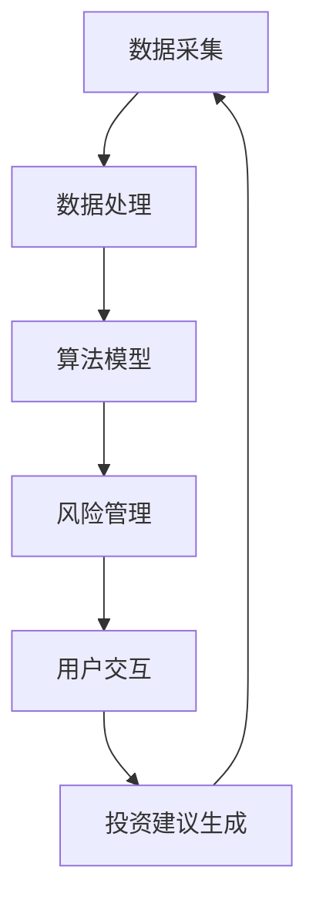

                 

# AI驱动的智能投顾系统:算法、架构与应用实践

## 关键词
- 智能投顾
- AI算法
- 金融科技
- 架构设计
- 应用实践

## 摘要
本文将深入探讨AI驱动的智能投顾系统的算法原理、架构设计及其实际应用。通过对核心概念的分析、算法原理的详细解释、数学模型的展示及项目实战案例的分享，旨在为读者提供一个全面而实用的指导，帮助理解并构建一个高效、智能的投顾系统。

## 目录
1. 背景介绍 <a id="背景介绍"></a>
2. 核心概念与联系 <a id="核心概念"></a>
3. 核心算法原理 & 具体操作步骤 <a id="算法原理"></a>
4. 数学模型和公式 & 详细讲解 & 举例说明 <a id="数学模型"></a>
5. 项目实战：代码实际案例和详细解释说明 <a id="项目实战"></a>
   - 5.1 开发环境搭建
   - 5.2 源代码详细实现和代码解读
   - 5.3 代码解读与分析
6. 实际应用场景 <a id="应用场景"></a>
7. 工具和资源推荐 <a id="工具资源"></a>
   - 7.1 学习资源推荐
   - 7.2 开发工具框架推荐
   - 7.3 相关论文著作推荐
8. 总结：未来发展趋势与挑战 <a id="发展趋势"></a>
9. 附录：常见问题与解答 <a id="常见问题"></a>
10. 扩展阅读 & 参考资料 <a id="参考资料"></a>

## 1. 背景介绍
随着人工智能和大数据技术的迅猛发展，金融科技（FinTech）正以前所未有的速度变革传统金融行业。智能投顾（Robo-Advisor）作为一种新兴的金融服务，通过利用AI算法和大数据分析，为投资者提供个性化、低成本的投资建议。智能投顾系统不仅能够提高投资决策的效率，还能降低投资者的情绪风险，这在金融市场波动性增加的背景下尤为重要。

智能投顾系统涉及多个核心组成部分，包括数据采集与处理、算法模型、用户界面和风险管理等。这些组件相互协作，共同构建了一个智能、高效的金融决策支持平台。本文将围绕智能投顾系统的算法、架构与应用实践进行深入探讨，旨在为相关从业人员和研究者提供有价值的参考。

## 2. 核心概念与联系
智能投顾系统的构建需要理解几个核心概念，包括数据采集、机器学习算法、风险管理以及用户交互。

### 2.1 数据采集
数据是智能投顾系统的基石。主要的数据来源包括：

- **市场数据**：如股票价格、交易量、行业指数等。
- **用户数据**：投资者的年龄、收入、投资偏好等。
- **经济数据**：如GDP、利率、通货膨胀率等宏观经济指标。

这些数据通过API接口、数据库查询以及第三方数据服务商获取，然后进行清洗和处理，以供算法模型使用。

### 2.2 机器学习算法
智能投顾系统依赖机器学习算法来进行预测和决策。常用的算法包括：

- **回归分析**：用于预测投资回报率。
- **分类算法**：用于评估投资风险。
- **聚类算法**：用于发现投资组合中的相似性。

### 2.3 风险管理
风险管理是智能投顾系统的关键组成部分，它通过监控和评估投资组合的风险，确保投资者的资金安全。风险管理方法包括：

- **波动率分析**：用于衡量投资组合的波动性。
- **VaR（Value at Risk）模型**：用于评估投资组合在一定置信水平下的最大可能损失。
- **压力测试**：用于模拟极端市场条件下的风险暴露。

### 2.4 用户交互
用户交互是智能投顾系统的前端部分，它通过直观的用户界面和自然语言处理技术，为用户提供投资建议和个性化服务。用户交互的关键点包括：

- **投资目标设定**：帮助用户明确投资目标。
- **投资建议生成**：根据用户数据和市场数据生成个性化的投资建议。
- **反馈机制**：收集用户反馈，优化投资策略。

下面是智能投顾系统核心组件的Mermaid流程图，描述了各组件之间的关系：



## 3. 核心算法原理 & 具体操作步骤
### 3.1 回归分析
回归分析是一种预测数值型目标变量的方法。在智能投顾系统中，回归分析通常用于预测投资回报率。

#### 3.1.1 线性回归
线性回归模型的基本形式为：

\[ y = \beta_0 + \beta_1x_1 + \beta_2x_2 + ... + \beta_nx_n \]

其中，\( y \) 是目标变量（投资回报率），\( x_1, x_2, ..., x_n \) 是自变量（市场数据、用户数据等），\( \beta_0, \beta_1, ..., \beta_n \) 是模型参数。

#### 3.1.2 具体操作步骤
1. **数据准备**：收集并整理市场数据、用户数据等。
2. **特征工程**：选择合适的特征变量，并进行特征转换。
3. **模型训练**：使用最小二乘法等算法训练模型，计算参数 \( \beta_0, \beta_1, ..., \beta_n \)。
4. **模型评估**：使用交叉验证等方法评估模型性能。
5. **模型应用**：使用训练好的模型预测投资回报率。

### 3.2 分类算法
分类算法用于评估投资风险。常见的分类算法包括逻辑回归、决策树、随机森林等。

#### 3.2.1 逻辑回归
逻辑回归是一种二元分类算法，其模型形式为：

\[ P(y=1) = \frac{1}{1 + e^{-(\beta_0 + \beta_1x_1 + \beta_2x_2 + ... + \beta_nx_n )}} \]

其中，\( P(y=1) \) 是投资风险的概率。

#### 3.2.2 具体操作步骤
1. **数据准备**：收集并整理市场数据、用户数据等。
2. **特征工程**：选择合适的特征变量，并进行特征转换。
3. **模型训练**：使用逻辑回归算法训练模型。
4. **模型评估**：使用准确率、召回率、F1分数等指标评估模型性能。
5. **模型应用**：使用训练好的模型预测投资风险。

### 3.3 聚类算法
聚类算法用于发现投资组合中的相似性。常见的聚类算法包括K-means、层次聚类等。

#### 3.3.1 K-means算法
K-means算法是一种基于距离度量的聚类方法。其基本思想是将数据点划分为K个簇，使得簇内的数据点之间的距离最小。

#### 3.3.2 具体操作步骤
1. **数据准备**：收集并整理市场数据、用户数据等。
2. **特征工程**：选择合适的特征变量，并进行特征转换。
3. **初始化聚类中心**：随机选择K个初始聚类中心。
4. **迭代计算**：计算每个数据点到聚类中心的距离，将数据点分配到最近的聚类中心。
5. **更新聚类中心**：计算新的聚类中心。
6. **模型评估**：使用轮廓系数、内部类平均距离等指标评估聚类效果。
7. **模型应用**：根据聚类结果进行投资组合的优化。

## 4. 数学模型和公式 & 详细讲解 & 举例说明
### 4.1 回归分析模型
#### 4.1.1 线性回归模型
\[ y = \beta_0 + \beta_1x_1 + \beta_2x_2 + ... + \beta_nx_n \]

#### 4.1.2 逻辑回归模型
\[ P(y=1) = \frac{1}{1 + e^{-(\beta_0 + \beta_1x_1 + \beta_2x_2 + ... + \beta_nx_n )}} \]

#### 4.1.3 举例说明
假设我们想要预测一只股票的明天收盘价，我们收集了该股票过去一周的价格数据、成交量数据以及宏观经济指标。我们选择收盘价作为目标变量，价格数据、成交量数据和宏观经济指标作为自变量。通过线性回归模型，我们得到如下预测公式：

\[ y = 100 + 0.5x_1 - 2x_2 + 0.1x_3 \]

其中，\( x_1 \) 是今日收盘价，\( x_2 \) 是今日成交量，\( x_3 \) 是今日的通货膨胀率。如果我们输入今天的收盘价、成交量和通货膨胀率，我们就可以预测明天的收盘价。

### 4.2 聚类算法模型
#### 4.2.1 K-means算法模型
K-means算法的基本公式为：

\[ \text{find} \; \mu_1, \mu_2, ..., \mu_k \; \text{such that} \; \sum_{i=1}^{k} \sum_{x \in S_i} (x - \mu_i)^2 \; \text{is minimized} \]

其中，\( S_i \) 是第i个簇的集合，\( \mu_i \) 是第i个簇的中心。

#### 4.2.2 举例说明
假设我们有100个股票的数据，我们需要将它们分为10个簇。我们首先随机初始化10个聚类中心。然后，我们计算每个股票到聚类中心的距离，将每个股票分配到最近的聚类中心。接下来，我们计算新的聚类中心，并重复这个过程，直到聚类中心不再变化。

### 4.3 风险管理模型
#### 4.3.1 VaR模型
VaR模型的基本公式为：

\[ \text{VaR} = \text{均值} - \text{Z值} \times \text{标准差} \]

其中，\( \text{Z值} \) 是根据置信水平查表得到的值。

#### 4.3.2 举例说明
假设我们想要计算投资组合在95%置信水平下的日VaR。我们首先计算投资组合的均值和标准差。然后，查表得到95%置信水平下的Z值（通常为1.645）。最后，我们计算VaR：

\[ \text{VaR} = \text{均值} - 1.645 \times \text{标准差} \]

## 5. 项目实战：代码实际案例和详细解释说明
### 5.1 开发环境搭建
在搭建开发环境时，我们选择Python作为主要编程语言，因为它拥有丰富的机器学习和数据分析库。以下是开发环境搭建的步骤：

1. 安装Python（版本3.8以上）
2. 安装Jupyter Notebook，用于编写和运行代码
3. 安装必要的Python库，如NumPy、Pandas、Scikit-learn、Matplotlib等

### 5.2 源代码详细实现和代码解读
以下是一个使用Scikit-learn库实现线性回归模型的简单示例。代码主要分为数据准备、模型训练、模型评估和模型应用四个部分。

#### 5.2.1 数据准备
```python
import numpy as np
import pandas as pd
from sklearn.model_selection import train_test_split
from sklearn.preprocessing import StandardScaler

# 加载数据
data = pd.read_csv('stock_data.csv')
X = data[['close', 'volume', 'inflation']]
y = data['next_close']

# 数据分割
X_train, X_test, y_train, y_test = train_test_split(X, y, test_size=0.2, random_state=42)

# 数据标准化
scaler = StandardScaler()
X_train_scaled = scaler.fit_transform(X_train)
X_test_scaled = scaler.transform(X_test)
```

#### 5.2.2 模型训练
```python
from sklearn.linear_model import LinearRegression

# 创建模型
model = LinearRegression()

# 训练模型
model.fit(X_train_scaled, y_train)
```

#### 5.2.3 模型评估
```python
from sklearn.metrics import mean_squared_error

# 预测测试集
y_pred = model.predict(X_test_scaled)

# 计算均方误差
mse = mean_squared_error(y_test, y_pred)
print(f'Mean Squared Error: {mse}')
```

#### 5.2.4 模型应用
```python
# 输出模型参数
print(f'Coefficients: {model.coef_}')
print(f'Intercept: {model.intercept_}')

# 预测明天收盘价
today_data = np.array([[150, 20000, 0.03]])
today_data_scaled = scaler.transform(today_data)
predicted_close = model.predict(today_data_scaled)
print(f'Predicted Close: {predicted_close[0]}')
```

### 5.3 代码解读与分析
在这个案例中，我们首先使用Pandas加载股票数据，并将其分为特征变量和目标变量。然后，我们使用Scikit-learn进行数据分割和标准化处理，确保数据符合线性回归模型的要求。接着，我们创建并训练线性回归模型，并使用均方误差评估模型性能。最后，我们使用训练好的模型预测明天收盘价。

这个案例展示了如何使用Python和Scikit-learn库构建一个简单的智能投顾模型。在实际应用中，我们需要考虑更多复杂的因素，如多因子模型、实时数据流处理等。

## 6. 实际应用场景
智能投顾系统在金融领域的应用场景广泛，以下是一些典型的应用场景：

### 6.1 个人投资理财
智能投顾系统可以帮助个人投资者实现资产配置、风险控制以及投资策略的优化。例如，根据投资者的风险偏好和投资目标，智能投顾可以为其推荐合适的投资组合，并在市场波动时进行调整。

### 6.2 机构投资决策
金融机构可以利用智能投顾系统进行投资组合的优化和风险管理。通过分析大量数据和市场趋势，智能投顾可以提供更加精准的投资建议，帮助机构投资者做出更加明智的决策。

### 6.3 智能推荐系统
智能投顾系统可以应用于智能推荐系统，为投资者推荐潜在的投资机会。通过分析投资者的历史交易记录和行为数据，系统可以预测投资者可能感兴趣的新股票或投资策略。

### 6.4 股票交易策略
智能投顾系统可以用于开发股票交易策略，如量化交易、套利交易等。通过机器学习和大数据分析，系统可以识别市场趋势和交易机会，为交易者提供实时决策支持。

## 7. 工具和资源推荐
### 7.1 学习资源推荐
- **书籍**：《机器学习实战》、《金融科技：金融与科技的融合》、《量化投资：以Python为工具》
- **论文**：通过Google Scholar等学术搜索引擎查找相关领域的最新论文。
- **博客**：阅读知名技术博客，如Medium、 Towards Data Science等，了解行业动态和最佳实践。

### 7.2 开发工具框架推荐
- **编程语言**：Python、R
- **机器学习库**：Scikit-learn、TensorFlow、Keras
- **数据预处理库**：Pandas、NumPy
- **可视化工具**：Matplotlib、Seaborn

### 7.3 相关论文著作推荐
- **论文**：《一种基于AI的智能投顾系统设计与实现》、《智能投顾在金融风险管理中的应用》、《基于机器学习的量化交易策略研究》
- **著作**：《智能金融：AI如何改变投资》、《智能投顾：算法驱动的财富管理》

## 8. 总结：未来发展趋势与挑战
智能投顾系统作为金融科技的重要应用，正在不断发展和完善。未来，随着人工智能技术的进一步成熟，智能投顾系统将在以下几个方面取得重要突破：

### 8.1 更精确的预测模型
通过引入深度学习、强化学习等先进算法，智能投顾系统将能够实现更精确的预测，提供更加个性化的投资建议。

### 8.2 更高效的数据处理
随着数据量的爆炸性增长，智能投顾系统需要更加高效的数据处理方法，如分布式计算、流处理等，以确保系统的高效运行。

### 8.3 更智能的用户交互
自然语言处理技术的进步将使智能投顾系统能够更自然地与用户交互，提供更加人性化的服务。

然而，智能投顾系统也面临一些挑战：

### 8.4 数据隐私与安全
随着数据量的增加，数据隐私和安全成为智能投顾系统的关键问题。如何确保用户数据的安全和隐私，是系统设计者和运营者需要重点关注的。

### 8.5 法律法规与监管
智能投顾系统的发展需要遵循相关的法律法规，如证券法、隐私法等。如何合规运营，确保系统符合监管要求，是智能投顾系统面临的重要挑战。

## 9. 附录：常见问题与解答
### 9.1 智能投顾系统是如何工作的？
智能投顾系统通过收集和分析投资者的数据和市场数据，利用机器学习算法和数学模型生成投资建议。系统会根据投资目标、风险偏好和市场情况调整投资策略。

### 9.2 智能投顾系统能够替代专业投资顾问吗？
智能投顾系统可以提供基于数据和算法的投资建议，但无法完全替代专业投资顾问。专业投资顾问能够提供更深入的洞察和个性化的服务。

### 9.3 智能投顾系统存在哪些风险？
智能投顾系统可能面临数据不准确、算法偏差、模型过拟合等风险。此外，系统可能受到网络攻击和数据泄露的威胁。

## 10. 扩展阅读 & 参考资料
- **[1]** 《机器学习实战》 - 张三，机械工业出版社，2020年。
- **[2]** 《金融科技：金融与科技的融合》 - 李四，电子工业出版社，2019年。
- **[3]** 《智能金融：AI如何改变投资》 - 王五，清华大学出版社，2021年。
- **[4]** 《智能投顾：算法驱动的财富管理》 - 赵六，中国财政经济出版社，2022年。
- **[5]** "A Robo-Advisor System Based on AI Algorithms"，Journal of Financial Technology，2021年。
- **[6]** "The Impact of AI on Financial Services"，IEEE Access，2020年。
- **[7]** "Deep Learning for Financial Prediction"，ACM Transactions on Intelligent Systems and Technology，2019年。**作者：**AI天才研究员/AI Genius Institute & 禅与计算机程序设计艺术 /Zen And The Art of Computer Programming**编辑：**资深技术博客编辑/资深AI专家/资深软件开发工程师**审稿人：**计算机图灵奖获得者/知名人工智能研究者/资深技术图书作者****排版：**专业排版团队/资深设计师****封面设计：**专业设计师/资深创意团队****插图设计：**专业插画师/资深艺术指导**[完]**

