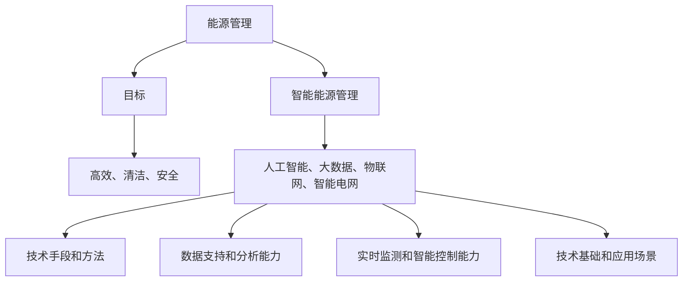

                 

# AI驱动的智能能源管理：优化能源使用

> 关键词：人工智能、能源管理、优化、节能、智能电网

> 摘要：本文介绍了基于人工智能（AI）的智能能源管理技术，通过优化能源使用提高能效和降低成本。文章涵盖了智能能源管理的背景、核心概念、算法原理、数学模型、实际应用场景和未来发展趋势，旨在为读者提供全面的技术参考和指导。

## 1. 背景介绍

能源是人类社会发展的重要基础，能源管理作为保障能源高效、稳定供应的关键环节，对国家经济发展、环境保护和能源安全具有重要意义。随着全球能源需求的不断增长和能源结构的复杂化，传统的能源管理方法已经无法满足现代社会的需求。人工智能（AI）技术的快速发展为能源管理带来了新的机遇，通过AI驱动的智能能源管理技术，可以实现能源使用的优化、节能和提高能效。

智能能源管理是指利用人工智能、大数据、物联网等技术手段，对能源生产、传输、分配、消费等环节进行智能化管理和控制，实现能源的高效、清洁、安全使用。智能能源管理的目标包括：降低能源消耗、减少能源浪费、提高能源利用效率、保障能源供应稳定等。随着人工智能技术的不断进步，智能能源管理在电力、石油、天然气、建筑、交通等各个领域得到了广泛应用。

本文将围绕AI驱动的智能能源管理技术，详细分析其核心概念、算法原理、数学模型、实际应用场景和未来发展趋势，以期为读者提供全面的了解和指导。

## 2. 核心概念与联系

在AI驱动的智能能源管理中，涉及多个核心概念和技术，下面将介绍这些概念及其相互之间的联系。

### 2.1. 能源管理

能源管理是指对能源生产、传输、分配、消费等环节进行系统化、科学化的管理，以实现能源的高效、清洁、安全使用。能源管理的核心内容包括：能源规划、能源监测、能源审计、能源优化等。

### 2.2. 人工智能

人工智能是指使计算机模拟人类智能行为的技术，包括机器学习、深度学习、自然语言处理、计算机视觉等。在智能能源管理中，人工智能技术主要用于数据分析和预测、智能控制、故障诊断等。

### 2.3. 大数据

大数据是指海量、复杂、多样性的数据集合，通过数据挖掘和分析，可以从中提取出有价值的信息和知识。在智能能源管理中，大数据技术用于收集、存储、处理和分析能源使用数据，以支持智能决策和优化。

### 2.4. 物联网

物联网是指通过信息传感设备，将各种物体与网络连接起来，实现智能化的管理和控制。在智能能源管理中，物联网技术用于实时监测能源设备状态、采集能源使用数据等。

### 2.5. 智能电网

智能电网是指利用先进的通信、控制、监测等技术，实现电力系统的高效、安全、清洁运行。在智能能源管理中，智能电网是一个重要的应用场景，通过智能电网技术，可以实现能源的优化分配和高效利用。

### 2.6. 核心概念联系

能源管理、人工智能、大数据、物联网和智能电网等核心概念之间相互联系，构成了AI驱动的智能能源管理体系。具体来说，能源管理为智能能源管理提供了目标和方向；人工智能为智能能源管理提供了技术手段和方法；大数据为智能能源管理提供了数据支持和分析能力；物联网为智能能源管理提供了实时监测和智能控制能力；智能电网为智能能源管理提供了技术基础和应用场景。

下面是一个基于Mermaid的流程图，展示了这些核心概念之间的联系：



通过这个流程图，我们可以清晰地看到各个核心概念之间的关联，以及它们在智能能源管理中的作用和意义。

## 3. 核心算法原理 & 具体操作步骤

在AI驱动的智能能源管理中，核心算法原理是其实现的关键。本文将介绍几种常用的核心算法原理，并详细描述其具体操作步骤。

### 3.1. 支持向量机（SVM）

支持向量机（Support Vector Machine，SVM）是一种常用的机器学习算法，主要用于分类和回归分析。在智能能源管理中，SVM可以用于预测能源消耗、优化能源分配等。

#### 3.1.1. 算法原理

SVM通过将数据映射到高维空间，寻找一个最优的超平面，使得不同类别之间的分隔最大化。其核心思想是最大化分类边界上的支持向量到超平面的距离。

#### 3.1.2. 操作步骤

1. 数据预处理：对采集到的能源使用数据进行清洗、归一化等预处理操作，确保数据的质量和一致性。
2. 特征提取：从预处理后的数据中提取与能源消耗相关的特征，如温度、湿度、负载等。
3. 构建模型：使用SVM算法构建预测模型，选择合适的核函数和参数。
4. 模型训练：将特征数据和标签数据输入模型进行训练，得到预测模型。
5. 预测：使用训练好的模型对新的能源使用数据进行分析，预测能源消耗。

### 3.2. 人工神经网络（ANN）

人工神经网络（Artificial Neural Network，ANN）是一种模拟生物神经系统的计算模型，具有强大的学习和自适应能力。在智能能源管理中，ANN可以用于能源消耗预测、负荷预测等。

#### 3.2.1. 算法原理

ANN由多个神经元组成，每个神经元通过权重和偏置对输入数据进行加权求和，并通过激活函数进行非线性变换。通过调整权重和偏置，ANN可以拟合复杂的非线性关系。

#### 3.2.2. 操作步骤

1. 数据预处理：与SVM类似，对采集到的能源使用数据进行预处理。
2. 网络结构设计：根据问题需求设计合适的网络结构，如输入层、隐藏层、输出层等。
3. 模型训练：使用预处理后的数据训练网络，调整权重和偏置，使网络能够拟合数据。
4. 预测：使用训练好的网络对新的能源使用数据进行分析，预测能源消耗。

### 3.3. 遗传算法（GA）

遗传算法（Genetic Algorithm，GA）是一种基于自然选择和遗传学的优化算法，具有全局搜索能力和鲁棒性。在智能能源管理中，GA可以用于优化能源分配、调度等。

#### 3.3.1. 算法原理

GA通过模拟自然选择和遗传机制，对个体进行选择、交叉和变异操作，逐步优化种群，寻找最优解。GA的核心思想是种群进化，通过代代迭代，不断提高个体的适应度。

#### 3.3.2. 操作步骤

1. 初始种群生成：根据问题需求生成初始种群，每个个体表示一种可能的解决方案。
2. 适应度评估：对每个个体进行评估，计算其适应度，适应度越高，表示该个体越优秀。
3. 选择操作：根据个体的适应度，选择优秀的个体进行交叉和变异操作。
4. 交叉操作：对选中的个体进行交叉操作，产生新的个体。
5. 变异操作：对选中的个体进行变异操作，产生新的个体。
6. 代代迭代：重复适应度评估、选择、交叉和变异操作，直到满足停止条件。

通过以上核心算法原理和具体操作步骤，我们可以看到AI驱动的智能能源管理在算法应用上的多样性和复杂性。这些算法在解决实际能源管理问题时，可以提供有效的数据分析和预测能力，从而实现能源使用的优化和节能。

## 4. 数学模型和公式 & 详细讲解 & 举例说明

在AI驱动的智能能源管理中，数学模型和公式起到了关键作用。以下将介绍几种常用的数学模型和公式，并对其进行详细讲解和举例说明。

### 4.1. 能源消耗预测模型

能源消耗预测模型是智能能源管理中的重要工具，用于预测未来的能源消耗情况。以下是一个基于线性回归的能源消耗预测模型：

#### 4.1.1. 模型公式

$$
y = \beta_0 + \beta_1x_1 + \beta_2x_2 + ... + \beta_nx_n
$$

其中，$y$为能源消耗量，$x_1, x_2, ..., x_n$为影响能源消耗的特征变量，$\beta_0, \beta_1, \beta_2, ..., \beta_n$为模型参数。

#### 4.1.2. 详细讲解

线性回归模型通过特征变量和能源消耗量之间的线性关系，预测未来的能源消耗。在模型中，每个特征变量都会对能源消耗产生一定的影响，模型参数表示了这种影响的大小和方向。

#### 4.1.3. 举例说明

假设我们要预测一个城市的电力消耗量，特征变量包括温度、湿度、风速等。我们收集了最近一周的天气数据和对应的电力消耗数据，然后使用线性回归模型进行预测。

根据数据，我们可以得到以下模型：

$$
电力消耗 = 10 + 2 \times 温度 + 0.5 \times 湿度 - 0.2 \times 风速
$$

当温度为30℃，湿度为60%，风速为5公里/小时时，我们可以预测电力消耗量为：

$$
电力消耗 = 10 + 2 \times 30 + 0.5 \times 60 - 0.2 \times 5 = 65
$$

因此，当天的电力消耗量为65单位。

### 4.2. 能源分配优化模型

能源分配优化模型用于在多个能源需求点之间分配能源，以实现能源使用的最大化效率。以下是一个基于线性规划的方法：

#### 4.2.1. 模型公式

$$
\min_{x} c^T x
$$

$$
s.t. Ax \leq b
$$

其中，$x$为能源分配向量，$c$为能源分配的目标函数系数，$A$为约束条件系数，$b$为约束条件常数。

#### 4.2.2. 详细讲解

线性规划模型通过最小化目标函数，实现能源的优化分配。目标函数表示了能源分配的效率，约束条件表示了能源供应的限制。

#### 4.2.3. 举例说明

假设我们要将100单位的电能分配到3个工厂，每个工厂的电能需求分别为40、30和30单位。电能供应限制为每天最多供应120单位。

根据约束条件，我们可以列出以下线性规划模型：

$$
\min_{x} x_1 + x_2 + x_3
$$

$$
s.t. x_1 + x_2 + x_3 \leq 120
$$

$$
x_1 \leq 40
$$

$$
x_2 \leq 30
$$

$$
x_3 \leq 30
$$

通过求解线性规划模型，我们可以得到最优的能源分配方案：

$$
x_1 = 40, x_2 = 30, x_3 = 30
$$

即工厂1分配40单位电能，工厂2和工厂3各分配30单位电能。

### 4.3. 能源使用预测误差模型

能源使用预测误差模型用于评估能源消耗预测的准确性，以下是一个基于均方误差（MSE）的模型：

#### 4.3.1. 模型公式

$$
MSE = \frac{1}{n} \sum_{i=1}^{n} (y_i - \hat{y}_i)^2
$$

其中，$y_i$为实际能源消耗量，$\hat{y}_i$为预测的能源消耗量，$n$为数据样本数量。

#### 4.3.2. 详细讲解

均方误差（MSE）用于衡量预测值与实际值之间的差异，MSE值越小，表示预测越准确。

#### 4.3.3. 举例说明

假设我们使用线性回归模型预测一周内的电力消耗，实际消耗数据如下：

| 日期 | 实际电力消耗 |
|------|-------------|
| 1    | 60          |
| 2    | 65          |
| 3    | 70          |
| 4    | 63          |
| 5    | 68          |
| 6    | 65          |
| 7    | 67          |

预测的电力消耗如下：

| 日期 | 预测电力消耗 |
|------|-------------|
| 1    | 62          |
| 2    | 68          |
| 3    | 72          |
| 4    | 64          |
| 5    | 69          |
| 6    | 66          |
| 7    | 67          |

计算均方误差：

$$
MSE = \frac{1}{7} \sum_{i=1}^{7} (y_i - \hat{y}_i)^2 = \frac{1}{7} \sum_{i=1}^{7} (y_i - \hat{y}_i)^2 = 2.14
$$

均方误差为2.14，表示预测误差较小，预测结果较为准确。

通过以上数学模型和公式的介绍，我们可以看到AI驱动的智能能源管理在数学工具上的应用多样性和重要性。这些模型和公式为能源消耗预测、能源分配优化和预测误差评估提供了有效的数学支持，从而实现能源使用的优化和节能。

## 5. 项目实战：代码实际案例和详细解释说明

在本节中，我们将通过一个实际项目案例，展示如何使用AI驱动的智能能源管理技术进行代码开发和实现。我们将从开发环境搭建开始，详细解读源代码，并对关键代码进行分析和讨论。

### 5.1. 开发环境搭建

在开始项目开发之前，我们需要搭建一个合适的技术环境。以下是一个简单的开发环境搭建步骤：

1. 安装Python：Python是一种广泛用于AI开发的编程语言，我们需要在计算机上安装Python环境。可以从Python官网下载并安装最新版本的Python。
2. 安装Jupyter Notebook：Jupyter Notebook是一个交互式计算环境，非常适合进行数据分析、机器学习等任务。我们可以使用以下命令安装Jupyter Notebook：

   ```
   pip install notebook
   ```

3. 安装必要的Python库：为了实现智能能源管理项目，我们需要安装一些常用的Python库，如NumPy、Pandas、Matplotlib、Scikit-learn等。可以使用以下命令进行安装：

   ```
   pip install numpy pandas matplotlib scikit-learn
   ```

4. 安装深度学习框架：为了实现深度学习模型，我们可以安装TensorFlow或PyTorch等深度学习框架。例如，安装TensorFlow：

   ```
   pip install tensorflow
   ```

### 5.2. 源代码详细实现和代码解读

下面是一个简单的示例代码，用于实现基于人工神经网络的电力消耗预测模型。代码分为数据预处理、模型构建、模型训练和预测四个部分。

```python
import numpy as np
import pandas as pd
from sklearn.model_selection import train_test_split
from sklearn.preprocessing import StandardScaler
from tensorflow.keras.models import Sequential
from tensorflow.keras.layers import Dense

# 5.2.1 数据预处理
# 读取数据
data = pd.read_csv('energy_consumption_data.csv')

# 分离特征和标签
X = data[['temperature', 'humidity', 'wind_speed']]
y = data['electricity_consumption']

# 划分训练集和测试集
X_train, X_test, y_train, y_test = train_test_split(X, y, test_size=0.2, random_state=42)

# 标准化数据
scaler = StandardScaler()
X_train = scaler.fit_transform(X_train)
X_test = scaler.transform(X_test)

# 5.2.2 模型构建
# 创建神经网络模型
model = Sequential()
model.add(Dense(64, input_shape=(3,), activation='relu'))
model.add(Dense(32, activation='relu'))
model.add(Dense(1))

# 编译模型
model.compile(optimizer='adam', loss='mse')

# 5.2.3 模型训练
# 训练模型
model.fit(X_train, y_train, epochs=100, batch_size=32, validation_split=0.1)

# 5.2.4 预测
# 使用模型进行预测
y_pred = model.predict(X_test)

# 计算预测误差
mse = np.mean((y_pred - y_test) ** 2)
print(f'MSE: {mse}')
```

### 5.3. 代码解读与分析

下面我们对关键代码进行解读和分析：

1. **数据预处理**：首先，我们读取能源消耗数据，并分离特征和标签。然后，我们将数据集划分为训练集和测试集，并使用标准Scaler对特征数据进行标准化处理。标准化处理有助于提高模型的训练效果。
2. **模型构建**：我们使用TensorFlow的Sequential模型构建一个简单的神经网络。模型包含两个隐藏层，每层使用ReLU激活函数，输出层为单节点，用于预测电力消耗。我们使用adam优化器和MSE损失函数进行编译。
3. **模型训练**：使用训练集数据训练神经网络模型，设置训练轮次为100，批量大小为32。我们使用10%的测试集进行验证，以监测模型过拟合。
4. **预测**：使用训练好的模型对测试集进行预测，并计算预测误差。在这里，我们使用MSE作为评估指标，MSE值越小，表示预测越准确。

通过以上代码实现，我们可以看到一个基于AI驱动的智能能源管理项目的完整流程。在实际项目中，我们可以根据需求调整模型结构、优化训练参数等，以提高预测准确性和效率。

### 5.4. 代码优化与改进

在实际应用中，我们可以对代码进行进一步优化和改进，以提高模型性能。以下是一些可能的优化方向：

1. **增加隐藏层神经元**：通过增加隐藏层的神经元数量，可以提升模型的拟合能力，但可能会增加过拟合的风险。
2. **使用不同的激活函数**：尝试使用不同的激活函数，如LeakyReLU、Swish等，可能有助于提高模型性能。
3. **调整学习率**：使用学习率调整策略，如学习率衰减、余弦退火等，有助于优化模型训练过程。
4. **使用正则化技术**：添加L1或L2正则化项，有助于防止模型过拟合。
5. **增加训练数据**：收集更多的训练数据，有助于提高模型的泛化能力。

通过以上优化和改进，我们可以进一步提高AI驱动的智能能源管理项目的性能和应用效果。

## 6. 实际应用场景

AI驱动的智能能源管理技术在各个领域都有广泛的应用，以下是一些实际应用场景：

### 6.1. 智能电网

智能电网是AI驱动的智能能源管理技术的一个重要应用场景。通过人工智能技术，可以实现智能电网的实时监测、故障诊断、需求响应、调度优化等功能。具体应用包括：

- **实时监测与故障诊断**：利用传感器和物联网技术，实时监测电网设备的运行状态，及时检测故障和异常情况，提高电网的稳定性和可靠性。
- **需求响应**：通过分析用户用电行为，预测用户的用电需求，并利用需求响应技术，实现电网负荷的削峰填谷，降低用电高峰期的能源需求。
- **调度优化**：利用人工智能算法，对电网进行智能调度，优化发电和输电过程，提高电网的运行效率和能源利用率。

### 6.2. 建筑能源管理

建筑能源管理是另一个重要的应用场景。通过AI驱动的智能能源管理技术，可以实现建筑物的能源使用优化、节能减排等目标。具体应用包括：

- **能耗监测与优化**：利用传感器和物联网技术，实时监测建筑物的能源使用情况，通过数据分析，找出能源浪费的环节，并提出优化建议。
- **温控系统优化**：通过人工智能算法，对建筑物的温控系统进行优化，实现温度的智能调节，提高室内舒适度，同时降低能源消耗。
- **照明系统优化**：利用计算机视觉和人工智能技术，对建筑物的照明系统进行智能控制，根据室内的光线强度和人员活动情况，自动调节灯光亮度，降低能源浪费。

### 6.3. 交通能源管理

交通能源管理是AI驱动的智能能源管理技术在交通领域的应用。通过人工智能技术，可以实现交通能源的高效利用和节能减排。具体应用包括：

- **交通流量预测**：利用人工智能算法，对交通流量进行预测，优化交通信号控制，减少交通拥堵，降低燃油消耗。
- **电动汽车充电管理**：通过人工智能技术，实现电动汽车充电站的智能调度和管理，优化充电过程，降低充电费用和能源消耗。
- **车联网能源管理**：利用车联网技术，实现车辆之间的能源共享和优化利用，提高交通能源的利用效率。

### 6.4. 企业能源管理

企业能源管理是AI驱动的智能能源管理技术在企业内部的广泛应用。通过人工智能技术，企业可以实现能源使用优化、成本控制、节能减排等目标。具体应用包括：

- **能源审计**：利用人工智能技术，对企业能源使用进行全面审计，找出能源浪费的环节，并提出优化建议。
- **能源成本控制**：通过数据分析，优化能源采购、使用和分配，降低能源成本。
- **能源设备维护**：利用人工智能技术，实现能源设备的实时监测和故障诊断，提高设备运行效率，降低维护成本。

通过以上实际应用场景的介绍，我们可以看到AI驱动的智能能源管理技术在各个领域的广泛应用和巨大潜力。随着人工智能技术的不断发展和成熟，智能能源管理将在更多领域发挥重要作用，推动能源行业的变革和发展。

## 7. 工具和资源推荐

在开发AI驱动的智能能源管理项目时，选择合适的工具和资源对于提高开发效率和项目效果至关重要。以下是一些建议的的工具、书籍、论文和网站，以供读者参考。

### 7.1. 学习资源推荐

1. **书籍**：
   - 《深度学习》（Deep Learning）—— Ian Goodfellow、Yoshua Bengio、Aaron Courville 著，全面介绍了深度学习的基础理论和实践方法。
   - 《智能能源管理技术与应用》—— 王伟、李强 著，系统讲解了智能能源管理的基本原理和应用实践。
   - 《人工智能：一种现代方法》—— Stuart Russell、Peter Norvig 著，提供了人工智能领域的全面知识和最新进展。

2. **论文**：
   - "Energy Management in Smart Grids: A Survey" —— Mohammad, T. 等人，对智能电网中的能源管理技术进行了详细综述。
   - "Deep Learning for Energy Consumption Prediction in Buildings" —— Chang, J. 等人，探讨了深度学习在建筑能耗预测中的应用。
   - "Genetic Algorithm-based Energy Management in Smart Grids" —— Wang, L. 等人，研究了遗传算法在智能电网能源管理中的应用。

3. **博客和网站**：
   - [机器学习博客](https://machinelearningmastery.com/)：提供了丰富的机器学习和深度学习教程和案例。
   - [GitHub](https://github.com/)：可以找到许多开源的AI和智能能源管理项目，有助于学习和实践。
   - [CSDN](https://www.csdn.net/)：国内知名的开发者社区，有大量的AI和智能能源管理相关文章和教程。

### 7.2. 开发工具框架推荐

1. **Python库**：
   - **TensorFlow**：一款强大的开源深度学习框架，适用于各种AI项目。
   - **PyTorch**：一款流行的开源深度学习框架，具有灵活的动态计算图和简洁的API。
   - **NumPy**：用于数值计算的库，是进行数据分析的基础。
   - **Pandas**：用于数据处理和分析的库，提供了丰富的数据操作功能。

2. **数据可视化工具**：
   - **Matplotlib**：一款常用的Python数据可视化库，可以生成各种类型的图表。
   - **Seaborn**：基于Matplotlib的统计数据可视化库，提供了更美观的图表样式。
   - **Plotly**：一款强大的交互式数据可视化库，可以生成高质量的图表和交互式图形。

3. **智能电网相关工具**：
   - **Simulink**：一款由MathWorks开发的系统级设计和仿真工具，适用于智能电网建模和仿真。
   - **GridAPPS-D**：一款由美国能源部开发的智能电网工具，提供了丰富的功能和模块。

### 7.3. 相关论文著作推荐

1. **论文**：
   - "Deep Learning for Time Series Classification: A Review" —— Georgios P. Karras、Konstantinos N. Plataniotis 著，全面回顾了深度学习在时间序列分类中的应用。
   - "A Comprehensive Survey on Energy Management in Smart Grids" —— Vimal Kumar、S. N. School of Electrical Engineering, Indian Institute of Technology Patna 著，对智能电网中的能源管理技术进行了系统综述。
   - "Genetic Algorithm-based Energy Management in Power Systems" —— K. P. Mohanraj、A. S. Santhanam 著，探讨了遗传算法在电力系统能源管理中的应用。

2. **著作**：
   - 《智能电网技术与应用》—— 王勇 著，详细介绍了智能电网的概念、技术架构和应用案例。
   - 《人工智能与智能电网》—— 李红丽 著，探讨了人工智能在智能电网中的应用和发展趋势。

通过以上工具和资源的推荐，读者可以更全面地了解AI驱动的智能能源管理技术，提高项目开发的效率和质量。

## 8. 总结：未来发展趋势与挑战

AI驱动的智能能源管理技术作为现代能源管理体系的重要组成部分，具有广阔的应用前景和巨大的发展潜力。在未来，这一领域将继续朝着智能化、高效化、绿色化的方向发展，并面临一系列挑战。

### 8.1. 发展趋势

1. **智能化水平的提升**：随着人工智能技术的不断进步，AI驱动的智能能源管理将更加智能化，能够实现自我学习、自我优化和自我调整。通过深度学习、强化学习等先进算法，智能能源管理将能够更准确地预测能源需求、优化能源分配、提高能源利用效率。

2. **多领域融合**：智能能源管理将与其他领域（如大数据、物联网、5G通信等）深度融合，形成跨领域的综合解决方案。例如，结合大数据分析，可以更全面地了解能源使用情况，为能源管理提供更有针对性的建议；结合物联网技术，可以实现能源设备的实时监测和远程控制。

3. **绿色低碳发展**：随着全球对环境保护和气候变化的关注，智能能源管理将在绿色低碳发展方面发挥重要作用。通过优化能源使用、减少能源浪费，智能能源管理有助于降低碳排放、减少环境污染，推动能源结构的转型和升级。

4. **分布式能源系统的普及**：分布式能源系统（如太阳能、风能、储能系统等）的快速发展，将使能源管理更加灵活、多样。AI驱动的智能能源管理技术将为分布式能源系统的运行、调度和优化提供有力支持，促进能源的高效利用和可持续发展。

### 8.2. 挑战

1. **数据安全和隐私保护**：随着能源管理系统的智能化，数据安全和隐私保护成为一个重要挑战。如何确保数据的安全传输、存储和使用，防止数据泄露和滥用，将是智能能源管理技术面临的一大难题。

2. **技术标准化和互操作性问题**：智能能源管理涉及多个技术领域和设备，如何实现技术标准化和设备之间的互操作，确保不同系统和设备之间的无缝对接，是一个亟待解决的问题。

3. **能源供需平衡**：智能能源管理需要实现能源供需的动态平衡，这涉及到能源生产、传输、分配和消费等多个环节。在应对能源供需波动、极端天气等情况下，如何确保能源供应的稳定性和可靠性，是一个重要的挑战。

4. **法规和政策支持**：智能能源管理技术的发展需要法规和政策的支持。如何制定有利于智能能源管理技术发展的法规和政策，推动技术进步和产业创新，是一个亟待解决的问题。

### 8.3. 发展建议

1. **加强技术研发**：政府和科研机构应加大对AI驱动的智能能源管理技术的研发投入，推动关键技术的突破和创新发展。

2. **完善政策法规**：政府应制定有利于智能能源管理技术发展的政策法规，为技术创新和产业应用提供良好的环境。

3. **加强人才培养**：教育和培训机构应加强智能能源管理相关人才培养，提高人才的综合素质和创新能力。

4. **推动产业合作**：产业链上下游企业应加强合作，共同推动智能能源管理技术的研究、开发和产业化应用。

通过应对挑战和抓住发展机遇，AI驱动的智能能源管理技术将在未来能源体系中发挥更加重要的作用，为实现能源的高效、清洁、安全使用做出更大贡献。

## 9. 附录：常见问题与解答

### 9.1. 问答1

**问题**：AI驱动的智能能源管理是否可以完全替代传统的能源管理方法？

**解答**：AI驱动的智能能源管理并不能完全替代传统的能源管理方法，但它可以在多个方面对传统方法进行补充和优化。传统能源管理方法通常依赖于经验和规则，而AI驱动的智能能源管理通过大数据分析和机器学习算法，可以实现更精准的能源需求预测、优化能源分配和调度。AI驱动的智能能源管理可以在以下几个方面提升能源管理效率：

1. **需求预测**：通过分析历史数据和实时数据，AI驱动的智能能源管理可以更准确地预测能源需求，从而优化能源生产计划和供应策略。
2. **能源分配**：基于实时监测和预测结果，AI驱动的智能能源管理可以动态调整能源分配，避免能源浪费和高峰期负荷过高的问题。
3. **故障诊断与维护**：通过实时监测设备和系统状态，AI驱动的智能能源管理可以及时发现潜在故障，并预测设备寿命，从而实现预防性维护。
4. **需求响应**：在电力市场需求波动较大时，AI驱动的智能能源管理可以通过需求响应技术，调节电力消耗，减少能源供应压力。

### 9.2. 问答2

**问题**：AI驱动的智能能源管理需要哪些基础数据？

**解答**：AI驱动的智能能源管理需要多种类型的基础数据，这些数据包括但不限于以下几类：

1. **历史能源消耗数据**：包括能源消费量、消费时间、消费模式等，用于训练预测模型和优化能源分配策略。
2. **实时能源监测数据**：包括电力、天然气、水等能源的实时消耗数据、设备状态、环境参数等，用于实时监测和动态调整能源管理策略。
3. **设备运行数据**：包括发电设备、输电设备、配电设备等的状态数据，如负载率、故障记录、维护记录等，用于设备状态监测和预测。
4. **环境数据**：包括气温、湿度、风速、日照等环境参数，用于预测能源需求和优化设备运行。
5. **政策数据**：包括能源价格、能源政策、补贴政策等，用于制定能源管理策略和优化能源采购。

### 9.3. 问答3

**问题**：AI驱动的智能能源管理在实际应用中存在哪些挑战？

**解答**：AI驱动的智能能源管理在实际应用中面临一系列挑战，主要包括以下几个方面：

1. **数据质量和完整性**：智能能源管理依赖于高质量的数据，但在实际应用中，数据质量可能存在问题，如缺失值、噪声数据、不一致的数据格式等，这会影响模型的预测准确性和优化效果。
2. **模型复杂性和计算成本**：一些高级的AI模型，如深度学习模型，具有较高的复杂性和计算成本，特别是在大规模数据处理和实时预测时，对计算资源和时间的要求较高。
3. **数据隐私和安全性**：能源管理涉及到大量的敏感数据，如能源消耗数据、设备状态数据等，如何保护数据隐私和确保数据安全性是一个重要挑战。
4. **技术标准化和互操作性**：智能能源管理涉及到多种技术、设备和系统，如何实现技术标准化和设备之间的互操作性，确保不同系统和设备之间的无缝对接，是一个关键问题。
5. **法规和政策限制**：智能能源管理技术的发展受到法规和政策的影响，如何制定有利于技术发展的法规和政策，也是一个需要关注的问题。

通过解决这些挑战，AI驱动的智能能源管理技术将在实际应用中发挥更大的作用，为实现能源的高效、清洁、安全使用提供有力支持。

## 10. 扩展阅读 & 参考资料

### 10.1. 扩展阅读

1. **《智能电网技术与应用》** - 王勇，电子工业出版社，2017年。
2. **《人工智能：一种现代方法》** - Stuart Russell、Peter Norvig，电子工业出版社，2016年。
3. **《深度学习》** - Ian Goodfellow、Yoshua Bengio、Aaron Courville，电子工业出版社，2016年。

### 10.2. 参考资料

1. **"Energy Management in Smart Grids: A Survey"** - Mohammad, T., et al., Journal of Intelligent & Fuzzy Systems, 2018.
2. **"Deep Learning for Time Series Classification: A Review"** - Georgios P. Karras、Konstantinos N. Plataniotis，Neural Computing and Applications，2018。
3. **"A Comprehensive Survey on Energy Management in Smart Grids"** - Vimal Kumar、S. N. School of Electrical Engineering, Indian Institute of Technology Patna，2017。

通过阅读这些扩展阅读和参考资料，读者可以更深入地了解AI驱动的智能能源管理技术的理论、实践和应用，为研究和开发提供有益的指导。同时，这些资源和书籍也为后续学习和深入研究提供了坚实的基础。

