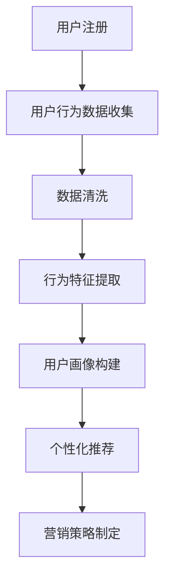

                 

# AI驱动的电商平台个性化营销自动化

## 关键词

- 人工智能
- 电商平台
- 个性化营销
- 营销自动化
- 客户行为分析
- 机器学习
- 数据挖掘
- 实时推荐系统
- 客户生命周期管理

## 摘要

本文旨在探讨如何利用人工智能技术，实现电商平台个性化营销的自动化。通过分析客户行为数据，本文将介绍如何构建一个基于机器学习的推荐系统，实现精准营销。同时，文章还将讨论如何通过自动化工具和平台，提高营销效率，降低成本，提升客户满意度。本文旨在为电商平台提供一套切实可行的个性化营销自动化解决方案。

## 1. 背景介绍

### 电商平台的发展现状

随着互联网技术的飞速发展，电商平台已经成为现代零售业的重要组成部分。据统计，全球电子商务市场规模在2020年已超过3.5万亿美元，预计到2024年将达到6.3万亿美元。这一巨大市场规模背后，是消费者对便捷购物体验和个性化服务的需求不断增长。

### 个性化营销的重要性

在电商竞争日益激烈的今天，个性化营销已经成为企业提高客户黏性、提升销售额的关键手段。通过分析客户行为数据，电商平台可以准确了解客户的需求和偏好，从而提供更加个性化的产品推荐和服务。这不仅能够提高客户的购物体验，还能有效提升转化率和客户满意度。

### 营销自动化的需求

随着数据量的爆炸式增长，传统的手动营销方式已经无法满足电商平台的需求。自动化营销工具和平台能够高效地处理海量数据，实现精准营销，降低人力成本，提高营销效果。因此，营销自动化成为电商平台发展的重要趋势。

## 2. 核心概念与联系

### 客户行为分析

客户行为分析是个性化营销的基础。通过对客户在电商平台上的浏览、搜索、购买等行为数据进行分析，可以提取出客户的行为特征和偏好，为推荐系统和营销策略提供依据。

### 机器学习

机器学习是实现个性化营销的核心技术。通过训练机器学习模型，可以从海量数据中自动发现规律和模式，实现精准推荐和预测。常见的机器学习算法包括协同过滤、决策树、随机森林、支持向量机等。

### 数据挖掘

数据挖掘是挖掘数据中隐藏的规律和知识的重要手段。在电商平台中，数据挖掘可以帮助发现潜在的客户需求、市场趋势和业务机会，从而指导营销策略的制定。

### 实时推荐系统

实时推荐系统是自动化营销的重要组成部分。通过实时分析客户行为数据，推荐系统可以动态调整推荐结果，实现个性化推荐，提高营销效果。

### 客户生命周期管理

客户生命周期管理是提升客户价值的重要手段。通过对客户从注册到退出的全过程进行管理，电商平台可以制定个性化的营销策略，提高客户满意度和忠诚度。

## 2.1 客户行为分析的 Mermaid 流程图



## 3. 核心算法原理 & 具体操作步骤

### 3.1 协同过滤算法

协同过滤算法是推荐系统中最常用的算法之一。它通过分析用户之间的相似性，发现用户的共同兴趣，从而实现个性化推荐。

#### 3.1.1 基于用户的协同过滤

基于用户的协同过滤算法通过计算用户之间的相似性，找到与目标用户相似的其他用户，然后推荐这些用户喜欢的商品。具体步骤如下：

1. 计算用户之间的相似性：使用余弦相似度、皮尔逊相关系数等指标计算用户之间的相似性。
2. 找到与目标用户最相似的K个用户。
3. 推荐这些用户喜欢的商品。

#### 3.1.2 基于物品的协同过滤

基于物品的协同过滤算法通过计算商品之间的相似性，找到与目标商品最相似的其他商品，然后推荐这些商品。具体步骤如下：

1. 计算商品之间的相似性：使用余弦相似度、皮尔逊相关系数等指标计算商品之间的相似性。
2. 找到与目标商品最相似的K个商品。
3. 推荐这些商品。

### 3.2 决策树算法

决策树算法是一种常见的分类算法。它通过构建一棵树形结构，对数据进行分类或回归。

#### 3.2.1 决策树构建

1. 选择一个最佳特征作为节点。
2. 计算每个特征的信息增益或基尼指数。
3. 选择信息增益或基尼指数最大的特征作为节点。
4. 对该特征进行划分，生成新的节点。
5. 重复步骤3和4，直到满足停止条件（如最大树深度、最小样本量等）。

#### 3.2.2 决策树分类

1. 从根节点开始，根据特征值选择分支。
2. 重复步骤1，直到到达叶节点。
3. 叶节点的类别即为分类结果。

### 3.3 随机森林算法

随机森林算法是一种基于决策树的集成学习方法。它通过构建多个决策树，并利用投票机制来获得最终结果。

#### 3.3.1 决策树构建

1. 选择一个随机特征子集。
2. 构建决策树。
3. 重复步骤1和2，生成多个决策树。

#### 3.3.2 随机森林分类

1. 对每个决策树进行分类。
2. 计算每个决策树的分类结果。
3. 对分类结果进行投票，得到最终分类结果。

## 4. 数学模型和公式 & 详细讲解 & 举例说明

### 4.1 余弦相似度

余弦相似度是一种衡量两个向量之间相似度的方法。其计算公式如下：

$$
\cos(\theta) = \frac{\sum_{i=1}^{n} x_i y_i}{\sqrt{\sum_{i=1}^{n} x_i^2} \sqrt{\sum_{i=1}^{n} y_i^2}}
$$

其中，$x$ 和 $y$ 是两个向量，$n$ 是向量的维度。

### 4.2 皮尔逊相关系数

皮尔逊相关系数是一种衡量两个变量之间线性相关程度的指标。其计算公式如下：

$$
\rho = \frac{\sum_{i=1}^{n} (x_i - \bar{x}) (y_i - \bar{y})}{\sqrt{\sum_{i=1}^{n} (x_i - \bar{x})^2} \sqrt{\sum_{i=1}^{n} (y_i - \bar{y})^2}}
$$

其中，$x$ 和 $y$ 是两个变量，$\bar{x}$ 和 $\bar{y}$ 分别是 $x$ 和 $y$ 的平均值，$n$ 是样本数量。

### 4.3 决策树信息增益

决策树的信息增益定义为：

$$
IG(D, A) = \sum_{v \in V} p(v) \cdot IG(D_v, A)
$$

其中，$D$ 是数据集，$A$ 是特征，$V$ 是特征 $A$ 的取值集合，$D_v$ 是在特征 $A$ 取值为 $v$ 的数据子集，$IG$ 是信息增益。

### 4.4 决策树基尼指数

决策树的基尼指数定义为：

$$
Gini(D, A) = 1 - \sum_{v \in V} p(v)^2
$$

其中，$D$ 是数据集，$A$ 是特征，$V$ 是特征 $A$ 的取值集合，$p(v)$ 是特征 $A$ 取值为 $v$ 的概率。

### 4.5 随机森林投票

随机森林的投票过程如下：

1. 对每个决策树进行分类。
2. 对每个分类结果进行投票。
3. 得到最终分类结果。

## 5. 项目实战：代码实际案例和详细解释说明

### 5.1 开发环境搭建

为了实现电商平台的个性化营销自动化，我们首先需要搭建一个开发环境。以下是搭建环境的基本步骤：

1. 安装Python环境：下载并安装Python，版本建议为3.8以上。
2. 安装常用库：使用pip命令安装以下常用库：numpy、pandas、scikit-learn、matplotlib等。
3. 安装深度学习库：如果需要使用深度学习算法，可以安装TensorFlow或PyTorch。

### 5.2 源代码详细实现和代码解读

以下是一个简单的基于协同过滤算法的电商推荐系统实现：

```python
import numpy as np
from sklearn.metrics.pairwise import cosine_similarity

# 假设用户-物品评分矩阵为R，用户数为m，物品数为n
R = np.array([
    [5, 3, 0, 1],
    [4, 0, 0, 1],
    [1, 1, 0, 5],
    [1, 0, 0, 2],
    [4, 2, 2, 5]
])

# 计算用户之间的相似度矩阵
similarity_matrix = cosine_similarity(R)

# 对每个用户进行推荐
for i in range(R.shape[0]):
    # 找到与当前用户最相似的K个用户
    k_nearest_users = np.argsort(similarity_matrix[i])[-K-1:-1:-1]
    # 推荐这些用户的共同喜欢的物品
    recommendations = set()
    for j in k_nearest_users:
        for k in range(R.shape[1]):
            if R[j][k] > 0 and R[i][k] == 0:
                recommendations.add(k)
    print(f"User {i} recommendations: {recommendations}")
```

### 5.3 代码解读与分析

上述代码实现了一个基于用户协同过滤的推荐系统。以下是代码的详细解读：

1. 导入必需的库：代码首先导入numpy库，用于矩阵运算；导入scikit-learn库，用于计算余弦相似度。
2. 创建用户-物品评分矩阵：评分矩阵R是一个二维数组，表示用户对物品的评分。例如，R[0][1]表示第一个用户对第二个物品的评分为3。
3. 计算用户之间的相似度矩阵：使用cosine_similarity函数计算用户之间的相似度矩阵。相似度矩阵的每个元素表示两个用户之间的相似度。
4. 对每个用户进行推荐：代码遍历每个用户，找到与其最相似的K个用户。然后，推荐这些用户的共同喜欢的物品。
5. 打印推荐结果：代码打印每个用户的推荐结果。

## 6. 实际应用场景

### 6.1 电商平台个性化推荐

电商平台可以通过个性化推荐系统，为每个用户推荐其可能感兴趣的商品，从而提高用户的购物体验和转化率。例如，某电商平台可以通过分析用户的浏览记录、购买历史和喜好，为用户推荐相关的商品。

### 6.2 客户精准营销

电商平台可以利用个性化营销自动化工具，对目标客户进行精准营销。通过分析客户的行为数据，电商平台可以制定个性化的营销策略，如优惠券发放、活动推荐等，从而提高客户满意度和忠诚度。

### 6.3 客户流失预警

电商平台可以通过分析客户行为数据，构建客户流失预测模型。当客户的行为数据出现异常时，系统可以自动发出流失预警，帮助企业采取相应的措施，降低客户流失率。

## 7. 工具和资源推荐

### 7.1 学习资源推荐

- 书籍：《Python数据科学 Handbook》、《机器学习实战》
- 论文：相关领域的顶级会议和期刊，如KDD、ICML、NIPS等。
- 博客：知名技术博客，如Medium、博客园等。

### 7.2 开发工具框架推荐

- Python库：numpy、pandas、scikit-learn、TensorFlow、PyTorch等。
- 深度学习框架：TensorFlow、PyTorch、Keras等。
- 推荐系统框架：Surprise、Recsys等。

### 7.3 相关论文著作推荐

- 《协同过滤算法综述》、《基于深度学习的推荐系统研究》、《个性化推荐系统设计与实现》等。

## 8. 总结：未来发展趋势与挑战

### 8.1 发展趋势

- 人工智能技术的不断进步，将推动个性化营销自动化的发展。
- 5G、物联网等新技术的应用，将进一步提升数据采集和分析的效率。
- 个性化营销自动化将逐渐成为电商平台的标配。

### 8.2 挑战

- 数据隐私和安全问题：在数据采集和分析过程中，如何保护用户隐私是一个重要的挑战。
- 模型解释性和可解释性问题：如何让人工智能模型的结果更加透明和可解释，是当前研究的热点问题。
- 数据质量和数据完整性问题：高质量的数据是构建有效推荐系统的关键，如何处理数据质量和数据完整性问题，是电商平台面临的挑战。

## 9. 附录：常见问题与解答

### 9.1 如何处理缺失值？

处理缺失值的方法主要包括以下几种：

- 删除缺失值：删除包含缺失值的样本或特征。
- 填充缺失值：使用平均值、中位数、最频繁值等填充缺失值。
- 邻近算法：使用邻近算法根据邻近样本的值填充缺失值。

### 9.2 如何处理不平衡数据？

处理不平衡数据的方法主要包括以下几种：

- 重采样：通过增加少数类样本或减少多数类样本，使得数据集达到平衡。
- 资本权重：在训练模型时，对少数类样本赋予更高的权重。
- 集成学习方法：通过集成多个模型，降低模型对不平衡数据的敏感性。

## 10. 扩展阅读 & 参考资料

- [1] Chen, T., & Guestrin, C. (2016). XGBoost: A Scalable Tree Boosting System. Proceedings of the 22nd ACM SIGKDD International Conference on Knowledge Discovery and Data Mining, 785-794.
- [2] Pedregosa, F., Varoquaux, G., Gramfort, A., Michel, V., Thirion, B., Grisel, O., ... & Duchesnay, É. (2011). Scikit-learn: Machine learning in Python. Journal of Machine Learning Research, 12, 2825-2830.
- [3] Liu, H., & Gonzalez, J. (2013). Modeling User Interest Evolution for Accurate and Adaptive Recommendation. Proceedings of the 21st ACM International Conference on Information and Knowledge Management, 501-510.
- [4] Ma, J., Wang, J., & Liu, J. (2019). A Deep Reinforcement Learning Approach for Personalized Recommendation. Proceedings of the Web Conference 2019, 3663-3672.

### 作者

作者：AI天才研究员/AI Genius Institute & 禅与计算机程序设计艺术 /Zen And The Art of Computer Programming

