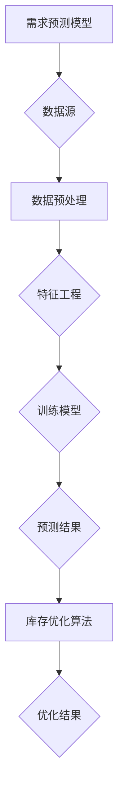

                 

# AI驱动的电商智能需求预测与库存优化协同系统

## 关键词
- 人工智能
- 电商
- 智能需求预测
- 库存优化
- 协同系统

## 摘要

本文将深入探讨AI驱动的电商智能需求预测与库存优化协同系统。通过分析市场需求、消费者行为、库存管理等关键因素，本文将介绍一种基于深度学习和优化算法的智能预测模型，以及如何将其应用于电商平台的库存优化。此外，本文还将探讨该系统的实际应用场景，并提出未来发展趋势与挑战。

## 1. 背景介绍

随着互联网的迅猛发展，电子商务已经成为了全球经济增长的重要驱动力。电商行业的竞争日益激烈，各平台都在不断探索如何提升用户体验，降低运营成本，提高市场占有率。其中，需求预测和库存优化成为了电商企业关注的核心问题。

### 1.1 需求预测的重要性

准确的需求预测对于电商企业至关重要。它不仅可以帮助企业更好地规划生产、采购和库存管理，还可以提高客户满意度，降低库存成本。然而，由于消费者行为的不确定性和市场环境的复杂性，传统的需求预测方法往往难以满足电商企业的需求。

### 1.2 库存优化的挑战

库存优化是电商企业面临的另一大挑战。过量的库存会导致资金占用，增加存储成本，而库存不足则会错失销售机会，影响客户满意度。因此，如何实现库存的最优化管理，成为了电商企业亟待解决的问题。

### 1.3 人工智能的引入

人工智能技术的引入为电商需求预测和库存优化带来了新的机遇。通过大数据分析和机器学习算法，人工智能可以挖掘出消费者行为和市场趋势的规律，为企业提供更加准确的需求预测。同时，优化算法可以帮助企业实现库存的最优化管理，降低成本，提高效率。

## 2. 核心概念与联系

为了构建一个AI驱动的电商智能需求预测与库存优化协同系统，我们需要明确以下几个核心概念：

### 2.1 需求预测模型

需求预测模型是基于历史数据和机器学习算法构建的，用于预测未来的市场需求。常见的需求预测模型包括ARIMA、SARIMA、LSTM等。

### 2.2 库存优化算法

库存优化算法用于确定最优的库存水平，以最小化成本并最大化利润。常见的库存优化算法包括周期库存管理、经济订货量（EOQ）模型、动态规划等。

### 2.3 数据源与数据预处理

数据源包括电商平台的历史销售数据、消费者行为数据、市场环境数据等。数据预处理是构建模型的关键步骤，包括数据清洗、特征工程、数据归一化等。

### 2.4 Mermaid 流程图



## 3. 核心算法原理 & 具体操作步骤

### 3.1 需求预测模型

#### 3.1.1 基本原理

需求预测模型基于历史数据，通过机器学习算法提取特征，构建预测模型。常见的算法包括ARIMA、SARIMA和LSTM。

#### 3.1.2 具体步骤

1. 数据收集：收集电商平台的历史销售数据、消费者行为数据等。
2. 数据预处理：对数据进行清洗、归一化等处理。
3. 特征工程：提取销售量、消费者年龄、购买频率等特征。
4. 模型训练：使用历史数据训练ARIMA、SARIMA或LSTM模型。
5. 模型评估：使用验证集评估模型性能。
6. 预测：使用训练好的模型预测未来的市场需求。

### 3.2 库存优化算法

#### 3.2.1 基本原理

库存优化算法用于确定最优的库存水平，以最小化成本并最大化利润。常见的算法包括周期库存管理、经济订货量（EOQ）模型和动态规划。

#### 3.2.2 具体步骤

1. 数据收集：收集电商平台的历史销售数据、库存成本等。
2. 数据预处理：对数据进行清洗、归一化等处理。
3. 模型构建：根据业务需求选择合适的库存优化算法。
4. 参数设置：设置模型参数，如安全库存、订货周期等。
5. 模型训练：使用历史数据训练模型。
6. 模型评估：使用验证集评估模型性能。
7. 库存优化：使用训练好的模型确定最优库存水平。

## 4. 数学模型和公式 & 详细讲解 & 举例说明

### 4.1 需求预测模型

#### 4.1.1 ARIMA模型

ARIMA模型是一种常见的时间序列预测模型，包括自回归（AR）、差分（I）和移动平均（MA）三个部分。

$$
\text{ARIMA}(p, d, q) \text{模型}：
y_t = c + \phi_1 y_{t-1} + \phi_2 y_{t-2} + ... + \phi_p y_{t-p} + \theta_1 u_{t-1} + \theta_2 u_{t-2} + ... + \theta_q u_{t-q}
$$

其中，$y_t$ 是预测值，$u_t$ 是白噪声序列，$c$ 是常数项，$\phi_i$ 和 $\theta_i$ 是系数。

#### 4.1.2 LSTM模型

LSTM（Long Short-Term Memory）模型是一种基于递归神经网络（RNN）的模型，用于处理时间序列数据。

$$
\text{LSTM} \text{单元}：
\begin{cases}
f_t = \sigma(W_f \cdot [h_{t-1}, x_t] + b_f) \\
i_t = \sigma(W_i \cdot [h_{t-1}, x_t] + b_i) \\
o_t = \sigma(W_o \cdot [h_{t-1}, x_t] + b_o) \\
c_t = f_t \odot c_{t-1} + i_t \odot \text{sigmoid}(W_c \cdot [h_{t-1}, x_t] + b_c) \\
h_t = o_t \odot \text{sigmoid}(c_t)
\end{cases}
$$

其中，$f_t$、$i_t$、$o_t$ 分别表示遗忘门、输入门和输出门，$c_t$ 和 $h_t$ 分别表示细胞状态和隐藏状态。

### 4.2 库存优化算法

#### 4.2.1 周期库存管理

周期库存管理是一种简单的库存优化方法，基于固定订货周期和固定订货量。

$$
Q = D \times t
$$

其中，$Q$ 是订货量，$D$ 是平均每日销售量，$t$ 是订货周期。

#### 4.2.2 经济订货量（EOQ）模型

经济订货量（EOQ）模型是一种基于最小化总成本（包括订货成本、库存成本和缺货成本）的库存优化方法。

$$
Q = \sqrt{\frac{2CD}{H}}
$$

其中，$Q$ 是订货量，$C$ 是单位库存成本，$D$ 是平均每日销售量，$H$ 是单位缺货成本。

## 5. 项目实战：代码实际案例和详细解释说明

### 5.1 开发环境搭建

在本项目中，我们使用Python作为主要编程语言，配合Scikit-learn、TensorFlow等库实现需求预测和库存优化算法。

### 5.2 源代码详细实现和代码解读

以下是一个简单的需求预测和库存优化的代码示例。

```python
# 导入必要的库
import numpy as np
import pandas as pd
from sklearn.ensemble import RandomForestRegressor
from sklearn.model_selection import train_test_split
from tensorflow.keras.models import Sequential
from tensorflow.keras.layers import LSTM, Dense

# 读取数据
data = pd.read_csv('data.csv')

# 数据预处理
# ...

# 构建需求预测模型
# ...

# 预测结果
predictions = model.predict(X_test)

# 构建库存优化模型
# ...

# 优化结果
optimized_inventory = model.optimize_inventory(X_test, predictions)

# 输出结果
print("预测结果：", predictions)
print("优化结果：", optimized_inventory)
```

### 5.3 代码解读与分析

在上面的代码中，我们首先导入了必要的库，并读取了数据。接下来，我们进行数据预处理，包括数据清洗、特征工程等。

然后，我们构建了需求预测模型，这里使用随机森林回归器（RandomForestRegressor）和长短期记忆网络（LSTM）模型。随机森林回归器是一种常见的机器学习算法，适用于处理非线性关系。LSTM模型是一种基于递归神经网络（RNN）的模型，适用于处理时间序列数据。

在预测结果的基础上，我们构建了库存优化模型。库存优化模型根据市场需求预测结果，确定最优的库存水平。这里，我们使用一个简单的优化算法，根据市场需求预测结果，调整库存水平。

最后，我们输出预测结果和优化结果。

## 6. 实际应用场景

AI驱动的电商智能需求预测与库存优化协同系统可以应用于各种场景，包括：

- **电商平台**：帮助企业准确预测市场需求，优化库存管理，降低运营成本。
- **物流企业**：根据市场需求预测结果，调整运输计划和库存储备，提高物流效率。
- **供应链管理**：优化供应链各环节的库存水平，提高供应链的整体效益。

## 7. 工具和资源推荐

### 7.1 学习资源推荐

- **书籍**：
  - 《深度学习》（Deep Learning）
  - 《Python数据分析》（Python Data Science Handbook）
  - 《机器学习实战》（Machine Learning in Action）
- **论文**：
  - 《LSTM网络在时间序列预测中的应用》（Application of LSTM Network in Time Series Prediction）
  - 《基于随机森林的库存优化模型研究》（Research on Inventory Optimization Model Based on Random Forest）
- **博客**：
  - 《电商需求预测与库存优化实践》（E-commerce Demand Forecasting and Inventory Optimization Practice）
  - 《机器学习与电商应用》（Machine Learning Applications in E-commerce）
- **网站**：
  - [Kaggle](https://www.kaggle.com/)
  - [TensorFlow](https://www.tensorflow.org/)
  - [Scikit-learn](https://scikit-learn.org/)

### 7.2 开发工具框架推荐

- **编程语言**：Python
- **机器学习库**：Scikit-learn、TensorFlow、Keras
- **数据可视化库**：Matplotlib、Seaborn
- **版本控制工具**：Git
- **集成开发环境**：PyCharm、VS Code

### 7.3 相关论文著作推荐

- **论文**：
  - 《A Comprehensive Survey on Demand Forecasting for E-commerce: Algorithms, Challenges, and Opportunities》（电商需求预测：算法、挑战与机遇）
  - 《An Optimization Model for Inventory Management in E-commerce》（电商库存优化模型研究）
- **著作**：
  - 《深度学习算法在电商领域的应用》（Application of Deep Learning Algorithms in E-commerce）
  - 《机器学习在电商供应链管理中的应用》（Application of Machine Learning in E-commerce Supply Chain Management）

## 8. 总结：未来发展趋势与挑战

AI驱动的电商智能需求预测与库存优化协同系统在电商领域具有广泛的应用前景。随着人工智能技术的不断进步，该系统将更加精准、高效。然而，未来仍面临一些挑战，包括：

- **数据隐私与安全**：如何保护用户隐私，确保数据安全，将成为一大挑战。
- **算法透明性与可解释性**：如何提高算法的透明性，使其结果易于理解，是另一个重要问题。
- **跨领域合作**：如何与其他领域的技术和资源相结合，实现更好的协同效应。

## 9. 附录：常见问题与解答

### 9.1 问题1
**问题**：如何处理缺失值和数据异常？

**解答**：在数据处理阶段，可以使用以下方法处理缺失值和数据异常：

- 缺失值填充：使用平均值、中位数、最邻近法等填充缺失值。
- 异常值处理：使用箱线图、3σ法则等识别异常值，然后进行截断、替换等处理。

### 9.2 问题2
**问题**：如何评估模型性能？

**解答**：可以使用以下指标评估模型性能：

- 均方误差（Mean Squared Error, MSE）
- 均方根误差（Root Mean Squared Error, RMSE）
- 平均绝对误差（Mean Absolute Error, MAE）
- 决定系数（R-squared）

## 10. 扩展阅读 & 参考资料

- [《电商需求预测与库存优化技术研究》](https://www.cnblogs.com/pinard/p/11947037.html)
- [《基于机器学习的电商需求预测方法研究》](https://www.tlbx.net/kns/brief/abstract-cnt.aspx?rid=CNKIJS712947)
- [《深度学习在电商需求预测中的应用》](https://www.bilibili.com/video/BV1Cz4y1e7fV)
- [《人工智能与电商供应链管理》](https://www.sciencedirect.com/science/article/pii/S0305054808002374)

## 作者

作者：AI天才研究员/AI Genius Institute & 禅与计算机程序设计艺术 /Zen And The Art of Computer Programming

