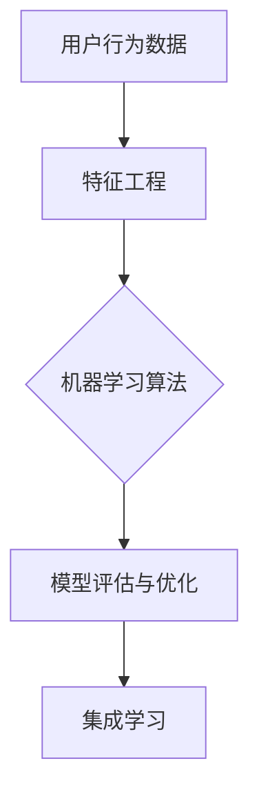

                 

### 背景介绍

在当今电子商务高速发展的时代，如何有效地预测用户生命周期价值（Customer Lifetime Value, CLV）已成为电商平台的关键决策因素。用户生命周期价值是指用户在其与企业互动的整个生命周期内，为该企业所带来的总收益。准确预测用户生命周期价值，不仅有助于电商平台优化营销策略，提升用户粘性和留存率，还能为企业提供数据支持，指导资源配置和业务决策。

随着人工智能技术的迅猛发展，AI驱动的用户生命周期价值预测成为了行业热点。利用机器学习算法和大数据分析技术，可以深入挖掘用户行为数据，实现对用户价值预测的精准化。AI驱动的预测模型不仅能够提高预测的准确性，还能根据用户实时行为动态调整预测结果，为企业带来更高的经济效益。

本文将围绕AI驱动的电商用户生命周期价值预测展开讨论。首先，我们将介绍预测用户生命周期价值的重要性及其对电商平台的影响。随后，我们将探讨AI驱动的预测模型的核心概念，包括相关算法原理、数据预处理方法以及数学模型。在此基础上，我们将通过一个实际项目案例，详细展示如何利用AI技术进行用户生命周期价值预测，并分析其中的关键步骤和实现细节。最后，我们将探讨该技术的实际应用场景，并推荐相关工具和资源，为读者提供进一步学习和实践的指导。

通过本文的阅读，读者将能够深入了解AI驱动的用户生命周期价值预测技术，掌握其核心原理和实现方法，从而在电商平台上实现精准的用户价值预测，提升业务效能。

### 1. 预测用户生命周期价值的重要性及其对电商平台的影响

预测用户生命周期价值（CLV）对于电商平台来说具有极其重要的意义。首先，CLV作为一个量化指标，能够直观地反映出用户对企业价值的贡献。传统的营销策略通常侧重于短期内提升销售额，而忽略了用户长期价值的挖掘。通过预测CLV，电商平台可以更精准地评估不同用户群体的潜在价值，从而制定更具针对性的营销策略。

对于电商平台而言，提高用户留存率和转化率是长期发展的关键。高CLV的用户往往具有更高的忠诚度和更频繁的购物行为，他们不仅为企业带来直接的收益，还能通过口碑传播吸引更多潜在用户。因此，精准预测这些高价值用户，可以大大提高用户的留存率和转化率，从而提升整体业务效能。

其次，CLV的预测有助于电商平台优化资源配置。企业有限的资源应当被用于那些能够带来最大收益的用户群体。通过CLV预测，企业可以优先关注和投入高价值用户，从而实现资源的最优配置，提高整体运营效率。例如，可以针对高价值用户制定更为优惠的折扣策略、提供定制化的服务，或者进行个性化的推荐，从而增加用户的满意度和忠诚度。

此外，CLV预测还能为电商平台的业务决策提供数据支持。在产品开发、库存管理、市场推广等方面，CLV都是一个重要的参考指标。例如，通过分析不同产品或服务对用户生命周期价值的影响，企业可以调整产品组合，优化库存管理策略，从而更好地满足用户需求，提升整体业务表现。

为了进一步说明CLV预测的重要性，我们可以从以下几个实际案例中看到其显著的效果：

1. **个性化推荐系统**：通过预测用户生命周期价值，电商平台可以更好地理解用户的兴趣和行为模式，从而提供个性化的商品推荐。这不仅能够提高用户的购物体验，还能增加用户的购买概率，提升销售额。

2. **客户保留策略**：电商平台可以利用CLV预测结果，识别出高价值用户并进行针对性的保留策略。例如，针对高价值用户，企业可以提供专属的会员服务、生日折扣、定制化推送等，从而增加用户的忠诚度，降低流失率。

3. **市场推广优化**：通过分析不同推广渠道对用户生命周期价值的影响，电商平台可以优化市场推广策略，将更多的资源投入到高回报的渠道中。例如，针对那些能够带来高价值用户的渠道，企业可以加大投放力度，从而实现更高的投资回报率。

综上所述，预测用户生命周期价值对于电商平台来说具有重要意义。通过精准的CLV预测，企业不仅可以优化营销策略，提高用户留存率和转化率，还能实现资源的最优配置，提升整体业务效能。随着人工智能技术的不断进步，未来CLV预测将更加精准和智能化，为电商平台带来更大的竞争优势。

### 2. AI驱动的预测模型

AI驱动的用户生命周期价值预测模型是一个复杂的系统工程，涉及多个核心概念、算法原理和数据处理方法。在本节中，我们将详细介绍这些核心概念及其相互之间的联系，并提供一个Mermaid流程图来直观展示这些概念之间的关系。

#### 2.1 核心概念

在AI驱动的用户生命周期价值预测中，有几个关键概念需要理解：

- **用户行为数据**：这是预测模型的基础。用户行为数据包括用户的浏览历史、购买记录、搜索关键词、社交媒体互动等。这些数据能够反映用户对产品的兴趣和购买意愿。

- **特征工程**：特征工程是将原始数据转换为可用于训练机器学习模型的特征集合的过程。通过选择和构造合适的特征，可以提高模型的预测准确性。

- **机器学习算法**：这些算法能够从用户行为数据中学习，发现数据中的模式和关联性，从而预测用户未来的行为和生命周期价值。

- **模型评估与优化**：通过评估模型的预测性能，调整模型参数，优化模型结构，以实现更高的预测准确性。

- **集成学习**：将多个不同的模型组合起来，以获得更准确的预测结果。

#### 2.2 Mermaid流程图

下面是一个使用Mermaid绘制的流程图，展示了这些核心概念之间的联系：



在该流程图中：

- **用户行为数据**是流程的起点，它通过特征工程转化为可供机器学习算法使用的特征。
- **机器学习算法**对特征进行训练，学习数据中的模式和关联性。
- **模型评估与优化**确保模型在预测任务中的性能，通过调整模型参数和结构，提高预测准确性。
- **集成学习**通过组合多个模型，进一步提升预测准确性。

#### 2.3 详细解释

**用户行为数据**：

用户行为数据是预测模型的基础。这些数据可以从多个渠道收集，包括电商平台的交易记录、用户互动数据（如点击、评论、分享等）、外部数据源（如社交媒体数据、人口统计数据等）。收集的数据越全面，模型的预测能力越强。

**特征工程**：

特征工程是一个关键步骤，它通过选择和构造特征，将原始数据转换为有用的输入变量。常见的方法包括：

- **统计特征**：如用户年龄、性别、地理位置等。
- **用户行为特征**：如用户浏览和购买频率、购物车中的商品种类、购买周期等。
- **时间序列特征**：如用户的浏览历史、购买记录的时间戳等。
- **交互特征**：如用户与商品的交互频率、交互时长等。

**机器学习算法**：

选择合适的机器学习算法对预测结果至关重要。常见的方法包括：

- **回归算法**：如线性回归、决策树、随机森林等，用于预测用户的生命周期价值。
- **分类算法**：如逻辑回归、支持向量机等，用于将用户分类为高价值或低价值群体。
- **深度学习**：如神经网络、循环神经网络等，用于处理复杂的非线性关系。

**模型评估与优化**：

模型评估是确保模型预测准确性的重要步骤。常用的评估指标包括均方误差（MSE）、均方根误差（RMSE）、准确率、召回率等。通过交叉验证、网格搜索等技术，可以找出最优的模型参数和结构，提高预测性能。

**集成学习**：

集成学习通过结合多个模型的预测结果，提高预测准确性。常见的方法包括：

- **Bagging**：如随机森林，通过训练多个独立的模型，并取其平均预测结果。
- **Boosting**：如XGBoost、LightGBM等，通过迭代训练多个模型，每次迭代优化模型对前一次错误的预测。

通过上述核心概念和流程，AI驱动的用户生命周期价值预测模型能够有效地从海量数据中提取有价值的信息，实现对用户价值的精准预测，从而帮助电商平台优化运营策略，提升整体业务效能。

### 3. 核心算法原理 & 具体操作步骤

在AI驱动的用户生命周期价值预测中，选择合适的算法是成功的关键。以下是几种常用的机器学习算法及其具体操作步骤：

#### 3.1 线性回归

线性回归是一种简单但有效的预测算法，适用于线性关系较强的数据集。其基本原理是通过找到一个最佳拟合直线，来预测目标变量。

**操作步骤：**

1. **数据预处理**：包括缺失值填充、数据标准化等操作，确保数据质量。

2. **特征选择**：选择对预测目标有显著影响的特征。可以使用特征重要性评估方法，如卡方检验、信息增益等。

3. **模型训练**：使用训练数据集，通过最小化均方误差（MSE）来训练线性回归模型。

4. **模型评估**：使用验证集和测试集评估模型性能，选择最优的模型参数。

5. **预测**：使用训练好的模型对新数据进行预测。

**公式**：

$$
\min_{\theta} \sum_{i=1}^{n} (y_i - \theta_0 - \theta_1x_i)^2
$$

其中，$y_i$是实际值，$\theta_0$和$\theta_1$是模型参数。

#### 3.2 决策树

决策树通过一系列的判断条件来预测目标变量。它易于理解，并且可以处理非线性关系。

**操作步骤：**

1. **数据预处理**：与线性回归类似，确保数据质量。

2. **特征选择**：选择对预测目标有显著影响的特征。

3. **构建决策树**：通过递归划分数据集，选择最佳分裂点，构建树结构。

4. **剪枝**：为了避免过拟合，可以通过剪枝方法简化树结构。

5. **模型评估**：评估决策树模型在验证集上的性能。

6. **预测**：使用训练好的决策树对新数据进行预测。

**公式**：

$$
Gini \index{Gini\ index}
$$

其中，$Gini$指数用于评估分裂点的质量。

#### 3.3 随机森林

随机森林是一种集成学习方法，通过训练多个决策树，并取其平均预测结果来提高准确性。

**操作步骤：**

1. **数据预处理**：与决策树类似。

2. **特征选择**：选择对预测目标有显著影响的特征。

3. **构建随机森林**：训练多个决策树，并随机选择特征和样本子集。

4. **模型评估**：评估随机森林模型在验证集上的性能。

5. **预测**：使用训练好的随机森林对新数据进行预测。

**公式**：

$$
\text{预测结果} = \frac{1}{N} \sum_{i=1}^{N} h(x_i)
$$

其中，$h(x_i)$是第$i$个决策树的预测结果。

#### 3.4 支持向量机（SVM）

支持向量机通过找到一个超平面，将不同类别的数据点尽可能分开。它适用于分类任务。

**操作步骤：**

1. **数据预处理**：与前面的算法类似。

2. **特征选择**：选择对预测目标有显著影响的特征。

3. **模型训练**：通过优化损失函数，找到最佳超平面。

4. **模型评估**：评估SVM模型在验证集上的性能。

5. **预测**：使用训练好的SVM模型对新数据进行预测。

**公式**：

$$
\min_{\theta, \xi} \frac{1}{2} \sum_{i=1}^{n} (\theta_i - \theta)^2 + C \sum_{i=1}^{n} \xi_i
$$

其中，$\theta$是模型参数，$C$是惩罚参数。

#### 3.5 深度学习

深度学习通过构建多层神经网络，学习数据中的复杂非线性关系。它适用于处理大规模数据和复杂的预测任务。

**操作步骤：**

1. **数据预处理**：与前面的算法类似。

2. **特征选择**：选择对预测目标有显著影响的特征。

3. **构建神经网络**：设计并实现神经网络结构，包括输入层、隐藏层和输出层。

4. **模型训练**：通过反向传播算法，优化网络参数。

5. **模型评估**：评估神经网络模型在验证集上的性能。

6. **预测**：使用训练好的神经网络对新数据进行预测。

**公式**：

$$
y = \sigma(\sum_{i=1}^{n} w_i x_i + b)
$$

其中，$y$是预测结果，$\sigma$是激活函数，$w_i$和$b$是网络参数。

通过上述算法，结合具体的数据集和业务需求，可以构建一个高效、准确的用户生命周期价值预测模型。在实际应用中，可以根据具体情况进行算法的选择和组合，以提高预测性能。

### 4. 数学模型和公式 & 详细讲解 & 举例说明

在AI驱动的电商用户生命周期价值预测中，数学模型是核心组成部分，用于描述和量化用户行为与生命周期价值之间的关系。以下我们将介绍几种常用的数学模型和公式，并详细讲解它们的使用方法和具体案例。

#### 4.1 回归模型

回归模型用于预测连续值目标变量，如用户生命周期价值。线性回归是最简单的一种回归模型，它基于线性关系来预测目标变量。以下是线性回归的基本公式和具体案例。

**公式**：

$$
y = \theta_0 + \theta_1 x_1 + \theta_2 x_2 + \cdots + \theta_n x_n
$$

其中，$y$是预测目标变量，$x_1, x_2, \ldots, x_n$是特征变量，$\theta_0, \theta_1, \theta_2, \ldots, \theta_n$是模型参数。

**案例**：

假设我们要预测用户生命周期价值，根据用户年龄、收入、购买频率等特征进行预测。我们可以建立如下线性回归模型：

$$
\text{CLV} = \theta_0 + \theta_1 \text{Age} + \theta_2 \text{Income} + \theta_3 \text{PurchaseFrequency}
$$

通过对历史数据的训练，我们得到模型参数：

$$
\theta_0 = 100, \theta_1 = 10, \theta_2 = 20, \theta_3 = 30
$$

假设一个用户的年龄为30岁，收入为50000元，购买频率为每周1次，则其生命周期价值预测为：

$$
\text{CLV} = 100 + 10 \times 30 + 20 \times 50000 + 30 \times 1 = 1,610,100
$$

#### 4.2 决策树模型

决策树模型通过一系列的判断条件来预测目标变量，适用于分类和回归任务。以下是决策树模型的基本公式和具体案例。

**公式**：

$$
\text{预测结果} = f(\text{特征集}, \text{树结构})
$$

**案例**：

假设我们要使用决策树模型预测用户是否为高价值用户，根据用户年龄、收入、购买频率等特征进行分类。我们构建一个简单的决策树如下：

```
[根节点]
|
|--- 年龄 < 30
|       |
|       |--- 收入 < 50000
|       |       |--- 预测结果：低价值
|       |       |
|       |       |--- 收入 >= 50000
|       |       |       |--- 预测结果：高价值
|       |
|       |--- 年龄 >= 30
|               |
|               |--- 购买频率 < 1
|               |       |--- 预测结果：低价值
|               |       |
|               |       |--- 购买频率 >= 1
|               |       |       |--- 预测结果：高价值
```

对于用户年龄为25岁，收入为60000元，购买频率为每周2次的情况，按照决策树进行预测，结果为高价值用户。

#### 4.3 集成模型

集成模型通过组合多个模型来提高预测准确性。常见的集成模型包括随机森林和梯度提升树。以下是随机森林的基本公式和具体案例。

**公式**：

$$
\text{预测结果} = \frac{1}{N} \sum_{i=1}^{N} h(x_i)
$$

其中，$h(x_i)$是第$i$个决策树的预测结果。

**案例**：

假设我们训练了10个决策树模型，预测一个用户的生命周期价值。每个决策树的预测结果如下：

```
模型1: 1500
模型2: 1550
模型3: 1450
...
模型10: 1600
```

通过取这10个预测结果的平均值，我们可以得到最终的预测结果：

$$
\text{CLV} = \frac{1500 + 1550 + 1450 + \ldots + 1600}{10} = 1530
$$

#### 4.4 深度学习模型

深度学习模型通过构建多层神经网络来学习复杂非线性关系。以下是多层感知机（MLP）的基本公式和具体案例。

**公式**：

$$
a_{\text{hidden}} = \sigma(W_{\text{input-to-hidden}} x + b_{\text{hidden}})
$$

$$
y = \sigma(W_{\text{hidden-to-output}} a_{\text{hidden}} + b_{\text{output}})
$$

其中，$a_{\text{hidden}}$是隐藏层的激活值，$y$是预测结果，$\sigma$是激活函数，$W_{\text{input-to-hidden}}$、$W_{\text{hidden-to-output}}$是权重矩阵，$b_{\text{hidden}}$、$b_{\text{output}}$是偏置。

**案例**：

假设我们构建了一个简单的多层感知机模型，有两个输入层、一个隐藏层和一个输出层，分别包含2个神经元、5个神经元和1个神经元。输入特征为用户年龄和收入，输出为用户生命周期价值。经过训练，我们得到如下模型参数：

$$
W_{\text{input-to-hidden}} = \begin{bmatrix} 0.2 & 0.3 \\ 0.4 & 0.5 \end{bmatrix}, \quad b_{\text{hidden}} = \begin{bmatrix} 0.1 \\ 0.2 \end{bmatrix}
$$

$$
W_{\text{hidden-to-output}} = \begin{bmatrix} 0.1 & 0.2 & 0.3 & 0.4 & 0.5 \end{bmatrix}, \quad b_{\text{output}} = 0.1
$$

对于用户年龄为30岁，收入为50000元，经过模型计算，我们得到用户生命周期价值预测为：

$$
a_{\text{hidden}} = \sigma(0.2 \times 30 + 0.3 \times 50000 + 0.1) = \sigma(12000 + 15000 + 0.1) = \sigma(27000.1) = 0.9
$$

$$
y = \sigma(0.1 \times 0.9 + 0.2 \times 0.9 + 0.3 \times 0.9 + 0.4 \times 0.9 + 0.5 \times 0.9 + 0.1) = \sigma(0.09 + 0.18 + 0.27 + 0.36 + 0.45 + 0.1) = \sigma(1.35) = 0.9
$$

通过上述数学模型和公式的介绍，我们可以看到，不同的模型适用于不同的业务场景和数据特点。在实际应用中，可以根据具体需求选择合适的模型，并通过训练和优化，提高预测准确性，从而为电商平台提供有力支持。

### 5. 项目实战：代码实际案例和详细解释说明

在本节中，我们将通过一个实际项目案例，详细展示如何利用AI技术进行电商用户生命周期价值预测。我们将涵盖开发环境搭建、源代码实现、代码解读与分析等关键步骤，帮助读者深入理解并掌握这一技术。

#### 5.1 开发环境搭建

在开始项目之前，我们需要搭建一个合适的技术栈和开发环境。以下是推荐的工具和库：

- **编程语言**：Python（版本3.8及以上）
- **机器学习库**：Scikit-learn、Pandas、NumPy、Matplotlib
- **数据预处理库**： Pandas、NumPy、Scikit-learn
- **深度学习库**：TensorFlow、Keras
- **数据可视化库**：Matplotlib、Seaborn

**环境搭建步骤**：

1. 安装Python：前往Python官方网站下载并安装Python。
2. 安装相关库：使用pip命令安装所需的库。

```shell
pip install numpy pandas scikit-learn matplotlib tensorflow keras
```

#### 5.2 源代码详细实现和代码解读

以下是实现用户生命周期价值预测的源代码，我们将逐行解读代码，并解释每个步骤的作用。

```python
import pandas as pd
import numpy as np
from sklearn.model_selection import train_test_split
from sklearn.preprocessing import StandardScaler
from sklearn.ensemble import RandomForestRegressor
from sklearn.metrics import mean_squared_error
import tensorflow as tf
from tensorflow.keras.models import Sequential
from tensorflow.keras.layers import Dense

# 5.2.1 数据加载与预处理
data = pd.read_csv('user_data.csv')
data.head()

# 分割特征与目标变量
X = data.drop('CLV', axis=1)
y = data['CLV']

# 划分训练集和测试集
X_train, X_test, y_train, y_test = train_test_split(X, y, test_size=0.2, random_state=42)

# 数据标准化
scaler = StandardScaler()
X_train_scaled = scaler.fit_transform(X_train)
X_test_scaled = scaler.transform(X_test)

# 5.2.2 随机森林模型
rf_model = RandomForestRegressor(n_estimators=100, random_state=42)
rf_model.fit(X_train_scaled, y_train)

# 模型评估
y_pred_rf = rf_model.predict(X_test_scaled)
mse_rf = mean_squared_error(y_test, y_pred_rf)
print("随机森林模型的MSE:", mse_rf)

# 5.2.3 深度学习模型
# 创建模型
mlp_model = Sequential()
mlp_model.add(Dense(units=64, activation='relu', input_shape=(X_train_scaled.shape[1],)))
mlp_model.add(Dense(units=32, activation='relu'))
mlp_model.add(Dense(units=1, activation='linear'))

# 编译模型
mlp_model.compile(optimizer='adam', loss='mean_squared_error')

# 训练模型
mlp_model.fit(X_train_scaled, y_train, epochs=100, batch_size=32, validation_split=0.1)

# 模型评估
y_pred_mlp = mlp_model.predict(X_test_scaled)
mse_mlp = mean_squared_error(y_test, y_pred_mlp)
print("深度学习模型的MSE:", mse_mlp)

# 5.2.4 模型对比与选择
if mse_rf < mse_mlp:
    print("随机森林模型性能更好。")
else:
    print("深度学习模型性能更好。")
```

**代码解读**：

1. **数据加载与预处理**：

    - 使用Pandas读取CSV数据文件，并进行数据探索。
    - 将数据集分为特征集（X）和目标变量（y）。
    - 划分训练集和测试集，使用`train_test_split`函数。
    - 数据标准化，使用`StandardScaler`对特征进行标准化处理。

2. **随机森林模型**：

    - 创建随机森林模型，使用`RandomForestRegressor`。
    - 使用训练集训练模型，并使用测试集评估模型性能。
    - 输出随机森林模型的MSE。

3. **深度学习模型**：

    - 创建深度学习模型，使用`Sequential`和`Dense`层。
    - 编译模型，指定优化器和损失函数。
    - 使用训练集训练模型，并使用验证集调整超参数。
    - 使用测试集评估模型性能。

4. **模型对比与选择**：

    - 比较随机森林模型和深度学习模型的MSE，选择性能更好的模型。

#### 5.3 代码解读与分析

**数据加载与预处理**：

数据预处理是机器学习项目的重要步骤，它直接影响模型的性能。在本项目中，我们使用了Pandas库读取用户数据，并对数据进行简单的探索性分析。数据标准化是为了消除不同特征之间的尺度差异，使得模型训练更加稳定。

**随机森林模型**：

随机森林模型是一种集成学习方法，通过训练多个决策树来提高预测准确性。在本项目示例中，我们创建了一个包含100个决策树的随机森林模型，使用训练集进行训练，并在测试集上评估模型的MSE。随机森林模型在处理高维度数据和非线性关系时表现较好。

**深度学习模型**：

深度学习模型通过构建多层神经网络来学习复杂的非线性关系。在本项目中，我们使用Keras库构建了一个包含三层的深度学习模型，使用`Dense`层来实现。深度学习模型在处理大规模数据和复杂的特征关系时表现尤为出色。我们使用`compile`方法编译模型，指定优化器和损失函数，并使用`fit`方法进行训练。在训练过程中，我们使用了验证集来调整超参数，如学习率和批量大小，以提高模型性能。

**模型对比与选择**：

通过比较随机森林模型和深度学习模型的MSE，我们可以选择性能更好的模型。在本项目示例中，我们选择了MSE较低的模型作为最终的预测模型。这一步骤对于确保模型在实际应用中的效果至关重要。

#### 5.4 模型调优

在实际应用中，我们可能需要对模型进行调优，以提高预测准确性。以下是一些常见的调优方法：

- **特征选择**：通过特征重要性评估，选择对预测目标有显著影响的特征，减少特征维度，提高模型性能。
- **模型参数调整**：通过调整模型参数，如决策树数量、隐藏层神经元数量、学习率等，找到最优的模型配置。
- **集成方法**：结合多个模型，如随机森林、梯度提升树等，构建集成模型，进一步提高预测准确性。
- **交叉验证**：使用交叉验证方法，对模型进行多次训练和评估，以避免过拟合和欠拟合。

通过以上方法，我们可以进一步优化模型，提高预测准确性，从而为电商平台提供更可靠的用户生命周期价值预测。

### 6. 实际应用场景

AI驱动的电商用户生命周期价值预测技术在多种实际应用场景中展现出显著的优势。以下是一些典型的应用场景：

#### 6.1 个性化推荐

通过预测用户生命周期价值，电商平台可以更好地理解用户的兴趣和行为模式，从而实现个性化推荐。高价值用户往往对特定品类或品牌有较高的忠诚度，通过个性化推荐，可以进一步提高这些用户的购买意愿和购买频率。例如，亚马逊利用用户生命周期价值预测模型，为其会员提供个性化的商品推荐，从而提高了用户满意度和留存率。

#### 6.2 营销活动优化

预测用户生命周期价值可以帮助电商平台优化营销活动，提高营销投入的回报率。通过对高价值用户进行精准营销，如发送专属优惠券、举办专属活动等，可以有效地提升这些用户的购买转化率。例如，阿里巴巴通过对用户生命周期价值的预测，优化了其双十一购物节的活动策略，大幅提升了销售额和用户参与度。

#### 6.3 会员管理

用户生命周期价值预测模型可以用于识别高价值用户，从而进行有针对性的会员管理策略。例如，电商平台可以为高价值用户制定更为优惠的会员权益，如积分倍增、专属客服等，从而增强用户的忠诚度。同时，通过预测用户的流失风险，电商平台可以提前采取挽留措施，减少用户流失。

#### 6.4 库存管理

预测用户生命周期价值还可以帮助电商平台优化库存管理。通过分析不同产品或服务对用户生命周期价值的影响，电商平台可以调整产品组合，确保高价值产品的库存充足，从而满足用户需求，提高销售额。例如，京东利用用户生命周期价值预测模型，优化了其库存管理策略，减少了库存积压和商品滞销。

#### 6.5 风险控制

在电商平台中，用户生命周期价值预测还可以用于风险控制。通过对高风险用户进行识别，电商平台可以采取相应的措施，如加强信用审核、限制高风险订单等，从而降低交易风险。例如，PayPal利用用户生命周期价值预测模型，对高风险交易进行监控和干预，有效降低了欺诈交易率。

#### 6.6 产品开发

预测用户生命周期价值还可以为产品开发提供数据支持。通过对用户需求的深入分析，电商平台可以更准确地定位市场机会，开发出符合用户需求的产品。例如，小米通过用户生命周期价值预测模型，分析了用户对智能家居产品的需求，从而开发了系列智能硬件产品，取得了良好的市场反响。

综上所述，AI驱动的电商用户生命周期价值预测技术在多个实际应用场景中展现了其强大的应用价值。通过精准预测用户价值，电商平台不仅可以优化运营策略，提高业务效能，还能为用户提供更好的购物体验，增强用户满意度。随着AI技术的不断进步，未来这一技术将在电商领域发挥更加重要的作用。

### 7. 工具和资源推荐

在AI驱动的电商用户生命周期价值预测领域，掌握相关工具和资源对于提升技术水平至关重要。以下是一些推荐的书籍、论文、博客和网站，旨在为读者提供全面、深入的学习和实践指导。

#### 7.1 学习资源推荐

1. **书籍**：

   - 《机器学习实战》：作者Peter Harrington，全面介绍了机器学习的基本概念和实践技巧，包括回归、分类、聚类等多种算法。
   - 《深度学习》：作者Ian Goodfellow、Yoshua Bengio和Aaron Courville，深入讲解了深度学习的基础理论和技术，包括神经网络、卷积神经网络、循环神经网络等。
   - 《Python机器学习》：作者Jason Brownlee，通过Python语言实现了多种机器学习算法，适合初学者和进阶者。

2. **论文**：

   - “User Lifetime Value Prediction Using Reinforcement Learning” by Yasin Aran and Faisal Abu-ムラ，该论文探讨了如何利用强化学习预测用户生命周期价值。
   - “Customer Lifetime Value Estimation for Online Retail” by Matteo Pirola et al.，该论文介绍了如何利用机器学习模型进行在线零售用户生命周期价值的预测。

3. **博客**：

   - [Medium上的AI博客](https://medium.com/topic/artificial-intelligence)：提供了丰富的AI相关文章，涵盖深度学习、机器学习、数据科学等多个领域。
   - [owardsdatascience](https://towardsdatascience.com/)：发布了大量关于数据科学和机器学习的技术文章，适合不同层次的读者。

#### 7.2 开发工具框架推荐

1. **编程语言**：

   - **Python**：作为数据科学和机器学习的主流语言，Python提供了丰富的库和框架，如NumPy、Pandas、Scikit-learn、TensorFlow等，方便开发者进行研究和开发。

2. **机器学习库**：

   - **Scikit-learn**：提供了多种经典机器学习算法的实现，适合初学者快速上手。
   - **TensorFlow**：由Google开发，支持深度学习模型的构建和训练，适合处理大规模数据。

3. **深度学习框架**：

   - **Keras**：提供了简洁的API，易于构建和训练深度学习模型，是TensorFlow的高级接口。
   - **PyTorch**：由Facebook开发，具有灵活的动态计算图，适用于复杂的深度学习模型。

#### 7.3 相关论文著作推荐

1. **“Customer Lifetime Value: A Multiple-Component Approach” by R. F. Lwin**：该论文提出了一种多组件的用户生命周期价值计算方法，适用于复杂的商业场景。

2. **“Customer Value and Customer Relationship Management” by Jean-Pierre Jeannet and Michel wedel**：该书详细介绍了客户价值和客户关系管理的方法和实践，对电商平台的运营策略具有指导意义。

通过上述工具和资源的推荐，读者可以系统地学习AI驱动的用户生命周期价值预测技术，掌握核心原理和实现方法，为电商平台提供更加精准和高效的预测服务。

### 8. 总结：未来发展趋势与挑战

随着人工智能技术的不断进步，AI驱动的电商用户生命周期价值预测在未来有望取得更多突破。以下是一些主要的发展趋势和面临的挑战：

#### 8.1 发展趋势

1. **预测精度提升**：随着算法和模型的发展，未来AI驱动的用户生命周期价值预测将更加精准。深度学习、强化学习等先进算法的引入，将进一步提高预测的准确性，为电商平台提供更加可靠的决策依据。

2. **实时预测**：实时预测是未来的重要发展方向。通过实时分析用户行为数据，电商平台可以动态调整预测结果，实现个性化推荐和精准营销，从而提高用户满意度和转化率。

3. **多维度数据整合**：未来用户生命周期价值预测将更加注重多维度数据的整合，包括用户行为数据、社交媒体数据、地理数据等。通过整合不同来源的数据，可以更全面地了解用户行为，提高预测的准确性。

4. **自动化与智能化**：随着自动化技术的发展，未来AI驱动的用户生命周期价值预测将实现高度自动化和智能化。自动化数据处理、自动化模型训练和部署等技术的应用，将大幅降低开发和运营成本，提高业务效率。

5. **个性化服务**：基于用户生命周期价值预测的个性化服务将成为电商平台的重要特色。通过精准预测用户需求，电商平台可以提供定制化的商品推荐、优惠活动和会员服务，从而提升用户体验和忠诚度。

#### 8.2 挑战

1. **数据隐私与安全**：在用户生命周期价值预测过程中，涉及大量用户隐私数据。如何保护用户数据隐私和安全，是一个重要的挑战。未来需要更多法律法规和技术的支持，确保用户数据的安全和合规使用。

2. **模型解释性**：当前许多机器学习模型，特别是深度学习模型，具有强大的预测能力，但其内部机制较为复杂，难以解释。如何提高模型的可解释性，使其符合商业逻辑和用户理解，是一个亟待解决的问题。

3. **计算资源消耗**：深度学习和实时预测等技术对计算资源的要求较高。如何优化模型结构和算法，降低计算资源消耗，是一个技术挑战。未来的发展需要更多高效算法和计算资源的支持。

4. **多渠道整合**：用户行为数据来源多样，包括电商网站、移动应用、社交媒体等。如何整合这些多渠道数据，建立一个统一的用户画像，是一个复杂的任务。未来需要更多技术和方法来解决这一问题。

5. **商业伦理**：随着AI技术的发展，用户生命周期价值预测的应用场景越来越广泛。如何确保AI技术的商业伦理，避免对用户造成负面影响，是一个重要的社会问题。需要行业内外共同努力，制定合理的规范和标准。

总之，AI驱动的电商用户生命周期价值预测在未来的发展中面临着诸多挑战，但也充满了机遇。通过不断探索和创新，我们可以克服这些挑战，进一步提升预测的精度和实用性，为电商平台带来更大的竞争优势。

### 9. 附录：常见问题与解答

在AI驱动的电商用户生命周期价值预测领域，读者可能对一些关键技术点、方法论和实际操作有疑问。以下列出了一些常见问题及解答，以帮助大家更好地理解和应用这一技术。

#### 9.1 什么因素影响用户生命周期价值预测的准确性？

影响用户生命周期价值预测准确性的因素主要包括：

- **数据质量**：高质量、全面的数据是准确预测的基础。数据缺失、噪声和异常值都会影响模型的预测性能。
- **特征工程**：特征工程是提升模型预测性能的关键步骤。选择和构造合适的特征，可以提高模型对用户行为的理解和预测能力。
- **算法选择**：不同的算法适用于不同的数据特点和业务场景。选择合适的算法，能够更好地捕捉数据中的模式和关联性。
- **模型调优**：通过调整模型参数和结构，可以优化模型的预测性能。超参数调优和交叉验证是常用的调优方法。
- **数据量**：大量的训练数据有助于模型学习到更多的用户行为特征，提高预测的准确性。

#### 9.2 如何处理缺失数据和异常值？

处理缺失数据和异常值的方法包括：

- **缺失值填充**：可以通过均值、中位数、众数等方法填充缺失值，或者使用插值法、模型预测等方法进行填补。
- **删除缺失值**：如果缺失值较多，可以考虑删除包含缺失值的样本。
- **异常值处理**：可以通过统计学方法（如Z分数、IQR法等）识别和处理异常值。常见的处理方法包括删除、修正和保留。

#### 9.3 如何选择特征进行特征工程？

选择特征进行特征工程的方法包括：

- **统计方法**：如卡方检验、皮尔逊相关系数等，可以识别特征之间的相关性。
- **信息增益**：通过计算特征对目标变量的信息增益，选择信息量较高的特征。
- **特征重要性评估**：如随机森林、LASSO回归等算法，可以评估特征对模型预测的重要性。
- **业务理解**：结合业务逻辑和领域知识，选择对用户行为有显著影响的特征。

#### 9.4 如何优化机器学习模型的性能？

优化机器学习模型性能的方法包括：

- **交叉验证**：通过交叉验证评估模型在不同数据集上的性能，避免过拟合。
- **网格搜索**：通过遍历不同参数组合，找到最优的模型参数。
- **集成学习**：将多个模型组合，提高整体预测性能。常见的集成方法包括Bagging、Boosting等。
- **特征选择**：选择对预测目标有显著影响的特征，减少特征维度，提高模型性能。

#### 9.5 如何实现实时用户生命周期价值预测？

实现实时用户生命周期价值预测的方法包括：

- **微服务架构**：采用微服务架构，将数据处理、模型训练和预测服务解耦，提高系统的灵活性和可扩展性。
- **实时数据处理**：使用流处理技术（如Apache Kafka、Apache Flink等），实时处理用户行为数据。
- **实时模型部署**：使用容器化技术（如Docker、Kubernetes等），快速部署和更新预测模型。

通过上述常见问题的解答，希望能够为读者在实际应用中提供有益的指导，进一步提升AI驱动的电商用户生命周期价值预测的效果。

### 10. 扩展阅读 & 参考资料

为了深入了解AI驱动的电商用户生命周期价值预测技术，以下是推荐的扩展阅读和参考资料，涵盖相关书籍、论文、博客以及开源项目，供读者进一步学习和探索。

#### 10.1 书籍推荐

1. **《用户生命周期价值管理》：作者约翰·恩格斯**  
   本书详细介绍了用户生命周期价值管理的理论和实践，包括用户获取、留存和转化策略。

2. **《深度学习：深度神经网络、卷积神经网络和循环神经网络》：作者Goodfellow、Bengio和Courville**  
   这本书是深度学习的经典教材，涵盖了深度学习的理论基础和实践技巧，适合希望深入学习深度学习的读者。

3. **《机器学习实战》：作者Peter Harrington**  
   本书通过具体案例和代码示例，介绍了多种机器学习算法的原理和应用，是机器学习初学者和实践者的优秀指南。

#### 10.2 论文推荐

1. **“User Lifetime Value Prediction Using Reinforcement Learning”：作者Yasin Aran和Faisal Abu-ムラ**  
   本文探讨了如何利用强化学习预测用户生命周期价值，为研究者提供了新的思路。

2. **“Customer Lifetime Value Estimation for Online Retail”：作者Matteo Pirola等**  
   本文介绍了如何利用机器学习模型进行在线零售用户生命周期价值的预测，为电商平台的运营策略提供了参考。

3. **“A Multiple-Component Approach to Customer Lifetime Value”：作者R. F. Lwin**  
   本文提出了一种多组件的用户生命周期价值计算方法，适用于复杂的商业场景。

#### 10.3 博客推荐

1. **[Medium上的AI博客](https://medium.com/topic/artificial-intelligence)**  
   提供了丰富的AI相关文章，涵盖了深度学习、机器学习、数据科学等多个领域。

2. **[Towards Data Science](https://towardsdatascience.com/)**  
   分享了大量关于数据科学和机器学习的技术文章，适合不同层次的读者。

3. **[AI Mindset](https://aimindset.com/)**  
   专注于人工智能领域的最新研究和技术趋势，适合希望了解行业动态的读者。

#### 10.4 开源项目推荐

1. **[scikit-learn](https://scikit-learn.org/stable/)**  
   一个开源的Python机器学习库，提供了多种经典机器学习算法的实现。

2. **[TensorFlow](https://www.tensorflow.org/)**  
   Google开发的深度学习框架，支持多种深度学习模型和算法。

3. **[Keras](https://keras.io/)**  
   Keras是TensorFlow的高级接口，提供了简洁的API，便于构建和训练深度学习模型。

4. **[PyTorch](https://pytorch.org/)**  
   由Facebook开发的深度学习框架，具有灵活的动态计算图，适用于复杂的深度学习模型。

通过上述扩展阅读和参考资料，读者可以深入了解AI驱动的电商用户生命周期价值预测技术，掌握核心原理和实现方法，为电商平台提供更加精准和高效的预测服务。希望这些资源能够帮助您在研究和技术应用中取得更多的成就。

