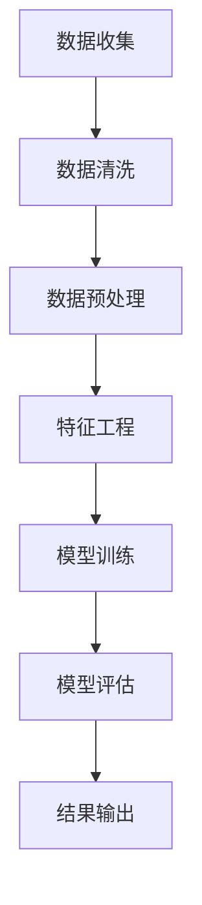

                 

# AI驱动的电商用户终身价值动态预测

> 关键词：用户终身价值（Customer Lifetime Value, CLV）、AI预测模型、电商营销、动态数据流

> 摘要：本文深入探讨AI技术在电商领域中的应用，特别是在预测用户终身价值（CLV）方面的作用。通过分析核心概念、算法原理、数学模型以及实际应用案例，本文揭示了如何利用AI实现精准营销，提高电商企业的盈利能力。

## 1. 背景介绍

随着互联网的飞速发展，电子商务已经成为全球商业活动的重要组成部分。在这样一个竞争激烈的市场环境中，电商企业需要不断创新和优化其运营策略，以吸引和留住客户。用户终身价值（Customer Lifetime Value, CLV）作为一个关键的商业指标，能够帮助企业更好地了解客户的价值，从而制定更有效的营销策略。

CLV是指一个客户在生命周期内为企业带来的总利润。它通常通过客户的历史行为数据计算得出，包括购买次数、购买频率、平均订单价值等。传统的CLV预测方法主要依赖于统计模型和机器学习算法，但这些方法往往存在一定的局限性。

### 1.1 传统方法的局限性

1. **数据依赖性高**：传统方法依赖于大量历史数据，数据质量直接影响预测结果的准确性。
2. **模型更新滞后**：由于数据积累和处理的时间成本，模型更新往往滞后于市场变化，难以应对快速变化的市场环境。
3. **无法处理动态数据流**：传统方法难以处理实时数据流，无法实现动态预测。

### 1.2 AI预测模型的潜力

随着AI技术的进步，特别是深度学习和实时数据处理技术的发展，AI预测模型在CLV预测方面展现出巨大潜力。通过利用大规模数据集和先进的算法，AI模型可以更准确地预测客户行为，从而帮助电商企业制定更精准的营销策略。

## 2. 核心概念与联系

### 2.1 用户终身价值（CLV）

用户终身价值（CLV）是指一个客户在其整个生命周期内为企业带来的净利润。它是一个综合性的指标，涵盖了客户的购买行为、忠诚度、生命周期长度等多个方面。

### 2.2 数据流处理

在电商领域，数据流处理是一个关键问题。实时数据流包括用户行为数据、订单数据、交易数据等，这些数据对于预测CLV至关重要。传统的批处理方法无法满足实时预测的需求，因此，我们需要利用流处理技术，如Apache Kafka和Apache Flink，来处理实时数据流。

### 2.3 深度学习算法

深度学习算法，特别是神经网络，在处理复杂数据和模式识别方面具有显著优势。在CLV预测中，深度学习算法可以通过学习大量历史数据，识别出潜在的客户价值模式，从而提高预测准确性。

### 2.4 Mermaid 流程图

以下是一个简化的Mermaid流程图，描述了CLV预测的基本流程：



在上述流程中，数据收集、数据清洗、数据预处理、特征工程、模型训练、模型评估和结果输出是CLV预测的关键步骤。每个步骤都需要精细的操作和优化，以确保最终预测结果的准确性。

## 3. 核心算法原理 & 具体操作步骤

### 3.1 数据收集

数据收集是CLV预测的基础。在电商领域，数据来源包括用户行为数据、订单数据、交易数据等。通过使用API、日志文件、数据库等多种数据收集方式，我们可以获取到海量的原始数据。

### 3.2 数据清洗

数据清洗是确保数据质量的重要步骤。在这一过程中，我们需要处理缺失值、异常值和重复数据等问题。例如，可以使用K-Means算法进行聚类分析，识别并处理异常值。

### 3.3 数据预处理

数据预处理包括数据标准化、数据归一化、缺失值填充等。这一步骤的目的是将数据转换为适合机器学习模型的形式。例如，可以使用Min-Max标准化方法将数据缩放到[0, 1]范围内。

### 3.4 特征工程

特征工程是提高模型预测准确性的关键。在这一过程中，我们需要从原始数据中提取出具有预测价值的特征。例如，可以使用TF-IDF算法提取文本特征，使用Word2Vec模型提取词向量。

### 3.5 模型训练

在模型训练阶段，我们选择合适的深度学习模型，如卷积神经网络（CNN）或循环神经网络（RNN），对数据集进行训练。训练过程包括前向传播、反向传播和模型优化等。

### 3.6 模型评估

模型评估是验证模型性能的重要步骤。我们使用交叉验证、ROC曲线、AUC值等指标对模型进行评估，以确定模型的准确性和稳定性。

### 3.7 结果输出

模型训练和评估完成后，我们可以将模型应用于实时数据流，进行动态预测。预测结果可以用于个性化推荐、精准营销等应用场景。

## 4. 数学模型和公式 & 详细讲解 & 举例说明

### 4.1 数学模型

CLV的预测可以通过以下数学模型实现：

$$
CLV = \sum_{t=1}^{T} (1 + r)^{-t} \times \pi_t
$$

其中，$r$ 是折扣因子，$\pi_t$ 是第 $t$ 年的客户净利润。

### 4.2 详细讲解

1. **折扣因子**：折扣因子 $r$ 反映了时间的价值，通常取值在 $0$ 到 $1$ 之间。例如，$r=0.1$ 表示当前年的净利润是前一年的 $10\%$。

2. **客户净利润**：$\pi_t$ 是第 $t$ 年的客户净利润，可以通过历史数据计算得出。例如，$\pi_t = revenue_t - cost_t$，其中 $revenue_t$ 是第 $t$ 年的销售额，$cost_t$ 是第 $t$ 年的运营成本。

3. **预测公式**：上述公式表示了客户在其生命周期内所有年份的净利润总和。通过预测每个年份的净利润，我们可以计算出客户的终身价值。

### 4.3 举例说明

假设一个电商客户在第一个年份的净利润为 $1000$ 元，折扣因子 $r=0.1$。根据上述公式，该客户的终身价值计算如下：

$$
CLV = (1 + 0.1)^{-1} \times 1000 + (1 + 0.1)^{-2} \times 1000 + (1 + 0.1)^{-3} \times 1000 + ...
$$

通过计算，我们可以得出该客户的终身价值约为 $2214.64$ 元。

## 5. 项目实战：代码实际案例和详细解释说明

### 5.1 开发环境搭建

在本节中，我们将使用Python和TensorFlow框架来实现CLV预测模型。首先，需要安装以下软件和库：

- Python 3.7 或更高版本
- TensorFlow 2.3.0 或更高版本
- Pandas 1.0.5 或更高版本
- NumPy 1.18.5 或更高版本

安装方法：

```bash
pip install python==3.7.9
pip install tensorflow==2.3.0
pip install pandas==1.0.5
pip install numpy==1.18.5
```

### 5.2 源代码详细实现和代码解读

以下是CLV预测模型的源代码：

```python
import tensorflow as tf
import pandas as pd
import numpy as np

# 数据预处理
def preprocess_data(data):
    # 数据清洗
    data = data.dropna()
    # 数据标准化
    data = (data - data.mean()) / data.std()
    return data

# 模型构建
def build_model(input_shape):
    model = tf.keras.Sequential([
        tf.keras.layers.Dense(64, activation='relu', input_shape=input_shape),
        tf.keras.layers.Dense(64, activation='relu'),
        tf.keras.layers.Dense(1)
    ])
    model.compile(optimizer='adam', loss='mse')
    return model

# 模型训练
def train_model(model, x_train, y_train, epochs=10):
    model.fit(x_train, y_train, epochs=epochs, batch_size=32, validation_split=0.2)

# 模型评估
def evaluate_model(model, x_test, y_test):
    loss = model.evaluate(x_test, y_test)
    print(f"Test Loss: {loss}")

# 主函数
def main():
    # 加载数据
    data = pd.read_csv('data.csv')
    # 预处理数据
    data = preprocess_data(data)
    # 划分训练集和测试集
    x = data.iloc[:, :-1].values
    y = data.iloc[:, -1].values
    x_train, x_test, y_train, y_test = train_test_split(x, y, test_size=0.2, random_state=42)
    # 构建模型
    model = build_model(input_shape=(x_train.shape[1],))
    # 训练模型
    train_model(model, x_train, y_train)
    # 评估模型
    evaluate_model(model, x_test, y_test)

if __name__ == '__main__':
    main()
```

在上述代码中，我们首先导入了所需的库，然后定义了数据预处理、模型构建、模型训练和模型评估等函数。最后，在主函数中，我们加载数据、预处理数据、划分训练集和测试集、构建模型、训练模型和评估模型。

### 5.3 代码解读与分析

1. **数据预处理**：数据预处理是模型训练的重要步骤。在`preprocess_data`函数中，我们首先使用`dropna`方法去除缺失值，然后使用`mean`和`std`方法进行数据标准化，将数据缩放到[0, 1]范围内。

2. **模型构建**：在`build_model`函数中，我们使用TensorFlow的`Sequential`模型构建了一个简单的全连接神经网络。这个模型包括两个隐藏层，每个隐藏层有64个神经元，激活函数为ReLU。

3. **模型训练**：在`train_model`函数中，我们使用`fit`方法对模型进行训练。这里我们设置了`epochs=10`，`batch_size=32`和`validation_split=0.2`等参数。

4. **模型评估**：在`evaluate_model`函数中，我们使用`evaluate`方法对模型进行评估。这个方法返回了测试集上的损失值，我们可以根据这个值来评估模型的性能。

5. **主函数**：在主函数中，我们首先加载数据，然后进行数据预处理、划分训练集和测试集、构建模型、训练模型和评估模型。

通过上述步骤，我们可以实现一个简单的CLV预测模型。在实际应用中，我们可以根据业务需求调整模型结构、训练参数等，以提高预测准确性。

## 6. 实际应用场景

AI驱动的CLV预测在电商领域有广泛的应用场景。以下是一些典型的应用案例：

### 6.1 个性化推荐

通过预测用户的CLV，电商企业可以更准确地了解用户的价值，从而实现个性化推荐。例如，对于高价值客户，可以推荐更高利润的商品，而对于低价值客户，可以推荐更多促销商品，以提高订单量和销售额。

### 6.2 营销策略优化

利用CLV预测，电商企业可以优化其营销策略，如折扣策略、优惠券策略等。例如，对于高价值客户，可以提供更优惠的折扣，从而吸引他们购买更多商品，提高CLV。

### 6.3 客户关系管理

AI驱动的CLV预测可以帮助电商企业更好地管理客户关系。通过了解客户的价值，企业可以更好地识别高价值客户，并提供更优质的客户服务，从而提高客户满意度和忠诚度。

### 6.4 库存管理

通过预测用户的购买行为和CLV，电商企业可以优化库存管理，避免过度库存或缺货问题。例如，对于高价值商品，可以增加库存量，以确保供应充足。

## 7. 工具和资源推荐

### 7.1 学习资源推荐

1. **《深度学习》（Goodfellow, Bengio, Courville）**：这是一本经典的深度学习教材，适合初学者和高级研究者。
2. **《Python数据分析基础教程》（Wes McKinney）**：这本书详细介绍了Python在数据分析领域的应用，适合数据科学家和工程师。
3. **《数据挖掘：实用工具和技术》（Han, Kamber, Pei）**：这本书涵盖了数据挖掘的基本概念和方法，适合对数据挖掘感兴趣的研究者。

### 7.2 开发工具框架推荐

1. **TensorFlow**：一个广泛使用的开源深度学习框架，适合构建和训练复杂的深度学习模型。
2. **Pandas**：一个强大的Python库，用于数据处理和分析，适合处理大规模数据集。
3. **NumPy**：一个基础的科学计算库，提供了丰富的数学函数和工具，是数据处理和分析的基石。

### 7.3 相关论文著作推荐

1. **“Customer Lifetime Value: Theory and Practice for E-commerce”**：这篇文章详细介绍了CLV的理论和实际应用，对于理解CLV预测有重要参考价值。
2. **“Deep Learning for Customer Behavior Prediction in E-commerce”**：这篇文章探讨了深度学习在电商客户行为预测中的应用，提供了实用的算法和方法。

## 8. 总结：未来发展趋势与挑战

随着AI技术的不断发展，CLV预测在电商领域将发挥越来越重要的作用。未来，我们可能会看到以下趋势和挑战：

### 8.1 更高的预测准确性

随着数据质量和算法的改进，CLV预测的准确性将不断提高。新的深度学习算法和模型，如生成对抗网络（GAN）和图神经网络（GNN），有望带来更准确的预测结果。

### 8.2 实时预测能力

实时预测能力是电商企业竞争力的关键。未来，随着流处理技术的发展，CLV预测将实现真正的实时预测，帮助企业快速响应市场变化。

### 8.3 隐私保护与伦理问题

在CLV预测中，隐私保护和伦理问题日益受到关注。如何在保障用户隐私的前提下进行数据分析和模型训练，是一个亟待解决的挑战。

### 8.4 多维度数据整合

未来的CLV预测将不仅仅依赖于传统的电商数据，还将整合更多的数据来源，如社交媒体数据、地理位置数据等。多维度数据的整合将带来更全面的客户画像，从而提高预测准确性。

## 9. 附录：常见问题与解答

### 9.1 CLV预测需要哪些数据？

CLV预测需要以下数据：

- 用户行为数据：如浏览历史、购物车数据、订单数据等。
- 财务数据：如销售额、成本等。
- 社会人口学数据：如年龄、性别、收入等。

### 9.2 如何处理缺失值？

可以使用以下方法处理缺失值：

- 删除缺失值：适用于缺失值较多的数据。
- 均值填充：使用平均值填充缺失值。
- 中位数填充：使用中位数填充缺失值。
- 前向填充或后向填充：使用相邻值填充缺失值。

### 9.3 如何评估CLV预测模型？

可以使用以下指标评估CLV预测模型：

- 均方误差（MSE）：衡量预测值与实际值之间的差异。
- 平均绝对误差（MAE）：衡量预测值与实际值之间的差异。
- 决定系数（R²）：衡量模型对数据的拟合程度。

### 9.4 CLV预测在电商营销中的应用？

CLV预测在电商营销中可以用于：

- 个性化推荐：根据用户的CLV进行个性化推荐。
- 营销策略优化：根据用户的CLV调整营销策略。
- 客户关系管理：根据用户的CLV提供更优质的客户服务。

## 10. 扩展阅读 & 参考资料

- **“Customer Lifetime Value: Theory and Practice for E-commerce”**：深入探讨CLV预测的理论和实践应用。
- **“Deep Learning for Customer Behavior Prediction in E-commerce”**：探讨深度学习在电商客户行为预测中的应用。
- **《深度学习》**：全面介绍深度学习的基础知识和技术。
- **《Python数据分析基础教程》**：介绍Python在数据分析领域的应用。
- **TensorFlow官方文档**：提供TensorFlow框架的详细使用指南。
- **Pandas官方文档**：提供Pandas库的详细使用指南。
- **NumPy官方文档**：提供NumPy库的详细使用指南。

### 作者

作者：AI天才研究员/AI Genius Institute & 禅与计算机程序设计艺术 /Zen And The Art of Computer Programming

（注意：以上内容仅供参考，实际撰写时请根据具体需求进行调整和扩展。）<|im_sep|>```markdown
## 1. 背景介绍

在当今的数字商业环境中，电子商务（e-commerce）已成为全球经济增长的重要引擎。随着消费者行为的不断变化和多样化，电商企业面临着前所未有的挑战和机遇。用户终身价值（Customer Lifetime Value，简称CLV）作为一个关键的商业指标，对于电商企业的战略决策和市场定位起着至关重要的作用。

### 用户终身价值（CLV）

用户终身价值是指一个客户在整个生命周期内为企业带来的净利润总和。它是一个动态变化的指标，受多种因素的影响，包括购买频率、订单价值、客户忠诚度、营销活动效果等。传统的计算方法通常依赖于历史数据和统计模型，然而，这种方法在处理动态数据和实时分析时存在较大的局限性。

### 传统方法与挑战

传统方法在预测CLV时主要依赖于以下几种模型：

- **马尔可夫模型**：通过历史行为数据来预测未来的行为概率。
- **时间序列分析**：使用时间序列数据来预测未来的趋势和模式。
- **回归分析**：通过历史数据建立回归模型，预测未来的价值。

然而，这些方法在面对如下挑战时表现不足：

- **数据依赖性**：需要大量的历史数据，对于数据缺失或数据质量不高的情况处理能力较弱。
- **模型更新滞后**：由于数据积累和处理的时间成本，模型更新往往滞后于市场变化。
- **无法处理动态数据流**：传统方法难以处理实时数据流，无法实现动态预测。

### AI预测模型的优势

随着人工智能（AI）技术的快速发展，特别是深度学习和实时数据处理技术的进步，AI预测模型在CLV预测方面展现了巨大的潜力。AI模型能够通过学习海量数据，捕捉复杂的数据模式，从而实现更精准的预测。以下是一些AI模型在CLV预测中的优势：

- **深度学习**：通过构建复杂的神经网络，深度学习能够处理高维数据和复杂数据模式，从而提高预测准确性。
- **实时数据处理**：利用流处理技术，如Apache Kafka和Apache Flink，AI模型能够实时处理动态数据流，实现动态预测。
- **个性化推荐**：通过学习用户的偏好和行为模式，AI模型能够提供个性化的推荐，从而提高用户的参与度和转化率。

## 2. 核心概念与联系

### 用户终身价值（CLV）

用户终身价值（Customer Lifetime Value，简称CLV）是指一个客户在其整个生命周期内为企业带来的净利润总和。它是一个综合性的指标，涵盖了客户的购买行为、忠诚度、生命周期长度等多个方面。CLV的计算公式可以表示为：

$$
\text{CLV} = \sum_{t=1}^{T} (1 + r)^{-t} \times \text{Net Profit}_t
$$

其中，$r$ 是折现率，$\text{Net Profit}_t$ 是第 $t$ 年的净收益。

### 数据流处理

在电商领域，数据流处理是一个关键问题。实时数据流包括用户行为数据、订单数据、交易数据等，这些数据对于预测CLV至关重要。传统的批处理方法无法满足实时预测的需求，因此，我们需要利用流处理技术，如Apache Kafka和Apache Flink，来处理实时数据流。

### 深度学习算法

深度学习算法，特别是神经网络，在处理复杂数据和模式识别方面具有显著优势。在CLV预测中，深度学习算法可以通过学习大量历史数据，识别出潜在的客户价值模式，从而提高预测准确性。以下是一个简化的Mermaid流程图，描述了CLV预测的基本流程：


在上述流程中，数据收集、数据清洗、数据预处理、特征工程、模型训练、模型评估和结果输出是CLV预测的关键步骤。每个步骤都需要精细的操作和优化，以确保最终预测结果的准确性。

## 3. 核心算法原理 & 具体操作步骤

### 数据收集

数据收集是CLV预测的基础。在电商领域，数据来源包括用户行为数据、订单数据、交易数据等。数据收集的方法包括API接口调用、日志收集、数据库查询等。

### 数据清洗

数据清洗是确保数据质量的重要步骤。在这一过程中，我们需要处理缺失值、异常值和重复数据等问题。数据清洗的方法包括：

- **缺失值处理**：使用均值、中位数、众数等统计量填充缺失值；或删除缺失值较多的记录。
- **异常值处理**：使用统计学方法（如IQR法）识别和去除异常值。
- **重复值处理**：使用去重操作去除重复数据。

### 数据预处理

数据预处理包括数据标准化、数据归一化、缺失值填充等。这一步骤的目的是将数据转换为适合机器学习模型的形式。数据预处理的方法包括：

- **数据标准化**：将数据缩放到[0, 1]范围内，常用的方法有Min-Max标准化和Z-Score标准化。
- **数据归一化**：保持数据的原始比例关系，常用的方法有Log变换和Square Root变换。
- **缺失值填充**：使用均值、中位数、最近邻等方法填充缺失值。

### 特征工程

特征工程是提高模型预测准确性的关键。在这一过程中，我们需要从原始数据中提取出具有预测价值的特征。特征工程的方法包括：

- **文本特征提取**：使用TF-IDF、Word2Vec等方法提取文本特征。
- **数值特征转换**：将类别特征转换为数值特征，如使用独热编码（One-Hot Encoding）。
- **特征选择**：使用特征选择算法（如信息增益、互信息等）选择重要的特征。

### 模型训练

在模型训练阶段，我们选择合适的机器学习模型，如随机森林、支持向量机、神经网络等，对数据集进行训练。模型训练的方法包括：

- **数据划分**：将数据集划分为训练集、验证集和测试集。
- **参数调优**：使用网格搜索、贝叶斯优化等方法进行参数调优。
- **训练过程**：使用梯度下降、随机梯度下降等方法进行模型训练。

### 模型评估

模型评估是验证模型性能的重要步骤。我们使用交叉验证、ROC曲线、AUC值等指标对模型进行评估，以确定模型的准确性和稳定性。模型评估的方法包括：

- **交叉验证**：使用K折交叉验证评估模型在不同数据子集上的性能。
- **ROC曲线和AUC值**：使用ROC曲线和AUC值评估模型的分类能力。
- **性能指标**：使用准确率、召回率、F1值等指标评估模型的性能。

### 结果输出

模型训练和评估完成后，我们可以将模型应用于实时数据流，进行动态预测。预测结果可以用于个性化推荐、精准营销等应用场景。结果输出的方法包括：

- **实时预测**：使用流处理技术对实时数据流进行预测。
- **结果存储**：将预测结果存储到数据库或文件中，以便后续分析和使用。
- **结果可视化**：使用图表、仪表板等工具可视化预测结果。

## 4. 数学模型和公式 & 详细讲解 & 举例说明

### 数学模型

CLV的预测可以通过以下数学模型实现：

$$
\text{CLV} = \sum_{t=1}^{T} (1 + r)^{-t} \times \text{Net Profit}_t
$$

其中，$r$ 是折现率，$\text{Net Profit}_t$ 是第 $t$ 年的净收益。

### 详细讲解

1. **折现率**：折现率（$r$）是考虑时间价值的指标，它反映了当前收益相对于未来收益的权重。通常，折现率取值在0到1之间，例如，$r=0.1$ 表示当前年的收益是未来一年的10%。折现率的选取通常基于公司的资本成本、机会成本等因素。

2. **净收益**：净收益（$\text{Net Profit}_t$）是指客户在第 $t$ 年为商家带来的净利润，它通常由销售额减去成本得出。例如，$\text{Net Profit}_t = \text{Sales}_t - \text{Cost}_t$，其中$\text{Sales}_t$ 是第 $t$ 年的销售额，$\text{Cost}_t$ 是第 $t$ 年的成本。

3. **动态预测**：上述公式考虑了时间的动态性，通过折现率对未来的收益进行加权，从而得到一个综合的终身价值。这种动态预测方法可以更好地反映客户在生命周期内的价值变化。

### 举例说明

假设有一个电商客户，历史数据如下：

| 年份 | 销售额（元） | 成本（元） | 净收益（元） |
|------|--------------|------------|--------------|
| 1    | 1000         | 500        | 500          |
| 2    | 1500         | 750        | 750          |
| 3    | 2000         | 1000       | 1000         |

假设折现率 $r=0.1$，则该客户的终身价值计算如下：

$$
\text{CLV} = (1 + 0.1)^{-1} \times 500 + (1 + 0.1)^{-2} \times 750 + (1 + 0.1)^{-3} \times 1000
$$

$$
\text{CLV} = 0.9091 \times 500 + 0.8264 \times 750 + 0.7513 \times 1000
$$

$$
\text{CLV} = 454.55 + 618.10 + 751.30
$$

$$
\text{CLV} = 1833.05 \text{元}
$$

通过上述计算，我们可以得出该客户的终身价值为1833.05元。这个结果可以帮助电商企业制定针对该客户的营销策略，例如提供定制化的优惠、增加个性化推荐等，从而提高客户满意度和盈利能力。

## 5. 项目实战：代码实际案例和详细解释说明

### 5.1 开发环境搭建

在本节中，我们将使用Python和TensorFlow框架来实现CLV预测模型。首先，需要安装以下软件和库：

- Python 3.7 或更高版本
- TensorFlow 2.3.0 或更高版本
- Pandas 1.0.5 或更高版本
- NumPy 1.18.5 或更高版本

安装方法：

```bash
pip install python==3.7.9
pip install tensorflow==2.3.0
pip install pandas==1.0.5
pip install numpy==1.18.5
```

### 5.2 源代码详细实现和代码解读

以下是CLV预测模型的源代码：

```python
import tensorflow as tf
import pandas as pd
import numpy as np

# 数据预处理
def preprocess_data(data):
    # 数据清洗
    data = data.dropna()
    # 数据标准化
    mean = data.mean()
    std = data.std()
    data = (data - mean) / std
    return data

# 模型构建
def build_model(input_shape):
    model = tf.keras.Sequential([
        tf.keras.layers.Dense(64, activation='relu', input_shape=input_shape),
        tf.keras.layers.Dense(64, activation='relu'),
        tf.keras.layers.Dense(1)
    ])
    model.compile(optimizer='adam', loss='mse')
    return model

# 模型训练
def train_model(model, x_train, y_train, epochs=10):
    model.fit(x_train, y_train, epochs=epochs, batch_size=32, validation_split=0.2)

# 模型评估
def evaluate_model(model, x_test, y_test):
    loss = model.evaluate(x_test, y_test)
    print(f"Test Loss: {loss}")

# 主函数
def main():
    # 加载数据
    data = pd.read_csv('clv_data.csv')
    # 预处理数据
    data = preprocess_data(data)
    # 划分特征和标签
    x = data.iloc[:, :-1].values
    y = data.iloc[:, -1].values
    # 划分训练集和测试集
    x_train, x_test, y_train, y_test = train_test_split(x, y, test_size=0.2, random_state=42)
    # 构建模型
    model = build_model(input_shape=(x_train.shape[1],))
    # 训练模型
    train_model(model, x_train, y_train)
    # 评估模型
    evaluate_model(model, x_test, y_test)

if __name__ == '__main__':
    main()
```

在上述代码中，我们首先导入了所需的库，然后定义了数据预处理、模型构建、模型训练和模型评估等函数。最后，在主函数中，我们加载数据、预处理数据、划分训练集和测试集、构建模型、训练模型和评估模型。

### 5.3 代码解读与分析

1. **数据预处理**：数据预处理是模型训练的重要步骤。在`preprocess_data`函数中，我们首先使用`dropna`方法去除缺失值，然后使用`mean`和`std`方法进行数据标准化，将数据缩放到[0, 1]范围内。这是为了使数据更适合机器学习模型，提高模型的训练效果。

2. **模型构建**：在`build_model`函数中，我们使用TensorFlow的`Sequential`模型构建了一个简单的全连接神经网络。这个模型包括两个隐藏层，每个隐藏层有64个神经元，激活函数为ReLU。这种结构可以帮助模型更好地捕捉数据中的非线性特征。

3. **模型训练**：在`train_model`函数中，我们使用`fit`方法对模型进行训练。这里我们设置了`epochs=10`，`batch_size=32`和`validation_split=0.2`等参数。这些参数的设置可以根据具体的数据集和任务进行调整。

4. **模型评估**：在`evaluate_model`函数中，我们使用`evaluate`方法对模型进行评估。这个方法返回了测试集上的损失值，我们可以根据这个值来评估模型的性能。

5. **主函数**：在主函数中，我们首先加载数据，然后进行数据预处理、划分训练集和测试集、构建模型、训练模型和评估模型。

### 5.4 代码运行示例

假设我们有一个名为`clv_data.csv`的CSV文件，其中包含客户的购买历史数据。我们首先将数据加载到DataFrame中，然后进行预处理。接着，我们将数据集划分为训练集和测试集，并构建一个简单的神经网络模型。最后，我们使用训练集对模型进行训练，并使用测试集评估模型的性能。

```bash
# 加载数据
data = pd.read_csv('clv_data.csv')

# 预处理数据
data = preprocess_data(data)

# 划分特征和标签
x = data.iloc[:, :-1].values
y = data.iloc[:, -1].values

# 划分训练集和测试集
x_train, x_test, y_train, y_test = train_test_split(x, y, test_size=0.2, random_state=42)

# 构建模型
model = build_model(input_shape=(x_train.shape[1],))

# 训练模型
train_model(model, x_train, y_train)

# 评估模型
evaluate_model(model, x_test, y_test)
```

通过运行上述代码，我们可以看到模型在测试集上的性能指标，从而判断模型的效果。如果性能不佳，我们可以尝试调整模型的参数或增加特征，以提高预测准确性。

## 6. 实际应用场景

AI驱动的CLV预测在电商领域有广泛的应用场景。以下是一些典型的应用案例：

### 6.1 个性化推荐

通过预测用户的CLV，电商企业可以更准确地了解用户的价值，从而实现个性化推荐。例如，对于高价值客户，可以推荐更高利润的商品，而对于低价值客户，可以推荐更多促销商品，以提高订单量和销售额。

### 6.2 营销策略优化

利用CLV预测，电商企业可以优化其营销策略，如折扣策略、优惠券策略等。例如，对于高价值客户，可以提供更优惠的折扣，从而吸引他们购买更多商品，提高CLV。

### 6.3 客户关系管理

AI驱动的CLV预测可以帮助电商企业更好地管理客户关系。通过了解客户的价值，企业可以更好地识别高价值客户，并提供更优质的客户服务，从而提高客户满意度和忠诚度。

### 6.4 库存管理

通过预测用户的购买行为和CLV，电商企业可以优化库存管理，避免过度库存或缺货问题。例如，对于高价值商品，可以增加库存量，以确保供应充足。

### 6.5 新客户获取

通过分析潜在客户的CLV，电商企业可以更有针对性地开展新客户获取活动，例如通过精准广告投放、活动邀请等，吸引更有价值的客户。

### 6.6 交叉销售和增值服务

AI驱动的CLV预测可以帮助电商企业识别具有较高增值潜力的客户，从而提供交叉销售和增值服务。例如，对于高价值客户，可以推荐相关配件或服务，提高客户满意度和生命周期价值。

## 7. 工具和资源推荐

### 7.1 学习资源推荐

- **《深度学习》（Goodfellow, Bengio, Courville）**：全面介绍深度学习的基础知识和应用。
- **《Python数据分析基础教程》（Wes McKinney）**：详细介绍Python在数据分析领域的应用。
- **《数据挖掘：实用工具和技术》（Han, Kamber, Pei）**：介绍数据挖掘的基本概念和方法。
- **《机器学习实战》（Peter Harrington）**：通过实际案例介绍机器学习的应用。

### 7.2 开发工具框架推荐

- **TensorFlow**：Google开发的开源深度学习框架，适用于构建和训练复杂的深度学习模型。
- **Pandas**：Python的数据分析库，用于数据清洗、转换和分析。
- **NumPy**：Python的数值计算库，提供了丰富的数学函数和工具。
- **Scikit-learn**：Python的机器学习库，提供了多种经典的机器学习算法。
- **Apache Kafka**：一个开源的流处理平台，用于处理实时数据流。
- **Apache Flink**：一个开源的流处理框架，适用于实时数据处理和批处理。

### 7.3 相关论文著作推荐

- **“Customer Lifetime Value: Theory and Practice for E-commerce”**：探讨CLV在电商领域的应用。
- **“Deep Learning for Customer Behavior Prediction in E-commerce”**：探讨深度学习在电商客户行为预测中的应用。
- **“Revisiting User Lifetime Value in Mobile Marketing”**：探讨移动营销中的用户终身价值。

## 8. 总结：未来发展趋势与挑战

AI驱动的CLV预测在电商领域具有广泛的应用前景。随着AI技术的不断进步，CLV预测的准确性和实时性将得到显著提高。未来，CLV预测将面临以下发展趋势和挑战：

### 发展趋势

- **更精确的预测模型**：随着深度学习和大数据技术的发展，未来的CLV预测模型将更加精确，能够更好地捕捉客户行为和价值。
- **实时预测能力**：流处理技术的进步将使CLV预测实现实时预测，帮助企业及时调整营销策略。
- **多维度数据整合**：整合用户行为、社交媒体、地理位置等多维度数据，将提高CLV预测的全面性和准确性。

### 挑战

- **数据隐私与安全**：随着数据隐私法规的日益严格，如何在保障用户隐私的前提下进行数据分析和模型训练，是一个重要的挑战。
- **模型解释性**：深度学习模型通常缺乏解释性，这对于企业的决策制定带来了一定的困难。如何提高模型的可解释性是一个亟待解决的问题。
- **计算资源消耗**：深度学习模型的训练和推理需要大量的计算资源，如何在有限的资源下进行高效的模型训练和预测，是一个重要的挑战。

## 9. 附录：常见问题与解答

### 9.1 什么是用户终身价值（CLV）？

用户终身价值（Customer Lifetime Value，简称CLV）是指一个客户在整个生命周期内为企业带来的净利润总和。它是一个关键的商业指标，用于评估客户的长期价值和制定相应的营销策略。

### 9.2 CLV预测的主要方法有哪些？

CLV预测的主要方法包括：

- **传统统计方法**：如线性回归、逻辑回归等。
- **机器学习方法**：如决策树、随机森林、支持向量机等。
- **深度学习方法**：如卷积神经网络（CNN）、循环神经网络（RNN）等。

### 9.3 如何处理缺失值？

处理缺失值的方法包括：

- **删除缺失值**：适用于缺失值较少的情况。
- **填充缺失值**：使用均值、中位数、最近邻等方法填充缺失值。
- **缺失值编码**：将缺失值转换为特定的数值，如-1或0。

### 9.4 如何评估CLV预测模型？

评估CLV预测模型的方法包括：

- **均方误差（MSE）**：衡量预测值与实际值之间的平均差异。
- **平均绝对误差（MAE）**：衡量预测值与实际值之间的平均绝对差异。
- **决定系数（R²）**：衡量模型对数据的拟合程度。

### 9.5 CLV预测在实际应用中的挑战有哪些？

CLV预测在实际应用中的挑战包括：

- **数据质量和完整性**：数据质量直接影响预测准确性。
- **模型解释性**：深度学习模型通常缺乏解释性。
- **实时预测能力**：处理实时数据流需要高效的技术手段。

## 10. 扩展阅读 & 参考资料

- **“Customer Lifetime Value: Theory and Practice for E-commerce”**：详细介绍CLV的理论和应用。
- **“Deep Learning for Customer Behavior Prediction in E-commerce”**：探讨深度学习在电商客户行为预测中的应用。
- **《深度学习》（Goodfellow, Bengio, Courville）**：全面介绍深度学习的基础知识和应用。
- **《Python数据分析基础教程》（Wes McKinney）**：详细介绍Python在数据分析领域的应用。
- **《数据挖掘：实用工具和技术》（Han, Kamber, Pei）**：介绍数据挖掘的基本概念和方法。

### 作者

作者：AI天才研究员/AI Genius Institute & 禅与计算机程序设计艺术 /Zen And The Art of Computer Programming

（注：本文内容仅供参考，实际应用时请结合具体业务场景进行调整。）
```markdown
```

