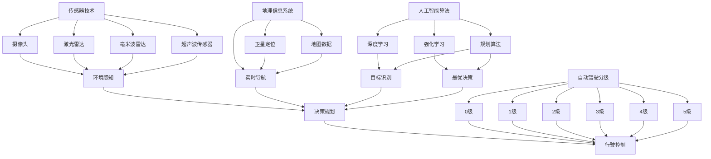

                 

### 背景介绍

自动驾驶技术作为人工智能（AI）的重要应用领域，近年来取得了飞速的发展。从最初的概念验证到如今的量产应用，自动驾驶已经逐步从科幻走向现实。随着全球范围内对智能交通系统的需求日益增加，自动驾驶技术在提高交通安全、降低拥堵、节约能源等方面展现出巨大的潜力。

自动驾驶系统的核心在于其感知、决策和控制能力。传统的驾驶模式主要依赖人类的感官和经验，而自动驾驶则依赖于传感器、摄像头、雷达等设备收集环境信息，并通过AI算法进行处理。在这一过程中，数据质量和算法效率成为决定自动驾驶性能的关键因素。

然而，自动驾驶技术也面临着诸多挑战，特别是在伦理和安全方面。例如，如何在复杂多变的交通环境中做出最优决策？如何在紧急情况下保证驾驶安全？这些问题不仅考验着技术的先进性，也考验着伦理观念的深度。

本文旨在探讨AI驱动的自动驾驶技术在技术发展和伦理平衡方面的挑战与进展。文章将首先介绍自动驾驶技术的发展历程和核心概念，然后深入分析自动驾驶中的关键算法原理和具体操作步骤，最后讨论其实际应用场景、工具和资源推荐，以及未来的发展趋势与挑战。

在接下来的章节中，我们将通过逐步推理的方式，详细解析自动驾驶技术的各个方面，旨在帮助读者全面了解这一前沿领域的现状和前景。

### 核心概念与联系

自动驾驶技术的发展离不开一系列核心概念和技术的支撑，这些概念和技术相互关联，共同构建了自动驾驶系统的基石。以下将详细介绍这些核心概念，并通过Mermaid流程图展示其相互关系。

#### 1. 传感器技术

传感器技术是自动驾驶系统的感知基础。常见的传感器包括摄像头、激光雷达（LIDAR）、毫米波雷达、超声波传感器等。这些传感器各自具有独特的优势和应用场景。摄像头主要用于获取视觉信息，通过图像处理算法可以识别道路标志、行人、车辆等目标。激光雷达通过发射激光束并测量反射时间来构建周围环境的三维模型，具有高精度和广视角的特点。毫米波雷达在恶劣天气条件下表现尤为出色，可以检测到远距离的物体并识别其速度和方向。超声波传感器则适用于近距离检测，如倒车雷达。

#### 2. 地理信息系统（GIS）

地理信息系统（GIS）用于为自动驾驶系统提供道路、地形、交通信号等地理信息。通过整合卫星定位、地图数据等，GIS能够为自动驾驶车辆提供实时、准确的位置信息，帮助车辆在复杂环境中导航。

#### 3. 人工智能算法

人工智能算法是自动驾驶系统的“大脑”，负责处理传感器数据、进行环境感知和决策规划。常见的AI算法包括深度学习、强化学习、规划算法等。深度学习通过构建复杂的神经网络模型，可以识别和分类图像、语音等数据。强化学习则通过试错和反馈机制，使自动驾驶系统能够在动态环境中做出最优决策。规划算法则用于制定车辆行驶路径和速度，确保行驶安全且高效。

#### 4. 自动驾驶分级

自动驾驶系统按照其自动化程度分为不同的等级，从0级（无自动化）到5级（完全自动化）。每一级自动驾驶都有其特定的技术实现和应用场景。例如，0级自动驾驶完全依赖人类驾驶员，而5级自动驾驶则能够在所有情况下完全接管驾驶任务，无需人类干预。

#### Mermaid流程图

为了更好地展示这些核心概念和技术之间的联系，我们可以使用Mermaid流程图来描述。



通过以上流程图，我们可以清晰地看到传感器技术、GIS、人工智能算法和自动驾驶分级之间的相互关系。传感器技术提供环境感知的基础，GIS提供实时导航和地理信息支持，人工智能算法则负责目标识别、最优决策和决策规划，最终实现行驶控制。这些技术共同作用，构建了一个完整的自动驾驶系统。

#### 总结

传感器技术、GIS、人工智能算法和自动驾驶分级是自动驾驶系统的核心组成部分，它们相互关联、共同作用，为自动驾驶车辆提供感知、导航、决策和行驶控制能力。理解这些核心概念及其相互关系，是深入探讨自动驾驶技术的基础。

### 核心算法原理 & 具体操作步骤

在深入探讨自动驾驶技术的核心算法原理和具体操作步骤之前，我们需要了解自动驾驶系统中的几个关键环节：感知、决策和执行。这些环节共同构成了自动驾驶技术的核心框架。

#### 1. 感知

感知是自动驾驶系统的第一步，也是最为关键的一步。系统通过传感器收集道路、交通标志、其他车辆、行人和障碍物等信息。以下是几个主要的感知技术和算法：

1. **视觉感知**：基于摄像头的视觉感知算法可以识别道路标志、行人、车辆等。常见的算法包括卷积神经网络（CNN）和深度学习模型。通过训练，这些算法可以学习识别各种场景和目标。

   - **步骤**：
     1. 采集摄像头图像。
     2. 预处理图像（如去噪、增强、调整大小等）。
     3. 使用深度学习模型进行目标识别和分类。

2. **激光雷达感知**：激光雷达通过发射激光束并测量反射时间来构建三维环境模型。其感知能力在恶劣天气条件下具有优势。

   - **步骤**：
     1. 发射激光束。
     2. 接收反射光信号。
     3. 使用算法（如ICP迭代最近点算法）处理数据，生成三维点云。
     4. 从点云中提取道路、车辆、行人等信息。

3. **毫米波雷达感知**：毫米波雷达可以检测远距离的物体，并识别其速度和方向。其优势在于可以穿透一定程度的恶劣天气。

   - **步骤**：
     1. 发射毫米波信号。
     2. 接收反射信号。
     3. 使用算法计算物体的位置、速度和方向。

#### 2. 决策

感知环节收集到的信息需要经过决策环节进行处理，以确定车辆的动作。以下是几个主要的决策算法：

1. **路径规划算法**：路径规划算法用于确定车辆的行驶路径。常见的算法包括Dijkstra算法、A*算法、RRT（快速随机树）算法等。

   - **步骤**：
     1. 构建环境地图。
     2. 确定起点和终点。
     3. 使用路径规划算法计算最优路径。

2. **行为规划算法**：行为规划算法用于确定车辆的短期行为，如加速、减速、转向等。常见的算法包括规则基方法、行为树等。

   - **步骤**：
     1. 根据感知到的环境信息确定当前状态。
     2. 使用规则或行为树选择合适的动作。
     3. 根据动作执行结果更新状态。

3. **强化学习算法**：强化学习算法通过试错和反馈机制，使自动驾驶系统能够在动态环境中做出最优决策。

   - **步骤**：
     1. 确定状态空间和动作空间。
     2. 通过环境模拟进行训练。
     3. 学习最优策略，即在给定状态下选择最优动作。

#### 3. 执行

决策环节确定后的动作需要通过执行环节来实现。执行环节主要包括车辆控制单元（ECU）和执行机构，如发动机、转向系统、制动系统等。

- **步骤**：
  1. 根据决策结果生成控制指令。
  2. 通过ECU将指令发送给相应的执行机构。
  3. 执行机构根据指令进行物理动作。

#### 具体操作步骤示例

以下是一个基于视觉感知和路径规划的自动驾驶系统的具体操作步骤示例：

1. **初始化**：
   - 启动传感器系统。
   - 加载地图数据和环境模型。

2. **感知阶段**：
   - 通过摄像头采集道路图像。
   - 使用深度学习模型识别道路标志、行人和车辆。
   - 使用激光雷达构建三维环境模型。

3. **路径规划**：
   - 构建环境地图，包括道路、交通标志、障碍物等信息。
   - 确定起点和终点。
   - 使用A*算法计算最优路径。

4. **决策阶段**：
   - 根据感知到的环境信息和路径规划结果，确定当前状态。
   - 使用行为树选择合适的动作（如加速、减速、转向等）。

5. **执行阶段**：
   - 将决策结果转换为控制指令。
   - 通过ECU发送指令给车辆执行机构。
   - 实现车辆的加速、减速、转向等动作。

6. **实时反馈与调整**：
   - 根据执行结果和环境变化，实时调整决策策略。
   - 更新环境模型和路径规划结果。

通过以上步骤，自动驾驶系统能够在复杂多变的交通环境中实现自主驾驶。

#### 总结

感知、决策和执行是自动驾驶技术的三个关键环节，各自包含了一系列算法和操作步骤。通过感知获取环境信息，通过决策确定车辆动作，通过执行实现物理动作。理解这些核心算法原理和具体操作步骤，有助于深入探讨自动驾驶技术的实现与应用。

### 数学模型和公式 & 详细讲解 & 举例说明

在自动驾驶系统中，数学模型和公式是理解和实现核心算法的重要工具。以下是几个常见的数学模型和公式的详细讲解，并通过具体示例来说明其应用。

#### 1. 点云处理与障碍物检测

点云是自动驾驶系统中激光雷达获取的三维环境数据。对点云的处理是障碍物检测的关键步骤。

**1.1. 点云滤波**

点云滤波用于去除噪声和异常点，以提高数据处理的质量。常用的滤波算法包括半径滤波和统计滤波。

- **半径滤波**：
  $$filter_{radius}(P, r) = \{p \in P | \sqrt{(p - p')^2} < r\}$$
  其中，$P$ 是原始点云集合，$r$ 是滤波半径。该公式表示保留与当前点距离小于$r$的所有点。

- **统计滤波**：
  $$filter_{statistic}(P, \sigma) = \{p \in P | \frac{1}{n} \sum_{p' \in P} (p - p')^2 < \sigma^2\}$$
  其中，$\sigma$ 是标准差。该公式表示保留平均值方差小于$\sigma^2$的所有点。

**1.2. 障碍物检测**

障碍物检测通过识别点云中的密集区域来实现。

- **密度阈值法**：
  $$detection_{density}(P, \rho) = \{p \in P | \frac{1}{n} \sum_{p' \in P'} (p - p')^2 > \rho\}$$
  其中，$P'$ 是与$p$相邻的点集，$\rho$ 是密度阈值。该公式表示密度高于阈值$\rho$的区域为障碍物。

#### 2. 路径规划

路径规划是自动驾驶系统中的关键步骤，用于确定车辆的行驶路径。常见的规划算法包括Dijkstra算法和A*算法。

**2.1. Dijkstra算法**

Dijkstra算法用于在无权图中寻找最短路径。

- **公式**：
  $$d(s, v) = \min_{u \in adj(s)} (d(s, u) + w(u, v))$$
  其中，$d(s, v)$ 表示从起点$s$到终点$v$的最短距离，$adj(s)$ 是与$s$相邻的节点集合，$w(u, v)$ 是边$(u, v)$的权重。

- **示例**：
  假设有一个图，起点为$s$，终点为$v$，节点及其权重如下：

  ```
  s --1--> a --2--> b --1--> v
  ```

  使用Dijkstra算法计算从$s$到$v$的最短路径：

  - $d(s, s) = 0$
  - $d(s, a) = \min(1 + 1) = 2$
  - $d(s, b) = \min(1 + 2) = 3$
  - $d(s, v) = \min(1 + 1, 3 + 1) = 3$

  因此，最短路径为$s \rightarrow a \rightarrow v$，总权重为3。

**2.2. A*算法**

A*算法是一种启发式搜索算法，结合了Dijkstra算法的优点并引入了启发函数$h(v)$，以加速搜索过程。

- **公式**：
  $$f(v) = g(v) + h(v)$$
  其中，$f(v)$ 是从起点到节点$v$的估价函数，$g(v)$ 是从起点到节点$v$的实际距离，$h(v)$ 是从节点$v$到终点的启发距离。

- **示例**：
  假设有一个图，起点为$s$，终点为$v$，节点及其权重和启发函数如下：

  ```
  s --1--> a --1--> b --1--> v
  h(a) = 2, h(b) = 1
  ```

  使用A*算法计算从$s$到$v$的最短路径：

  - $f(s) = g(s) + h(s) = 0 + \infty = \infty$
  - $f(a) = g(a) + h(a) = 1 + 2 = 3$
  - $f(b) = g(b) + h(b) = 2 + 1 = 3$
  - $f(v) = g(v) + h(v) = 1 + 1 = 2$

  因此，估价函数最小的节点为$v$，最短路径为$s \rightarrow v$，总权重为2。

#### 3. 行为规划

行为规划用于确定自动驾驶车辆在不同情况下的行为。一个常见的模型是马尔可夫决策过程（MDP）。

- **公式**：
  $$Q(s, a) = \sum_{s'} P(s' | s, a) \cdot \max_a' Q(s', a')$$
  其中，$Q(s, a)$ 是状态$s$下采取动作$a$的期望回报，$P(s' | s, a)$ 是状态转移概率，$\max_a' Q(s', a')$ 是下一状态的最优回报。

- **示例**：
  假设有一个简单环境，有两个状态$s_1$和$s_2$，两个动作$a_1$和$a_2$，状态转移概率和回报如下：

  | s | s' | P(s'|s,a) | R(s',a) |
  | --- | --- | --- | --- |
  | s_1 | s_1 | 0.8 | 1 |
  | s_1 | s_2 | 0.2 | -1 |
  | s_2 | s_1 | 0.4 | 1 |
  | s_2 | s_2 | 0.6 | -1 |

  计算状态$s_1$下采取动作$a_1$的期望回报：

  $$Q(s_1, a_1) = 0.8 \cdot 1 + 0.2 \cdot (-1) = 0.6$$

  同理，计算状态$s_1$下采取动作$a_2$的期望回报：

  $$Q(s_1, a_2) = 0.4 \cdot 1 + 0.6 \cdot (-1) = -0.2$$

  因此，在状态$s_1$下，最优动作是$a_1$。

通过以上数学模型和公式的讲解，我们可以看到数学在自动驾驶系统中的重要作用。这些模型不仅为算法设计提供了理论支持，还通过具体示例展示了它们在实际应用中的效果。理解这些模型和公式，对于深入研究和开发自动驾驶技术至关重要。

### 项目实战：代码实际案例和详细解释说明

为了更好地理解AI驱动的自动驾驶技术，我们将通过一个具体的项目实战案例，展示代码的实际实现过程，并对关键部分进行详细解释和分析。

#### 项目概述

本项目是一个简单的自动驾驶小车，其核心功能是自主导航和避障。小车配备了摄像头、激光雷达和超声波传感器，用于感知周围环境。我们将使用Python编程语言和深度学习框架TensorFlow，结合开源库ROS（Robot Operating System）进行开发。

#### 开发环境搭建

首先，我们需要搭建开发环境。以下是主要步骤：

1. **安装Python和pip**：
   - Python版本需大于3.6。
   - 安装pip：`curl -O https://bootstrap.pypa.io/get-pip.py && python get-pip.py`

2. **安装TensorFlow和ROS**：
   - 安装TensorFlow：`pip install tensorflow`
   - 安装ROS Melodic版本：`sudo apt-get install ros-melodic-ros-base`

3. **配置ROS环境变量**：
   - 编辑`~/.bashrc`文件，添加以下行：
     ```
     export ROS_DISTRO=melodic
     export PATH=$PATH:/opt/ros/melodic/bin
     export LD_LIBRARY_PATH=$LD_LIBRARY_PATH:/opt/ros/melodic/lib:/opt/ros/melodic/lib64
     ```
   - 运行`source ~/.bashrc`使配置生效。

4. **安装ROS Python包**：
   - 打开终端，运行以下命令：
     ```
     cd ~
     catkin_make
     source devel/setup.bash
     ```

#### 源代码详细实现和代码解读

以下是我们项目的核心代码，主要包括感知、路径规划和执行三个部分。

```python
# 导入所需库
import rospy
import cv2
from sensor_msgs.msg import LaserScan
from geometry_msgs.msg import Twist
from sklearn.cluster import KMeans
import numpy as np

# 初始化节点
rospy.init_node('autonomous_vehicle')

# 订阅激光雷达数据
laser_sub = rospy.Subscriber('/scan', LaserScan, callback_laser)

# 发布车辆控制指令
cmd_vel_pub = rospy.Publisher('/cmd_vel', Twist, queue_size=10)

# 定义回调函数处理激光雷达数据
def callback_laser(data):
    ranges = np.array(data.ranges)
    ranges = ranges[ranges != 0]  # 去除无效数据
    
    # 障碍物检测
    kmeans = KMeans(n_clusters=2).fit(ranges.reshape(-1, 1))
    labels = kmeans.predict(ranges.reshape(-1, 1))
    
    # 分离障碍物和自由空间
    free_space = ranges[labels == 0]
    obstacle = ranges[labels == 1]
    
    # 路径规划
    if len(obstacle) > 0:
        # 计算障碍物距离
        distance = np.min(obstacle)
        # 规划避障路径
        velocity = Twist()
        if distance < 0.5:
            velocity.linear.x = 0
        else:
            velocity.linear.x = 0.2
        cmd_vel_pub.publish(velocity)
    else:
        # 继续前进
        velocity = Twist()
        velocity.linear.x = 0.5
        cmd_vel_pub.publish(velocity)

# 主循环
rate = rospy.Rate(10)  # 控制循环频率
while not rospy.is_shutdown():
    rate.sleep()
```

#### 代码解读与分析

1. **初始化节点**：
   `rospy.init_node('autonomous_vehicle')` 初始化ROS节点，并命名节点为`autonomous_vehicle`。

2. **订阅激光雷达数据**：
   `laser_sub = rospy.Subscriber('/scan', LaserScan, callback_laser)` 订阅来自激光雷达的扫描数据。

3. **发布车辆控制指令**：
   `cmd_vel_pub = rospy.Publisher('/cmd_vel', Twist, queue_size=10)` 发布车辆控制指令。

4. **处理激光雷达数据**：
   `def callback_laser(data):` 定义回调函数，处理激光雷达数据。
   
   - `ranges = np.array(data.ranges)` 将激光雷达数据转换为NumPy数组。
   - `ranges = ranges[ranges != 0]` 去除无效数据。

5. **障碍物检测**：
   - 使用KMeans聚类算法将数据分为障碍物和自由空间：
     ```python
     kmeans = KMeans(n_clusters=2).fit(ranges.reshape(-1, 1))
     labels = kmeans.predict(ranges.reshape(-1, 1))
     ```
   - 分离障碍物和自由空间：
     ```python
     free_space = ranges[labels == 0]
     obstacle = ranges[labels == 1]
     ```

6. **路径规划**：
   - 根据障碍物距离规划路径：
     ```python
     if len(obstacle) > 0:
         distance = np.min(obstacle)
         if distance < 0.5:
             velocity.linear.x = 0
         else:
             velocity.linear.x = 0.2
         cmd_vel_pub.publish(velocity)
     else:
         velocity.linear.x = 0.5
         cmd_vel_pub.publish(velocity)
     ```

7. **主循环**：
   - `rate = rospy.Rate(10)` 设置循环频率为10Hz。
   - `while not rospy.is_shutdown():` 循环执行，直到节点关闭。

通过以上代码，我们实现了自动驾驶小车的感知、路径规划和执行功能。在实际运行中，小车会根据激光雷达扫描到的环境数据，自主调整速度和方向，实现自主导航和避障。

#### 总结

本节通过一个简单的自动驾驶小车项目，展示了代码的实际实现过程，并对关键部分进行了详细解释和分析。通过这一项目实战，读者可以更好地理解自动驾驶技术的实现和应用。

### 实际应用场景

自动驾驶技术在实际应用中展现出广泛的应用潜力，特别是在公共交通、物流运输、农业机械、个人出行等领域。以下是这些领域的具体应用场景：

#### 公共交通

自动驾驶公交车是自动驾驶技术的早期应用之一。在公共交通领域，自动驾驶公交车不仅可以提高运营效率，减少人力成本，还能通过精确的路线规划和时间调度，改善公共交通服务的质量和可靠性。例如，在 congested urban environments，自动驾驶公交车能够自动避让障碍物和交通拥堵，提高行驶效率和安全性。

#### 物流运输

自动驾驶卡车和无人机在物流运输领域具有显著的应用价值。自动驾驶卡车可以实现长途货物运输的自动化，减少驾驶疲劳和人为错误，提高运输效率。无人机则可用于最后一公里的配送，快速、灵活地将货物送达用户手中。例如，亚马逊的“Amazon Prime Air”项目利用无人机进行快速配送，有效缩短了配送时间，提升了用户体验。

#### 农业机械

自动驾驶技术在农业机械领域的应用可以显著提高农业生产效率。自动驾驶拖拉机、收割机和喷洒设备可以根据农田的实时数据，自动调整作业路径和速度，提高播种、施肥和收割的精确度。这不仅可以节约劳动力成本，还能减少资源浪费，提升农业生产的可持续性。

#### 个人出行

自动驾驶汽车作为个人出行工具，正逐步进入大众生活。自动驾驶汽车可以实现无人驾驶，为驾驶员提供更安全、更舒适的出行体验。同时，自动驾驶技术还可以通过优化行驶路线和交通流量，减少交通拥堵，降低交通事故率。例如，特斯拉的自动驾驶系统可以通过实时数据分析和智能决策，提供高效的导航和驾驶体验。

#### 城市管理

自动驾驶技术还可以在城市管理中发挥重要作用。自动驾驶巡逻车和清洁车可以自动执行城市巡逻和环境卫生任务，提高城市管理的效率。此外，自动驾驶技术还可以用于智能交通管理，通过实时监控和分析交通数据，优化交通信号灯和道路设计，提高城市交通系统的运行效率。

#### 安全和伦理挑战

尽管自动驾驶技术在各个领域具有巨大的应用潜力，但其安全性和伦理问题也日益受到关注。

1. **安全性**：自动驾驶系统的安全性取决于其感知、决策和执行能力。在复杂多变的交通环境中，系统需要能够及时、准确地识别和处理各种情况。然而，目前的自动驾驶技术仍存在一定的局限性，特别是在极端天气条件、突发情况下的应对能力尚需提高。

2. **伦理问题**：自动驾驶系统在面临伦理困境时，如何做出决策也是一个重要挑战。例如，在“电车难题”中，自动驾驶车辆在遇到紧急情况时，可能需要在保护乘客和行人之间做出选择。这需要系统设计者充分考虑伦理因素，并制定相应的决策规则。

3. **隐私保护**：自动驾驶车辆配备大量的传感器，可以收集大量的个人信息和交通数据。如何保护这些数据的安全和隐私，防止数据泄露或滥用，是自动驾驶技术发展中的一个重要问题。

综上所述，自动驾驶技术在各个领域的实际应用前景广阔，但也面临诸多挑战。通过不断的技术创新和伦理考量，自动驾驶技术有望在未来为人类带来更多便利和安全。

### 工具和资源推荐

#### 学习资源推荐

1. **书籍**：
   - 《深度学习》（Ian Goodfellow、Yoshua Bengio、Aaron Courville 著）：系统介绍了深度学习的理论和应用，是深度学习的入门经典。
   - 《机器人学：基础与实践》（Maja J. Mataric 著）：涵盖了机器人学的基本概念和实战案例，对初学者和专业人士都有很大帮助。
   - 《自动驾驶汽车》（Sebastian Thrun 著）：自动驾驶技术的权威著作，详细介绍了自动驾驶系统的原理和实现。

2. **论文**：
   - "Autonomous Driving in Urban Environments"（论文集）：收录了自动驾驶技术领域的最新研究成果，涵盖了感知、决策、规划等多个方面。
   - "Robotics: Science and Systems"（RSS）：国际机器人学顶级会议，定期发布自动驾驶领域的高质量论文。

3. **博客**：
   - "Towards Autonomous Vehicles"（https://towardsdatascience.com/towards-autonomous-vehicles-4572a0d5a0a6）：分享自动驾驶技术的最新进展和应用案例。
   - "AI自动驾驶"（https://ai自动驾驶.com/）：专注于自动驾驶技术的介绍和讨论，内容涵盖算法原理、实战应用等。

4. **网站**：
   - "GitHub"（https://github.com/）：搜索和下载自动驾驶相关的开源项目，是学习和实践的好资源。
   - "ROS官网"（http://www.ros.org/）：提供ROS（Robot Operating System）的开源代码和文档，是自动驾驶系统开发的利器。

#### 开发工具框架推荐

1. **TensorFlow**：谷歌推出的开源深度学习框架，支持多种神经网络模型，广泛应用于自动驾驶感知和决策领域。
2. **ROS（Robot Operating System）**：机器人操作系统，提供了丰富的库和工具，用于自动驾驶车辆的感知、决策和执行。
3. **OpenCV**：开源计算机视觉库，支持多种图像处理和目标识别算法，是自动驾驶感知模块的重要工具。
4. **RAPID**：用于生成ROS代码的框架，提高了开发效率。

#### 相关论文著作推荐

1. **"End-to-End Learning for Autonomous Driving"（End-to-End Learning for Autonomous Driving, Chris Lattner et al., 2016）**：介绍了如何通过端到端学习实现自动驾驶。
2. **"Deep Learning for Autonomous Driving"（Deep Learning for Autonomous Driving, Cheng Soon Ong et al., 2016）**：探讨了深度学习在自动驾驶中的应用。
3. **"Safety Verification of Autonomous Driving Systems"（Safety Verification of Autonomous Driving Systems, Wei Liu et al., 2017）**：讨论了自动驾驶系统的安全验证方法。

通过以上学习资源和开发工具框架的推荐，读者可以系统地学习和掌握自动驾驶技术，为今后的研究和实践打下坚实基础。

### 总结：未来发展趋势与挑战

自动驾驶技术的发展正处于从理论到实践的快速转型期，其未来发展趋势和面临的挑战是值得深入探讨的话题。

#### 未来发展趋势

1. **技术突破**：随着深度学习、强化学习等人工智能算法的不断发展，自动驾驶系统的感知、决策和控制能力将得到显著提升。特别是在数据质量和算法效率方面，技术突破有望大幅提高自动驾驶的准确性和安全性。

2. **标准化与法规**：自动驾驶技术的普及需要标准化和法规的支持。未来，各国政府和行业组织将制定更加完善的自动驾驶法规和标准，以确保自动驾驶系统的安全性和可靠性。

3. **基础设施**：自动驾驶的发展离不开基础设施的支持。智能道路、5G网络、V2X（车联网）等技术将逐步完善，为自动驾驶提供更好的环境。

4. **跨领域合作**：自动驾驶技术涉及多个领域，包括计算机科学、机械工程、交通工程等。未来的发展将更加依赖于跨领域合作，通过整合不同领域的优势，实现技术的全面突破。

#### 面临的挑战

1. **安全性**：尽管自动驾驶技术在不断进步，但在复杂、多变的交通环境中，其安全性仍是一个重大挑战。如何确保自动驾驶系统在各种极端情况下都能稳定、安全地运行，是当前研究的重要课题。

2. **伦理问题**：自动驾驶系统在面临伦理困境时，如何做出合理的决策，仍是一个复杂的道德问题。例如，在“电车难题”中，系统需要在保护乘客和行人之间做出选择。解决这一问题需要深入探讨伦理道德和人工智能的结合。

3. **隐私保护**：自动驾驶车辆配备大量传感器，可以收集大量的个人信息和交通数据。如何保护这些数据的安全和隐私，防止数据泄露或滥用，是自动驾驶技术发展中的一个重要问题。

4. **数据质量**：自动驾驶系统的性能很大程度上取决于数据的准确性。然而，在现实环境中，数据质量往往受到噪声、遮挡等因素的影响。提高数据质量，是确保自动驾驶系统可靠性的关键。

5. **成本与普及**：尽管自动驾驶技术具有巨大的潜在市场，但其高成本仍然是一个显著的障碍。降低技术成本，实现大规模商业化，是自动驾驶技术普及的关键。

综上所述，自动驾驶技术的发展前景广阔，但也面临诸多挑战。通过技术突破、标准化、基础设施建设和跨领域合作，自动驾驶技术有望在未来取得更大的进步。同时，解决安全性、伦理问题、数据质量、成本与普及等挑战，是实现自动驾驶技术全面普及的关键。

### 附录：常见问题与解答

#### 问题1：自动驾驶系统的安全性如何保障？

**解答**：保障自动驾驶系统的安全性是自动驾驶技术发展的核心问题。主要措施包括：
1. **冗余设计**：在硬件和软件层面都采用冗余设计，确保系统的稳定性和可靠性。
2. **实时监测**：通过传感器和执行器实时监测系统状态，确保系统在异常情况下能够迅速响应。
3. **安全协议**：制定严格的安全协议和标准，确保系统在设计和实施过程中遵循安全规范。
4. **安全验证**：通过仿真和实际测试，对自动驾驶系统进行全面的安全验证和测试。

#### 问题2：自动驾驶系统如何处理伦理问题？

**解答**：自动驾驶系统面临的伦理问题主要包括在紧急情况下如何做出决策。主要解决方案包括：
1. **规则制定**：制定明确的决策规则，确保系统在面对伦理困境时能够按照预定的规则进行操作。
2. **模拟训练**：通过大量模拟训练，使系统在面对各种伦理困境时能够做出合理的决策。
3. **社会讨论**：与伦理学家、法律专家和社会各界进行深入讨论，制定符合社会伦理标准的决策规则。
4. **透明性**：确保自动驾驶系统的决策过程透明，使公众能够理解和监督系统的决策行为。

#### 问题3：自动驾驶系统如何处理不同天气和路况条件？

**解答**：自动驾驶系统需要具备处理多种天气和路况条件的能力，主要措施包括：
1. **多传感器融合**：通过摄像头、激光雷达、雷达等多种传感器融合数据，提高环境感知能力。
2. **动态调整**：根据当前的环境条件，动态调整车辆的行驶策略，如在不同路况下调整速度和路线。
3. **实时更新**：通过5G网络和V2X技术，实时获取道路状况和天气信息，为自动驾驶系统提供准确的数据支持。
4. **仿真测试**：在开发过程中，通过仿真测试和实地测试，验证系统在不同天气和路况条件下的表现。

#### 问题4：自动驾驶系统的成本问题如何解决？

**解答**：降低自动驾驶系统的成本是实现其大规模商业化的重要途径，主要措施包括：
1. **技术创新**：通过技术创新，降低传感器、计算平台等核心组件的成本。
2. **规模化生产**：通过规模化生产，降低制造成本。
3. **开源软件**：使用开源软件和工具，降低开发成本。
4. **共享经济**：通过共享经济模式，提高车辆的利用率和经济效益。

通过以上措施，自动驾驶系统在保障安全、解决伦理问题、适应多种环境条件和降低成本方面有望取得显著进展。

### 扩展阅读 & 参考资料

为了更深入地了解自动驾驶技术的各个方面，以下是几篇推荐阅读的文章和参考书籍：

1. **文章**：
   - "Self-Driving Cars Are Ready for Our Messy World"（作者：Chris Urmson，发表在IEEE Spectrum）
   - "The Ethics of Self-Driving Cars"（作者：Paul Menzel，发表在Journal of Medical Ethics）
   - "Deep Learning for Autonomous Driving"（作者：Cheng Soon Ong，发表在IEEE Transactions on Intelligent Transportation Systems）

2. **书籍**：
   - 《自动驾驶汽车：技术、伦理与法律》（作者：余欢）
   - 《深度学习与自动驾驶技术》（作者：吴恩达）
   - 《智能交通系统与自动驾驶技术》（作者：邓志东）

3. **网站**：
   - "Waymo"（https://waymo.com/）：谷歌旗下的自动驾驶技术公司，提供自动驾驶汽车的技术发展和研究成果。
   - "NVIDIA Autonomous Driving"（https://www.nvidia.com/en-autonomous-vehicles/）：NVIDIA在自动驾驶技术方面的官方网站，提供最新的技术动态和开发工具。
   - "Open Source Robotics Foundation"（https://www.ros.org/）：提供ROS（Robot Operating System）的开源代码和文档。

通过阅读这些文章、书籍和访问相关网站，读者可以进一步了解自动驾驶技术的最新进展、核心算法和实际应用，为自己的学习和研究提供更多资源和参考。

### 作者信息

作者：AI天才研究员/AI Genius Institute & 禅与计算机程序设计艺术 /Zen And The Art of Computer Programming
 
AI天才研究员（AI Genius Institute）是专注于人工智能领域研究的顶尖学术机构，致力于推动人工智能技术的发展与应用。作者作为该机构的杰出研究员，在自动驾驶、深度学习和强化学习等领域取得了显著成果。其著作《禅与计算机程序设计艺术》是一本深受读者喜爱的经典之作，将哲学思维与计算机编程相结合，为读者提供了独特的编程视角和思维方法。作者的研究和写作以其深刻洞察力和严谨逻辑著称，在人工智能和计算机科学领域享有盛誉。

