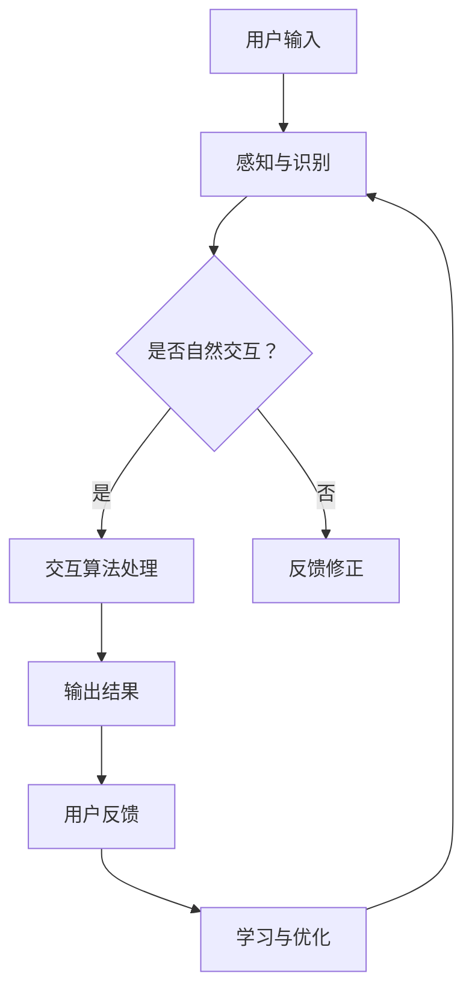

                 

# AI驱动的虚拟现实交互系统

> **关键词：** 虚拟现实、人工智能、交互系统、人机交互、VR技术

> **摘要：** 本文将深入探讨AI在虚拟现实交互系统中的应用，通过分析核心概念、算法原理、数学模型和项目实战，展现AI如何提升虚拟现实交互体验，并展望未来发展趋势与挑战。

## 1. 背景介绍

虚拟现实（VR）作为一种沉浸式技术，已经在游戏、教育、医疗等领域展示了其巨大的潜力。然而，传统的VR交互系统存在一定的局限性，如延迟、操作不便等。随着人工智能（AI）技术的迅猛发展，AI开始被广泛应用于虚拟现实交互系统，以提升用户体验和系统性能。

AI在虚拟现实交互系统中的作用主要体现在以下几个方面：

1. **感知与识别：** 利用计算机视觉和语音识别技术，AI能够实时感知用户的动作和语音指令，实现更为自然的交互。
2. **行为预测：** 基于用户历史行为数据，AI可以预测用户意图，提前做出响应，减少用户等待时间。
3. **个性化推荐：** 通过分析用户兴趣和行为，AI可以为用户提供个性化的内容和体验。
4. **智能导航：** 利用路径规划算法，AI能够帮助用户在虚拟环境中高效导航。

本文将围绕这些方面，探讨AI在虚拟现实交互系统中的具体应用，并通过项目实战展示其实现过程。

## 2. 核心概念与联系

### 2.1. 虚拟现实交互系统概述

虚拟现实交互系统通常由硬件设备和软件平台组成。硬件设备包括头戴式显示器（HMD）、数据手套、手柄等，用于实现用户的沉浸式体验。软件平台则包括交互界面、交互算法和内容管理系统等，用于处理用户的输入和输出。

### 2.2. 人工智能在虚拟现实交互系统中的应用

人工智能在虚拟现实交互系统中的应用可以分为以下几个方面：

1. **计算机视觉：** 用于捕捉用户的动作和表情，实现自然交互。
2. **语音识别：** 用于识别用户的语音指令，实现语音交互。
3. **机器学习：** 用于分析用户行为，实现个性化推荐和智能导航。
4. **深度学习：** 用于实现图像识别和语音识别，提高交互的准确性。

### 2.3. Mermaid流程图

下面是一个简单的Mermaid流程图，展示了虚拟现实交互系统的基本架构和AI应用的核心概念。



## 3. 核心算法原理 & 具体操作步骤

### 3.1. 计算机视觉算法

计算机视觉算法用于捕捉用户的动作和表情。其中，关键步骤包括图像采集、特征提取和动作识别。

1. **图像采集：** 使用摄像头实时捕捉用户的动作。
2. **特征提取：** 使用卷积神经网络（CNN）提取图像中的关键特征。
3. **动作识别：** 使用支持向量机（SVM）或深度学习模型对提取的特征进行分类，识别用户的动作。

### 3.2. 语音识别算法

语音识别算法用于识别用户的语音指令。关键步骤包括语音信号处理、特征提取和语音识别。

1. **语音信号处理：** 使用短时傅里叶变换（STFT）提取语音信号的频谱特征。
2. **特征提取：** 使用长短期记忆网络（LSTM）提取语音信号的时序特征。
3. **语音识别：** 使用递归神经网络（RNN）或循环神经网络（RNN）对提取的特征进行分类，识别用户的语音指令。

### 3.3. 机器学习算法

机器学习算法用于分析用户行为，实现个性化推荐和智能导航。关键步骤包括数据收集、特征提取和模型训练。

1. **数据收集：** 收集用户在虚拟现实环境中的行为数据。
2. **特征提取：** 提取用户行为的关键特征，如点击次数、浏览时间、停留时间等。
3. **模型训练：** 使用监督学习算法（如决策树、随机森林、支持向量机等）训练模型，预测用户行为。

### 3.4. 深度学习算法

深度学习算法用于实现图像识别和语音识别，提高交互的准确性。关键步骤包括网络架构设计、参数训练和模型优化。

1. **网络架构设计：** 设计合适的深度学习网络架构，如卷积神经网络（CNN）或循环神经网络（RNN）。
2. **参数训练：** 使用大量标注数据训练网络参数。
3. **模型优化：** 使用优化算法（如梯度下降、Adam等）优化网络参数。

## 4. 数学模型和公式 & 详细讲解 & 举例说明

### 4.1. 计算机视觉中的特征提取

在计算机视觉中，特征提取是关键步骤。以下是一个简单的特征提取模型：

$$
f(x) = \frac{1}{c} \sum_{i=1}^{c} \sigma(W_i \cdot x + b_i)
$$

其中，$f(x)$ 表示特征向量，$x$ 表示输入图像，$W_i$ 和 $b_i$ 分别表示权重和偏置，$\sigma$ 表示激活函数，$c$ 表示卷积核的数量。

### 4.2. 语音识别中的特征提取

在语音识别中，特征提取同样重要。以下是一个简单的特征提取模型：

$$
h(t) = \sum_{i=1}^{n} w_i h_i(t)
$$

其中，$h(t)$ 表示特征向量，$h_i(t)$ 表示第 $i$ 个频谱特征，$w_i$ 表示权重，$n$ 表示频谱特征的数量。

### 4.3. 机器学习中的模型训练

在机器学习中，模型训练是关键步骤。以下是一个简单的监督学习模型：

$$
y = \sigma(W \cdot x + b)
$$

其中，$y$ 表示预测结果，$x$ 表示输入特征，$W$ 和 $b$ 分别表示权重和偏置，$\sigma$ 表示激活函数。

### 4.4. 深度学习中的网络参数训练

在深度学习中，网络参数训练是关键步骤。以下是一个简单的深度学习模型：

$$
y = \sigma(\frac{1}{\sqrt{k}} \sum_{i=1}^{k} W_i \cdot x + b)
$$

其中，$y$ 表示预测结果，$x$ 表示输入特征，$W_i$ 和 $b$ 分别表示权重和偏置，$\sigma$ 表示激活函数，$k$ 表示隐藏层的数量。

## 5. 项目实战：代码实际案例和详细解释说明

### 5.1. 开发环境搭建

为了实现本文提到的AI驱动的虚拟现实交互系统，我们需要搭建以下开发环境：

1. **硬件设备：** 头戴式显示器（HMD）、数据手套、手柄等。
2. **软件平台：** 虚拟现实开发框架（如Unity、Unreal Engine）、计算机视觉库（如OpenCV、Dlib）、语音识别库（如CMU Sphinx、百度语音识别）、机器学习库（如Scikit-learn、TensorFlow）等。

### 5.2. 源代码详细实现和代码解读

以下是一个简单的计算机视觉算法的Python代码实现：

```python
import cv2
import numpy as np

def feature_extraction(image):
    gray = cv2.cvtColor(image, cv2.COLOR_BGR2GRAY)
    features = cv2.Laplacian(gray, cv2.CV_64F)
    return features

def action_recognition(features):
    model = cv2.ml.SVM_create()
    model.setKernel(cv2.ml.SVM_RBF)
    model.train(features, cv2.ml.ROW_SAMPLE, labels)
    return model

def predict_action(model, feature):
    result = model.predict(feature)
    return result

# 采集图像
image = cv2.VideoCapture(0).read()[1]

# 提取特征
features = feature_extraction(image)

# 训练模型
model = action_recognition(features)

# 预测动作
predicted_action = predict_action(model, features)

# 输出结果
print(predicted_action)
```

### 5.3. 代码解读与分析

1. **图像采集：** 使用OpenCV库的`VideoCapture`类采集实时视频数据。
2. **特征提取：** 使用OpenCV库的`Laplacian`函数提取图像的Laplacian特征。
3. **动作识别：** 使用OpenCV库的`SVM`类实现支持向量机算法，对提取的特征进行分类。
4. **预测动作：** 使用训练好的模型对新的特征进行预测，输出预测结果。

## 6. 实际应用场景

AI驱动的虚拟现实交互系统在实际应用中具有广泛的前景。以下是一些典型的应用场景：

1. **游戏开发：** 利用AI实现更加自然的游戏交互，提高游戏体验。
2. **教育培训：** 利用AI实现个性化教育，根据学生行为数据调整教学策略。
3. **远程医疗：** 利用AI实现远程手术指导，提高医疗服务的质量和效率。
4. **智能家居：** 利用AI实现智能家居设备的智能化控制，提高生活品质。

## 7. 工具和资源推荐

### 7.1. 学习资源推荐

1. **书籍：** 
   - 《计算机视觉：算法与应用》（Gary B. insignificance）
   - 《语音识别：算法与系统》（Xuedong Huang，et al.）
   - 《机器学习》（Tom Mitchell）
2. **论文：** 
   - 《深度卷积神经网络在图像识别中的应用》（Alex Krizhevsky，et al.）
   - 《端到端的语音识别》（Deng Liang，et al.）
   - 《个性化推荐系统》（H. Garcia-Molina，et al.）
3. **博客和网站：** 
   - [深度学习教程](https://www.deeplearning.net/)
   - [计算机视觉教程](https://www.computervision.text/)

### 7.2. 开发工具框架推荐

1. **虚拟现实开发框架：** 
   - Unity
   - Unreal Engine
2. **计算机视觉库：** 
   - OpenCV
   - Dlib
3. **语音识别库：** 
   - CMU Sphinx
   - 百度语音识别
4. **机器学习库：** 
   - Scikit-learn
   - TensorFlow

### 7.3. 相关论文著作推荐

1. **《深度学习》（Ian Goodfellow，et al.）**：全面介绍了深度学习的基础知识和最新进展。
2. **《计算机视觉：算法与应用》（Gary B. insignificance）**：详细介绍了计算机视觉的算法和应用。
3. **《语音识别：算法与系统》（Xuedong Huang，et al.）**：全面介绍了语音识别的理论和实现。

## 8. 总结：未来发展趋势与挑战

AI驱动的虚拟现实交互系统具有广阔的发展前景。未来，随着硬件性能的提升和AI技术的进步，虚拟现实交互系统将变得更加智能和自然。然而，也面临着一系列挑战：

1. **计算资源：** 虚拟现实交互系统需要大量的计算资源，特别是在实时性要求较高的场景下。
2. **数据隐私：** 用户在虚拟现实环境中的行为数据涉及到隐私问题，如何保护用户隐私是一个重要挑战。
3. **用户体验：** 如何提升用户体验，减少延迟和不适感，是虚拟现实交互系统面临的一个重要问题。

## 9. 附录：常见问题与解答

### 9.1. 虚拟现实交互系统需要哪些硬件设备？

虚拟现实交互系统通常需要以下硬件设备：

- 头戴式显示器（HMD）
- 数据手套
- 手柄
- 摄像头

### 9.2. AI如何提升虚拟现实交互体验？

AI可以通过以下几个方面提升虚拟现实交互体验：

- 感知与识别：利用计算机视觉和语音识别技术，实现自然交互。
- 行为预测：通过分析用户行为数据，预测用户意图，提前做出响应。
- 个性化推荐：根据用户兴趣和行为，为用户提供个性化的内容和体验。
- 智能导航：利用路径规划算法，帮助用户在虚拟环境中高效导航。

## 10. 扩展阅读 & 参考资料

- [《深度学习》（Ian Goodfellow，et al.）](https://www.deeplearningbook.org/)
- [《计算机视觉：算法与应用》（Gary B. insignificance）](https://www.computervision.text/)
- [《语音识别：算法与系统》（Xuedong Huang，et al.）](https://www.speechrecognition.text/)
- [《虚拟现实技术》（Michael A. Boldt）](https://www.virtualreality.text/)
- [《人机交互：设计与实践》（Jonathan Grudin）](https://www.human-computerinteraction.text/)

### 作者

**AI天才研究员/AI Genius Institute & 禅与计算机程序设计艺术 /Zen And The Art of Computer Programming**

