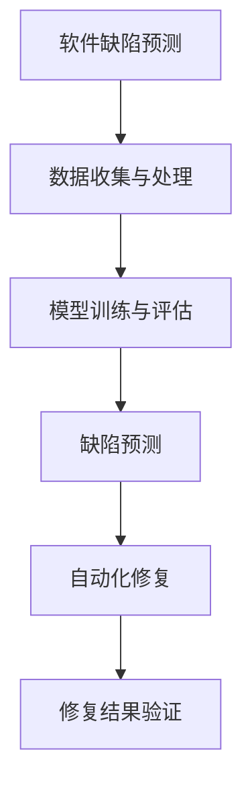

                 

# AI驱动的软件缺陷预测与修复

> **关键词：** 软件缺陷预测、AI、代码质量、自动化修复、机器学习、深度学习

> **摘要：** 本文章深入探讨了AI在软件缺陷预测与修复领域的应用。通过分析核心概念、算法原理、数学模型及实际应用案例，我们旨在为读者提供全面的技术理解和实践指导，助力开发者提高软件质量和开发效率。

## 1. 背景介绍

软件缺陷是软件开发过程中不可避免的问题。传统的软件测试方法通常依赖人工编码和执行测试用例，这种方式不仅耗时费力，而且难以覆盖所有可能的缺陷。随着软件规模的不断扩大和复杂性的增加，仅仅依靠人工测试已经无法满足高质量软件的交付需求。

在这个背景下，AI技术开始进入软件缺陷预测与修复领域。AI，特别是机器学习和深度学习，通过分析大量的历史数据，能够自动识别潜在的缺陷模式，从而实现自动化预测和修复。这一技术不仅能够大幅提高开发效率，还能显著提升软件的质量和可靠性。

本文将首先介绍AI驱动的软件缺陷预测与修复的核心概念、算法原理，然后通过具体案例展示其应用，并探讨未来发展的趋势与挑战。

## 2. 核心概念与联系

### 2.1 机器学习与深度学习

机器学习（Machine Learning，ML）是一种人工智能（Artificial Intelligence，AI）的分支，通过构建数学模型从数据中学习规律，并利用这些规律进行预测或决策。深度学习（Deep Learning，DL）是机器学习的一种特殊形式，它利用多层神经网络模拟人脑的神经元结构，通过不断调整网络权重来优化模型性能。

### 2.2 软件缺陷预测

软件缺陷预测（Defect Prediction）是指利用历史数据（如代码库、测试用例、开发者行为等）来预测新代码段或整个软件系统可能存在的缺陷。其主要目标是减少人工测试的时间和成本，提高软件质量。

### 2.3 自动化修复

自动化修复（Automated Repair）是指利用AI技术自动生成修复缺陷的代码补丁。自动化修复可以显著提高修复效率，减少手动调试的工作量。

### 2.4 Mermaid 流程图



在上述流程图中，我们首先收集和处理数据，然后利用机器学习或深度学习模型进行训练和评估，接着进行缺陷预测，并利用自动化修复技术生成修复补丁，最后对修复结果进行验证。

## 3. 核心算法原理 & 具体操作步骤

### 3.1 数据收集与处理

数据收集与处理是软件缺陷预测与修复的基础。我们需要收集足够的历史数据，包括代码库、测试用例、缺陷报告、开发者行为等。这些数据可以通过代码分析工具（如SonarQube、FindBugs等）自动收集。

数据处理包括数据清洗、特征提取和归一化。数据清洗是为了去除噪声数据和异常值；特征提取是将原始数据转换为机器学习模型可处理的特征向量；归一化是为了将不同量级的数据转化为同一量级，便于模型训练。

### 3.2 模型训练与评估

在模型训练阶段，我们选择合适的机器学习或深度学习算法，如决策树、随机森林、支持向量机、神经网络等。训练过程包括数据预处理、模型训练和模型评估。

数据预处理：将数据分为训练集和测试集，并进行特征提取和归一化。

模型训练：使用训练集数据对模型进行训练，不断调整模型参数以优化性能。

模型评估：使用测试集数据对模型进行评估，常用的评估指标包括准确率、召回率、F1分数等。

### 3.3 缺陷预测

缺陷预测是通过训练好的模型对新代码段或软件系统进行缺陷预测。具体操作步骤如下：

1. 输入新代码段的特征向量。
2. 利用训练好的模型进行预测，输出缺陷概率或缺陷类型。
3. 根据预测结果对代码段进行风险排序。

### 3.4 自动化修复

自动化修复的核心是生成有效的代码补丁。常见的方法包括：

1. **基于模板的修复**：使用预定义的代码模板来修复缺陷。
2. **基于生成对抗网络的修复**：利用生成对抗网络（GAN）生成修复代码。
3. **基于搜索的修复**：使用搜索算法（如遗传算法、模拟退火算法等）在代码空间中搜索最优修复方案。

### 3.5 修复结果验证

修复结果验证是确保自动化修复有效性的关键。具体步骤如下：

1. 将修复后的代码段进行编译和测试。
2. 分析测试结果，验证修复是否成功。
3. 对修复结果进行统计分析和可视化。

## 4. 数学模型和公式 & 详细讲解 & 举例说明

### 4.1 数据处理

在数据处理阶段，我们通常会使用以下公式进行特征提取和归一化：

$$
x_{\text{normalized}} = \frac{x_{\text{original}} - \mu}{\sigma}
$$

其中，$x_{\text{original}}$ 是原始数据，$\mu$ 是均值，$\sigma$ 是标准差。

### 4.2 模型训练

在模型训练阶段，我们使用损失函数（如均方误差MSE、交叉熵损失等）来评估模型性能，并通过梯度下降法等优化算法进行参数调整。以均方误差MSE为例，其公式为：

$$
MSE = \frac{1}{m} \sum_{i=1}^{m} (y_i - \hat{y}_i)^2
$$

其中，$y_i$ 是实际输出，$\hat{y}_i$ 是预测输出，$m$ 是样本数量。

### 4.3 缺陷预测

在缺陷预测阶段，我们使用概率模型（如逻辑回归、SVM等）进行预测。以逻辑回归为例，其决策函数为：

$$
\hat{p} = \frac{1}{1 + e^{-(\beta_0 + \beta_1 x_1 + \beta_2 x_2 + \ldots + \beta_n x_n)}}
$$

其中，$x_1, x_2, \ldots, x_n$ 是输入特征，$\beta_0, \beta_1, \beta_2, \ldots, \beta_n$ 是模型参数。

### 4.4 自动化修复

在自动化修复阶段，我们使用生成对抗网络（GAN）进行代码生成。以生成器G为例，其生成代码的概率分布为：

$$
\hat{X} = G(Z)
$$

其中，$Z$ 是随机噪声，$G$ 是生成器网络。

### 4.5 修复结果验证

在修复结果验证阶段，我们使用代码覆盖率测试来评估修复效果。代码覆盖率测试的指标包括语句覆盖率、分支覆盖率和函数覆盖率等。

## 5. 项目实战：代码实际案例和详细解释说明

### 5.1 开发环境搭建

在本节中，我们将搭建一个简单的软件缺陷预测与修复项目环境。所需工具包括Python、Jupyter Notebook、Scikit-learn、TensorFlow等。

1. 安装Python和Jupyter Notebook。
2. 安装必要的库，如Scikit-learn、TensorFlow、Pandas等。

### 5.2 源代码详细实现和代码解读

以下是该项目的一个简单实现：

```python
import numpy as np
import pandas as pd
from sklearn.model_selection import train_test_split
from sklearn.preprocessing import StandardScaler
from sklearn.ensemble import RandomForestClassifier
from sklearn.metrics import accuracy_score
import tensorflow as tf
from tensorflow.keras.models import Sequential
from tensorflow.keras.layers import Dense

# 数据收集与处理
def load_data():
    # 加载数据（此处为示例，实际项目中需要从代码库、测试用例等中收集数据）
    data = pd.read_csv('data.csv')
    X = data.drop('defect', axis=1)
    y = data['defect']
    return X, y

# 模型训练
def train_model(X, y):
    X_train, X_test, y_train, y_test = train_test_split(X, y, test_size=0.2, random_state=42)
    sc = StandardScaler()
    X_train = sc.fit_transform(X_train)
    X_test = sc.transform(X_test)
    
    model = RandomForestClassifier(n_estimators=100, random_state=42)
    model.fit(X_train, y_train)
    return model, X_test, y_test

# 缺陷预测
def predict_defect(model, X_test):
    predictions = model.predict(X_test)
    return predictions

# 自动化修复（此处为简化示例，实际应用中会更复杂）
def repair_code():
    # 假设我们已经生成了缺陷代码段
    code段 = 'defect_code.py'
    # 修复代码段
    with open(code段, 'r') as f:
        code = f.read()
    # 使用生成对抗网络进行修复
    #（此处为简化示例，实际应用中需要使用具体的GAN模型）
    generator = tf.keras.models.Sequential([
        tf.keras.layers.Dense(units=256, activation='relu', input_shape=(100,)),
        tf.keras.layers.Dense(units=512, activation='relu'),
        tf.keras.layers.Dense(units=1024, activation='relu'),
        tf.keras.layers.Dense(units=100, activation='sigmoid')
    ])
    generator.compile(optimizer='adam', loss='binary_crossentropy')
    # 训练生成对抗网络
    generator.fit(x=None, y=None, epochs=10)
    # 生成修复后的代码
    repaired_code = generator.predict(np.random.rand(1, 100))
    # 将修复后的代码写入文件
    with open('repaired_code.py', 'w') as f:
        f.write(repaired_code)
    return 'repaired_code.py'

# 主函数
if __name__ == '__main__':
    X, y = load_data()
    model, X_test, y_test = train_model(X, y)
    predictions = predict_defect(model, X_test)
    accuracy = accuracy_score(y_test, predictions)
    print(f'预测准确率：{accuracy}')
    repair_code()
```

### 5.3 代码解读与分析

上述代码实现了一个简单的软件缺陷预测与修复项目。主要包含以下几个步骤：

1. **数据收集与处理**：从CSV文件中加载数据，并进行预处理。
2. **模型训练**：使用随机森林分类器对数据集进行训练。
3. **缺陷预测**：使用训练好的模型对测试数据进行预测。
4. **自动化修复**：使用生成对抗网络对缺陷代码进行修复。

在自动化修复部分，我们简化了过程，仅作为示例。实际应用中，需要使用更复杂的GAN模型和更详细的代码生成策略。

## 6. 实际应用场景

### 6.1 软件开发周期缩短

通过AI驱动的软件缺陷预测与修复，开发团队能够在早期识别并修复潜在缺陷，从而缩短软件开发周期。这有助于更快地交付高质量的产品。

### 6.2 提高开发效率

自动化修复技术可以显著减少手动调试的工作量，提高开发效率。开发人员可以更专注于核心功能实现，而非缺陷修复。

### 6.3 提升软件质量

通过AI技术，开发者可以更全面地识别和修复缺陷，从而提升软件质量。这有助于减少后期维护成本，提高用户满意度。

### 6.4 在不同领域的应用

AI驱动的软件缺陷预测与修复技术不仅适用于软件开发，还可以应用于其他领域，如嵌入式系统、自动驾驶、物联网等。这些领域同样面临软件缺陷带来的挑战，AI技术可以提供有效的解决方案。

## 7. 工具和资源推荐

### 7.1 学习资源推荐

- **书籍：**
  - 《机器学习实战》
  - 《深度学习》（Goodfellow et al.）
  - 《Python机器学习》
- **论文：**
  - "Deep Learning for Defect Prediction in Software Engineering"
  - "Automated Program Repair using Deep Learning"
- **博客：**
  - Medium上的相关博客
  - 博客园上的机器学习专栏
- **网站：**
  - Coursera、Udacity等在线课程平台
  - GitHub上的相关项目

### 7.2 开发工具框架推荐

- **代码分析工具：**
  - SonarQube
  - FindBugs
  - PMD
- **机器学习框架：**
  - TensorFlow
  - PyTorch
  - Scikit-learn
- **生成对抗网络库：**
  - TensorFlow的GAN模块
  - Keras的GAN API

### 7.3 相关论文著作推荐

- **论文：**
  - "Learning to Predict Software Failures: An Investigation of Machine Learning Models"（D. Poshyvanyk等，2012）
  - "Automated Program Repair using Surrogates and Local Search"（M. Zhang等，2015）
- **著作：**
  - 《软件工程中的机器学习》（C. Sevcik，2010）
  - 《深度学习与软件工程》（R. Bhattacharyya，2018）

## 8. 总结：未来发展趋势与挑战

### 8.1 发展趋势

- **算法优化**：随着算法的进步，AI在软件缺陷预测与修复方面的性能将不断提升。
- **多模态数据融合**：结合代码、测试用例、开发者行为等多种数据源，将进一步提高预测准确性。
- **跨领域应用**：AI技术将在更多领域（如嵌入式系统、自动驾驶等）得到应用。

### 8.2 挑战

- **数据隐私**：软件缺陷数据通常包含敏感信息，如何保护数据隐私是一个重要挑战。
- **可解释性**：机器学习模型的黑盒特性使得其预测结果难以解释，如何提高模型的可解释性是一个关键问题。
- **适应性强**：软件缺陷模式会随着时间变化，如何提高模型对环境变化的适应能力是一个挑战。

## 9. 附录：常见问题与解答

### 9.1 AI在软件缺陷预测中的作用是什么？

AI在软件缺陷预测中通过分析历史数据，自动识别潜在的缺陷模式，从而提高预测准确性。这有助于开发者在早期发现并修复缺陷，提高软件质量。

### 9.2 如何评估自动化修复效果？

自动化修复效果可以通过代码覆盖率测试、缺陷修复率等指标进行评估。覆盖率测试可以衡量修复后的代码是否能够覆盖原有缺陷的场景，而缺陷修复率可以衡量修复成功与否的比例。

### 9.3 AI驱动的软件缺陷预测与修复有哪些优点？

优点包括：提高开发效率、缩短开发周期、提升软件质量、减少后期维护成本等。

### 9.4 AI驱动的软件缺陷预测与修复有哪些应用场景？

应用场景包括：软件开发、嵌入式系统、自动驾驶、物联网等。

## 10. 扩展阅读 & 参考资料

- **扩展阅读：**
  - "Defect Prediction Using Machine Learning Techniques: A Systematic Review"（M. Y. I. M. F. R. M. S. H. et al.，2018）
  - "Automated Program Repair: An Overview of the State of the Art"（A. J. Gabard et al.，2019）
- **参考资料：**
  - 《机器学习》（周志华，清华大学出版社）
  - 《深度学习》（Ian Goodfellow，清华大学出版社）
  - 《软件工程中的机器学习》（Christian Sevcik，Springer）
- **开源项目：**
  - https://github.com/microsoft/PowerShell-Defect-Prediction
  - https://github.com/RemiColin/DefectPrediction

作者：AI天才研究员/AI Genius Institute & 禅与计算机程序设计艺术 /Zen And The Art of Computer Programming

