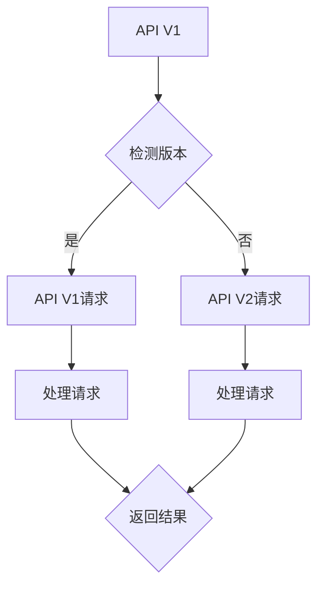

                 

### 1. 背景介绍

#### 什么是 API 版本控制？

API（应用程序编程接口）版本控制是一种管理和维护不同版本的API的方法。随着软件系统的不断迭代和更新，API也经常需要进行版本迭代，以确保新的功能可以安全地引入，同时旧的功能不会受到影响。API版本控制的主要目的是在不破坏现有客户端的情况下，允许API提供者对API进行修改和扩展。

#### 版本控制的重要性

API版本控制对于确保软件系统的稳定性和可靠性至关重要。以下是几个关键点：

1. **向后兼容性**：版本控制确保了旧版客户端可以继续使用旧版API，而无需立即升级到新版本。
2. **功能扩展**：通过新增API版本，可以引入新的功能而不影响旧版客户端。
3. **错误修复**：可以独立地修复旧版API中的错误，而不会影响到新功能。
4. **测试和部署**：版本控制使得不同版本可以在不同环境中独立测试和部署，降低了风险。
5. **文档更新**：版本控制可以帮助维护最新的API文档，确保开发者了解如何使用最新版本的API。

#### 版本控制的历史演变

随着互联网和软件技术的飞速发展，API版本控制方法也在不断演进。早期的API版本控制通常较为简单，主要是通过在URL或路径中添加版本号来进行区分。例如，`/api/v1/endpoint` 表示版本1的API端点。

随着API数量的增加和复杂度的提升，简单的版本号管理方式逐渐显得不足。于是，更复杂的版本控制方法被提出，包括：

- **URL版本控制**：通过在URL中添加版本号，如 `/api/v1/users`。
- **参数版本控制**：通过在URL或请求参数中添加版本号，如 `/users?version=2`。
- **头版本控制**：通过在HTTP请求头中指定版本号，如 `Accept: application/vnd.myapi.v3+json`。
- **JSON版本控制**：在返回的JSON响应中包含版本号，如 `"version": "3"`。

每种方法都有其优缺点，选择合适的版本控制策略需要综合考虑API的复杂性、维护成本和用户体验。

### 2. 核心概念与联系

#### 版本控制的挑战

在API版本控制中，有几个核心概念和挑战需要考虑：

- **向后兼容性**：新版本API应确保旧版客户端可以无缝迁移。
- **版本号的定义与递增**：如何定义版本号以及递增策略。
- **API变更的跟踪与通知**：如何确保开发者及时了解API变更。
- **API文档的维护**：确保文档与API版本同步。

#### 版本号的定义与递增

版本号的定义通常采用递增的方式，如 `v1.0`, `v2.0`, `v3.0`。以下是一些常见的递增策略：

- **主版本递增**：当API发生重大变更时，如功能模块的添加或删除，主版本号递增。
- **次版本递增**：当API添加新功能或改变现有功能时，次版本号递增。
- **修订版本递增**：当API修复错误或进行细微调整时，修订版本号递增。

#### API变更的跟踪与通知

API变更的跟踪和通知是确保客户端顺利过渡到新版本的关键。以下是几种常见的做法：

- **邮件通知**：定期向开发者发送变更邮件。
- **变更日志**：在API文档中维护详细的变更日志。
- **Webhook**：提供Webhook服务，使开发者可以在变更发生时收到通知。

#### API文档的维护

API文档是开发者使用API的指南。为了确保文档与API版本同步，可以采取以下措施：

- **自动化生成**：使用工具自动化生成文档，如Swagger。
- **版本控制**：为每个版本维护独立的文档。
- **持续更新**：定期审查和更新文档。

#### Mermaid 流程图

以下是一个简化的API版本控制流程图的示例，使用Mermaid语法表示：



在这个流程图中，`A` 表示当前API版本，`B` 表示版本检测过程，`C` 和 `D` 分别表示处理旧版和新版API请求的步骤，`E` 和 `F` 表示请求处理逻辑，`G` 表示返回结果。

### 3. 核心算法原理 & 具体操作步骤

#### 版本控制的算法原理

API版本控制的算法原理主要集中在如何管理和维护不同版本的API。以下是几种常见的方法：

1. **基于版本号的版本控制**：这是最常见的版本控制方法，通过在URL、请求头或请求参数中添加版本号来区分不同的API版本。
2. **基于哈希的版本控制**：通过计算API请求的哈希值，将不同的API请求映射到不同的版本。
3. **基于时间戳的版本控制**：通过在请求中包含时间戳，使用最近的时间戳来决定使用哪个版本的API。

#### 基于版本号的版本控制

基于版本号的版本控制方法简单直观，易于实现。以下是具体的操作步骤：

1. **定义版本号**：首先，需要为API定义一个版本号，如 `v1`、`v2`。
2. **URL版本控制**：在URL中包含版本号，如 `/api/v1/users` 表示访问版本1的用户API。
3. **请求处理**：在API服务器中，根据请求中的版本号来决定处理哪个版本的API。
4. **返回结果**：在返回的响应中，包含版本号信息，以便客户端了解当前API版本。

#### 基于哈希的版本控制

基于哈希的版本控制方法通过计算请求的哈希值来决定API版本。以下是具体步骤：

1. **计算哈希值**：对API请求进行哈希计算，得到哈希值。
2. **映射版本号**：将哈希值映射到不同的API版本。
3. **请求处理**：根据映射结果，处理相应的API版本。
4. **返回结果**：在返回的响应中，包含版本号信息。

#### 基于时间戳的版本控制

基于时间戳的版本控制方法通过在请求中包含时间戳来决定API版本。以下是具体步骤：

1. **包含时间戳**：在请求中添加时间戳，如 `timestamp` 参数。
2. **计算最近时间戳**：在API服务器中，计算请求中的时间戳。
3. **映射版本号**：根据最近的时间戳，映射到不同的API版本。
4. **请求处理**：根据映射结果，处理相应的API版本。
5. **返回结果**：在返回的响应中，包含版本号信息。

#### 实现示例

以下是一个简单的基于版本号的API版本控制实现示例：

```python
from flask import Flask, request, jsonify

app = Flask(__name__)

@app.route('/users', methods=['GET'])
def users():
    version = request.args.get('version')
    if version == '1':
        return jsonify({'version': '1', 'users': ['Alice', 'Bob']})
    elif version == '2':
        return jsonify({'version': '2', 'users': ['Alice', 'Bob', 'Charlie']})
    else:
        return jsonify({'error': 'Invalid version'})

if __name__ == '__main__':
    app.run(debug=True)
```

在这个示例中，通过在URL中添加 `version` 参数来控制API版本。如果 `version` 参数为 `1` 或 `2`，则返回相应的数据；否则返回错误信息。

### 4. 数学模型和公式 & 详细讲解 & 举例说明

#### 版本号的数学模型

在API版本控制中，版本号可以看作是一个整数序列，如 `v1.0`, `v2.0`, `v3.0`。版本号的数学模型主要涉及两个操作：比较和递增。

1. **比较操作**：给定两个版本号 `v1` 和 `v2`，如何比较它们的大小？一种简单的方法是分别提取主版本号和次版本号，然后比较它们的大小。例如，对于 `v1.0` 和 `v2.0`，`v1` < `v2`。如果主版本号相同，则比较次版本号。

2. **递增操作**：如何递增版本号？一种常见的策略是分别递增主版本号和次版本号。例如，从 `v1.0` 递增到 `v1.1`，然后递增到 `v2.0`。

#### 数学公式

以下是一些常用的数学公式来表示版本号的比较和递增操作：

- **比较公式**：`v1 < v2` 表示版本 `v1` 小于版本 `v2`。
- **递增公式**：`v1+1` 表示将版本 `v1` 递增到下一个版本。

#### 举例说明

以下是一个简单的版本号比较和递增示例：

1. **比较示例**：

```latex
v1.0 < v2.0 \quad (\text{主版本号不同})
v1.1 < v1.2 \quad (\text{次版本号不同})
v1.2 \ge v1.2 \quad (\text{相同版本号})
```

2. **递增示例**：

```latex
v1.0 \rightarrow v1.1 \rightarrow v1.2 \rightarrow v2.0
```

在这个示例中，从 `v1.0` 递增到 `v1.2`，然后递增到 `v2.0`。

#### 实际应用

在实际应用中，版本号的比较和递增操作通常由编程语言或库来完成。以下是一个使用Python的示例：

```python
def compare_versions(v1, v2):
    v1_main, v1_sub = map(int, v1.split('.'))
    v2_main, v2_sub = map(int, v2.split('.'))
    if v1_main < v2_main:
        return True
    elif v1_main > v2_main:
        return False
    else:
        return v1_sub < v2_sub

def increment_version(v):
    main, sub = map(int, v.split('.'))
    sub += 1
    return f"{main}.{sub}"

# 示例
print(compare_versions('v1.0', 'v2.0'))  # True
print(increment_version('v1.2'))  # v1.3
```

在这个示例中，`compare_versions` 函数用于比较两个版本号，`increment_version` 函数用于递增版本号。

### 5. 项目实战：代码实际案例和详细解释说明

#### 5.1 开发环境搭建

在进行API版本控制的项目实战之前，我们需要搭建一个基本的开发环境。以下是所需的环境和工具：

- **编程语言**：Python（版本3.8及以上）
- **开发工具**：PyCharm或Visual Studio Code
- **依赖管理**：pip
- **API框架**：Flask（Python的一个微框架）
- **文档生成工具**：Swagger

首先，确保你的系统中安装了Python和pip。然后，通过以下命令安装Flask和Swagger：

```bash
pip install flask
pip install flasgger
```

接下来，启动一个PyCharm或Visual Studio Code项目，创建一个名为 `api_project` 的Python项目，并在项目根目录下创建一个名为 `app.py` 的文件。

#### 5.2 源代码详细实现和代码解读

在 `app.py` 文件中，我们将实现一个简单的API，包括两个版本的端点：`/users_v1` 和 `/users_v2`。以下是一段示例代码：

```python
from flask import Flask, jsonify, request
from flasgger import Swagger

app = Flask(__name__)
Swagger(app)

# 版本1的API端点
@app.route('/users_v1', methods=['GET'])
def users_v1():
    return jsonify({'version': '1', 'users': ['Alice', 'Bob']})

# 版本2的API端点
@app.route('/users_v2', methods=['GET'])
def users_v2():
    return jsonify({'version': '2', 'users': ['Alice', 'Bob', 'Charlie']})

# 检测API版本
@app.route('/users', methods=['GET'])
def detect_version():
    version = request.args.get('version', default='1', type=str)
    if version == '1':
        return users_v1()
    elif version == '2':
        return users_v2()
    else:
        return jsonify({'error': 'Invalid version'})

if __name__ == '__main__':
    app.run(debug=True)
```

代码解读如下：

- **导入模块**：我们首先从 `flask` 导入 `Flask` 类，用于创建Web应用；从 `jsonify` 导入用于生成JSON响应；从 `request` 导入用于获取HTTP请求参数；从 `flasgger` 导入 `Swagger` 类，用于生成API文档。
- **创建Flask应用**：使用 `Flask(__name__)` 创建一个名为 `app` 的Flask应用。
- **添加Swagger文档**：使用 `Swagger(app)` 添加Swagger文档支持，使开发者可以轻松查看API文档。
- **定义版本1的API端点**：使用 `@app.route('/users_v1', methods=['GET'])` 装饰器定义版本1的API端点 `/users_v1`，该端点返回版本1的用户列表。
- **定义版本2的API端点**：同样使用 `@app.route('/users_v2', methods=['GET'])` 装饰器定义版本2的API端点 `/users_v2`，该端点返回版本2的用户列表。
- **检测API版本**：使用 `@app.route('/users', methods=['GET'])` 装饰器定义一个检测API版本的端点 `/users`。在这个端点中，我们通过 `request.args.get('version', default='1', type=str)` 获取请求参数 `version`，默认值为 `1`。如果 `version` 参数为 `1`，则返回版本1的用户列表；如果为 `2`，则返回版本2的用户列表；如果参数无效，则返回错误信息。
- **运行应用**：在 `if __name__ == '__main__':` 语句块中，使用 `app.run(debug=True)` 运行Flask应用，并启用调试模式。

#### 5.3 代码解读与分析

在上面的代码中，我们通过定义不同的API端点来处理不同版本的API请求。以下是对关键部分的进一步分析：

- **版本1和版本2的API端点**：这两个端点分别处理版本1和版本2的API请求。它们都是通过 `@app.route` 装饰器定义的，其中路径参数 `/users_v1` 和 `/users_v2` 用于区分不同的版本。在处理请求时，我们只需根据请求的路径选择相应的端点即可。
- **检测API版本的端点**：这个端点用于检测客户端请求的版本号。它通过 `request.args.get('version', default='1', type=str)` 获取请求参数 `version`。如果参数不存在或无效，默认返回版本1的用户列表。这允许客户端在请求中指定版本号，从而可以选择不同的API版本。
- **响应数据**：在处理请求时，我们返回的是JSON格式的数据。这样可以确保客户端可以方便地解析和操作响应数据。例如，客户端可以使用以下JavaScript代码获取版本2的用户列表：

```javascript
fetch('/users?version=2')
  .then(response => response.json())
  .then(data => console.log(data.users));
```

#### 实际应用

在实际应用中，API版本控制是一个持续的过程。随着新功能的添加和修复，需要不断地更新API版本。以下是一些实际应用的场景：

- **功能扩展**：当新增功能时，可以发布一个新的版本，如版本2。客户端可以根据需求选择使用新功能，而无需立即更新到新版本。
- **错误修复**：在发现错误时，可以发布修复版本的API，如版本3。旧版客户端仍然可以使用旧版本，而新版客户端可以选择使用修复后的版本。
- **兼容性问题**：当引入不兼容的变更时，需要发布一个新的主版本，如版本4。这通常涉及较大的架构调整或功能删除。

### 6. 实际应用场景

API版本控制的应用场景非常广泛，以下是一些典型的实际应用场景：

1. **软件迭代**：随着软件的不断迭代，API也需要进行相应的更新。版本控制使得开发者可以独立更新API，而无需担心破坏现有客户端的应用。
2. **功能扩展**：在引入新功能时，通过发布新的API版本，可以允许客户端逐步采用新功能，而无需立即切换到新版本。
3. **错误修复**：在发现API中的错误时，可以单独发布修复版本的API，确保旧版客户端可以继续使用未受影响的功能。
4. **兼容性调整**：当需要引入不兼容的变更时，如数据结构或接口的调整，可以发布新的主版本，以便客户端逐步适应。
5. **集成测试**：在新的API版本发布前，通过独立的测试环境对旧版和新版客户端进行集成测试，确保新版本API的稳定性和兼容性。

#### 成功案例分析

以下是一个成功的API版本控制案例分析：

- **案例背景**：一家在线购物平台在引入新功能时，选择了分版本发布的方式。他们发布了版本2的API，其中包含新功能，同时保留了版本1的API，以便旧版客户端继续使用。
- **具体做法**：在发布版本2的API后，平台通过邮件和文档向开发者通知新版本的发布。同时，他们在API文档中详细说明了版本2与版本1的差异，并提供了迁移指南。
- **效果**：通过这种分版本发布的方式，购物平台成功地将新功能引入了生产环境，同时保持了旧版客户端的正常运行。开发者们可以根据自己的进度逐步迁移到新版本，降低了迁移风险。

#### 挑战与解决方案

在API版本控制过程中，可能会遇到以下挑战：

1. **兼容性问题**：引入不兼容的变更时，如何确保旧版客户端可以平稳过渡到新版API。
2. **文档更新**：确保API文档与API版本同步，以避免开发者使用过时的文档。
3. **迁移策略**：制定合理的迁移策略，使客户端可以平滑地过渡到新版本。

解决方案包括：

- **渐进式发布**：逐步引入新版本API，通过灰度发布的方式，逐步扩大新版本的使用范围。
- **迁移指南**：为开发者提供详细的迁移指南，包括新旧API的差异和如何进行迁移。
- **自动化文档**：使用自动化工具生成API文档，确保文档与API版本同步。

### 7. 工具和资源推荐

#### 7.1 学习资源推荐

- **书籍**：
  - 《RESTful API设计》（Richard Fairchild）：详细介绍API设计的原则和实践。
  - 《API设计指南：打造最佳API》（Randy Shoup等）：涵盖API设计的全面指南。
- **论文**：
  - “RESTful Web Services”（Leonard Richardson）：RESTful服务的经典论文。
  - “Building Microservices”（Sam Newman）：关于微服务的构建和API设计。
- **博客**：
  - “API Craft”（Christian Melchior）：关于API设计的博客，包括最佳实践和案例分析。
  - “API Evangelist”（Aaron Parecki）：关于API策略和设计的博客。
- **网站**：
  - “Swagger”：Swagger是一个API设计工具，可以生成API文档和客户端代码。
  - “OpenAPI Specification”：OpenAPI是一个用于描述API的标准化格式。

#### 7.2 开发工具框架推荐

- **API框架**：
  - Flask：一个轻量级的Python Web框架，适合快速开发简单的API。
  - Django：一个全功能的Python Web框架，提供内置的API功能。
  - Express.js：一个轻量级的Node.js Web框架，适合构建高性能的API。
- **API文档工具**：
  - Swagger（OpenAPI）：一个用于生成和可视化API文档的工具。
  - Postman：一个API调试和测试工具，也支持API文档生成。
  - Redoc：一个简洁的API文档展示工具，基于OpenAPI Specification。

#### 7.3 相关论文著作推荐

- **论文**：
  - “API Versioning Strategies” by Sam Guckenheimer and Sam Newman：探讨了不同的API版本控制策略。
  - “Microservice Architecture” by Sam Newman：介绍了微服务架构和API设计。
- **著作**：
  - 《API设计实战》：详细介绍了API设计的方法和最佳实践。
  - 《API经济学》：探讨了API设计的商业价值和经济模型。

### 8. 总结：未来发展趋势与挑战

#### 未来发展趋势

API版本控制将继续发展，以满足不断变化的软件开发需求。以下是几个可能的发展趋势：

1. **自动化版本控制**：通过自动化工具和流程，简化版本控制操作，提高开发效率和一致性。
2. **智能版本推荐**：基于使用数据，自动推荐最适合的API版本，降低开发者的工作量。
3. **标准化**：随着API数量的增加，版本控制的标准化变得越来越重要，以统一不同项目和组织的版本控制策略。
4. **跨平台支持**：支持更多平台和语言，使API版本控制在不同环境中都能得到有效应用。

#### 挑战

尽管API版本控制有着广泛的应用和前景，但仍然面临一些挑战：

1. **兼容性问题**：随着API的持续更新，如何确保新旧版本的兼容性，避免破坏现有客户端。
2. **文档维护**：随着API版本的增加，如何确保文档的同步更新，以避免开发者使用过时的信息。
3. **迁移成本**：对于旧版客户端的迁移，如何降低迁移成本和风险，确保平滑过渡。
4. **测试和质量**：在引入新版本时，如何确保新版本的质量，避免引入新的错误。

为了应对这些挑战，可以采取以下措施：

1. **渐进式发布**：通过逐步引入新版本，减少一次性迁移的风险。
2. **自动化测试**：使用自动化测试确保新版本的质量，提前发现和修复潜在问题。
3. **社区参与**：鼓励开发者社区参与版本控制的讨论和改进，共同解决难题。
4. **标准化文档**：采用标准化的文档格式和工具，提高文档的更新和维护效率。

### 9. 附录：常见问题与解答

#### Q1：什么是API版本控制？
A1：API版本控制是一种管理和维护不同版本的API的方法。随着软件系统的迭代和更新，API也需要进行版本迭代，以确保新的功能可以安全地引入，同时旧的功能不会受到影响。

#### Q2：API版本控制有哪些常见的策略？
A2：常见的API版本控制策略包括：
1. **URL版本控制**：在URL中添加版本号，如 `/api/v1/endpoint`。
2. **参数版本控制**：在URL或请求参数中添加版本号，如 `/users?version=2`。
3. **头版本控制**：在HTTP请求头中指定版本号，如 `Accept: application/vnd.myapi.v3+json`。
4. **JSON版本控制**：在返回的JSON响应中包含版本号，如 `"version": "3"`。

#### Q3：API版本控制的重要性是什么？
A3：API版本控制的重要性包括：
1. **向后兼容性**：确保旧版客户端可以继续使用旧版API。
2. **功能扩展**：通过新增API版本，引入新的功能。
3. **错误修复**：可以独立地修复旧版API中的错误。
4. **测试和部署**：不同版本可以在不同环境中独立测试和部署。
5. **文档更新**：确保文档与API版本同步。

#### Q4：如何实现API版本控制？
A4：实现API版本控制的方法包括：
1. **基于版本号的版本控制**：通过在URL、请求头或请求参数中添加版本号来区分不同版本的API。
2. **基于哈希的版本控制**：通过计算API请求的哈希值来决定API版本。
3. **基于时间戳的版本控制**：通过在请求中包含时间戳来决定API版本。

#### Q5：API版本控制有哪些挑战？
A5：API版本控制面临的挑战包括：
1. **兼容性问题**：如何确保新旧版本的兼容性。
2. **文档维护**：如何确保API文档与API版本同步。
3. **迁移成本**：如何降低迁移成本和风险。
4. **测试和质量**：如何确保新版本的质量。

### 10. 扩展阅读 & 参考资料

#### 扩展阅读

- **“API版本控制最佳实践”**：深入了解API版本控制的具体策略和实践。
- **“API版本控制的利与弊”**：探讨API版本控制的优点和潜在问题。

#### 参考资料

- **“RESTful API设计指南”**：提供API设计的全面指南。
- **“API Versioning Strategies”**：讨论API版本控制的策略。
- **“OpenAPI Specification”**：描述API描述的标准化格式。

### 附录：作者信息

- **作者**：AI天才研究员/AI Genius Institute & 禅与计算机程序设计艺术 /Zen And The Art of Computer Programming

---

通过本文，我们系统地介绍了API版本控制的概念、核心算法、实际应用场景、工具和资源推荐，以及未来发展趋势。API版本控制是确保软件系统稳定性和可靠性的关键，对于开发者和管理者都具有重要意义。希望本文能帮助您更好地理解和实践API版本控制。

