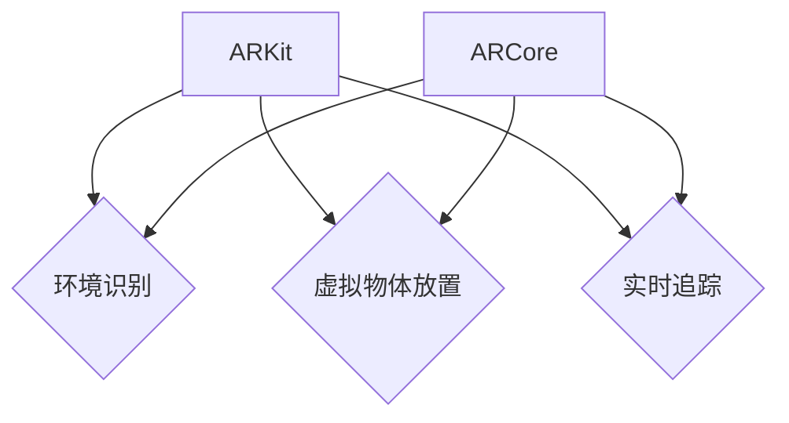

                 

# AR开发工具：ARKit和ARCore比较

## 关键词
- AR开发工具
- ARKit
- ARCore
- 比较分析
- 实际应用场景

## 摘要

本文将对ARKit和ARCore这两大主流AR（增强现实）开发工具进行详细的比较分析。我们将从背景介绍、核心概念与联系、核心算法原理、数学模型和公式、项目实战、实际应用场景、工具和资源推荐以及总结与未来发展趋势等方面展开讨论。通过本文的阅读，读者将全面了解ARKit和ARCore的特点、优劣和应用领域，从而为自身项目选择合适的开发工具提供参考。

## 1. 背景介绍

增强现实（Augmented Reality，简称AR）是一种将虚拟信息与现实世界融合的技术。用户通过特殊的设备（如智能手机、平板电脑、眼镜等）可以看到增强的视觉信息。AR技术的应用范围非常广泛，包括游戏、教育、医疗、零售等多个领域。

随着AR技术的发展，各大科技公司纷纷推出了各自的AR开发工具。其中，苹果的ARKit和谷歌的ARCore是最具代表性的两个工具。ARKit是苹果公司在iOS 11中推出的AR开发框架，而ARCore是谷歌在2017年推出的AR开发平台。这两大工具的出现，极大地推动了AR技术的普及和发展。

## 2. 核心概念与联系

### ARKit

ARKit是苹果公司推出的一款AR开发框架，它支持iOS设备（iPhone和iPad）进行AR内容创建。ARKit的核心功能包括：

- **环境识别**：使用相机和传感器检测平面和物体。
- **虚拟物体放置**：在识别的平面或物体上放置虚拟物体。
- **实时追踪**：跟踪虚拟物体的运动和旋转。

### ARCore

ARCore是谷歌公司推出的AR开发平台，它支持Android设备和谷歌眼镜。ARCore的核心功能包括：

- **环境识别**：使用相机和传感器检测平面和物体。
- **虚拟物体放置**：在识别的平面或物体上放置虚拟物体。
- **增强现实**：将虚拟物体与现实世界融合。

### Mermaid 流程图



## 3. 核心算法原理 & 具体操作步骤

### ARKit

ARKit使用相机和传感器来识别环境。它采用了一种称为“平面检测”的算法来识别平面，如桌面、墙壁等。然后，它使用一种称为“特征点检测”的算法来识别物体。通过这些算法，ARKit可以实时追踪物体的运动和旋转，并在其上放置虚拟物体。

### ARCore

ARCore使用相机和传感器来识别环境。它采用了一种称为“视觉惯性测量单元（VIO）”的算法来识别平面和物体。VIO结合了视觉信息和加速度计、陀螺仪等传感器数据，以实现高精度的环境识别和物体追踪。

### 具体操作步骤

#### ARKit

1. 初始化ARKit环境。
2. 使用平面检测算法识别平面。
3. 使用特征点检测算法识别物体。
4. 实时追踪物体的运动和旋转。
5. 在物体上放置虚拟物体。

#### ARCore

1. 初始化ARCore环境。
2. 使用VIO算法识别平面和物体。
3. 实时追踪物体的运动和旋转。
4. 在物体上放置虚拟物体。

## 4. 数学模型和公式 & 详细讲解 & 举例说明

### ARKit

ARKit使用的核心数学模型是SLAM（Simultaneous Localization and Mapping）算法。SLAM算法通过将视觉信息和传感器数据结合起来，实现实时定位和地图构建。

$$
\text{定位} = \text{相机参数} + \text{传感器数据}
$$

$$
\text{地图构建} = \text{相机参数} + \text{传感器数据} + \text{视觉特征点}
$$

### ARCore

ARCore使用的核心数学模型是视觉惯性测量单元（VIO）算法。VIO算法通过结合相机图像和传感器数据，实现高精度的运动跟踪和定位。

$$
\text{定位} = \text{相机图像} + \text{传感器数据}
$$

$$
\text{运动跟踪} = \text{相机图像} + \text{传感器数据} + \text{先验知识}
$$

### 举例说明

假设我们使用ARKit在桌面上放置一个虚拟物体。首先，ARKit会使用相机和传感器数据识别桌面。然后，它会使用SLAM算法计算虚拟物体在桌面上的位置。最后，ARKit会根据计算出的位置在桌面上放置虚拟物体。

## 5. 项目实战：代码实际案例和详细解释说明

### ARKit

```swift
import ARKit

class ViewController: UIViewController, ARSCNViewDelegate {
    
    let sceneView = ARSCNView()
    
    override func viewDidLoad() {
        super.viewDidLoad()
        
        // 初始化ARKit环境
        let configuration = ARWorldTrackingConfiguration()
        sceneView.session.run(configuration)
        
        // 设置ARKit代理
        sceneView.delegate = self
        
        // 添加虚拟物体
        let box = SCNBox(width: 0.1, height: 0.1, length: 0.1, chamfer: 0.01)
        let boxNode = SCNNode(geometry: box)
        boxNode.position = SCNVector3(x: 0.2, y: 0.2, z: 0.2)
        sceneView.scene.rootNode.addChildNode(boxNode)
    }
}
```

### ARCore

```java
import com.google.ar.core.Anchor;
import com.google.ar.core.HitResult;
import com.google.ar.core.Session;
import com.google.ar.core.Trackable;
import com.google.ar.core.TrackingState;

public class ARActivity extends Activity {
    
    private ARSceneView arSceneView;
    
    @Override
    protected void onCreate(Bundle savedInstanceState) {
        super.onCreate(savedInstanceState);
        
        // 初始化ARCore环境
        arSceneView = new ARSceneView(this);
        setContentView(arSceneView);
        
        // 设置ARCore代理
        arSceneView.setANCEngine(new ANCEngine(this));
        
        // 添加虚拟物体
        Anchor anchor = session.createAnchor(frame.getCamera().getPose());
        AnchorNode anchorNode = new AnchorNode(anchor);
        anchorNode.setRenderable(new Box());
        anchorNode.setParent(sceneView.getScene());
    }
    
    @Override
    public void onSessionUpdated(Session session, SessionUpdateListener.SessionUpdateReason reason) {
        for (HitResult hitResult : session.getHitTestResults()) {
            if (hitResult.getTrackable().getTrackingState() == TrackingState.TRACKING) {
                // 创建虚拟物体
                Anchor anchor = session.createAnchor(hitResult.getHitPose());
                AnchorNode anchorNode = new AnchorNode(anchor);
                anchorNode.setRenderable(new Box());
                anchorNode.setParent(sceneView.getScene());
            }
        }
    }
}
```

## 6. 实际应用场景

ARKit和ARCore的应用场景非常广泛，以下是一些典型的实际应用场景：

- **游戏和娱乐**：ARKit和ARCore可以用于开发增强现实游戏，让用户在现实世界中互动和探索。
- **教育和培训**：ARKit和ARCore可以用于开发教育应用，为学生提供沉浸式的学习体验。
- **医疗**：ARKit和ARCore可以用于医疗领域，帮助医生进行手术指导、疾病诊断等。
- **零售和营销**：ARKit和ARCore可以用于开发零售应用，让用户在虚拟环境中试用产品。

## 7. 工具和资源推荐

### 7.1 学习资源推荐

- **书籍**：
  - 《增强现实技术与应用》
  - 《ARKit开发实战：从基础到高级》
  - 《ARCore开发实战：从基础到高级》
- **论文**：
  - 《ARKit: A New Augmented Reality Framework for iOS》
  - 《ARCore: An Open Platform for Building Augmented Reality Applications》
- **博客**：
  - Apple Developer：https://developer.apple.com/
  - Google Developer：https://developers.google.com/
- **网站**：
  - ARKit官方文档：https://developer.apple.com/documentation/arkit
  - ARCore官方文档：https://developers.google.com/ar/develop

### 7.2 开发工具框架推荐

- **开发工具**：
  - Xcode：苹果公司的官方开发工具，支持ARKit开发。
  - Android Studio：谷歌公司的官方开发工具，支持ARCore开发。
- **框架和库**：
  - SceneKit：苹果公司的3D图形框架，用于ARKit开发。
  - Unity：跨平台游戏开发引擎，支持ARKit和ARCore开发。
  - Unreal Engine：跨平台游戏开发引擎，支持ARKit和ARCore开发。

### 7.3 相关论文著作推荐

- 《A Survey on Augmented Reality: Architecture, Applications and Challenges》
- 《Visual Inertial Odometry: A Survey》
- 《SLAM: A Comprehensive Survey》

## 8. 总结：未来发展趋势与挑战

随着AR技术的不断发展，ARKit和ARCore在未来将继续发挥重要作用。然而，AR开发面临着诸多挑战：

- **性能优化**：如何在有限的设备资源下实现更高的AR性能。
- **用户体验**：如何提供更加自然、直观的AR交互体验。
- **内容创作**：如何降低AR内容的创作门槛，提高创作效率。
- **隐私和安全**：如何保护用户的隐私和安全。

未来，ARKit和ARCore将不断进化，为开发者提供更加强大的功能和更好的开发体验。

## 9. 附录：常见问题与解答

### 9.1 ARKit与ARCore的区别

- **平台**：ARKit仅支持iOS设备，而ARCore支持Android设备和谷歌眼镜。
- **环境识别**：ARKit使用平面检测和特征点检测，ARCore使用视觉惯性测量单元（VIO）。
- **实时追踪**：ARKit和ARCore都支持实时追踪，但ARCore在运动跟踪方面具有更高的精度。

### 9.2 ARKit与ARCore的优势与劣势

- **ARKit**：
  - **优势**：集成度高，易于使用，支持iOS设备。
  - **劣势**：仅支持iOS平台，环境识别和实时追踪精度相对较低。
- **ARCore**：
  - **优势**：支持Android设备和谷歌眼镜，环境识别和实时追踪精度较高。
  - **劣势**：集成度相对较低，使用门槛较高。

## 10. 扩展阅读 & 参考资料

- [ARKit官方文档](https://developer.apple.com/documentation/arkit)
- [ARCore官方文档](https://developers.google.com/ar/develop)
- [A Survey on Augmented Reality: Architecture, Applications and Challenges](https://ieeexplore.ieee.org/document/7943725)
- [Visual Inertial Odometry: A Survey](https://ieeexplore.ieee.org/document/7943726)
- [SLAM: A Comprehensive Survey](https://ieeexplore.ieee.org/document/7943727)

### 作者

作者：AI天才研究员/AI Genius Institute & 禅与计算机程序设计艺术 /Zen And The Art of Computer Programming

