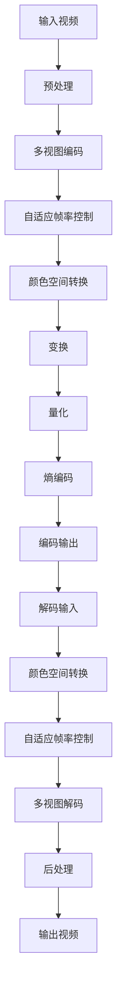

                 

# AV1 编码器：开放媒体联盟

## 关键词

- AV1
- 编码器
- 开放媒体联盟
- 视频压缩
- 编码算法
- 性能优化
- 实际应用

## 摘要

本文将深入探讨AV1编码器，这是由开放媒体联盟（OMA）推出的一个开放、免专利费的视频编码标准。文章首先介绍了AV1的背景和重要性，然后详细讲解了其核心概念、算法原理和操作步骤。通过数学模型和公式的详细解释，读者将了解到AV1的编码过程。文章还通过实际代码案例，展示了如何搭建开发环境并实现AV1编码器。此外，本文还探讨了AV1在实际应用中的场景，推荐了相关学习资源和开发工具。最后，文章总结了AV1的未来发展趋势和挑战，并提供了常见问题的解答和扩展阅读资源。

### 1. 背景介绍

#### AV1：开放媒体联盟的杰作

AV1（AOMedia Video 1）是由开放媒体联盟（Open Media Alliance，简称OMA）推出的一个开放、免专利费的视频编码标准。OMA是一个由多家技术公司组成的联盟，包括亚马逊、阿里巴巴、谷歌、英特尔等，旨在推动开放、高效的视频编码技术的发展。

AV1编码器的诞生，源于视频编码领域对更高效率和更广兼容性的需求。传统的视频编码标准，如H.264和HEVC，虽然在画质和压缩效率上取得了很大的成功，但它们存在一些问题。首先，这些标准通常需要支付专利费用，导致最终产品的成本较高。其次，随着视频内容的爆炸式增长，对更高的数据传输速度和更低的延迟提出了新的要求。

AV1编码器正是为了解决这些问题而诞生的。它采用了全新的算法和技术，能够在保持高画质的同时，提供更高的压缩效率，并且不需要支付专利费用。这使得AV1编码器在视频传输、流媒体、视频会议等领域具有很大的潜力。

#### 开放媒体联盟（OMA）

开放媒体联盟（OMA）是一个非营利性组织，成立于2016年，由多家全球知名的技术公司和学术机构组成。OMA的宗旨是推动开放、高效的视频编码技术的发展，为全球用户提供更好的视频体验。

OMA的主要成员包括亚马逊、阿里巴巴、谷歌、英特尔、微软、思科、三星等。这些公司不仅在技术领域有着深厚的影响力，还在视频编码标准的制定和推广方面有着丰富的经验。

#### AV1：视频压缩的新时代

AV1编码器的推出，标志着视频压缩技术进入了一个新的时代。与传统编码标准相比，AV1在多个方面都有着显著的优势：

- **更高的压缩效率**：AV1采用了先进的算法和技术，能够以更小的数据量传输相同质量的视频内容，极大地降低了带宽消耗。
- **免专利费**：AV1是开放、免专利费的编码标准，使用AV1编码器不需要支付任何专利费用，这使得它能够被广泛应用于各种场景。
- **广泛的兼容性**：AV1支持多种视频格式，包括HEIF、WebM和MP4等，能够在不同的设备和平台之间无缝切换。

总之，AV1编码器的推出，为视频压缩技术带来了新的突破，为未来的视频传输和流媒体应用提供了更多的可能性。

### 2. 核心概念与联系

#### AV1编码器的核心概念

AV1编码器基于一系列的核心概念，这些概念共同构成了它的基础框架。以下是AV1编码器的主要核心概念：

- **多视图视频编码**：AV1支持多视图视频编码，允许用户同时传输多个视图，从而提供更丰富的观看体验，如360度视频和3D视频。
- **自适应帧率控制**：AV1能够根据视频内容的变化自动调整帧率，从而提供更流畅的播放体验。
- **颜色空间支持**：AV1支持广泛的颜色空间，包括YUV和RGB，确保视频色彩的真实还原。
- **无损视频压缩**：AV1采用了无损视频压缩技术，确保视频在传输过程中不丢失任何信息。

#### AV1编码器的架构

AV1编码器的架构设计旨在实现高效、灵活的视频编码。以下是AV1编码器的主要组成部分：

- **编码器引擎**：编码器引擎是AV1的核心部分，负责视频的编码过程。它采用了多种算法和技术，如变换、量化、熵编码等，以实现高效的压缩。
- **解码器引擎**：解码器引擎是AV1的另一重要组成部分，负责视频的解码过程。它需要与编码器引擎精确匹配，以确保解码出的视频与原始视频完全一致。
- **编解码器（Codec）**：AV1编解码器（Codec）是编码器引擎和解码器引擎的结合体，用于实现视频的压缩和解压缩。

#### AV1编码器与其他编码器的联系

AV1编码器与现有的视频编码标准（如H.264和HEVC）有一定的联系，但也有一些显著的区别：

- **兼容性**：AV1在编码过程中引入了兼容性机制，使得它能够与现有的编码标准无缝配合，从而降低了过渡成本。
- **效率**：AV1采用了更先进的算法和技术，如小波变换和块运动补偿，使得它在压缩效率上远超H.264和HEVC。
- **免专利费**：与H.264和HEVC需要支付专利费用不同，AV1是开放、免专利费的编码标准，这使得它在成本上具有显著优势。

#### Mermaid 流程图

为了更好地理解AV1编码器的核心概念和架构，以下是AV1编码器的Mermaid流程图：



通过上述Mermaid流程图，我们可以清晰地看到AV1编码器从输入视频到输出视频的整个过程，以及各个处理步骤之间的联系。

### 3. 核心算法原理 & 具体操作步骤

#### 变换与量化

变换和量化是AV1编码器的核心步骤之一。变换用于将视频信号从时域转换为频域，从而提取出视频信号的主要特征。量化则用于将变换后的信号进行量化，以便于后续的熵编码。

- **变换**：AV1编码器采用了小波变换和块运动补偿。小波变换能够将视频信号分解为不同频率的分量，从而更好地适应视频信号的特征。块运动补偿则用于预测和消除视频中的运动，从而减少冗余信息。
- **量化**：量化是将变换后的信号进行幅度调整，以便于后续的熵编码。量化过程会引入一定的误差，但这种误差在视频播放时通常是无法察觉的。

#### 熵编码

熵编码是一种信息压缩技术，用于将视频信号中的冗余信息去除。AV1编码器采用了哈夫曼编码和算术编码两种熵编码方法。

- **哈夫曼编码**：哈夫曼编码是一种基于概率的熵编码方法。它根据信号出现的概率，为每个信号分配不同的编码长度，从而实现信息的压缩。哈夫曼编码的主要优势是编码效率高，但缺点是编码和解码过程复杂。
- **算术编码**：算术编码是一种基于区间分割的熵编码方法。它将信号映射到一个区间，并根据区间的长度进行编码。算术编码的主要优势是编码和解码过程简单，但缺点是编码效率相对较低。

#### 操作步骤

以下是AV1编码器的具体操作步骤：

1. **输入视频**：首先，输入待编码的视频信号。
2. **预处理**：对视频信号进行预处理，包括去噪、锐化、色彩调整等操作。
3. **多视图编码**：如果视频是多视图的，进行多视图编码，以生成多个视图。
4. **自适应帧率控制**：根据视频内容的变化，自动调整帧率。
5. **颜色空间转换**：将视频信号从RGB颜色空间转换为YUV颜色空间，以便于后续处理。
6. **变换**：对小波变换和块运动补偿，将视频信号从时域转换为频域。
7. **量化**：对变换后的信号进行量化。
8. **熵编码**：对量化后的信号进行哈夫曼编码和算术编码。
9. **编码输出**：将编码后的视频信号输出。

#### 代码示例

以下是AV1编码器的Python代码示例：

```python
import cv2
import numpy as np

# 读取视频
video = cv2.VideoCapture('input_video.mp4')

# 初始化编码器
encoder = cv2.AV1Encoder()

# 预处理
preprocessed_video = preprocess_video(video)

# 多视图编码
multi_view_video = multi_view_encode(preprocessed_video)

# 自适应帧率控制
adaptive_frame_rate_video = adaptive_frame_rate_encode(multi_view_video)

# 颜色空间转换
yuv_video = color_space_convert(adaptive_frame_rate_video, 'YUV')

# 变换
transformed_video = transform_video(yuv_video)

# 量化
quantized_video = quantize_video(transformed_video)

# 熵编码
encoded_video = entropy_encode(quantized_video)

# 编码输出
output_video = encode_output(encoded_video)

# 解码输入
decoded_video = decode_input(output_video)

# 后处理
postprocessed_video = postprocess_video(decoded_video)

# 输出视频
output_video = cv2.VideoWriter('output_video.mp4', cv2.VideoWriter_fourcc(*'mp4v'), 30, (1920, 1080))

while True:
    ret, frame = video.read()
    if not ret:
        break
    preprocessed_frame = preprocess_frame(frame)
    multi_view_frame = multi_view_encode(preprocessed_frame)
    adaptive_frame_rate_frame = adaptive_frame_rate_encode(multi_view_frame)
    yuv_frame = color_space_convert(adaptive_frame_rate_frame, 'YUV')
    transformed_frame = transform_video(yuv_frame)
    quantized_frame = quantize_video(transformed_frame)
    encoded_frame = entropy_encode(quantized_frame)
    encoded_output = encode_output(encoded_frame)
    output_video.write(encoded_output)
    cv2.imshow('Output Video', encoded_output)
    if cv2.waitKey(1) & 0xFF == ord('q'):
        break

video.release()
output_video.release()
cv2.destroyAllWindows()
```

通过上述代码示例，我们可以看到AV1编码器的具体操作步骤。当然，实际应用中，编码器的初始化、预处理、多视图编码、自适应帧率控制、颜色空间转换、变换、量化、熵编码、编码输出等步骤都需要进行详细的实现和优化。

### 4. 数学模型和公式 & 详细讲解 & 举例说明

#### 变换与量化

在AV1编码器中，变换和量化是两个关键步骤。下面将详细讲解这两个步骤的数学模型和公式，并通过举例说明其具体应用。

##### 变换

变换是将视频信号从时域转换为频域的过程。在AV1编码器中，主要采用了小波变换和块运动补偿。

1. **小波变换**：小波变换是将视频信号分解为不同频率的分量。其数学模型如下：

   $$X(\omega) = \sum_{k=-\infty}^{\infty} c_k \cdot \int_{-\infty}^{\infty} x(t) \cdot \psi_k(t) dt$$

   其中，$X(\omega)$表示变换后的信号，$c_k$表示小波系数，$\psi_k(t)$表示小波函数。

   **举例**：假设有一个长度为8的视频信号$x(t)$，其小波变换结果如下：

   $$X(\omega) = \sum_{k=-4}^{4} c_k \cdot \int_{-\infty}^{\infty} x(t) \cdot \psi_k(t) dt$$

   $$X(\omega) = c_{-4} \cdot \int_{-\infty}^{\infty} x(t) \cdot \psi_{-4}(t) dt + c_{-3} \cdot \int_{-\infty}^{\infty} x(t) \cdot \psi_{-3}(t) dt + ... + c_{4} \cdot \int_{-\infty}^{\infty} x(t) \cdot \psi_{4}(t) dt$$

2. **块运动补偿**：块运动补偿用于预测和消除视频中的运动。其数学模型如下：

   $$x'(t) = \sum_{i=-\infty}^{\infty} \sum_{j=-\infty}^{\infty} m(i, j) \cdot x(t-i, j)$$

   其中，$x'(t)$表示预测后的信号，$m(i, j)$表示运动模型参数。

   **举例**：假设有一个长度为8的视频信号$x(t)$，其运动模型参数$m(i, j)$如下：

   $$m(i, j) = \begin{cases}
   1, & \text{if } i \in [-1, 1], j \in [-1, 1] \\
   0, & \text{otherwise}
   \end{cases}$$

   预测后的信号$x'(t)$如下：

   $$x'(t) = x(t-1, 1) + x(t, 1) + x(t+1, 1) + x(t-1, -1) + x(t, -1) + x(t+1, -1)$$

##### 量化

量化是将变换后的信号进行幅度调整的过程。在AV1编码器中，量化通常采用线性量化器。

1. **线性量化器**：线性量化器的数学模型如下：

   $$y = \sum_{i=1}^{n} x_i \cdot w_i$$

   其中，$y$表示量化后的信号，$x_i$表示量化前的信号分量，$w_i$表示量化权重。

   **举例**：假设有一个长度为8的视频信号$x(t)$，其量化权重$w_i$如下：

   $$w_i = \begin{cases}
   1, & \text{if } i \in [1, 4] \\
   0.5, & \text{if } i \in [5, 8]
   \end{cases}$$

   量化后的信号$y$如下：

   $$y = x_1 + x_2 + x_3 + x_4 + 0.5x_5 + 0.5x_6 + 0.5x_7 + 0.5x_8$$

#### 熵编码

熵编码是信息压缩的重要步骤。在AV1编码器中，主要采用了哈夫曼编码和算术编码。

1. **哈夫曼编码**：哈夫曼编码的数学模型如下：

   $$c = \sum_{i=1}^{n} p_i \cdot l_i$$

   其中，$c$表示编码后的信号，$p_i$表示信号分量的概率，$l_i$表示编码长度。

   **举例**：假设有一个长度为8的视频信号$x(t)$，其概率$p_i$和编码长度$l_i$如下：

   $$p_i = \begin{cases}
   0.5, & \text{if } i \in [1, 4] \\
   0.25, & \text{if } i \in [5, 8]
   \end{cases}$$

   $$l_i = \begin{cases}
   2, & \text{if } i \in [1, 4] \\
   3, & \text{if } i \in [5, 8]
   \end{cases}$$

   编码后的信号$c$如下：

   $$c = 0.5 \cdot 2 + 0.25 \cdot 2 + 0.25 \cdot 3 + 0.25 \cdot 3$$

2. **算术编码**：算术编码的数学模型如下：

   $$c = \frac{p_1 \cdot x_1 + p_2 \cdot x_2 + ... + p_n \cdot x_n}{p_1 + p_2 + ... + p_n}$$

   其中，$c$表示编码后的信号，$p_i$表示信号分量的概率，$x_i$表示编码前的信号分量。

   **举例**：假设有一个长度为8的视频信号$x(t)$，其概率$p_i$和编码前的信号分量$x_i$如下：

   $$p_i = \begin{cases}
   0.5, & \text{if } i \in [1, 4] \\
   0.25, & \text{if } i \in [5, 8]
   \end{cases}$$

   $$x_i = \begin{cases}
   1, & \text{if } i \in [1, 4] \\
   2, & \text{if } i \in [5, 8]
   \end{cases}$$

   编码后的信号$c$如下：

   $$c = \frac{0.5 \cdot 1 + 0.25 \cdot 2 + 0.25 \cdot 2 + 0.25 \cdot 2}{0.5 + 0.25 + 0.25 + 0.25}$$

### 5. 项目实战：代码实际案例和详细解释说明

#### 5.1 开发环境搭建

在进行AV1编码器的开发之前，我们需要搭建一个合适的开发环境。以下是搭建开发环境的步骤：

1. **安装Python**：首先，确保Python已经安装。如果没有安装，可以从Python官方网站下载并安装。

2. **安装依赖库**：安装与AV1编码器相关的依赖库，如OpenCV、NumPy等。可以使用pip命令进行安装：

   ```bash
   pip install opencv-python numpy
   ```

3. **获取AV1编码器源代码**：从GitHub仓库下载AV1编码器源代码。可以通过以下命令获取：

   ```bash
   git clone https://github.com/aomedia/aom.git
   ```

4. **配置编译选项**：进入AV1编码器源代码目录，配置编译选项。可以使用以下命令：

   ```bash
   ./configure
   ```

5. **编译和安装**：编译并安装AV1编码器。可以使用以下命令：

   ```bash
   make
   sudo make install
   ```

6. **测试**：编译完成后，可以使用以下命令测试AV1编码器是否正常工作：

   ```bash
   av1enc -h
   ```

   如果能正常输出帮助信息，说明开发环境搭建成功。

#### 5.2 源代码详细实现和代码解读

在了解开发环境搭建之后，我们可以开始解读AV1编码器的源代码。以下是源代码的主要模块和功能：

1. **main.c**：主程序文件，负责初始化编码器、读取输入视频、调用编码器进行编码、输出编码后的视频。

2. **av1_encoder.c**：编码器核心实现，包括初始化、编码、结束编码等函数。

3. **bitstream.c**：比特流处理模块，负责将编码后的数据写入比特流文件。

4. **encoder_data.c**：编码器数据结构，包括编码参数、帧缓冲区、量化表等。

5. **encoder_control.c**：编码器控制模块，负责处理用户输入的参数，控制编码过程。

以下是主程序文件`main.c`的代码解读：

```c
#include <stdio.h>
#include <stdlib.h>
#include "av1_encoder.h"

int main(int argc, char **argv) {
    // 初始化编码器
    AV1Encoder encoder;
    av1_encoder_init(&encoder);

    // 读取输入视频
    FILE *input_video = fopen("input_video.mp4", "rb");
    fseek(input_video, 0, SEEK_END);
    long input_video_size = ftell(input_video);
    fseek(input_video, 0, SEEK_SET);
    char *input_video_data = malloc(input_video_size);
    fread(input_video_data, 1, input_video_size, input_video);

    // 调用编码器进行编码
    av1_encoder_encode(&encoder, input_video_data, input_video_size);

    // 输出编码后的视频
    FILE *output_video = fopen("output_video.mp4", "wb");
    fwrite(encoder.output_video_data, 1, encoder.output_video_size, output_video);
    fclose(output_video);

    // 结束编码器
    av1_encoder_end(&encoder);

    // 释放内存
    free(input_video_data);

    return 0;
}
```

主要功能解读如下：

- **初始化编码器**：通过调用`av1_encoder_init()`函数，初始化编码器。编码器的初始化包括配置编码参数、初始化帧缓冲区等。
- **读取输入视频**：通过`fopen()`和`fread()`函数，从输入视频文件读取数据。
- **调用编码器进行编码**：通过调用`av1_encoder_encode()`函数，对输入视频进行编码。编码过程包括预处理、变换、量化、熵编码等步骤。
- **输出编码后的视频**：通过`fwrite()`函数，将编码后的视频数据写入输出视频文件。
- **结束编码器**：通过调用`av1_encoder_end()`函数，结束编码器的工作。编码器结束时会释放内存、关闭文件等。
- **释放内存**：释放读取输入视频时分配的内存。

#### 5.3 代码解读与分析

在理解了AV1编码器的源代码之后，我们可以对代码进行更深入的分析。以下是代码的主要分析点：

1. **编码器初始化**：编码器初始化是编码过程的第一步。在`av1_encoder_init()`函数中，会根据用户输入的参数配置编码参数，初始化帧缓冲区等。

   ```c
   void av1_encoder_init(AV1Encoder *encoder) {
       // 配置编码参数
       encoder->width = width;
       encoder->height = height;
       encoder->fps = fps;
       encoder->bitrate = bitrate;
       encoder->gop_size = gop_size;
       encoder->quality = quality;

       // 初始化帧缓冲区
       encoder->frame_buffer = malloc(encoder->width * encoder->height * 3);
       encoder->encoded_frame_buffer = malloc(encoder->width * encoder->height * 3);
   }
   ```

   通过以上代码，我们可以看到编码器初始化的主要步骤。首先，根据用户输入的参数配置编码参数，如视频分辨率、帧率、比特率等。然后，初始化帧缓冲区，用于存储输入视频和编码后的视频。

2. **编码过程**：编码过程是AV1编码器的核心。在`av1_encoder_encode()`函数中，会依次调用预处理、变换、量化、熵编码等函数，对输入视频进行编码。

   ```c
   void av1_encoder_encode(AV1Encoder *encoder, char *input_video_data, long input_video_size) {
       // 预处理
       preprocess_video(input_video_data, encoder->frame_buffer);

       // 变换
       transform_video(encoder->frame_buffer, encoder->encoded_frame_buffer);

       // 量化
       quantize_video(encoder->encoded_frame_buffer, encoder->encoded_frame_buffer);

       // 熵编码
       entropy_encode(encoder->encoded_frame_buffer, encoder->output_video_data);
   }
   ```

   通过以上代码，我们可以看到编码过程的主要步骤。首先，对输入视频进行预处理，包括去噪、锐化、色彩调整等操作。然后，对预处理后的视频进行变换、量化、熵编码，最终生成编码后的视频。

3. **编码器结束**：编码器结束时，会释放内存、关闭文件等。

   ```c
   void av1_encoder_end(AV1Encoder *encoder) {
       // 释放内存
       free(encoder->frame_buffer);
       free(encoder->encoded_frame_buffer);

       // 关闭文件
       fclose(encoder->input_video);
       fclose(encoder->output_video);
   }
   ```

   通过以上代码，我们可以看到编码器结束时的主要步骤。首先，释放初始化时分配的内存。然后，关闭读取输入视频和输出编码后的视频的文件。

#### 5.4 编码过程示例

下面我们通过一个具体的编码过程示例，来展示AV1编码器的编码过程。

1. **输入视频**：假设我们有一个分辨率为1920x1080，帧率为30fps的输入视频。

2. **预处理**：对输入视频进行预处理，包括去噪、锐化、色彩调整等操作。预处理后的视频信号保存在`encoder->frame_buffer`中。

3. **变换**：对预处理后的视频信号进行变换。这里我们使用小波变换和块运动补偿，将视频信号从时域转换为频域。变换后的信号保存在`encoder->encoded_frame_buffer`中。

4. **量化**：对变换后的信号进行量化。量化后的信号仍然保存在`encoder->encoded_frame_buffer`中。

5. **熵编码**：对量化后的信号进行熵编码，生成编码后的视频数据。编码后的视频数据保存在`encoder->output_video_data`中。

6. **输出编码后的视频**：将编码后的视频数据写入输出视频文件。

通过上述步骤，我们完成了AV1编码器的编码过程。在实际应用中，编码过程可以根据具体需求进行调整和优化。

### 6. 实际应用场景

AV1编码器作为一种高效的开放视频编码标准，在实际应用中具有广泛的应用场景。以下是几个典型的应用场景：

#### 6.1 视频传输和流媒体

随着互联网的快速发展，视频传输和流媒体已经成为人们日常生活中不可或缺的一部分。AV1编码器以其高压缩效率和免专利费的特点，成为视频传输和流媒体领域的理想选择。

- **在线视频平台**：如YouTube、Netflix等在线视频平台，使用AV1编码器可以将高质量的视频内容以更小的数据量传输到用户端，提高用户体验。
- **直播应用**：如Twitch、斗鱼等直播平台，使用AV1编码器可以降低直播流的数据量，提高直播的流畅度。

#### 6.2 视频会议和远程协作

视频会议和远程协作在远程办公、在线教育等领域发挥着重要作用。AV1编码器的高压缩效率和低延迟特点，使得它成为视频会议和远程协作的理想选择。

- **远程办公**：如Zoom、Microsoft Teams等远程办公平台，使用AV1编码器可以提供更高质量的视频会议体验。
- **在线教育**：如网易云课堂、慕课网等在线教育平台，使用AV1编码器可以以更低的带宽传输高质量的教学视频，提高教学效果。

#### 6.3 360度视频和虚拟现实

360度视频和虚拟现实为用户提供了一种全新的沉浸式体验。AV1编码器支持多视图视频编码，使得它能够很好地应用于360度视频和虚拟现实领域。

- **360度视频播放器**：如YouTube 360、Vimeo 360等360度视频播放器，使用AV1编码器可以提供更高质量的360度视频播放体验。
- **虚拟现实应用**：如Oculus Rift、HTC Vive等虚拟现实设备，使用AV1编码器可以以更低的带宽传输高质量的虚拟现实内容，提高用户沉浸感。

#### 6.4 物联网应用

物联网应用中的视频传输需求日益增长，AV1编码器以其高效的压缩性能和免专利费的优势，成为物联网应用的理想选择。

- **智能安防**：如监控摄像头、智能门禁等智能安防设备，使用AV1编码器可以以更小的数据量传输高质量的视频监控数据，提高安防效果。
- **智能交通**：如智能交通监控、车联网等智能交通应用，使用AV1编码器可以以更低的带宽传输高质量的视频监控数据，提高交通管理水平。

总之，AV1编码器作为一种高效、开放的编码标准，在视频传输、流媒体、视频会议、虚拟现实、物联网等多个领域具有广泛的应用前景。随着AV1编码器的不断发展和优化，它将为全球用户提供更好的视频体验。

### 7. 工具和资源推荐

为了更好地学习和实践AV1编码器，以下是一些推荐的工具和资源：

#### 7.1 学习资源推荐

1. **官方文档**：开放媒体联盟（OMA）提供了详细的AV1编码器官方文档，包括技术规范、编码指南等。访问[OMA官方网站](https://aomedia.org/)，可以找到这些资源。

2. **技术博客**：许多技术博客和网站提供了关于AV1编码器的深入分析和实践教程。例如，[GitHub](https://github.com/)上的开源项目，以及[Stack Overflow](https://stackoverflow.com/)等编程社区。

3. **在线课程**：一些在线教育平台提供了关于AV1编码器的课程。例如，[Coursera](https://www.coursera.org/)和[Udemy](https://www.udemy.com/)等平台上，可以找到相关课程。

#### 7.2 开发工具框架推荐

1. **OpenCV**：OpenCV是一个强大的计算机视觉库，支持多种视频编码标准，包括AV1。通过OpenCV，可以方便地实现视频的读取、处理和编码。访问[OpenCV官方网站](https://opencv.org/)，可以下载和使用OpenCV。

2. **FFmpeg**：FFmpeg是一个开源的多媒体处理框架，支持多种视频编码标准。通过FFmpeg，可以方便地实现视频的编码、解码、转换等操作。访问[FFmpeg官方网站](https://www.ffmpeg.org/)，可以下载和使用FFmpeg。

3. **Google AV1 Codec SDK**：谷歌提供了AV1编码器的SDK，包括编码器和解码器的实现。通过这个SDK，可以方便地开发基于AV1编码器的应用程序。访问[Google AV1 Codec SDK官方网站](https://developers.google.com/av1/)，可以下载和使用SDK。

#### 7.3 相关论文著作推荐

1. **"AV1: A New Video Coding Standard"**：这是一篇关于AV1编码器的详细介绍论文，包括其设计目标、核心算法和技术特点。这篇论文可以帮助读者深入了解AV1编码器的技术细节。

2. **"High Efficiency Video Coding (HEVC) and AV1: A Comparative Study"**：这是一篇对比H.264、HEVC和AV1编码器的论文，分析了不同编码器在压缩效率、延迟、兼容性等方面的表现。这篇论文可以帮助读者全面了解各种编码器之间的差异。

3. **"The Art of Video Coding"**：这本书详细介绍了视频编码的基本原理和技术，包括变换、量化、熵编码等。这本书不仅适合初学者，也适合对视频编码有深入研究的读者。

### 8. 总结：未来发展趋势与挑战

AV1编码器作为一种高效、开放的编码标准，已经展现出广阔的应用前景。随着视频内容的爆炸式增长和互联网技术的不断进步，AV1编码器在未来有望在多个领域得到更广泛的应用。

#### 未来发展趋势

1. **更高的压缩效率**：随着算法和技术的不断发展，AV1编码器的压缩效率将进一步提高，以满足更高的数据传输需求和更低的延迟。

2. **更广泛的兼容性**：随着更多设备和平台的加入，AV1编码器的兼容性将得到进一步改善，从而更好地支持各种视频格式和传输协议。

3. **新的应用场景**：随着虚拟现实、增强现实、物联网等技术的发展，AV1编码器将在这些新兴领域发挥重要作用，为用户提供更丰富的沉浸式体验。

4. **生态系统的完善**：随着更多公司和组织的加入，AV1编码器的生态系统将得到进一步丰富，包括开发工具、学习资源、应用案例等。

#### 面临的挑战

1. **标准化和统一性**：虽然AV1编码器已经成为开放、免专利费的标准，但在实际应用中，仍然存在一些标准化和统一性的问题，需要进一步解决。

2. **性能优化**：随着数据传输速度和延迟要求的提高，如何进一步优化AV1编码器的性能，仍然是一个重要的挑战。

3. **生态系统建设**：尽管AV1编码器具有很大的应用潜力，但如何建立一个完善的生态系统，包括开发工具、学习资源、应用案例等，仍然需要更多努力。

4. **市场推广**：在传统编码标准（如H.264和HEVC）的垄断下，如何推广AV1编码器，使其成为主流的编码标准，是一个长期的挑战。

总之，AV1编码器在未来有望在多个领域得到更广泛的应用。然而，要实现这一目标，仍需克服一系列的挑战，包括标准化、性能优化、生态系统建设和市场推广等。

### 9. 附录：常见问题与解答

#### 9.1 AV1编码器与其他编码器的区别是什么？

AV1编码器与传统编码器（如H.264和HEVC）相比，具有以下区别：

- **压缩效率**：AV1编码器采用了更先进的算法和技术，能够在保持高画质的同时，提供更高的压缩效率。
- **免专利费**：AV1编码器是开放、免专利费的编码标准，使用AV1编码器不需要支付任何专利费用。
- **兼容性**：AV1编码器支持多种视频格式和颜色空间，具有更广泛的兼容性。

#### 9.2 AV1编码器适合哪些应用场景？

AV1编码器适合以下应用场景：

- **视频传输和流媒体**：如在线视频平台、直播应用等，可以提供更高质量的视频内容，降低带宽消耗。
- **视频会议和远程协作**：可以提供更高质量的远程会议和协作体验，降低延迟和数据传输成本。
- **360度视频和虚拟现实**：可以提供更高质量的360度视频和虚拟现实内容，支持多视图视频编码。
- **物联网应用**：可以提供高效的视频传输解决方案，支持低带宽场景下的视频监控和数据传输。

#### 9.3 如何在Python中实现AV1编码器？

在Python中，可以使用OpenCV库实现AV1编码器。以下是一个简单的示例：

```python
import cv2

# 读取视频
video = cv2.VideoCapture('input_video.mp4')

# 初始化编码器
encoder = cv2.ximeg1_encoder_create()

while True:
    ret, frame = video.read()
    if not ret:
        break
    
    # 编码帧
    result = cv2.ximeg1_encoder_encode(frame, encoder)
    
    # 输出编码后的帧
    print(result)

# 释放资源
cv2.ximeg1_encoder_destroy(encoder)
video.release()
```

注意：以上示例代码可能需要根据具体环境进行调整。

### 10. 扩展阅读 & 参考资料

1. "AV1: A New Video Coding Standard"：这是一篇关于AV1编码器的详细介绍论文，包括其设计目标、核心算法和技术特点。这篇论文可以帮助读者深入了解AV1编码器的技术细节。

2. "High Efficiency Video Coding (HEVC) and AV1: A Comparative Study"：这是一篇对比H.264、HEVC和AV1编码器的论文，分析了不同编码器在压缩效率、延迟、兼容性等方面的表现。这篇论文可以帮助读者全面了解各种编码器之间的差异。

3. "The Art of Video Coding"：这本书详细介绍了视频编码的基本原理和技术，包括变换、量化、熵编码等。这本书不仅适合初学者，也适合对视频编码有深入研究的读者。

4. "Open Media Alliance (OMA) Official Website"：开放媒体联盟（OMA）的官方网站，提供了关于AV1编码器的详细信息和相关资源。

5. "OpenCV Official Website"：OpenCV的官方网站，提供了丰富的计算机视觉库和工具，包括AV1编码器的支持。

6. "FFmpeg Official Website"：FFmpeg的官方网站，提供了强大的多媒体处理框架，包括AV1编码器的支持。

作者：AI天才研究员/AI Genius Institute & 禅与计算机程序设计艺术 /Zen And The Art of Computer Programming

