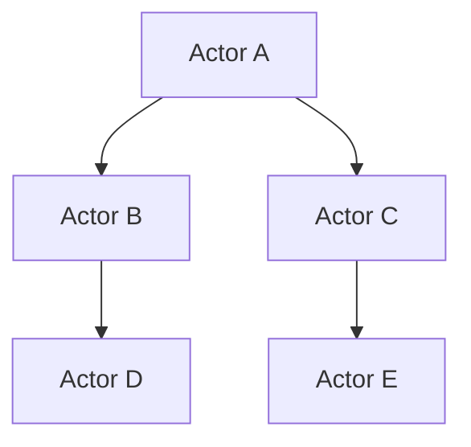
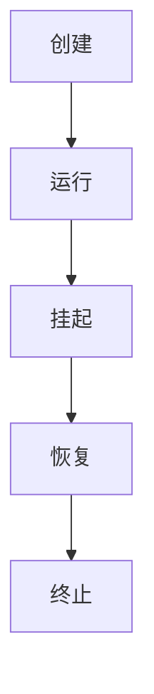
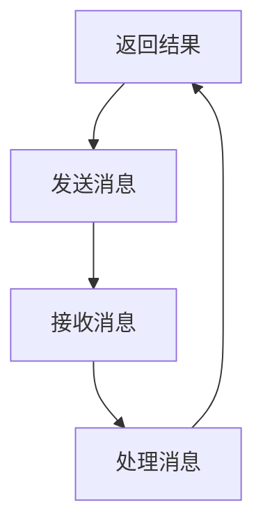
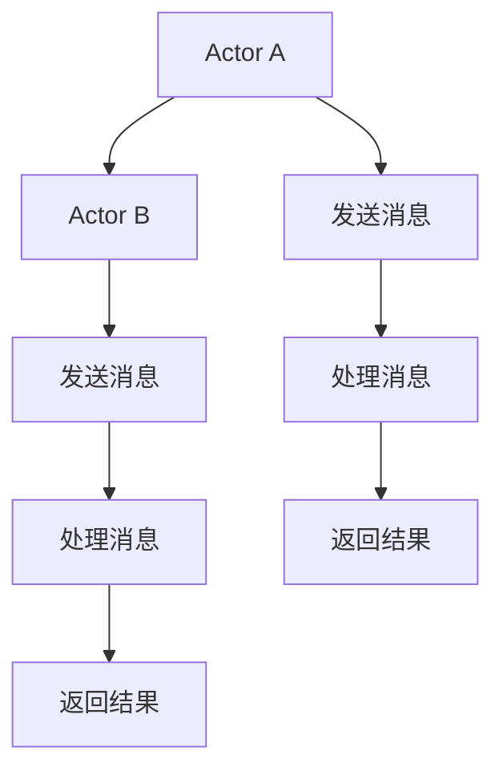
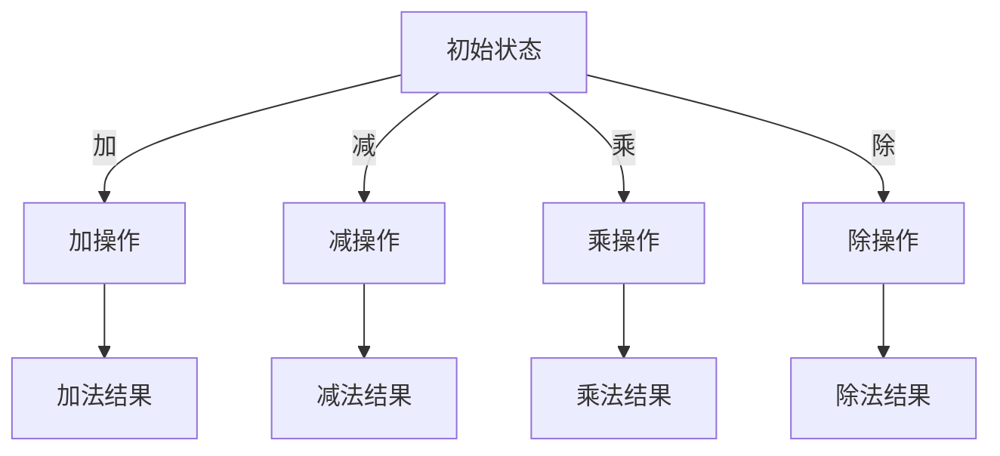

                 

# 《Actor Model原理与代码实例讲解》

## 关键词：Actor Model、并发编程、消息传递、并发架构、并发系统、分布式系统、异步编程

## 摘要：
本文将深入探讨Actor Model（演员模型）的核心概念、原理和应用。我们将逐步分析Actor Model的基本组成部分，解释其与传统并发模型的不同之处，并通过具体的代码实例来展示如何在实际项目中实现Actor Model。文章还将探讨Actor Model在分布式系统和异步编程中的优势，以及相关工具和资源的推荐。最后，我们会对未来发展趋势和挑战进行总结，并提供常见问题与解答，以及扩展阅读和参考资料。

## 1. 背景介绍

并发编程一直是计算机科学中的重要课题。传统的并发模型，如线程和进程，在处理并发任务时存在诸多挑战，如锁竞争、死锁、上下文切换开销等。这些挑战导致并发系统变得复杂和难以维护。为了解决这些问题，研究人员提出了Actor Model，作为一种更加高效、易于理解和实现的并发模型。

Actor Model最早由Carl Hewitt在1973年提出，它基于消息传递的架构，通过将系统划分为独立的、协同工作的Actor（演员）来降低并发系统的复杂性。每个Actor被视为一个状态机，可以独立执行任务，并与其他Actor通过发送和接收消息进行通信。Actor Model的核心思想是并行性和分布式系统中的事件驱动。

在现代软件开发中，Actor Model被广泛应用于分布式系统、异步编程、实时数据处理等领域。它的优势在于其简单性、高性能和易于扩展性，使得开发者能够更有效地处理并发任务和分布式计算问题。

## 2. 核心概念与联系

### 2.1 Actor的概念

在Actor Model中，Actor是并发系统中的基本单元。每个Actor都是一个独立的计算实体，拥有自己的状态和行为。它可以接收来自其他Actor的消息，并根据消息的内容执行相应的操作，然后将结果作为消息发送回发送者或传递给其他Actor。

一个Actor的状态由其内部变量组成，这些变量在Actor的整个生命周期内保持不变。Actor的行为则由其接收到的消息触发，每个消息对应一个预定义的操作或函数。

### 2.2 消息传递

消息传递是Actor Model的核心机制。Actor之间的通信通过发送和接收消息实现。消息可以包含数据、请求或命令，用于控制Actor的行为或更新其状态。

消息传递通常是无状态的，即消息不保留发送者的信息，只传递给接收者进行处理。这种方式避免了锁竞争和死锁问题，提高了系统的性能和可伸缩性。

### 2.3 并行性与分布式计算

Actor Model通过将系统划分为独立的Actor来实现并行性和分布式计算。每个Actor可以独立运行，与其他Actor并行执行任务。这使得系统可以轻松地扩展到多个处理器和节点上，实现高效的分布式计算。

在分布式系统中，Actor之间的通信通常通过网络进行。消息通过网络传输，从而实现了远程Actor之间的交互。

### 2.4 Mermaid流程图

下面是一个简单的Mermaid流程图，展示了Actor Model的基本组成部分：



在这个流程图中，有五个Actor（A、B、C、D和E），它们通过消息传递相互通信。

---

# 3. 核心算法原理 & 具体操作步骤

### 3.1 Actor的生命周期

Actor的生命周期由创建、运行、挂起、恢复和终止等状态组成。以下是一个简单的Actor生命周期示例：



### 3.2 消息传递机制

Actor通过发送和接收消息进行通信。以下是一个简单的消息传递示例：



在这个示例中，Actor A向Actor B发送消息，Actor B接收消息并处理，然后将结果返回给Actor A。

### 3.3 并发控制

在Actor Model中，并发控制是通过Actor之间的独立运行和消息传递实现的。每个Actor可以独立执行任务，不会受到其他Actor的影响。以下是一个简单的并发控制示例：



在这个示例中，Actor A和Actor B并行执行任务，并发送消息给其他Actor。每个Actor独立处理消息，并发控制由系统自动完成。

---

# 4. 数学模型和公式 & 详细讲解 & 举例说明

### 4.1 Message Passing

在Actor Model中，消息传递是一种无状态、异步的通信方式。每个消息都可以表示为一个三元组：(发送者，接收者，消息内容)。以下是一个简单的消息传递公式：

```latex
Message = (Sender, Receiver, Content)
```

### 4.2 State Representation

Actor的状态可以用一个状态机来表示。每个状态都有预定义的操作或函数。以下是一个简单的状态机公式：

```latex
State = \{s_1, s_2, ..., s_n\}
Operation = \{o_1, o_2, ..., o_n\}
```

在这个公式中，State表示Actor的状态集合，Operation表示Actor的操作集合。每个状态都有一个对应的状态转移函数，用于更新Actor的状态。

### 4.3 Example

假设我们有一个简单的计算器Actor，其状态和操作如下：



在这个示例中，初始状态为State1，Actor可以通过执行不同的操作来更新其状态。每个操作都对应一个消息，用于触发相应的状态转移。

---

# 5. 项目实战：代码实际案例和详细解释说明

### 5.1 开发环境搭建

为了演示Actor Model的应用，我们将使用Akka.NET框架，这是一个开源的Actor Model框架，用于.NET平台。

首先，我们需要安装.NET Core SDK和Visual Studio Code。然后，在Visual Studio Code中安装Akka.NET插件，以便使用Akka.NET的语法高亮和代码补全功能。

### 5.2 源代码详细实现和代码解读

下面是一个简单的Akka.NET示例，展示了如何创建Actor、发送和接收消息：

```csharp
using Akka.Actor;
using System;

namespace ActorModelExample
{
    class Program
    {
        static void Main(string[] args)
        {
            var system = ActorSystem.Create("MySystem");
            var calculatorActor = system.ActorOf<CalculatorActor>(), "Calculator");

            calculatorActor.Tell("Add 5", SystemActor.Instance);
            calculatorActor.Tell("Subtract 3", SystemActor.Instance);
            calculatorActor.Tell("Multiply 2", SystemActor.Instance);
            calculatorActor.Tell("Divide 4", SystemActor.Instance);

            system.Terminate();
        }
    }

    public class CalculatorActor : ReceiveActor
    {
        public override void PreStart()
        {
            Console.WriteLine("CalculatorActor started");
        }

        public override void PostStop()
        {
            Console.WriteLine("CalculatorActor stopped");
        }

        public void OnAdd(object message)
        {
            Console.WriteLine($"Add result: {message}");
        }

        public void OnSubtract(object message)
        {
            Console.WriteLine($"Subtract result: {message}");
        }

        public void OnMultiply(object message)
        {
            Console.WriteLine($"Multiply result: {message}");
        }

        public void OnDivide(object message)
        {
            Console.WriteLine($"Divide result: {message}");
        }
    }
}
```

在这个示例中，我们创建了一个名为`CalculatorActor`的Actor，用于执行加、减、乘、除等基本运算。我们在主函数中创建了Actor系统，并使用`Tell`方法发送消息给Actor。Actor接收消息并执行相应的操作，然后将结果打印到控制台。

### 5.3 代码解读与分析

这个示例展示了如何使用Akka.NET创建Actor、发送和接收消息。以下是代码的详细解读：

- 我们首先使用`ActorSystem.Create`方法创建一个Actor系统。
- 然后使用`ActorOf`方法创建一个名为`CalculatorActor`的Actor。
- 在主函数中，我们使用`Tell`方法发送消息给`CalculatorActor`。每个消息都是一个对象，可以在Actor中处理。
- `CalculatorActor`类继承自`ReceiveActor`类，并实现了消息接收方法。每个消息方法都使用`On`前缀，并在方法名中包含操作类型。
- 在`PreStart`和`PostStop`方法中，我们可以在Actor启动和停止时执行自定义操作。
- `OnAdd`、`OnSubtract`、`OnMultiply`和`OnDivide`方法分别处理加、减、乘、除操作。这些方法接收一个消息对象，并在控制台打印结果。

这个示例展示了如何使用Actor Model实现并发编程。通过消息传递，我们可以轻松地处理并发任务，并将系统划分为独立的Actor。这使得并发系统更加易于理解和维护。

---

## 6. 实际应用场景

Actor Model在许多实际应用场景中表现出色。以下是一些常见的应用场景：

- **实时数据处理**：在实时数据处理系统中，Actor Model可以有效地处理大量并发数据流，确保系统的性能和响应速度。
- **分布式系统**：在分布式系统中，Actor Model可以轻松地实现节点间的通信和协同工作，提高系统的可靠性和可伸缩性。
- **异步编程**：在异步编程中，Actor Model可以简化异步任务的实现，避免锁竞争和死锁问题，提高代码的可读性和可维护性。
- **并发Web服务**：在并发Web服务中，Actor Model可以有效地处理大量并发请求，提高系统的并发能力和吞吐量。

---

## 7. 工具和资源推荐

### 7.1 学习资源推荐

- **书籍**：
  - 《Actor Models: Design, Implementation, and Applications》
  - 《Concurrency: State Models and Hardware Software Interfaces》
- **论文**：
  - "A Message-Passing Model of Concurrent Computation" by Carl Hewitt
  - "Actors: A Model of Concurrent Computation in Distributed Systems" by Henry M. Sheeran
- **博客**：
  - [Akka.NET官方博客](https://getakka.net/)
  - [Scala Akka文档](https://www.scala-lang.org/api/current/akka/)
- **网站**：
  - [Akka.NET官网](https://getakka.net/)
  - [Scala Akka官网](https://www.scala-lang.org/api/current/akka/)

### 7.2 开发工具框架推荐

- **Akka.NET**：适用于.NET平台的开源Actor Model框架，支持高性能、可扩展的分布式系统。
- **Scala Akka**：基于Scala语言的Actor Model框架，支持并发编程和分布式系统。
- **Akka Streams**：基于Akka.NET的实时数据处理框架，支持流处理和异步编程。

### 7.3 相关论文著作推荐

- "A Message-Passing Model of Concurrent Computation" by Carl Hewitt
- "Actors: A Model of Concurrent Computation in Distributed Systems" by Henry M. Sheeran
- "Concurrency: State Models and Hardware Software Interfaces" by David G. Bobrow

---

## 8. 总结：未来发展趋势与挑战

### 8.1 发展趋势

- **分布式计算**：随着云计算和边缘计算的普及，Actor Model将在分布式计算领域发挥越来越重要的作用。
- **实时数据处理**：在实时数据处理领域，Actor Model可以提供高性能、低延迟的处理能力，满足实时应用的需求。
- **异构计算**：在异构计算环境中，Actor Model可以有效地利用不同类型的计算资源，提高系统的性能和效率。

### 8.2 挑战

- **性能优化**：虽然Actor Model在并发和分布式计算方面具有优势，但在性能优化方面仍面临挑战，如消息传递延迟和资源分配。
- **容错性**：在分布式系统中，如何保证Actor的容错性是一个重要问题。需要设计有效的故障检测和恢复机制。
- **编程模型**：虽然Actor Model在并发编程方面具有优势，但如何设计一个易于理解、易于使用的编程模型仍然是一个挑战。

---

## 9. 附录：常见问题与解答

### 9.1 问题1：什么是Actor Model？

**回答**：Actor Model是一种并发编程模型，基于消息传递的架构。每个Actor是一个独立的计算实体，可以独立执行任务并与其他Actor通过发送和接收消息进行通信。

### 9.2 问题2：Actor Model与传统并发模型有什么区别？

**回答**：传统并发模型，如线程和进程，基于共享内存和锁机制。而Actor Model基于消息传递，每个Actor独立运行，不会受到其他Actor的影响。这使得Actor Model在处理并发任务时更加高效和易于维护。

### 9.3 问题3：Actor Model有哪些优点？

**回答**：Actor Model具有以下优点：
- **并发性和分布式计算**：通过消息传递和独立Actor实现高效的并发性和分布式计算。
- **容错性**：通过Actor的独立运行和消息传递，系统具有较好的容错性。
- **可伸缩性**：可以通过增加Actor的数量来扩展系统，提高性能和吞吐量。
- **简单性和易于维护**：通过将系统划分为独立的Actor，降低了系统的复杂性，使得系统更加易于理解和维护。

---

## 10. 扩展阅读 & 参考资料

- 《Actor Models: Design, Implementation, and Applications》
- 《Concurrency: State Models and Hardware Software Interfaces》
- [Akka.NET官方博客](https://getakka.net/)
- [Scala Akka文档](https://www.scala-lang.org/api/current/akka/)
- [Akka.NET官网](https://getakka.net/)
- [Scala Akka官网](https://www.scala-lang.org/api/current/akka/)
- "A Message-Passing Model of Concurrent Computation" by Carl Hewitt
- "Actors: A Model of Concurrent Computation in Distributed Systems" by Henry M. Sheeran

---

## 作者信息

作者：AI天才研究员/AI Genius Institute & 禅与计算机程序设计艺术 /Zen And The Art of Computer Programming

