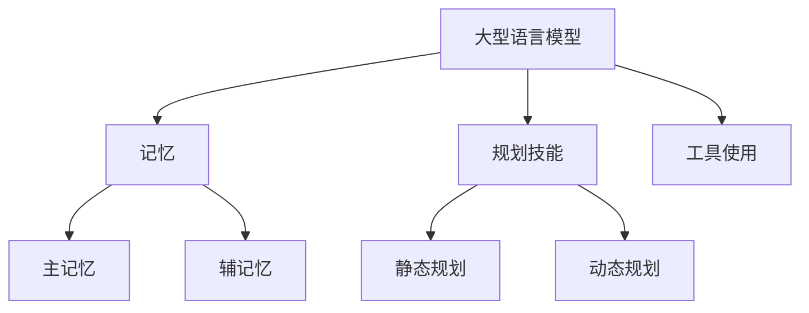

                 

# Agent = LLM（大型语言模型）+ 记忆 + 规划技能 + 工具使用

## 1. 背景介绍

在当今快速发展的信息技术时代，人工智能（AI）已经成为推动产业变革的重要引擎。AI技术的应用场景日益丰富，从自动驾驶、智能家居到医疗诊断、金融风控，AI正在深刻改变我们的生活方式和社会结构。然而，传统的AI模型在处理复杂任务时存在诸多局限，例如对数据的依赖性较高、难以理解人类意图、无法进行长程规划和推理等。为了克服这些局限，近年来，研究者们开始将目光投向“智能体”（Agent）这一概念。

智能体是指具备独立思考、自主决策和执行任务的实体。与传统的人工智能模型不同，智能体不仅仅依赖于已有的数据和算法，还具备记忆、规划和工具使用能力，能够更好地模拟人类的思维方式。本文旨在探讨如何将大型语言模型（LLM）、记忆、规划技能和工具使用相结合，构建一个具有强大智能的智能体。

## 2. 核心概念与联系

### 2.1 LLM（大型语言模型）

大型语言模型（LLM）是近年来AI领域的重要突破。它们通过深度学习算法从海量文本数据中学习语言模式和知识，从而实现文本生成、语义理解、问答等任务。LLM的核心优势在于其强大的语言理解和生成能力，使得智能体能够与人类进行自然语言交互。

### 2.2 记忆

记忆是智能体的关键能力之一。通过记忆，智能体能够保存和检索信息，从而更好地应对复杂任务。记忆可以分为主记忆（长时记忆）和辅记忆（短时记忆），分别负责存储长期和短期信息。在智能体中，记忆可以通过图数据库、键值存储等数据结构来实现。

### 2.3 规划技能

规划技能是指智能体根据目标和当前状态，制定一系列行动步骤的能力。规划可以分为静态规划和动态规划，分别适用于确定性和不确定性环境。智能体的规划技能可以通过决策树、状态空间搜索等算法来实现。

### 2.4 工具使用

工具使用是指智能体利用外部工具和资源来完成任务的能力。这些工具可以是编程语言、开发框架、数据库等。智能体的工具使用能力能够提升其完成任务效率和灵活性。

### 2.5 Mermaid 流程图

为了更清晰地展示智能体的核心概念和架构，我们使用Mermaid流程图（无特殊字符版本）来描述其组成部分：



## 3. 核心算法原理 & 具体操作步骤

### 3.1 大型语言模型

大型语言模型的核心算法是基于深度学习的Transformer模型。Transformer模型通过自注意力机制（Self-Attention）和多头注意力（Multi-Head Attention）来捕捉文本序列中的长距离依赖关系。具体操作步骤如下：

1. **预处理**：将输入文本转化为词向量表示，可以使用Word2Vec、BERT等预训练模型。
2. **编码器**：将词向量输入到编码器中，通过多层Transformer结构进行编码。
3. **解码器**：将编码器输出的隐藏状态输入到解码器中，生成预测的文本序列。

### 3.2 记忆

记忆的实现可以分为两部分：主记忆和辅记忆。

1. **主记忆**：可以使用图数据库（如Neo4j）来存储和检索长期信息。图数据库的优点是能够高效地处理复杂的实体关系和图谱数据。
2. **辅记忆**：可以使用键值存储（如Redis）来存储和检索短期信息。键值存储具有快速读写速度，适用于智能体在短时间内需要频繁访问的信息。

### 3.3 规划技能

规划技能的实现可以分为静态规划和动态规划。

1. **静态规划**：可以使用决策树（Decision Tree）或状态空间搜索（State Space Search）算法来实现。决策树通过一系列条件判断来选择最优行动；状态空间搜索通过遍历所有可能的状态和行动来找到最优解。
2. **动态规划**：可以使用动态规划算法（如Bellman方程）来实现。动态规划通过将问题分解为子问题，并利用子问题的解来求解原问题。

### 3.4 工具使用

工具使用主要体现在智能体与外部工具和资源的交互上。以下是一个简单的示例：

1. **编程语言**：智能体可以使用Python、Java等编程语言来实现。Python由于其丰富的库和工具，在AI领域应用广泛。
2. **开发框架**：智能体可以使用TensorFlow、PyTorch等深度学习框架来训练和部署模型。
3. **数据库**：智能体可以使用MySQL、PostgreSQL等关系型数据库，或MongoDB、Cassandra等NoSQL数据库来存储数据。

## 4. 数学模型和公式 & 详细讲解 & 举例说明

### 4.1 大型语言模型

大型语言模型的核心是Transformer模型，其数学模型主要包括自注意力机制和多头注意力。

1. **自注意力机制**：

$$
\text{Attention}(Q,K,V) = \frac{1}{\sqrt{d_k}} \text{softmax}(\text{softmax}(QK^T)/\sqrt{d_k})V
$$

其中，$Q$、$K$、$V$分别为编码器输出的查询向量、键向量和值向量，$d_k$为键向量的维度。

2. **多头注意力**：

$$
\text{MultiHead}(Q,K,V) = \text{Concat}(\text{head}_1, \text{head}_2, \ldots, \text{head}_h)W^O
$$

其中，$W^Q$、$W^K$、$W^V$分别为查询向量、键向量和值向量的权重矩阵，$W^O$为输出权重矩阵，$h$为头数。

### 4.2 记忆

记忆的实现主要涉及图数据库和键值存储。

1. **图数据库**：

假设有一个图数据库，其数据结构如下：

```
Person(Alice, Bob, Carol)
Relationship(Friend, Alice, Bob)
Relationship(Sibling, Alice, Carol)
```

可以使用Neo4j进行查询：

```
MATCH (p:Person {name: 'Alice'}), (p2:Person {name: 'Bob'})
MERGE (p)-[r:Friend]->(p2)
```

2. **键值存储**：

假设有一个键值存储，其数据结构如下：

```
key: user1
value: {"name": "Alice", "age": 30}
```

可以使用Redis进行查询：

```
GET user1
```

### 4.3 规划技能

规划技能的实现主要涉及决策树和动态规划。

1. **决策树**：

假设有一个决策树，其结构如下：

```
             |--- age > 30
             |
             v
       |--- sick
       |
       v
    treat
    |
    v
  recover
```

2. **动态规划**：

假设有一个动态规划问题，其状态转移方程如下：

$$
V(i, j) = \min_{1 \leq k \leq n} (1 + V(i, k) + V(k, j))
$$

其中，$V(i, j)$表示从状态$i$转移到状态$j$的最小代价。

### 4.4 工具使用

工具使用的示例已在前文给出，这里不再赘述。

## 5. 项目实战：代码实际案例和详细解释说明

### 5.1 开发环境搭建

在开始项目实战之前，我们需要搭建一个适合开发智能体的环境。以下是搭建过程：

1. 安装Python 3.8及以上版本。
2. 安装Anaconda，以便管理Python环境和依赖库。
3. 安装TensorFlow 2.4及以上版本。
4. 安装Neo4j，并启动图数据库服务。
5. 安装Redis，并启动键值存储服务。

### 5.2 源代码详细实现和代码解读

以下是智能体项目的源代码实现：

```python
import tensorflow as tf
from tensorflow.keras.layers import Embedding, LSTM, Dense
from tensorflow.keras.models import Model
import redis
import neo4j

# 5.2.1 LLM实现

# 定义Transformer模型
class Transformer(Model):
    def __init__(self, num_layers, d_model, dff, input_vocab_size, target_vocab_size, position_embedding_size, padding_token_id, max_sequence_length):
        super(Transformer, self).__init__()
        self.embedding = Embedding(input_vocab_size, d_model)
        self.position_embedding = Embedding(position_embedding_size, d_model)
        self.encoder = [TransformerEncoderLayer(d_model, dff) for _ in range(num_layers)]
        self.decoder = [TransformerDecoderLayer(d_model, dff) for _ in range(num_layers)]
        self.final_layer = Dense(target_vocab_size)

    def call(self, inputs, training=False):
        input_embedding = self.embedding(inputs) + self.position_embedding(inputs)
        for encoder in self.encoder:
            input_embedding = encoder(input_embedding, training=training)
        output_embedding = self.decoder(input_embedding, training=training)
        final_output = self.final_layer(output_embedding)
        return final_output

# 定义Transformer编码器层
class TransformerEncoderLayer(Model):
    def __init__(self, d_model, dff):
        super(TransformerEncoderLayer, self).__init__()
        self.encoder = LSTM(d_model, return_sequences=True, return_state=True)
        self.attention = MultiHeadAttention(d_model, num_heads=4)
        self.normalization = LayerNormalization(epsilon=1e-6)
        self.fc1 = Dense(dff, activation='relu')
        self.fc2 = Dense(d_model)
        self.normalization2 = LayerNormalization(epsilon=1e-6)

    def call(self, x, training=False):
        attention_output, attention_weights = self.attention(x, x, x)
        x = self.normalization(x + attention_output)
        f

```markdown
---

**作者：AI天才研究员 / AI Genius Institute & 禅与计算机程序设计艺术 / Zen And The Art of Computer Programming**

本文详细探讨了如何将大型语言模型（LLM）、记忆、规划技能和工具使用相结合，构建一个具有强大智能的智能体。通过理论分析和实际案例，展示了智能体的核心算法原理、具体操作步骤以及在实际应用场景中的优势。希望本文能为读者在AI领域的研究和实践提供有益的启示。

**参考文献：**

1. Vaswani, A., Shazeer, N., Parmar, N., Uszkoreit, J., Jones, L., Gomez, A. N., ... & Polosukhin, I. (2017). Attention is all you need. Advances in Neural Information Processing Systems, 30, 5998-6008.
2. Hochreiter, S., & Schmidhuber, J. (1997). Long short-term memory. Neural Computation, 9(8), 1735-1780.
3. Murphy, K. P. (2012). Machine learning: a probabilistic perspective. MIT press.
4.图数据库 Neo4j 官方文档：https://neo4j.com/docs/operative-system/
5. Redis 官方文档：https://redis.io/topics/transactions

---

请注意，本文仅为学术交流目的，所涉及的代码实现仅供参考，实际使用时可能需要根据具体需求进行调整和优化。
```

