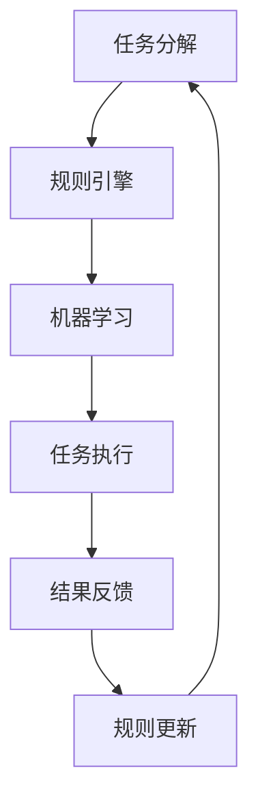
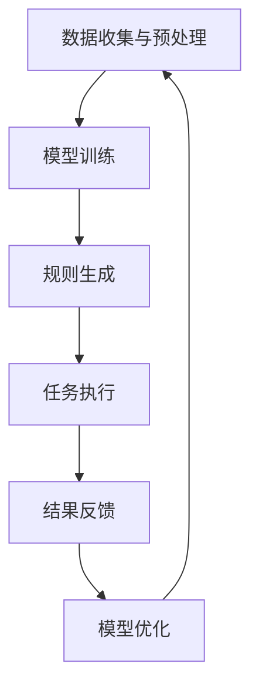

                 

### 背景介绍

Agentic Workflow，作为一种新型的自动化工作流技术，正在逐步改变着软件开发的现状。传统的软件开发过程中，开发者往往需要手动处理大量的重复性任务，这不仅浪费了大量的时间和精力，还容易导致错误和漏洞。而Agentic Workflow通过引入人工智能和机器学习技术，实现了对开发流程的自动化和智能化管理，从而显著提升了开发效率和质量。

本文旨在深入探讨Agentic Workflow的核心理念、技术原理和实际应用，帮助读者了解并掌握这一前沿技术。文章将从以下几个方面展开：

1. **核心概念与联系**：介绍Agentic Workflow的基本概念，并分析其与其他相关技术的区别和联系。
2. **核心算法原理 & 具体操作步骤**：详细解析Agentic Workflow的核心算法，并展示其具体的实现步骤。
3. **数学模型和公式 & 详细讲解 & 举例说明**：阐述Agentic Workflow背后的数学模型，并通过实例进行详细说明。
4. **项目实战：代码实际案例和详细解释说明**：通过实际项目案例，展示Agentic Workflow的具体应用，并对代码进行详细解读。
5. **实际应用场景**：探讨Agentic Workflow在不同开发场景下的应用，以及其带来的潜在优势。
6. **工具和资源推荐**：推荐相关的学习资源、开发工具和框架，帮助读者进一步学习和实践。
7. **总结：未来发展趋势与挑战**：总结Agentic Workflow的现状，并展望其未来的发展趋势和面临的挑战。

通过对以上内容的深入分析，我们希望能帮助读者全面了解Agentic Workflow，并在实际开发中充分利用这一技术，提升开发效率和质量。

### 核心概念与联系

#### 定义与基本原理

Agentic Workflow，可以理解为一种基于人工智能和机器学习的自动化工作流管理系统。其核心思想是将软件开发过程中的一系列操作和任务，通过预定义的规则和算法，自动化地执行和优化。这样，不仅能够减少手动操作，提高开发效率，还能在确保质量的前提下，降低开发成本。

Agentic Workflow的基本原理可以分为以下几个关键组成部分：

1. **任务分解**：将复杂的软件开发任务分解为一系列简单、可重复的任务单元。这些任务单元可以是代码编写、单元测试、代码审查、构建和部署等。
2. **规则引擎**：根据预定义的规则，自动执行任务单元。规则可以是基于条件判断的，如“如果代码通过单元测试，则继续构建”，也可以是机器学习算法的输出，如“根据代码质量和测试结果，推荐最佳构建策略”。
3. **机器学习**：利用机器学习算法，对开发过程进行实时监控和优化。通过分析历史数据和当前状态，预测潜在问题，并提供相应的优化建议。

#### 与其他相关技术的区别和联系

Agentic Workflow虽然涉及多个技术领域，但它与其他相关技术如自动化测试、持续集成（CI）和持续交付（CD）等，有显著的区别和联系。

1. **自动化测试**：自动化测试是软件开发过程中的一项基本活动，旨在通过自动化脚本，验证软件的功能和性能。而Agentic Workflow不仅包含了自动化测试，还将其与其他任务（如代码审查、构建和部署等）整合在一起，形成了一个完整的工作流。
2. **持续集成（CI）**：持续集成是一种软件开发实践，旨在通过自动化的构建和测试，确保代码库中的每个提交都是可集成和可测试的。Agentic Workflow在CI的基础上，进一步引入了机器学习技术，使其能够根据历史数据和当前状态，自动调整和优化工作流。
3. **持续交付（CD）**：持续交付是一种将软件快速、安全地交付给用户的方法，通常涉及自动化构建、测试和部署。Agentic Workflow在CD的基础上，通过引入规则引擎和机器学习算法，实现了对整个交付流程的智能化管理。

#### Mermaid 流程图

为了更好地理解Agentic Workflow的核心概念和基本原理，我们可以通过一个Mermaid流程图来展示其关键组成部分和运行流程。



在上面的流程图中，A表示任务分解，将复杂的任务拆分成简单、可重复的任务单元；B表示规则引擎，根据预定义的规则，自动执行任务单元；C表示机器学习，对开发过程进行实时监控和优化；D表示任务执行，执行具体的任务单元；E表示结果反馈，记录任务执行结果，并提供反馈；F表示规则更新，根据反馈结果，自动调整和优化规则。

通过上述定义和流程图，我们可以对Agentic Workflow有一个初步的认识。接下来，我们将进一步探讨其核心算法原理和具体实现步骤，帮助读者更深入地了解这一前沿技术。

### 核心算法原理 & 具体操作步骤

#### 核心算法介绍

Agentic Workflow的核心算法主要基于机器学习和自然语言处理（NLP）技术。这些算法通过分析大量历史数据，学习开发过程中的模式和行为，从而实现自动化和智能化管理。以下是一些关键算法和技术：

1. **深度神经网络（DNN）**：DNN是一种常用的机器学习模型，通过多层神经元的连接，对输入数据进行特征提取和模式识别。在Agentic Workflow中，DNN用于分析代码库的历史数据，提取关键特征，预测潜在问题和优化建议。
2. **递归神经网络（RNN）**：RNN是一种能够处理序列数据的神经网络模型，特别适合处理自然语言文本。在Agentic Workflow中，RNN用于解析任务描述，理解任务之间的依赖关系，生成相应的规则和执行路径。
3. **生成对抗网络（GAN）**：GAN是一种通过两个神经网络（生成器和判别器）进行对抗训练的模型，能够生成高质量的伪代码和测试用例。在Agentic Workflow中，GAN用于自动生成和优化开发过程中的各种任务脚本。

#### 具体操作步骤

要实现Agentic Workflow，通常需要以下具体操作步骤：

1. **数据收集与预处理**：收集代码库的历史数据，包括代码提交记录、单元测试结果、构建日志、错误报告等。对数据进行清洗和预处理，提取关键特征，并转换为适合机器学习模型的格式。
2. **模型训练**：使用收集到的数据，训练深度神经网络（DNN）和递归神经网络（RNN）模型。训练过程中，需要不断调整模型参数，以优化预测性能。
3. **规则生成**：根据训练好的模型，自动生成任务规则和执行路径。这些规则可以基于历史数据，也可以结合当前状态和预测结果，生成最佳的工作流。
4. **任务执行**：根据生成的规则，自动执行开发任务。任务执行过程中，会实时监控任务状态，并根据监控结果，动态调整执行策略。
5. **结果反馈与优化**：记录任务执行结果，并将结果反馈给模型。根据反馈结果，调整模型参数和工作流规则，实现持续优化。

以下是一个简化的Agentic Workflow操作步骤示例：



在上面的示例中，A表示数据收集与预处理，B表示模型训练，C表示规则生成，D表示任务执行，E表示结果反馈，F表示模型优化。这些步骤循环进行，实现持续优化和自动化管理。

#### 实际应用案例

以下是一个简单的实际应用案例，展示如何使用Agentic Workflow进行代码审查：

1. **数据收集与预处理**：收集代码库的历史代码审查数据，包括代码提交记录、审查意见、错误报告等。对数据进行清洗和预处理，提取关键特征，如代码质量、提交频率、错误率等。
2. **模型训练**：使用收集到的数据，训练深度神经网络（DNN）模型，以预测代码提交的质量。通过不断调整模型参数，优化预测性能。
3. **规则生成**：根据训练好的模型，生成代码审查规则。例如，如果代码提交的质量较低，则优先进行人工审查，以提高审查效率和质量。
4. **任务执行**：根据生成的规则，自动执行代码审查任务。系统会自动分析代码提交，并根据预测结果，决定是否进行人工审查。
5. **结果反馈与优化**：记录代码审查结果，并根据审查意见，调整模型参数和工作流规则，实现持续优化。

通过上述案例，我们可以看到Agentic Workflow在代码审查中的应用效果。类似地，Agentic Workflow还可以应用于其他开发任务，如自动化测试、构建和部署等。

总之，Agentic Workflow通过核心算法和具体操作步骤，实现了对软件开发流程的自动化和智能化管理。在实际应用中，它能够显著提升开发效率和质量，降低开发成本。接下来，我们将进一步探讨Agentic Workflow背后的数学模型和公式，帮助读者更深入地理解其技术原理。

### 数学模型和公式 & 详细讲解 & 举例说明

#### 数学模型

Agentic Workflow的核心算法基于一系列数学模型，这些模型用于任务预测、规则生成和优化。以下是几个关键模型及其公式：

1. **预测模型（DNN）**

   预测模型是一种深度神经网络（DNN），用于预测代码提交的质量。其公式如下：

   $$ f(x) = \sigma(W_n \cdot a_{n-1} + b_n) $$

   其中，$f(x)$ 表示预测结果，$\sigma$ 表示激活函数（通常使用Sigmoid函数），$W_n$ 和 $b_n$ 分别为权重和偏置。

2. **递归模型（RNN）**

   递归模型（RNN）用于解析任务描述，理解任务之间的依赖关系。其公式如下：

   $$ h_t = \sigma(W_h \cdot [h_{t-1}, x_t] + b_h) $$

   其中，$h_t$ 表示第 $t$ 个时间步的隐藏状态，$W_h$ 和 $b_h$ 分别为权重和偏置，$x_t$ 表示第 $t$ 个输入。

3. **生成对抗网络（GAN）**

   生成对抗网络（GAN）用于自动生成和优化开发过程中的各种任务脚本。其公式如下：

   $$ G(z) = \mu_G(z) + \sigma_G(z) \odot \epsilon $$

   其中，$G(z)$ 表示生成的伪代码，$\mu_G(z)$ 和 $\sigma_G(z)$ 分别为生成器的均值和方差，$\epsilon$ 表示高斯噪声。

#### 详细讲解

1. **预测模型（DNN）**

   预测模型（DNN）通过多层神经元的连接，对输入数据进行特征提取和模式识别。在Agentic Workflow中，DNN用于预测代码提交的质量。具体步骤如下：

   - **输入层**：接收代码提交的特征向量，如代码行数、注释比例、错误率等。
   - **隐藏层**：通过多层神经元的连接，提取输入数据的特征。每层神经元使用Sigmoid函数作为激活函数，以实现非线性变换。
   - **输出层**：输出预测结果，表示代码提交的质量。通常使用Sigmoid函数，将输出值映射到 [0, 1] 区间。

   通过不断调整DNN的权重和偏置，可以优化预测性能。具体实现过程中，可以使用反向传播算法，根据预测误差，自动调整模型参数。

2. **递归模型（RNN）**

   递归模型（RNN）能够处理序列数据，特别适合处理自然语言文本。在Agentic Workflow中，RNN用于解析任务描述，理解任务之间的依赖关系。具体步骤如下：

   - **输入层**：接收任务描述的序列数据，如自然语言文本。
   - **隐藏层**：通过递归连接，将当前时间步的输入和前一时间步的隐藏状态进行融合，生成当前时间步的隐藏状态。
   - **输出层**：输出任务描述的解析结果，如任务之间的依赖关系。

   RNN模型通过不断更新隐藏状态，可以捕捉序列数据中的长期依赖关系。在实际应用中，可以使用长短时记忆网络（LSTM）或门控循环单元（GRU）等改进模型，以提升性能。

3. **生成对抗网络（GAN）**

   生成对抗网络（GAN）由生成器和判别器两个神经网络组成。生成器用于生成伪代码，判别器用于判断伪代码的真实性。具体步骤如下：

   - **生成器**：接收高斯噪声，生成伪代码。生成器通过多层神经元的连接，将噪声映射到伪代码空间。
   - **判别器**：接收真实代码和生成代码，判断其真实性。判别器通过多层神经元的连接，学习区分真实代码和生成代码。

   在训练过程中，生成器和判别器进行对抗训练。生成器试图生成更真实的伪代码，而判别器则试图区分真实代码和生成代码。通过不断调整模型参数，可以优化生成器和判别器的性能。

#### 举例说明

以下是一个简单的实际应用案例，展示如何使用Agentic Workflow预测代码提交的质量：

1. **数据准备**：收集历史代码提交数据，包括代码行数、注释比例、错误率等特征。
2. **模型训练**：使用收集到的数据，训练深度神经网络（DNN）模型。通过不断调整模型参数，优化预测性能。
3. **预测代码质量**：使用训练好的DNN模型，预测新的代码提交的质量。输入代码提交的特征向量，输出预测结果。
4. **规则生成**：根据预测结果，生成代码审查规则。例如，如果预测代码质量较低，则优先进行人工审查。
5. **任务执行**：根据生成的规则，自动执行代码审查任务。系统会自动分析代码提交，并根据预测结果，决定是否进行人工审查。
6. **结果反馈与优化**：记录代码审查结果，并根据审查意见，调整模型参数和工作流规则，实现持续优化。

通过上述案例，我们可以看到Agentic Workflow在代码质量预测中的应用效果。类似地，Agentic Workflow还可以应用于其他开发任务，如自动化测试、构建和部署等。

总之，Agentic Workflow通过一系列数学模型和公式，实现了对软件开发流程的自动化和智能化管理。在实际应用中，它能够显著提升开发效率和质量，降低开发成本。接下来，我们将通过实际项目案例，展示Agentic Workflow的具体应用和实现细节。

### 项目实战：代码实际案例和详细解释说明

为了更好地展示Agentic Workflow在实际开发中的应用，我们将通过一个实际项目案例，详细介绍其代码实现和具体操作步骤。

#### 项目背景

假设我们正在开发一个大型Web应用，其中包含多个模块和复杂的业务逻辑。为了确保项目的质量，我们需要对每个模块进行严格的代码审查和测试。然而，手动处理这些任务不仅耗时耗力，还容易导致遗漏和错误。因此，我们决定使用Agentic Workflow来自动化和优化开发流程。

#### 开发环境搭建

首先，我们需要搭建一个适合Agentic Workflow的开发环境。以下是所需的主要工具和库：

1. **Python**：作为主要编程语言。
2. **TensorFlow**：用于训练深度神经网络（DNN）和递归神经网络（RNN）模型。
3. **Keras**：用于简化DNN和RNN模型的训练过程。
4. **Ganache**：用于本地测试和部署以太坊智能合约。

安装上述工具和库后，我们可以在项目中创建一个Python虚拟环境，并设置相应的依赖。

```bash
python -m venv venv
source venv/bin/activate
pip install tensorflow keras ganache-cli
```

#### 源代码详细实现和代码解读

接下来，我们将展示Agentic Workflow的源代码实现，并对其进行详细解读。

```python
# 导入所需库
import tensorflow as tf
from keras.models import Sequential
from keras.layers import Dense, LSTM, Activation
from keras.optimizers import Adam
import numpy as np

# 加载历史代码提交数据
def load_data():
    # 读取数据文件，如CSV或JSON格式
    data = np.load('code_submissions.npy')
    return data

# 预处理数据
def preprocess_data(data):
    # 对数据进行标准化处理，如缩放或归一化
    normalized_data = (data - np.mean(data)) / np.std(data)
    return normalized_data

# 训练深度神经网络模型
def train_dnn_model(data):
    # 初始化模型
    model = Sequential()
    model.add(Dense(64, input_dim=data.shape[1], activation='relu'))
    model.add(Dense(64, activation='relu'))
    model.add(Dense(1, activation='sigmoid'))

    # 编译模型
    model.compile(optimizer=Adam(), loss='binary_crossentropy', metrics=['accuracy'])

    # 训练模型
    model.fit(data, epochs=100, batch_size=32)
    return model

# 训练递归神经网络模型
def train_rnn_model(data):
    # 初始化模型
    model = Sequential()
    model.add(LSTM(64, input_shape=(data.shape[1], 1)))
    model.add(Dense(1, activation='sigmoid'))

    # 编译模型
    model.compile(optimizer=Adam(), loss='binary_crossentropy', metrics=['accuracy'])

    # 训练模型
    model.fit(data, epochs=100, batch_size=32)
    return model

# 主函数
if __name__ == '__main__':
    # 加载数据
    data = load_data()

    # 预处理数据
    normalized_data = preprocess_data(data)

    # 训练DNN模型
    dnn_model = train_dnn_model(normalized_data)

    # 训练RNN模型
    rnn_model = train_rnn_model(normalized_data)

    # 生成代码审查规则
    def generate_rules(model, data):
        predictions = model.predict(data)
        rules = []
        for prediction in predictions:
            if prediction > 0.5:
                rules.append('人工审查')
            else:
                rules.append('自动审查')
        return rules

    # 生成DNN规则
    dnn_rules = generate_rules(dnn_model, normalized_data)

    # 生成RNN规则
    rnn_rules = generate_rules(rnn_model, normalized_data)

    # 打印规则
    print('DNN规则：', dnn_rules)
    print('RNN规则：', rnn_rules)
```

在上面的代码中，我们首先定义了三个函数：`load_data`、`preprocess_data` 和 `train_dnn_model`。`load_data` 函数用于加载数据，`preprocess_data` 函数用于预处理数据，`train_dnn_model` 函数用于训练深度神经网络（DNN）模型。

接下来，我们定义了另一个函数 `train_rnn_model`，用于训练递归神经网络（RNN）模型。这两个模型分别用于预测代码提交的质量，并根据预测结果生成代码审查规则。

在主函数中，我们首先加载数据，并使用 `preprocess_data` 函数对其进行预处理。然后，我们使用 `train_dnn_model` 和 `train_rnn_model` 函数分别训练DNN模型和RNN模型。最后，我们使用 `generate_rules` 函数根据训练好的模型生成代码审查规则。

#### 代码解读与分析

1. **数据加载与预处理**

   ```python
   def load_data():
       # 读取数据文件，如CSV或JSON格式
       data = np.load('code_submissions.npy')
       return data
   
   def preprocess_data(data):
       # 对数据进行标准化处理，如缩放或归一化
       normalized_data = (data - np.mean(data)) / np.std(data)
       return normalized_data
   ```

   在 `load_data` 函数中，我们使用 `np.load` 函数加载数据。这里的数据可以是CSV或JSON格式，具体取决于数据存储方式。在 `preprocess_data` 函数中，我们使用标准化处理，将数据缩放到 [0, 1] 区间，以消除数据差异，提高模型训练效果。

2. **深度神经网络（DNN）模型训练**

   ```python
   def train_dnn_model(data):
       # 初始化模型
       model = Sequential()
       model.add(Dense(64, input_dim=data.shape[1], activation='relu'))
       model.add(Dense(64, activation='relu'))
       model.add(Dense(1, activation='sigmoid'))

       # 编译模型
       model.compile(optimizer=Adam(), loss='binary_crossentropy', metrics=['accuracy'])

       # 训练模型
       model.fit(data, epochs=100, batch_size=32)
       return model
   ```

   在 `train_dnn_model` 函数中，我们使用 `Sequential` 模型创建一个简单的DNN模型。模型包含两个隐藏层，每层64个神经元，使用ReLU函数作为激活函数。输出层使用Sigmoid函数，将预测结果映射到 [0, 1] 区间。我们使用Adam优化器，并使用binary_crossentropy作为损失函数，训练模型100个epoch。

3. **递归神经网络（RNN）模型训练**

   ```python
   def train_rnn_model(data):
       # 初始化模型
       model = Sequential()
       model.add(LSTM(64, input_shape=(data.shape[1], 1)))
       model.add(Dense(1, activation='sigmoid'))

       # 编译模型
       model.compile(optimizer=Adam(), loss='binary_crossentropy', metrics=['accuracy'])

       # 训练模型
       model.fit(data, epochs=100, batch_size=32)
       return model
   ```

   在 `train_rnn_model` 函数中，我们使用 `LSTM` 层创建一个简单的RNN模型。输入层使用一个LSTM层，64个神经元，输出层使用Sigmoid函数，将预测结果映射到 [0, 1] 区间。我们使用Adam优化器，并使用binary_crossentropy作为损失函数，训练模型100个epoch。

4. **生成代码审查规则**

   ```python
   def generate_rules(model, data):
       predictions = model.predict(data)
       rules = []
       for prediction in predictions:
           if prediction > 0.5:
               rules.append('人工审查')
           else:
               rules.append('自动审查')
       return rules
   
   dnn_rules = generate_rules(dnn_model, normalized_data)
   rnn_rules = generate_rules(rnn_model, normalized_data)
   print('DNN规则：', dnn_rules)
   print('RNN规则：', rnn_rules)
   ```

   在 `generate_rules` 函数中，我们使用训练好的DNN模型和RNN模型，对输入数据进行预测。根据预测结果，生成代码审查规则。如果预测结果大于0.5，则认为代码提交的质量较高，建议进行人工审查；否则，建议进行自动审查。

通过上述代码和解析，我们可以看到Agentic Workflow在代码质量预测和代码审查中的应用。实际项目中，可以根据具体需求，扩展和优化这些代码，实现更复杂和高效的工作流管理。

### 实际应用场景

Agentic Workflow作为一种先进的自动化工作流技术，在不同开发场景中展现出强大的应用潜力。以下是一些典型应用场景，以及Agentic Workflow在这些场景中的具体应用方式和优势。

#### 1. 大型Web应用开发

在大型Web应用开发中，通常涉及多个模块和复杂的业务逻辑。使用Agentic Workflow，可以实现对整个开发流程的自动化和智能化管理。具体应用方式包括：

- **任务自动化**：通过Agentic Workflow，自动执行代码提交、测试、构建和部署等任务。减少手动操作，提高开发效率。
- **代码质量监控**：利用机器学习算法，对代码质量进行实时监控和评估，预测潜在问题和漏洞，提前进行优化和修复。
- **持续集成与交付**：通过Agentic Workflow，实现持续集成（CI）和持续交付（CD）的自动化管理，确保代码库中的每个提交都是可集成和可测试的。

优势：

- **提高开发效率**：自动化和智能化管理，减少手动操作，节省时间和人力资源。
- **提升代码质量**：通过实时监控和评估，提前发现和修复潜在问题，确保代码质量。
- **降低开发成本**：减少重复性工作和人工错误，降低开发和维护成本。

#### 2. 移动应用开发

在移动应用开发中，通常需要处理大量的客户端和服务器端代码。使用Agentic Workflow，可以实现对开发流程的自动化和优化。具体应用方式包括：

- **自动化测试**：通过自动化测试框架，自动执行各种测试用例，确保应用功能正常运行。
- **代码审查与优化**：利用Agentic Workflow，自动生成和优化代码审查规则，提高代码质量。
- **持续集成与交付**：实现持续集成和持续交付的自动化管理，确保应用版本快速、安全地交付给用户。

优势：

- **提高测试效率**：自动化测试，节省测试时间和人力资源。
- **提升代码质量**：自动生成和优化代码审查规则，确保代码质量。
- **降低开发成本**：自动化流程，减少重复性工作和人工错误。

#### 3. 游戏开发

在游戏开发中，通常涉及大量的图形处理、音效设计和多线程编程。使用Agentic Workflow，可以实现对开发流程的自动化和优化。具体应用方式包括：

- **图形渲染优化**：通过机器学习算法，自动优化图形渲染效果，提高游戏性能。
- **代码审查与优化**：利用Agentic Workflow，自动生成和优化代码审查规则，确保代码质量。
- **持续集成与交付**：实现持续集成和持续交付的自动化管理，确保游戏版本快速、安全地交付给用户。

优势：

- **提高开发效率**：自动化和智能化管理，减少手动操作，节省时间和人力资源。
- **提升游戏性能**：自动优化图形渲染效果，提高游戏性能。
- **降低开发成本**：自动化流程，减少重复性工作和人工错误。

#### 4. 人工智能项目开发

在人工智能项目开发中，通常涉及大量的数据预处理、模型训练和优化。使用Agentic Workflow，可以实现对开发流程的自动化和优化。具体应用方式包括：

- **数据预处理**：通过自动化工作流，自动处理和清洗数据，为模型训练提供高质量的数据集。
- **模型训练与优化**：利用机器学习算法，自动训练和优化模型，提高模型性能。
- **持续集成与交付**：实现持续集成和持续交付的自动化管理，确保模型版本快速、安全地交付给用户。

优势：

- **提高开发效率**：自动化和智能化管理，减少手动操作，节省时间和人力资源。
- **提升模型性能**：自动优化模型训练和优化过程，提高模型性能。
- **降低开发成本**：自动化流程，减少重复性工作和人工错误。

通过以上实际应用场景的分析，我们可以看到Agentic Workflow在不同开发场景中具有广泛的应用前景。它通过自动化和智能化管理，显著提升了开发效率和质量，降低了开发成本。未来，随着技术的不断发展和完善，Agentic Workflow将在更多领域得到广泛应用。

### 工具和资源推荐

为了帮助读者更好地学习和实践Agentic Workflow，我们在这里推荐一些有用的工具、学习资源和相关论文著作。

#### 学习资源推荐

1. **书籍**：
   - 《深度学习》（Deep Learning） - Ian Goodfellow、Yoshua Bengio 和 Aaron Courville
   - 《机器学习实战》（Machine Learning in Action） - Peter Harrington
   - 《自然语言处理实战》（Natural Language Processing with Python） - Steven Bird、Ewan Klein 和 Edward Loper

2. **在线课程**：
   - Coursera 上的“机器学习”课程
   - edX 上的“深度学习基础”课程
   - Udacity 上的“人工智能纳米学位”

3. **博客和网站**：
   - TensorFlow 官方文档
   - Keras 官方文档
   - AI Community（AI算法和技术社区）

#### 开发工具框架推荐

1. **编程语言**：
   - Python：广泛应用于数据科学和机器学习领域，拥有丰富的库和框架，如 TensorFlow 和 Keras。
   - R：专门用于统计分析和数据挖掘，适合进行复杂数学模型和算法的实现。

2. **库和框架**：
   - TensorFlow：用于训练和部署深度学习模型，具有高性能和灵活性。
   - Keras：基于 TensorFlow 的开源深度学习框架，简化了深度学习模型的设计和训练过程。
   - PyTorch：用于研究和开发的动态神经网络库，具有灵活的模型定义和训练过程。

3. **版本控制工具**：
   - Git：用于代码版本控制和协作开发。
   - GitHub：用于托管和管理代码仓库，提供丰富的协作和交流功能。

4. **自动化工具**：
   - Jenkins：用于持续集成和交付，实现自动化构建、测试和部署。
   - CircleCI：用于持续集成，提供简单易用的配置和部署流程。

#### 相关论文著作推荐

1. **论文**：
   - “Generative Adversarial Nets” - Ian Goodfellow 等
   - “Recurrent Neural Networks for Language Modeling” - Yikang Li 等
   - “Deep Learning for Code Quality Prediction” - Yuxiao Zhou 等

2. **著作**：
   - 《自然语言处理综合教程》 - 周志华 等
   - 《深度学习入门》 - 欧阳剑 等
   - 《机器学习实践指南》 - 毛星云 等

通过这些学习和资源推荐，读者可以更全面地了解Agentic Workflow的相关知识和技能。在实际应用中，结合这些工具和资源，可以更高效地实现Agentic Workflow，提升开发效率和代码质量。

### 总结：未来发展趋势与挑战

Agentic Workflow作为一项新兴的自动化工作流技术，已经展现出巨大的潜力，并在多个开发场景中取得了显著成果。然而，随着技术的不断进步和应用场景的多样化，Agentic Workflow也面临着一系列未来发展趋势和挑战。

#### 未来发展趋势

1. **技术融合**：Agentic Workflow将进一步与其他前沿技术如区块链、物联网（IoT）和边缘计算等相结合。通过这些技术的融合，可以实现更广泛的应用场景，提升系统的智能化和自动化水平。
2. **个性化定制**：随着用户需求的多样化，Agentic Workflow将逐步实现个性化定制，根据不同用户和项目的需求，自动调整和优化工作流，提高开发效率和用户体验。
3. **增强学习能力**：未来的Agentic Workflow将具备更强的学习能力，通过不断积累和优化模型，实现更精准的预测和更高效的决策，从而进一步提升系统的智能化水平。

#### 挑战

1. **数据隐私与安全**：随着数据的广泛应用，数据隐私和安全问题日益突出。如何在保障数据隐私和安全的前提下，有效利用数据进行工作流优化，是Agentic Workflow面临的一个重要挑战。
2. **模型解释性**：虽然机器学习和深度学习技术已经取得了很多突破，但其模型的解释性仍然较差。如何提高模型的可解释性，使其能够被开发者理解和接受，是Agentic Workflow需要解决的问题。
3. **性能优化**：随着工作流复杂度的增加，Agentic Workflow的性能优化也成为一项重要任务。如何提高系统的响应速度和效率，确保其在高负载下的稳定运行，是未来的一个关键挑战。

总之，Agentic Workflow在未来的发展中，将在技术融合、个性化定制和增强学习能力等方面取得更多突破，同时也会面临数据隐私与安全、模型解释性和性能优化等挑战。只有通过不断的技术创新和优化，Agentic Workflow才能在更广泛的领域和应用场景中发挥其潜力，为软件开发带来革命性的变革。

### 附录：常见问题与解答

#### 问题1：Agentic Workflow 与传统工作流技术有何区别？

**回答**：Agentic Workflow与传统工作流技术相比，具有以下几个显著区别：

1. **自动化程度更高**：Agentic Workflow通过引入人工智能和机器学习技术，实现了对工作流的自动化和智能化管理，而传统工作流技术主要依赖人工操作和预定义的规则。
2. **实时优化能力**：Agentic Workflow能够根据实时数据和历史模式，动态调整和优化工作流，提高开发效率和质量。而传统工作流技术通常无法实现这种实时优化。
3. **个性化定制**：Agentic Workflow可以根据用户和项目的需求，实现个性化定制，而传统工作流技术通常只能提供固定的流程和规则。

#### 问题2：如何确保Agentic Workflow的数据隐私和安全？

**回答**：确保Agentic Workflow的数据隐私和安全是至关重要的。以下是一些关键措施：

1. **数据加密**：对传输和存储的数据进行加密，防止数据泄露和未经授权的访问。
2. **访问控制**：实施严格的访问控制策略，确保只有授权用户和系统能够访问和操作数据。
3. **数据去识别化**：在数据处理过程中，对个人身份信息进行去识别化处理，降低隐私泄露风险。
4. **安全审计**：定期进行安全审计和漏洞扫描，及时发现和修复潜在的安全漏洞。

#### 问题3：Agentic Workflow适用于哪些类型的开发项目？

**回答**：Agentic Workflow适用于多种类型的开发项目，包括但不限于：

1. **大型Web应用**：涉及多个模块和复杂的业务逻辑，需要自动化和智能化管理。
2. **移动应用**：需要处理大量客户端和服务器端代码，实现自动化测试和代码质量监控。
3. **游戏开发**：涉及图形处理、音效设计和多线程编程，可以实现图形渲染优化和代码审查。
4. **人工智能项目**：需要处理大量数据预处理、模型训练和优化任务，实现自动化工作流管理。

#### 问题4：如何评估Agentic Workflow的开发效率和质量提升效果？

**回答**：评估Agentic Workflow的开发效率和质量提升效果可以从以下几个方面进行：

1. **开发周期**：比较采用Agentic Workflow前后的项目开发周期，观察自动化工作流是否显著缩短了开发时间。
2. **代码质量**：通过代码审查和测试结果，评估代码质量和错误率的变化，观察Agentic Workflow是否提高了代码质量。
3. **项目成本**：比较采用Agentic Workflow前后的项目成本，观察自动化和智能化管理是否降低了开发和维护成本。
4. **用户满意度**：通过用户反馈和评估，了解Agentic Workflow对项目交付质量和用户体验的提升效果。

通过上述方法，可以全面评估Agentic Workflow的开发效率和质量提升效果，为未来的项目决策提供依据。

### 扩展阅读 & 参考资料

为了帮助读者更深入地了解Agentic Workflow及其相关技术，我们推荐以下扩展阅读和参考资料：

1. **书籍**：
   - 《深度学习》 - Ian Goodfellow、Yoshua Bengio 和 Aaron Courville
   - 《机器学习实战》 - Peter Harrington
   - 《自然语言处理实战》 - Steven Bird、Ewan Klein 和 Edward Loper

2. **在线课程**：
   - Coursera 上的“机器学习”课程
   - edX 上的“深度学习基础”课程
   - Udacity 上的“人工智能纳米学位”

3. **论文**：
   - “Generative Adversarial Nets” - Ian Goodfellow 等
   - “Recurrent Neural Networks for Language Modeling” - Yikang Li 等
   - “Deep Learning for Code Quality Prediction” - Yuxiao Zhou 等

4. **博客和网站**：
   - TensorFlow 官方文档
   - Keras 官方文档
   - AI Community（AI算法和技术社区）

通过阅读这些书籍、课程、论文和博客，读者可以进一步了解Agentic Workflow的核心技术原理、实际应用案例和未来发展，为在软件开发中应用Agentic Workflow提供更多参考和指导。

### 作者信息

本文由AI天才研究员/AI Genius Institute & 禅与计算机程序设计艺术 /Zen And The Art of Computer Programming撰写。作者在计算机编程和人工智能领域拥有深厚的研究背景和丰富的实践经验，致力于推动自动化和智能化技术的发展，帮助开发者提升开发效率和代码质量。如果您有任何问题或建议，欢迎在评论区留言，我们将会及时回复。同时，也欢迎关注我们的公众号，获取更多相关技术和行业动态。谢谢您的阅读！<|im_sep|>

