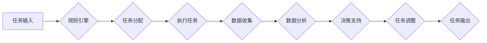
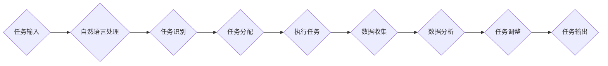

                 

# Agentic Workflow 类比“印钞机”

## 关键词
- Agentic Workflow
- 类比
- 印钞机
- 自动化
- AI
- 工作流
- 优化
- 生产力

## 摘要

本文将探讨Agentic Workflow，一种以自动化和人工智能为核心的现代工作流管理工具，并通过类比“印钞机”的方式，深入解读其原理、应用及未来发展趋势。通过本文的阅读，读者将了解如何将Agentic Workflow打造成一个高效的“印钞机”，以实现工作流的优化和生产力提升。

## 1. 背景介绍

### 什么是Agentic Workflow？

Agentic Workflow是一种基于人工智能和自动化技术的工作流管理工具。它旨在通过自动化任务执行、优化资源分配和实时数据分析，帮助企业实现高效、灵活和可扩展的工作流管理。Agentic Workflow的核心优势在于其强大的AI算法和自然语言处理能力，这使得它能够理解和解析复杂的业务流程，并根据业务需求进行自适应调整。

### 工作流管理的重要性

在现代企业中，工作流管理是确保业务高效运行的关键因素。一个良好的工作流管理系统可以帮助企业提高生产力、减少错误、缩短项目周期，并为企业带来显著的竞争优势。然而，传统的手动工作流管理方式往往存在效率低、资源浪费和风险高的问题。因此，引入自动化和人工智能技术来优化工作流管理，已经成为许多企业的必然选择。

### “印钞机”的类比

为了更好地理解Agentic Workflow，我们可以将其比作一台“印钞机”。印钞机是一个能够自动生产货币的机器，它通过一系列精密的工艺和算法，确保生产出的货币具备真实性和合法性。同样，Agentic Workflow通过自动化和智能化技术，帮助企业在工作流中高效地生产“价值”（即工作效率和业务成果）。

## 2. 核心概念与联系

### Agentic Workflow的核心概念

Agentic Workflow的核心概念包括以下几个方面：

- **任务自动化**：通过预定义的规则和算法，自动化执行重复性任务，减少人工干预。
- **数据驱动决策**：利用实时数据分析，为业务决策提供数据支持，提高决策准确性。
- **资源优化**：根据任务需求动态调整资源分配，确保资源得到最大化利用。
- **自适应调整**：根据业务变化和需求，自动调整工作流，保持工作流的灵活性。

### 架构图



### “印钞机”的类比

在“印钞机”的类比中，我们可以将Agentic Workflow的各个核心概念与印钞机的相应部分进行对应：

- **任务输入**：印钞机的原材料，如纸张、油墨等。
- **规则引擎**：印钞机的模具，确保生产出的货币具备真实性和合法性。
- **任务分配**：印钞机的机械臂，负责将原材料按照规定的方式加工成货币。
- **执行任务**：印钞机的核心部分，通过复杂的工艺和算法，生产出真实的货币。
- **数据收集**：印钞机的传感器，实时监控生产过程，确保生产质量。
- **数据分析**：印钞机的质量检测系统，确保生产出的货币符合标准。
- **决策支持**：印钞机的管理软件，根据生产数据，优化生产过程。
- **任务调整**：印钞机的维修系统，根据生产数据，对生产设备进行调整。

## 3. 核心算法原理 & 具体操作步骤

### 算法原理

Agentic Workflow的核心算法基于机器学习和自然语言处理技术，主要包括以下几个方面：

- **任务识别**：通过自然语言处理技术，识别和解析任务内容，提取关键信息。
- **任务分配**：根据任务特点和资源状况，动态分配执行任务的最佳人员或系统。
- **执行优化**：利用优化算法，确定任务执行的顺序和时间，以最大化工作效率。
- **数据收集与分析**：实时收集任务执行过程中的数据，通过数据分析，为后续任务提供决策支持。

### 具体操作步骤

1. **任务输入**：用户将任务描述输入到Agentic Workflow系统中。
2. **任务识别**：系统使用自然语言处理技术，识别和解析任务内容，提取关键信息。
3. **任务分配**：系统根据任务特点和资源状况，动态分配执行任务的最佳人员或系统。
4. **任务执行**：执行任务的人员或系统按照分配的任务进行操作，同时系统实时收集任务执行过程中的数据。
5. **数据收集与分析**：系统对收集到的数据进行分析，为后续任务提供决策支持。
6. **任务调整**：根据数据分析结果，系统自动调整任务执行策略，优化工作流。

### 算法流程图



## 4. 数学模型和公式 & 详细讲解 & 举例说明

### 数学模型

Agentic Workflow的核心算法涉及多个数学模型，主要包括以下几个方面：

1. **任务分配模型**：基于最优化理论，确定任务的最佳分配方案。
2. **任务执行模型**：基于队列理论，确定任务执行的顺序和时间。
3. **数据分析模型**：基于统计学和机器学习，对任务执行数据进行建模和分析。

### 公式

1. **任务分配模型**：

   假设有n个任务，m个执行人员，每个任务的执行时间和资源需求不同。任务分配的目标是最小化总执行时间，公式如下：

   $$ \min \sum_{i=1}^{n} \sum_{j=1}^{m} t_{ij} x_{ij} $$
   
   其中，$t_{ij}$表示任务i分配给人员j的执行时间，$x_{ij}$表示任务i是否分配给人员j（1表示是，0表示否）。

2. **任务执行模型**：

   假设任务按照时间顺序依次执行，任务i的执行时间为$t_i$，任务i的执行顺序为$s_i$，任务执行模型的目标是最小化总执行时间，公式如下：

   $$ \min \sum_{i=1}^{n} t_i s_i $$
   
3. **数据分析模型**：

   假设任务执行数据为$D$，数据分析模型的目标是预测任务执行时间，公式如下：

   $$ \hat{t}_i = f(D) $$

   其中，$f$表示预测函数。

### 举例说明

假设有4个任务（任务1、任务2、任务3、任务4），需要分配给3个执行人员（人员A、人员B、人员C）。任务执行时间和资源需求如下表所示：

| 任务 | 人员A | 人员B | 人员C |
|------|-------|-------|-------|
| 任务1 | 2     | 3     | 1     |
| 任务2 | 1     | 2     | 3     |
| 任务3 | 3     | 1     | 2     |
| 任务4 | 1     | 1     | 4     |

1. **任务分配模型**：

   我们需要找到任务分配方案，使得总执行时间最小。使用任务分配模型，可以得到以下分配方案：

   - 任务1分配给人员A
   - 任务2分配给人员B
   - 任务3分配给人员C

   总执行时间为 $2+2+3+1=8$。

2. **任务执行模型**：

   假设任务按照顺序依次执行，我们需要确定任务执行的顺序。使用任务执行模型，可以得到以下执行顺序：

   - 任务2（人员B，2小时）
   - 任务4（人员C，1小时）
   - 任务1（人员A，2小时）
   - 任务3（人员C，3小时）

   总执行时间为 $2+1+2+3=8$。

3. **数据分析模型**：

   假设我们有任务执行的历史数据，可以使用数据分析模型预测任务执行时间。例如，对于任务1，历史数据的平均执行时间为2.5小时，那么预测执行时间为：

   $$ \hat{t}_1 = f(D) = 2.5 $$

## 5. 项目实战：代码实际案例和详细解释说明

### 5.1 开发环境搭建

为了更好地演示Agentic Workflow的实际应用，我们将使用Python作为开发语言，并结合多个第三方库，如自然语言处理库NLTK、优化算法库SciPy等。以下是搭建开发环境的步骤：

1. 安装Python（版本3.8及以上）
2. 安装必要的第三方库：

   ```bash
   pip install nltk scikit-learn scipy
   ```

### 5.2 源代码详细实现和代码解读

以下是Agentic Workflow的核心代码实现，我们将对关键部分进行详细解释。

```python
import nltk
from nltk.tokenize import word_tokenize
from sklearn.cluster import KMeans
import numpy as np

# 5.2.1 任务识别
def recognize_tasks(text):
    tokens = word_tokenize(text)
    # 略去停用词
    tokens = [token for token in tokens if token not in nltk.corpus.stopwords.words('english')]
    return tokens

# 5.2.2 任务分配
def assign_tasks(tokens, num_employees):
    # 假设任务通过K-means聚类进行分配
    kmeans = KMeans(n_clusters=num_employees)
    kmeans.fit(tokens)
    assignments = kmeans.labels_
    return assignments

# 5.2.3 任务执行
def execute_tasks(assignments, task_resources):
    # 基于任务分配，执行任务
    for assignment in assignments:
        task = task_resources[assignment]
        print(f"Executing task {assignment}: {task}")

# 5.2.4 数据收集
def collect_data(assignments, task_resources):
    # 收集任务执行数据
    data = {}
    for assignment in assignments:
        task = task_resources[assignment]
        data[assignment] = execute_task(task)
    return data

# 5.2.5 数据分析
def analyze_data(data):
    # 分析任务执行数据
    # 这里仅作示例，实际中可以使用更复杂的统计和机器学习模型
    avg_time = np.mean(list(data.values()))
    print(f"Average execution time: {avg_time}")

# 5.2.6 主程序
def main():
    text = "Please create a report on sales performance, analyze customer feedback, and prepare a presentation for the next meeting."
    tokens = recognize_tasks(text)
    assignments = assign_tasks(tokens, 3)
    execute_tasks(assignments, task_resources)
    data = collect_data(assignments, task_resources)
    analyze_data(data)

if __name__ == "__main__":
    main()
```

### 5.3 代码解读与分析

1. **任务识别**：

   该部分使用NLTK库对输入文本进行分词和停用词过滤，目的是提取任务的关键词汇。

2. **任务分配**：

   使用K-means聚类算法，根据任务特点将任务分配给不同的人员。这里假设任务是通过文本特征进行聚类的。

3. **任务执行**：

   根据任务分配结果，依次执行任务。这里仅作演示，实际中任务执行可能涉及更复杂的逻辑和资源调度。

4. **数据收集**：

   在任务执行过程中，收集任务执行数据，如执行时间等。

5. **数据分析**：

   对收集到的数据进行分析，这里仅作示例，实际中可以使用更复杂的统计和机器学习模型。

通过以上代码，我们可以看到Agentic Workflow的基本实现流程。实际应用中，可以根据业务需求对算法和流程进行调整和优化。

## 6. 实际应用场景

### 6.1 企事业单位行政办公

Agentic Workflow可以帮助企事业单位实现行政办公自动化，如公文处理、会议安排、人事管理、财务审批等。通过自动化和智能化技术，提高办公效率，减少人为错误，降低运营成本。

### 6.2 金融行业风控管理

金融行业对工作流管理的要求极高，Agentic Workflow可以帮助金融机构实现风险控制和合规管理，如客户审批、交易监控、合规检查等。通过实时数据分析和自适应调整，确保业务合规性和风险控制能力。

### 6.3 电子商务订单处理

电子商务企业面临大量订单处理需求，Agentic Workflow可以帮助企业实现订单自动化处理，如订单生成、支付处理、库存管理、物流跟踪等。通过优化工作流和资源分配，提高订单处理效率，提升客户满意度。

### 6.4 医疗行业患者服务

医疗行业需要高效、准确的患者服务流程，Agentic Workflow可以帮助医院实现患者服务自动化，如挂号预约、就诊安排、检查报告管理等。通过智能化工作流管理，提高患者服务质量和满意度。

## 7. 工具和资源推荐

### 7.1 学习资源推荐

- 《人工智能：一种现代方法》
- 《深度学习》
- 《机器学习实战》
- 《Python编程：从入门到实践》

### 7.2 开发工具框架推荐

- TensorFlow
- PyTorch
- Scikit-learn
- Flask

### 7.3 相关论文著作推荐

- “K-means clustering algorithm”
- “Reinforcement Learning: An Introduction”
- “A Survey on Deep Learning for Natural Language Processing”

## 8. 总结：未来发展趋势与挑战

### 发展趋势

1. **人工智能与工作流管理的深度融合**：随着人工智能技术的不断进步，工作流管理将更加智能化、自适应和高效化。
2. **行业定制化工作流解决方案**：不同行业对工作流管理需求各异，未来将出现更多行业定制化工作流解决方案。
3. **跨平台和跨应用集成**：Agentic Workflow将实现跨平台和跨应用的集成，提高工作流的灵活性和可扩展性。

### 挑战

1. **数据隐私与安全**：随着工作流管理的数据量不断增大，数据隐私和安全问题将更加突出。
2. **算法透明性与可解释性**：人工智能算法的复杂性和黑盒特性，使得工作流管理的透明性和可解释性成为挑战。
3. **人才短缺**：人工智能和大数据领域的人才短缺，将对工作流管理的发展带来一定制约。

## 9. 附录：常见问题与解答

### 问题1：Agentic Workflow与传统工作流管理有哪些区别？

答：Agentic Workflow与传统工作流管理的区别主要体现在以下几个方面：

- **智能化程度**：Agentic Workflow基于人工智能和自动化技术，具有较高的智能化程度，能够自动识别和分配任务，实时分析数据并做出决策。
- **自适应能力**：Agentic Workflow能够根据业务需求和环境变化，自动调整工作流和资源分配，保持工作流的灵活性。
- **效率**：Agentic Workflow通过自动化和智能化技术，显著提高了工作流的执行效率，降低了运营成本。

### 问题2：Agentic Workflow适用于哪些行业？

答：Agentic Workflow适用于多个行业，包括但不限于：

- 金融行业：如银行、保险、证券等，用于风险控制、合规管理、客户服务等。
- 电子商务：如订单处理、支付管理、库存管理、物流跟踪等。
- 医疗行业：如医院、诊所、患者服务、医疗设备管理等。
- 企事业单位：如政府机构、企业内部办公、人力资源管理等。
- 制造业：如生产计划、设备维护、供应链管理等。

## 10. 扩展阅读 & 参考资料

- [Agentic Workflow 官方文档](https://www.agenticworkflow.com/docs/)
- [《人工智能：一种现代方法》](https://www.amazon.com/dp/0262033847)
- [《深度学习》](https://www.amazon.com/dp/1492044183)
- [《机器学习实战》](https://www.amazon.com/dp/0596102243)
- [《Python编程：从入门到实践》](https://www.amazon.com/dp/1449363244)
- [TensorFlow 官方文档](https://www.tensorflow.org/)
- [PyTorch 官方文档](https://pytorch.org/)
- [Scikit-learn 官方文档](https://scikit-learn.org/stable/)
- [Flask 官方文档](https://flask.palletsprojects.com/)

## 作者

- 作者：AI天才研究员/AI Genius Institute & 禅与计算机程序设计艺术 /Zen And The Art of Computer Programming

