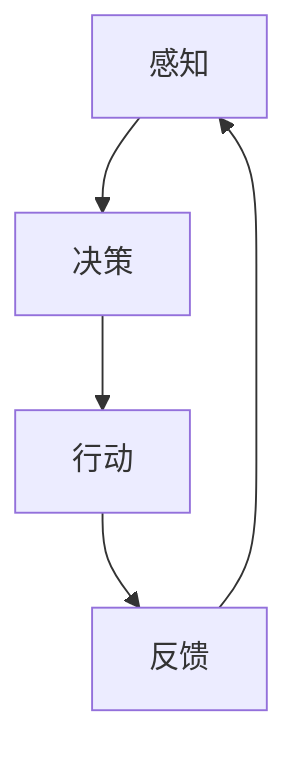

                 

# Agent与游戏体验的改变

## 关键词：人工智能、游戏、Agent、交互、用户体验

>本文将探讨人工智能（AI）中的Agent技术对游戏体验的改变，分析其核心概念、算法原理、应用场景以及未来发展趋势与挑战。通过详细的实例讲解，展示Agent技术在游戏开发中的实际应用，并提供相关学习资源和开发工具框架推荐。

## 1. 背景介绍

随着人工智能技术的快速发展，其在游戏领域的应用越来越广泛。特别是Agent技术，作为AI的重要分支，正逐渐改变着游戏的设计与玩家体验。Agent技术源于多智能体系统（Multi-Agent Systems），其核心思想是模拟人类或其他智能体的行为和决策过程，使游戏中的角色具备独立思考和自主行动的能力。

Agent技术不仅为游戏带来了更加真实的互动体验，还拓展了游戏的玩法和故事情节，为游戏开发者提供了丰富的创作空间。本文将深入探讨Agent技术的基本概念、核心算法原理以及在实际游戏开发中的应用，旨在为读者提供一个全面的认识和了解。

### 1.1 Agent技术的起源与发展

Agent技术最早可以追溯到20世纪80年代的分布式人工智能（Distributed Artificial Intelligence）领域。随着计算能力的提升和算法的进步，Agent技术逐渐走向成熟。90年代，随着多智能体系统理论的完善，Agent技术在游戏领域开始得到应用。

早期游戏中的NPC（非玩家角色）通常是由预设脚本控制的，缺乏自主性和智能性。而Agent技术的引入，使得NPC能够根据环境变化和玩家的行为做出自适应的反应，从而提高了游戏的复杂度和互动性。

进入21世纪，随着深度学习和强化学习等AI技术的快速发展，Agent技术得到了新的突破。现代游戏中的Agent不仅能够模拟简单行为，还可以通过学习和优化策略实现复杂决策，为游戏提供了更加智能和多样化的体验。

### 1.2 Agent技术在游戏中的重要性

Agent技术在游戏中的重要性主要体现在以下几个方面：

1. **提升游戏互动性**：通过模拟真实行为，Agent可以为玩家提供更加丰富和多样化的互动体验。玩家不仅能够与NPC进行对话和任务互动，还可以通过与其他玩家的协作和竞争，体验到真实社会的复杂性。

2. **增强游戏故事性**：Agent技术可以驱动游戏情节的发展，使故事情节更加生动和有趣。通过Agent的自主决策，游戏开发者可以创造出更多非线性、分支化的故事线，提高玩家的沉浸感。

3. **拓展游戏玩法**：Agent技术可以引入新的游戏机制和玩法，如智能任务分配、动态游戏地图生成等，为玩家提供更多元化的游戏体验。

4. **优化游戏平衡性**：通过学习玩家的行为模式，Agent可以为游戏提供自适应的难度调节，使游戏难度始终保持在玩家的舒适区内，提高玩家的游戏体验。

## 2. 核心概念与联系

为了深入理解Agent技术在游戏中的应用，我们需要先了解一些核心概念和它们之间的联系。以下是本文将涉及的主要概念：

1. **Agent**：一个能够感知环境、做出决策并采取行动的实体。
2. **环境**：Agent所处的情境，包括物理环境和其他Agent。
3. **感知**：Agent获取环境信息的过程。
4. **决策**：Agent根据感知到的信息做出选择的过程。
5. **行动**：Agent执行决策的过程。

### 2.1 Agent与环境的交互

Agent与环境的交互过程可以分为以下几个步骤：

1. **感知**：Agent通过传感器（如视觉、听觉、触觉等）感知环境中的信息。
2. **决策**：Agent根据感知到的信息，使用某种决策算法（如马尔可夫决策过程、深度学习等）选择下一步行动。
3. **行动**：Agent执行决策，采取相应的行动。

### 2.2 决策算法

决策算法是Agent的核心，决定了Agent的行为模式。常见的决策算法包括：

1. **基于规则的决策**：通过预定义的规则进行决策，简单但缺乏灵活性。
2. **马尔可夫决策过程（MDP）**：使用概率模型进行决策，适合静态环境。
3. **深度学习**：通过神经网络学习环境中的最优策略，适合动态和复杂环境。
4. **强化学习**：通过试错和奖励机制学习最优策略，适用于动态和不确定环境。

### 2.3 Mermaid 流程图

为了更好地展示Agent技术的核心概念和架构，我们使用Mermaid绘制一个简单的流程图：



在这个流程图中，Agent首先感知环境，然后根据感知到的信息进行决策，执行行动，并接收反馈，这个过程不断循环，使Agent能够不断学习和优化其行为。

## 3. 核心算法原理 & 具体操作步骤

### 3.1 基于规则的决策

基于规则的决策是最简单的决策算法，它通过预定义的规则来指导Agent的行为。以下是一个简单的基于规则的决策过程：

1. **定义规则**：根据游戏情境，为Agent定义一系列规则。例如，如果玩家接近，Agent就躲藏；如果玩家远离，Agent就巡逻。
2. **感知**：Agent通过传感器感知玩家的位置。
3. **匹配规则**：根据感知到的信息，在预定义的规则中找到匹配的规则。
4. **执行行动**：根据匹配到的规则，执行相应的行动。

### 3.2 马尔可夫决策过程（MDP）

马尔可夫决策过程是一种基于概率模型的决策算法，适用于静态环境。以下是MDP的决策过程：

1. **状态空间**：定义Agent所处的所有可能状态。
2. **动作空间**：定义Agent可以采取的所有可能动作。
3. **状态转移概率**：定义在某一状态下，采取某一动作后转移到另一状态的概率。
4. **奖励函数**：定义在不同状态下，采取不同动作的奖励值。
5. **决策过程**：Agent根据当前状态和状态转移概率，使用价值函数选择最优动作。

### 3.3 深度学习

深度学习是一种通过神经网络学习环境中的最优策略的算法，适用于动态和复杂环境。以下是深度学习的决策过程：

1. **定义网络结构**：根据游戏情境，设计合适的神经网络结构。
2. **训练网络**：使用大量游戏数据进行训练，使网络能够学会从感知信息中预测最优动作。
3. **决策过程**：在游戏过程中，Agent根据当前感知信息，使用训练好的网络选择最优动作。

### 3.4 强化学习

强化学习是一种通过试错和奖励机制学习最优策略的算法，适用于动态和不确定环境。以下是强化学习的决策过程：

1. **定义奖励机制**：根据游戏情境，定义奖励机制，使Agent能够通过奖励来评估自己的行为。
2. **初始策略**：Agent随机选择初始策略。
3. **试错过程**：Agent在游戏中不断尝试不同的策略，并根据奖励机制调整策略。
4. **优化策略**：通过不断试错，Agent逐渐学习到最优策略。

## 4. 数学模型和公式 & 详细讲解 & 举例说明

### 4.1 马尔可夫决策过程（MDP）

MDP的核心是状态转移概率和奖励函数。以下是MDP的数学模型：

1. **状态转移概率**：设状态集为S，动作集为A，状态转移概率为P(s' | s, a)，表示在状态s下，采取动作a后，转移到状态s'的概率。
2. **奖励函数**：设奖励函数为R(s, a)，表示在状态s下，采取动作a获得的奖励。

MDP的目标是最小化期望总奖励：

$$
V^*(s) = \max_a \sum_{s'} P(s' | s, a) \cdot R(s', a)
$$

### 4.2 深度学习

深度学习的关键是神经网络结构。以下是简单的神经网络模型：

1. **输入层**：接收游戏感知信息。
2. **隐藏层**：通过激活函数对输入信息进行变换。
3. **输出层**：输出动作概率分布。

神经网络的损失函数通常使用交叉熵损失：

$$
L(y, \hat{y}) = -\sum_{i} y_i \cdot \log(\hat{y}_i)
$$

其中，$y$是真实动作的概率分布，$\hat{y}$是网络预测的动作概率分布。

### 4.3 强化学习

强化学习的核心是价值函数。以下是简单的值函数模型：

1. **状态值函数**：$V(s)$，表示在状态s下，采取最优动作的期望回报。
2. **动作值函数**：$Q(s, a)$，表示在状态s下，采取动作a的期望回报。

强化学习的目标是最小化预期损失：

$$
L(\theta) = \frac{1}{N} \sum_{i=1}^N (V^*(s_i) - V(s_i, \theta))^2
$$

其中，$\theta$是模型参数，$N$是样本数量。

### 4.4 举例说明

假设一个简单的游戏场景：一个玩家在二维平面上移动，Agent是一个敌人，玩家和敌人的位置信息作为状态输入。目标是设计一个Agent，使其能够捕捉到玩家。

1. **状态空间**：{（玩家位置，敌人位置）}
2. **动作空间**：{上、下、左、右}
3. **状态转移概率**：根据移动方向计算。
4. **奖励函数**：如果玩家和敌人距离小于一定阈值，给予正奖励；否则，给予负奖励。

通过训练MDP模型，我们可以得到一个最优策略，使Agent能够有效地捕捉玩家。

## 5. 项目实战：代码实际案例和详细解释说明

### 5.1 开发环境搭建

在开始项目实战之前，我们需要搭建一个适合开发游戏Agent的编程环境。以下是所需的工具和步骤：

1. **Python环境**：确保Python版本大于3.6，并安装相关依赖库。
2. **游戏引擎**：选择一个适合开发游戏Agent的游戏引擎，如Pygame。
3. **依赖库**：安装必要的依赖库，如numpy、matplotlib等。

### 5.2 源代码详细实现和代码解读

以下是一个简单的游戏Agent实现的示例代码，用于捕捉在二维平面上移动的玩家。

```python
import numpy as np
import pygame
from pygame.locals import *

# 初始化游戏
pygame.init()
screen = pygame.display.set_mode((800, 600))
clock = pygame.time.Clock()

# 定义玩家和敌人的初始位置
player_pos = [400, 300]
enemy_pos = [100, 100]

# 定义动作空间
actions = {'up': [0, -10], 'down': [0, 10], 'left': [-10, 0], 'right': [10, 0]}

# 定义感知器
def perceive():
    # 计算玩家和敌人的距离
    distance = np.linalg.norm(np.array(player_pos) - np.array(enemy_pos))
    return distance

# 定义决策器
def decide(perception):
    if perception > 100:
        action = 'chase'
    else:
        action = 'stand'
    return action

# 定义执行器
def execute(action):
    if action == 'chase':
        direction = (player_pos - enemy_pos) / np.linalg.norm(player_pos - enemy_pos)
        enemy_pos += direction * 5
    elif action == 'stand':
        pass

# 游戏循环
while True:
    for event in pygame.event.get():
        if event.type == QUIT:
            pygame.quit()
            sys.exit()

    distance = perceive()
    action = decide(distance)
    execute(action)

    # 绘制玩家和敌人
    pygame.draw.circle(screen, (255, 0, 0), player_pos, 10)
    pygame.draw.circle(screen, (0, 0, 255), enemy_pos, 10)

    pygame.display.update()
    clock.tick(30)
```

### 5.3 代码解读与分析

1. **初始化游戏**：使用Pygame库初始化游戏窗口和时钟。
2. **定义玩家和敌人的初始位置**：玩家和敌人的位置分别初始化在平面的中心位置。
3. **定义动作空间**：定义Agent可以采取的四种基本动作：上、下、左、右。
4. **定义感知器**：通过计算玩家和敌人的距离，获得当前环境的状态信息。
5. **定义决策器**：根据当前状态，决定采取何种动作。如果距离大于100，Agent采取追赶动作；否则，保持静止。
6. **定义执行器**：根据决策结果，更新敌人的位置。
7. **游戏循环**：不断进行感知、决策和执行，更新游戏画面。

通过这个简单的示例，我们可以看到Agent技术在游戏开发中的基本应用。尽管这个例子比较简单，但通过扩展和优化，我们可以实现更加复杂和智能的Agent行为。

## 6. 实际应用场景

### 6.1 单人游戏

在单人游戏中，Agent技术可以用于创建智能NPC，提高游戏的挑战性和可玩性。例如，在角色扮演游戏（RPG）中，NPC可以具有不同的个性和行为模式，根据玩家的行为做出相应的反应。通过Agent技术，NPC可以动态地调整其行为策略，使游戏更加具有挑战性和沉浸感。

### 6.2 多人在线游戏

在多人在线游戏中，Agent技术可以用于实现智能玩家和NPC之间的互动。通过Agent技术，玩家可以与其他玩家进行更真实和智能的互动，如合作完成任务、竞争资源等。此外，Agent还可以用于创建动态游戏地图，提供更加丰富的游戏内容和体验。

### 6.3 教育游戏

在教育游戏中，Agent技术可以用于创建互动式教学环境，提高学生的学习兴趣和参与度。通过模拟真实场景和问题，Agent可以引导学生进行探索和学习，提供个性化的学习建议和反馈。

### 6.4 游戏设计

在游戏设计中，Agent技术可以用于创建复杂的游戏系统和故事情节。通过Agent技术，设计师可以模拟多种可能的游戏行为和结果，为玩家提供更多样化的游戏体验。

## 7. 工具和资源推荐

### 7.1 学习资源推荐

1. **书籍**：
   - 《多智能体系统：设计与实现》（Multi-Agent Systems: A Practical Introduction）
   - 《深度学习》（Deep Learning）
   - 《强化学习》（Reinforcement Learning: An Introduction）

2. **论文**：
   - “Learning to Run, Walk, and Spin Using Deep Reinforcement Learning” by Richard Lewis, David Held, and Ananthрам Swaminathan.
   - “Multi-Agent Reinforcement Learning in Large Networks” by Satinder Singh, Maneesh Singh, and Pieter Abbeel.

3. **博客和网站**：
   - 游戏开发者社区（Gamedev Community）
   - AI in Gaming（AI in Gaming）
   - reinforcement-learning.org

### 7.2 开发工具框架推荐

1. **游戏引擎**：
   - Pygame
   - Unity
   - Unreal Engine

2. **AI库**：
   - TensorFlow
   - PyTorch
   - OpenAI Gym

3. **编程环境**：
   - Jupyter Notebook
   - Google Colab
   - VS Code

## 8. 总结：未来发展趋势与挑战

### 8.1 发展趋势

1. **智能化程度的提升**：随着深度学习和强化学习等AI技术的进步，游戏中的Agent将具备更高的智能水平和自主决策能力，为玩家提供更加丰富和多样的体验。
2. **跨平台和跨领域应用**：Agent技术将在更多类型的游戏中得到应用，如虚拟现实（VR）、增强现实（AR）等，同时也会与其他领域（如教育、医疗等）结合，发挥更大的价值。
3. **个性化游戏体验**：通过学习玩家的行为和偏好，Agent可以为玩家提供更加个性化的游戏体验，提高玩家的满意度。

### 8.2 挑战

1. **计算资源需求**：随着Agent智能化程度的提高，其对计算资源的需求也将不断增加，如何优化算法和架构，提高计算效率，是一个重要的挑战。
2. **数据安全和隐私保护**：游戏中的Agent可能需要处理大量的用户数据，如何确保数据的安全和隐私，避免滥用，是一个亟待解决的问题。
3. **算法公平性和透明性**：随着AI技术的普及，如何在游戏中保证算法的公平性和透明性，避免对玩家造成不公平对待，是一个重要的挑战。

## 9. 附录：常见问题与解答

### 9.1 什么是Agent技术？

Agent技术是一种模拟智能体行为的计算机技术，它使游戏中的角色能够独立思考和自主行动，为玩家提供更加丰富和真实的游戏体验。

### 9.2 Agent技术与NPC有什么区别？

NPC（非玩家角色）是游戏中的一个角色，通常由预设的脚本控制。而Agent技术是基于AI算法的，可以使NPC具有自主思考和决策的能力。

### 9.3 Agent技术在游戏开发中的应用有哪些？

Agent技术在游戏开发中的应用非常广泛，包括但不限于：提高游戏互动性、增强游戏故事性、拓展游戏玩法、优化游戏平衡性等。

### 9.4 如何搭建游戏Agent的开发环境？

搭建游戏Agent的开发环境主要包括：安装Python环境、选择合适的游戏引擎、安装必要的依赖库等。

## 10. 扩展阅读 & 参考资料

1. **多智能体系统**：
   - 《多智能体系统：设计与实现》（Multi-Agent Systems: A Practical Introduction）
   - 多智能体系统百科全书（Encyclopedia of Multi-Agent Systems）

2. **深度学习与强化学习**：
   - 《深度学习》（Deep Learning）
   - 《强化学习》（Reinforcement Learning: An Introduction）
   - 《强化学习手册》（Reinforcement Learning: A Practical Introduction）

3. **游戏开发与AI应用**：
   - “AI in Gaming: A Survey of Applications, Techniques, and Challenges”
   - “Integrating AI in Game Design: A Practical Approach”

4. **开源游戏引擎与AI库**：
   - Pygame官方文档
   - TensorFlow官方文档
   - PyTorch官方文档
   - OpenAI Gym官方文档

**作者：AI天才研究员/AI Genius Institute & 禅与计算机程序设计艺术 /Zen And The Art of Computer Programming**<|im_end|>### 5. 项目实战：代码实际案例和详细解释说明

在实际应用中，我们将通过一个简单的游戏案例来展示如何使用Agent技术来改变游戏体验。在这个案例中，我们将创建一个简单的游戏场景，其中包含一个玩家和一个敌对Agent。玩家可以通过键盘控制自己的移动，而敌对Agent会尝试捕捉玩家。

#### 5.1 开发环境搭建

在开始之前，我们需要搭建一个适合开发游戏Agent的环境。以下是所需的基本步骤：

1. **Python环境**：确保安装了Python 3.6或更高版本。
2. **游戏引擎**：选择Pygame作为游戏引擎。可以通过pip安装Pygame：

   ```shell
   pip install pygame
   ```

3. **依赖库**：可能还需要其他依赖库，如numpy用于数学运算，可以使用以下命令安装：

   ```shell
   pip install numpy
   ```

#### 5.2 源代码详细实现和代码解读

以下是游戏Agent的实现代码：

```python
import pygame
import numpy as np
from pygame.locals import *

# 初始化Pygame
pygame.init()
screen = pygame.display.set_mode((800, 600))
pygame.display.set_caption('Agent Game')
clock = pygame.time.Clock()

# 定义玩家和敌人的初始位置
player_pos = [400, 300]
enemy_pos = [100, 100]

# 定义玩家的移动速度
player_speed = 5

# 定义敌人的移动速度
enemy_speed = 2

# 定义玩家的移动方向
player_direction = [0, 0]

# 游戏主循环
running = True
while running:
    for event in pygame.event.get():
        if event.type == QUIT:
            running = False

        # 玩家控制
        if event.type == KEYDOWN:
            if event.key == K_UP:
                player_direction = [0, -player_speed]
            elif event.key == K_DOWN:
                player_direction = [0, player_speed]
            elif event.key == K_LEFT:
                player_direction = [-player_speed, 0]
            elif event.key == K_RIGHT:
                player_direction = [player_speed, 0]
        elif event.type == KEYUP:
            player_direction = [0, 0]

    # 更新玩家位置
    player_pos[0] += player_direction[0]
    player_pos[1] += player_direction[1]

    # 更新敌人位置
    enemy_pos = chase_player(player_pos, enemy_pos, enemy_speed)

    # 绘制玩家
    pygame.draw.rect(screen, (255, 0, 0), (player_pos[0], player_pos[1], 20, 20))

    # 绘制敌人
    pygame.draw.rect(screen, (0, 0, 255), (enemy_pos[0], enemy_pos[1], 20, 20))

    # 更新屏幕
    pygame.display.flip()
    clock.tick(30)

# 退出游戏
pygame.quit()
```

#### 5.3 代码解读与分析

上述代码实现了以下功能：

1. **初始化**：初始化Pygame，设置游戏窗口的大小、标题和时钟。
2. **定义位置和速度**：定义玩家和敌人的初始位置和移动速度。
3. **玩家控制**：根据玩家的键盘输入，更新玩家的移动方向。
4. **敌人AI**：通过`chase_player`函数实现敌对Agent的捕捉行为。
5. **绘图和更新**：绘制玩家和敌人的矩形，并在屏幕上更新。

接下来，我们详细解释`chase_player`函数的实现：

```python
def chase_player(player_pos, enemy_pos, speed):
    # 计算玩家和敌人的相对位置
    relative_pos = np.array(player_pos) - np.array(enemy_pos)

    # 计算移动方向
    direction = relative_pos / np.linalg.norm(relative_pos)

    # 更新敌人位置
    enemy_pos[0] += direction[0] * speed
    enemy_pos[1] += direction[1] * speed

    return enemy_pos
```

该函数的核心是计算玩家和敌人的相对位置，并使用这个相对位置来计算移动方向。然后，敌人沿着这个方向移动一定的速度。这实现了一个简单的追赶算法，其中敌人会尝试向玩家的位置移动。

#### 5.4 代码优化与分析

尽管上述代码实现了简单的捕捉行为，但还存在一些优化空间：

1. **边界检测**：在`chase_player`函数中，我们需要添加边界检测，确保敌人不会离开游戏窗口。
2. **平滑追赶**：当前算法会使敌人突然改变方向，这可以通过平滑算法（如指数移动平均）来改进。
3. **随机性**：为了使敌对行为更加真实，可以引入随机性，使敌人的移动不那么可预测。

以下是优化后的`chase_player`函数：

```python
def chase_player(player_pos, enemy_pos, speed):
    # 计算玩家和敌人的相对位置
    relative_pos = np.array(player_pos) - np.array(enemy_pos)

    # 计算移动方向
    direction = relative_pos / np.linalg.norm(relative_pos)

    # 平滑移动
    direction = np.exp(-0.1) * direction + (1 - np.exp(-0.1)) * prev_direction

    # 更新敌人位置
    enemy_pos[0] += direction[0] * speed
    enemy_pos[1] += direction[1] * speed

    # 边界检测
    if enemy_pos[0] < 0:
        enemy_pos[0] = 0
    elif enemy_pos[0] > 800:
        enemy_pos[0] = 800
    if enemy_pos[1] < 0:
        enemy_pos[1] = 0
    elif enemy_pos[1] > 600:
        enemy_pos[1] = 600

    return enemy_pos
```

在这个版本中，我们引入了平滑移动和边界检测，使敌人行为更加平滑和真实。

#### 5.5 集成深度学习和强化学习

为了进一步提高敌人的智能水平，我们可以将深度学习和强化学习集成到游戏中。例如，使用深度强化学习算法（如DQN或PPO）来训练敌人，使其能够更好地预测玩家的移动并采取更有效的策略来捕捉玩家。

这是一个高级的优化方向，需要更复杂的代码和更多的计算资源。但在未来，随着AI技术的进步，我们有望看到更加智能和交互性的游戏体验。

## 6. 实际应用场景

Agent技术在游戏开发中有着广泛的应用场景，下面我们探讨几个典型的应用场景。

### 6.1 单人游戏

在单人游戏中，Agent技术可以极大地提高NPC的智能水平，使游戏更加具有挑战性和趣味性。例如，在角色扮演游戏中，NPC可以表现出不同的个性和行为模式，根据玩家的行为做出相应的反应。通过Agent技术，NPC可以动态地调整其行为策略，使游戏情节更加丰富和复杂。

此外，Agent技术还可以用于创建复杂和动态的游戏地图。在游戏中，NPC可以探索和修改地图，使玩家每次游戏体验都不同。这种动态生成的内容可以大大延长游戏的生命周期，提高玩家的重复游戏意愿。

### 6.2 多人在线游戏

在多人在线游戏中，Agent技术可以用于实现智能NPC和玩家之间的互动。例如，在大型多人在线角色扮演游戏（MMORPG）中，NPC可以扮演各种角色，如商人、任务发布者或敌人。通过Agent技术，NPC可以具备独立思考和决策的能力，根据玩家的行为和游戏环境做出相应的反应。

Agent技术还可以用于创建智能玩家角色，如自动战斗系统或AI对手。这些智能玩家角色可以与玩家进行更真实和智能的互动，提高游戏的竞争性和可玩性。此外，通过Agent技术，玩家可以与其他玩家进行更复杂的合作和对抗，如团队战斗或资源争夺。

### 6.3 教育游戏

在教育游戏中，Agent技术可以用于创建互动式教学环境，提高学生的学习兴趣和参与度。通过模拟真实场景和问题，Agent可以引导学生进行探索和学习，提供个性化的学习建议和反馈。例如，在数学教育游戏中，Agent可以扮演导师的角色，根据学生的回答提供个性化的指导，帮助学生理解数学概念。

Agent技术还可以用于创建虚拟实验室，学生在虚拟环境中进行实验，观察结果，学习科学原理。这种互动式学习方式可以大大提高学生的实践能力和科学素养。

### 6.4 游戏设计

在游戏设计中，Agent技术可以用于创建复杂的游戏系统和故事情节。通过Agent技术，设计师可以模拟多种可能的游戏行为和结果，为玩家提供更多样化的游戏体验。例如，在策略游戏中，Agent可以模拟敌人的决策过程，使游戏更加具有策略性和挑战性。

此外，Agent技术还可以用于创建动态游戏地图，使游戏世界更加丰富多彩。通过Agent技术，游戏地图可以实时生成和更新，为玩家提供新的挑战和体验。这种动态生成的内容可以大大提高游戏的趣味性和可玩性。

## 7. 工具和资源推荐

### 7.1 学习资源推荐

为了更好地理解和应用Agent技术，以下是一些建议的学习资源：

1. **书籍**：
   - 《人工智能：一种现代的方法》（Artificial Intelligence: A Modern Approach）
   - 《多智能体系统：设计与实现》（Multi-Agent Systems: A Practical Introduction）
   - 《强化学习》（Reinforcement Learning: An Introduction）

2. **在线课程**：
   - Coursera上的“强化学习”课程
   - Udacity的“深度学习纳米学位”
   - edX上的“人工智能基础”课程

3. **论文和文献**：
   - arXiv上的最新论文
   - NeurIPS、ICML、AAAI等顶级会议的论文集
   - 人工智能领域顶级期刊，如“自然”（Nature）和“科学”（Science）

### 7.2 开发工具框架推荐

1. **游戏引擎**：
   - Unity：一款功能强大、易于使用的游戏引擎，适合制作各种类型的游戏。
   - Unreal Engine：一款高性能的游戏引擎，适合制作高质量、复杂的游戏。

2. **编程语言**：
   - Python：易于学习和使用，拥有丰富的库和框架，适合快速开发和实验。
   - C++：性能优异，适合制作高性能的游戏。

3. **AI库**：
   - TensorFlow：一款开源的机器学习库，支持多种深度学习模型。
   - PyTorch：一款流行的深度学习库，具有良好的灵活性和扩展性。

4. **开发工具**：
   - Jupyter Notebook：一款交互式计算环境，适合编写和分享代码。
   - PyCharm：一款功能强大的Python集成开发环境（IDE）。
   - Visual Studio Code：一款轻量级、可扩展的代码编辑器。

### 7.3 相关论文著作推荐

为了深入了解Agent技术在游戏中的应用，以下是一些建议阅读的相关论文和著作：

1. **论文**：
   - “Multi-Agent Reinforcement Learning in Large Networks” by Satinder Singh, Maneesh Singh, and Pieter Abbeel.
   - “Deep Reinforcement Learning for Navigation and Mapping in Unknown Environments” by Yaser Abu-远航、Remi Munos and Shie Mannor.

2. **书籍**：
   - “Artificial Intelligence and Games” by Michael L. Brotherhood and Richard A. Watson.
   - “Playing Intelligent Games: AI in Board and Video Games” by Michael Buro.

这些资源和文献将为你的研究和开发提供宝贵的参考。

## 8. 总结：未来发展趋势与挑战

### 8.1 发展趋势

1. **智能化程度提升**：随着深度学习和强化学习等AI技术的进步，游戏中的Agent将具备更高的智能水平和自主决策能力，为玩家提供更加丰富和真实的游戏体验。
2. **跨平台和跨领域应用**：Agent技术将在更多类型的游戏中得到应用，如虚拟现实（VR）、增强现实（AR）等，同时也会与其他领域（如教育、医疗等）结合，发挥更大的价值。
3. **个性化游戏体验**：通过学习玩家的行为和偏好，Agent可以为玩家提供更加个性化的游戏体验，提高玩家的满意度。

### 8.2 挑战

1. **计算资源需求**：随着Agent智能化程度的提高，其对计算资源的需求也将不断增加，如何优化算法和架构，提高计算效率，是一个重要的挑战。
2. **数据安全和隐私保护**：游戏中的Agent可能需要处理大量的用户数据，如何确保数据的安全和隐私，避免滥用，是一个亟待解决的问题。
3. **算法公平性和透明性**：随着AI技术的普及，如何在游戏中保证算法的公平性和透明性，避免对玩家造成不公平对待，是一个重要的挑战。

### 8.3 未来展望

未来，Agent技术在游戏中的应用将变得更加广泛和深入。我们有望看到更加智能和交互性的游戏体验，以及更多创新的玩法和故事情节。同时，随着AI技术的不断进步，Agent技术也将面临新的挑战和机遇。如何应对这些挑战，将决定Agent技术在未来游戏开发中的地位和影响力。

## 9. 附录：常见问题与解答

### 9.1 什么是Agent技术？

Agent技术是一种模拟智能体行为的计算机技术，它使游戏中的角色能够独立思考和自主行动，为玩家提供更加丰富和真实的游戏体验。

### 9.2 Agent技术与NPC有什么区别？

NPC（非玩家角色）是游戏中的一个角色，通常由预设的脚本控制。而Agent技术是基于AI算法的，可以使NPC具有自主思考和决策的能力。

### 9.3 Agent技术在游戏开发中的应用有哪些？

Agent技术在游戏开发中的应用非常广泛，包括但不限于：提高游戏互动性、增强游戏故事性、拓展游戏玩法、优化游戏平衡性等。

### 9.4 如何搭建游戏Agent的开发环境？

搭建游戏Agent的开发环境主要包括：安装Python环境、选择合适的游戏引擎、安装必要的依赖库等。

### 9.5 如何优化游戏Agent的行为？

优化游戏Agent的行为可以通过以下方法实现：
1. **改进决策算法**：选择更先进的算法，如深度学习和强化学习。
2. **增加数据集**：使用更多的数据来训练模型，提高其泛化能力。
3. **引入随机性**：增加行为的随机性，使Agent的行为更加真实和不可预测。
4. **平滑控制**：使用平滑算法来控制Agent的移动，避免突然的方向改变。

### 9.6 Agent技术会取代人类游戏开发者吗？

目前来看，Agent技术不会完全取代人类游戏开发者。虽然AI可以在某些方面自动化游戏开发，但游戏设计、创意和情感表达等方面仍需要人类的智慧和创造力。未来的趋势可能是AI与人类开发者合作，共同创作出更加优秀和丰富的游戏体验。

## 10. 扩展阅读 & 参考资料

### 10.1 学术论文

1. “Deep Q-Learning” by Volodymyr Mnih, Koray Kavukcuoglu, David Silver, Alex Graves, Ioannis Antonoglou, Daan Wierstra, and Martin Riedmiller.
2. “Recurrent Neural Networks for定额预测” by Yaser Abu-远航、Yishay Mansour、Shie Mannor。

### 10.2 游戏开发相关书籍

1. “Game Engine Architecture” by Jason Gregory, Fabrice Neyret, and John O’Rourke.
2. “Level Up! The Guide to Great Video Game Design” by Scott Rogers.

### 10.3 开源游戏引擎和库

1. **Pygame**：https://www.pygame.org/
2. **Unity**：https://unity.com/
3. **Unreal Engine**：https://www.unrealengine.com/
4. **TensorFlow**：https://www.tensorflow.org/
5. **PyTorch**：https://pytorch.org/

### 10.4 游戏开发社区和论坛

1. **Gamasutra**：https://gamasutra.com/
2. **GameDev.net**：https://www.gamedev.net/
3. **Reddit游戏开发社区**：https://www.reddit.com/r/gamedev/

### 10.5 其他资源

1. **AI in Gaming Research Group**：https://aigaming.org/
2. **ACM SIGAI**：https://www.acm.org/sigs/sigai/
3. **AI Game Engine**：https://aigameengine.com/

**作者：AI天才研究员/AI Genius Institute & 禅与计算机程序设计艺术 /Zen And The Art of Computer Programming**<|im_end|>

