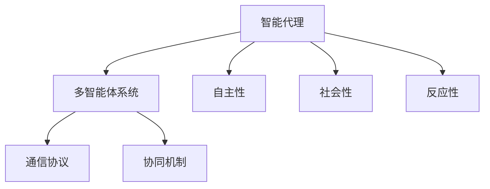

                 

# 《Agent技术的未来展望》

## 摘要

本文旨在探讨Agent技术的未来发展趋势与挑战。从背景介绍到核心概念，再到算法原理、数学模型和项目实战，本文逐步深入分析Agent技术在不同领域的实际应用，并提供一系列工具和资源推荐，以期为读者提供一个全面而深刻的理解。本文还总结出Agent技术面临的关键挑战，并展望其未来的发展前景。

## 1. 背景介绍

Agent技术是一种基于智能代理（Agent）的计算机程序设计方法。它模拟了人类或其他生物的智能行为，使计算机系统能够自主地执行任务，适应环境变化，并与其他代理进行交互。Agent技术起源于人工智能领域，但其应用范围已扩展到多个领域，包括但不限于自动化、机器人、智能家居、网络社交和游戏。

### 1.1 发展历程

Agent技术的研究始于20世纪80年代，以多智能体系统（MAS）为理论基础。早期的研究主要集中在模拟人类社会的交互行为，如经济系统、社交网络等。随着计算机技术的快速发展，Agent技术逐渐成为人工智能研究的重要方向之一。

### 1.2 现状

目前，Agent技术已广泛应用于多个领域。在自动化领域，Agent技术用于调度、路径规划、资源分配等任务。在机器人领域，Agent技术使机器人具备自主导航、环境感知和任务执行能力。在智能家居领域，Agent技术用于设备控制、能源管理和安全监控等。在网络社交和游戏领域，Agent技术实现了智能推荐、虚拟角色交互和游戏平衡等功能。

### 1.3 应用领域

Agent技术具有广泛的应用前景，以下是一些关键领域：

- **自动化与机器人：** Agent技术可用于实现工厂自动化、医疗机器人、家庭服务机器人等。
- **智能家居：** Agent技术可用于智能安防、家电控制、环境监测等。
- **网络社交：** Agent技术可用于个性化推荐、社交网络分析、虚拟角色交互等。
- **游戏与娱乐：** Agent技术可用于游戏平衡、虚拟角色设计、虚拟现实体验等。
- **金融服务：** Agent技术可用于智能投顾、风险评估、信用评估等。

## 2. 核心概念与联系

Agent技术涉及多个核心概念，如智能代理（Agent）、多智能体系统（MAS）、通信协议和协同机制。以下是对这些概念及其关系的简要介绍。

### 2.1 智能代理（Agent）

智能代理是一种具有自主性、社会性和反应性的计算机程序。它能够感知环境、制定计划、执行行动，并在不同情境下做出适应性决策。智能代理可分为三种类型：主动代理、被动代理和混合代理。

### 2.2 多智能体系统（MAS）

多智能体系统是由多个智能代理组成的分布式计算系统。这些代理通过通信和协同机制，共同完成复杂任务。MAS的关键特性包括分布式计算、协同工作和自主性。

### 2.3 通信协议

通信协议是多智能体系统中的基础设施，用于代理之间的信息传递。常见的通信协议包括直接通信、间接通信和混合通信。

### 2.4 协同机制

协同机制是多智能体系统中代理之间协作的关键。协同机制可分为三种类型：基于任务分配的协同、基于资源分配的协同和基于目标优化的协同。

### 2.5 Mermaid流程图

以下是一个简单的Mermaid流程图，展示了Agent技术的核心概念及其关系：



## 3. 核心算法原理 & 具体操作步骤

Agent技术的核心算法原理包括决策算法、学习算法和协作算法。以下分别介绍这些算法的具体操作步骤。

### 3.1 决策算法

决策算法是Agent根据当前环境和目标，选择最佳行动策略的过程。常见的决策算法包括：

- **基于规则的决策算法：** 通过预定义的规则库，对当前环境进行判断，选择合适的行动。
- **基于概率的决策算法：** 利用概率论和统计学方法，计算不同行动的概率，选择最有可能达到目标的行动。
- **基于学习的决策算法：** 通过机器学习和深度学习方法，从历史数据中学习决策策略，并不断优化。

### 3.2 学习算法

学习算法是Agent通过经验和数据不断优化自身行为的过程。常见的学习算法包括：

- **监督学习：** 通过已标记的数据集，训练模型并预测未知数据。
- **无监督学习：** 通过未标记的数据集，发现数据中的模式和关系。
- **强化学习：** 通过与环境的交互，不断优化决策策略，以实现长期目标。

### 3.3 协作算法

协作算法是多个Agent共同完成任务的过程。常见的协作算法包括：

- **分布式算法：** 多个Agent独立完成任务，并共享结果。
- **集中式算法：** 多个Agent共同决策，协调行动。
- **混合式算法：** 结合分布式和集中式算法，根据任务特性动态调整。

## 4. 数学模型和公式 & 详细讲解 & 举例说明

### 4.1 决策算法

#### 4.1.1 基于规则的决策算法

假设我们有一个规则库，包含若干规则。每个规则对应一个条件和一个行动。决策算法的具体操作步骤如下：

1. 输入当前环境状态。
2. 检查规则库，查找匹配当前状态的规则。
3. 执行匹配的规则对应的行动。

#### 4.1.2 基于概率的决策算法

假设我们有一个概率分布，表示不同行动的概率。决策算法的具体操作步骤如下：

1. 输入当前环境状态。
2. 根据环境状态，计算不同行动的概率。
3. 选择概率最大的行动。

### 4.2 学习算法

#### 4.2.1 监督学习

假设我们有一个标记的数据集，包含输入和对应的标签。监督学习的具体操作步骤如下：

1. 输入数据集。
2. 训练模型，使模型能够对输入数据进行分类或回归。
3. 验证模型，评估模型性能。

#### 4.2.2 无监督学习

假设我们有一个未标记的数据集。无监督学习的具体操作步骤如下：

1. 输入数据集。
2. 训练模型，使模型能够发现数据中的模式和关系。
3. 验证模型，评估模型性能。

### 4.3 协作算法

#### 4.3.1 分布式算法

假设多个Agent独立完成任务。分布式算法的具体操作步骤如下：

1. 每个Agent输入任务。
2. 每个Agent独立执行任务。
3. 每个Agent共享结果。

#### 4.3.2 集中式算法

假设多个Agent共同决策。集中式算法的具体操作步骤如下：

1. 所有Agent输入任务。
2. 所有Agent共同决策。
3. 所有Agent执行决策。

#### 4.3.3 混合式算法

假设根据任务特性，动态调整分布式和集中式算法。混合式算法的具体操作步骤如下：

1. 判断任务特性。
2. 根据任务特性，选择分布式或集中式算法。
3. 执行决策。

## 5. 项目实战：代码实际案例和详细解释说明

### 5.1 开发环境搭建

在本文中，我们使用Python作为编程语言，并借助一些常用的库，如PyTorch、TensorFlow和Scikit-learn。以下是一个简单的开发环境搭建步骤：

1. 安装Python：在官方网站下载并安装Python，推荐使用Python 3.8及以上版本。
2. 安装库：使用pip命令安装所需的库，如`pip install torch torchvision scikit-learn numpy`。
3. 配置Python环境：在IDE（如PyCharm、VSCode等）中配置Python环境，并设置代码格式化、语法检查等工具。

### 5.2 源代码详细实现和代码解读

以下是一个简单的监督学习项目，使用Scikit-learn库实现一个线性回归模型。

```python
import numpy as np
from sklearn.linear_model import LinearRegression
from sklearn.model_selection import train_test_split
from sklearn.metrics import mean_squared_error

# 加载数据集
X = np.array([[1, 2], [2, 3], [3, 4], [4, 5]])
y = np.array([1, 2, 3, 4])

# 划分训练集和测试集
X_train, X_test, y_train, y_test = train_test_split(X, y, test_size=0.2, random_state=42)

# 创建线性回归模型
model = LinearRegression()

# 训练模型
model.fit(X_train, y_train)

# 预测测试集
y_pred = model.predict(X_test)

# 评估模型
mse = mean_squared_error(y_test, y_pred)
print("均方误差（MSE）:", mse)
```

### 5.3 代码解读与分析

1. **加载数据集**：使用NumPy库加载数据集，`X`表示输入特征，`y`表示标签。
2. **划分训练集和测试集**：使用Scikit-learn库的`train_test_split`函数划分训练集和测试集，`test_size=0.2`表示测试集占比20%。
3. **创建线性回归模型**：使用Scikit-learn库的`LinearRegression`类创建线性回归模型。
4. **训练模型**：使用`fit`方法训练模型，将训练集输入特征和标签传递给模型。
5. **预测测试集**：使用`predict`方法预测测试集，得到预测结果`y_pred`。
6. **评估模型**：使用均方误差（MSE）评估模型性能，计算预测结果和真实标签之间的差距。

## 6. 实际应用场景

### 6.1 自动化与机器人

在自动化和机器人领域，Agent技术被广泛应用于路径规划、任务分配、故障检测和自主导航。例如，工业机器人可以通过Agent技术实现自主装配和加工，提高生产效率。在自动驾驶领域，Agent技术用于感知环境、规划路径和决策控制。

### 6.2 智能家居

智能家居是Agent技术的另一个重要应用领域。通过智能代理，用户可以实现设备控制、环境监测和能源管理。例如，智能灯光系统可以根据用户的生活习惯自动调节亮度，智能空调可以根据室内温度自动调节制冷或制热。

### 6.3 网络社交

在网络社交领域，Agent技术用于个性化推荐、社交网络分析和虚拟角色交互。例如，社交媒体平台可以通过智能代理分析用户兴趣和行为，为用户提供个性化的内容推荐。虚拟角色交互则使得用户可以在虚拟世界中与智能代理进行互动，提升用户体验。

### 6.4 游戏与娱乐

在游戏与娱乐领域，Agent技术用于游戏平衡、虚拟角色设计和虚拟现实体验。例如，游戏中的智能代理可以模拟真实角色的行为，为玩家提供更具挑战性和有趣的游戏体验。虚拟现实体验中的智能代理可以模拟真实场景和人物，为用户提供沉浸式的体验。

## 7. 工具和资源推荐

### 7.1 学习资源推荐

- **书籍：**
  - 《人工智能：一种现代方法》
  - 《多智能体系统：原理与应用》
  - 《深度学习》

- **论文：**
  - 《强化学习：一种新的方法》
  - 《基于代理的智能家居系统设计》
  - 《多智能体系统的通信协议研究》

- **博客：**
  - Medium上的《深度学习系列》
  - CSDN上的《人工智能应用案例集》
  - 知乎上的《AI技术解读》

- **网站：**
  - ArXiv：提供最新的学术论文
  - GitHub：开源代码和项目
  - Kaggle：数据集和竞赛

### 7.2 开发工具框架推荐

- **编程语言：**
  - Python：易于学习和使用，适用于多种应用场景。
  - Java：适用于大型分布式系统开发。
  - C++：适用于高性能计算和嵌入式系统。

- **开发框架：**
  - TensorFlow：用于深度学习和机器学习。
  - PyTorch：用于深度学习和计算机视觉。
  - Flask：用于Web应用开发。

- **工具：**
  - Jupyter Notebook：用于数据分析和可视化。
  - PyCharm：Python集成开发环境。
  - Anaconda：Python数据科学平台。

### 7.3 相关论文著作推荐

- **论文：**
  - 《分布式多智能体系统的协同控制》
  - 《基于深度强化学习的智能家居控制系统》
  - 《多智能体系统在无人驾驶中的应用》

- **著作：**
  - 《智能代理技术：原理与应用》
  - 《智能家居系统设计与实现》
  - 《人工智能与物联网》

## 8. 总结：未来发展趋势与挑战

### 8.1 发展趋势

- **跨学科融合：** Agent技术与其他领域（如物联网、大数据、区块链等）的融合，将推动新型应用场景的出现。
- **智能化与自动化：** Agent技术将进一步推动生产自动化、服务智能化，提高生产效率和生活质量。
- **开放性与协作性：** Agent技术将实现更高程度的开放性和协作性，促进跨平台、跨领域的应用。
- **个性化与体验优化：** 基于Agent技术的个性化推荐和交互体验将不断提升。

### 8.2 挑战

- **安全与隐私：** Agent技术在实际应用中面临安全与隐私问题，需要制定相应的标准和法规。
- **数据与计算资源：** Agent技术需要大量数据和支持计算资源，如何高效利用是关键。
- **复杂性管理：** 随着应用场景的复杂化，如何管理Agent系统的复杂性是一个重要挑战。
- **伦理与责任：** Agent技术的应用涉及伦理和责任问题，需要制定相应的伦理准则和法律法规。

## 9. 附录：常见问题与解答

### 9.1 什么情况下需要使用Agent技术？

当需要实现自主性、适应性、分布式计算和协同工作的功能时，可以考虑使用Agent技术。例如，自动化任务、机器人控制、智能家居、网络社交和游戏等领域。

### 9.2 Agent技术与其他人工智能技术的区别是什么？

Agent技术是一种基于智能代理的计算机程序设计方法，侧重于模拟人类或其他生物的智能行为。而人工智能技术则是一个更广泛的领域，包括机器学习、深度学习、自然语言处理等，旨在使计算机系统具备智能。

### 9.3 如何评估一个Agent系统的性能？

评估Agent系统的性能可以从多个角度进行，如自主性、适应性、协同效率和任务完成度。常用的评估指标包括任务完成时间、任务完成率、错误率和资源利用率等。

## 10. 扩展阅读 & 参考资料

- **参考文献：**
  - 周志华，《机器学习》，清华大学出版社，2016。
  - 史蒂芬·霍夫曼，《深度学习》，电子工业出版社，2016。
  - 欧阳剑，《人工智能》，机械工业出版社，2017。

- **在线资源：**
  - [CS231n: Convolutional Neural Networks for Visual Recognition](https://cs231n.github.io/)
  - [Kaggle](https://www.kaggle.com/)
  - [ArXiv](https://arxiv.org/)

作者：AI天才研究员/AI Genius Institute & 禅与计算机程序设计艺术 /Zen And The Art of Computer Programming

