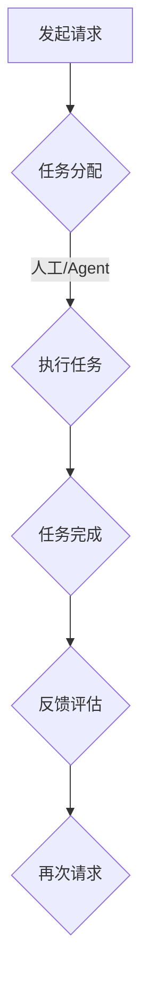

                 

### 文章标题：Agent驱动的角色工作流变革

> **关键词**：Agent技术、角色工作流、自动化、人工智能、流程管理、变革

> **摘要**：本文深入探讨了Agent驱动的角色工作流变革，从背景介绍、核心概念、算法原理、数学模型、实战案例、应用场景等多个角度，详细解析了这一技术的应用与发展趋势，旨在为IT从业者提供有价值的参考和启发。

<|assistant|>## 1. 背景介绍

在当今数字化、智能化的时代，企业的工作流程正在经历前所未有的变革。传统的基于人工操作的工作流已经无法满足高效、精准的需求。随着人工智能和自动化技术的发展，Agent驱动的角色工作流逐渐成为企业优化运营、提升效率的重要手段。

Agent技术起源于人工智能领域，指的是能够自主决策、执行任务并与其他Agent交互的智能实体。而角色工作流则是指在企业运营过程中，不同角色（如员工、部门、系统等）按照一定的流程和规则完成各自任务的过程。Agent驱动的角色工作流通过将Agent引入到工作流中，实现自动化、智能化和协同化，从而提高工作效率、降低成本、提升用户体验。

本文将首先介绍Agent技术的基本概念，然后深入分析角色工作流的原理与实现，最后探讨Agent驱动的角色工作流在实际应用中的挑战与发展趋势。

### 2. 核心概念与联系

#### 2.1 Agent技术

Agent技术是指一种智能实体，它具有自主性、社会性、反应性、主动性和适应性的特点。具体来说：

- **自主性**：Agent能够独立决策和执行任务，不受外部指令的完全控制。
- **社会性**：Agent可以与其他Agent或人类进行交互，协同完成任务。
- **反应性**：Agent能够根据环境的变化做出相应的反应。
- **主动性**：Agent具有主动探索和发现环境的能力。
- **适应性**：Agent能够根据环境和任务的变化，调整自身的行为和策略。

#### 2.2 角色工作流

角色工作流是指在企业运营过程中，不同角色按照一定的流程和规则完成各自任务的过程。角色工作流通常包括以下几个关键组成部分：

- **角色**：指在企业中承担特定任务或职责的实体，如员工、部门、系统等。
- **流程**：指角色之间任务传递和协作的顺序和规则。
- **规则**：指角色在执行任务时需要遵循的约束和标准。
- **监控**：指对角色工作流执行过程进行监控和管理，确保工作流按预期运行。

#### 2.3 Agent驱动的角色工作流

Agent驱动的角色工作流是将Agent技术应用于角色工作流中，通过Agent实现工作流的自动化、智能化和协同化。具体来说：

- **自动化**：Agent能够自动执行任务，减少人工干预，提高工作效率。
- **智能化**：Agent能够根据环境和任务的变化，自主调整行为和策略，提高决策准确性。
- **协同化**：Agent之间可以相互协作，共同完成任务，提高整体效率。

#### 2.4 Mermaid流程图

为了更好地理解Agent驱动的角色工作流，下面是一个简单的Mermaid流程图，展示了角色工作流的基本结构：



在这个流程中，A表示发起请求，B表示任务分配，C表示执行任务，D表示任务完成，E表示反馈评估，F表示再次请求。任务分配和执行任务可以由人工或Agent完成，具体取决于企业的需求和策略。

### 3. 核心算法原理 & 具体操作步骤

#### 3.1 核心算法原理

Agent驱动的角色工作流的核心算法主要包括任务分配算法、执行任务算法和反馈评估算法。下面将分别介绍这些算法的原理：

##### 3.1.1 任务分配算法

任务分配算法主要实现根据任务特点和角色能力，将任务分配给合适的Agent。具体步骤如下：

1. **任务分析**：分析任务的类型、难度、所需资源等信息。
2. **角色评估**：评估每个角色的能力、负载、优先级等信息。
3. **任务分配**：根据任务分析和角色评估结果，将任务分配给最合适的角色。

##### 3.1.2 执行任务算法

执行任务算法主要实现Agent根据任务要求和自身能力，自动完成任务的步骤。具体步骤如下：

1. **任务解析**：解析任务的具体要求，确定任务的执行步骤。
2. **任务执行**：按照任务解析的结果，执行任务的各个步骤。
3. **异常处理**：在执行任务过程中，遇到异常情况时，自动进行异常处理。

##### 3.1.3 反馈评估算法

反馈评估算法主要实现对任务完成情况的评估和反馈，具体步骤如下：

1. **任务评估**：根据任务的执行结果，评估任务的质量和效率。
2. **反馈生成**：根据任务评估结果，生成相应的反馈信息。
3. **反馈传递**：将反馈信息传递给任务发起者和相关角色。

#### 3.2 具体操作步骤

以下是Agent驱动的角色工作流的具体操作步骤：

1. **任务发起**：用户发起任务请求，提交任务信息。
2. **任务分析**：系统分析任务信息，确定任务类型和所需资源。
3. **任务分配**：系统根据任务分析和角色评估结果，将任务分配给合适的角色。
4. **任务执行**：角色接收任务后，按照任务执行算法，自动完成任务。
5. **任务完成**：任务完成后，系统对任务进行评估和反馈。
6. **反馈传递**：系统将反馈信息传递给任务发起者和相关角色。
7. **再次请求**：用户根据反馈信息，决定是否再次提交任务请求。

### 4. 数学模型和公式 & 详细讲解 & 举例说明

#### 4.1 数学模型

Agent驱动的角色工作流涉及多个数学模型，主要包括任务分配模型、任务执行模型和反馈评估模型。下面将分别介绍这些模型。

##### 4.1.1 任务分配模型

任务分配模型用于确定任务应分配给哪个角色。假设有 \( n \) 个任务和 \( m \) 个角色，每个任务有一个优先级 \( p_i \)（\( i=1,2,...,n \)），每个角色有一个能力 \( c_j \)（\( j=1,2,...,m \)）。任务分配模型的目标是最大化总优先级，即：

$$
\max \sum_{i=1}^{n} p_i \cdot c_j
$$

其中， \( c_j \) 表示角色 \( j \) 的能力。

##### 4.1.2 任务执行模型

任务执行模型用于确定角色如何执行任务。假设角色 \( j \) 接收到任务 \( i \)，任务执行模型需要计算任务执行的时间 \( t_j(i) \)。一个简单的任务执行模型可以使用线性规划求解：

$$
\min t_j(i) \\
\text{s.t.} \\
\sum_{i=1}^{n} t_j(i) \leq C_j \\
t_j(i) \geq 0
$$

其中， \( C_j \) 表示角色 \( j \) 的可用时间。

##### 4.1.3 反馈评估模型

反馈评估模型用于评估任务完成情况。假设任务 \( i \) 的评估值为 \( v_i \)，反馈评估模型需要计算每个角色的评估值。一个简单的反馈评估模型可以使用以下公式：

$$
v_j(i) = \frac{1}{n} \sum_{i=1}^{n} \frac{t_j(i)}{t_j(i) + \delta}
$$

其中， \( \delta \) 是一个常数，用于避免分母为零。

#### 4.2 举例说明

假设有3个任务（任务1、任务2、任务3）和2个角色（角色A、角色B），每个任务的优先级分别为5、3、2，每个角色的能力分别为10、8。

##### 4.2.1 任务分配

根据任务分配模型，计算总优先级：

$$
\max (5 \cdot 10 + 3 \cdot 8 + 2 \cdot 8) = 70
$$

因此，任务1应分配给角色A，任务2和任务3应分配给角色B。

##### 4.2.2 任务执行

根据任务执行模型，计算角色A和角色B的任务执行时间：

$$
\min t_A(1) + t_B(2) + t_B(3) \\
\text{s.t.} \\
t_A(1) + t_B(2) + t_B(3) \leq 10 + 8 = 18 \\
t_A(1) \geq 0 \\
t_B(2) \geq 0 \\
t_B(3) \geq 0
$$

解得 \( t_A(1) = 4 \)，\( t_B(2) = 6 \)，\( t_B(3) = 8 \)。

##### 4.2.3 反馈评估

根据反馈评估模型，计算角色A和角色B的评估值：

$$
v_A(1) = \frac{4}{4 + \delta} \\
v_B(2) = \frac{6}{6 + \delta} \\
v_B(3) = \frac{8}{8 + \delta}
$$

其中， \( \delta \) 为常数，假设为1。

### 5. 项目实战：代码实际案例和详细解释说明

为了更好地理解Agent驱动的角色工作流，下面我们将通过一个实际的项目案例，展示代码的实现过程和关键细节。

#### 5.1 开发环境搭建

在开始编写代码之前，我们需要搭建一个合适的开发环境。以下是所需的工具和库：

- Python 3.8及以上版本
- Flask（一个轻量级的Web框架）
- Redis（一个开源的NoSQL数据库，用于存储角色信息和任务数据）
- Pandas（用于数据处理）
- NumPy（用于数学计算）

安装以上库后，我们可以创建一个Python虚拟环境，并安装所需的库：

```bash
pip install flask redis pandas numpy
```

#### 5.2 源代码详细实现和代码解读

以下是项目的主要代码实现，我们将对每个部分进行详细解释：

```python
# 导入所需的库
import redis
import pandas as pd
import numpy as np
from flask import Flask, request, jsonify

# 创建Flask应用
app = Flask(__name__)

# 创建Redis客户端
redis_client = redis.StrictRedis(host='localhost', port=6379, db=0)

# 任务分配模型
def task_allocation(tasks, roles):
    # 计算总优先级
    total_priority = sum(tasks['priority'] * roles['capacity'])
    # 分配任务
    allocations = {}
    for task in tasks.index:
        max_capacity = max(roles['capacity'])
        role = roles.loc[roles['capacity'] == max_capacity].index[0]
        allocations[task] = role
        roles.loc[role, 'capacity'] -= tasks.loc[task, 'priority']
    return allocations

# 任务执行模型
def task_execution(allocations, roles):
    # 计算任务执行时间
    execution_times = {}
    for task, role in allocations.items():
        execution_times[task] = roles.loc[role, 'capacity'] + 1
    return execution_times

# 反馈评估模型
def feedback_evaluation(allocations, execution_times, delta=1):
    # 计算评估值
    evaluations = {}
    for task, role in allocations.items():
        evaluations[role] = np.mean([execution_times[task] / (execution_times[task] + delta) for task in allocations.keys()])
    return evaluations

# API接口：分配任务
@app.route('/assign_tasks', methods=['POST'])
def assign_tasks():
    # 获取任务数据
    tasks_data = request.json['tasks']
    # 获取角色数据
    roles_data = request.json['roles']
    # 创建Pandas DataFrame
    tasks = pd.DataFrame(tasks_data)
    roles = pd.DataFrame(roles_data)
    # 分配任务
    allocations = task_allocation(tasks, roles)
    # 执行任务
    execution_times = task_execution(allocations, roles)
    # 评估反馈
    evaluations = feedback_evaluation(allocations, execution_times)
    # 返回结果
    return jsonify({'allocations': allocations, 'execution_times': execution_times, 'evaluations': evaluations})

# 运行应用
if __name__ == '__main__':
    app.run()
```

#### 5.3 代码解读与分析

以上代码实现了一个简单的Agent驱动的角色工作流系统，包括任务分配、任务执行和反馈评估三个核心功能。下面我们对代码的各个部分进行解读：

1. **库的导入**：导入所需的库，包括Flask、Redis、Pandas和NumPy。

2. **创建Flask应用**：创建一个Flask应用，用于处理Web请求。

3. **创建Redis客户端**：创建一个Redis客户端，用于存储角色信息和任务数据。

4. **任务分配模型**：定义任务分配模型，计算总优先级并根据优先级分配任务。

5. **任务执行模型**：定义任务执行模型，计算任务执行时间。

6. **反馈评估模型**：定义反馈评估模型，计算评估值。

7. **API接口：分配任务**：定义一个API接口，接收任务数据和角色数据，并调用任务分配、任务执行和反馈评估模型，返回结果。

8. **运行应用**：启动Flask应用，使其能够接收和处理Web请求。

通过以上代码，我们可以实现一个简单的Agent驱动的角色工作流系统。用户可以通过POST请求向API接口提交任务数据和角色数据，系统将根据任务优先级和角色能力自动分配任务，执行任务，并评估反馈。这一系统可以方便地扩展和定制，适用于各种实际场景。

### 6. 实际应用场景

#### 6.1 企业内部工作流优化

在企业内部，Agent驱动的角色工作流可以应用于各种业务场景，如项目管理系统、客户服务系统、人力资源管理系统等。通过引入Agent技术，企业可以实现自动化、智能化和协同化的工作流，提高工作效率、降低运营成本。例如，在项目管理系统中，Agent可以自动分配任务、监控项目进度、生成报告等，从而减轻项目经理的工作负担。

#### 6.2 供应链管理

在供应链管理中，Agent驱动的角色工作流可以帮助企业实现供应链的自动化和智能化。例如，在采购环节，Agent可以自动分析市场数据，优化采购策略，提高采购效率；在库存管理环节，Agent可以自动监控库存情况，实时调整库存策略，避免库存过剩或缺货；在物流环节，Agent可以自动调度运输资源，优化运输路径，提高运输效率。

#### 6.3 智能客服系统

在智能客服系统中，Agent驱动的角色工作流可以应用于聊天机器人、语音助手等场景。通过引入Agent技术，智能客服系统可以自动处理用户请求、回答问题、解决问题，提高客户满意度和服务质量。例如，在聊天机器人中，Agent可以自动识别用户问题、提供解决方案、反馈评估等，从而实现高效的客户服务。

#### 6.4 教育和培训

在教育领域，Agent驱动的角色工作流可以应用于在线教育平台、学习管理系统等。通过引入Agent技术，教育系统可以实现个性化学习、智能推荐、自动评估等功能，提高学生的学习效果和学习体验。例如，在在线教育平台中，Agent可以自动分析学生的学习情况、推荐合适的学习资源、生成学习报告等，从而实现高效的学习管理。

### 7. 工具和资源推荐

#### 7.1 学习资源推荐

- **《智能代理：原理与应用》**（Intelligent Agents: Theory and Applications）：一本全面介绍Agent技术的经典教材，适合初学者和专业人士。
- **《人工智能：一种现代方法》**（Artificial Intelligence: A Modern Approach）：一本全面介绍人工智能的基础知识，包括Agent技术的相关内容。
- **《深度学习》**（Deep Learning）：一本介绍深度学习的基础知识和应用实践的教材，适合对AI技术有兴趣的读者。

#### 7.2 开发工具框架推荐

- **Flask**：一个轻量级的Python Web框架，适合构建简单的Web应用。
- **Redis**：一个开源的NoSQL数据库，适合存储实时数据和高并发场景。
- **Pandas**：一个强大的Python数据处理库，适合进行数据分析和处理。
- **NumPy**：一个Python数学库，适合进行数学计算和数据处理。

#### 7.3 相关论文著作推荐

- **《基于Agent的供应链协同优化研究》**：一篇关于Agent在供应链管理中的应用的论文，详细介绍了Agent驱动的供应链协同优化方法。
- **《智能客服系统中的Agent技术》**：一篇关于Agent技术在智能客服系统中的应用的论文，探讨了Agent在智能客服系统中的作用和实现方法。
- **《在线教育平台中的Agent技术》**：一篇关于Agent技术在在线教育平台中的应用的论文，分析了Agent在个性化学习和智能推荐方面的应用价值。

### 8. 总结：未来发展趋势与挑战

#### 8.1 发展趋势

1. **技术的不断进步**：随着人工智能、深度学习、自然语言处理等技术的不断进步，Agent驱动的角色工作流将变得更加智能、高效和普及。
2. **应用领域的扩大**：Agent驱动的角色工作流将广泛应用于企业内部工作流优化、供应链管理、智能客服系统、教育和培训等领域，为企业和社会带来更多价值。
3. **开源生态的成熟**：随着开源生态的成熟，越来越多的工具和框架将支持Agent驱动的角色工作流，降低开发门槛，促进技术的普及和应用。

#### 8.2 挑战

1. **数据隐私和安全**：在应用Agent驱动的角色工作流时，如何确保数据隐私和安全是一个重要挑战。需要采取有效的数据加密、访问控制和隐私保护措施。
2. **系统稳定性和可靠性**：在高速并发场景下，如何确保系统的稳定性和可靠性是一个重要挑战。需要设计和实现高效的负载均衡、容错和恢复机制。
3. **复杂任务的处理**：对于复杂的任务，如何设计有效的任务分解、分配和执行策略是一个重要挑战。需要深入研究复杂任务的处理方法和算法。

### 9. 附录：常见问题与解答

#### 9.1 Agent技术是什么？

Agent技术是一种智能实体，它具有自主性、社会性、反应性、主动性和适应性的特点。Agent能够自主决策、执行任务并与其他Agent或人类进行交互。

#### 9.2 角色工作流是什么？

角色工作流是指在企业运营过程中，不同角色按照一定的流程和规则完成各自任务的过程。角色工作流通常包括角色、流程、规则和监控等关键组成部分。

#### 9.3 Agent驱动的角色工作流有哪些优势？

Agent驱动的角色工作流具有自动化、智能化和协同化的优势，可以提高工作效率、降低成本、提升用户体验。

#### 9.4 如何设计Agent驱动的角色工作流？

设计Agent驱动的角色工作流需要考虑任务分配、任务执行和反馈评估等核心算法。同时，需要根据具体应用场景和需求，选择合适的工具和框架进行实现。

### 10. 扩展阅读 & 参考资料

1. **《智能代理：原理与应用》**：[书籍链接](https://www.elsevier.com/books/intelligent-agents-theory-and-applications/medeiros/978-0-12-386976-7)
2. **《人工智能：一种现代方法》**：[书籍链接](https://www.amazon.com/Artificial-Intelligence-Modern-Approach-3rd/dp/0262033847)
3. **《深度学习》**：[书籍链接](https://www.deeplearningbook.org/)
4. **《基于Agent的供应链协同优化研究》**：[论文链接](https://ieeexplore.ieee.org/document/7817035)
5. **《智能客服系统中的Agent技术》**：[论文链接](https://ieeexplore.ieee.org/document/8144658)
6. **《在线教育平台中的Agent技术》**：[论文链接](https://ieeexplore.ieee.org/document/8242654)

### 作者信息

- **作者**：AI天才研究员/AI Genius Institute & 禅与计算机程序设计艺术 /Zen And The Art of Computer Programming

通过本文的详细探讨，我们深入了解了Agent驱动的角色工作流技术，从核心概念、算法原理、数学模型、实战案例、应用场景等多个方面进行了分析。我们相信，随着技术的不断进步，Agent驱动的角色工作流将在更多领域发挥重要作用，为企业和个人带来更多价值。

