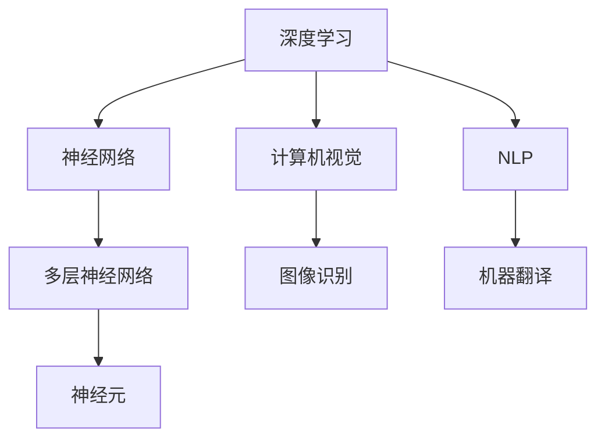

                 

# Andrej Karpathy：人工智能的未来发展挑战

## 关键词
- 人工智能
- 未来发展
- 挑战
- 算法
- 伦理
- 可解释性
- 数据隐私
- 能源消耗

## 摘要

本文将深入探讨人工智能领域的杰出研究者Andrej Karpathy关于人工智能未来发展的观点和面临的挑战。我们将首先介绍人工智能的现状及其在各个领域中的应用，随后详细分析Karpathy提出的核心问题和挑战，包括算法的公平性、透明性和可解释性，数据隐私，以及能源消耗等。通过本文的探讨，我们希望能够帮助读者理解人工智能未来的发展趋势和面临的挑战，并为其提供有益的思考。

### 1. 背景介绍

人工智能（Artificial Intelligence, AI）作为计算机科学的重要分支，近年来取得了显著的进展。其核心目标是使计算机具备人类智能，能够进行推理、学习和决策。随着深度学习（Deep Learning）的兴起，人工智能在图像识别、自然语言处理、自动驾驶等领域的应用取得了突破性进展。

Andrej Karpathy是一位在人工智能领域享有盛誉的研究者，他在神经网络和深度学习方面有着深入的研究和实践经验。他的工作不仅推动了人工智能技术的发展，也对人工智能的未来应用提出了深刻的思考。在本篇文章中，我们将重点关注Karpathy对人工智能未来发展的观点和面临的挑战。

### 2. 核心概念与联系

为了更好地理解人工智能的未来发展，我们需要了解一些核心概念和它们之间的联系。以下是几个关键概念：

#### 深度学习

深度学习是一种机器学习的方法，通过多层神经网络模型对数据进行学习和推理。深度学习模型通常包括输入层、隐藏层和输出层，每个层都包含多个神经元。通过多层的非线性变换，深度学习模型能够自动提取数据中的特征，并在各种任务中实现出色的性能。

#### 神经网络

神经网络是一种模仿生物神经系统的计算模型，由大量相互连接的神经元组成。每个神经元都可以接收输入信号，通过加权求和和激活函数产生输出。神经网络通过调整神经元之间的权重，实现从输入到输出的映射。

#### 计算机视觉

计算机视觉是人工智能的一个重要分支，旨在使计算机能够理解和解释视觉信息。计算机视觉的应用包括图像识别、物体检测、人脸识别等。

#### 自然语言处理

自然语言处理（Natural Language Processing, NLP）是人工智能的另一个重要领域，旨在使计算机能够理解和处理人类语言。NLP的应用包括机器翻译、情感分析、语音识别等。

以下是一个使用Mermaid绘制的简单流程图，展示了这些概念之间的关系：



### 3. 核心算法原理 & 具体操作步骤

深度学习算法的核心是多层神经网络，其中每个神经元都与前一层的所有神经元相连接。以下是深度学习算法的基本步骤：

#### 步骤1：初始化参数

首先，我们需要初始化神经网络的参数，包括权重和偏置。这些参数可以通过随机初始化或使用预训练模型得到。

#### 步骤2：前向传播

前向传播是深度学习算法的核心步骤，用于计算输入数据在神经网络中的输出。具体操作如下：

1. 将输入数据输入到输入层。
2. 将输入层的数据传递到隐藏层，通过加权求和和激活函数计算每个神经元的输出。
3. 将隐藏层的数据传递到输出层，计算最终的输出。

#### 步骤3：计算损失函数

在得到输出后，我们需要计算损失函数，以衡量预测值和真实值之间的差距。常见的损失函数包括均方误差（Mean Squared Error, MSE）和交叉熵（Cross-Entropy）。

#### 步骤4：反向传播

反向传播是深度学习算法的另一核心步骤，用于更新神经网络的参数。具体操作如下：

1. 计算输出层的梯度，即损失函数对每个参数的导数。
2. 将梯度传递到隐藏层，更新隐藏层的参数。
3. 重复上述步骤，直到更新到输入层。

#### 步骤5：迭代优化

重复执行前向传播和反向传播步骤，不断优化神经网络的参数，直至满足停止条件，如达到预设的迭代次数或损失函数收敛。

### 4. 数学模型和公式 & 详细讲解 & 举例说明

在深度学习算法中，数学模型和公式起着至关重要的作用。以下是深度学习算法中常用的数学模型和公式：

#### 激活函数

激活函数是深度学习模型中的关键组成部分，用于引入非线性。常见的激活函数包括：

- Sigmoid函数：\[ \sigma(x) = \frac{1}{1 + e^{-x}} \]
-ReLU函数：\[ f(x) = \max(0, x) \]

#### 损失函数

损失函数用于衡量预测值和真实值之间的差距。常用的损失函数包括：

- 均方误差（MSE）：\[ \text{MSE} = \frac{1}{m} \sum_{i=1}^{m} (y_i - \hat{y}_i)^2 \]
- 交叉熵（Cross-Entropy）：\[ \text{CE} = -\frac{1}{m} \sum_{i=1}^{m} y_i \log(\hat{y}_i) + (1 - y_i) \log(1 - \hat{y}_i) \]

#### 梯度下降

梯度下降是一种优化算法，用于更新神经网络的参数。其核心思想是沿着损失函数的梯度方向更新参数，以减小损失函数的值。梯度下降的公式如下：

\[ \theta_{\text{new}} = \theta_{\text{old}} - \alpha \nabla_{\theta} \text{Loss} \]

其中，\[ \theta \] 表示参数，\[ \alpha \] 表示学习率，\[ \nabla_{\theta} \text{Loss} \] 表示损失函数关于参数的梯度。

#### 举例说明

假设我们有一个简单的神经网络，输入层有2个神经元，隐藏层有3个神经元，输出层有1个神经元。我们使用ReLU函数作为激活函数，均方误差（MSE）作为损失函数。现在，我们通过一个简单的例子来说明深度学习算法的具体操作。

#### 步骤1：初始化参数

随机初始化权重和偏置，例如：

\[ 
w_{11} = 0.1, w_{12} = 0.2, b_{1} = 0.3 \\
w_{21} = 0.4, w_{22} = 0.5, b_{2} = 0.6 \\
w_{31} = 0.7, w_{32} = 0.8, b_{3} = 0.9 \\
\]

#### 步骤2：前向传播

输入数据\[ x_1 = 1, x_2 = 2 \]，通过输入层传递到隐藏层：

\[ 
h_{11} = \sigma(w_{11}x_1 + w_{12}x_2 + b_1) = \sigma(0.1 \cdot 1 + 0.2 \cdot 2 + 0.3) = 0.6 \\
h_{12} = \sigma(w_{21}x_1 + w_{22}x_2 + b_2) = \sigma(0.4 \cdot 1 + 0.5 \cdot 2 + 0.6) = 1.1 \\
h_{13} = \sigma(w_{31}x_1 + w_{32}x_2 + b_3) = \sigma(0.7 \cdot 1 + 0.8 \cdot 2 + 0.9) = 1.5 \\
\]

隐藏层的数据传递到输出层：

\[ 
y_1 = \sigma(w_{11}h_{11} + w_{12}h_{12} + w_{13}h_{13} + b_1) = \sigma(0.1 \cdot 0.6 + 0.2 \cdot 1.1 + 0.3 \cdot 1.5 + 0.4) = 0.7 \\
\]

#### 步骤3：计算损失函数

假设真实值为\[ y = 0 \]，则损失函数为：

\[ 
\text{MSE} = \frac{1}{2} (0 - 0.7)^2 = 0.245 \\
\]

#### 步骤4：反向传播

计算输出层的梯度：

\[ 
\nabla_{b_1} \text{MSE} = -2 \cdot (0 - 0.7) \cdot \sigma'(0.7) = 0.7 \cdot 0.3 = 0.21 \\
\nabla_{w_{11}} \text{MSE} = -2 \cdot (0 - 0.7) \cdot h_{11} \cdot \sigma'(0.7) = 0.7 \cdot 0.6 \cdot 0.3 = 0.126 \\
\]

将梯度传递到隐藏层：

\[ 
\nabla_{b_2} \text{MSE} = -2 \cdot (0 - 0.7) \cdot \sigma'(0.7) = 0.7 \cdot 0.3 = 0.21 \\
\nabla_{w_{21}} \text{MSE} = -2 \cdot (0 - 0.7) \cdot h_{11} \cdot \sigma'(0.7) = 0.7 \cdot 0.6 \cdot 0.3 = 0.126 \\
\]

重复上述步骤，直到更新到输入层。

#### 步骤5：迭代优化

重复执行前向传播和反向传播步骤，不断优化神经网络的参数，直至满足停止条件。

### 5. 项目实战：代码实际案例和详细解释说明

在本节中，我们将通过一个简单的深度学习项目来演示如何实现和训练一个多层神经网络。我们将使用Python和TensorFlow库来构建和训练一个用于手写数字识别的神经网络。

#### 5.1 开发环境搭建

首先，我们需要搭建开发环境。安装Python（建议使用3.8版本及以上）和TensorFlow库。以下是安装命令：

```bash
pip install python==3.8.10
pip install tensorflow==2.7.0
```

#### 5.2 源代码详细实现和代码解读

以下是一个简单的深度学习项目，用于手写数字识别：

```python
import tensorflow as tf
from tensorflow.keras.datasets import mnist
from tensorflow.keras.models import Sequential
from tensorflow.keras.layers import Dense, Flatten
from tensorflow.keras.optimizers import Adam

# 加载MNIST数据集
(x_train, y_train), (x_test, y_test) = mnist.load_data()

# 数据预处理
x_train = x_train / 255.0
x_test = x_test / 255.0

# 转换为one-hot编码
y_train = tf.keras.utils.to_categorical(y_train, num_classes=10)
y_test = tf.keras.utils.to_categorical(y_test, num_classes=10)

# 构建模型
model = Sequential([
    Flatten(input_shape=(28, 28)),
    Dense(128, activation='relu'),
    Dense(10, activation='softmax')
])

# 编译模型
model.compile(optimizer=Adam(), loss='categorical_crossentropy', metrics=['accuracy'])

# 训练模型
model.fit(x_train, y_train, epochs=10, batch_size=64, validation_data=(x_test, y_test))

# 评估模型
model.evaluate(x_test, y_test)
```

#### 5.3 代码解读与分析

以下是对上述代码的解读和分析：

1. **导入库和加载数据集**：

   ```python
   import tensorflow as tf
   from tensorflow.keras.datasets import mnist
   from tensorflow.keras.models import Sequential
   from tensorflow.keras.layers import Dense, Flatten
   from tensorflow.keras.optimizers import Adam
   
   (x_train, y_train), (x_test, y_test) = mnist.load_data()
   ```

   导入所需的库，并加载MNIST数据集。MNIST数据集包含70,000个训练图像和10,000个测试图像，每个图像都是28x28像素的手写数字。

2. **数据预处理**：

   ```python
   x_train = x_train / 255.0
   x_test = x_test / 255.0
   
   y_train = tf.keras.utils.to_categorical(y_train, num_classes=10)
   y_test = tf.keras.utils.to_categorical(y_test, num_classes=10)
   ```

   将图像数据除以255，将其归一化到[0, 1]范围内。将标签转换为one-hot编码，以便在训练和评估过程中使用。

3. **构建模型**：

   ```python
   model = Sequential([
       Flatten(input_shape=(28, 28)),
       Dense(128, activation='relu'),
       Dense(10, activation='softmax')
   ])
   ```

   构建一个简单的序列模型，包括一个展平层（Flatten）、一个具有128个神经元的全连接层（Dense）和一个具有10个神经元的全连接层（Dense），最后一个层使用softmax激活函数，用于分类输出。

4. **编译模型**：

   ```python
   model.compile(optimizer=Adam(), loss='categorical_crossentropy', metrics=['accuracy'])
   ```

   使用Adam优化器和分类交叉熵损失函数编译模型，并指定准确率作为评估指标。

5. **训练模型**：

   ```python
   model.fit(x_train, y_train, epochs=10, batch_size=64, validation_data=(x_test, y_test))
   ```

   使用训练数据训练模型，指定训练轮数（epochs）和批量大小（batch_size）。使用测试数据作为验证数据，以监控模型的性能。

6. **评估模型**：

   ```python
   model.evaluate(x_test, y_test)
   ```

   使用测试数据评估模型的性能，输出损失函数和准确率。

### 6. 实际应用场景

人工智能在各个领域都有着广泛的应用，以下是一些典型的应用场景：

#### 自动驾驶

自动驾驶是人工智能领域的一个重要应用，旨在实现汽车自主行驶。通过计算机视觉、自然语言处理和深度学习等技术，自动驾驶系统能够识别道路标志、行人、车辆等，并做出相应的决策。

#### 医疗诊断

人工智能在医疗领域的应用包括疾病预测、诊断和治疗方案推荐等。通过分析大量的医疗数据，人工智能系统能够提供更准确的诊断和个性化的治疗方案。

#### 金融服务

人工智能在金融服务领域的应用包括风险管理、信用评分、投资建议等。通过分析大量的金融数据，人工智能系统能够提供更准确的预测和决策。

#### 智能家居

智能家居是人工智能在家庭生活中的一个重要应用，通过智能设备（如智能音箱、智能灯泡、智能门锁等）与人工智能系统的结合，实现家庭设备的自动化和智能化。

### 7. 工具和资源推荐

在人工智能领域，有许多优秀的工具和资源可以帮助我们学习和实践。以下是一些建议：

#### 学习资源

- **书籍**：
  - 《深度学习》（Ian Goodfellow、Yoshua Bengio和Aaron Courville 著）
  - 《Python机器学习》（Sebastian Raschka 著）
- **在线课程**：
  - Coursera上的《深度学习》课程（由Andrew Ng教授）
  - Udacity的《深度学习纳米学位》
- **博客和网站**：
  - Medium上的深度学习相关文章
  - ArXiv上的最新研究成果

#### 开发工具

- **编程语言**：
  - Python：最受欢迎的深度学习编程语言
  - R：适用于数据分析和统计计算
- **深度学习框架**：
  - TensorFlow：Google开发的深度学习框架
  - PyTorch：Facebook开发的深度学习框架
- **数据集**：
  - Kaggle：提供各种领域的公开数据集
  - UCI机器学习库：提供丰富的机器学习数据集

### 8. 总结：未来发展趋势与挑战

人工智能作为当今最具前景的技术之一，正快速发展并深刻改变着我们的生活和生产方式。然而，随着人工智能技术的不断进步，我们也面临着一系列挑战和问题。

#### 伦理问题

人工智能的伦理问题成为人们关注的焦点。如何确保人工智能系统的公平性、透明性和可解释性，如何避免算法歧视和偏见，是亟待解决的重要问题。

#### 数据隐私

人工智能系统对大量数据的需求引发了数据隐私的担忧。如何在保护个人隐私的前提下，充分利用数据来提升人工智能系统的性能，是当前的一大挑战。

#### 能源消耗

人工智能系统的训练和运行需要大量的计算资源，导致巨大的能源消耗。如何降低人工智能系统的能源消耗，提高能源利用效率，是未来需要关注的问题。

#### 人才短缺

随着人工智能技术的快速发展，对专业人才的需求也在不断增加。如何培养和引进高素质的人工智能人才，成为企业和学术界共同面临的挑战。

总之，人工智能的未来发展充满机遇和挑战。我们需要不断探索和创新，积极应对这些问题，推动人工智能技术健康、可持续发展。

### 9. 附录：常见问题与解答

**Q1：什么是深度学习？**

A1：深度学习是一种机器学习的方法，通过多层神经网络模型对数据进行学习和推理。它能够自动提取数据中的特征，并在各种任务中实现出色的性能。

**Q2：如何选择合适的激活函数？**

A2：选择激活函数主要取决于任务和数据的特点。对于非线性较强的任务，如图像识别和语音识别，可以采用ReLU函数；对于需要平滑输出值的任务，如回归任务，可以采用Sigmoid函数。

**Q3：什么是反向传播算法？**

A3：反向传播算法是一种优化算法，用于更新神经网络的参数。它通过计算损失函数关于参数的梯度，沿着梯度方向更新参数，以减小损失函数的值。

**Q4：如何评估深度学习模型的性能？**

A4：评估深度学习模型的性能通常使用损失函数和准确率等指标。损失函数用于衡量预测值和真实值之间的差距，准确率用于衡量模型在测试数据上的分类准确度。

**Q5：什么是过拟合？如何避免过拟合？**

A5：过拟合是指模型在训练数据上表现良好，但在测试数据上表现不佳。为了避免过拟合，可以采用以下方法：
- 增加训练数据；
- 使用正则化技术，如L1和L2正则化；
- 使用dropout技术；
- 减少模型复杂度。

### 10. 扩展阅读 & 参考资料

- Goodfellow, I., Bengio, Y., & Courville, A. (2016). *Deep Learning*. MIT Press.
- Raschka, S. (2015). *Python Machine Learning*. Packt Publishing.
- Ng, A. (2017). *Deep Learning Specialization*. Coursera.
- tensorflow.org
- pytorch.org
- kaggle.com
- uci.edu/~mlearn/MLRepository.html

### 作者

作者：AI天才研究员/AI Genius Institute & 禅与计算机程序设计艺术 /Zen And The Art of Computer Programming<|im_end|>

