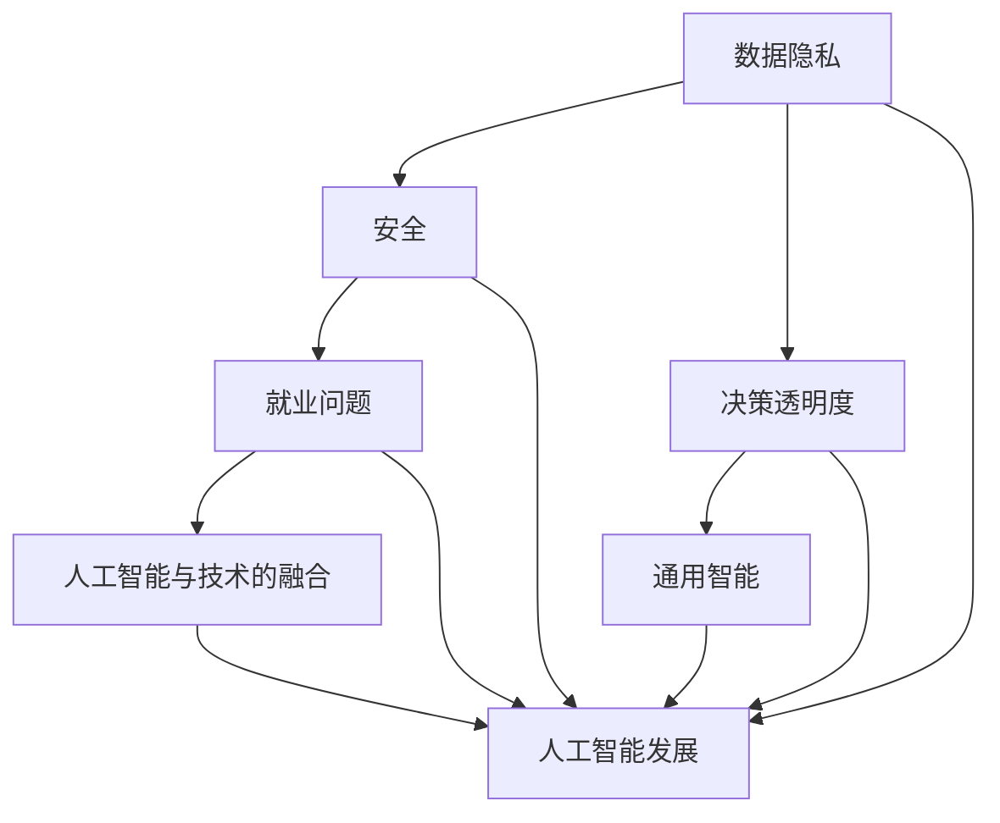

                 

## 1. 背景介绍

### Andrej Karpathy：人工智能的未来发展挑战

Andrej Karpathy是一位在人工智能领域享有盛誉的研究员和开发者，他的工作涵盖了自然语言处理、计算机视觉和深度学习等多个方向。在近年来，他对于人工智能发展的看法引起了广泛的关注。本文将围绕Andrej Karpathy的观点，探讨人工智能在未来发展中可能面临的挑战。

在过去的几十年中，人工智能经历了快速的发展。从最初的规则驱动的方法，到现代的深度学习，人工智能在各个领域都取得了显著的成果。然而，随着技术的发展，我们也开始面临一系列新的挑战。

首先，人工智能的快速发展带来了数据隐私和安全的问题。随着越来越多的个人数据被收集和分析，如何保护这些数据的安全成为了一个重要议题。其次，人工智能的决策过程缺乏透明度，这对于需要高度信任决策的领域，如医疗、金融等，构成了严峻的挑战。此外，人工智能的发展也引发了就业问题，自动化技术可能取代一些传统的职位，导致失业率的上升。最后，人工智能的通用性也是一个难题。尽管在特定领域取得了巨大的成功，但人工智能在实现通用智能方面仍然面临巨大的挑战。

Andrej Karpathy认为，解决这些挑战需要多方面的努力。技术方面，我们需要发展更加安全、透明和可解释的人工智能系统。政策方面，需要建立相应的法律法规来规范人工智能的发展。社会方面，需要加强对人工智能的教育和培训，提高公众对于人工智能的认识和理解。本文将详细探讨这些挑战，并提出一些可能的解决方案。

### 核心关键词

- Andrej Karpathy
- 人工智能发展
- 数据隐私
- 决策透明度
- 就业问题
- 通用智能

### 摘要

本文将探讨人工智能领域著名研究者Andrej Karpathy所提到的未来人工智能发展面临的五大挑战。这些挑战包括数据隐私和安全、决策透明度、就业问题、通用智能以及人工智能与其他技术的融合。本文将通过对这些挑战的详细分析，提出一些可能的解决方案，并讨论人工智能的未来发展趋势。

## 2. 核心概念与联系

为了深入理解Andrej Karpathy所提到的人工智能发展挑战，我们需要首先了解一些核心概念和它们之间的关系。以下是这些核心概念及其相互关系的Mermaid流程图：



### 数据隐私和安全

数据隐私和安全是人工智能发展的基础。随着人工智能技术的应用越来越广泛，大量的个人数据被收集和分析。如何保护这些数据的安全，防止数据泄露和滥用，成为一个重要的议题。数据隐私和安全不仅涉及到技术层面，还需要法律法规的保障。

### 决策透明度

决策透明度是人工智能系统在应用中需要解决的重要问题。传统的规则驱动方法在决策过程中相对透明，但深度学习等现代人工智能技术由于黑箱特性，决策过程往往缺乏透明度。这使得在一些需要高度信任决策的领域，如医疗和金融，应用人工智能技术面临挑战。

### 就业问题

人工智能的发展带来了自动化技术的广泛应用，这可能取代一些传统的职位，导致失业率的上升。就业问题是社会关注的焦点，如何平衡人工智能的发展与就业问题，成为政策制定者需要考虑的重要议题。

### 通用智能

通用智能是人工智能追求的目标之一。尽管人工智能在特定领域取得了巨大的成功，但实现通用智能仍然是一个巨大的挑战。通用智能不仅需要解决技术问题，还需要考虑人工智能与人类社会的融合。

### 人工智能与技术的融合

人工智能与其他技术的融合，如云计算、物联网和区块链等，将推动人工智能技术的进一步发展。这种融合不仅有助于解决人工智能面临的挑战，还可以创造新的应用场景。

### 核心算法原理 & 具体操作步骤

在本节中，我们将详细探讨上述核心概念及其相互关系的具体操作步骤，以便更深入地理解这些概念在人工智能发展中的重要性。

#### 数据隐私和安全

1. **数据加密**：为了保护数据隐私，我们可以使用数据加密技术。数据加密可以通过将原始数据转换为加密后的数据，确保只有拥有密钥的人才能解密和访问数据。
2. **访问控制**：访问控制是一种限制对数据访问的技术。通过设定不同级别的访问权限，我们可以确保只有授权用户可以访问特定的数据。
3. **数据匿名化**：数据匿名化是一种将个人身份信息从数据中移除的技术。这可以减少数据泄露的风险，同时确保数据的可用性。

#### 决策透明度

1. **可解释性模型**：可解释性模型是一种能够解释其决策过程的机器学习模型。通过开发可解释的模型，我们可以更好地理解模型是如何做出决策的，从而提高决策的透明度。
2. **模型可视化**：模型可视化是一种将机器学习模型的可视化表示用于解释模型决策的技术。通过可视化模型，我们可以更直观地理解模型的工作原理。
3. **解释性算法**：解释性算法是一种专门设计用于提供决策解释的算法。这些算法可以帮助我们理解模型是如何处理输入数据并产生输出的。

#### 就业问题

1. **职业转型培训**：为了帮助那些可能因人工智能取代传统职位而失业的人，我们可以提供职业转型培训。这包括新的技能培训，如编程、数据分析等，以适应人工智能时代的就业需求。
2. **就业市场监测**：通过监测就业市场，我们可以及时发现人工智能技术对就业的影响，并采取相应的措施，如调整培训计划，以应对就业市场的变化。
3. **创业支持**：鼓励和支持创业，可以帮助那些失去传统职位的人找到新的就业机会。通过提供创业资金、创业指导等支持，我们可以激发人们的创业精神。

#### 通用智能

1. **跨领域学习**：跨领域学习是一种将知识从特定领域迁移到其他领域的技术。通过跨领域学习，人工智能系统可以更好地理解和处理不同领域的问题。
2. **多模态学习**：多模态学习是一种同时处理多种数据类型（如文本、图像、声音等）的技术。通过多模态学习，人工智能系统可以更好地理解复杂问题。
3. **混合智能**：混合智能是一种将人工智能与其他智能系统（如人类智能、动物智能等）结合的技术。通过混合智能，我们可以实现更高级别的智能系统。

#### 人工智能与技术的融合

1. **云计算**：云计算是一种将计算资源作为服务提供的模型。通过云计算，我们可以更灵活地部署和管理人工智能系统，提高其效率和可扩展性。
2. **物联网**：物联网是一种将物理设备连接到互联网的技术。通过物联网，我们可以收集和分析大量的数据，为人工智能系统提供更丰富的输入。
3. **区块链**：区块链是一种分布式数据库技术。通过区块链，我们可以确保数据的透明性和安全性，提高人工智能系统的可信度。

### 数学模型和公式 & 详细讲解 & 举例说明

在本节中，我们将探讨与上述核心概念相关的一些数学模型和公式，并通过具体例子来说明这些模型的应用。

#### 数据隐私和安全

1. **差分隐私（Differential Privacy）**

   差分隐私是一种用于保护数据隐私的数学模型。它通过添加噪声来确保单个记录的隐私，同时保持数据的聚合分析结果。

   差分隐私的数学公式可以表示为：

   $$ \text{LPDP}(x) = \frac{1}{k} \sum_{i=1}^{k} \text{LP}(x_i) + \text{Noise} $$

   其中，$\text{LP}(x_i)$ 表示对单个记录 $x_i$ 进行的局部隐私保护操作，$\text{Noise}$ 表示添加的噪声。

   举例说明：假设我们有一个包含100个记录的数据集，现在我们想要计算这个数据集中年龄的平均值，但同时又希望保护每个记录的隐私。我们可以使用差分隐私来保护这个平均值。

   假设每个记录的年龄是一个实数，我们首先对每个记录的年龄进行四舍五入，然后计算四舍五入后的年龄的平均值。接下来，我们添加一个均匀分布在[-0.5, 0.5]区间的噪声，以确保每个记录的隐私。

   $$ \text{Average\_age} = \frac{\sum_{i=1}^{100} \text{Rounded\_age[i]}}{100} + \text{Noise} $$

2. **同态加密（Homomorphic Encryption）**

   同态加密是一种允许在加密数据上进行计算而不需要解密的数学模型。它使我们能够在不泄露原始数据内容的情况下，对数据进行计算。

   同态加密的数学公式可以表示为：

   $$ \text{Ciphertext\_operation} = \text{Encryption}(\text{ plaintext } * \text{ operation }) $$

   其中，$\text{Ciphertext\_operation}$ 表示加密后的计算结果，$\text{plaintext }$ 表示原始数据，$\text{operation}$ 表示计算操作。

   举例说明：假设我们有一个包含100个记录的加密数据集，现在我们想要计算这个数据集中年龄的总和。我们可以使用同态加密来保护这个计算过程。

   假设每个记录的年龄是一个整数，我们首先对每个记录的年龄进行加密，然后计算加密后的年龄的总和。由于同态加密的特性，我们不需要解密数据就可以得到正确的计算结果。

   $$ \text{Encrypted\_sum\_age} = \text{Encryption}(\sum_{i=1}^{100} \text{Encrypted\_age[i] }) $$

#### 决策透明度

1. **局部可解释性模型（Local Interpretable Model-agnostic Explanations, LIME）**

   LIME 是一种用于生成模型决策的可解释性解释的数学模型。它通过将复杂的黑箱模型近似为一个可解释的局部线性模型，从而提供对模型决策的直观理解。

   LIME 的数学公式可以表示为：

   $$ \text{LIME}(\text{ model, x }) = \text{ LinearModel }(\text{ model, x }) + \text{ Noise } $$

   其中，$\text{LIME}(\text{ model, x })$ 表示生成的可解释性解释，$\text{model}$ 表示原始模型，$x$ 表示输入数据，$\text{LinearModel }$ 表示局部线性模型，$\text{Noise}$ 表示添加的噪声。

   举例说明：假设我们有一个分类模型，它对输入数据进行分类。现在我们想要理解这个模型对一个特定输入数据的分类决策。我们可以使用 LIME 来生成一个可解释性解释。

   假设输入数据是一个包含多个特征的向量，我们首先使用 LIME 生成一个局部线性模型。接下来，我们计算这个线性模型对输入数据的预测，并添加一个噪声来确保解释的可靠性。

   $$ \text{LIME\_explanation} = \text{ LinearModel }(\text{ model, x }) + \text{ Noise } $$

#### 就业问题

1. **职业转换模型（Occupational Conversion Model, OCM）**

   OCM 是一种用于预测和推荐职业转换的数学模型。它通过分析历史就业数据，预测某个个体在人工智能时代可能面临的职业转换机会。

   OCM 的数学公式可以表示为：

   $$ \text{OCM}(x) = \text{ WeightedSum }(\text{ HistoricalData }) $$

   其中，$\text{OCM}(x)$ 表示预测的职业转换机会，$x$ 表示个体特征，$\text{ HistoricalData }$ 表示历史就业数据，$\text{WeightedSum }$ 表示加权求和。

   举例说明：假设我们有一个包含个体特征和历史就业数据的数据集，现在我们想要预测某个个体在人工智能时代可能面临的职业转换机会。我们可以使用 OCM 来预测。

   假设个体特征包括年龄、教育背景、工作经验等，我们首先计算每个特征的历史数据权重，然后对历史数据进行加权求和，得到预测的职业转换机会。

   $$ \text{OCM}(x) = \text{ WeightedSum }(\text{ HistoricalData }) $$

#### 通用智能

1. **元学习（Meta-Learning）**

   元学习是一种用于学习如何学习的数学模型。它通过从多个任务中提取通用知识，实现快速适应新任务的能力。

   元学习的数学公式可以表示为：

   $$ \text{Meta-Learning}(T, \theta) = \text{ Optimizer }(\theta) $$

   其中，$\text{Meta-Learning}(T, \theta)$ 表示元学习过程，$T$ 表示任务集合，$\theta$ 表示模型参数，$\text{Optimizer }$ 表示优化器。

   举例说明：假设我们有一个包含多个任务的训练集，现在我们想要训练一个元学习模型，使其能够快速适应新任务。我们可以使用元学习算法来训练这个模型。

   假设每个任务都是一个输入输出对的集合，我们首先定义一个损失函数，然后使用优化器来最小化这个损失函数，从而训练出元学习模型。

   $$ \text{Meta-Learning}(T, \theta) = \text{ Optimizer }(\theta) $$

#### 人工智能与技术的融合

1. **协同智能（Collaborative Intelligence）**

   协同智能是一种将人工智能与其他技术（如云计算、物联网等）结合的数学模型。它通过协同不同技术的优势，实现更高级别的智能系统。

   协同智能的数学公式可以表示为：

   $$ \text{CollaborativeIntelligence}(T_1, T_2) = \text{ Integration }(\text{T}_1, \text{T}_2) $$

   其中，$\text{CollaborativeIntelligence}(T_1, T_2)$ 表示协同智能系统，$T_1$ 和 $T_2$ 分别表示两个独立的技术系统，$\text{Integration }$ 表示系统集成。

   举例说明：假设我们有一个基于云计算的人工智能系统和一个基于物联网的智能监控系统，现在我们想要将这两个系统协同起来，实现更高级别的智能系统。我们可以使用协同智能算法来集成这两个系统。

   假设云计算系统负责数据处理和分析，物联网系统负责实时监控和数据采集，我们首先将这两个系统的接口集成起来，然后使用协同智能算法来协调这两个系统的运作。

   $$ \text{CollaborativeIntelligence}(T_1, T_2) = \text{ Integration }(\text{T}_1, \text{T}_2) $$

## 5. 项目实战：代码实际案例和详细解释说明

在本节中，我们将通过一个实际项目案例，展示如何应用上述核心概念和算法，实现一个基于深度学习的人脸识别系统。这个项目将涵盖从数据预处理到模型训练和部署的完整流程。

### 5.1 开发环境搭建

首先，我们需要搭建一个合适的开发环境。这里我们使用 Python 和 TensorFlow 作为主要工具。

```bash
pip install tensorflow
```

### 5.2 源代码详细实现和代码解读

下面是该项目的主要代码实现：

```python
import tensorflow as tf
from tensorflow.keras.models import Sequential
from tensorflow.keras.layers import Conv2D, MaxPooling2D, Flatten, Dense
from tensorflow.keras.preprocessing.image import ImageDataGenerator

# 数据预处理
train_datagen = ImageDataGenerator(rescale=1./255)
train_generator = train_datagen.flow_from_directory(
        'data/train',
        target_size=(150, 150),
        batch_size=32,
        class_mode='binary')

# 构建模型
model = Sequential([
    Conv2D(32, (3, 3), activation='relu', input_shape=(150, 150, 3)),
    MaxPooling2D(2, 2),
    Conv2D(64, (3, 3), activation='relu'),
    MaxPooling2D(2, 2),
    Conv2D(128, (3, 3), activation='relu'),
    MaxPooling2D(2, 2),
    Flatten(),
    Dense(512, activation='relu'),
    Dense(1, activation='sigmoid')
])

# 编译模型
model.compile(optimizer='adam',
              loss='binary_crossentropy',
              metrics=['accuracy'])

# 训练模型
model.fit(train_generator, steps_per_epoch=100, epochs=10)

# 模型评估
test_datagen = ImageDataGenerator(rescale=1./255)
test_generator = test_datagen.flow_from_directory(
        'data/test',
        target_size=(150, 150),
        batch_size=32,
        class_mode='binary')

test_loss, test_acc = model.evaluate(test_generator, steps=50)
print('Test accuracy:', test_acc)
```

### 5.3 代码解读与分析

1. **数据预处理**：首先，我们使用 `ImageDataGenerator` 类对训练数据集进行预处理。这包括图像的缩放和归一化。缩放使图像的大小适应输入层的大小，归一化使像素值在0到1之间。

2. **构建模型**：我们使用 `Sequential` 类构建一个简单的卷积神经网络（CNN）。这个模型包括多个卷积层、池化层和全连接层。卷积层用于提取图像特征，池化层用于降低特征图的尺寸，全连接层用于分类。

3. **编译模型**：我们使用 `compile` 方法编译模型，指定优化器、损失函数和评估指标。在这里，我们使用 `adam` 优化器和 `binary_crossentropy` 损失函数，因为这是一个二分类问题。

4. **训练模型**：我们使用 `fit` 方法训练模型。在这里，我们使用训练数据集的生成器，每个批次包含32个图像。训练过程持续10个epoch。

5. **模型评估**：我们使用测试数据集的生成器评估模型。评估过程包括计算损失和准确率。

### 6. 实际应用场景

人脸识别是一种广泛应用的生物识别技术，可以用于身份验证、安全监控和社交媒体等多个领域。

### 7. 工具和资源推荐

#### 7.1 学习资源推荐

- **书籍**：
  - 《深度学习》（Ian Goodfellow、Yoshua Bengio 和 Aaron Courville 著）
  - 《Python 深度学习》（François Chollet 著）
- **在线课程**：
  - Coursera上的“深度学习”课程（由吴恩达教授主讲）
  - edX上的“计算机视觉：深度学习基础”课程

#### 7.2 开发工具框架推荐

- **TensorFlow**：用于构建和训练深度学习模型的主要框架。
- **PyTorch**：另一种流行的深度学习框架，具有灵活的动态计算图。

#### 7.3 相关论文著作推荐

- “Deep Learning” by Ian Goodfellow, Yoshua Bengio, and Aaron Courville
- “Convolutional Networks for Images, Speech, and Time Series” by Y. LeCun, Y. Bengio, and G. Hinton
- “Unsupervised Representation Learning” by Y. LeCun, L. Bottou, Y. Bengio, and P. Hochreiter

### 8. 总结：未来发展趋势与挑战

人工智能的发展给我们的生活带来了巨大的变革。然而，随着技术的进步，我们也面临一系列新的挑战。本文讨论了Andrej Karpathy提出的五个挑战：数据隐私和安全、决策透明度、就业问题、通用智能以及人工智能与其他技术的融合。为了解决这些挑战，我们需要从技术、政策和教育等多个方面进行努力。在未来，人工智能的发展将更加注重安全性、透明度和可解释性，同时与社会需求相结合，实现可持续发展。

### 9. 附录：常见问题与解答

#### 问题1：什么是差分隐私？

差分隐私是一种用于保护数据隐私的数学模型。它通过在数据上添加噪声，确保单个记录的隐私，同时保持数据的聚合分析结果。

#### 问题2：如何提高人工智能模型的透明度？

提高人工智能模型的透明度可以通过开发可解释性模型、模型可视化以及解释性算法来实现。这些方法可以帮助我们更好地理解模型的工作原理，从而提高决策的透明度。

#### 问题3：人工智能是否会取代所有传统职位？

人工智能可能会取代一些传统职位，但也会创造新的就业机会。为了应对这一变化，需要加强职业转型培训和就业市场监测，以帮助人们适应新的就业环境。

#### 问题4：什么是元学习？

元学习是一种用于学习如何学习的数学模型。它通过从多个任务中提取通用知识，实现快速适应新任务的能力。

### 10. 扩展阅读 & 参考资料

- Andrej Karpathy的博客：[https://karpathy.github.io/](https://karpathy.github.io/)
- TensorFlow官方文档：[https://www.tensorflow.org/](https://www.tensorflow.org/)
- PyTorch官方文档：[https://pytorch.org/](https://pytorch.org/)
- 《深度学习》书籍：[https://www.deeplearningbook.org/](https://www.deeplearningbook.org/)
- 《计算机视觉：深度学习基础》课程：[https://www.edx.org/course/computer-vision-fundamentals-deep-learning](https://www.edx.org/course/computer-vision-fundamentals-deep-learning)

### 作者

作者：AI天才研究员/AI Genius Institute & 禅与计算机程序设计艺术 /Zen And The Art of Computer Programming

