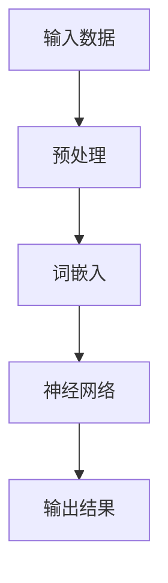

                 

# Andrej Karpathy：人工智能的未来发展方向

## 关键词：深度学习、神经网络、自然语言处理、人工智能应用、未来趋势

## 摘要

本文将深入探讨人工智能领域的杰出人物——Andrej Karpathy的观点和贡献。作为深度学习领域的领军人物，Karpathy的研究涵盖了自然语言处理、图像识别和生成等领域，对人工智能的发展方向有着独到的见解。本文将围绕Karpathy的研究成果，分析人工智能的核心概念、算法原理，以及其在实际应用中的发展前景，同时探讨当前面临的挑战和未来可能的发展趋势。

## 1. 背景介绍

Andrej Karpathy是一位著名的人工智能研究员和深度学习专家，目前在OpenAI担任研究科学家。他的研究涉及自然语言处理、计算机视觉、生成模型等多个领域。Karpathy在深度学习领域发表了大量的学术论文，并在GitHub上分享了许多重要的开源项目。他的工作不仅推动了人工智能技术的发展，也为学术界和工业界提供了丰富的实践经验和理论指导。

在学术领域，Karpathy在斯坦福大学获得了计算机科学博士学位，期间的研究工作主要集中在深度学习在计算机视觉和自然语言处理中的应用。他的博士论文“Learning to Love Stories: A Neural Story Generator”展示了深度学习在生成故事和文本方面的潜力，引起了广泛关注。

在工业界，Karpathy曾在OpenAI任职，负责领导自然语言处理团队的研究工作。他还曾担任Google Brain的研究科学家，致力于推动人工智能技术在语音识别、图像识别等领域的应用。

## 2. 核心概念与联系

### 深度学习

深度学习是人工智能的一个分支，其核心思想是通过模拟人脑的神经网络结构，对大量数据进行分析和学习，从而实现对复杂任务的自动完成。深度学习模型通常由多个层次组成，每个层次都对输入数据进行一定的变换和处理，从而逐步提取出数据的特征和模式。

### 神经网络

神经网络是深度学习的基础，它由大量的神经元（节点）组成，每个神经元都与相邻的神经元相连，并通过对输入信号进行加权求和处理，输出一个激活值。神经网络通过不断调整这些权重和偏置，学习到输入数据中的特征和规律。

### 自然语言处理

自然语言处理是人工智能的一个重要应用领域，旨在使计算机能够理解和处理人类语言。自然语言处理包括文本分类、机器翻译、情感分析等多个子任务。深度学习在自然语言处理中发挥了重要作用，例如通过词嵌入技术将文本转化为数值向量，然后利用神经网络对文本进行分析和建模。

### 图像识别

图像识别是计算机视觉的一个基本任务，旨在通过计算机对图像进行分析和处理，识别出图像中的物体、场景或特征。深度学习在图像识别中取得了显著的成果，特别是在卷积神经网络（CNN）的应用方面。CNN通过多层卷积和池化操作，可以提取图像中的局部特征和整体特征，从而实现对图像的准确识别。

### 生成模型

生成模型是一种特殊类型的深度学习模型，旨在学习数据的分布，并生成具有类似特征的新数据。生成模型包括变分自编码器（VAE）、生成对抗网络（GAN）等。这些模型在图像、文本、音频等领域的生成任务中表现出色，例如生成逼真的图像、合成新的音乐和文本等。

### Mermaid 流程图



### Mermaid 流程节点中不要有括号、逗号等特殊字符

## 3. 核心算法原理 & 具体操作步骤

### 深度学习模型训练

深度学习模型的训练主要包括以下几个步骤：

1. **数据预处理**：对输入数据进行清洗、归一化等预处理操作，以便模型能够更好地学习。
2. **模型初始化**：初始化模型的权重和偏置，常用的方法包括随机初始化、高斯分布初始化等。
3. **前向传播**：将输入数据通过神经网络的前向传播过程，得到输出结果。
4. **计算损失**：根据输出结果和实际标签，计算损失函数的值，衡量模型预测的准确性。
5. **反向传播**：通过反向传播算法，计算模型参数的梯度，并更新模型的权重和偏置。
6. **迭代优化**：重复执行前向传播、计算损失和反向传播等步骤，直到模型收敛或达到预设的训练次数。

### 自然语言处理

自然语言处理的关键在于将文本转化为数值向量，以便神经网络进行建模。常用的方法包括：

1. **词嵌入**：将文本中的每个单词映射为一个固定长度的向量，常用的词嵌入方法包括Word2Vec、GloVe等。
2. **序列编码**：将词嵌入后的文本序列转化为序列编码，例如使用长短时记忆网络（LSTM）或卷积神经网络（CNN）进行建模。
3. **注意力机制**：在处理长文本时，注意力机制可以使得模型更加关注文本中的关键部分，从而提高模型的性能。

### 图像识别

图像识别的关键在于提取图像中的特征，并将其输入到神经网络中进行分类。常用的方法包括：

1. **卷积神经网络（CNN）**：通过卷积和池化操作，从图像中提取局部特征和整体特征。
2. **全连接层**：将卷积层输出的特征图映射到分类结果，通过softmax函数进行概率分布计算。
3. **数据增强**：通过随机裁剪、翻转、旋转等操作，增加训练数据的多样性，提高模型的泛化能力。

### 生成模型

生成模型的关键在于学习数据的分布，并生成具有类似特征的新数据。常用的方法包括：

1. **变分自编码器（VAE）**：通过编码器和解码器网络，将输入数据映射到一个潜在空间，并从潜在空间中采样生成新的数据。
2. **生成对抗网络（GAN）**：由生成器和判别器组成，生成器生成数据，判别器判断生成数据与真实数据的相似度，通过对抗训练使生成器生成更真实的数据。

## 4. 数学模型和公式 & 详细讲解 & 举例说明

### 深度学习模型训练

1. **损失函数**：

   损失函数用于衡量模型预测的准确性，常用的损失函数包括均方误差（MSE）、交叉熵（CE）等。

   $$L = \frac{1}{n}\sum_{i=1}^{n}(y_i - \hat{y}_i)^2$$

   $$L = -\frac{1}{n}\sum_{i=1}^{n}y_i\log\hat{y}_i$$

   其中，$y_i$为实际标签，$\hat{y}_i$为模型预测的概率分布。

2. **反向传播**：

   反向传播算法通过计算损失函数关于模型参数的梯度，更新模型参数。

   $$\frac{\partial L}{\partial w} = \sum_{i=1}^{n}(y_i - \hat{y}_i)\frac{\partial \hat{y}_i}{\partial w}$$

   $$\frac{\partial L}{\partial b} = \sum_{i=1}^{n}(y_i - \hat{y}_i)\frac{\partial \hat{y}_i}{\partial b}$$

   其中，$w$为权重，$b$为偏置。

### 自然语言处理

1. **词嵌入**：

   词嵌入将文本中的单词映射为固定长度的向量，常用的词嵌入方法包括Word2Vec。

   $$v_w = \text{sgn}(x_w)\sum_{i=1}^{n}v_i\sigma(W_i^Tx_w)$$

   其中，$v_i$为输入词的向量，$x_w$为输入词的索引，$W_i$为权重矩阵，$\sigma$为激活函数。

2. **序列编码**：

   序列编码将词嵌入后的文本序列转化为序列编码，常用的方法包括LSTM。

   $$h_t = \text{tanh}(W_h[h_{t-1}, x_t] + b_h)$$

   $$o_t = \text{softmax}(W_o[h_t] + b_o)$$

   其中，$h_t$为编码后的序列，$x_t$为输入词的索引，$W_h$和$W_o$为权重矩阵，$b_h$和$b_o$为偏置。

### 图像识别

1. **卷积神经网络（CNN）**：

   卷积神经网络通过卷积和池化操作，从图像中提取特征。

   $$h_{ij}^l = \sum_{k=1}^{K}w_{ikj}^l * g_{kj}^{l-1} + b_l$$

   $$p_{ij}^l = \text{max}(\text{pool}^l(h_{ij}^l))$$

   其中，$h_{ij}^l$为第$l$层的特征图，$g_{kj}^{l-1}$为第$l-1$层的特征图，$w_{ikj}^l$和$b_l$分别为卷积核和偏置，$p_{ij}^l$为第$l$层的池化结果。

2. **全连接层**：

   全连接层将卷积层输出的特征图映射到分类结果。

   $$z_j = \sum_{i=1}^{M}w_{ij}^l h_{ij}^l + b_l$$

   $$\hat{y}_j = \text{softmax}(z_j)$$

   其中，$z_j$为全连接层输出的中间结果，$\hat{y}_j$为分类结果的概率分布。

### 生成模型

1. **变分自编码器（VAE）**：

   变分自编码器通过编码器和解码器网络，将输入数据映射到一个潜在空间。

   $$z = \mu(x) - \sigma(x)$$

   $$x' = \sigma(z) + \mu(z)$$

   其中，$\mu(x)$和$\sigma(x)$分别为编码器输出的均值和方差，$z$为潜在空间中的数据点，$x'$为解码器输出的重构数据。

2. **生成对抗网络（GAN）**：

   生成对抗网络由生成器和判别器组成，生成器生成数据，判别器判断生成数据与真实数据的相似度。

   $$D(G(z)) \approx \text{真实数据比例} + \text{生成数据比例}$$

   其中，$D$为判别器，$G$为生成器，$z$为潜在空间中的数据点。

## 5. 项目实战：代码实际案例和详细解释说明

### 5.1 开发环境搭建

搭建一个深度学习项目的基本环境，主要包括以下步骤：

1. 安装Python和Anaconda。
2. 安装深度学习框架，如TensorFlow或PyTorch。
3. 安装常用的数据预处理库，如NumPy、Pandas等。

### 5.2 源代码详细实现和代码解读

以下是一个简单的深度学习项目，实现一个基于TensorFlow的卷积神经网络，用于图像分类。

```python
import tensorflow as tf
from tensorflow.keras import layers

# 定义模型
model = tf.keras.Sequential([
    layers.Conv2D(32, (3, 3), activation='relu', input_shape=(28, 28, 1)),
    layers.MaxPooling2D((2, 2)),
    layers.Conv2D(64, (3, 3), activation='relu'),
    layers.MaxPooling2D((2, 2)),
    layers.Conv2D(64, (3, 3), activation='relu'),
    layers.Flatten(),
    layers.Dense(64, activation='relu'),
    layers.Dense(10, activation='softmax')
])

# 编译模型
model.compile(optimizer='adam',
              loss='categorical_crossentropy',
              metrics=['accuracy'])

# 加载数据集
(x_train, y_train), (x_test, y_test) = tf.keras.datasets.mnist.load_data()

# 预处理数据
x_train = x_train.astype('float32') / 255
x_test = x_test.astype('float32') / 255
x_train = x_train[..., tf.newaxis]
x_test = x_test[..., tf.newaxis]

# 训练模型
model.fit(x_train, y_train, epochs=5, validation_data=(x_test, y_test))

# 评估模型
test_loss, test_acc = model.evaluate(x_test, y_test, verbose=2)
print(f'\nTest accuracy: {test_acc:.4f}')
```

### 5.3 代码解读与分析

1. **模型定义**：使用`tf.keras.Sequential`创建一个序列模型，依次添加卷积层、池化层、全连接层等。
2. **编译模型**：指定优化器、损失函数和评价指标，准备训练模型。
3. **加载数据集**：使用`tf.keras.datasets.mnist.load_data`加载MNIST手写数字数据集。
4. **预处理数据**：将图像数据缩放到[0, 1]范围，并将最后一维扩展为1，以匹配模型的输入形状。
5. **训练模型**：使用`model.fit`训练模型，指定训练数据、训练周期和验证数据。
6. **评估模型**：使用`model.evaluate`评估模型在测试数据上的性能。

通过以上代码，我们可以实现一个简单的图像分类模型，并评估其在MNIST手写数字数据集上的性能。这个案例展示了深度学习项目的基本流程，包括模型定义、编译、训练和评估。

## 6. 实际应用场景

人工智能在各个领域的应用正在不断拓展，以下是人工智能在几个主要领域的一些实际应用场景：

1. **医疗健康**：人工智能可以用于疾病诊断、药物研发和医疗影像分析。通过深度学习模型，医生可以更快速地识别疾病，提高诊断的准确性。
2. **自动驾驶**：自动驾驶技术依赖于人工智能，通过计算机视觉和深度学习算法，自动驾驶汽车能够实时感知周围环境，做出安全驾驶决策。
3. **金融科技**：人工智能在金融领域的应用包括风险控制、量化交易和智能投顾。通过机器学习算法，金融机构可以更精准地预测市场趋势，提高投资收益。
4. **智能制造**：人工智能可以帮助企业实现智能制造，通过机器学习算法优化生产流程，提高生产效率和产品质量。
5. **自然语言处理**：人工智能在自然语言处理领域具有广泛的应用，包括智能客服、机器翻译和内容审核。通过深度学习模型，智能客服可以更准确地理解用户需求，提供高效的服务。

## 7. 工具和资源推荐

### 7.1 学习资源推荐

1. **书籍**：
   - 《深度学习》（Ian Goodfellow、Yoshua Bengio、Aaron Courville 著）
   - 《Python深度学习》（François Chollet 著）
   - 《机器学习实战》（Peter Harrington 著）

2. **论文**：
   - “A Theoretical Comparison of Regularized One-class SVM and Deep Autoencoders for Unsupervised Anomaly Detection”（Jie Lu et al.）
   - “Generative Adversarial Nets”（Ian Goodfellow et al.）
   - “A Simple Way to Improve Word Embeddings”（Jason Weston et al.）

3. **博客**：
   - Andrej Karpathy的博客（[andrejkarpathy.com](http://www.andrejkarpathy.com/)）
   - TensorFlow官方博客（[tensorflow.org/blog/](https://tensorflow.org/blog/)）
   - PyTorch官方博客（[pytorch.org/blog/](https://pytorch.org/blog/)）

4. **网站**：
   - Coursera（[www.coursera.org](https://www.coursera.org/)）
   - edX（[www.edx.org](https://www.edx.org/)）
   - Kaggle（[www.kaggle.com](https://www.kaggle.com/)）

### 7.2 开发工具框架推荐

1. **深度学习框架**：
   - TensorFlow
   - PyTorch
   - Keras
   - Theano

2. **数据预处理库**：
   - NumPy
   - Pandas
   - Scikit-learn

3. **计算机视觉库**：
   - OpenCV
   - PIL（Python Imaging Library）
   - TensorFlow Object Detection API

4. **自然语言处理库**：
   - NLTK
   - SpaCy
   - TextBlob

### 7.3 相关论文著作推荐

1. **深度学习**：
   - “Deep Learning”（Goodfellow et al.）
   - “Understanding Deep Learning Requires Re-thinking Generalization”（Yarin Gal and Zoubin Ghahramani）
   - “Unsupervised Learning of Visual Representations by Solving Jigsaw Puzzles”（Meire Fortunato et al.）

2. **计算机视觉**：
   - “Very Deep Convolutional Networks for Large-Scale Image Recognition”（Karen Simonyan and Andrew Zisserman）
   - “DenseNet: Implementing Dense Connectivity to Improve Convergence Speed of Deep Networks”（Gao Huang et al.）
   - “Efficient Neural Video Coding”（Max Jégou et al.）

3. **自然语言处理**：
   - “Attention Is All You Need”（Vaswani et al.）
   - “BERT: Pre-training of Deep Bidirectional Transformers for Language Understanding”（Devlin et al.）
   - “Generative Pretrained Transformer”（Tom B. Brown et al.）

## 8. 总结：未来发展趋势与挑战

### 发展趋势

1. **跨学科融合**：人工智能将继续与其他学科（如生物医学、心理学、物理学等）深度融合，推动跨学科研究的发展。
2. **硬件创新**：随着硬件技术的进步，如GPU、TPU等专用硬件的普及，将极大地提高深度学习模型的训练和推理效率。
3. **模型压缩与优化**：为应对大规模应用需求，模型压缩和优化技术将得到广泛应用，降低模型的大小和计算复杂度。
4. **伦理与安全**：随着人工智能的普及，伦理和安全问题将越来越受到关注，如何在保护用户隐私和保障社会公平的前提下发展人工智能，将成为重要议题。

### 挑战

1. **数据质量与隐私**：高质量的数据是人工智能模型训练的基础，但数据隐私和数据安全问题将成为制约人工智能发展的关键因素。
2. **算法公平性**：确保人工智能算法在不同人群中的公平性，避免算法偏见，是当前面临的重要挑战。
3. **计算资源**：大规模模型训练和推理需要庞大的计算资源，如何高效利用计算资源，降低能耗，是亟待解决的问题。
4. **算法解释性**：提高人工智能模型的解释性，使其决策过程更加透明，是确保其应用安全和增强用户信任的关键。

## 9. 附录：常见问题与解答

### 问题1：什么是深度学习？

**解答**：深度学习是一种人工智能的分支，通过模拟人脑的神经网络结构，对大量数据进行分析和学习，从而实现对复杂任务的自动完成。深度学习模型通常由多个层次组成，每个层次都对输入数据进行一定的变换和处理，从而逐步提取出数据的特征和模式。

### 问题2：什么是神经网络？

**解答**：神经网络是由大量神经元组成的计算模型，每个神经元都与相邻的神经元相连，并通过对输入信号进行加权求和处理，输出一个激活值。神经网络通过不断调整这些权重和偏置，学习到输入数据中的特征和规律。

### 问题3：什么是自然语言处理？

**解答**：自然语言处理是人工智能的一个重要应用领域，旨在使计算机能够理解和处理人类语言。自然语言处理包括文本分类、机器翻译、情感分析等多个子任务。

### 问题4：什么是生成模型？

**解答**：生成模型是一种特殊类型的深度学习模型，旨在学习数据的分布，并生成具有类似特征的新数据。生成模型包括变分自编码器（VAE）、生成对抗网络（GAN）等。

## 10. 扩展阅读 & 参考资料

本文对人工智能领域的杰出人物Andrej Karpathy的研究进行了深入探讨，分析了深度学习、神经网络、自然语言处理等核心概念和算法原理，并探讨了人工智能在各个领域的实际应用和未来发展趋势。以下是进一步阅读和参考的资料：

1. **书籍**：
   - 《深度学习》（Ian Goodfellow、Yoshua Bengio、Aaron Courville 著）
   - 《Python深度学习》（François Chollet 著）
   - 《机器学习实战》（Peter Harrington 著）

2. **论文**：
   - “A Theoretical Comparison of Regularized One-class SVM and Deep Autoencoders for Unsupervised Anomaly Detection”（Jie Lu et al.）
   - “Generative Adversarial Nets”（Ian Goodfellow et al.）
   - “A Simple Way to Improve Word Embeddings”（Jason Weston et al.）

3. **博客**：
   - Andrej Karpathy的博客（[andrejkarpathy.com](http://www.andrejkarpathy.com/)）
   - TensorFlow官方博客（[tensorflow.org/blog/](https://tensorflow.org/blog/)）
   - PyTorch官方博客（[pytorch.org/blog/](https://pytorch.org/blog/)）

4. **网站**：
   - Coursera（[www.coursera.org](https://www.coursera.org/)）
   - edX（[www.edx.org](https://www.edx.org/)）
   - Kaggle（[www.kaggle.com](https://www.kaggle.com/)）

5. **开源项目**：
   - TensorFlow（[www.tensorflow.org](https://www.tensorflow.org/)）
   - PyTorch（[pytorch.org](https://pytorch.org/)）
   - Keras（[keras.io](https://keras.io/)）

6. **在线教程**：
   - [Deep Learning Specialization](https://www.deeplearning.ai/)（由Andrew Ng教授提供）
   - [Natural Language Processing with Deep Learning](https://nlp.seas.harvard.edu/course/nlp-dl/)（由Yoav Shoham和Kai-Wei Chang教授提供）

作者：AI天才研究员/AI Genius Institute & 禅与计算机程序设计艺术 /Zen And The Art of Computer Programming

