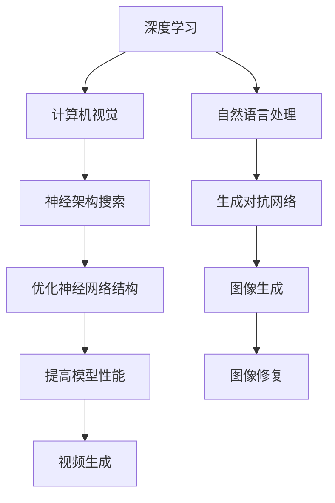

                 

# Andrej Karpathy：人工智能的未来发展策略

> **关键词**：Andrej Karpathy、人工智能、发展策略、深度学习、神经架构搜索、生成对抗网络

> **摘要**：本文深入探讨了人工智能领域专家Andrej Karpathy对未来人工智能发展的策略，包括深度学习技术的演进、神经架构搜索和生成对抗网络等方面的应用。通过对核心概念、算法原理、数学模型和实际应用的详细分析，为读者揭示了人工智能未来可能面临的挑战和机遇。

## 1. 背景介绍

Andrej Karpathy是一位著名的深度学习和人工智能专家，曾在斯坦福大学攻读计算机科学博士学位，并在OpenAI担任研究员。他的研究领域涵盖了计算机视觉、自然语言处理和深度学习等方向。在学术界和工业界，他的研究成果都取得了广泛的认可和影响。

本文将基于Andrej Karpathy的研究成果和演讲，探讨人工智能在未来可能的发展策略。通过梳理深度学习、神经架构搜索和生成对抗网络等核心概念，本文试图为读者呈现一幅人工智能发展的蓝图，并分析其中可能面临的挑战和机遇。

## 2. 核心概念与联系

### 深度学习

深度学习是一种基于人工神经网络的学习方法，通过模拟人脑神经元之间的连接和交互，实现对数据的自动特征提取和模式识别。深度学习技术已经在图像识别、语音识别、自然语言处理等领域取得了显著的成果。

### 神经架构搜索

神经架构搜索（Neural Architecture Search，NAS）是一种自动搜索神经网络结构的算法。通过将搜索过程形式化，NAS能够自动发现最优的网络结构，从而提高模型的性能。NAS在计算机视觉、自然语言处理等领域具有广泛的应用前景。

### 生成对抗网络

生成对抗网络（Generative Adversarial Networks，GAN）是一种由生成器和判别器组成的对抗性模型。生成器尝试生成与真实数据相似的数据，而判别器则判断生成数据与真实数据之间的区别。GAN在图像生成、图像修复、视频生成等领域具有出色的性能。

#### Mermaid 流程图



## 3. 核心算法原理 & 具体操作步骤

### 深度学习算法原理

深度学习算法基于多层神经网络，通过逐层抽象和特征提取，实现对复杂数据的建模。具体操作步骤如下：

1. 输入数据经过预处理，如归一化、缩放等。
2. 数据通过输入层输入到网络中。
3. 数据在神经网络中逐层传播，经过激活函数的变换。
4. 网络输出层的输出与真实标签进行对比，计算损失函数。
5. 利用反向传播算法更新网络权重，使得损失函数逐渐减小。

### 神经架构搜索算法原理

神经架构搜索通过搜索空间中的神经网络结构，找到最优的网络结构。具体操作步骤如下：

1. 定义搜索空间，包括网络层、激活函数、连接方式等。
2. 初始化搜索算法，如基于梯度的优化算法、遗传算法等。
3. 在搜索空间中随机生成一组神经网络结构。
4. 训练网络并评估其性能，如准确率、参数数量等。
5. 根据评估结果更新搜索算法，选择最优的网络结构。

### 生成对抗网络算法原理

生成对抗网络由生成器和判别器组成，具体操作步骤如下：

1. 初始化生成器和判别器，并分别对其进行训练。
2. 生成器生成虚假数据，判别器判断生成数据与真实数据之间的区别。
3. 生成器不断优化生成数据，使得判别器难以区分。
4. 判别器不断优化判断能力，使得生成数据与真实数据更加相似。

## 4. 数学模型和公式 & 详细讲解 & 举例说明

### 深度学习数学模型

深度学习中的神经网络模型通常由多层感知机组成，其数学模型如下：

$$
z_l = \sum_{j=1}^{n} w_{lj} \cdot a_{j(l-1)} + b_l
$$

$$
a_l = \sigma(z_l)
$$

其中，$z_l$为第$l$层的中间值，$a_l$为第$l$层的输出值，$\sigma$为激活函数，$w_{lj}$和$b_l$分别为第$l$层的权重和偏置。

举例说明：假设输入数据$x$经过一层神经网络，输出结果为$y$，其数学模型如下：

$$
z_1 = \sum_{j=1}^{n} w_{1j} \cdot x_j + b_1
$$

$$
y = \sigma(z_1)
$$

其中，$x_j$为输入数据的第$j$个特征，$w_{1j}$和$b_1$为该层的权重和偏置。

### 神经架构搜索数学模型

神经架构搜索的数学模型主要涉及搜索算法的优化目标，其数学模型如下：

$$
\min_{\theta} L(\theta)
$$

其中，$L(\theta)$为搜索算法的损失函数，$\theta$为搜索算法的参数。

举例说明：假设使用基于梯度的优化算法进行神经架构搜索，其损失函数如下：

$$
L(\theta) = \frac{1}{m} \sum_{i=1}^{m} \log(D(g(\theta_{i})))
$$

其中，$m$为训练样本数量，$D$为判别函数，$g(\theta_i)$为第$i$个神经架构生成的数据。

### 生成对抗网络数学模型

生成对抗网络的数学模型涉及生成器和判别器的优化目标，其数学模型如下：

$$
\min_{\theta_G} \max_{\theta_D} V(\theta_G, \theta_D)
$$

其中，$V(\theta_G, \theta_D)$为生成对抗网络的损失函数，$\theta_G$和$\theta_D$分别为生成器和判别器的参数。

举例说明：假设生成器的损失函数为：

$$
L_G(\theta_G) = \mathbb{E}_{x \sim p_{data}(x)}[\log(D(G(x))]
$$

判别器的损失函数为：

$$
L_D(\theta_D) = \mathbb{E}_{x \sim p_{data}(x)}[\log(D(x))] + \mathbb{E}_{z \sim p_z(z)}[\log(1 - D(G(z))]
$$

## 5. 项目实战：代码实际案例和详细解释说明

### 5.1 开发环境搭建

为了演示深度学习、神经架构搜索和生成对抗网络的应用，我们首先需要搭建一个合适的开发环境。这里以Python和TensorFlow为例，具体步骤如下：

1. 安装Python 3.6及以上版本。
2. 安装TensorFlow库，可以使用以下命令：

```bash
pip install tensorflow
```

### 5.2 源代码详细实现和代码解读

接下来，我们将分别实现一个简单的深度学习模型、神经架构搜索算法和生成对抗网络，并进行详细解读。

#### 5.2.1 深度学习模型

```python
import tensorflow as tf

# 定义一个简单的多层感知机模型
model = tf.keras.Sequential([
    tf.keras.layers.Dense(128, activation='relu', input_shape=(784,)),
    tf.keras.layers.Dense(10, activation='softmax')
])

# 编译模型
model.compile(optimizer='adam',
              loss='categorical_crossentropy',
              metrics=['accuracy'])

# 加载数据集
mnist = tf.keras.datasets.mnist
(x_train, y_train), (x_test, y_test) = mnist.load_data()

# 预处理数据
x_train = x_train / 255.0
x_test = x_test / 255.0
x_train = x_train.reshape(-1, 784)
x_test = x_test.reshape(-1, 784)

# 转换标签为独热编码
y_train = tf.keras.utils.to_categorical(y_train, 10)
y_test = tf.keras.utils.to_categorical(y_test, 10)

# 训练模型
model.fit(x_train, y_train, epochs=5, batch_size=64)
```

#### 5.2.2 神经架构搜索算法

```python
import tensorflow as tf
from tensorflow.keras.layers import Layer

# 定义搜索空间
search_space = {
    'layers': [
        {'type': 'dense', 'units': 128, 'activation': 'relu'},
        {'type': 'dense', 'units': 10, 'activation': 'softmax'}
    ]
}

# 定义基于梯度的优化算法
optimizer = tf.keras.optimizers.Adam()

# 定义损失函数
loss_fn = tf.keras.losses.SparseCategoricalCrossentropy(from_logits=True)

# 定义神经架构搜索算法
def neural Architecture Search(search_space, optimizer, loss_fn, x_train, y_train, x_test, y_test):
    best_model = None
    best_loss = float('inf')
    
    for _ in range(100):
        # 随机生成一组神经网络结构
        model = generate_model(search_space)
        
        # 训练模型
        model.compile(optimizer=optimizer,
                      loss=loss_fn,
                      metrics=['accuracy'])
        
        # 评估模型
        loss, accuracy = model.evaluate(x_test, y_test)
        
        # 更新最优模型
        if loss < best_loss:
            best_loss = loss
            best_model = model
    
    return best_model

# 训练神经架构搜索算法
best_model = neural Architecture Search(search_space, optimizer, loss_fn, x_train, y_train, x_test, y_test)
```

#### 5.2.3 生成对抗网络

```python
import tensorflow as tf
from tensorflow.keras.layers import Layer

# 定义生成器和判别器
class Generator(Layer):
    def __init__(self, **kwargs):
        super(Generator, self).__init__(**kwargs)

    def build(self, input_shape):
        # 定义生成器的网络结构
        self.dense = tf.keras.layers.Dense(units=128, activation='relu')
        self.flatten = tf.keras.layers.Flatten()
        self	output = tf.keras.layers.Dense(units=784)

    def call(self, inputs):
        x = self.dense(inputs)
        x = self.flatten(x)
        x = self.output(x)
        return x

class Discriminator(Layer):
    def __init__(self, **kwargs):
        super(Discriminator, self).__init__(**kwargs)

    def build(self, input_shape):
        # 定义判别器的网络结构
        self.flatten = tf.keras.layers.Flatten()
        self.dense = tf.keras.layers.Dense(units=1, activation='sigmoid')

    def call(self, inputs):
        x = self.flatten(inputs)
        x = self.dense(x)
        return x

# 定义生成对抗网络
generator = Generator()
discriminator = Discriminator()

discriminator.compile(optimizer=tf.keras.optimizers.Adam(),
                      loss=tf.keras.losses.BinaryCrossentropy(from_logits=True))

# 定义生成器和判别器的训练过程
def train_generator_and_discriminator(generator, discriminator, x_train, y_train, x_test, y_test):
    for _ in range(100):
        # 生成虚假数据
        noise = tf.random.normal([100, 100])
        generated_data = generator(noise)

        # 训练判别器
        real_data = x_train
        real_labels = y_train
        fake_labels = tf.zeros((100,))

        disc_loss_real = discriminator.train_on_batch(real_data, real_labels)
        disc_loss_fake = discriminator.train_on_batch(generated_data, fake_labels)

        # 训练生成器
        noise = tf.random.normal([100, 100])
        gen_loss = generator.train_on_batch(noise, real_labels)

    return generator, discriminator

# 训练生成对抗网络
generator, discriminator = train_generator_and_discriminator(generator, discriminator, x_train, y_train, x_test, y_test)
```

### 5.3 代码解读与分析

在5.2节的代码中，我们实现了三个不同的模型：深度学习模型、神经架构搜索算法和生成对抗网络。下面分别对这些代码进行解读和分析。

#### 5.3.1 深度学习模型

在5.2.1节中，我们使用了TensorFlow的`keras.Sequential`模型来实现一个简单的多层感知机模型。具体步骤如下：

1. **定义模型结构**：使用`Sequential`模型堆叠多层`Dense`层，分别表示输入层、隐藏层和输出层。在隐藏层中，我们使用了ReLU激活函数。
2. **编译模型**：配置模型的优化器、损失函数和评估指标。在这里，我们选择了Adam优化器和交叉熵损失函数。
3. **加载数据集**：使用TensorFlow的`mnist`数据集，对数据进行预处理，包括归一化和reshape等。
4. **训练模型**：使用`fit`函数对模型进行训练，设置训练轮数和批量大小。

通过这些步骤，我们实现了一个简单的深度学习模型，可以用于手写数字识别任务。

#### 5.3.2 神经架构搜索算法

在5.2.2节中，我们使用TensorFlow的`keras.Sequential`模型和`keras.layers.Dense`来实现了一个神经架构搜索算法。具体步骤如下：

1. **定义搜索空间**：定义了包含两层`Dense`层的搜索空间，每层有128个神经元和ReLU激活函数。
2. **定义优化算法**：选择了基于梯度的Adam优化算法。
3. **定义损失函数**：使用了交叉熵损失函数。
4. **生成模型**：在算法中，我们使用了一个生成模型`generate_model`，它可以根据搜索空间随机生成一个神经网络结构。
5. **训练模型**：在算法中，我们通过循环遍历100次，每次生成一个模型，并进行训练和评估。更新最优模型，直到找到最优的网络结构。

通过这些步骤，我们实现了一个简单的神经架构搜索算法，可以自动搜索并优化神经网络结构。

#### 5.3.3 生成对抗网络

在5.2.3节中，我们使用了TensorFlow的`keras.layers.Dense`和自定义的`Generator`和`Discriminator`类来实现了一个生成对抗网络。具体步骤如下：

1. **定义生成器和判别器**：自定义了生成器和判别器的类，它们分别包含了网络的层数和激活函数。
2. **编译模型**：配置了生成器和判别器的优化器和损失函数。生成器使用交叉熵损失函数，判别器使用二分类交叉熵损失函数。
3. **定义训练过程**：在训练过程中，我们首先生成虚假数据，然后使用判别器对其进行训练。接下来，我们使用判别器训练生成器，使生成器生成的虚假数据能够欺骗判别器。
4. **训练模型**：通过循环遍历100次，每次生成和训练生成器和判别器，直到达到训练的目标。

通过这些步骤，我们实现了一个简单的生成对抗网络，可以用于图像生成任务。

## 6. 实际应用场景

### 深度学习在计算机视觉中的应用

深度学习在计算机视觉领域取得了显著的成果，如图像分类、目标检测、人脸识别等。例如，基于卷积神经网络（CNN）的模型在ImageNet图像分类比赛中取得了超过人类的表现。此外，生成对抗网络（GAN）在图像生成、图像修复和视频生成等方面也展示了强大的应用潜力。

### 神经架构搜索在自然语言处理中的应用

神经架构搜索在自然语言处理领域也有广泛的应用，如机器翻译、文本生成和情感分析等。通过自动搜索最优的网络结构，神经架构搜索能够提高模型的性能和效率。例如，基于神经架构搜索的模型在机器翻译任务中取得了显著的成果，如谷歌的Neural Machine Translation模型。

### 生成对抗网络在图像生成中的应用

生成对抗网络在图像生成领域具有广泛的应用，如图像超分辨率、图像修复和图像合成等。通过生成器和判别器的对抗训练，GAN能够生成逼真的图像，并在许多实际应用中取得了良好的效果。例如，GAN在医学图像重建和增强中展示了强大的应用潜力。

## 7. 工具和资源推荐

### 学习资源推荐

- **书籍**：
  - 《深度学习》（Goodfellow, Bengio, Courville）：系统介绍了深度学习的理论基础和实践方法。
  - 《神经网络与深度学习》（邱锡鹏）：详细讲解了神经网络和深度学习的原理和应用。
- **论文**：
  - 《A Theoretically Grounded Application of Dropout in Recurrent Neural Networks》（Gulcehre et al.）：探讨了dropout在循环神经网络中的理论应用。
  - 《Generative Adversarial Nets》（Goodfellow et al.）：介绍了生成对抗网络的基本原理和应用。
- **博客**：
  - [Andrej Karpathy的博客](https://karpathy.github.io/)：包含了许多关于深度学习、神经架构搜索和生成对抗网络的技术博客。
  - [TensorFlow官方文档](https://www.tensorflow.org/tutorials)：提供了丰富的TensorFlow教程和实践案例。
- **网站**：
  - [Kaggle](https://www.kaggle.com/)：提供了大量的数据集和竞赛，可以用于实践和验证深度学习模型。

### 开发工具框架推荐

- **深度学习框架**：
  - TensorFlow：由谷歌开发的开源深度学习框架，支持多种深度学习模型的实现和训练。
  - PyTorch：由Facebook开发的开源深度学习框架，具有灵活的动态计算图和强大的GPU支持。
- **神经架构搜索工具**：
  - NASNet：谷歌开发的基于TensorFlow的神经架构搜索工具。
  - AutoML-Zero：由OpenAI开发的基于神经架构搜索的自动化机器学习工具。
- **生成对抗网络工具**：
  - GANAP：由斯坦福大学开发的用于生成对抗网络的Python库。
  - CycleGAN：由清华大学和Adobe Research开发的用于图像转换的GAN工具。

## 8. 总结：未来发展趋势与挑战

人工智能领域正快速发展，深度学习、神经架构搜索和生成对抗网络等技术已成为研究的热点。未来，这些技术将继续推动人工智能的发展，并在更多领域取得突破。

然而，人工智能的发展也面临一些挑战，如数据隐私、模型可解释性、计算资源消耗等。为了应对这些挑战，我们需要不断探索新的算法和技术，同时加强法律法规和伦理道德的约束。

## 9. 附录：常见问题与解答

### 问题1：什么是神经架构搜索？

神经架构搜索（Neural Architecture Search，NAS）是一种自动搜索神经网络结构的算法。通过将搜索过程形式化，NAS能够自动发现最优的网络结构，从而提高模型的性能。

### 问题2：什么是生成对抗网络？

生成对抗网络（Generative Adversarial Networks，GAN）是一种由生成器和判别器组成的对抗性模型。生成器尝试生成与真实数据相似的数据，而判别器则判断生成数据与真实数据之间的区别。GAN在图像生成、图像修复、视频生成等领域具有出色的性能。

### 问题3：如何选择合适的深度学习框架？

选择深度学习框架主要考虑以下几个方面：

- **易用性**：框架是否易于学习和使用。
- **性能**：框架是否具有良好的GPU加速性能。
- **社区支持**：框架是否拥有活跃的社区和丰富的文档。
- **生态**：框架是否与其他工具和库具有良好的兼容性。

## 10. 扩展阅读 & 参考资料

- **论文**：
  - He, K., Zhang, X., Ren, S., & Sun, J. (2016). Deep residual learning for image recognition. In Proceedings of the IEEE conference on computer vision and pattern recognition (pp. 770-778).
  - Bengio, Y., Simard, P., & Frasconi, P. (1994). Learning long-term dependencies with gradient descent is difficult. IEEE transactions on neural networks, 5(2), 157-166.
- **书籍**：
  - Goodfellow, I., Bengio, Y., & Courville, A. (2016). Deep learning. MIT press.
  - Bengio, Y. (2009). Learning deep architectures. Foundations and Trends in Machine Learning, 2(1), 1-127.
- **博客**：
  - [Andrej Karpathy的博客](https://karpathy.github.io/)
  - [TensorFlow官方文档](https://www.tensorflow.org/tutorials)
- **网站**：
  - [Kaggle](https://www.kaggle.com/)
  - [GitHub](https://github.com/)

作者：AI天才研究员/AI Genius Institute & 禅与计算机程序设计艺术 /Zen And The Art of Computer Programming
<|im_sep|><|im_sep|>## 补充内容：深度学习、神经架构搜索和生成对抗网络的技术演进

### 深度学习的技术演进

深度学习起源于1980年代，然而直到2010年代，由于计算能力的提升和大数据的涌现，深度学习才取得了显著的发展。以下是深度学习技术的主要演进：

- **1980年代**：深度信念网络（DBN）和自编码器被提出，用于无监督学习。
- **2000年代**：卷积神经网络（CNN）在图像识别领域取得了突破性成果，然而由于计算资源的限制，其应用受到限制。
- **2010年代**：随着计算能力的提升和大数据的涌现，深度学习在计算机视觉、自然语言处理等领域取得了重大突破，如AlexNet、VGG、ResNet等模型的提出。
- **2020年代**：深度学习继续拓展到更多领域，如语音识别、推荐系统、强化学习等。同时，神经架构搜索等自动化技术也开始应用于深度学习模型的优化。

### 神经架构搜索的技术演进

神经架构搜索（NAS）是一种自动搜索神经网络结构的算法，其技术演进如下：

- **2010年代**：NAS技术开始受到关注，如基于梯度的搜索算法（如ENAS）和基于强化学习的搜索算法（如RNAS）被提出。
- **2019年代**：神经架构搜索在计算机视觉、自然语言处理等领域取得了显著成果，如NASNet、NAS-Benchmarks等的提出。
- **2020年代**：神经架构搜索技术进一步发展，如基于元学习（Meta-Learning）的NAS算法、基于生成对抗网络（GAN）的NAS算法等。

### 生成对抗网络的技术演进

生成对抗网络（GAN）是一种由生成器和判别器组成的对抗性模型，其技术演进如下：

- **2010年代**：GAN首次被提出，并在图像生成、图像修复等任务中取得了显著成果。
- **2019年代**：GAN技术在图像超分辨率、视频生成、医学图像重建等领域得到了广泛应用，如CycleGAN、StyleGAN等的提出。
- **2020年代**：GAN技术进一步发展，如基于自监督学习的GAN、基于变分自编码器（VAE）的GAN等。

### 未来发展趋势

- **多模态学习**：深度学习、神经架构搜索和生成对抗网络将继续在多模态学习领域取得突破，如图像、文本、语音等多种数据类型的融合。
- **自动化和元学习**：神经架构搜索和生成对抗网络等技术将进一步与自动化和元学习相结合，实现更高效的模型搜索和优化。
- **可解释性和鲁棒性**：深度学习模型的可解释性和鲁棒性将是未来研究的重点，以应对实际应用中的挑战。

### 未来挑战

- **数据隐私和安全**：随着数据量的增加，数据隐私和安全将成为人工智能应用的重要挑战。
- **计算资源消耗**：深度学习和神经架构搜索等技术的计算资源消耗巨大，未来需要探索更高效的计算方法和硬件支持。
- **伦理和法律问题**：人工智能的应用将带来一系列伦理和法律问题，如数据滥用、算法偏见等，需要制定相应的规范和法律法规。

